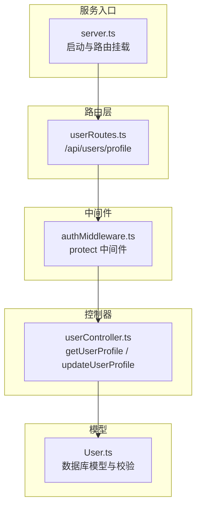
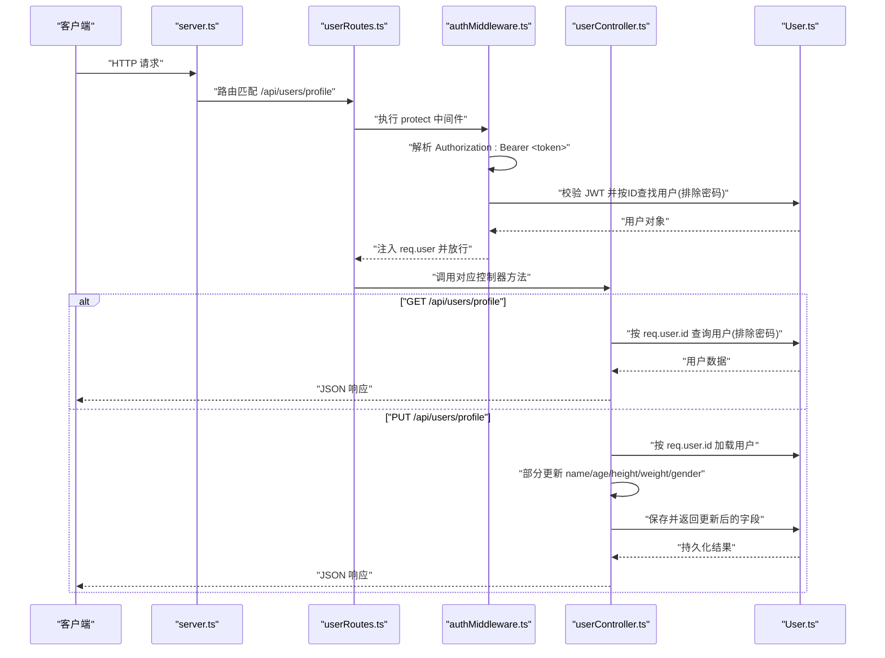
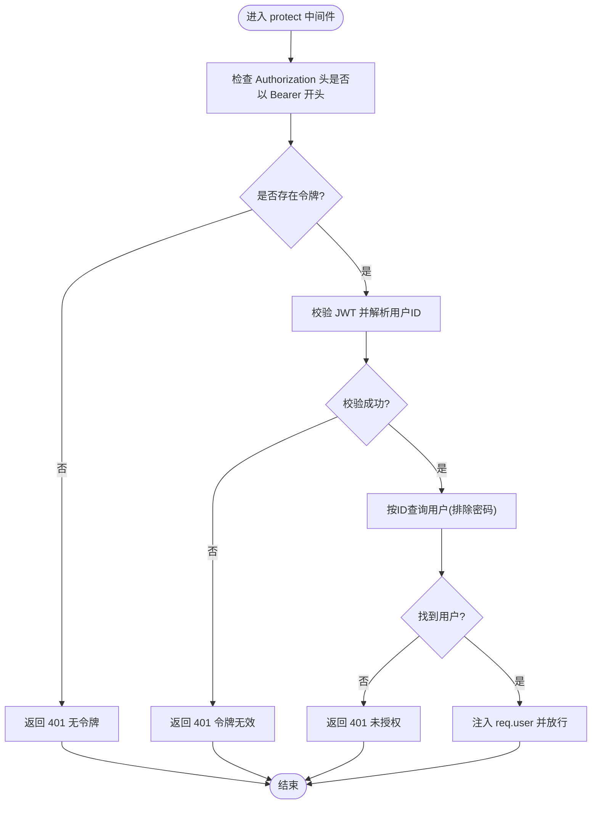
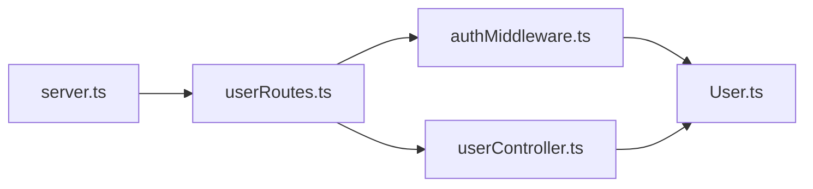

# 用户接口

<cite>
**本文引用的文件**
- [backend/src/controllers/userController.ts](file://backend/src/controllers/userController.ts)
- [backend/src/middleware/authMiddleware.ts](file://backend/src/middleware/authMiddleware.ts)
- [backend/src/models/User.ts](file://backend/src/models/User.ts)
- [backend/src/routes/userRoutes.ts](file://backend/src/routes/userRoutes.ts)
- [backend/src/server.ts](file://backend/src/server.ts)
- [docs/4. API接口文档.md](file://docs/4. API接口文档.md)
- [backend/src/controllers/authController.ts](file://backend/src/controllers/authController.ts)
</cite>

## 目录
1. [简介](#简介)
2. [项目结构](#项目结构)
3. [核心组件](#核心组件)
4. [架构总览](#架构总览)
5. [详细组件分析](#详细组件分析)
6. [依赖关系分析](#依赖关系分析)
7. [性能考量](#性能考量)
8. [故障排查指南](#故障排查指南)
9. [结论](#结论)

## 简介
本文件聚焦于用户资料查询与更新两个受保护接口：GET /api/users/profile 和 PUT /api/users/profile。文档明确以下要点：
- 接口均需 Authorization: Bearer <JWT> 请求头进行认证
- 获取资料时返回字段包含 id、name、email 及个人健康信息 age、height、weight、gender
- 更新资料支持部分更新，仅对 name、age、height、weight、gender 字段生效
- 安全性保障：JWT 解析出当前用户ID，控制器仅允许访问或修改自身资料；密码字段在模型层被排除，避免泄露
- 提供请求与响应示例路径，便于前后端对接

## 项目结构
后端采用分层架构，路由层负责挂载端点，中间件层负责鉴权，控制器层处理业务逻辑，模型层定义数据结构与校验规则。

图表来源
- [backend/src/server.ts](file://backend/src/server.ts#L1-L36)
- [backend/src/routes/userRoutes.ts](file://backend/src/routes/userRoutes.ts#L1-L11)
- [backend/src/middleware/authMiddleware.ts](file://backend/src/middleware/authMiddleware.ts#L1-L36)
- [backend/src/controllers/userController.ts](file://backend/src/controllers/userController.ts#L1-L60)
- [backend/src/models/User.ts](file://backend/src/models/User.ts#L1-L119)

章节来源
- [backend/src/server.ts](file://backend/src/server.ts#L1-L36)
- [backend/src/routes/userRoutes.ts](file://backend/src/routes/userRoutes.ts#L1-L11)

## 核心组件
- 路由层：在 userRoutes.ts 中为 /api/users/profile 挂载 GET 与 PUT 两个端点，并统一使用 protect 中间件进行鉴权
- 鉴权中间件：authMiddleware.ts 从 Authorization 头解析 Bearer 令牌，校验通过后将用户信息注入到 req.user，供后续控制器使用
- 控制器：userController.ts 的 getUserProfile 返回当前用户资料（排除密码），updateUserProfile 支持部分更新当前用户资料
- 模型：User.ts 定义字段与校验规则，含密码哈希钩子，确保安全存储

章节来源
- [backend/src/routes/userRoutes.ts](file://backend/src/routes/userRoutes.ts#L1-L11)
- [backend/src/middleware/authMiddleware.ts](file://backend/src/middleware/authMiddleware.ts#L1-L36)
- [backend/src/controllers/userController.ts](file://backend/src/controllers/userController.ts#L1-L60)
- [backend/src/models/User.ts](file://backend/src/models/User.ts#L1-L119)

## 架构总览
下图展示从客户端到数据库的完整调用链，突出 JWT 鉴权与用户资料读写流程。

图表来源
- [backend/src/server.ts](file://backend/src/server.ts#L1-L36)
- [backend/src/routes/userRoutes.ts](file://backend/src/routes/userRoutes.ts#L1-L11)
- [backend/src/middleware/authMiddleware.ts](file://backend/src/middleware/authMiddleware.ts#L1-L36)
- [backend/src/controllers/userController.ts](file://backend/src/controllers/userController.ts#L1-L60)
- [backend/src/models/User.ts](file://backend/src/models/User.ts#L1-L119)

## 详细组件分析

### GET /api/users/profile
- 功能：返回当前登录用户的资料
- 请求头
  - Authorization: Bearer <JWT_TOKEN>
- 成功响应字段
  - id: 用户唯一标识
  - name: 用户名
  - email: 邮箱
  - age: 年龄（可选）
  - height: 身高（厘米，可选）
  - weight: 体重（公斤，可选）
  - gender: 性别（枚举值，可选）
- 错误场景
  - 未携带令牌：返回未授权
  - 令牌无效：返回未授权
  - 用户不存在：返回 404
  - 服务器错误：返回 500
- 安全性
  - 密码字段在查询时被排除
  - 仅能访问当前用户资料（由中间件保证）

章节来源
- [backend/src/controllers/userController.ts](file://backend/src/controllers/userController.ts#L1-L26)
- [backend/src/middleware/authMiddleware.ts](file://backend/src/middleware/authMiddleware.ts#L1-L36)
- [backend/src/models/User.ts](file://backend/src/models/User.ts#L1-L119)
- [docs/4. API接口文档.md](file://docs/4. API接口文档.md#L48-L68)

### PUT /api/users/profile
- 功能：更新当前登录用户的资料（部分更新）
- 请求头
  - Authorization: Bearer <JWT_TOKEN>
  - Content-Type: application/json
- 请求体字段（可选）
  - name: 用户名
  - age: 年龄
  - height: 身高（厘米）
  - weight: 体重（公斤）
  - gender: 性别
- 成功响应字段
  - id: 用户唯一标识
  - name: 用户名
  - email: 邮箱
  - age: 年龄
  - height: 身高（厘米）
  - weight: 体重（公斤）
  - gender: 性别
- 更新规则
  - 仅对 name、age、height、weight、gender 字段进行部分更新
  - 若请求体未提供某字段，则保留原值
- 安全性
  - 仅能修改当前用户资料
  - 密码字段不在请求体中暴露，模型层自动处理哈希

章节来源
- [backend/src/controllers/userController.ts](file://backend/src/controllers/userController.ts#L28-L60)
- [backend/src/middleware/authMiddleware.ts](file://backend/src/middleware/authMiddleware.ts#L1-L36)
- [backend/src/models/User.ts](file://backend/src/models/User.ts#L1-L119)
- [docs/4. API接口文档.md](file://docs/4. API接口文档.md#L70-L98)

### 鉴权中间件与越权防护
- 中间件职责
  - 从 Authorization 头提取 Bearer 令牌
  - 使用 JWT_SECRET 校验令牌有效性
  - 将用户对象（排除密码）注入 req.user
  - 未携带或无效令牌时返回 401
- 越权防护
  - 控制器通过 req.user.id 直接定位用户，避免使用 URL 参数或外部输入作为用户标识
  - 查询与更新均基于 req.user.id，确保用户只能访问/修改自己的资料

图表来源
- [backend/src/middleware/authMiddleware.ts](file://backend/src/middleware/authMiddleware.ts#L1-L36)
- [backend/src/models/User.ts](file://backend/src/models/User.ts#L1-L119)

章节来源
- [backend/src/middleware/authMiddleware.ts](file://backend/src/middleware/authMiddleware.ts#L1-L36)
- [backend/src/controllers/userController.ts](file://backend/src/controllers/userController.ts#L1-L60)

### 数据模型与校验
- 字段定义与约束
  - name、email、password 为必填
  - email 格式校验
  - password 长度范围校验
  - age、height、weight 数值范围校验
  - gender 为枚举值
- 安全钩子
  - beforeCreate/ beforeUpdate 钩子对密码进行哈希处理
- 查询排除
  - 查询用户资料时排除 password 字段，防止泄露

章节来源
- [backend/src/models/User.ts](file://backend/src/models/User.ts#L1-L119)

### 请求与响应示例
- 获取用户资料
  - 请求示例路径：[docs/4. API接口文档.md](file://docs/4. API接口文档.md#L48-L68)
  - 响应示例路径：[docs/4. API接口文档.md](file://docs/4. API接口文档.md#L48-L68)
- 更新用户资料
  - 请求示例路径：[docs/4. API接口文档.md](file://docs/4. API接口文档.md#L70-L98)
  - 响应示例路径：[docs/4. API接口文档.md](file://docs/4. API接口文档.md#L70-L98)

章节来源
- [docs/4. API接口文档.md](file://docs/4. API接口文档.md#L48-L98)

## 依赖关系分析
- 路由依赖中间件：userRoutes.ts 在 GET/PUT 上均依赖 protect 中间件
- 中间件依赖模型：authMiddleware.ts 通过 User 模型按 ID 查询用户并排除密码
- 控制器依赖模型：userController.ts 通过 User 模型进行查询与保存
- 服务入口依赖路由：server.ts 挂载 userRoutes

图表来源
- [backend/src/server.ts](file://backend/src/server.ts#L1-L36)
- [backend/src/routes/userRoutes.ts](file://backend/src/routes/userRoutes.ts#L1-L11)
- [backend/src/middleware/authMiddleware.ts](file://backend/src/middleware/authMiddleware.ts#L1-L36)
- [backend/src/controllers/userController.ts](file://backend/src/controllers/userController.ts#L1-L60)
- [backend/src/models/User.ts](file://backend/src/models/User.ts#L1-L119)

章节来源
- [backend/src/server.ts](file://backend/src/server.ts#L1-L36)
- [backend/src/routes/userRoutes.ts](file://backend/src/routes/userRoutes.ts#L1-L11)
- [backend/src/middleware/authMiddleware.ts](file://backend/src/middleware/authMiddleware.ts#L1-L36)
- [backend/src/controllers/userController.ts](file://backend/src/controllers/userController.ts#L1-L60)
- [backend/src/models/User.ts](file://backend/src/models/User.ts#L1-L119)

## 性能考量
- 中间件仅做必要校验与用户加载，复杂逻辑放在控制器
- 查询用户资料时排除 password 字段，减少传输与序列化开销
- 部分更新仅保存变更字段，降低数据库写入压力
- 建议在高并发场景下为令牌校验与数据库查询增加缓存与连接池优化（当前实现已启用连接池）

## 故障排查指南
- 401 未授权（无令牌）
  - 检查请求头是否包含 Authorization: Bearer <token>
  - 确认 JWT_SECRET 已正确配置
- 401 未授权（令牌无效）
  - 检查令牌签名是否正确、是否过期
  - 确认 JWT_SECRET 与签发时一致
- 404 用户不存在
  - 确认令牌对应的用户ID在数据库中存在
- 500 服务器错误
  - 查看服务日志，确认数据库连接与模型同步状态
- 密码泄露风险
  - 确保前端不存储明文密码，后端仅返回不含密码的用户数据

章节来源
- [backend/src/middleware/authMiddleware.ts](file://backend/src/middleware/authMiddleware.ts#L1-L36)
- [backend/src/controllers/userController.ts](file://backend/src/controllers/userController.ts#L1-L60)
- [backend/src/models/User.ts](file://backend/src/models/User.ts#L1-L119)
- [backend/src/server.ts](file://backend/src/server.ts#L1-L36)

## 结论
- GET /api/users/profile 与 PUT /api/users/profile 两个接口均受 JWT Bearer 令牌保护
- 控制器通过中间件注入的 req.user.id 实现越权防护，确保用户只能访问/修改自身资料
- 更新采用部分更新策略，仅对 name、age、height、weight、gender 生效
- 模型层内置校验与密码哈希钩子，保障数据完整性与安全性
- 文档提供了清晰的请求头格式、响应字段与示例路径，便于前后端联调