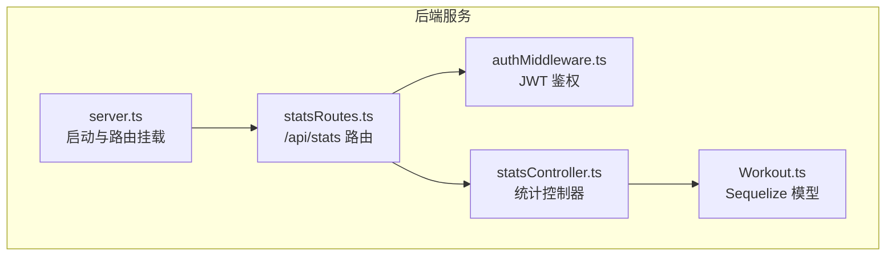
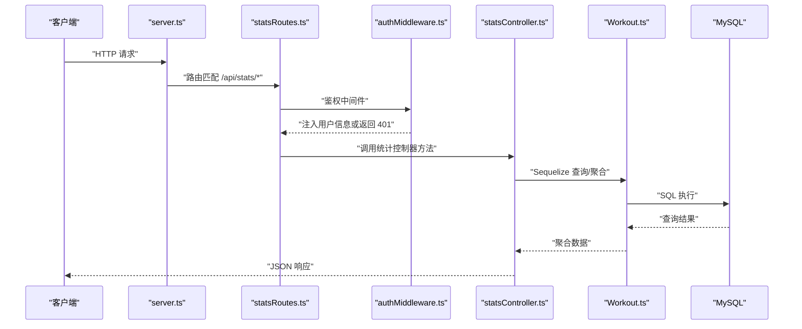
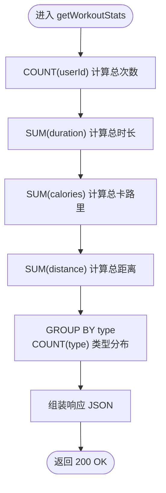
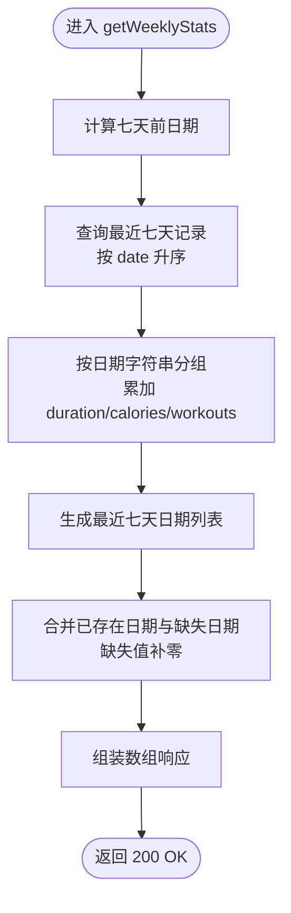
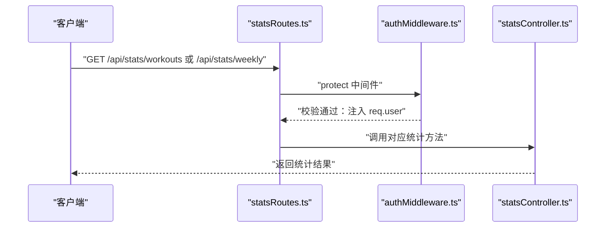
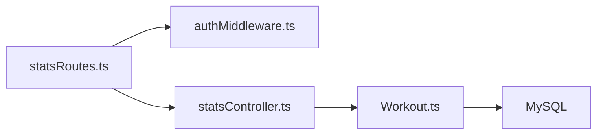

# 统计接口

<cite>
**本文引用的文件**
- [backend/src/controllers/statsController.ts](file://backend/src/controllers/statsController.ts)
- [backend/src/routes/statsRoutes.ts](file://backend/src/routes/statsRoutes.ts)
- [backend/src/middleware/authMiddleware.ts](file://backend/src/middleware/authMiddleware.ts)
- [backend/src/models/Workout.ts](file://backend/src/models/Workout.ts)
- [backend/src/server.ts](file://backend/src/server.ts)
- [backend/src/config/db.ts](file://backend/src/config/db.ts)
- [docs/4. API接口文档.md](file://docs/4. API接口文档.md)
- [docs/5. 数据库设计.md](file://docs/5. 数据库设计.md)
</cite>

## 目录
1. [简介](#简介)
2. [项目结构](#项目结构)
3. [核心组件](#核心组件)
4. [架构总览](#架构总览)
5. [详细组件分析](#详细组件分析)
6. [依赖分析](#依赖分析)
7. [性能考虑](#性能考虑)
8. [故障排查指南](#故障排查指南)
9. [结论](#结论)
10. [附录](#附录)

## 简介
本文件面向后端与前端开发者，系统化梳理“统计接口”的实现与使用，重点覆盖以下两个端点：
- GET /api/stats/workouts：总体统计，返回用户的总运动次数、总时长、总卡路里消耗、总距离及运动类型分布。
- GET /api/stats/weekly：周度统计，返回最近七天按日聚合的数据，包含每日运动次数、时长与卡路里，并补充缺失日期以保证连续性。

两个接口均需通过 JWT 认证，仅允许访问当前登录用户的数据。接口响应结构与数据聚合逻辑由后端控制器结合 Sequelize ORM 实现，数据库层面通过索引提升查询性能。

## 项目结构
统计接口位于后端服务中，采用典型的 MVC 分层：
- 路由层：定义 /api/stats 下的两个端点，并绑定鉴权中间件。
- 控制器层：实现统计逻辑，调用模型进行聚合查询与数据组装。
- 模型层：Workout 模型映射数据库表，提供聚合查询能力。
- 中间件层：JWT 鉴权，校验并解析 Token，注入用户上下文。
- 服务器入口：挂载路由与启动服务。

**图表来源**
- [backend/src/server.ts](file://backend/src/server.ts#L1-L36)
- [backend/src/routes/statsRoutes.ts](file://backend/src/routes/statsRoutes.ts#L1-L10)
- [backend/src/middleware/authMiddleware.ts](file://backend/src/middleware/authMiddleware.ts#L1-L36)
- [backend/src/controllers/statsController.ts](file://backend/src/controllers/statsController.ts#L1-L119)
- [backend/src/models/Workout.ts](file://backend/src/models/Workout.ts#L1-L122)

**章节来源**
- [backend/src/server.ts](file://backend/src/server.ts#L1-L36)
- [backend/src/routes/statsRoutes.ts](file://backend/src/routes/statsRoutes.ts#L1-L10)

## 核心组件
- 统计控制器（statsController）
  - 提供两个导出方法：总体统计与周度统计。
  - 使用 Sequelize 的聚合函数 SUM/COUNT 完成数值统计与类型分组。
  - 对周度统计进行日期归并与缺失日期填充，保证七天连续数据。
- 统计路由（statsRoutes）
  - 将 /api/stats/workouts 与 /api/stats/weekly 绑定到对应控制器方法，并统一应用鉴权保护。
- 鉴权中间件（authMiddleware）
  - 从请求头 Authorization 中提取 Bearer Token，校验签名并注入用户信息到请求对象。
- 模型（Workout）
  - 映射 workouts 表，包含 userId、date、duration、calories、distance、type 等字段，支持关联查询与聚合。

**章节来源**
- [backend/src/controllers/statsController.ts](file://backend/src/controllers/statsController.ts#L1-L119)
- [backend/src/routes/statsRoutes.ts](file://backend/src/routes/statsRoutes.ts#L1-L10)
- [backend/src/middleware/authMiddleware.ts](file://backend/src/middleware/authMiddleware.ts#L1-L36)
- [backend/src/models/Workout.ts](file://backend/src/models/Workout.ts#L1-L122)

## 架构总览
下图展示从客户端到数据库的完整调用链，包括 JWT 鉴权、路由分发、控制器执行与数据库查询。

**图表来源**
- [backend/src/server.ts](file://backend/src/server.ts#L1-L36)
- [backend/src/routes/statsRoutes.ts](file://backend/src/routes/statsRoutes.ts#L1-L10)
- [backend/src/middleware/authMiddleware.ts](file://backend/src/middleware/authMiddleware.ts#L1-L36)
- [backend/src/controllers/statsController.ts](file://backend/src/controllers/statsController.ts#L1-L119)
- [backend/src/models/Workout.ts](file://backend/src/models/Workout.ts#L1-L122)

## 详细组件分析

### 总体统计：GET /api/stats/workouts
- 功能概述
  - 返回当前登录用户的总运动次数、总时长（分钟）、总卡路里消耗、总距离（公里），以及按运动类型分组的次数分布。
- 数据来源与聚合逻辑
  - 使用模型的聚合函数对指定字段求和与计数：
    - 总次数：COUNT(userId)
    - 总时长：SUM(duration)
    - 总卡路里：SUM(calories)
    - 总距离：SUM(distance)
    - 类型分布：GROUP BY type，COUNT(type)
  - 以上聚合均限定在当前用户范围内，确保数据隔离。
- 响应结构
  - 字段说明
    - totalWorkouts：总运动次数
    - totalDuration：总时长（分钟）
    - totalCalories：总卡路里消耗
    - totalDistance：总距离（公里）
    - workoutsByType：按 type 分组的统计数组，每项包含 type 与 count
- 错误处理
  - 服务器内部错误返回统一消息，状态码 500。
- 前端使用建议
  - 可直接用于仪表盘概览卡片、类型分布饼图等可视化场景。

**图表来源**
- [backend/src/controllers/statsController.ts](file://backend/src/controllers/statsController.ts#L1-L56)
- [backend/src/models/Workout.ts](file://backend/src/models/Workout.ts#L1-L122)

**章节来源**
- [backend/src/controllers/statsController.ts](file://backend/src/controllers/statsController.ts#L1-L56)
- [docs/4. API接口文档.md](file://docs/4. API接口文档.md#L232-L249)
- [docs/5. 数据库设计.md](file://docs/5. 数据库设计.md#L42-L77)

### 周度统计：GET /api/stats/weekly
- 功能概述
  - 返回最近七天（含当天）按日聚合的运动数据，包含每日运动次数、总时长与总卡路里。
  - 若某日无运动记录，则该日三项指标为 0，保证七天连续性。
- 数据来源与聚合逻辑
  - 时间范围：从当前日期回溯七天，筛选 date >= 七天前 的记录。
  - 排序：按 date 升序排列，便于后续按自然顺序填充。
  - 归并：以日期字符串为键，累加每日的 duration、calories 与 workouts 数量。
  - 填充：循环构造最近七天的日期列表，若某日无数据则以 0 填充，形成连续数组。
- 响应结构
  - 字段说明
    - weeklyData：七天数组，每项包含 date、workouts、duration、calories
  - 注意：根据现有实现，响应结构为数组而非包含 weeklyData 字段的对象。若需与文档中的 weeklyData 字段保持一致，可在控制器中调整响应包装。
- 错误处理
  - 服务器内部错误返回统一消息，状态码 500。
- 前端使用建议
  - 可直接用于折线图/柱状图展示近七日运动趋势，或配合类型分布图进行多维分析。

**图表来源**
- [backend/src/controllers/statsController.ts](file://backend/src/controllers/statsController.ts#L58-L119)

**章节来源**
- [backend/src/controllers/statsController.ts](file://backend/src/controllers/statsController.ts#L58-L119)
- [docs/4. API接口文档.md](file://docs/4. API接口文档.md#L250-L275)
- [docs/5. 数据库设计.md](file://docs/5. 数据库设计.md#L86-L90)

### 鉴权与路由绑定
- 鉴权流程
  - 从 Authorization 请求头提取 Bearer Token，校验签名并解析用户 ID。
  - 通过用户模型按 ID 查询用户信息（排除敏感字段），成功则将用户对象注入请求上下文，继续后续处理；失败返回 401。
- 路由绑定
  - /api/stats/workouts 与 /api/stats/weekly 均绑定 protect 中间件，确保只有已登录用户可访问。
- 数据隔离
  - 所有查询均以 userId 作为过滤条件，防止越权访问他人数据。

**图表来源**
- [backend/src/routes/statsRoutes.ts](file://backend/src/routes/statsRoutes.ts#L1-L10)
- [backend/src/middleware/authMiddleware.ts](file://backend/src/middleware/authMiddleware.ts#L1-L36)
- [backend/src/controllers/statsController.ts](file://backend/src/controllers/statsController.ts#L1-L119)

**章节来源**
- [backend/src/routes/statsRoutes.ts](file://backend/src/routes/statsRoutes.ts#L1-L10)
- [backend/src/middleware/authMiddleware.ts](file://backend/src/middleware/authMiddleware.ts#L1-L36)

## 依赖分析
- 组件耦合
  - statsRoutes 依赖 authMiddleware 与 statsController，耦合度低，职责清晰。
  - statsController 依赖 Workout 模型与 Sequelize 的聚合能力，与数据库交互集中在模型层。
- 外部依赖
  - MySQL 数据库，通过 Sequelize ORM 进行连接与查询。
  - JWT 令牌用于鉴权，密钥来自环境变量。
- 索引与查询优化
  - 数据库为 userId、date、type 建立普通索引，有助于按用户与日期范围查询，以及按类型分组统计。
- 循环依赖
  - 当前模块未发现循环依赖迹象。

**图表来源**
- [backend/src/routes/statsRoutes.ts](file://backend/src/routes/statsRoutes.ts#L1-L10)
- [backend/src/middleware/authMiddleware.ts](file://backend/src/middleware/authMiddleware.ts#L1-L36)
- [backend/src/controllers/statsController.ts](file://backend/src/controllers/statsController.ts#L1-L119)
- [backend/src/models/Workout.ts](file://backend/src/models/Workout.ts#L1-L122)
- [backend/src/config/db.ts](file://backend/src/config/db.ts#L1-L41)

**章节来源**
- [backend/src/config/db.ts](file://backend/src/config/db.ts#L1-L41)
- [docs/5. 数据库设计.md](file://docs/5. 数据库设计.md#L86-L90)

## 性能考虑
- 查询路径
  - 总体统计：单次聚合查询，涉及 COUNT/SUM，受益于 userId 与 type 索引。
  - 周度统计：先按日期范围检索，再在内存中按日归并，最后填充缺失日期。整体复杂度 O(n)（n 为最近七天内的记录数）。
- 索引建议
  - 已有 userId、date、type 索引，满足当前查询模式。
  - 如需按日期区间频繁查询，可考虑复合索引（userId, date）以进一步优化。
- 数据库连接池
  - 连接池默认配置较小，高并发场景下可适当增大 max、min、acquire 等参数。
- 缓存策略
  - 对于不频繁变动的统计数据，可在应用层引入缓存（如 Redis）以降低数据库压力。
- 前端渲染
  - 周度统计返回固定长度数组，前端可直接绑定图表组件，减少额外转换成本。

[本节为通用性能建议，不直接分析具体文件，故无“章节来源”]

## 故障排查指南
- 401 未授权
  - 检查请求头是否包含正确的 Authorization: Bearer <token>。
  - 确认 Token 未过期，且 JWT_SECRET 配置正确。
- 500 服务器错误
  - 查看后端日志，定位统计查询异常（如数据库连接问题、聚合函数参数错误）。
  - 确认数据库已同步，表结构与模型定义一致。
- 数据为空或不完整
  - 确认当前用户是否存在有效运动记录。
  - 检查周度统计的时间边界是否符合预期（最近七天）。
- 响应结构差异
  - 周度统计当前返回数组，而文档描述包含 weeklyData 字段的对象结构。若前端期望对象结构，可在控制器中调整响应包装。

**章节来源**
- [backend/src/middleware/authMiddleware.ts](file://backend/src/middleware/authMiddleware.ts#L1-L36)
- [backend/src/controllers/statsController.ts](file://backend/src/controllers/statsController.ts#L1-L119)
- [docs/4. API接口文档.md](file://docs/4. API接口文档.md#L250-L275)

## 结论
- 两个统计接口均通过 JWT 鉴权与用户维度过滤，确保数据安全与隔离。
- 总体统计与周度统计分别采用不同聚合策略：前者依赖数据库聚合函数，后者在内存中进行日期归并与缺失值填充。
- 数据库索引设计与 Sequelize ORM 的使用，使查询简洁且具备良好扩展性。
- 建议在前端侧对周度统计响应进行一致性封装，以匹配文档约定的对象结构，提升前后端协作效率。

[本节为总结性内容，不直接分析具体文件，故无“章节来源”]

## 附录

### API 规范与响应示例
- 总体统计（GET /api/stats/workouts）
  - 请求头：Authorization: Bearer <token>
  - 响应字段：totalWorkouts、totalDuration、totalCalories、totalDistance、workoutsByType[]
  - 示例结构参考：[响应示例](file://docs/4. API接口文档.md#L232-L249)
- 周度统计（GET /api/stats/weekly）
  - 请求头：Authorization: Bearer <token>
  - 响应结构：七天数组，每项包含 date、workouts、duration、calories
  - 示例结构参考：[响应示例](file://docs/4. API接口文档.md#L250-L275)

**章节来源**
- [docs/4. API接口文档.md](file://docs/4. API接口文档.md#L232-L275)

### 数据模型与索引
- 运动记录表（workouts）
  - 关键字段：userId、date、duration、calories、distance、type
  - 索引：userId、date、type
- 用户表（users）
  - 关键字段：id、email、password 等
  - 索引：email（唯一）

**章节来源**
- [docs/5. 数据库设计.md](file://docs/5. 数据库设计.md#L42-L77)
- [docs/5. 数据库设计.md](file://docs/5. 数据库设计.md#L86-L90)