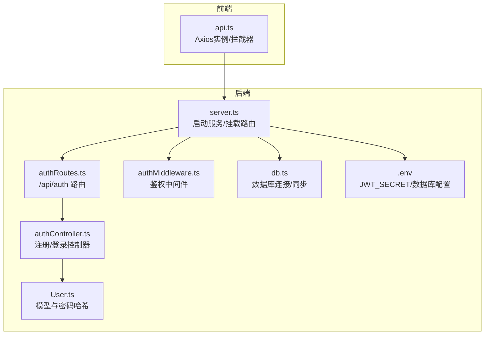
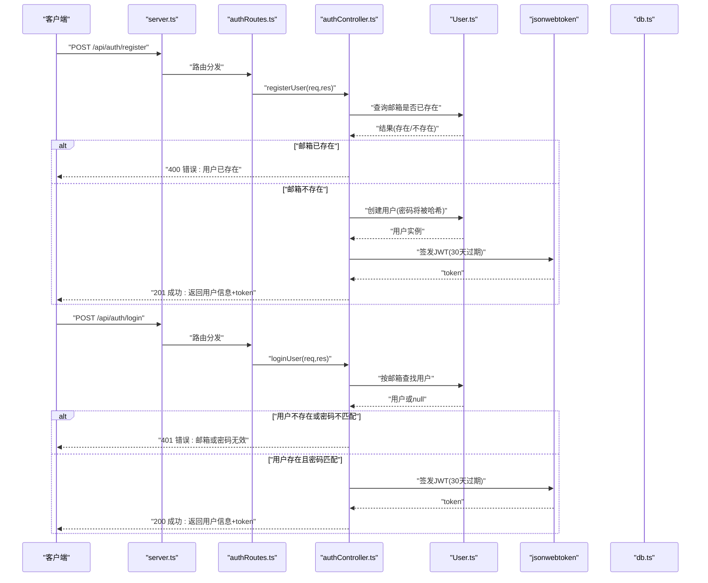
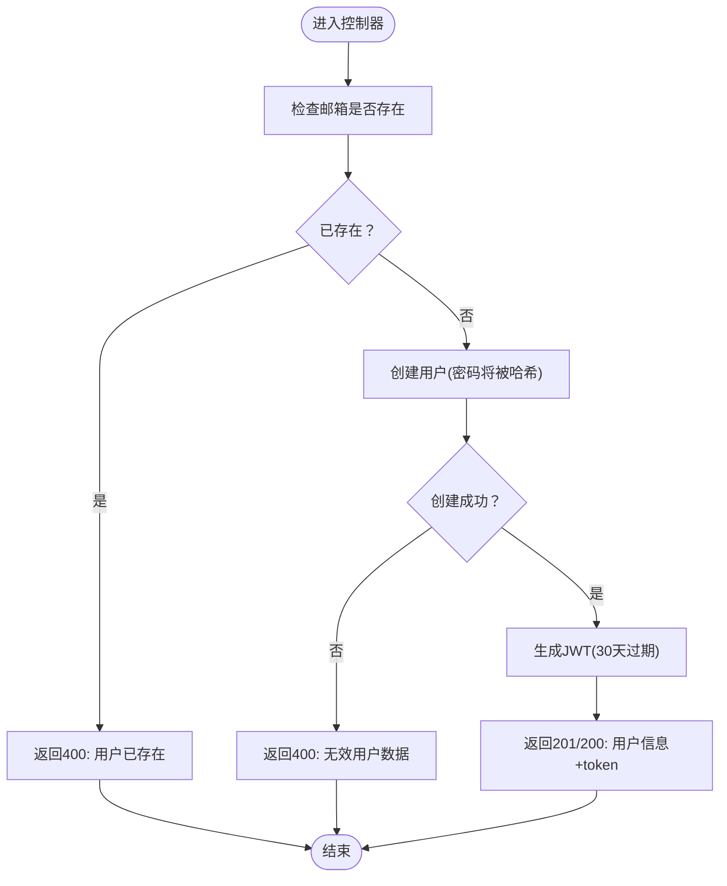
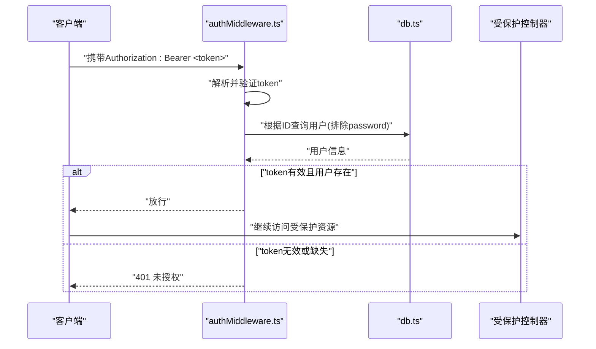
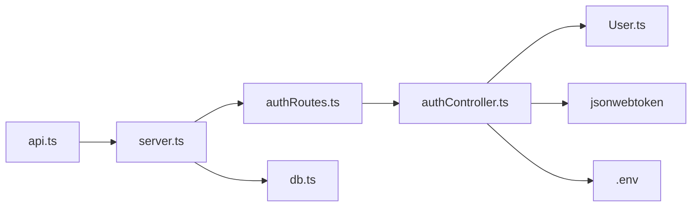

# 认证接口

<cite>
**本文引用的文件**
- [backend/src/server.ts](file://backend/src/server.ts)
- [backend/src/routes/authRoutes.ts](file://backend/src/routes/authRoutes.ts)
- [backend/src/controllers/authController.ts](file://backend/src/controllers/authController.ts)
- [backend/src/models/User.ts](file://backend/src/models/User.ts)
- [backend/src/middleware/authMiddleware.ts](file://backend/src/middleware/authMiddleware.ts)
- [backend/src/config/db.ts](file://backend/src/config/db.ts)
- [backend/.env](file://backend/.env)
- [frontend/src/services/api.ts](file://frontend/src/services/api.ts)
- [tests/test-api.js](file://tests/test-api.js)
- [docs/4. API接口文档.md](file://docs/4. API接口文档.md)
</cite>

## 目录
1. [简介](#简介)
2. [项目结构](#项目结构)
3. [核心组件](#核心组件)
4. [架构总览](#架构总览)
5. [详细组件分析](#详细组件分析)
6. [依赖关系分析](#依赖关系分析)
7. [性能考虑](#性能考虑)
8. [故障排查指南](#故障排查指南)
9. [结论](#结论)
10. [附录](#附录)

## 简介
本文件为认证接口的API文档，聚焦于用户注册与登录两个核心端点：
- POST /api/auth/register：注册新用户
- POST /api/auth/login：用户登录并获取JWT令牌

内容涵盖HTTP方法、URL模式、请求头、请求体结构（字段类型与验证规则）、响应格式（成功与错误情况）、JWT令牌生成与返回机制、密码加密处理流程（bcryptjs）与token有效期配置，并结合后端控制器与模型的业务逻辑，阐述数据验证、用户唯一性检查与安全最佳实践。同时提供实际请求与响应示例，帮助前后端联调与集成。

## 项目结构
认证相关的核心文件组织如下：
- 路由层：定义 /api/auth 的子路由，绑定注册与登录控制器
- 控制器层：实现注册与登录的具体业务逻辑，包含JWT生成与错误处理
- 模型层：User模型负责密码哈希、邮箱唯一性与字段校验
- 中间件：鉴权中间件用于保护受保护资源
- 服务器入口：挂载路由、加载环境变量、启动服务
- 前端API封装：统一设置Content-Type与在请求头中携带Authorization: Bearer <token>
- 测试脚本：演示注册、登录与携带token访问受保护资源的调用流程

图表来源
- [backend/src/server.ts](file://backend/src/server.ts#L1-L36)
- [backend/src/routes/authRoutes.ts](file://backend/src/routes/authRoutes.ts#L1-L9)
- [backend/src/controllers/authController.ts](file://backend/src/controllers/authController.ts#L1-L71)
- [backend/src/models/User.ts](file://backend/src/models/User.ts#L1-L119)
- [backend/src/middleware/authMiddleware.ts](file://backend/src/middleware/authMiddleware.ts#L1-L36)
- [backend/src/config/db.ts](file://backend/src/config/db.ts#L1-L41)
- [backend/.env](file://backend/.env#L1-L10)
- [frontend/src/services/api.ts](file://frontend/src/services/api.ts#L1-L61)

章节来源
- [backend/src/server.ts](file://backend/src/server.ts#L1-L36)
- [backend/src/routes/authRoutes.ts](file://backend/src/routes/authRoutes.ts#L1-L9)
- [backend/src/controllers/authController.ts](file://backend/src/controllers/authController.ts#L1-L71)
- [backend/src/models/User.ts](file://backend/src/models/User.ts#L1-L119)
- [backend/src/middleware/authMiddleware.ts](file://backend/src/middleware/authMiddleware.ts#L1-L36)
- [backend/src/config/db.ts](file://backend/src/config/db.ts#L1-L41)
- [backend/.env](file://backend/.env#L1-L10)
- [frontend/src/services/api.ts](file://frontend/src/services/api.ts#L1-L61)
- [tests/test-api.js](file://tests/test-api.js#L1-L149)
- [docs/4. API接口文档.md](file://docs/4. API接口文档.md#L1-L46)

## 核心组件
- 路由层：在服务器启动时挂载 /api/auth 路由，并将 POST /api/auth/register 与 POST /api/auth/login 分发到对应控制器函数。
- 控制器层：实现注册与登录逻辑，包含用户存在性检查、密码匹配、JWT生成与错误处理。
- 模型层：User模型通过Sequelize定义字段与校验规则；通过beforeCreate/beforeUpdate钩子使用bcryptjs对密码进行加盐哈希；提供matchPassword用于明文密码比对。
- 中间件层：鉴权中间件从Authorization头解析Bearer Token，解码并查询用户信息，向下游传递已认证用户对象。
- 服务器入口：加载环境变量、连接数据库、启用CORS与JSON解析、挂载路由。
- 前端封装：统一设置Content-Type为application/json；在请求前自动注入Authorization: Bearer <token>，便于后续受保护接口调用。

章节来源
- [backend/src/server.ts](file://backend/src/server.ts#L1-L36)
- [backend/src/routes/authRoutes.ts](file://backend/src/routes/authRoutes.ts#L1-L9)
- [backend/src/controllers/authController.ts](file://backend/src/controllers/authController.ts#L1-L71)
- [backend/src/models/User.ts](file://backend/src/models/User.ts#L1-L119)
- [backend/src/middleware/authMiddleware.ts](file://backend/src/middleware/authMiddleware.ts#L1-L36)
- [frontend/src/services/api.ts](file://frontend/src/services/api.ts#L1-L61)

## 架构总览
下图展示认证端点从请求到响应的关键交互流程，包括注册与登录两条主链路。

图表来源
- [backend/src/server.ts](file://backend/src/server.ts#L1-L36)
- [backend/src/routes/authRoutes.ts](file://backend/src/routes/authRoutes.ts#L1-L9)
- [backend/src/controllers/authController.ts](file://backend/src/controllers/authController.ts#L1-L71)
- [backend/src/models/User.ts](file://backend/src/models/User.ts#L1-L119)
- [backend/src/config/db.ts](file://backend/src/config/db.ts#L1-L41)

## 详细组件分析

### 接口定义与请求/响应规范

- POST /api/auth/register
  - 方法：POST
  - URL：/api/auth/register
  - 请求头：Content-Type: application/json
  - 请求体字段：
    - name: 字符串，必填，长度限制见模型校验
    - email: 字符串，必填，需符合邮箱格式，且唯一
    - password: 字符串，必填，长度6-100
  - 成功响应：
    - 状态码：201
    - 字段：id、name、email、token
  - 失败响应：
    - 状态码：400（邮箱已存在）、400（无效用户数据）、500（服务器错误）
    - 字段：message

- POST /api/auth/login
  - 方法：POST
  - URL：/api/auth/login
  - 请求头：Content-Type: application/json
  - 请求体字段：
    - email: 字符串，必填，需符合邮箱格式
    - password: 字符串，必填
  - 成功响应：
    - 状态码：200
    - 字段：id、name、email、token
  - 失败响应：
    - 状态码：401（邮箱或密码无效）、500（服务器错误）
    - 字段：message

章节来源
- [docs/4. API接口文档.md](file://docs/4. API接口文档.md#L1-L46)
- [backend/src/controllers/authController.ts](file://backend/src/controllers/authController.ts#L1-L71)
- [backend/src/models/User.ts](file://backend/src/models/User.ts#L1-L119)

### 请求与响应示例

- 注册请求示例
  - 请求体(JSON)
    - name: "张三"
    - email: "zhangsan@example.com"
    - password: "mypassword123"
  - 成功响应示例(JSON)
    - id: 1
    - name: "张三"
    - email: "zhangsan@example.com"
    - token: "eyJhbGciOiJIUzI1NiIsInR5cCI6IkpXVCJ9..."

- 登录请求示例
  - 请求体(JSON)
    - email: "zhangsan@example.com"
    - password: "mypassword123"
  - 成功响应示例(JSON)
    - id: 1
    - name: "张三"
    - email: "zhangsan@example.com"
    - token: "eyJhbGciOiJIUzI1NiIsInR5cCI6IkpXVCJ9..."

- 常见错误示例
  - 注册：邮箱已存在
    - 状态码：400
    - message: "User already exists"
  - 登录：邮箱或密码无效
    - 状态码：401
    - message: "Invalid email or password"
  - 服务器内部错误
    - 状态码：500
    - message: "Server error"

章节来源
- [tests/test-api.js](file://tests/test-api.js#L16-L46)
- [docs/4. API接口文档.md](file://docs/4. API接口文档.md#L1-L46)
- [backend/src/controllers/authController.ts](file://backend/src/controllers/authController.ts#L1-L71)

### 密码加密与JWT令牌机制

- 密码加密（bcryptjs）
  - 在User模型中，通过beforeCreate与beforeUpdate钩子对密码进行加盐哈希，确保存储的不是明文密码。
  - 提供实例方法matchPassword用于明文密码与存储密码的比对。
  - 密码长度校验：最小6位，最大100位。

- JWT令牌
  - 生成：使用jsonwebtoken对用户ID进行签名，密钥来自环境变量JWT_SECRET，过期时间为30天。
  - 返回：注册与登录成功时均返回token字段。
  - 使用：前端在请求头中添加Authorization: Bearer <token>，以便后续受保护接口调用。

图表来源
- [backend/src/controllers/authController.ts](file://backend/src/controllers/authController.ts#L1-L71)
- [backend/src/models/User.ts](file://backend/src/models/User.ts#L1-L119)

章节来源
- [backend/src/models/User.ts](file://backend/src/models/User.ts#L1-L119)
- [backend/src/controllers/authController.ts](file://backend/src/controllers/authController.ts#L1-L71)
- [backend/.env](file://backend/.env#L1-L10)
- [frontend/src/services/api.ts](file://frontend/src/services/api.ts#L1-L61)

### 数据验证与唯一性检查

- 验证规则（模型侧）
  - email：非空、唯一、邮箱格式校验
  - password：非空、长度6-100
  - 其他字段（age/height/weight/gender）具备范围与枚举约束
- 唯一性检查（控制器侧）
  - 注册前先查询邮箱是否已存在，避免重复注册
- 安全最佳实践
  - 密码必须经bcryptjs加盐哈希存储
  - 登录时使用matchPassword进行安全比对
  - JWT密钥来自环境变量，避免硬编码
  - 受保护接口通过鉴权中间件校验token有效性

章节来源
- [backend/src/models/User.ts](file://backend/src/models/User.ts#L1-L119)
- [backend/src/controllers/authController.ts](file://backend/src/controllers/authController.ts#L1-L71)
- [backend/src/middleware/authMiddleware.ts](file://backend/src/middleware/authMiddleware.ts#L1-L36)
- [backend/.env](file://backend/.env#L1-L10)

### 受保护资源与鉴权流程

- 鉴权中间件
  - 从Authorization头解析Bearer Token
  - 使用JWT_SECRET解码并验证token
  - 查询用户并排除password字段，将用户信息注入请求对象
  - 无token或token无效时返回401
- 受保护路由示例
  - GET/PUT /api/users/profile：需要Bearer token

图表来源
- [backend/src/middleware/authMiddleware.ts](file://backend/src/middleware/authMiddleware.ts#L1-L36)
- [backend/src/config/db.ts](file://backend/src/config/db.ts#L1-L41)

章节来源
- [backend/src/middleware/authMiddleware.ts](file://backend/src/middleware/authMiddleware.ts#L1-L36)
- [backend/src/routes/userRoutes.ts](file://backend/src/routes/userRoutes.ts#L1-L11)

## 依赖关系分析

图表来源
- [backend/src/server.ts](file://backend/src/server.ts#L1-L36)
- [backend/src/routes/authRoutes.ts](file://backend/src/routes/authRoutes.ts#L1-L9)
- [backend/src/controllers/authController.ts](file://backend/src/controllers/authController.ts#L1-L71)
- [backend/src/models/User.ts](file://backend/src/models/User.ts#L1-L119)
- [backend/.env](file://backend/.env#L1-L10)
- [frontend/src/services/api.ts](file://frontend/src/services/api.ts#L1-L61)

章节来源
- [backend/src/server.ts](file://backend/src/server.ts#L1-L36)
- [backend/src/routes/authRoutes.ts](file://backend/src/routes/authRoutes.ts#L1-L9)
- [backend/src/controllers/authController.ts](file://backend/src/controllers/authController.ts#L1-L71)
- [backend/src/models/User.ts](file://backend/src/models/User.ts#L1-L119)
- [backend/.env](file://backend/.env#L1-L10)
- [frontend/src/services/api.ts](file://frontend/src/services/api.ts#L1-L61)

## 性能考虑
- 密码哈希成本：bcryptjs默认使用10的盐值，计算开销适中，足以抵御暴力破解；如需进一步优化可评估硬件能力与并发量。
- 数据库索引：email字段具备唯一约束，建议在数据库层面确保唯一索引以提升查询效率。
- JWT大小：仅包含用户ID与过期时间，体积小、解析快；建议保持简洁，避免在payload中放入大字段。
- 并发注册：控制器在创建前进行邮箱查询，避免重复注册；若并发极高，可在数据库层面利用唯一约束捕获冲突并返回一致的错误信息。

[本节为通用指导，无需列出具体文件来源]

## 故障排查指南
- 注册失败：邮箱已存在
  - 现象：状态码400，message为“用户已存在”
  - 排查：确认邮箱是否已被其他账户注册
- 登录失败：邮箱或密码无效
  - 现象：状态码401，message为“邮箱或密码无效”
  - 排查：确认邮箱格式正确、密码与注册时一致；注意大小写与特殊字符
- 服务器错误：状态码500
  - 现象：message为“服务器错误”
  - 排查：检查后端日志、数据库连接、JWT密钥配置
- 受保护接口401未授权
  - 现象：状态码401，message为“未授权”
  - 排查：确认请求头是否包含Authorization: Bearer <token>，token是否过期或被篡改
- 前端无法携带token
  - 现象：受保护接口始终401
  - 排查：确认本地存储中是否保存了token，Axios拦截器是否正确注入Authorization头

章节来源
- [backend/src/controllers/authController.ts](file://backend/src/controllers/authController.ts#L1-L71)
- [backend/src/middleware/authMiddleware.ts](file://backend/src/middleware/authMiddleware.ts#L1-L36)
- [frontend/src/services/api.ts](file://frontend/src/services/api.ts#L1-L61)
- [tests/test-api.js](file://tests/test-api.js#L1-L149)

## 结论
本认证接口围绕注册与登录两大端点，结合Sequelize模型的字段校验、bcryptjs密码哈希与jsonwebtoken的JWT签发，实现了安全、清晰的用户认证流程。通过受保护中间件与统一的Authorization头约定，为后续用户资料、运动记录等接口提供了可靠的鉴权基础。建议在生产环境中强化密钥管理、引入速率限制与日志审计，并持续监控异常与错误率。

[本节为总结性内容，无需列出具体文件来源]

## 附录

### 环境变量与配置要点
- JWT_SECRET：JWT签名密钥，建议在部署时设置为强随机字符串
- 数据库连接：MYSQL_HOST、MYSQL_PORT、MYSQL_USER、MYSQL_PASSWORD、MYSQL_DATABASE

章节来源
- [backend/.env](file://backend/.env#L1-L10)
- [backend/src/config/db.ts](file://backend/src/config/db.ts#L1-L41)