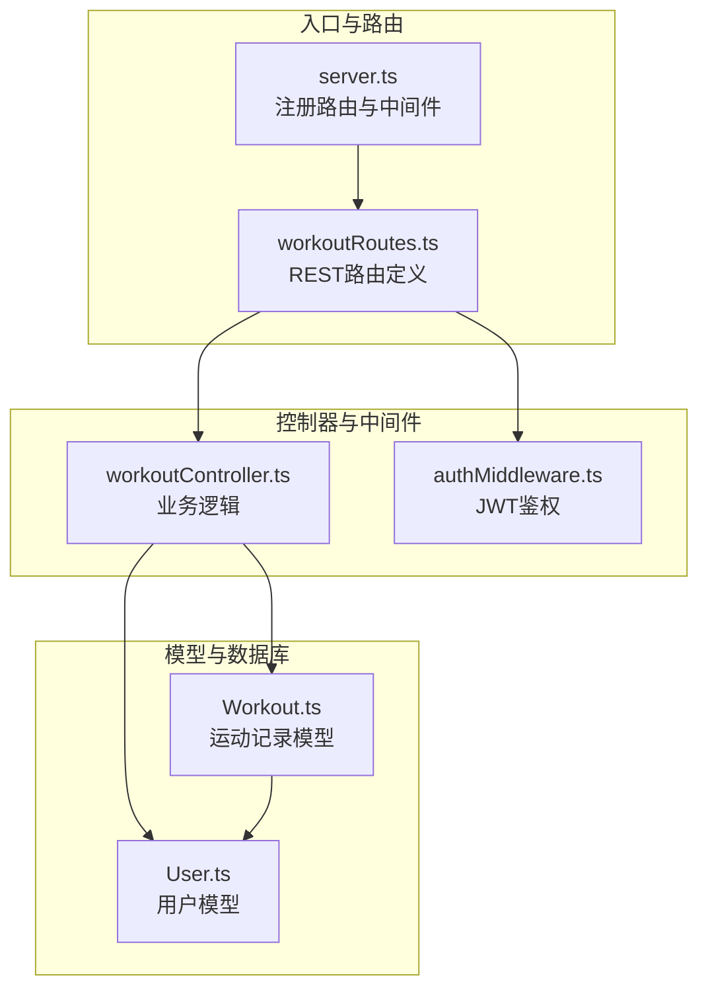
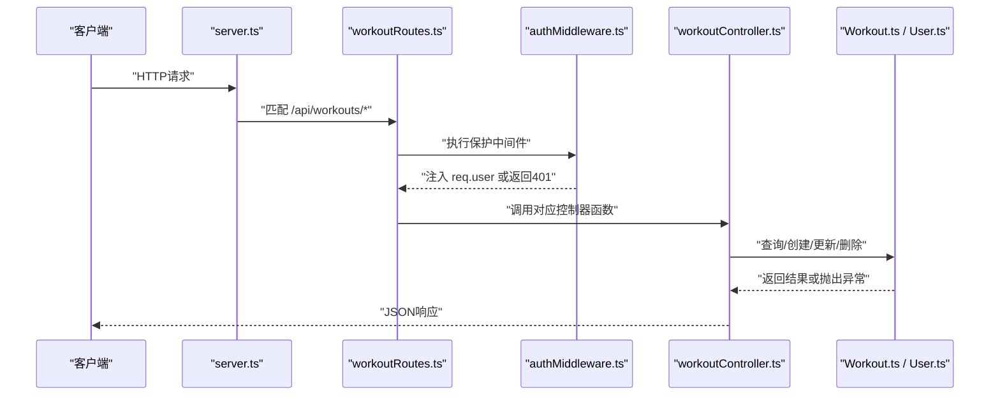
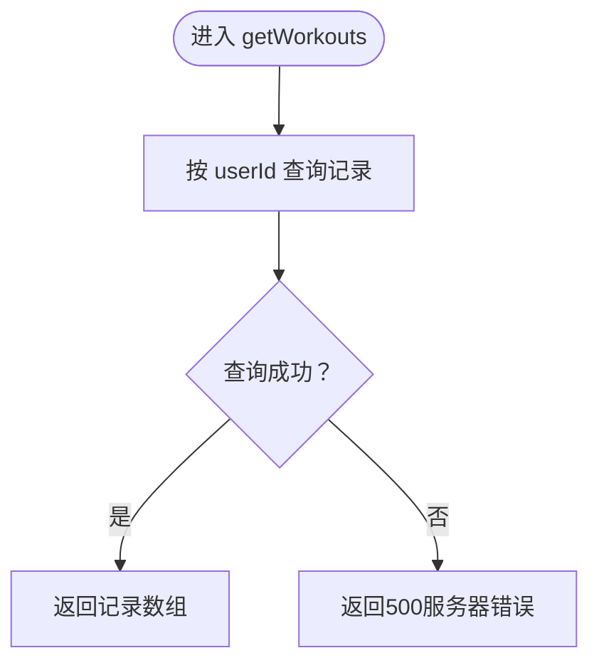
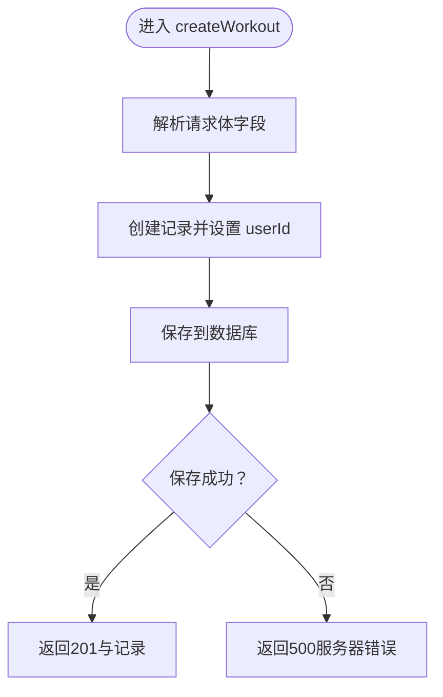
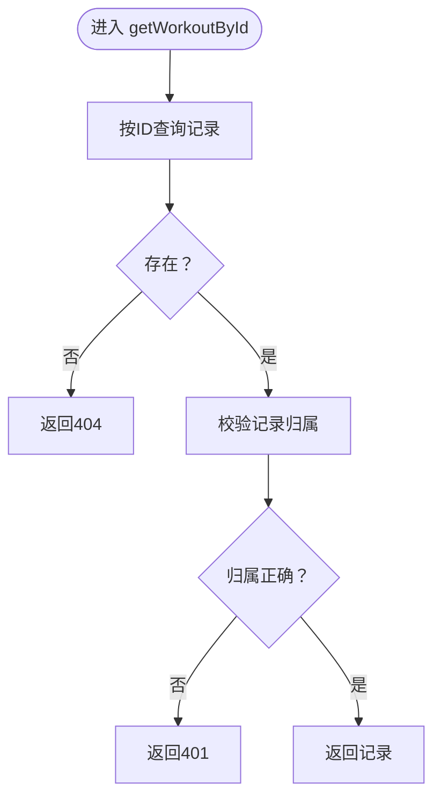
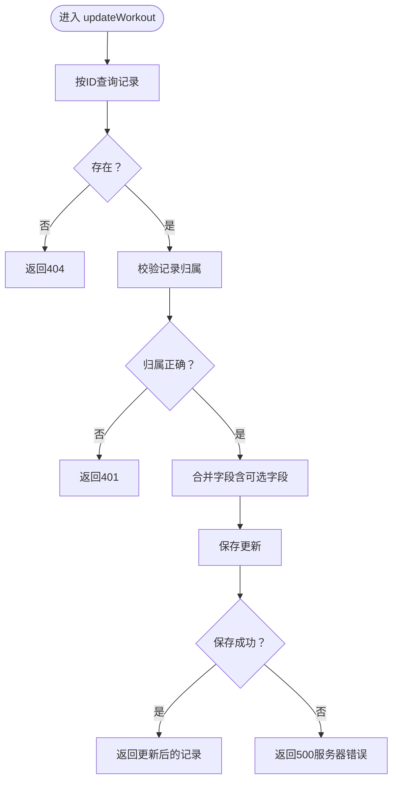
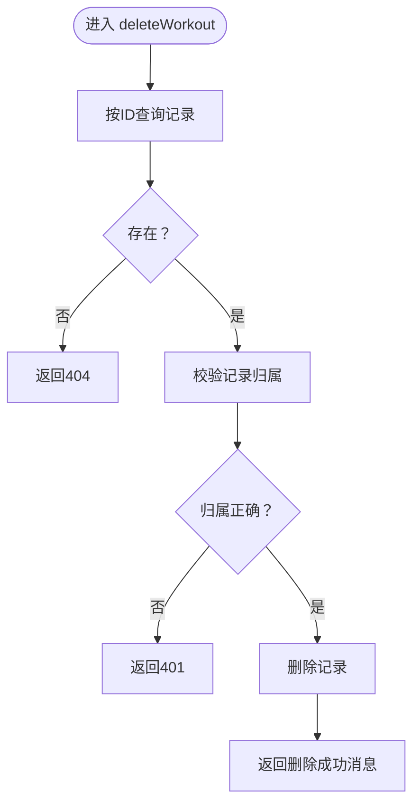
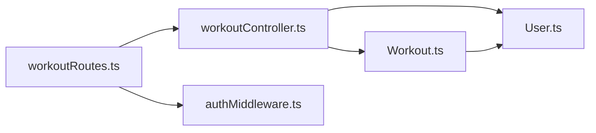

# 运动记录接口

<cite>
**本文引用的文件**
- [backend/src/server.ts](file://backend/src/server.ts)
- [backend/src/routes/workoutRoutes.ts](file://backend/src/routes/workoutRoutes.ts)
- [backend/src/controllers/workoutController.ts](file://backend/src/controllers/workoutController.ts)
- [backend/src/middleware/authMiddleware.ts](file://backend/src/middleware/authMiddleware.ts)
- [backend/src/models/Workout.ts](file://backend/src/models/Workout.ts)
- [backend/src/models/User.ts](file://backend/src/models/User.ts)
- [docs/4. API接口文档.md](file://docs/4. API接口文档.md)
</cite>

## 目录
1. [简介](#简介)
2. [项目结构](#项目结构)
3. [核心组件](#核心组件)
4. [架构总览](#架构总览)
5. [详细组件分析](#详细组件分析)
6. [依赖关系分析](#依赖关系分析)
7. [性能与可扩展性](#性能与可扩展性)
8. [故障排查指南](#故障排查指南)
9. [结论](#结论)
10. [附录：接口规范与示例](#附录接口规范与示例)

## 简介
本文件面向“运动记录接口”的全面API文档，覆盖以下五个端点：
- GET /api/workouts：获取当前登录用户的所有运动记录
- POST /api/workouts：创建一条新的运动记录
- GET /api/workouts/:id：按ID获取某条运动记录
- PUT /api/workouts/:id：更新某条运动记录
- DELETE /api/workouts/:id：删除某条运动记录

文档将从系统架构、路由与控制器、模型与数据验证、认证中间件、错误处理与REST设计原则等方面进行深入解析，并提供分页、过滤、用户关联等实践建议与最佳实践。

## 项目结构
后端采用Express + Sequelize的典型分层架构：
- 路由层：定义REST路径与HTTP方法映射
- 控制器层：封装业务逻辑与数据访问
- 中间件层：鉴权与请求预处理
- 模型层：数据库实体与约束定义
- 入口文件：注册路由与启动服务

图表来源
- [backend/src/server.ts](file://backend/src/server.ts#L1-L36)
- [backend/src/routes/workoutRoutes.ts](file://backend/src/routes/workoutRoutes.ts#L1-L22)
- [backend/src/controllers/workoutController.ts](file://backend/src/controllers/workoutController.ts#L1-L132)
- [backend/src/middleware/authMiddleware.ts](file://backend/src/middleware/authMiddleware.ts#L1-L36)
- [backend/src/models/Workout.ts](file://backend/src/models/Workout.ts#L1-L122)
- [backend/src/models/User.ts](file://backend/src/models/User.ts#L1-L119)

章节来源
- [backend/src/server.ts](file://backend/src/server.ts#L1-L36)
- [backend/src/routes/workoutRoutes.ts](file://backend/src/routes/workoutRoutes.ts#L1-L22)

## 核心组件
- 路由层：在workoutRoutes中以REST风格定义GET/POST/GET/PUT/DELETE到对应控制器函数，并统一使用保护中间件protect进行JWT鉴权。
- 控制器层：workoutController实现五种端点的业务逻辑，包括用户关联校验、数据读取/写入、错误处理。
- 中间件层：authMiddleware从Authorization头解析Bearer Token，校验JWT并注入用户信息到req.user。
- 模型层：Workout模型定义字段、枚举类型、数值范围校验；User模型定义用户属性与密码哈希钩子；二者通过外键建立一对多关系。

章节来源
- [backend/src/routes/workoutRoutes.ts](file://backend/src/routes/workoutRoutes.ts#L1-L22)
- [backend/src/controllers/workoutController.ts](file://backend/src/controllers/workoutController.ts#L1-L132)
- [backend/src/middleware/authMiddleware.ts](file://backend/src/middleware/authMiddleware.ts#L1-L36)
- [backend/src/models/Workout.ts](file://backend/src/models/Workout.ts#L1-L122)
- [backend/src/models/User.ts](file://backend/src/models/User.ts#L1-L119)

## 架构总览
下图展示了从客户端到数据库的调用链路与职责分工。

图表来源
- [backend/src/server.ts](file://backend/src/server.ts#L1-L36)
- [backend/src/routes/workoutRoutes.ts](file://backend/src/routes/workoutRoutes.ts#L1-L22)
- [backend/src/middleware/authMiddleware.ts](file://backend/src/middleware/authMiddleware.ts#L1-L36)
- [backend/src/controllers/workoutController.ts](file://backend/src/controllers/workoutController.ts#L1-L132)
- [backend/src/models/Workout.ts](file://backend/src/models/Workout.ts#L1-L122)
- [backend/src/models/User.ts](file://backend/src/models/User.ts#L1-L119)

## 详细组件分析

### GET /api/workouts（获取所有记录）
- 方法与路径：GET /api/workouts
- 认证：私有接口，需携带Authorization: Bearer <token>
- 请求头：Authorization: Bearer <token>
- 查询条件：仅返回当前用户（req.user.id）的记录
- 排序：按date降序
- 响应：数组，元素为运动记录对象
- 错误：服务器内部错误返回500

图表来源
- [backend/src/controllers/workoutController.ts](file://backend/src/controllers/workoutController.ts#L12-L19)

章节来源
- [backend/src/controllers/workoutController.ts](file://backend/src/controllers/workoutController.ts#L12-L19)

### POST /api/workouts（创建记录）
- 方法与路径：POST /api/workouts
- 认证：私有接口，需携带Authorization: Bearer <token>
- 请求头：Authorization: Bearer <token>
- 请求体字段：
  - name（字符串，必填）
  - type（枚举，必填；取值见模型定义）
  - duration（整数，分钟，必填，>=0）
  - calories（整数，卡路里，必填，>=0）
  - distance（小数，公里，可选，>=0）
  - steps（整数，步数，可选，>=0）
  - date（日期，必填）
  - notes（文本，可选）
- 响应：创建成功的记录对象
- 错误：服务器内部错误返回500

图表来源
- [backend/src/controllers/workoutController.ts](file://backend/src/controllers/workoutController.ts#L52-L67)
- [backend/src/models/Workout.ts](file://backend/src/models/Workout.ts#L62-L102)

章节来源
- [backend/src/controllers/workoutController.ts](file://backend/src/controllers/workoutController.ts#L52-L67)
- [backend/src/models/Workout.ts](file://backend/src/models/Workout.ts#L62-L102)

### GET /api/workouts/:id（获取单条）
- 方法与路径：GET /api/workouts/:id
- 认证：私有接口，需携带Authorization: Bearer <token>
- URL参数：id（记录ID）
- 业务逻辑：
  - 先按ID查询记录
  - 若不存在返回404
  - 再校验记录是否属于当前用户（workout.userId === req.user.id），否则返回401
- 响应：记录对象
- 错误：记录不存在返回404，未授权返回401，服务器错误返回500

图表来源
- [backend/src/controllers/workoutController.ts](file://backend/src/controllers/workoutController.ts#L27-L46)

章节来源
- [backend/src/controllers/workoutController.ts](file://backend/src/controllers/workoutController.ts#L27-L46)

### PUT /api/workouts/:id（更新记录）
- 方法与路径：PUT /api/workouts/:id
- 认证：私有接口，需携带Authorization: Bearer <token>
- URL参数：id（记录ID）
- 请求体字段：同创建接口（name、type、duration、calories、distance、steps、date、notes）
- 业务逻辑：
  - 先按ID查询记录
  - 若不存在返回404
  - 再校验记录是否属于当前用户，否则返回401
  - 对传入字段进行选择性更新（name/type/duration/calories/date/notes直接赋值；distance/steps允许显式传入undefined跳过更新）
  - 保存并返回更新后的记录
- 响应：更新后的记录对象
- 错误：记录不存在返回404，未授权返回401，服务器错误返回500

图表来源
- [backend/src/controllers/workoutController.ts](file://backend/src/controllers/workoutController.ts#L73-L107)

章节来源
- [backend/src/controllers/workoutController.ts](file://backend/src/controllers/workoutController.ts#L73-L107)

### DELETE /api/workouts/:id（删除记录）
- 方法与路径：DELETE /api/workouts/:id
- 认证：私有接口，需携带Authorization: Bearer <token>
- URL参数：id（记录ID）
- 业务逻辑：
  - 先按ID查询记录
  - 若不存在返回404
  - 再校验记录是否属于当前用户，否则返回401
  - 删除记录并返回成功消息
- 响应：{"message": "Workout removed"}
- 错误：记录不存在返回404，未授权返回401，服务器错误返回500

图表来源
- [backend/src/controllers/workoutController.ts](file://backend/src/controllers/workoutController.ts#L109-L132)

章节来源
- [backend/src/controllers/workoutController.ts](file://backend/src/controllers/workoutController.ts#L109-L132)

### 认证中间件与用户关联
- JWT鉴权：从Authorization头提取Bearer Token，校验后将用户信息注入req.user（排除密码字段）
- 用户关联：所有控制器均通过workout.userId === req.user.id进行权限校验，确保用户只能操作自己的记录
- 未授权场景：无token返回401，token无效返回401，越权返回401

章节来源
- [backend/src/middleware/authMiddleware.ts](file://backend/src/middleware/authMiddleware.ts#L9-L36)
- [backend/src/controllers/workoutController.ts](file://backend/src/controllers/workoutController.ts#L36-L40)
- [backend/src/controllers/workoutController.ts](file://backend/src/controllers/workoutController.ts#L87-L91)
- [backend/src/controllers/workoutController.ts](file://backend/src/controllers/workoutController.ts#L121-L125)

### 数据模型与验证
- Workout模型字段与约束：
  - 类型枚举：'running','cycling','swimming','walking','strength','yoga','other'
  - 数值字段校验：duration、calories、distance、steps均有非负校验
  - 外键：userId指向users表，删除策略为级联
- User模型字段与约束：
  - 密码在创建/更新前自动哈希
  - 邮箱唯一且格式校验
  - 年龄、身高、体重范围校验

章节来源
- [backend/src/models/Workout.ts](file://backend/src/models/Workout.ts#L62-L102)
- [backend/src/models/Workout.ts](file://backend/src/models/Workout.ts#L112-L121)
- [backend/src/models/User.ts](file://backend/src/models/User.ts#L41-L117)

## 依赖关系分析
- 路由依赖控制器：workoutRoutes导入workoutController的五个函数
- 控制器依赖模型：workoutController使用Workout与User模型进行数据访问
- 控制器依赖中间件：workoutRoutes对所有端点应用protect中间件
- 模型依赖数据库连接：Workout与User初始化时绑定sequelize实例

图表来源
- [backend/src/routes/workoutRoutes.ts](file://backend/src/routes/workoutRoutes.ts#L1-L22)
- [backend/src/controllers/workoutController.ts](file://backend/src/controllers/workoutController.ts#L1-L132)
- [backend/src/middleware/authMiddleware.ts](file://backend/src/middleware/authMiddleware.ts#L1-L36)
- [backend/src/models/Workout.ts](file://backend/src/models/Workout.ts#L1-L122)
- [backend/src/models/User.ts](file://backend/src/models/User.ts#L1-L119)

章节来源
- [backend/src/routes/workoutRoutes.ts](file://backend/src/routes/workoutRoutes.ts#L1-L22)
- [backend/src/controllers/workoutController.ts](file://backend/src/controllers/workoutController.ts#L1-L132)
- [backend/src/middleware/authMiddleware.ts](file://backend/src/middleware/authMiddleware.ts#L1-L36)
- [backend/src/models/Workout.ts](file://backend/src/models/Workout.ts#L1-L122)
- [backend/src/models/User.ts](file://backend/src/models/User.ts#L1-L119)

## 性能与可扩展性
- 分页支持：当前实现未内置分页，可在控制器中引入limit/offset或基于游标分页；结合排序字段（如date DESC）提升检索效率。
- 过滤选项：可增加按日期范围、运动类型、距离/步数阈值等过滤条件，配合索引优化查询。
- 缓存策略：对高频读取的统计类数据可考虑Redis缓存，降低数据库压力。
- 并发控制：更新操作建议使用乐观锁或版本号避免并发覆盖。
- 日志与监控：为关键路径添加请求日志与错误埋点，便于定位性能瓶颈。

## 故障排查指南
- 401 未授权
  - 可能原因：缺少Authorization头、Token无效或已过期、越权访问
  - 排查步骤：确认前端携带正确的Bearer Token；检查JWT_SECRET配置；确认请求的记录确实属于当前用户
- 404 记录不存在
  - 可能原因：ID不正确或已被删除
  - 排查步骤：核对URL中的:id；确认数据库中是否存在该记录
- 500 服务器错误
  - 可能原因：数据库异常、模型校验失败、中间件异常
  - 排查步骤：查看服务端日志；检查数据库连接；确认请求体字段符合模型约束

章节来源
- [backend/src/controllers/workoutController.ts](file://backend/src/controllers/workoutController.ts#L31-L40)
- [backend/src/controllers/workoutController.ts](file://backend/src/controllers/workoutController.ts#L82-L85)
- [backend/src/controllers/workoutController.ts](file://backend/src/controllers/workoutController.ts#L116-L119)
- [backend/src/middleware/authMiddleware.ts](file://backend/src/middleware/authMiddleware.ts#L28-L36)

## 结论
该运动记录接口遵循REST设计原则，通过JWT中间件保障私有性与用户隔离，控制器内实现了完善的用户关联校验与错误处理。模型层提供了严格的字段与数值约束，确保数据一致性。建议后续引入分页与过滤能力，以满足更大规模数据的高效访问需求。

## 附录：接口规范与示例

### 接口一览
- GET /api/workouts
  - 请求头：Authorization: Bearer <token>
  - 响应：运动记录数组
- POST /api/workouts
  - 请求头：Authorization: Bearer <token>
  - 请求体：name、type、duration、calories、distance、steps、date、notes
  - 响应：新建记录对象
- GET /api/workouts/:id
  - 请求头：Authorization: Bearer <token>
  - 响应：单条记录对象
- PUT /api/workouts/:id
  - 请求头：Authorization: Bearer <token>
  - 请求体：name、type、duration、calories、distance、steps、date、notes
  - 响应：更新后的记录对象
- DELETE /api/workouts/:id
  - 请求头：Authorization: Bearer <token>
  - 响应：{"message": "Workout removed"}

章节来源
- [docs/4. API接口文档.md](file://docs/4. API接口文档.md#L100-L231)

### 字段定义与约束
- name：字符串，必填
- type：枚举，必填；取值：'running','cycling','swimming','walking','strength','yoga','other'
- duration：整数，分钟，必填，>=0
- calories：整数，卡路里，必填，>=0
- distance：小数，公里，可选，>=0
- steps：整数，步数，可选，>=0
- date：日期，必填
- notes：文本，可选

章节来源
- [backend/src/models/Workout.ts](file://backend/src/models/Workout.ts#L62-L102)

### 示例（请求与响应结构）
- 创建记录（请求体字段与响应结构参考文档）
- 更新记录（请求体字段与响应结构参考文档）
- 获取列表/详情（响应结构参考文档）

章节来源
- [docs/4. API接口文档.md](file://docs/4. API接口文档.md#L126-L231)