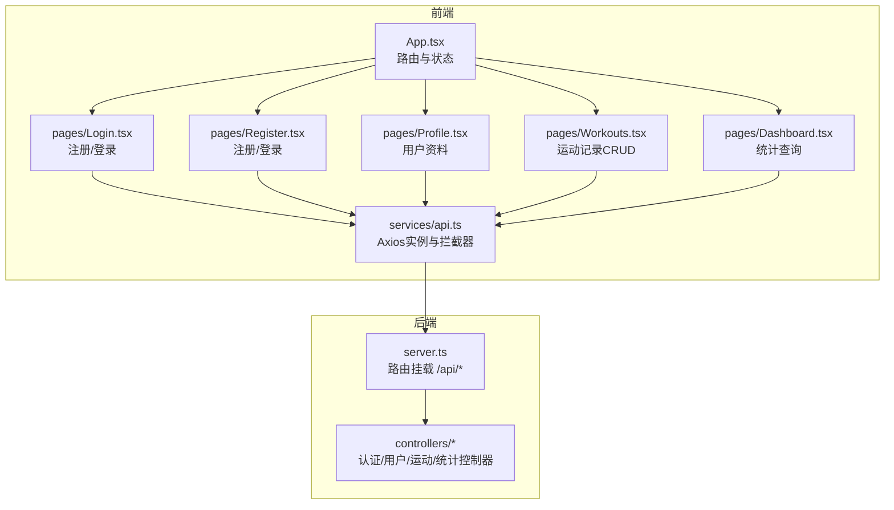
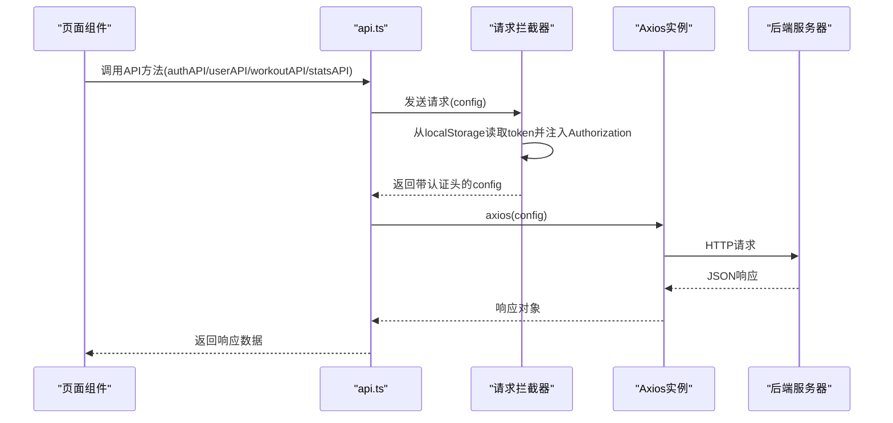
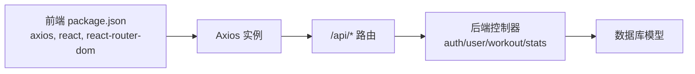

# API客户端实现

<cite>
**本文引用的文件**
- [frontend/src/services/api.ts](file://frontend/src/services/api.ts)
- [frontend/src/pages/Login.tsx](file://frontend/src/pages/Login.tsx)
- [frontend/src/pages/Register.tsx](file://frontend/src/pages/Register.tsx)
- [frontend/src/pages/Profile.tsx](file://frontend/src/pages/Profile.tsx)
- [frontend/src/pages/Workouts.tsx](file://frontend/src/pages/Workouts.tsx)
- [frontend/src/pages/Dashboard.tsx](file://frontend/src/pages/Dashboard.tsx)
- [frontend/src/App.tsx](file://frontend/src/App.tsx)
- [frontend/package.json](file://frontend/package.json)
- [docs/4. API接口文档.md](file://docs/4. API接口文档.md)
- [backend/src/server.ts](file://backend/src/server.ts)
- [backend/src/controllers/authController.ts](file://backend/src/controllers/authController.ts)
- [backend/src/controllers/userController.ts](file://backend/src/controllers/userController.ts)
- [backend/src/controllers/workoutController.ts](file://backend/src/controllers/workoutController.ts)
- [tests/test-api.js](file://tests/test-api.js)
</cite>

## 目录
1. [简介](#简介)
2. [项目结构](#项目结构)
3. [核心组件](#核心组件)
4. [架构总览](#架构总览)
5. [详细组件分析](#详细组件分析)
6. [依赖关系分析](#依赖关系分析)
7. [性能与可扩展性](#性能与可扩展性)
8. [故障排查指南](#故障排查指南)
9. [结论](#结论)
10. [附录](#附录)

## 简介
本文件系统化记录前端API客户端的封装实现，围绕基于Axios的api实例构建、请求拦截器的无感认证机制、以及四大API服务模块（authAPI、userAPI、workoutAPI、statsAPI）进行深入解析。文档同时提供REST调用流程说明、TypeScript类型保障、错误处理与重试策略建议，并通过页面组件中的实际使用示例帮助读者快速上手。

## 项目结构
前端采用Vite + React + TypeScript，API客户端集中于services目录下的api.ts，页面组件按功能分布在pages目录下。后端以Express提供REST API，路由前缀统一为/api。

图表来源
- [frontend/src/App.tsx](file://frontend/src/App.tsx#L1-L48)
- [frontend/src/services/api.ts](file://frontend/src/services/api.ts#L1-L61)
- [frontend/src/pages/Login.tsx](file://frontend/src/pages/Login.tsx#L1-L109)
- [frontend/src/pages/Register.tsx](file://frontend/src/pages/Register.tsx#L1-L149)
- [frontend/src/pages/Profile.tsx](file://frontend/src/pages/Profile.tsx#L1-L245)
- [frontend/src/pages/Workouts.tsx](file://frontend/src/pages/Workouts.tsx#L1-L384)
- [frontend/src/pages/Dashboard.tsx](file://frontend/src/pages/Dashboard.tsx#L1-L174)
- [backend/src/server.ts](file://backend/src/server.ts#L1-L36)

章节来源
- [frontend/src/services/api.ts](file://frontend/src/services/api.ts#L1-L61)
- [frontend/src/App.tsx](file://frontend/src/App.tsx#L1-L48)
- [backend/src/server.ts](file://backend/src/server.ts#L1-L36)

## 核心组件
- Axios实例与基础配置
  - 基础URL：http://localhost:3001/api
  - 默认请求头：Content-Type: application/json
- 请求拦截器
  - 自动从localStorage读取JWT令牌并注入到Authorization头部
- API服务模块
  - authAPI：注册、登录
  - userAPI：获取与更新个人资料
  - workoutAPI：运动记录CRUD
  - statsAPI：统计查询

章节来源
- [frontend/src/services/api.ts](file://frontend/src/services/api.ts#L1-L61)

## 架构总览
前端通过Axios实例发起HTTP请求，请求拦截器在发送前自动附加Authorization头；后端根据路由前缀分发至对应控制器，控制器完成业务逻辑并返回JSON响应。页面组件通过调用API服务模块实现UI与数据层解耦。

图表来源
- [frontend/src/services/api.ts](file://frontend/src/services/api.ts#L1-L61)
- [frontend/src/pages/Login.tsx](file://frontend/src/pages/Login.tsx#L1-L109)
- [frontend/src/pages/Register.tsx](file://frontend/src/pages/Register.tsx#L1-L149)
- [frontend/src/pages/Profile.tsx](file://frontend/src/pages/Profile.tsx#L1-L245)
- [frontend/src/pages/Workouts.tsx](file://frontend/src/pages/Workouts.tsx#L1-L384)
- [frontend/src/pages/Dashboard.tsx](file://frontend/src/pages/Dashboard.tsx#L1-L174)
- [backend/src/server.ts](file://backend/src/server.ts#L1-L36)

## 详细组件分析

### Axios实例与拦截器
- 实例创建
  - 基础URL：http://localhost:3001/api
  - 默认Content-Type：application/json
- 请求拦截器
  - 在请求发送前从localStorage读取token
  - 若存在token且headers可用，则注入Authorization: Bearer <token>
  - 对异常情况直接reject，便于上层捕获
- 导出方式
  - 同时导出命名API模块与默认api实例，便于按需使用

章节来源
- [frontend/src/services/api.ts](file://frontend/src/services/api.ts#L1-L61)

### 认证API（authAPI）
- 方法定义
  - register(data)：向 /auth/register 发起POST请求
  - login(data)：向 /auth/login 发起POST请求
- 参数与返回
  - register：{ name, email, password }
  - login：{ email, password }
  - 返回：Axios响应对象，包含data字段（含token等）
- 页面使用示例
  - 登录页：调用authAPI.login，成功后将token写入localStorage并跳转
  - 注册页：调用authAPI.register，成功后同上
- 类型保障
  - 使用TS接口约束响应结构，确保token与用户信息字段类型安全

章节来源
- [frontend/src/services/api.ts](file://frontend/src/services/api.ts#L25-L31)
- [frontend/src/pages/Login.tsx](file://frontend/src/pages/Login.tsx#L1-L109)
- [frontend/src/pages/Register.tsx](file://frontend/src/pages/Register.tsx#L1-L149)
- [docs/4. API接口文档.md](file://docs/4. API接口文档.md#L1-L46)

### 用户API（userAPI）
- 方法定义
  - getProfile()：GET /users/profile
  - updateProfile(data)：PUT /users/profile
- 参数与返回
  - getProfile：无参
  - updateProfile：Partial<{ name, email, age, height, weight, gender }>
  - 返回：Axios响应对象，data为用户资料
- 页面使用示例
  - 个人资料页：首次加载调用getProfile，编辑表单提交时调用updateProfile
- 类型保障
  - UserProfile接口定义字段，updateProfile使用Partial确保可选字段

章节来源
- [frontend/src/services/api.ts](file://frontend/src/services/api.ts#L33-L44)
- [frontend/src/pages/Profile.tsx](file://frontend/src/pages/Profile.tsx#L1-L245)
- [docs/4. API接口文档.md](file://docs/4. API接口文档.md#L48-L98)

### 运动记录API（workoutAPI）
- 方法定义
  - getAll()：GET /workouts
  - getById(id)：GET /workouts/:id
  - create(data)：POST /workouts
  - update(id, data)：PUT /workouts/:id
  - delete(id)：DELETE /workouts/:id
- 参数与返回
  - getAll/getById/create/update/delete：分别对应REST CRUD
  - 返回：Axios响应对象，data为数组或对象
- 页面使用示例
  - 运动记录页：列表加载、新增/编辑/删除、表单校验与提交
- 类型保障
  - Workout接口定义字段，确保类型安全

章节来源
- [frontend/src/services/api.ts](file://frontend/src/services/api.ts#L46-L53)
- [frontend/src/pages/Workouts.tsx](file://frontend/src/pages/Workouts.tsx#L1-L384)
- [docs/4. API接口文档.md](file://docs/4. API接口文档.md#L100-L231)

### 统计API（statsAPI）
- 方法定义
  - getWorkoutStats()：GET /stats/workouts
  - getWeeklyStats()：GET /stats/weekly
- 参数与返回
  - 无参
  - 返回：Axios响应对象，data为统计聚合结果
- 页面使用示例
  - 仪表板页：并发获取两类统计并渲染卡片与图表

章节来源
- [frontend/src/services/api.ts](file://frontend/src/services/api.ts#L55-L59)
- [frontend/src/pages/Dashboard.tsx](file://frontend/src/pages/Dashboard.tsx#L1-L174)
- [docs/4. API接口文档.md](file://docs/4. API接口文档.md#L232-L275)

### 页面组件中的使用模式
- 登录/注册
  - 导入authAPI，发起请求，成功后localStorage存储token并导航
- 个人资料
  - 导入userAPI，getProfile初始化表单，updateProfile提交更新
- 运动记录
  - 导入workoutAPI，getAll加载列表，create/update/delete执行CRUD
- 仪表板
  - 导入statsAPI，Promise.all并发获取统计数据

章节来源
- [frontend/src/pages/Login.tsx](file://frontend/src/pages/Login.tsx#L1-L109)
- [frontend/src/pages/Register.tsx](file://frontend/src/pages/Register.tsx#L1-L149)
- [frontend/src/pages/Profile.tsx](file://frontend/src/pages/Profile.tsx#L1-L245)
- [frontend/src/pages/Workouts.tsx](file://frontend/src/pages/Workouts.tsx#L1-L384)
- [frontend/src/pages/Dashboard.tsx](file://frontend/src/pages/Dashboard.tsx#L1-L174)

## 依赖关系分析
- 前端依赖
  - axios：HTTP客户端
  - react/react-router-dom：页面与路由
  - @types/*：类型声明
- 后端依赖
  - express/cors/dotenv：服务启动与中间件
  - jsonwebtoken：JWT生成
  - 数据库ORM（Sequelize）：模型与查询
- 前后端交互
  - 前端通过Axios访问 http://localhost:3001/api/*
  - 后端路由挂载在/api下，控制器处理认证、用户、运动、统计

图表来源
- [frontend/package.json](file://frontend/package.json#L1-L32)
- [backend/src/server.ts](file://backend/src/server.ts#L1-L36)
- [backend/src/controllers/authController.ts](file://backend/src/controllers/authController.ts#L1-L71)
- [backend/src/controllers/userController.ts](file://backend/src/controllers/userController.ts#L1-L60)
- [backend/src/controllers/workoutController.ts](file://backend/src/controllers/workoutController.ts#L1-L132)

章节来源
- [frontend/package.json](file://frontend/package.json#L1-L32)
- [backend/src/server.ts](file://backend/src/server.ts#L1-L36)

## 性能与可扩展性
- 错误处理与重试
  - 建议在请求拦截器或响应拦截器中增加统一错误处理
  - 对网络异常或5xx错误可考虑指数退避重试
- 超时与并发
  - 为Axios实例设置timeout，避免长时间阻塞
  - 列表加载可采用分页或懒加载减少一次性请求量
- 性能监控
  - 记录请求耗时与成功率，结合日志系统定位慢请求
- 安全加固
  - 建议在响应拦截器中统一处理401未授权并触发登出
  - 对敏感操作增加二次确认与节流

[本节为通用建议，无需具体文件来源]

## 故障排查指南
- 无法连接后端
  - 检查后端是否在3001端口运行，路由是否正确挂载
  - 前端基础URL是否匹配后端实际端口
- 401未授权
  - 确认localStorage中是否存在token
  - 检查请求拦截器是否成功注入Authorization头
- CORS跨域问题
  - 后端已启用CORS中间件，若仍报错，检查浏览器控制台与后端日志
- 类型错误
  - 确保页面组件中对响应数据的断言与接口定义一致
  - 使用TS接口约束请求参数，避免传入未知字段

章节来源
- [frontend/src/services/api.ts](file://frontend/src/services/api.ts#L1-L61)
- [backend/src/server.ts](file://backend/src/server.ts#L1-L36)
- [tests/test-api.js](file://tests/test-api.js#L1-L149)

## 结论
该API客户端以Axios为核心，通过请求拦截器实现了无感认证，配合清晰的API服务模块划分，使页面组件能够专注于UI逻辑。结合TypeScript接口与后端规范，整体具备良好的可维护性与扩展性。建议进一步完善响应拦截器、错误重试与性能监控，以提升用户体验与系统稳定性。

[本节为总结，无需具体文件来源]

## 附录

### REST调用基本流程（面向初学者）
- 准备阶段
  - 确定目标URL与HTTP方法（GET/POST/PUT/DELETE）
  - 准备请求头（如Content-Type）与请求体（JSON）
- 发送请求
  - 通过Axios实例发送请求
  - 请求拦截器自动注入Authorization头
- 处理响应
  - 解析响应数据，更新UI状态
  - 处理错误与加载状态
- 最佳实践
  - 明确区分公共与私有接口
  - 使用接口定义参数与返回值
  - 统一错误提示与重试策略

[本节为概念说明，无需具体文件来源]

### TypeScript接口在类型安全中的作用
- 接口定义
  - UserProfile：用户资料字段集合
  - Workout：运动记录字段集合
  - WorkoutStat/WeeklyStat：统计聚合字段集合
- 使用场景
  - 页面组件中对响应数据进行类型断言
  - API方法参数使用Partial或Pick确保可选字段
- 建议
  - 将接口抽取到独立文件，便于复用与维护

章节来源
- [frontend/src/pages/Profile.tsx](file://frontend/src/pages/Profile.tsx#L1-L245)
- [frontend/src/pages/Workouts.tsx](file://frontend/src/pages/Workouts.tsx#L1-L384)
- [frontend/src/pages/Dashboard.tsx](file://frontend/src/pages/Dashboard.tsx#L1-L174)

### 响应拦截器与全局错误处理建议
- 建议在响应拦截器中：
  - 统一处理401未授权并触发登出
  - 统一处理403禁止访问
  - 统一处理5xx服务器错误并上报
  - 记录请求耗时与状态码，便于性能监控
- 与现有请求拦截器配合
  - 请求拦截器负责注入Authorization
  - 响应拦截器负责错误与状态处理

[本节为建议内容，无需具体文件来源]