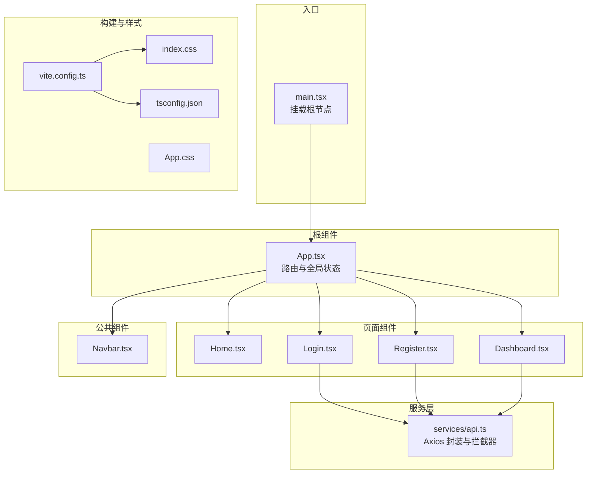
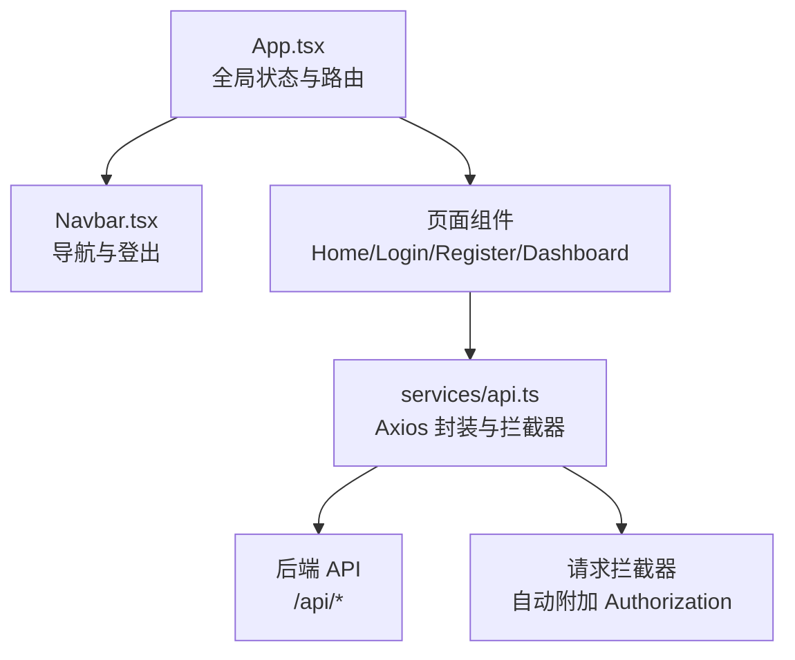
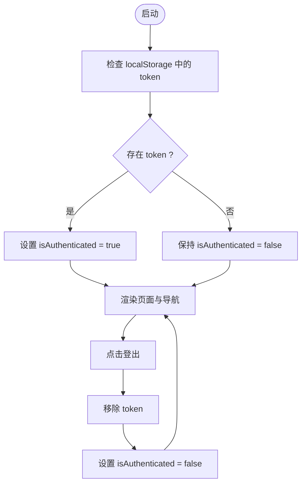
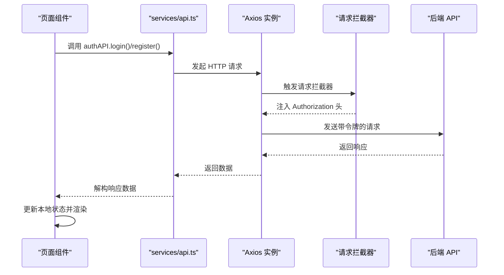
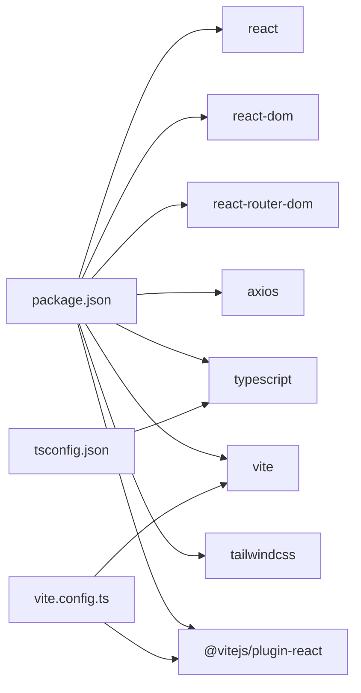

# 前端架构

<cite>
**本文引用的文件**
- [frontend/src/main.tsx](file://frontend/src/main.tsx)
- [frontend/src/App.tsx](file://frontend/src/App.tsx)
- [frontend/src/components/Navbar.tsx](file://frontend/src/components/Navbar.tsx)
- [frontend/src/services/api.ts](file://frontend/src/services/api.ts)
- [frontend/src/pages/Home.tsx](file://frontend/src/pages/Home.tsx)
- [frontend/src/pages/Dashboard.tsx](file://frontend/src/pages/Dashboard.tsx)
- [frontend/src/pages/Login.tsx](file://frontend/src/pages/Login.tsx)
- [frontend/src/pages/Register.tsx](file://frontend/src/pages/Register.tsx)
- [frontend/vite.config.ts](file://frontend/vite.config.ts)
- [frontend/package.json](file://frontend/package.json)
- [frontend/tsconfig.json](file://frontend/tsconfig.json)
- [frontend/src/index.css](file://frontend/src/index.css)
- [frontend/src/App.css](file://frontend/src/App.css)
</cite>

## 目录
1. [简介](#简介)
2. [项目结构](#项目结构)
3. [核心组件](#核心组件)
4. [架构总览](#架构总览)
5. [详细组件分析](#详细组件分析)
6. [依赖关系分析](#依赖关系分析)
7. [性能考量](#性能考量)
8. [故障排查指南](#故障排查指南)
9. [结论](#结论)
10. [附录](#附录)

## 简介
本文件面向“前端应用架构”，聚焦于基于 React + TypeScript 的前端工程设计，系统性阐述组件树结构、状态管理机制、API 客户端封装、路由配置、响应式设计与用户体验优化策略。该应用采用 Vite 构建工具，TailwindCSS 提供原子化样式，Axios 封装统一的后端通信层，React Router 实现页面级导航。

## 项目结构
前端代码位于 frontend 目录，采用按功能分层的组织方式：
- 入口与根组件：main.tsx 负责挂载 React 根节点；App.tsx 作为顶层容器，承载路由与全局状态。
- 页面组件：pages 下包含首页、登录、注册、仪表板、运动记录、运动计划、个人资料等页面。
- 公共组件：components 下包含通用导航栏 Navbar。
- 服务层：services 下提供 Axios 封装的 API 客户端，集中管理认证、用户、运动、统计等接口。
- 构建与样式：Vite 配置、TypeScript 编译配置、TailwindCSS 引入与基础样式。

图示来源
- [frontend/src/main.tsx](file://frontend/src/main.tsx#L1-L10)
- [frontend/src/App.tsx](file://frontend/src/App.tsx#L1-L48)
- [frontend/src/components/Navbar.tsx](file://frontend/src/components/Navbar.tsx#L1-L91)
- [frontend/src/services/api.ts](file://frontend/src/services/api.ts#L1-L61)
- [frontend/src/pages/Home.tsx](file://frontend/src/pages/Home.tsx#L1-L110)
- [frontend/src/pages/Login.tsx](file://frontend/src/pages/Login.tsx#L1-L109)
- [frontend/src/pages/Register.tsx](file://frontend/src/pages/Register.tsx#L1-L149)
- [frontend/src/pages/Dashboard.tsx](file://frontend/src/pages/Dashboard.tsx#L1-L174)
- [frontend/vite.config.ts](file://frontend/vite.config.ts#L1-L13)
- [frontend/tsconfig.json](file://frontend/tsconfig.json#L1-L21)
- [frontend/src/index.css](file://frontend/src/index.css#L1-L16)
- [frontend/src/App.css](file://frontend/src/App.css#L1-L19)

章节来源
- [frontend/src/main.tsx](file://frontend/src/main.tsx#L1-L10)
- [frontend/src/App.tsx](file://frontend/src/App.tsx#L1-L48)
- [frontend/vite.config.ts](file://frontend/vite.config.ts#L1-L13)
- [frontend/tsconfig.json](file://frontend/tsconfig.json#L1-L21)
- [frontend/src/index.css](file://frontend/src/index.css#L1-L16)
- [frontend/src/App.css](file://frontend/src/App.css#L1-L19)

## 核心组件
- 根组件 App：负责全局认证状态（本地存储 token）、路由配置与页面布局，同时注入全局背景渐变与容器间距。
- 导航栏 Navbar：根据是否已登录显示不同菜单项，提供移动端菜单按钮与登出交互。
- 页面组件：Home、Login、Register、Dashboard 等，分别承担引导、认证、统计与数据展示职责。
- API 客户端：以 Axios 实例为核心，统一设置 base URL、请求头与鉴权拦截器，按领域拆分模块化导出（authAPI、userAPI、workoutAPI、statsAPI）。

章节来源
- [frontend/src/App.tsx](file://frontend/src/App.tsx#L1-L48)
- [frontend/src/components/Navbar.tsx](file://frontend/src/components/Navbar.tsx#L1-L91)
- [frontend/src/services/api.ts](file://frontend/src/services/api.ts#L1-L61)
- [frontend/src/pages/Home.tsx](file://frontend/src/pages/Home.tsx#L1-L110)
- [frontend/src/pages/Login.tsx](file://frontend/src/pages/Login.tsx#L1-L109)
- [frontend/src/pages/Register.tsx](file://frontend/src/pages/Register.tsx#L1-L149)
- [frontend/src/pages/Dashboard.tsx](file://frontend/src/pages/Dashboard.tsx#L1-L174)

## 架构总览
前端采用“入口 -> 根组件 -> 页面组件 -> 服务层”的单向数据流。根组件维护最小全局状态（认证），页面组件通过服务层发起网络请求，服务层通过 Axios 拦截器自动附加鉴权信息，返回的数据在页面组件内进行状态更新与渲染。

图示来源
- [frontend/src/App.tsx](file://frontend/src/App.tsx#L1-L48)
- [frontend/src/components/Navbar.tsx](file://frontend/src/components/Navbar.tsx#L1-L91)
- [frontend/src/services/api.ts](file://frontend/src/services/api.ts#L1-L61)

## 详细组件分析

### 组件树与页面组织
- 组件树自上而下：main.tsx -> App.tsx -> Navbar.tsx 与各页面组件。
- 页面组织遵循“功能域”划分：认证相关（Login、Register）、数据展示（Dashboard）、引导页（Home）等。
- 公共组件（Navbar）贯穿多页面，通过 props 传递认证状态与登出回调，降低重复逻辑。

章节来源
- [frontend/src/main.tsx](file://frontend/src/main.tsx#L1-L10)
- [frontend/src/App.tsx](file://frontend/src/App.tsx#L1-L48)
- [frontend/src/components/Navbar.tsx](file://frontend/src/components/Navbar.tsx#L1-L91)
- [frontend/src/pages/Home.tsx](file://frontend/src/pages/Home.tsx#L1-L110)
- [frontend/src/pages/Login.tsx](file://frontend/src/pages/Login.tsx#L1-L109)
- [frontend/src/pages/Register.tsx](file://frontend/src/pages/Register.tsx#L1-L149)
- [frontend/src/pages/Dashboard.tsx](file://frontend/src/pages/Dashboard.tsx#L1-L174)

### 状态管理机制
- 全局认证状态：App.tsx 使用 useState 管理 isAuthenticated，初始化时从 localStorage 读取 token 并设置状态；登出时移除 token 并重置状态。
- 页面局部状态：Login、Register、Dashboard 使用 useState 管理表单字段、加载态与错误提示；Dashboard 使用 Promise.all 并行拉取统计数据。
- 无外部状态库：项目未引入 Redux 或 Zustand，采用 React 内置状态与局部状态组合满足当前规模需求。

图示来源
- [frontend/src/App.tsx](file://frontend/src/App.tsx#L1-L48)

章节来源
- [frontend/src/App.tsx](file://frontend/src/App.tsx#L1-L48)
- [frontend/src/pages/Dashboard.tsx](file://frontend/src/pages/Dashboard.tsx#L1-L174)
- [frontend/src/pages/Login.tsx](file://frontend/src/pages/Login.tsx#L1-L109)
- [frontend/src/pages/Register.tsx](file://frontend/src/pages/Register.tsx#L1-L149)

### API 客户端实现与封装模式
- Axios 实例：创建带 base URL 与默认 Content-Type 的实例，集中管理后端地址。
- 请求拦截器：从 localStorage 读取 token，自动为携带 Authorization 头的请求添加 Bearer Token。
- 领域化导出：按模块拆分 authAPI、userAPI、workoutAPI、statsAPI，便于页面组件按需导入与复用。
- 错误处理：页面组件捕获异常并展示友好提示；服务层保持纯封装，不直接处理 UI 错误。

图示来源
- [frontend/src/services/api.ts](file://frontend/src/services/api.ts#L1-L61)
- [frontend/src/pages/Login.tsx](file://frontend/src/pages/Login.tsx#L1-L109)
- [frontend/src/pages/Register.tsx](file://frontend/src/pages/Register.tsx#L1-L149)

章节来源
- [frontend/src/services/api.ts](file://frontend/src/services/api.ts#L1-L61)
- [frontend/src/pages/Login.tsx](file://frontend/src/pages/Login.tsx#L1-L109)
- [frontend/src/pages/Register.tsx](file://frontend/src/pages/Register.tsx#L1-L149)
- [frontend/src/pages/Dashboard.tsx](file://frontend/src/pages/Dashboard.tsx#L1-L174)

### 路由配置
- 路由器：BrowserRouter 包裹整个应用，提供页面级导航能力。
- 路由表：定义首页、登录、注册、仪表板、运动记录、运动计划、个人资料等路径与对应组件。
- 导航集成：Navbar 根据 isAuthenticated 渲染不同菜单项，支持跳转与登出。

章节来源
- [frontend/src/App.tsx](file://frontend/src/App.tsx#L1-L48)
- [frontend/src/components/Navbar.tsx](file://frontend/src/components/Navbar.tsx#L1-L91)

### 响应式设计实现
- TailwindCSS：通过工具类实现移动端优先的栅格布局、卡片阴影、渐变背景与交互动画。
- 移动端菜单：Navbar 在小屏设备显示汉堡菜单按钮，提升移动端可用性。
- 组件级响应式：Dashboard 的网格布局在不同断点下调整列数，Home 的卡片与 CTA 区块均适配多端。

章节来源
- [frontend/src/index.css](file://frontend/src/index.css#L1-L16)
- [frontend/src/components/Navbar.tsx](file://frontend/src/components/Navbar.tsx#L1-L91)
- [frontend/src/pages/Home.tsx](file://frontend/src/pages/Home.tsx#L1-L110)
- [frontend/src/pages/Dashboard.tsx](file://frontend/src/pages/Dashboard.tsx#L1-L174)

### 用户体验优化策略
- 加载态与错误提示：Dashboard 在并发请求期间显示加载指示；出现错误时展示错误信息。
- 表单交互：Login/ Register 提供禁用提交按钮、输入校验与错误提示，改善反馈及时性。
- 动画与过渡：卡片悬停阴影、缩放与渐变色过渡，增强视觉反馈。
- 导航一致性：Navbar 在登录前后切换菜单项，减少用户困惑。

章节来源
- [frontend/src/pages/Dashboard.tsx](file://frontend/src/pages/Dashboard.tsx#L1-L174)
- [frontend/src/pages/Login.tsx](file://frontend/src/pages/Login.tsx#L1-L109)
- [frontend/src/pages/Register.tsx](file://frontend/src/pages/Register.tsx#L1-L149)
- [frontend/src/components/Navbar.tsx](file://frontend/src/components/Navbar.tsx#L1-L91)

## 依赖关系分析
- 运行时依赖：React、React DOM、React Router DOM、Axios。
- 开发依赖：Vite、TypeScript、TailwindCSS、PostCSS、@vitejs/plugin-react 等。
- 构建与运行：Vite 提供开发服务器与打包输出；TypeScript 编译配置启用严格模式与 JSX 支持。

图示来源
- [frontend/package.json](file://frontend/package.json#L1-L32)
- [frontend/vite.config.ts](file://frontend/vite.config.ts#L1-L13)
- [frontend/tsconfig.json](file://frontend/tsconfig.json#L1-L21)

章节来源
- [frontend/package.json](file://frontend/package.json#L1-L32)
- [frontend/vite.config.ts](file://frontend/vite.config.ts#L1-L13)
- [frontend/tsconfig.json](file://frontend/tsconfig.json#L1-L21)

## 性能考量
- 并行请求：Dashboard 使用 Promise.all 同时拉取多项统计数据，减少总等待时间。
- 本地存储：认证状态通过 localStorage 存储 token，避免每次刷新重新登录。
- 构建优化：Vite 提供快速冷启动与热更新；生产构建输出 dist 目录，适合静态部署。
- 样式体积：TailwindCSS 通过工具类减少自定义 CSS，但建议在生产环境配合 PurgeCSS 或使用 PostCSS 插件裁剪未使用样式。

章节来源
- [frontend/src/pages/Dashboard.tsx](file://frontend/src/pages/Dashboard.tsx#L1-L174)
- [frontend/vite.config.ts](file://frontend/vite.config.ts#L1-L13)

## 故障排查指南
- 登录/注册失败：检查服务端返回的错误消息，确认邮箱格式、密码长度与二次确认一致性；查看浏览器控制台网络面板与响应体。
- 401 未授权：确认 localStorage 中是否存在 token；检查请求拦截器是否正确附加 Authorization 头。
- 路由跳转无效：核对路由路径与 Link/ useNavigate 的目标是否匹配；确保 BrowserRouter 正确包裹根组件。
- 样式异常：确认 TailwindCSS 已正确引入；检查断点与工具类拼写；在开发服务器下观察热更新是否生效。

章节来源
- [frontend/src/pages/Login.tsx](file://frontend/src/pages/Login.tsx#L1-L109)
- [frontend/src/pages/Register.tsx](file://frontend/src/pages/Register.tsx#L1-L149)
- [frontend/src/services/api.ts](file://frontend/src/services/api.ts#L1-L61)
- [frontend/src/App.tsx](file://frontend/src/App.tsx#L1-L48)
- [frontend/src/index.css](file://frontend/src/index.css#L1-L16)

## 结论
该前端架构以 React + TypeScript 为基础，结合 Vite、TailwindCSS 与 Axios，实现了清晰的组件分层、简洁的状态管理与可扩展的 API 封装。通过路由与导航组件的协作，页面组织合理；通过拦截器与并行请求，提升了用户体验与性能表现。未来可在中大型场景下考虑引入状态库或更细粒度的缓存策略，以进一步提升可维护性与性能。

## 附录
- 构建与预览命令：dev、build、preview。
- 开发服务器端口：3000。
- TypeScript 严格模式：启用，建议保持。

章节来源
- [frontend/package.json](file://frontend/package.json#L1-L32)
- [frontend/vite.config.ts](file://frontend/vite.config.ts#L1-L13)
- [frontend/tsconfig.json](file://frontend/tsconfig.json#L1-L21)