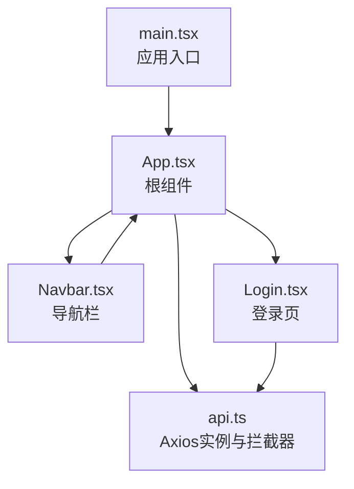
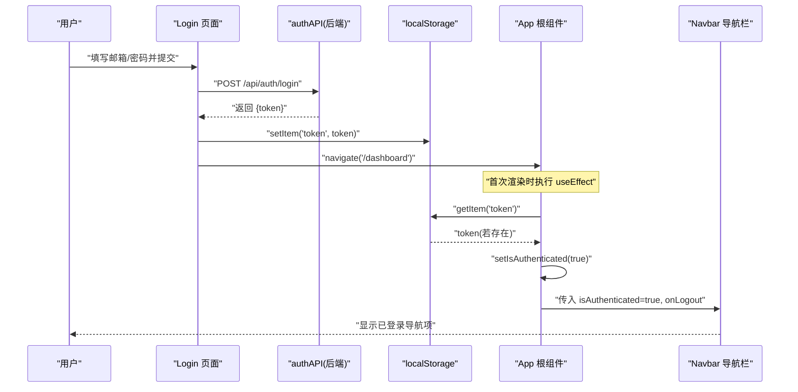
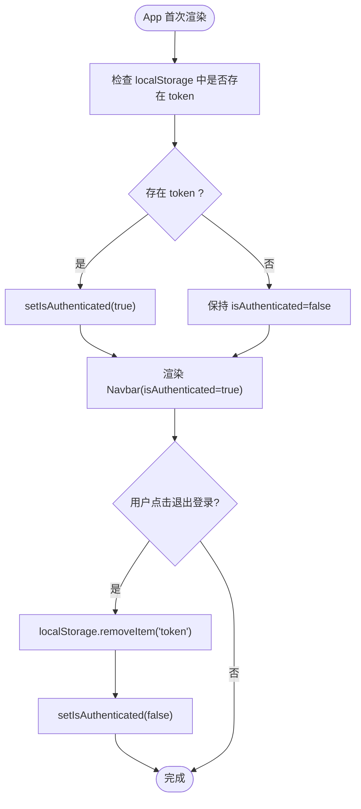
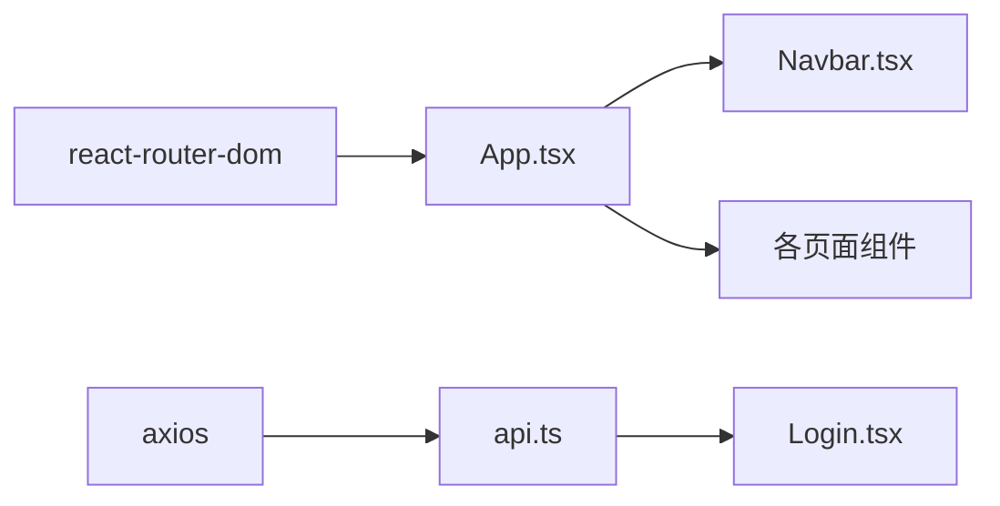

# 状态管理机制

<cite>
**本文引用的文件**
- [frontend/src/App.tsx](file://frontend/src/App.tsx)
- [frontend/src/components/Navbar.tsx](file://frontend/src/components/Navbar.tsx)
- [frontend/src/pages/Login.tsx](file://frontend/src/pages/Login.tsx)
- [frontend/src/services/api.ts](file://frontend/src/services/api.ts)
- [frontend/src/main.tsx](file://frontend/src/main.tsx)
- [frontend/package.json](file://frontend/package.json)
</cite>

## 目录
1. [引言](#引言)
2. [项目结构](#项目结构)
3. [核心组件](#核心组件)
4. [架构总览](#架构总览)
5. [详细组件分析](#详细组件分析)
6. [依赖关系分析](#依赖关系分析)
7. [性能考量](#性能考量)
8. [故障排查指南](#故障排查指南)
9. [结论](#结论)
10. [附录](#附录)

## 引言
本文件围绕前端应用的状态管理实现进行系统性剖析，重点聚焦于 App.tsx 中使用 useState 和 useEffect 管理用户认证状态（isAuthenticated）的技术细节，解释如何通过 localStorage 持久化 JWT 令牌并初始化认证状态；阐述状态提升模式在跨组件通信中的应用（将 isAuthenticated 与 handleLogout 传递给 Navbar 组件），并结合实际调用链路展示状态变更的触发条件与 UI 响应行为。同时，面向初学者提供 React 状态管理的基本概念与生命周期说明，面向高级开发者给出避免不必要重渲染、使用 useReducer 处理复杂状态逻辑的扩展建议，并讨论当前方案的局限性以及未来向 Redux 或 Context API 的演进路径。

## 项目结构
前端采用 React + Vite 架构，入口文件负责挂载根组件 App，App 负责路由与全局认证状态管理，并将认证状态与登出动作通过 props 提供给导航栏组件 Navbar。服务层通过 axios 实例统一注入 Authorization 头，确保后续请求携带 JWT 令牌。

图示来源
- [frontend/src/main.tsx](file://frontend/src/main.tsx#L1-L10)
- [frontend/src/App.tsx](file://frontend/src/App.tsx#L1-L48)
- [frontend/src/components/Navbar.tsx](file://frontend/src/components/Navbar.tsx#L1-L91)
- [frontend/src/pages/Login.tsx](file://frontend/src/pages/Login.tsx#L1-L109)
- [frontend/src/services/api.ts](file://frontend/src/services/api.ts#L1-L61)

章节来源
- [frontend/src/main.tsx](file://frontend/src/main.tsx#L1-L10)
- [frontend/src/App.tsx](file://frontend/src/App.tsx#L1-L48)
- [frontend/src/components/Navbar.tsx](file://frontend/src/components/Navbar.tsx#L1-L91)
- [frontend/src/pages/Login.tsx](file://frontend/src/pages/Login.tsx#L1-L109)
- [frontend/src/services/api.ts](file://frontend/src/services/api.ts#L1-L61)

## 核心组件
- App：负责全局认证状态初始化与登出操作，通过 useEffect 在首次渲染时从 localStorage 读取 token 并设置 isAuthenticated；通过 handleLogout 清除 token 并重置状态。
- Navbar：接收 isAuthenticated 与 onLogout 两个 props，根据认证状态切换显示“登录/注册”或“仪表板/运动计划/运动记录/个人资料/退出登录”的导航项。
- Login：处理表单提交，调用 authAPI.login 获取 token，写入 localStorage，并跳转到仪表板。
- api：创建 axios 实例并在请求拦截器中自动注入 Authorization 头，确保后续请求携带 JWT。

章节来源
- [frontend/src/App.tsx](file://frontend/src/App.tsx#L1-L48)
- [frontend/src/components/Navbar.tsx](file://frontend/src/components/Navbar.tsx#L1-L91)
- [frontend/src/pages/Login.tsx](file://frontend/src/pages/Login.tsx#L1-L109)
- [frontend/src/services/api.ts](file://frontend/src/services/api.ts#L1-L61)

## 架构总览
下图展示了认证状态在应用中的流转：用户访问登录页后提交表单，成功后写入 localStorage 的 token，随后导航到仪表板；应用重启或刷新时，App 在 useEffect 中读取 token 并设置 isAuthenticated，从而驱动 Navbar 展示已登录菜单。

图示来源
- [frontend/src/pages/Login.tsx](file://frontend/src/pages/Login.tsx#L1-L109)
- [frontend/src/services/api.ts](file://frontend/src/services/api.ts#L1-L61)
- [frontend/src/App.tsx](file://frontend/src/App.tsx#L1-L48)
- [frontend/src/components/Navbar.tsx](file://frontend/src/components/Navbar.tsx#L1-L91)

## 详细组件分析

### App.tsx：认证状态初始化与登出
- 状态定义与初始化
  - 使用 useState 定义 isAuthenticated 初始值为 false。
  - 使用 useEffect 在空依赖数组条件下仅在首次渲染时执行，从 localStorage 读取 token 并据此设置 isAuthenticated。
- 登出流程
  - handleLogout 移除 localStorage 中的 token，并将 isAuthenticated 置为 false。
- 与 Navbar 的状态提升
  - 将 isAuthenticated 与 handleLogout 作为 props 传递给 Navbar，使导航栏能根据认证状态渲染不同菜单，并在点击“退出登录”时回调登出逻辑。

图示来源
- [frontend/src/App.tsx](file://frontend/src/App.tsx#L1-L48)
- [frontend/src/components/Navbar.tsx](file://frontend/src/components/Navbar.tsx#L1-L91)

章节来源
- [frontend/src/App.tsx](file://frontend/src/App.tsx#L1-L48)

### Navbar.tsx：基于认证状态的 UI 切换
- 接收 props
  - isAuthenticated：布尔值，决定显示登录/注册或仪表板/运动计划/运动记录/个人资料/退出登录。
  - onLogout：函数，供按钮点击时触发登出。
- UI 行为
  - 已登录状态下显示多条导航链接与“退出登录”按钮；未登录时显示“登录”和“注册”入口。
  - 点击“退出登录”按钮触发 onLogout 回调，从而影响 App 的 isAuthenticated 状态。

章节来源
- [frontend/src/components/Navbar.tsx](file://frontend/src/components/Navbar.tsx#L1-L91)

### Login.tsx：登录流程与 token 写入
- 表单状态
  - 使用 useState 维护 email、password、loading、error 等本地状态。
- 登录流程
  - 提交表单后调用 authAPI.login 获取 token。
  - 成功后将 token 写入 localStorage，并使用 useNavigate 跳转到 /dashboard。
- 错误处理
  - 捕获异常并设置错误信息，finally 中恢复 loading 状态。

章节来源
- [frontend/src/pages/Login.tsx](file://frontend/src/pages/Login.tsx#L1-L109)
- [frontend/src/services/api.ts](file://frontend/src/services/api.ts#L1-L61)

### api.ts：Axios 实例与请求拦截器
- Axios 实例
  - 创建 baseURL 为后端 API 地址的 axios 实例。
- 请求拦截器
  - 在请求发送前从 localStorage 读取 token 并注入 Authorization 头，确保后续受保护接口的鉴权。
- 导出模块
  - 提供 authAPI、userAPI、workoutAPI、statsAPI 等模块化的 API 调用方法。

章节来源
- [frontend/src/services/api.ts](file://frontend/src/services/api.ts#L1-L61)

### main.tsx：应用挂载
- 使用 ReactDOM.createRoot 将 App 挂载到 DOM 根节点，启用 React.StrictMode。

章节来源
- [frontend/src/main.tsx](file://frontend/src/main.tsx#L1-L10)

## 依赖关系分析
- 组件依赖
  - App 依赖 Navbar、Login、Register、Dashboard、Workouts、WorkoutPlans、Profile、Home 等页面组件。
  - Login 依赖 authAPI。
  - api 为 Login 等页面提供统一的网络请求能力。
- 外部依赖
  - React、react-router-dom、axios。
- 关键交互
  - App 通过 props 向 Navbar 提供认证状态与登出回调，形成自上而下的状态提升模式。
  - Login 通过 localStorage 与 App 共享 token，实现跨组件的认证状态同步。

图示来源
- [frontend/src/App.tsx](file://frontend/src/App.tsx#L1-L48)
- [frontend/src/components/Navbar.tsx](file://frontend/src/components/Navbar.tsx#L1-L91)
- [frontend/src/pages/Login.tsx](file://frontend/src/pages/Login.tsx#L1-L109)
- [frontend/src/services/api.ts](file://frontend/src/services/api.ts#L1-L61)
- [frontend/package.json](file://frontend/package.json#L1-L32)

章节来源
- [frontend/package.json](file://frontend/package.json#L1-L32)

## 性能考量
- 避免不必要的重新渲染
  - 将 Navbar 包装在 React.memo 或使用 useMemo/useCallback 优化 props 传递，防止因 App 状态变化导致 Navbar 重复渲染。
  - 对 handleLogout 使用 useCallback 缓存函数引用，减少子组件重渲染。
- 状态粒度控制
  - 当认证状态与其他页面状态耦合较深时，考虑拆分状态或引入 useReducer，降低单一组件状态爆炸的风险。
- 初始化时机
  - App 的 useEffect 仅在首次渲染执行，避免每次渲染都读取 localStorage，提高启动性能。

[本节为通用指导，无需列出具体文件来源]

## 故障排查指南
- 登录后仍显示未登录
  - 检查 Login 是否正确写入 localStorage 的 token，确认 navigate 是否跳转到 /dashboard。
  - 在 App 的 useEffect 中确认是否能从 localStorage 读取到 token。
- 请求未携带 Authorization 头
  - 检查 api.ts 的请求拦截器是否生效，确认 localStorage 中是否存在 token。
- 退出登录后 UI 未更新
  - 确认 Navbar 接收到的 onLogout 是否被调用，App 的 handleLogout 是否移除了 token 并设置了 isAuthenticated=false。

章节来源
- [frontend/src/pages/Login.tsx](file://frontend/src/pages/Login.tsx#L1-L109)
- [frontend/src/services/api.ts](file://frontend/src/services/api.ts#L1-L61)
- [frontend/src/App.tsx](file://frontend/src/App.tsx#L1-L48)
- [frontend/src/components/Navbar.tsx](file://frontend/src/components/Navbar.tsx#L1-L91)

## 结论
当前前端应用采用轻量级 React Hooks 实现认证状态管理：通过 useState 管理 isAuthenticated，useEffect 在应用启动时从 localStorage 初始化状态，handleLogout 清除 token 并重置状态；通过状态提升将认证状态与登出回调传递给 Navbar，实现 UI 的动态切换。该方案简洁、直观，适合小型项目。对于更复杂的业务场景，建议引入 useReducer 或 Context API 以提升状态管理的可维护性与可扩展性；若团队已有状态管理规范，可进一步评估迁移到 Redux Toolkit 等成熟方案。

[本节为总结性内容，无需列出具体文件来源]

## 附录

### 初学者必知：React 状态管理基础
- 状态生命周期
  - useState 定义状态，set 函数触发组件重新渲染。
  - useEffect 在渲染后执行副作用，空依赖数组表示仅在首次渲染时执行。
- 副作用处理
  - 在 useEffect 中进行一次性初始化（如读取 localStorage）；在清理函数中释放资源（如取消订阅）。
- 状态提升
  - 将共享状态提升到最近的共同父组件，通过 props 向子组件传递，实现跨组件通信。

[本节为通用指导，无需列出具体文件来源]

### 高级实践：复杂状态与性能优化
- 使用 useReducer
  - 将与认证相关的多个状态（如 loading、error、user 等）合并为一个 reducer，集中处理状态变更逻辑，便于调试与扩展。
- 使用 Context API
  - 将认证上下文暴露给所有子组件，避免层层 props 下传，降低耦合度。
- 避免不必要重渲染
  - 使用 useCallback/memo 缓存回调与组件引用；合理拆分状态，减少无关状态变化引发的渲染。

[本节为通用指导，无需列出具体文件来源]