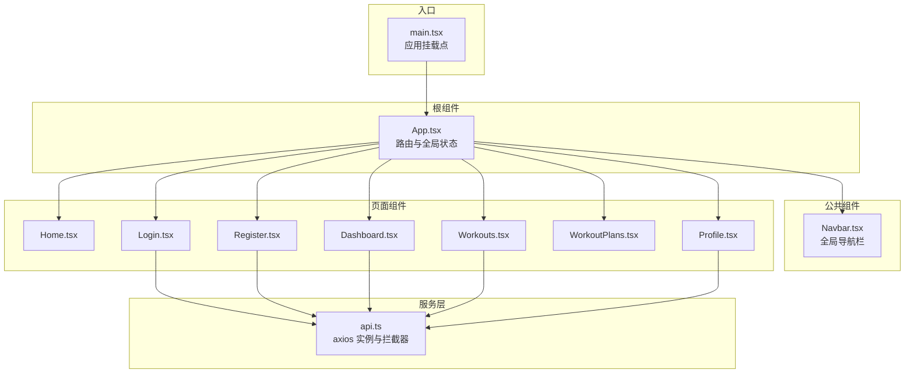
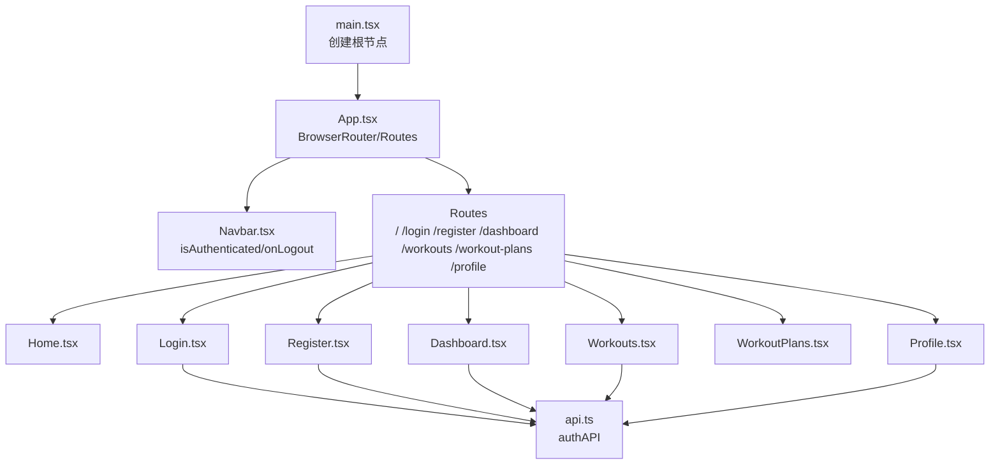
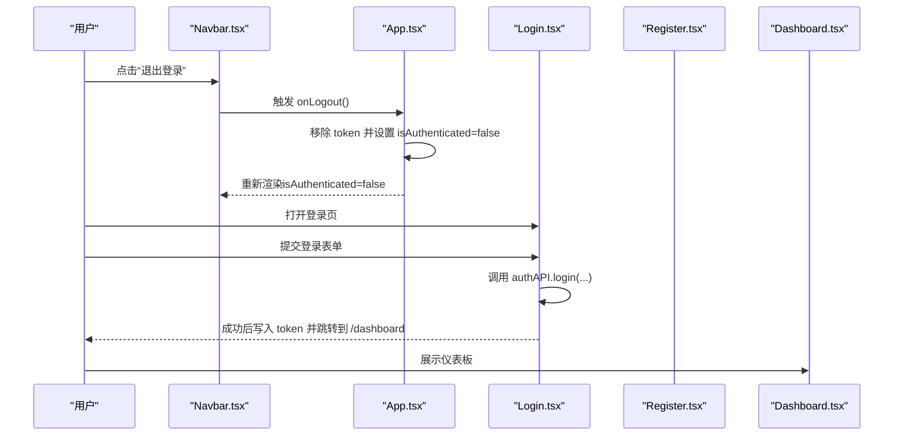
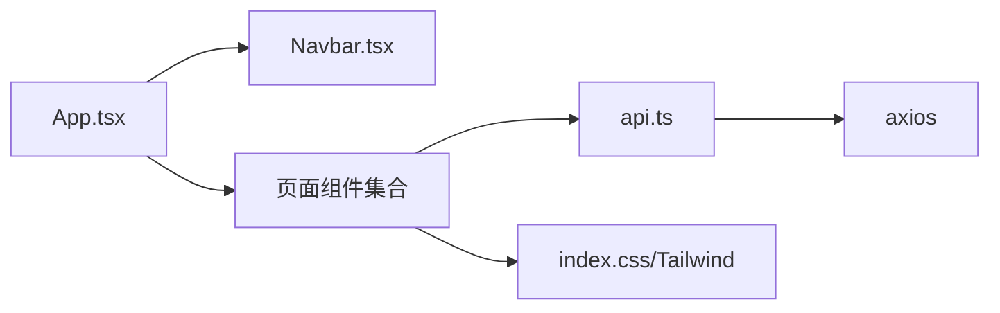

# 组件树结构

<cite>
**本文引用的文件**
- [frontend/src/App.tsx](file://frontend/src/App.tsx)
- [frontend/src/main.tsx](file://frontend/src/main.tsx)
- [frontend/src/components/Navbar.tsx](file://frontend/src/components/Navbar.tsx)
- [frontend/src/pages/Home.tsx](file://frontend/src/pages/Home.tsx)
- [frontend/src/pages/Login.tsx](file://frontend/src/pages/Login.tsx)
- [frontend/src/pages/Register.tsx](file://frontend/src/pages/Register.tsx)
- [frontend/src/pages/Dashboard.tsx](file://frontend/src/pages/Dashboard.tsx)
- [frontend/src/pages/Workouts.tsx](file://frontend/src/pages/Workouts.tsx)
- [frontend/src/pages/WorkoutPlans.tsx](file://frontend/src/pages/WorkoutPlans.tsx)
- [frontend/src/pages/Profile.tsx](file://frontend/src/pages/Profile.tsx)
- [frontend/src/services/api.ts](file://frontend/src/services/api.ts)
- [frontend/src/index.css](file://frontend/src/index.css)
- [frontend/src/App.css](file://frontend/src/App.css)
</cite>

## 目录
1. [简介](#简介)
2. [项目结构](#项目结构)
3. [核心组件](#核心组件)
4. [架构总览](#架构总览)
5. [组件树与路由详解](#组件树与路由详解)
6. [依赖关系分析](#依赖关系分析)
7. [性能与优化建议](#性能与优化建议)
8. [故障排查指南](#故障排查指南)
9. [结论](#结论)

## 简介
本文件系统性梳理前端组件树结构，围绕以 App.tsx 为根组件的 React 应用，结合 React Router 的路由配置，完整呈现页面组件（Home、Login、Register、Dashboard、Workouts、WorkoutPlans、Profile）与公共组件（Navbar）的嵌套关系与职责分工。文档还解释了组件间数据传递方式（如 isAuthenticated 状态与 onLogout 回调），并提供组件树可视化图示、路由驱动渲染流程以及面向初学者与高级开发者的实践建议与性能优化策略。

## 项目结构
前端采用按功能分层的目录组织：
- 根组件与入口：App.tsx、main.tsx
- 页面组件：Home、Login、Register、Dashboard、Workouts、WorkoutPlans、Profile
- 公共组件：Navbar
- 服务层：api.ts（封装 axios 请求与鉴权拦截器）
- 样式：index.css（Tailwind 引入）、App.css（基础样式）

**图表来源**
- [frontend/src/main.tsx](file://frontend/src/main.tsx#L1-L10)
- [frontend/src/App.tsx](file://frontend/src/App.tsx#L1-L48)
- [frontend/src/components/Navbar.tsx](file://frontend/src/components/Navbar.tsx#L1-L91)
- [frontend/src/pages/Home.tsx](file://frontend/src/pages/Home.tsx#L1-L110)
- [frontend/src/pages/Login.tsx](file://frontend/src/pages/Login.tsx#L1-L109)
- [frontend/src/pages/Register.tsx](file://frontend/src/pages/Register.tsx#L1-L149)
- [frontend/src/pages/Dashboard.tsx](file://frontend/src/pages/Dashboard.tsx#L1-L174)
- [frontend/src/pages/Workouts.tsx](file://frontend/src/pages/Workouts.tsx#L1-L384)
- [frontend/src/pages/WorkoutPlans.tsx](file://frontend/src/pages/WorkoutPlans.tsx#L1-L345)
- [frontend/src/pages/Profile.tsx](file://frontend/src/pages/Profile.tsx#L1-L245)
- [frontend/src/services/api.ts](file://frontend/src/services/api.ts#L1-L61)

**章节来源**
- [frontend/src/main.tsx](file://frontend/src/main.tsx#L1-L10)
- [frontend/src/App.tsx](file://frontend/src/App.tsx#L1-L48)
- [frontend/src/index.css](file://frontend/src/index.css#L1-L16)
- [frontend/src/App.css](file://frontend/src/App.css#L1-L19)

## 核心组件
- App.tsx：应用根组件，负责：
  - 全局认证状态管理（读取本地存储 token，初始化 isAuthenticated）
  - 提供 onLogout 回调（移除 token 并重置状态）
  - 使用 React Router 配置路由表，渲染对应页面组件
- Navbar.tsx：全局导航栏，根据 isAuthenticated 决定显示登录/注册或仪表板/计划/记录/个人资料与退出登录菜单项，并接收 onLogout 回调用于登出操作
- 页面组件职责概览：
  - Home：首页引导与特性介绍
  - Login/ Register：用户认证流程，调用 authAPI 完成登录/注册，成功后写入 token 并跳转
  - Dashboard：聚合统计与图表展示，使用 statsAPI 获取数据
  - Workouts：运动记录的增删改查，使用 workoutAPI
  - WorkoutPlans：运动计划的增删改查（示例数据演示）
  - Profile：用户资料查询与更新，使用 userAPI

**章节来源**
- [frontend/src/App.tsx](file://frontend/src/App.tsx#L1-L48)
- [frontend/src/components/Navbar.tsx](file://frontend/src/components/Navbar.tsx#L1-L91)
- [frontend/src/pages/Login.tsx](file://frontend/src/pages/Login.tsx#L1-L109)
- [frontend/src/pages/Register.tsx](file://frontend/src/pages/Register.tsx#L1-L149)
- [frontend/src/pages/Dashboard.tsx](file://frontend/src/pages/Dashboard.tsx#L1-L174)
- [frontend/src/pages/Workouts.tsx](file://frontend/src/pages/Workouts.tsx#L1-L384)
- [frontend/src/pages/WorkoutPlans.tsx](file://frontend/src/pages/WorkoutPlans.tsx#L1-L345)
- [frontend/src/pages/Profile.tsx](file://frontend/src/pages/Profile.tsx#L1-L245)

## 架构总览
下图展示了从入口到页面组件的渲染路径，以及 Navbar 如何作为全局导航贯穿各页面。

**图表来源**
- [frontend/src/main.tsx](file://frontend/src/main.tsx#L1-L10)
- [frontend/src/App.tsx](file://frontend/src/App.tsx#L1-L48)
- [frontend/src/components/Navbar.tsx](file://frontend/src/components/Navbar.tsx#L1-L91)
- [frontend/src/services/api.ts](file://frontend/src/services/api.ts#L1-L61)

## 组件树与路由详解
- 组件树结构（以 App.tsx 为根）：
  - App.tsx
    - Navbar（全局导航）
    - Routes（路由容器）
      - Home
      - Login
      - Register
      - Dashboard
      - Workouts
      - WorkoutPlans
      - Profile
- 路由配置与渲染：
  - App.tsx 中定义了多条路由规则，每个路径映射到一个页面组件；当 URL 匹配到某个路径时，对应的页面组件被渲染到 Routes 容器内
- 组件间数据传递：
  - App.tsx 向 Navbar 传递两个 props：
    - isAuthenticated：布尔值，决定导航菜单显示登录/注册还是仪表板/计划/记录/个人资料与退出登录
    - onLogout：函数，Navbar 在点击退出登录时触发，App.tsx 内部实现会移除 token 并重置认证状态
  - 登录/注册成功后，页面通过导航跳转至 Dashboard，从而展示受保护内容

**图表来源**
- [frontend/src/components/Navbar.tsx](file://frontend/src/components/Navbar.tsx#L1-L91)
- [frontend/src/App.tsx](file://frontend/src/App.tsx#L1-L48)
- [frontend/src/pages/Login.tsx](file://frontend/src/pages/Login.tsx#L1-L109)
- [frontend/src/pages/Dashboard.tsx](file://frontend/src/pages/Dashboard.tsx#L1-L174)

**章节来源**
- [frontend/src/App.tsx](file://frontend/src/App.tsx#L1-L48)
- [frontend/src/components/Navbar.tsx](file://frontend/src/components/Navbar.tsx#L1-L91)
- [frontend/src/pages/Login.tsx](file://frontend/src/pages/Login.tsx#L1-L109)
- [frontend/src/pages/Register.tsx](file://frontend/src/pages/Register.tsx#L1-L149)
- [frontend/src/pages/Dashboard.tsx](file://frontend/src/pages/Dashboard.tsx#L1-L174)

## 依赖关系分析
- 组件依赖：
  - App.tsx 依赖 Navbar、各页面组件与 React Router
  - Navbar 依赖 React Router Link 进行导航
  - 页面组件依赖 api.ts 提供的服务方法（authAPI、userAPI、workoutAPI、statsAPI）
- 服务层依赖：
  - api.ts 基于 axios 创建实例，统一设置 baseURL 与请求头，并注入 Authorization 拦截器（从本地存储读取 token）
- 样式依赖：
  - index.css 引入 Tailwind，页面组件通过类名实现响应式布局与主题色系

**图表来源**
- [frontend/src/App.tsx](file://frontend/src/App.tsx#L1-L48)
- [frontend/src/components/Navbar.tsx](file://frontend/src/components/Navbar.tsx#L1-L91)
- [frontend/src/pages/Dashboard.tsx](file://frontend/src/pages/Dashboard.tsx#L1-L174)
- [frontend/src/pages/Workouts.tsx](file://frontend/src/pages/Workouts.tsx#L1-L384)
- [frontend/src/pages/Profile.tsx](file://frontend/src/pages/Profile.tsx#L1-L245)
- [frontend/src/services/api.ts](file://frontend/src/services/api.ts#L1-L61)
- [frontend/src/index.css](file://frontend/src/index.css#L1-L16)

**章节来源**
- [frontend/src/services/api.ts](file://frontend/src/services/api.ts#L1-L61)
- [frontend/src/index.css](file://frontend/src/index.css#L1-L16)

## 性能与优化建议
- 初学者建议
  - 使用 React.lazy 与 Suspense 对大型页面组件进行懒加载，减少首屏包体
  - 将不常访问的页面（如 Profile、WorkoutPlans）拆分为独立 chunk
- 高级开发者建议
  - 结合 React Router v6 的 lazy 加载模式，配合动态导入实现按需加载
  - 对 Dashboard 的图表渲染进行节流/防抖处理，避免频繁重绘
  - 对 Workouts 列表使用虚拟滚动（如 react-window）提升大数据集渲染性能
  - 对 API 请求结果进行缓存（如查询参数稳定时可缓存响应），减少重复请求
  - 使用 React.memo 或 useMemo/useCallback 降低 Navbar 与列表组件的重渲染
  - 代码分割策略：将第三方库（如图表库）与业务代码分离，优先加载核心路由组件

[本节为通用性能指导，无需特定文件引用]

## 故障排查指南
- 登录/注册后无法进入 Dashboard
  - 检查本地存储是否存在 token；确认 App.tsx 初始化逻辑是否正确读取 token
  - 确认 authAPI.login/register 返回的 token 是否写入 localStorage
  - 确认路由跳转是否执行（useNavigate 调用）
- 仪表板数据为空或报错
  - 检查 statsAPI.getWorkoutStats 与 getWeeklyStats 的返回格式与字段
  - 确认请求拦截器已注入 Authorization 头（基于 token）
- 运动记录无法增删改
  - 检查 workoutAPI 的 create/update/delete 接口是否正确传参
  - 确认列表刷新逻辑（提交后重新拉取数据）
- 个人资料更新失败
  - 检查 userAPI.updateProfile 的请求体字段与后端接口一致性
  - 关注错误提示与网络请求状态码

**章节来源**
- [frontend/src/App.tsx](file://frontend/src/App.tsx#L1-L48)
- [frontend/src/pages/Login.tsx](file://frontend/src/pages/Login.tsx#L1-L109)
- [frontend/src/pages/Register.tsx](file://frontend/src/pages/Register.tsx#L1-L149)
- [frontend/src/pages/Dashboard.tsx](file://frontend/src/pages/Dashboard.tsx#L1-L174)
- [frontend/src/pages/Workouts.tsx](file://frontend/src/pages/Workouts.tsx#L1-L384)
- [frontend/src/pages/Profile.tsx](file://frontend/src/pages/Profile.tsx#L1-L245)
- [frontend/src/services/api.ts](file://frontend/src/services/api.ts#L1-L61)

## 结论
该前端应用以 App.tsx 为根，通过 React Router 组织页面组件，Navbar 作为全局导航贯穿始终。组件间通过 props（isAuthenticated、onLogout）与服务层（api.ts）实现数据与行为的解耦。对于初学者，建议从组件职责与路由配置入手；对于高级开发者，应关注懒加载、代码分割与渲染性能优化，以获得更佳的用户体验与维护性。