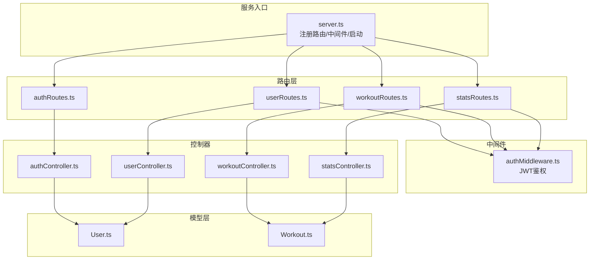
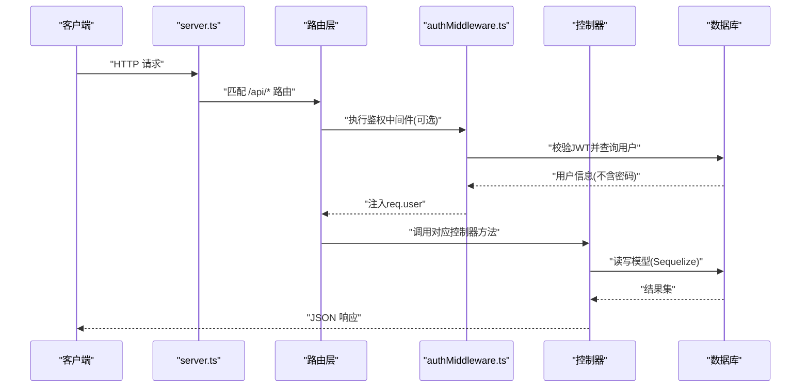
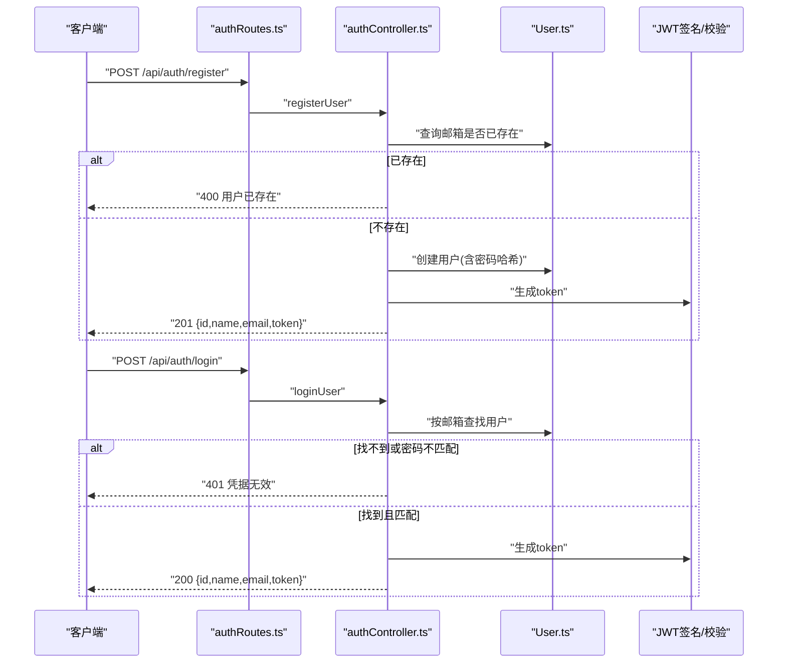
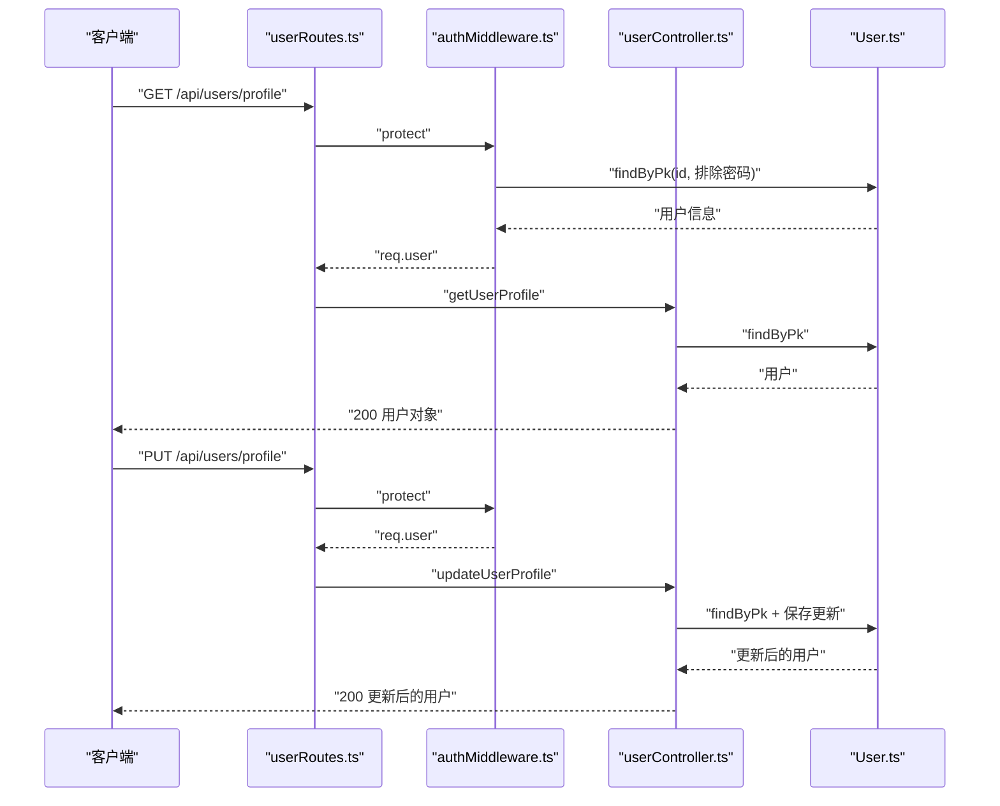
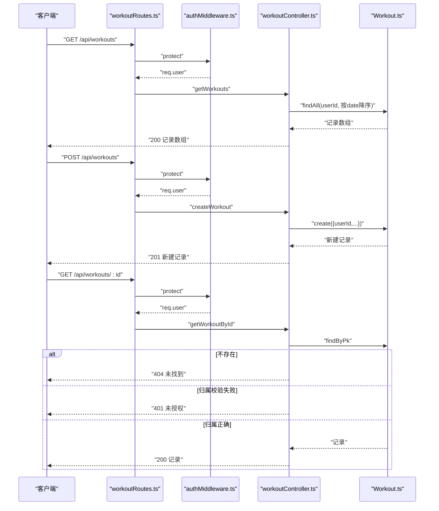
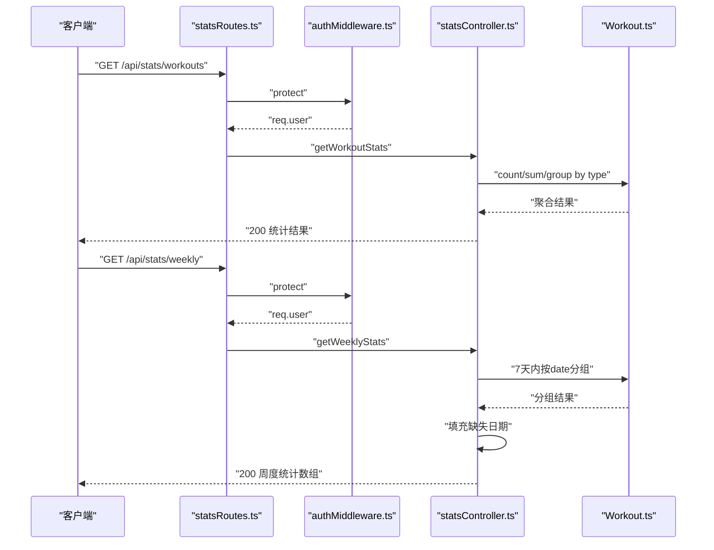
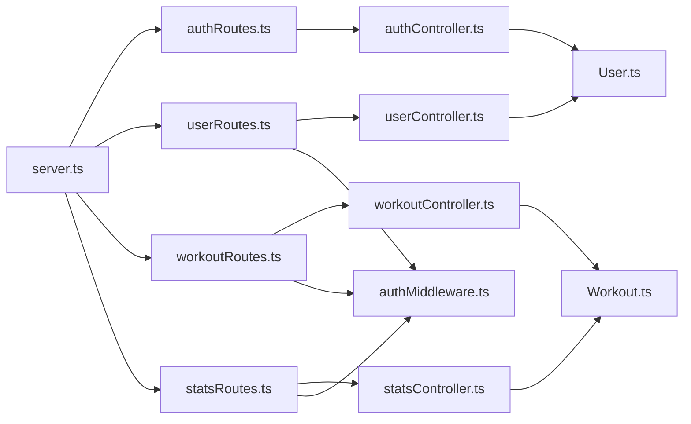

# API端点

<cite>
**本文引用的文件**
- [backend/src/server.ts](file://backend/src/server.ts)
- [backend/src/config/db.ts](file://backend/src/config/db.ts)
- [backend/src/middleware/authMiddleware.ts](file://backend/src/middleware/authMiddleware.ts)
- [backend/src/controllers/authController.ts](file://backend/src/controllers/authController.ts)
- [backend/src/controllers/userController.ts](file://backend/src/controllers/userController.ts)
- [backend/src/controllers/workoutController.ts](file://backend/src/controllers/workoutController.ts)
- [backend/src/controllers/statsController.ts](file://backend/src/controllers/statsController.ts)
- [backend/src/routes/authRoutes.ts](file://backend/src/routes/authRoutes.ts)
- [backend/src/routes/userRoutes.ts](file://backend/src/routes/userRoutes.ts)
- [backend/src/routes/workoutRoutes.ts](file://backend/src/routes/workoutRoutes.ts)
- [backend/src/routes/statsRoutes.ts](file://backend/src/routes/statsRoutes.ts)
- [backend/src/models/User.ts](file://backend/src/models/User.ts)
- [backend/src/models/Workout.ts](file://backend/src/models/Workout.ts)
- [backend/.env](file://backend/.env)
- [docs/4. API接口文档.md](file://docs/4. API接口文档.md)
</cite>

## 目录
1. [简介](#简介)
2. [项目结构](#项目结构)
3. [核心组件](#核心组件)
4. [架构总览](#架构总览)
5. [详细组件分析](#详细组件分析)
6. [依赖关系分析](#依赖关系分析)
7. [性能与安全考虑](#性能与安全考虑)
8. [故障排查指南](#故障排查指南)
9. [结论](#结论)
10. [附录：客户端调用示例](#附录客户端调用示例)

## 简介
本文件为健身追踪平台的RESTful API接口文档，覆盖认证、用户、运动记录与统计四大模块。文档基于后端源码实现，提供端点定义、请求/响应示例、参数说明、认证要求与错误码，并通过序列图与流程图展示请求处理流程与数据转换逻辑，帮助前后端协作与集成。

## 项目结构
后端采用Express + Sequelize 架构，按功能拆分控制器、路由、中间件与模型层，服务入口在服务器文件中注册路由并启动监听。

图表来源
- [backend/src/server.ts](file://backend/src/server.ts#L1-L36)
- [backend/src/routes/authRoutes.ts](file://backend/src/routes/authRoutes.ts#L1-L9)
- [backend/src/routes/userRoutes.ts](file://backend/src/routes/userRoutes.ts#L1-L11)
- [backend/src/routes/workoutRoutes.ts](file://backend/src/routes/workoutRoutes.ts#L1-L22)
- [backend/src/routes/statsRoutes.ts](file://backend/src/routes/statsRoutes.ts#L1-L10)
- [backend/src/middleware/authMiddleware.ts](file://backend/src/middleware/authMiddleware.ts#L1-L36)
- [backend/src/controllers/authController.ts](file://backend/src/controllers/authController.ts#L1-L71)
- [backend/src/controllers/userController.ts](file://backend/src/controllers/userController.ts#L1-L60)
- [backend/src/controllers/workoutController.ts](file://backend/src/controllers/workoutController.ts#L1-L132)
- [backend/src/controllers/statsController.ts](file://backend/src/controllers/statsController.ts#L1-L119)
- [backend/src/models/User.ts](file://backend/src/models/User.ts#L1-L119)
- [backend/src/models/Workout.ts](file://backend/src/models/Workout.ts#L1-L122)

章节来源
- [backend/src/server.ts](file://backend/src/server.ts#L1-L36)
- [backend/src/config/db.ts](file://backend/src/config/db.ts#L1-L41)

## 核心组件
- 服务器入口：加载环境变量、连接数据库、注册路由、开启监听。
- 中间件：JWT鉴权，从请求头提取Bearer Token并校验，注入用户上下文。
- 控制器：实现各业务端点的请求处理、数据查询与返回。
- 路由：定义URL路径与HTTP方法到控制器的映射。
- 模型：User与Workout实体及验证规则、关联关系与钩子。

章节来源
- [backend/src/server.ts](file://backend/src/server.ts#L1-L36)
- [backend/src/middleware/authMiddleware.ts](file://backend/src/middleware/authMiddleware.ts#L1-L36)
- [backend/src/models/User.ts](file://backend/src/models/User.ts#L1-L119)
- [backend/src/models/Workout.ts](file://backend/src/models/Workout.ts#L1-L122)

## 架构总览
下图展示从客户端到控制器的典型请求链路，以及JWT鉴权与数据库交互的关键步骤。

图表来源
- [backend/src/server.ts](file://backend/src/server.ts#L1-L36)
- [backend/src/middleware/authMiddleware.ts](file://backend/src/middleware/authMiddleware.ts#L1-L36)
- [backend/src/controllers/authController.ts](file://backend/src/controllers/authController.ts#L1-L71)
- [backend/src/controllers/userController.ts](file://backend/src/controllers/userController.ts#L1-L60)
- [backend/src/controllers/workoutController.ts](file://backend/src/controllers/workoutController.ts#L1-L132)
- [backend/src/controllers/statsController.ts](file://backend/src/controllers/statsController.ts#L1-L119)
- [backend/src/models/User.ts](file://backend/src/models/User.ts#L1-L119)
- [backend/src/models/Workout.ts](file://backend/src/models/Workout.ts#L1-L122)

## 详细组件分析

### 认证接口
- 端点列表
  - POST /api/auth/register
  - POST /api/auth/login

- 认证要求
  - 公开接口，无需Bearer Token。

- 请求与响应
  - 注册
    - 请求体字段：name, email, password
    - 成功响应：id, name, email, token
    - 失败响应：用户已存在、无效数据、服务器错误
  - 登录
    - 请求体字段：email, password
    - 成功响应：id, name, email, token
    - 失败响应：凭据无效、服务器错误

- 错误码
  - 400：重复用户或无效数据
  - 401：凭据无效
  - 500：服务器内部错误

- 请求处理流程
  - 注册：检查邮箱唯一性，创建用户并生成JWT；更新密码使用哈希钩子。
  - 登录：根据邮箱查找用户，比对密码，成功则签发JWT。

图表来源
- [backend/src/routes/authRoutes.ts](file://backend/src/routes/authRoutes.ts#L1-L9)
- [backend/src/controllers/authController.ts](file://backend/src/controllers/authController.ts#L1-L71)
- [backend/src/models/User.ts](file://backend/src/models/User.ts#L1-L119)

章节来源
- [backend/src/controllers/authController.ts](file://backend/src/controllers/authController.ts#L1-L71)
- [backend/src/routes/authRoutes.ts](file://backend/src/routes/authRoutes.ts#L1-L9)
- [backend/src/models/User.ts](file://backend/src/models/User.ts#L1-L119)

### 用户接口
- 端点列表
  - GET /api/users/profile
  - PUT /api/users/profile

- 认证要求
  - 需要Bearer Token（受保护路由）。

- 请求与响应
  - 获取资料
    - 请求头：Authorization: Bearer <token>
    - 成功响应：用户对象（排除密码）
    - 失败响应：用户不存在、未授权、服务器错误
  - 更新资料
    - 请求头：Authorization: Bearer <token>
    - 请求体字段：name, age, height, weight, gender（可选）
    - 成功响应：更新后的用户对象
    - 失败响应：用户不存在、未授权、服务器错误

- 错误码
  - 401：未授权（无token或token无效）
  - 404：用户不存在
  - 500：服务器内部错误

- 请求处理流程
  - 鉴权中间件解析token，注入用户信息；控制器按ID查询并返回或更新。

图表来源
- [backend/src/routes/userRoutes.ts](file://backend/src/routes/userRoutes.ts#L1-L11)
- [backend/src/middleware/authMiddleware.ts](file://backend/src/middleware/authMiddleware.ts#L1-L36)
- [backend/src/controllers/userController.ts](file://backend/src/controllers/userController.ts#L1-L60)
- [backend/src/models/User.ts](file://backend/src/models/User.ts#L1-L119)

章节来源
- [backend/src/controllers/userController.ts](file://backend/src/controllers/userController.ts#L1-L60)
- [backend/src/routes/userRoutes.ts](file://backend/src/routes/userRoutes.ts#L1-L11)
- [backend/src/middleware/authMiddleware.ts](file://backend/src/middleware/authMiddleware.ts#L1-L36)

### 运动记录接口
- 端点列表
  - GET /api/workouts
  - POST /api/workouts
  - GET /api/workouts/:id
  - PUT /api/workouts/:id
  - DELETE /api/workouts/:id

- 认证要求
  - 需要Bearer Token（受保护路由）。

- 请求与响应
  - 获取全部
    - 请求头：Authorization: Bearer <token>
    - 成功响应：按日期降序排列的运动记录数组
    - 失败响应：服务器错误
  - 创建
    - 请求头：Authorization: Bearer <token>
    - 请求体字段：name, type, duration, calories, distance, steps, date, notes
    - 成功响应：新建记录
    - 失败响应：服务器错误
  - 获取单条
    - 请求头：Authorization: Bearer <token>
    - 成功响应：指定记录
    - 失败响应：未找到、未授权、服务器错误
  - 更新
    - 请求头：Authorization: Bearer <token>
    - 请求体字段：name, type, duration, calories, distance, steps, date, notes（部分字段可选）
    - 成功响应：更新后的记录
    - 失败响应：未找到、未授权、服务器错误
  - 删除
    - 请求头：Authorization: Bearer <token>
    - 成功响应：删除成功消息
    - 失败响应：未找到、未授权、服务器错误

- 错误码
  - 401：未授权（无token、token无效、非本人记录）
  - 404：资源不存在
  - 500：服务器内部错误

- 请求处理流程
  - 鉴权中间件解析token并注入用户；控制器按用户ID过滤数据；更新/删除前进行归属校验。

图表来源
- [backend/src/routes/workoutRoutes.ts](file://backend/src/routes/workoutRoutes.ts#L1-L22)
- [backend/src/middleware/authMiddleware.ts](file://backend/src/middleware/authMiddleware.ts#L1-L36)
- [backend/src/controllers/workoutController.ts](file://backend/src/controllers/workoutController.ts#L1-L132)
- [backend/src/models/Workout.ts](file://backend/src/models/Workout.ts#L1-L122)

章节来源
- [backend/src/controllers/workoutController.ts](file://backend/src/controllers/workoutController.ts#L1-L132)
- [backend/src/routes/workoutRoutes.ts](file://backend/src/routes/workoutRoutes.ts#L1-L22)
- [backend/src/middleware/authMiddleware.ts](file://backend/src/middleware/authMiddleware.ts#L1-L36)

### 统计接口
- 端点列表
  - GET /api/stats/workouts
  - GET /api/stats/weekly

- 认证要求
  - 需要Bearer Token（受保护路由）。

- 请求与响应
  - 运动统计
    - 请求头：Authorization: Bearer <token>
    - 成功响应：totalWorkouts, totalDuration, totalCalories, totalDistance, workoutsByType
    - 失败响应：服务器错误
  - 周度统计
    - 请求头：Authorization: Bearer <token>
    - 成功响应：7天连续日期的数组，每项包含date, duration, calories, workouts
    - 失败响应：服务器错误

- 错误码
  - 401：未授权
  - 500：服务器内部错误

- 请求处理流程
  - 统计接口按当前用户ID聚合数据；周度统计按最近7天分组并填充缺失日期。

图表来源
- [backend/src/routes/statsRoutes.ts](file://backend/src/routes/statsRoutes.ts#L1-L10)
- [backend/src/middleware/authMiddleware.ts](file://backend/src/middleware/authMiddleware.ts#L1-L36)
- [backend/src/controllers/statsController.ts](file://backend/src/controllers/statsController.ts#L1-L119)
- [backend/src/models/Workout.ts](file://backend/src/models/Workout.ts#L1-L122)

章节来源
- [backend/src/controllers/statsController.ts](file://backend/src/controllers/statsController.ts#L1-L119)
- [backend/src/routes/statsRoutes.ts](file://backend/src/routes/statsRoutes.ts#L1-L10)
- [backend/src/middleware/authMiddleware.ts](file://backend/src/middleware/authMiddleware.ts#L1-L36)

## 依赖关系分析
- 路由到控制器：各路由文件将HTTP方法绑定到对应控制器函数。
- 控制器到模型：控制器通过Sequelize ORM访问数据库，User与Workout模型定义了字段、验证与关联。
- 中间件到控制器：受保护路由在进入控制器前执行JWT校验，失败返回401。
- 服务器到路由：server.ts统一注册各模块路由并启用CORS与JSON解析。

图表来源
- [backend/src/server.ts](file://backend/src/server.ts#L1-L36)
- [backend/src/routes/authRoutes.ts](file://backend/src/routes/authRoutes.ts#L1-L9)
- [backend/src/routes/userRoutes.ts](file://backend/src/routes/userRoutes.ts#L1-L11)
- [backend/src/routes/workoutRoutes.ts](file://backend/src/routes/workoutRoutes.ts#L1-L22)
- [backend/src/routes/statsRoutes.ts](file://backend/src/routes/statsRoutes.ts#L1-L10)
- [backend/src/middleware/authMiddleware.ts](file://backend/src/middleware/authMiddleware.ts#L1-L36)
- [backend/src/controllers/authController.ts](file://backend/src/controllers/authController.ts#L1-L71)
- [backend/src/controllers/userController.ts](file://backend/src/controllers/userController.ts#L1-L60)
- [backend/src/controllers/workoutController.ts](file://backend/src/controllers/workoutController.ts#L1-L132)
- [backend/src/controllers/statsController.ts](file://backend/src/controllers/statsController.ts#L1-L119)
- [backend/src/models/User.ts](file://backend/src/models/User.ts#L1-L119)
- [backend/src/models/Workout.ts](file://backend/src/models/Workout.ts#L1-L122)

章节来源
- [backend/src/server.ts](file://backend/src/server.ts#L1-L36)
- [backend/src/middleware/authMiddleware.ts](file://backend/src/middleware/authMiddleware.ts#L1-L36)
- [backend/src/models/User.ts](file://backend/src/models/User.ts#L1-L119)
- [backend/src/models/Workout.ts](file://backend/src/models/Workout.ts#L1-L122)

## 性能与安全考虑
- 安全
  - 使用JWT进行状态无感鉴权，需确保密钥安全存储与传输。
  - 密码在模型钩子中进行哈希处理，避免明文存储。
  - 受保护路由必须携带有效token，否则拒绝访问。
- 性能
  - 统计接口使用聚合查询（count/sum/group），建议在相关列建立索引以优化查询。
  - 分页与筛选可在控制器中扩展，避免一次性返回大量数据。
- 可靠性
  - 异常捕获统一返回500，便于前端统一处理。
  - 数据库连接与同步在启动时完成，异常退出进程，保证一致性。

[本节为通用指导，不直接分析具体文件]

## 故障排查指南
- 401 未授权
  - 检查请求头Authorization是否为Bearer <token>格式。
  - 确认token未过期且与用户匹配。
- 404 资源不存在
  - 确认ID是否存在，或用户是否拥有该资源的访问权限。
- 500 服务器错误
  - 查看服务端日志，确认数据库连接与SQL执行情况。
- 环境变量
  - 确认JWT密钥与数据库连接参数正确。

章节来源
- [backend/src/middleware/authMiddleware.ts](file://backend/src/middleware/authMiddleware.ts#L1-L36)
- [backend/src/config/db.ts](file://backend/src/config/db.ts#L1-L41)
- [backend/.env](file://backend/.env#L1-L10)

## 结论
本API文档基于实际代码实现，明确了认证、用户、运动记录与统计接口的端点、参数、响应与错误码，并通过流程图展示了鉴权与数据聚合过程。建议在生产环境中强化安全策略（如HTTPS、限流、输入校验）与监控告警，持续优化数据库索引与查询性能。

[本节为总结性内容，不直接分析具体文件]

## 附录：客户端调用示例
以下示例仅展示请求结构与关键字段，不包含具体代码片段。

- 认证
  - 注册
    - 方法与URL：POST /api/auth/register
    - 请求头：Content-Type: application/json
    - 请求体：
      - name: 字符串
      - email: 邮箱字符串
      - password: 字符串（长度≥6）
    - 成功响应字段：id, name, email, token
  - 登录
    - 方法与URL：POST /api/auth/login
    - 请求体：
      - email: 邮箱字符串
      - password: 字符串
    - 成功响应字段：id, name, email, token

- 用户资料
  - 获取资料
    - 方法与URL：GET /api/users/profile
    - 请求头：Authorization: Bearer <token>
    - 成功响应字段：id, name, email, age, height, weight, gender
  - 更新资料
    - 方法与URL：PUT /api/users/profile
    - 请求头：Authorization: Bearer <token>
    - 请求体（可选字段）：name, age, height, weight, gender
    - 成功响应字段：id, name, email, age, height, weight, gender

- 运动记录
  - 获取全部
    - 方法与URL：GET /api/workouts
    - 请求头：Authorization: Bearer <token>
    - 成功响应：数组，元素字段：id, name, type, duration, calories, distance, steps, date, notes
  - 创建
    - 方法与URL：POST /api/workouts
    - 请求头：Authorization: Bearer <token>
    - 请求体字段：name, type, duration, calories, distance, steps, date, notes
    - 成功响应：新建记录对象
  - 获取单条
    - 方法与URL：GET /api/workouts/:id
    - 请求头：Authorization: Bearer <token>
    - 成功响应：记录对象
  - 更新
    - 方法与URL：PUT /api/workouts/:id
    - 请求头：Authorization: Bearer <token>
    - 请求体字段：name, type, duration, calories, distance, steps, date, notes
    - 成功响应：更新后的记录对象
  - 删除
    - 方法与URL：DELETE /api/workouts/:id
    - 请求头：Authorization: Bearer <token>
    - 成功响应：{ message: "运动记录移除" }

- 统计
  - 运动统计
    - 方法与URL：GET /api/stats/workouts
    - 请求头：Authorization: Bearer <token>
    - 成功响应字段：totalWorkouts, totalDuration, totalCalories, totalDistance, workoutsByType
  - 周度统计
    - 方法与URL：GET /api/stats/weekly
    - 请求头：Authorization: Bearer <token>
    - 成功响应：数组，元素字段：date, duration, calories, workouts

章节来源
- [docs/4. API接口文档.md](file://docs/4. API接口文档.md#L1-L275)
- [backend/src/controllers/authController.ts](file://backend/src/controllers/authController.ts#L1-L71)
- [backend/src/controllers/userController.ts](file://backend/src/controllers/userController.ts#L1-L60)
- [backend/src/controllers/workoutController.ts](file://backend/src/controllers/workoutController.ts#L1-L132)
- [backend/src/controllers/statsController.ts](file://backend/src/controllers/statsController.ts#L1-L119)