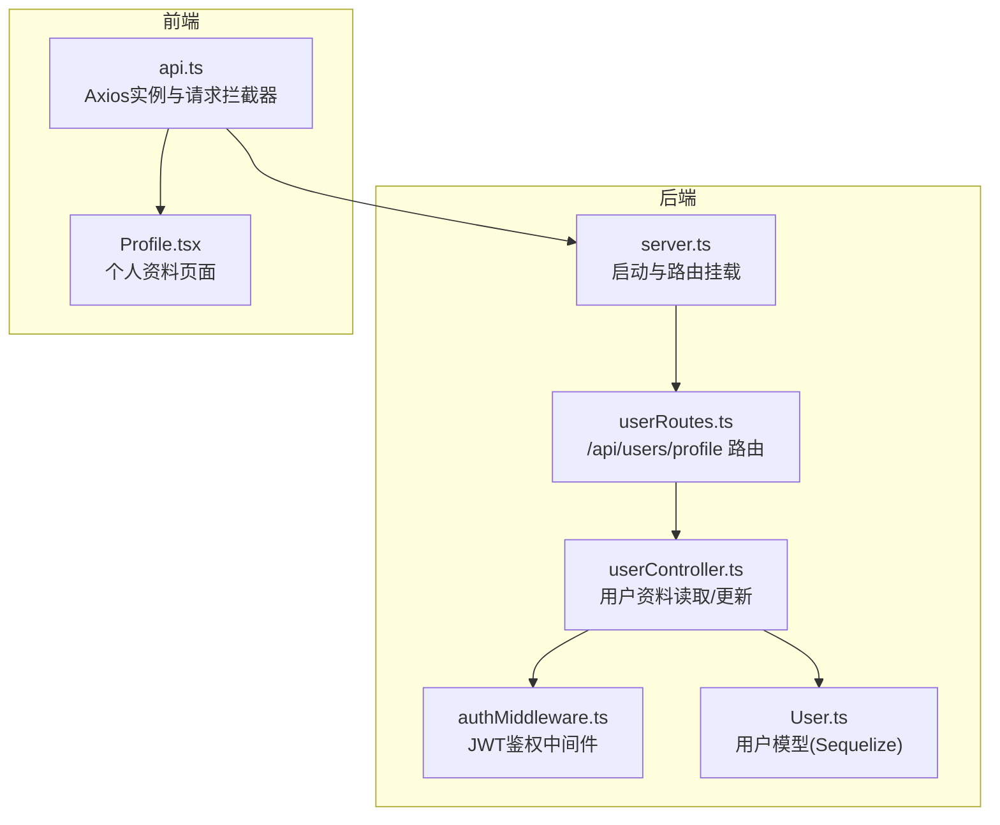
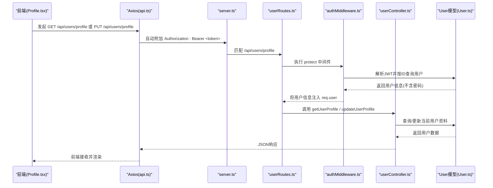
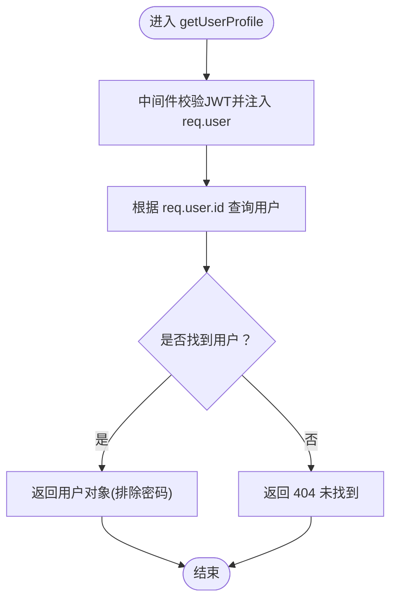
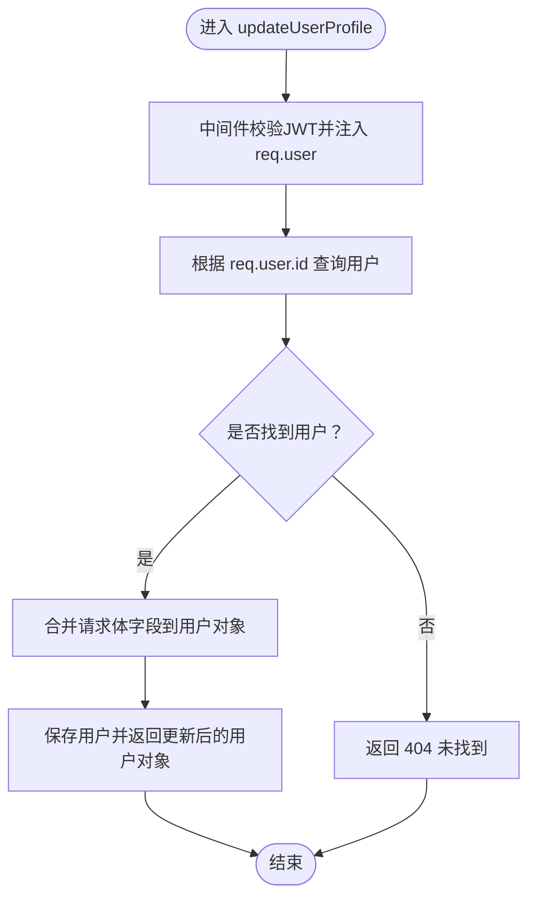
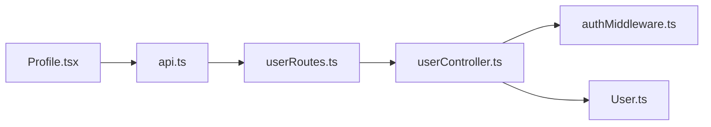

# 用户API

<cite>
**本文引用的文件**
- [backend/src/server.ts](file://backend/src/server.ts)
- [backend/src/routes/userRoutes.ts](file://backend/src/routes/userRoutes.ts)
- [backend/src/controllers/userController.ts](file://backend/src/controllers/userController.ts)
- [backend/src/middleware/authMiddleware.ts](file://backend/src/middleware/authMiddleware.ts)
- [backend/src/models/User.ts](file://backend/src/models/User.ts)
- [docs/4. API接口文档.md](file://docs/4. API接口文档.md)
- [frontend/src/services/api.ts](file://frontend/src/services/api.ts)
- [frontend/src/pages/Profile.tsx](file://frontend/src/pages/Profile.tsx)
</cite>

## 目录
1. [简介](#简介)
2. [项目结构](#项目结构)
3. [核心组件](#核心组件)
4. [架构总览](#架构总览)
5. [详细组件分析](#详细组件分析)
6. [依赖关系分析](#依赖关系分析)
7. [性能与安全考量](#性能与安全考量)
8. [故障排查指南](#故障排查指南)
9. [结论](#结论)
10. [附录](#附录)

## 简介
本文件聚焦于用户管理API中的两个端点：GET /api/users/profile 和 PUT /api/users/profile。这两个接口用于获取与更新“当前登录用户”的个人资料，均受JWT身份验证保护，通过后端中间件完成鉴权。接口遵循严格的“数据隔离”原则：仅允许访问当前登录用户自身的资料，不支持对其他用户资料的直接访问。

## 项目结构
后端采用Express + Sequelize架构，路由层定义REST端点，控制器层处理业务逻辑，中间件负责鉴权，模型层封装数据库交互；前端使用Axios拦截器统一注入JWT令牌，简化调用。

图表来源
- [backend/src/server.ts](file://backend/src/server.ts#L1-L36)
- [backend/src/routes/userRoutes.ts](file://backend/src/routes/userRoutes.ts#L1-L11)
- [backend/src/controllers/userController.ts](file://backend/src/controllers/userController.ts#L1-L60)
- [backend/src/middleware/authMiddleware.ts](file://backend/src/middleware/authMiddleware.ts#L1-L36)
- [backend/src/models/User.ts](file://backend/src/models/User.ts#L1-L119)
- [frontend/src/services/api.ts](file://frontend/src/services/api.ts#L1-L61)
- [frontend/src/pages/Profile.tsx](file://frontend/src/pages/Profile.tsx#L1-L245)

章节来源
- [backend/src/server.ts](file://backend/src/server.ts#L1-L36)
- [backend/src/routes/userRoutes.ts](file://backend/src/routes/userRoutes.ts#L1-L11)
- [frontend/src/services/api.ts](file://frontend/src/services/api.ts#L1-L61)

## 核心组件
- 路由层：在用户路由中为/profile端点绑定鉴权中间件与控制器方法。
- 控制器层：getUserProfile返回当前用户资料；updateUserProfile更新当前用户资料。
- 中间件：authMiddleware.protect从请求头解析并校验JWT，将用户信息注入到请求对象，供后续控制器使用。
- 模型层：User模型定义用户字段及验证规则，控制器通过Sequelize ORM进行查询与更新。
- 前端：Axios拦截器自动在请求头添加Authorization: Bearer <token>，Profile页面发起获取与更新请求。

章节来源
- [backend/src/routes/userRoutes.ts](file://backend/src/routes/userRoutes.ts#L1-L11)
- [backend/src/controllers/userController.ts](file://backend/src/controllers/userController.ts#L1-L60)
- [backend/src/middleware/authMiddleware.ts](file://backend/src/middleware/authMiddleware.ts#L1-L36)
- [backend/src/models/User.ts](file://backend/src/models/User.ts#L1-L119)
- [frontend/src/services/api.ts](file://frontend/src/services/api.ts#L1-L61)
- [frontend/src/pages/Profile.tsx](file://frontend/src/pages/Profile.tsx#L1-L245)

## 架构总览
下图展示了从客户端到服务端的完整调用链，以及JWT鉴权与数据隔离的关键节点。

图表来源
- [backend/src/server.ts](file://backend/src/server.ts#L1-L36)
- [backend/src/routes/userRoutes.ts](file://backend/src/routes/userRoutes.ts#L1-L11)
- [backend/src/middleware/authMiddleware.ts](file://backend/src/middleware/authMiddleware.ts#L1-L36)
- [backend/src/controllers/userController.ts](file://backend/src/controllers/userController.ts#L1-L60)
- [backend/src/models/User.ts](file://backend/src/models/User.ts#L1-L119)
- [frontend/src/services/api.ts](file://frontend/src/services/api.ts#L1-L61)
- [frontend/src/pages/Profile.tsx](file://frontend/src/pages/Profile.tsx#L1-L245)

## 详细组件分析

### 接口定义与用途
- GET /api/users/profile
  - 用途：获取当前登录用户的个人资料。
  - 鉴权：必须携带JWT令牌，通过中间件校验。
  - 数据隔离：仅返回当前用户资料，不支持其他用户资料的直接访问。
- PUT /api/users/profile
  - 用途：更新当前登录用户的个人资料。
  - 鉴权：必须携带JWT令牌，通过中间件校验。
  - 数据隔离：仅更新当前用户资料，不支持其他用户资料的直接访问。

章节来源
- [docs/4. API接口文档.md](file://docs/4. API接口文档.md#L48-L98)
- [backend/src/routes/userRoutes.ts](file://backend/src/routes/userRoutes.ts#L1-L11)
- [backend/src/controllers/userController.ts](file://backend/src/controllers/userController.ts#L1-L60)
- [backend/src/middleware/authMiddleware.ts](file://backend/src/middleware/authMiddleware.ts#L1-L36)

### 请求与响应数据结构
- 请求头
  - Authorization: Bearer <token>
- GET /api/users/profile
  - 成功响应：返回当前用户对象（包含用户ID、姓名、邮箱、年龄、身高、体重、性别等字段）。
  - 错误响应：
    - 401 未授权：无令牌或令牌无效。
    - 404 未找到：用户不存在。
    - 500 服务器错误：内部异常。
- PUT /api/users/profile
  - 请求体（可选字段）：name、email、age、height、weight、gender。
  - 成功响应：返回已更新后的用户对象（包含上述字段）。
  - 错误响应：
    - 401 未授权：无令牌或令牌无效。
    - 404 未找到：用户不存在。
    - 500 服务器错误：内部异常。

章节来源
- [docs/4. API接口文档.md](file://docs/4. API接口文档.md#L48-L98)
- [backend/src/controllers/userController.ts](file://backend/src/controllers/userController.ts#L1-L60)
- [backend/src/middleware/authMiddleware.ts](file://backend/src/middleware/authMiddleware.ts#L1-L36)

### 请求处理流程详解

#### GET /api/users/profile 处理流程

图表来源
- [backend/src/controllers/userController.ts](file://backend/src/controllers/userController.ts#L1-L60)
- [backend/src/middleware/authMiddleware.ts](file://backend/src/middleware/authMiddleware.ts#L1-L36)
- [backend/src/models/User.ts](file://backend/src/models/User.ts#L1-L119)

#### PUT /api/users/profile 处理流程

图表来源
- [backend/src/controllers/userController.ts](file://backend/src/controllers/userController.ts#L1-L60)
- [backend/src/middleware/authMiddleware.ts](file://backend/src/middleware/authMiddleware.ts#L1-L36)
- [backend/src/models/User.ts](file://backend/src/models/User.ts#L1-L119)

### 前端调用示例
- Axios拦截器自动附加JWT令牌
  - 在请求前从本地存储读取token，并设置到Authorization头。
- 前端页面Profile.tsx
  - 加载时调用 getProfile 获取当前用户资料。
  - 提交表单时调用 updateProfile 更新当前用户资料。

章节来源
- [frontend/src/services/api.ts](file://frontend/src/services/api.ts#L1-L61)
- [frontend/src/pages/Profile.tsx](file://frontend/src/pages/Profile.tsx#L1-L245)

### 数据模型与字段说明
- 用户模型字段（部分）
  - id: 用户唯一标识
  - name: 用户名
  - email: 邮箱（唯一，且符合邮箱格式）
  - age: 年龄（1~120）
  - height: 身高（cm，50~300）
  - weight: 体重（kg，20~1000）
  - gender: 性别（枚举值：male/female/other）
  - createdAt/updatedAt: 创建与更新时间
- 安全注意
  - 密码字段在查询用户资料时被排除，避免泄露。

章节来源
- [backend/src/models/User.ts](file://backend/src/models/User.ts#L1-L119)

### 错误处理与状态码
- 401 未授权
  - 无Authorization头或令牌无效时返回。
- 404 未找到
  - 用户不存在时返回。
- 500 服务器错误
  - 内部异常时返回。

章节来源
- [backend/src/middleware/authMiddleware.ts](file://backend/src/middleware/authMiddleware.ts#L1-L36)
- [backend/src/controllers/userController.ts](file://backend/src/controllers/userController.ts#L1-L60)

## 依赖关系分析
- 路由依赖控制器与中间件
- 控制器依赖模型进行数据库操作
- 中间件依赖JWT与模型进行鉴权
- 前端依赖Axios拦截器与后端路由

图表来源
- [backend/src/routes/userRoutes.ts](file://backend/src/routes/userRoutes.ts#L1-L11)
- [backend/src/controllers/userController.ts](file://backend/src/controllers/userController.ts#L1-L60)
- [backend/src/middleware/authMiddleware.ts](file://backend/src/middleware/authMiddleware.ts#L1-L36)
- [backend/src/models/User.ts](file://backend/src/models/User.ts#L1-L119)
- [frontend/src/services/api.ts](file://frontend/src/services/api.ts#L1-L61)
- [frontend/src/pages/Profile.tsx](file://frontend/src/pages/Profile.tsx#L1-L245)

## 性能与安全考量
- 性能
  - 控制器查询用户时排除敏感字段，减少传输体积。
  - 中间件仅做一次JWT解析与用户查询，复杂度低。
- 安全
  - 所有用户资料接口均需JWT鉴权，防止未授权访问。
  - 数据隔离：控制器始终基于req.user.id进行查询与更新，避免越权。
  - 密码字段在查询时被排除，降低泄露风险。
- 可扩展性
  - 若需新增字段，可在模型中增加字段与验证规则，并在控制器中同步处理。

[本节为通用建议，无需列出具体文件来源]

## 故障排查指南
- 401 未授权
  - 检查前端是否正确存储并发送token（Authorization: Bearer <token>）。
  - 检查JWT是否过期或签名是否有效。
- 404 未找到
  - 确认用户ID是否存在，或用户是否已被删除。
- 500 服务器错误
  - 查看后端日志，定位异常堆栈。
- 前端问题
  - 确认Axios拦截器已启用并正确读取localStorage中的token。
  - 确认Profile页面已正确调用getProfile与updateProfile。

章节来源
- [frontend/src/services/api.ts](file://frontend/src/services/api.ts#L1-L61)
- [frontend/src/pages/Profile.tsx](file://frontend/src/pages/Profile.tsx#L1-L245)
- [backend/src/middleware/authMiddleware.ts](file://backend/src/middleware/authMiddleware.ts#L1-L36)
- [backend/src/controllers/userController.ts](file://backend/src/controllers/userController.ts#L1-L60)

## 结论
GET /api/users/profile 与 PUT /api/users/profile 两个端点共同构成了用户个人资料管理的核心能力。它们通过JWT中间件实现了严格的身份验证与数据隔离，确保每个用户只能访问与更新自己的资料。前端通过Axios拦截器自动附加令牌，简化了调用流程。整体架构清晰、职责明确，具备良好的安全性与可维护性。

[本节为总结性内容，无需列出具体文件来源]

## 附录

### API端点一览（与本文件相关）
- GET /api/users/profile
  - 请求头：Authorization: Bearer <token>
  - 响应：当前用户资料对象
- PUT /api/users/profile
  - 请求头：Authorization: Bearer <token>
  - 请求体：name、email、age、height、weight、gender（可选）
  - 响应：更新后的用户资料对象

章节来源
- [docs/4. API接口文档.md](file://docs/4. API接口文档.md#L48-L98)
- [backend/src/routes/userRoutes.ts](file://backend/src/routes/userRoutes.ts#L1-L11)
- [frontend/src/services/api.ts](file://frontend/src/services/api.ts#L1-L61)