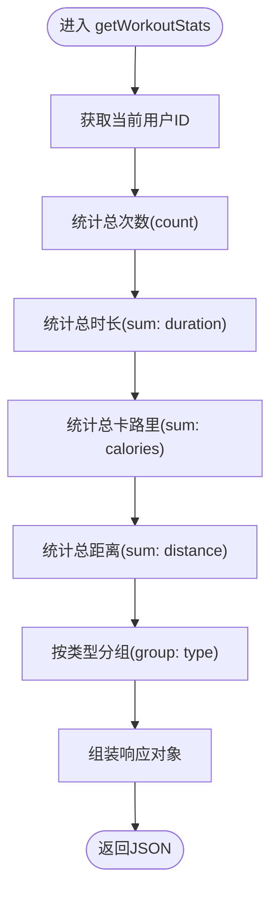

# 统计API

<cite>
**本文引用的文件**
- [backend/src/controllers/statsController.ts](file://backend/src/controllers/statsController.ts)
- [backend/src/routes/statsRoutes.ts](file://backend/src/routes/statsRoutes.ts)
- [backend/src/middleware/authMiddleware.ts](file://backend/src/middleware/authMiddleware.ts)
- [backend/src/models/Workout.ts](file://backend/src/models/Workout.ts)
- [backend/src/server.ts](file://backend/src/server.ts)
- [backend/src/config/db.ts](file://backend/src/config/db.ts)
- [backend/.env](file://backend/.env)
- [docs/4. API接口文档.md](file://docs/4. API接口文档.md)
- [frontend/src/services/api.ts](file://frontend/src/services/api.ts)
- [frontend/src/pages/Dashboard.tsx](file://frontend/src/pages/Dashboard.tsx)
</cite>

## 目录
1. [简介](#简介)
2. [项目结构](#项目结构)
3. [核心组件](#核心组件)
4. [架构总览](#架构总览)
5. [详细组件分析](#详细组件分析)
6. [依赖关系分析](#依赖关系分析)
7. [性能考量](#性能考量)
8. [故障排查指南](#故障排查指南)
9. [结论](#结论)
10. [附录](#附录)

## 简介
本文件面向“统计分析API”的详细使用与实现说明，覆盖以下两个端点：
- GET /api/stats/workouts：提供用户总体运动数据（总次数、总时长、总卡路里、总距离、按运动类型分组的统计）
- GET /api/stats/weekly：提供最近七天的周度活动趋势（按日汇总的运动次数、时长、卡路里）

上述接口均为只读，且需要通过 JWT 进行认证，确保数据私有性。后端通过 statsController 中的 getWorkoutStats 和 getWeeklyStats 函数从 Workout 模型进行聚合统计，可能涉及 COUNT、SUM、GROUP BY 等聚合操作；前端通过 Dashboard 页面并行拉取两个接口的数据，并将其映射到图表组件进行可视化展示。

## 项目结构
统计API位于后端服务中，采用 Express + Sequelize 的典型分层架构：
- 路由层：定义 /api/stats 下的子路由
- 控制器层：实现统计逻辑
- 模型层：Workout 模型提供数据访问与关联
- 中间件层：JWT 认证中间件保护接口
- 前端：通过 api.ts 封装的 statsAPI 调用后端接口，并在 Dashboard.tsx 中消费数据

**图示来源**
- [backend/src/server.ts](file://backend/src/server.ts#L1-L36)
- [backend/src/routes/statsRoutes.ts](file://backend/src/routes/statsRoutes.ts#L1-L10)
- [backend/src/middleware/authMiddleware.ts](file://backend/src/middleware/authMiddleware.ts#L1-L36)
- [backend/src/controllers/statsController.ts](file://backend/src/controllers/statsController.ts#L1-L119)
- [backend/src/models/Workout.ts](file://backend/src/models/Workout.ts#L1-L122)
- [backend/src/config/db.ts](file://backend/src/config/db.ts#L1-L41)
- [backend/.env](file://backend/.env#L1-L10)
- [frontend/src/services/api.ts](file://frontend/src/services/api.ts#L1-L61)
- [frontend/src/pages/Dashboard.tsx](file://frontend/src/pages/Dashboard.tsx#L1-L174)

**章节来源**
- [backend/src/server.ts](file://backend/src/server.ts#L1-L36)
- [backend/src/routes/statsRoutes.ts](file://backend/src/routes/statsRoutes.ts#L1-L10)
- [backend/src/middleware/authMiddleware.ts](file://backend/src/middleware/authMiddleware.ts#L1-L36)
- [backend/src/controllers/statsController.ts](file://backend/src/controllers/statsController.ts#L1-L119)
- [backend/src/models/Workout.ts](file://backend/src/models/Workout.ts#L1-L122)
- [backend/src/config/db.ts](file://backend/src/config/db.ts#L1-L41)
- [backend/.env](file://backend/.env#L1-L10)
- [frontend/src/services/api.ts](file://frontend/src/services/api.ts#L1-L61)
- [frontend/src/pages/Dashboard.tsx](file://frontend/src/pages/Dashboard.tsx#L1-L174)

## 核心组件
- 统计控制器（statsController.ts）
  - getWorkoutStats：聚合用户总体运动数据（总次数、总时长、总卡路里、总距离、按类型分组）
  - getWeeklyStats：聚合最近七天的每日统计（时长、卡路里、次数），并填充缺失日期
- 统计路由（statsRoutes.ts）：绑定 GET /api/stats/workouts 与 GET /api/stats/weekly，并应用认证中间件
- 认证中间件（authMiddleware.ts）：从 Authorization 头解析 Bearer Token，校验并注入用户信息
- 模型（Workout.ts）：提供 count、sum、findAll、group 等聚合查询能力
- 前端封装（api.ts）：统一设置 baseURL 与 Authorization 头，导出 statsAPI
- 前端页面（Dashboard.tsx）：并行请求两个统计接口，渲染概览卡片与图表

**章节来源**
- [backend/src/controllers/statsController.ts](file://backend/src/controllers/statsController.ts#L1-L119)
- [backend/src/routes/statsRoutes.ts](file://backend/src/routes/statsRoutes.ts#L1-L10)
- [backend/src/middleware/authMiddleware.ts](file://backend/src/middleware/authMiddleware.ts#L1-L36)
- [backend/src/models/Workout.ts](file://backend/src/models/Workout.ts#L1-L122)
- [frontend/src/services/api.ts](file://frontend/src/services/api.ts#L1-L61)
- [frontend/src/pages/Dashboard.tsx](file://frontend/src/pages/Dashboard.tsx#L1-L174)

## 架构总览
下图展示了从浏览器到后端统计接口的完整调用链，包括认证、路由、控制器与模型层的协作。

**图示来源**
- [backend/src/server.ts](file://backend/src/server.ts#L1-L36)
- [backend/src/routes/statsRoutes.ts](file://backend/src/routes/statsRoutes.ts#L1-L10)
- [backend/src/middleware/authMiddleware.ts](file://backend/src/middleware/authMiddleware.ts#L1-L36)
- [backend/src/controllers/statsController.ts](file://backend/src/controllers/statsController.ts#L1-L119)
- [backend/src/models/Workout.ts](file://backend/src/models/Workout.ts#L1-L122)
- [frontend/src/pages/Dashboard.tsx](file://frontend/src/pages/Dashboard.tsx#L1-L174)
- [frontend/src/services/api.ts](file://frontend/src/services/api.ts#L1-L61)

## 详细组件分析

### 接口一：GET /api/stats/workouts
- 用途：返回当前登录用户的总体运动统计，包含总次数、总时长、总卡路里、总距离以及按运动类型的分组统计。
- 认证：需要 Authorization: Bearer <token>
- 请求方式：GET
- 响应字段（示例结构）：
  - totalWorkouts: number
  - totalDuration: number
  - totalCalories: number
  - totalDistance: number
  - workoutsByType: [{ type: string, count: number }, ...]
- 后端实现要点：
  - 使用模型的 count、sum、findAll + group 实现聚合
  - 通过 req.user.id 过滤当前用户的数据
- 前端使用：
  - 在 Dashboard.tsx 中并行请求该接口，并将 totalWorkouts、totalDuration、totalCalories、totalDistance 渲染为概览卡片
  - 将 workoutsByType 映射为饼状或条形图的类型分布

**图示来源**
- [backend/src/controllers/statsController.ts](file://backend/src/controllers/statsController.ts#L1-L56)
- [backend/src/models/Workout.ts](file://backend/src/models/Workout.ts#L1-L122)

**章节来源**
- [backend/src/controllers/statsController.ts](file://backend/src/controllers/statsController.ts#L1-L56)
- [backend/src/routes/statsRoutes.ts](file://backend/src/routes/statsRoutes.ts#L1-L10)
- [backend/src/middleware/authMiddleware.ts](file://backend/src/middleware/authMiddleware.ts#L1-L36)
- [frontend/src/pages/Dashboard.tsx](file://frontend/src/pages/Dashboard.tsx#L1-L174)

### 接口二：GET /api/stats/weekly
- 用途：返回最近七天的每日统计，包含日期、当日运动次数、当日总时长、当日总卡路里；用于绘制周度活动趋势图。
- 认证：需要 Authorization: Bearer <token>
- 请求方式：GET
- 响应字段（示例结构）：
  - 数组元素：{ date: string, workouts: number, duration: number, calories: number }
- 后端实现要点：
  - 计算一周前的日期并过滤该时间段内的记录
  - 按日期字符串聚合（按日汇总）
  - 填充缺失日期（七天内未出现的日期以0补齐）
  - 按日期升序排序输出
- 前端使用：
  - 在 Dashboard.tsx 中将 weeklyStats 映射为柱状图或折线图，展示每日运动次数与时长趋势

**图示来源**
- [backend/src/controllers/statsController.ts](file://backend/src/controllers/statsController.ts#L58-L119)
- [backend/src/models/Workout.ts](file://backend/src/models/Workout.ts#L1-L122)

**章节来源**
- [backend/src/controllers/statsController.ts](file://backend/src/controllers/statsController.ts#L58-L119)
- [backend/src/routes/statsRoutes.ts](file://backend/src/routes/statsRoutes.ts#L1-L10)
- [backend/src/middleware/authMiddleware.ts](file://backend/src/middleware/authMiddleware.ts#L1-L36)
- [frontend/src/pages/Dashboard.tsx](file://frontend/src/pages/Dashboard.tsx#L1-L174)

### 认证流程（JWT）
- 客户端在请求头添加 Authorization: Bearer <token>
- 中间件从头部提取 token 并验证
- 验证成功后将用户信息注入到 req.user，供控制器使用
- 若无 token 或验证失败，返回 401

**图示来源**
- [backend/src/middleware/authMiddleware.ts](file://backend/src/middleware/authMiddleware.ts#L1-L36)
- [backend/src/models/Workout.ts](file://backend/src/models/Workout.ts#L1-L122)

**章节来源**
- [backend/src/middleware/authMiddleware.ts](file://backend/src/middleware/authMiddleware.ts#L1-L36)

### 数据模型与聚合
- Workout 模型包含字段：userId、name、type、duration、calories、distance、steps、date 等
- 统计接口使用 Sequelize 的 count、sum、findAll + group 等能力完成聚合
- 通过外键 userId 保证数据隔离，确保每个用户只能看到自己的统计

**图示来源**
- [backend/src/models/Workout.ts](file://backend/src/models/Workout.ts#L1-L122)

**章节来源**
- [backend/src/models/Workout.ts](file://backend/src/models/Workout.ts#L1-L122)

### 前端调用与数据映射
- 前端通过 api.ts 的 statsAPI 并行请求两个统计接口
- Dashboard.tsx 将返回数据映射到概览卡片与图表组件：
  - 总次数、总时长、总卡路里、总距离渲染为卡片
  - weeklyStats 渲染为柱状图或折线图
  - workoutsByType 渲染为类型分布图

**图示来源**
- [frontend/src/services/api.ts](file://frontend/src/services/api.ts#L1-L61)
- [frontend/src/pages/Dashboard.tsx](file://frontend/src/pages/Dashboard.tsx#L1-L174)
- [backend/src/controllers/statsController.ts](file://backend/src/controllers/statsController.ts#L1-L119)

**章节来源**
- [frontend/src/services/api.ts](file://frontend/src/services/api.ts#L1-L61)
- [frontend/src/pages/Dashboard.tsx](file://frontend/src/pages/Dashboard.tsx#L1-L174)

## 依赖关系分析
- 路由依赖中间件：statsRoutes.ts 依赖 authMiddleware.ts 对 /api/stats/* 路由进行保护
- 控制器依赖模型：statsController.ts 依赖 Workout 模型进行聚合查询
- 服务器依赖配置：server.ts 挂载路由并连接数据库；db.ts 负责连接与同步；.env 提供数据库与JWT密钥
- 前端依赖后端：api.ts 统一封装请求；Dashboard.tsx 消费数据

**图示来源**
- [backend/src/server.ts](file://backend/src/server.ts#L1-L36)
- [backend/src/routes/statsRoutes.ts](file://backend/src/routes/statsRoutes.ts#L1-L10)
- [backend/src/middleware/authMiddleware.ts](file://backend/src/middleware/authMiddleware.ts#L1-L36)
- [backend/src/controllers/statsController.ts](file://backend/src/controllers/statsController.ts#L1-L119)
- [backend/src/models/Workout.ts](file://backend/src/models/Workout.ts#L1-L122)
- [backend/src/config/db.ts](file://backend/src/config/db.ts#L1-L41)
- [backend/.env](file://backend/.env#L1-L10)
- [frontend/src/services/api.ts](file://frontend/src/services/api.ts#L1-L61)
- [frontend/src/pages/Dashboard.tsx](file://frontend/src/pages/Dashboard.tsx#L1-L174)

**章节来源**
- [backend/src/server.ts](file://backend/src/server.ts#L1-L36)
- [backend/src/routes/statsRoutes.ts](file://backend/src/routes/statsRoutes.ts#L1-L10)
- [backend/src/middleware/authMiddleware.ts](file://backend/src/middleware/authMiddleware.ts#L1-L36)
- [backend/src/controllers/statsController.ts](file://backend/src/controllers/statsController.ts#L1-L119)
- [backend/src/models/Workout.ts](file://backend/src/models/Workout.ts#L1-L122)
- [backend/src/config/db.ts](file://backend/src/config/db.ts#L1-L41)
- [backend/.env](file://backend/.env#L1-L10)
- [frontend/src/services/api.ts](file://frontend/src/services/api.ts#L1-L61)
- [frontend/src/pages/Dashboard.tsx](file://frontend/src/pages/Dashboard.tsx#L1-L174)

## 性能考量
- 聚合查询优化
  - 使用 count、sum、group 等原生聚合可减少数据传输量，避免在应用层做二次聚合
  - 对 userId 与 date 字段建立索引可提升查询性能（建议在数据库层面维护）
- 分页与范围控制
  - weekly 接口已限制最近七天，避免全表扫描
- 并发请求
  - 前端并行请求两个接口，降低首屏等待时间
- 缓存策略
  - 可考虑对高频访问的统计结果增加短期缓存（如Redis），降低数据库压力

[本节为通用性能建议，不直接分析具体文件]

## 故障排查指南
- 401 未授权
  - 检查请求头是否包含 Authorization: Bearer <token>
  - 确认 token 未过期且与用户匹配
  - 查看 authMiddleware 的错误分支
- 500 服务器错误
  - 检查数据库连接与同步是否正常
  - 查看控制器中的异常处理分支
- 数据为空
  - 确认当前用户是否存在运动记录
  - weekly 接口会填充缺失日期，若仍为空，检查日期字段与时区设置
- 前端无法显示图表
  - 确认 statsAPI 已正确设置 Authorization 头
  - 检查 Dashboard.tsx 的数据解构与默认值

**章节来源**
- [backend/src/middleware/authMiddleware.ts](file://backend/src/middleware/authMiddleware.ts#L1-L36)
- [backend/src/controllers/statsController.ts](file://backend/src/controllers/statsController.ts#L1-L119)
- [backend/src/config/db.ts](file://backend/src/config/db.ts#L1-L41)
- [frontend/src/services/api.ts](file://frontend/src/services/api.ts#L1-L61)
- [frontend/src/pages/Dashboard.tsx](file://frontend/src/pages/Dashboard.tsx#L1-L174)

## 结论
统计API通过清晰的分层设计与JWT认证保障了数据安全与易用性。后端利用Sequelize的聚合能力高效产出总体统计与周度趋势，前端以并行请求与直观的图表组件呈现关键指标，形成完整的数据可视化闭环。后续可在数据库索引、缓存与接口限流等方面进一步优化性能与稳定性。

[本节为总结性内容，不直接分析具体文件]

## 附录

### 接口定义与示例
- GET /api/stats/workouts
  - 请求头：Authorization: Bearer <token>
  - 响应示例字段：totalWorkouts、totalDuration、totalCalories、totalDistance、workoutsByType
  - 参考文档位置：[docs/4. API接口文档.md](file://docs/4. API接口文档.md#L232-L248)
- GET /api/stats/weekly
  - 请求头：Authorization: Bearer <token>
  - 响应示例字段：数组元素包含 date、workouts、duration、calories
  - 参考文档位置：[docs/4. API接口文档.md](file://docs/4. API接口文档.md#L250-L275)

**章节来源**
- [docs/4. API接口文档.md](file://docs/4. API接口文档.md#L232-L275)