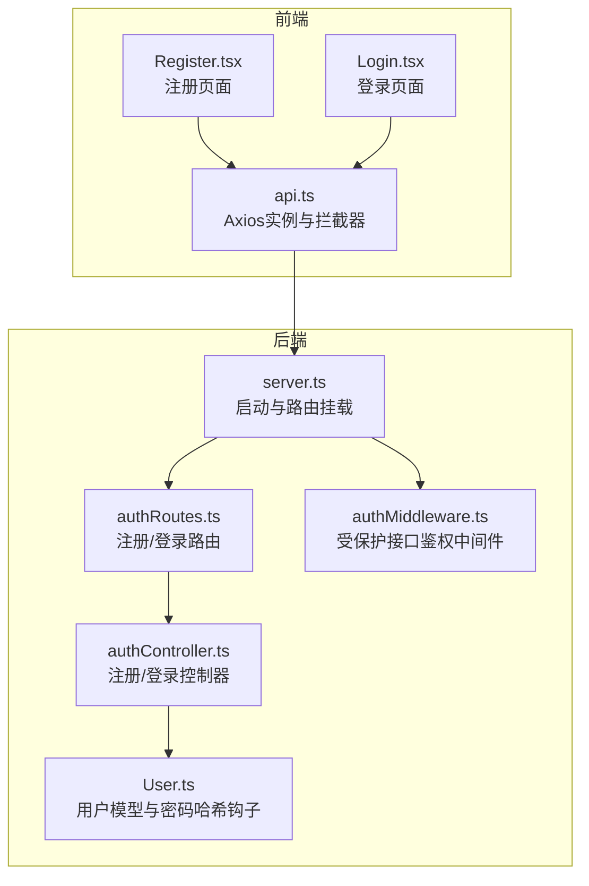
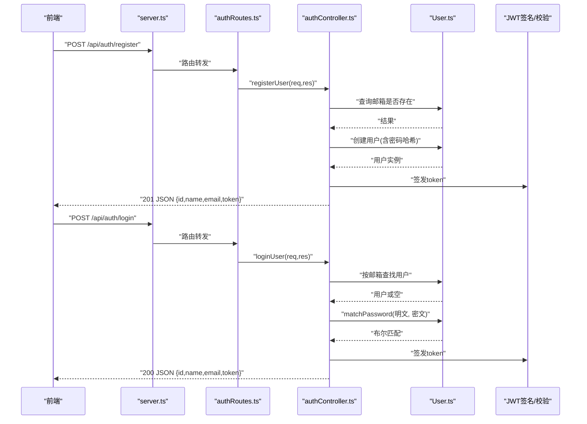
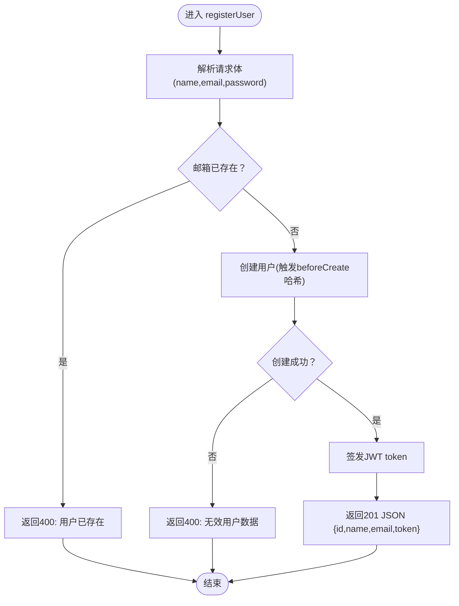
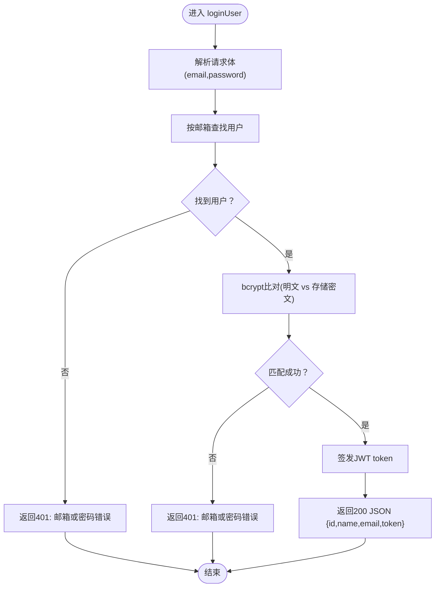
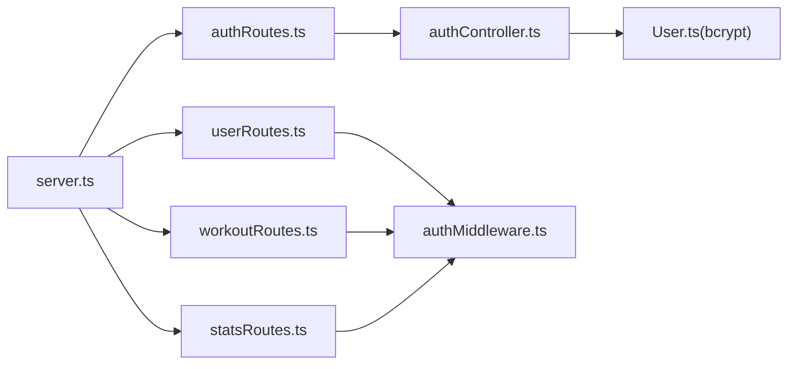

# 认证API

<cite>
**本文引用的文件**
- [backend/src/server.ts](file://backend/src/server.ts)
- [backend/src/routes/authRoutes.ts](file://backend/src/routes/authRoutes.ts)
- [backend/src/controllers/authController.ts](file://backend/src/controllers/authController.ts)
- [backend/src/models/User.ts](file://backend/src/models/User.ts)
- [backend/src/middleware/authMiddleware.ts](file://backend/src/middleware/authMiddleware.ts)
- [docs/4. API接口文档.md](file://docs/4. API接口文档.md)
- [frontend/src/services/api.ts](file://frontend/src/services/api.ts)
- [frontend/src/pages/Register.tsx](file://frontend/src/pages/Register.tsx)
- [frontend/src/pages/Login.tsx](file://frontend/src/pages/Login.tsx)
- [tests/test-api.js](file://tests/test-api.js)
</cite>

## 目录
1. [简介](#简介)
2. [项目结构](#项目结构)
3. [核心组件](#核心组件)
4. [架构总览](#架构总览)
5. [详细组件分析](#详细组件分析)
6. [依赖关系分析](#依赖关系分析)
7. [性能与安全考虑](#性能与安全考虑)
8. [故障排查指南](#故障排查指南)
9. [结论](#结论)
10. [附录：前端调用示例](#附录前端调用示例)

## 简介
本文件面向健身追踪平台的认证API，聚焦于用户注册与登录两大公开端点：
- POST /api/auth/register：注册新用户
- POST /api/auth/login：用户登录并获取JWT令牌

文档将从HTTP方法、请求体结构、响应格式、状态码、错误处理、密码哈希与JWT生成逻辑、输入验证流程、异常处理机制等方面进行系统化说明；并结合后端控制器与模型实现，解释bcrypt密码哈希、JWT签发与校验、以及与受保护接口的差异。最后提供前端Axios调用示例及Authorization头的携带方式。

## 项目结构
认证API位于后端服务的路由与控制器层，通过Express中间件挂载至统一前缀下，数据库模型负责数据持久化与密码哈希钩子。

图表来源
- [backend/src/server.ts](file://backend/src/server.ts#L1-L36)
- [backend/src/routes/authRoutes.ts](file://backend/src/routes/authRoutes.ts#L1-L9)
- [backend/src/controllers/authController.ts](file://backend/src/controllers/authController.ts#L1-L71)
- [backend/src/models/User.ts](file://backend/src/models/User.ts#L1-L119)
- [backend/src/middleware/authMiddleware.ts](file://backend/src/middleware/authMiddleware.ts#L1-L36)
- [frontend/src/services/api.ts](file://frontend/src/services/api.ts#L1-L61)
- [frontend/src/pages/Register.tsx](file://frontend/src/pages/Register.tsx#L1-L49)
- [frontend/src/pages/Login.tsx](file://frontend/src/pages/Login.tsx#L1-L44)

章节来源
- [backend/src/server.ts](file://backend/src/server.ts#L1-L36)
- [backend/src/routes/authRoutes.ts](file://backend/src/routes/authRoutes.ts#L1-L9)
- [docs/4. API接口文档.md](file://docs/4. API接口文档.md#L1-L60)

## 核心组件
- 路由层：在后端入口处将 /api/auth 前缀下的注册与登录请求映射到对应控制器函数。
- 控制器层：实现注册与登录业务逻辑，包括用户存在性检查、密码匹配、JWT签发与错误处理。
- 模型层：定义用户实体与Sequelize钩子，在创建/更新前对密码进行bcrypt哈希。
- 中间件层：为受保护接口提供JWT校验与用户信息注入。

章节来源
- [backend/src/routes/authRoutes.ts](file://backend/src/routes/authRoutes.ts#L1-L9)
- [backend/src/controllers/authController.ts](file://backend/src/controllers/authController.ts#L1-L71)
- [backend/src/models/User.ts](file://backend/src/models/User.ts#L1-L119)
- [backend/src/middleware/authMiddleware.ts](file://backend/src/middleware/authMiddleware.ts#L1-L36)

## 架构总览
认证API采用“路由 -> 控制器 -> 模型”的分层架构，注册与登录均为公开端点，无需Authorization头即可访问；后续受保护接口通过鉴权中间件要求Bearer Token。

图表来源
- [backend/src/server.ts](file://backend/src/server.ts#L1-L36)
- [backend/src/routes/authRoutes.ts](file://backend/src/routes/authRoutes.ts#L1-L9)
- [backend/src/controllers/authController.ts](file://backend/src/controllers/authController.ts#L1-L71)
- [backend/src/models/User.ts](file://backend/src/models/User.ts#L1-L119)

## 详细组件分析

### 接口定义与行为
- 注册接口
  - 方法与路径：POST /api/auth/register
  - 访问权限：Public（无需Authorization）
  - 请求体字段：name、email、password
  - 成功响应：201 Created，返回用户基础信息与JWT token
  - 可能的状态码：201、400、500
- 登录接口
  - 方法与路径：POST /api/auth/login
  - 访问权限：Public（无需Authorization）
  - 请求体字段：email、password
  - 成功响应：200 OK，返回用户基础信息与JWT token
  - 可能的状态码：200、401、500

章节来源
- [docs/4. API接口文档.md](file://docs/4. API接口文档.md#L1-L60)
- [backend/src/routes/authRoutes.ts](file://backend/src/routes/authRoutes.ts#L1-L9)
- [backend/src/controllers/authController.ts](file://backend/src/controllers/authController.ts#L1-L71)

### 注册流程（POST /api/auth/register）
- 输入验证与存在性检查
  - 从请求体解析 name、email、password
  - 查询数据库是否存在相同邮箱用户；若存在则返回400
- 用户创建与密码哈希
  - 使用模型的beforeCreate钩子对密码进行bcrypt哈希
  - 创建成功后返回201，包含id、name、email与token
- 异常处理
  - 捕获内部错误返回500

图表来源
- [backend/src/controllers/authController.ts](file://backend/src/controllers/authController.ts#L1-L46)
- [backend/src/models/User.ts](file://backend/src/models/User.ts#L100-L119)

章节来源
- [backend/src/controllers/authController.ts](file://backend/src/controllers/authController.ts#L1-L46)
- [backend/src/models/User.ts](file://backend/src/models/User.ts#L100-L119)

### 登录流程（POST /api/auth/login）
- 用户查找与密码校验
  - 按邮箱查找用户；若存在则调用实例方法matchPassword进行bcrypt比对
  - 匹配成功则签发token并返回200
  - 失败返回401
- 异常处理
  - 捕获内部错误返回500

图表来源
- [backend/src/controllers/authController.ts](file://backend/src/controllers/authController.ts#L48-L71)
- [backend/src/models/User.ts](file://backend/src/models/User.ts#L35-L38)

章节来源
- [backend/src/controllers/authController.ts](file://backend/src/controllers/authController.ts#L48-L71)
- [backend/src/models/User.ts](file://backend/src/models/User.ts#L35-L38)

### JWT令牌生成与存储
- 令牌签发
  - 使用jsonwebtoken对用户ID进行签名，设置过期时间（例如30天）
  - 秘钥来自环境变量，若未配置则使用回退值
- 令牌使用
  - 前端在注册/登录成功后将token存入本地存储
  - Axios拦截器自动在后续请求头添加Authorization: Bearer token
- 受保护接口的鉴权
  - 受保护路由通过鉴权中间件校验Bearer Token并注入用户信息

章节来源
- [backend/src/controllers/authController.ts](file://backend/src/controllers/authController.ts#L1-L10)
- [backend/src/middleware/authMiddleware.ts](file://backend/src/middleware/authMiddleware.ts#L1-L36)
- [frontend/src/services/api.ts](file://frontend/src/services/api.ts#L1-L31)

### 输入验证与错误响应
- 注册
  - 若邮箱已存在：400
  - 若创建失败：400
  - 其他异常：500
- 登录
  - 若邮箱不存在或密码不匹配：401
  - 其他异常：500
- 错误消息
  - 均返回包含message字段的JSON对象

章节来源
- [backend/src/controllers/authController.ts](file://backend/src/controllers/authController.ts#L1-L71)

### 密码哈希与模型钩子
- bcrypt哈希
  - beforeCreate与beforeUpdate钩子在保存前对密码进行加盐与哈希
  - 实例方法matchPassword用于登录时比对明文与哈希
- 字段约束
  - 邮箱唯一且符合邮件格式
  - 密码长度最小6位（配合前端表单校验）

章节来源
- [backend/src/models/User.ts](file://backend/src/models/User.ts#L1-L119)
- [frontend/src/pages/Register.tsx](file://frontend/src/pages/Register.tsx#L1-L49)

## 依赖关系分析
- 路由依赖控制器：/api/auth/* 由authController处理
- 控制器依赖模型：注册/登录均操作User模型
- 模型依赖bcrypt：密码哈希与比对
- 受保护接口依赖鉴权中间件：通过Authorization头校验JWT

图表来源
- [backend/src/server.ts](file://backend/src/server.ts#L1-L36)
- [backend/src/routes/authRoutes.ts](file://backend/src/routes/authRoutes.ts#L1-L9)
- [backend/src/controllers/authController.ts](file://backend/src/controllers/authController.ts#L1-L71)
- [backend/src/models/User.ts](file://backend/src/models/User.ts#L1-L119)
- [backend/src/middleware/authMiddleware.ts](file://backend/src/middleware/authMiddleware.ts#L1-L36)
- [backend/src/routes/userRoutes.ts](file://backend/src/routes/userRoutes.ts#L1-L11)
- [backend/src/routes/workoutRoutes.ts](file://backend/src/routes/workoutRoutes.ts#L1-L22)
- [backend/src/routes/statsRoutes.ts](file://backend/src/routes/statsRoutes.ts#L1-L10)

章节来源
- [backend/src/server.ts](file://backend/src/server.ts#L1-L36)
- [backend/src/routes/userRoutes.ts](file://backend/src/routes/userRoutes.ts#L1-L11)
- [backend/src/routes/workoutRoutes.ts](file://backend/src/routes/workoutRoutes.ts#L1-L22)
- [backend/src/routes/statsRoutes.ts](file://backend/src/routes/statsRoutes.ts#L1-L10)

## 性能与安全考虑
- 性能
  - bcrypt加盐与哈希计算成本较高，建议在高并发场景下关注数据库连接池与索引优化
  - JWT签发为轻量操作，主要开销在bcrypt
- 安全
  - 密码必须经bcrypt哈希存储，避免明文泄露
  - JWT过期策略应合理设置，避免长期有效令牌带来的风险
  - 建议在生产环境强制HTTPS传输，防止令牌被截获
  - 对于受保护接口，确保仅通过Bearer Token进行鉴权

[本节为通用指导，不直接分析具体文件]

## 故障排查指南
- 注册失败（400）
  - 确认邮箱是否已被占用
  - 确认请求体字段完整且格式正确
- 登录失败（401）
  - 确认邮箱与密码是否匹配
  - 确认前端是否正确保存并携带token
- 服务器错误（500）
  - 查看后端日志定位异常堆栈
  - 检查数据库连接与JWT秘钥配置

章节来源
- [backend/src/controllers/authController.ts](file://backend/src/controllers/authController.ts#L1-L71)

## 结论
认证API以简洁清晰的方式实现了用户注册与登录，具备完善的错误处理与安全实践（bcrypt哈希、JWT签发）。注册与登录为公开端点，便于用户完成初始认证；后续受保护接口通过鉴权中间件统一管理，确保系统整体安全性与一致性。

[本节为总结性内容，不直接分析具体文件]

## 附录：前端调用示例

### Axios封装与拦截器
- Axios实例默认baseURL指向后端API
- 请求拦截器自动在Authorization头添加Bearer token（若存在）

章节来源
- [frontend/src/services/api.ts](file://frontend/src/services/api.ts#L1-L31)

### 注册流程（Register页面）
- 表单提交时先校验两次密码一致
- 调用authAPI.register发送请求
- 成功后将token写入localStorage并跳转到仪表盘

章节来源
- [frontend/src/pages/Register.tsx](file://frontend/src/pages/Register.tsx#L1-L49)
- [frontend/src/services/api.ts](file://frontend/src/services/api.ts#L26-L31)

### 登录流程（Login页面）
- 提交邮箱与密码
- 调用authAPI.login发送请求
- 成功后将token写入localStorage并跳转到仪表盘

章节来源
- [frontend/src/pages/Login.tsx](file://frontend/src/pages/Login.tsx#L1-L44)
- [frontend/src/services/api.ts](file://frontend/src/services/api.ts#L26-L31)

### 在后续请求中携带Authorization头
- Axios拦截器会在每次请求时读取localStorage中的token并添加到请求头
- 受保护接口（如获取/更新用户资料、运动记录、统计）均需此头

章节来源
- [frontend/src/services/api.ts](file://frontend/src/services/api.ts#L1-L31)
- [backend/src/middleware/authMiddleware.ts](file://backend/src/middleware/authMiddleware.ts#L1-L36)

### 端到端测试参考
- 使用Axios直接调用注册与登录端点，验证响应结构与状态码
- 登录成功后可保存token用于后续受保护接口测试

章节来源
- [tests/test-api.js](file://tests/test-api.js#L1-L49)