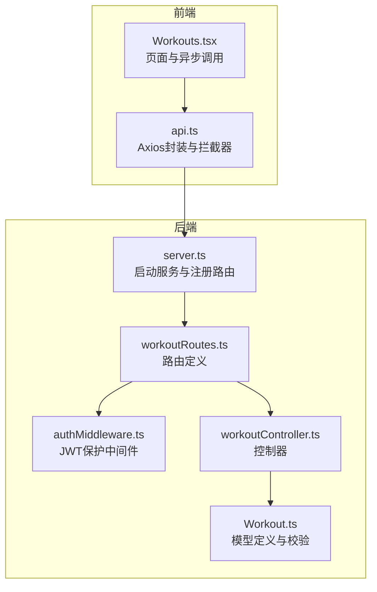
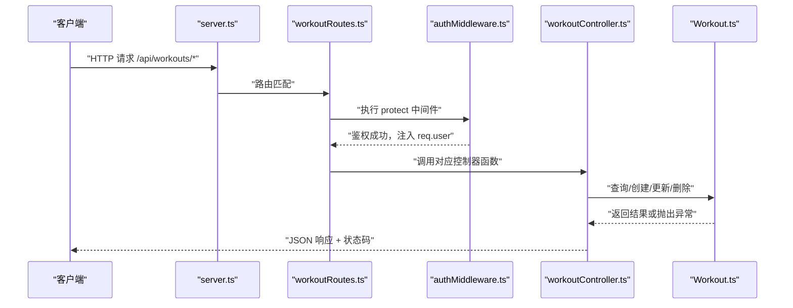
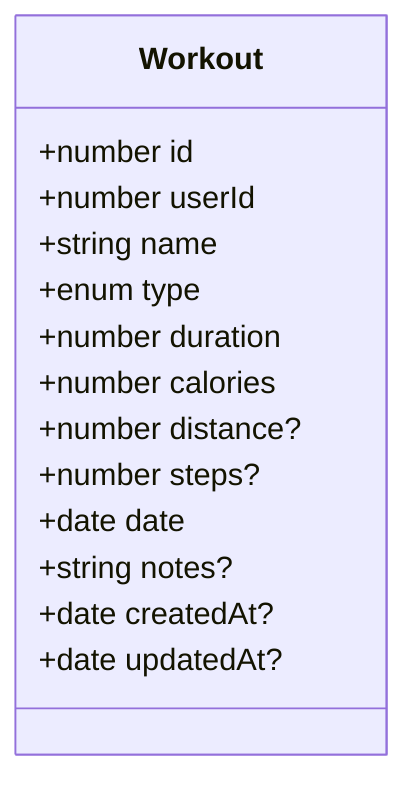
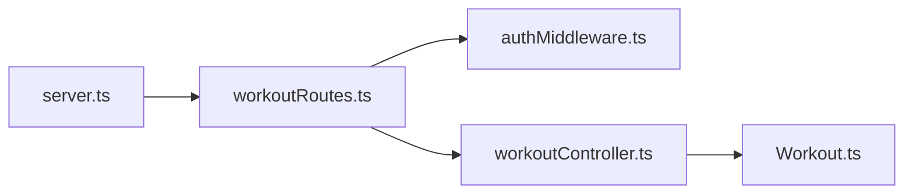

# 运动记录API

<cite>
**本文引用的文件**
- [backend/src/controllers/workoutController.ts](file://backend/src/controllers/workoutController.ts)
- [backend/src/models/Workout.ts](file://backend/src/models/Workout.ts)
- [backend/src/routes/workoutRoutes.ts](file://backend/src/routes/workoutRoutes.ts)
- [backend/src/middleware/authMiddleware.ts](file://backend/src/middleware/authMiddleware.ts)
- [backend/src/server.ts](file://backend/src/server.ts)
- [docs/4. API接口文档.md](file://docs/4. API接口文档.md)
- [frontend/src/services/api.ts](file://frontend/src/services/api.ts)
- [frontend/src/pages/Workouts.tsx](file://frontend/src/pages/Workouts.tsx)
</cite>

## 目录
1. [简介](#简介)
2. [项目结构](#项目结构)
3. [核心组件](#核心组件)
4. [架构总览](#架构总览)
5. [详细组件分析](#详细组件分析)
6. [依赖关系分析](#依赖关系分析)
7. [性能考虑](#性能考虑)
8. [故障排查指南](#故障排查指南)
9. [结论](#结论)
10. [附录](#附录)

## 简介
本文件为“运动记录管理API”的全面技术文档，覆盖对 /api/workouts 及其子路径的 GET/POST/PUT/DELETE 操作。文档明确每个端点的HTTP方法、URL参数、请求体结构、响应格式与状态码，并重点说明所有接口均需通过 JWT 认证（protect 中间件）。同时，文档解释 workoutController 中各函数如何与 Workout 模型交互以实现 CRUD 操作，提供完整的请求/响应示例、分页说明、数据验证错误与权限检查策略（确保用户仅能操作自己的记录），并给出前端调用示例，展示如何处理异步操作与错误。

## 项目结构
后端采用 Express + Sequelize 架构，按职责分层组织：
- 路由层：定义 /api/workouts 的路由与保护中间件
- 控制器层：实现 CRUD 业务逻辑
- 模型层：Workout 模型定义与校验规则
- 中间件层：JWT 认证保护
- 服务入口：server.ts 注册路由并启动服务

图表来源
- [backend/src/server.ts](file://backend/src/server.ts#L1-L36)
- [backend/src/routes/workoutRoutes.ts](file://backend/src/routes/workoutRoutes.ts#L1-L22)
- [backend/src/middleware/authMiddleware.ts](file://backend/src/middleware/authMiddleware.ts#L1-L36)
- [backend/src/controllers/workoutController.ts](file://backend/src/controllers/workoutController.ts#L1-L132)
- [backend/src/models/Workout.ts](file://backend/src/models/Workout.ts#L1-L122)
- [frontend/src/services/api.ts](file://frontend/src/services/api.ts#L1-L61)
- [frontend/src/pages/Workouts.tsx](file://frontend/src/pages/Workouts.tsx#L1-L200)

章节来源
- [backend/src/server.ts](file://backend/src/server.ts#L1-L36)
- [backend/src/routes/workoutRoutes.ts](file://backend/src/routes/workoutRoutes.ts#L1-L22)
- [backend/src/middleware/authMiddleware.ts](file://backend/src/middleware/authMiddleware.ts#L1-L36)
- [backend/src/controllers/workoutController.ts](file://backend/src/controllers/workoutController.ts#L1-L132)
- [backend/src/models/Workout.ts](file://backend/src/models/Workout.ts#L1-L122)
- [frontend/src/services/api.ts](file://frontend/src/services/api.ts#L1-L61)
- [frontend/src/pages/Workouts.tsx](file://frontend/src/pages/Workouts.tsx#L1-L200)

## 核心组件
- 路由：在 /api/workouts 上注册 GET（获取全部）、POST（创建）、GET/:id（获取单条）、PUT/:id（更新）、DELETE/:id（删除）
- 中间件：protect 中间件负责从 Authorization 头解析 Bearer Token，验证并注入用户信息到 req.user
- 控制器：实现 CRUD 逻辑，包含权限校验（仅允许操作本人记录）
- 模型：Workout 定义字段、枚举类型、校验规则与与 User 的关联

章节来源
- [backend/src/routes/workoutRoutes.ts](file://backend/src/routes/workoutRoutes.ts#L1-L22)
- [backend/src/middleware/authMiddleware.ts](file://backend/src/middleware/authMiddleware.ts#L1-L36)
- [backend/src/controllers/workoutController.ts](file://backend/src/controllers/workoutController.ts#L1-L132)
- [backend/src/models/Workout.ts](file://backend/src/models/Workout.ts#L1-L122)

## 架构总览
以下序列图展示了典型请求流程：客户端发起受保护的 /api/workouts 请求，经中间件鉴权后交由控制器处理，控制器访问模型完成数据库操作并返回响应。

图表来源
- [backend/src/server.ts](file://backend/src/server.ts#L1-L36)
- [backend/src/routes/workoutRoutes.ts](file://backend/src/routes/workoutRoutes.ts#L1-L22)
- [backend/src/middleware/authMiddleware.ts](file://backend/src/middleware/authMiddleware.ts#L1-L36)
- [backend/src/controllers/workoutController.ts](file://backend/src/controllers/workoutController.ts#L1-L132)
- [backend/src/models/Workout.ts](file://backend/src/models/Workout.ts#L1-L122)

## 详细组件分析

### GET /api/workouts（获取所有记录）
- 方法与路径：GET /api/workouts
- 权限：私有（需 JWT）
- 行为：返回当前登录用户的所有运动记录，按日期降序排列
- 请求头：Authorization: Bearer <token>
- 成功响应：数组，元素为运动记录对象
- 错误响应：
  - 401 未授权（无 token 或 token 无效）
  - 500 服务器错误
- 数据模型字段：见“附录-数据模型字段”
- 分页：未实现分页；如需分页可在控制器中增加 limit/offset 参数

章节来源
- [backend/src/controllers/workoutController.ts](file://backend/src/controllers/workoutController.ts#L12-L22)
- [backend/src/routes/workoutRoutes.ts](file://backend/src/routes/workoutRoutes.ts#L13-L15)
- [backend/src/middleware/authMiddleware.ts](file://backend/src/middleware/authMiddleware.ts#L9-L36)
- [docs/4. API接口文档.md](file://docs/4. API接口文档.md#L100-L125)

### POST /api/workouts（创建新记录）
- 方法与路径：POST /api/workouts
- 权限：私有（需 JWT）
- 请求体：运动记录对象（字段见“附录-数据模型字段”）
- 成功响应：创建成功的运动记录对象（状态码 201）
- 错误响应：
  - 401 未授权（无 token 或 token 无效）
  - 500 服务器错误
- 业务要点：控制器将 req.user.id 写入 userId 字段，确保记录归属当前用户

章节来源
- [backend/src/controllers/workoutController.ts](file://backend/src/controllers/workoutController.ts#L48-L71)
- [backend/src/routes/workoutRoutes.ts](file://backend/src/routes/workoutRoutes.ts#L13-L15)
- [backend/src/middleware/authMiddleware.ts](file://backend/src/middleware/authMiddleware.ts#L9-L36)
- [docs/4. API接口文档.md](file://docs/4. API接口文档.md#L126-L160)

### GET /api/workouts/:id（获取单条记录）
- 方法与路径：GET /api/workouts/:id
- 权限：私有（需 JWT）
- URL 参数：id（记录ID）
- 行为：返回指定ID的运动记录；若记录不存在返回 404；若记录不属于当前用户返回 401
- 成功响应：运动记录对象
- 错误响应：
  - 404 记录不存在
  - 401 未授权（非本人记录）
  - 500 服务器错误

章节来源
- [backend/src/controllers/workoutController.ts](file://backend/src/controllers/workoutController.ts#L24-L46)
- [backend/src/routes/workoutRoutes.ts](file://backend/src/routes/workoutRoutes.ts#L17-L19)
- [backend/src/middleware/authMiddleware.ts](file://backend/src/middleware/authMiddleware.ts#L9-L36)
- [docs/4. API接口文档.md](file://docs/4. API接口文档.md#L161-L182)

### PUT /api/workouts/:id（更新记录）
- 方法与路径：PUT /api/workouts/:id
- 权限：私有（需 JWT）
- URL 参数：id（记录ID）
- 请求体：部分字段（字段见“附录-数据模型字段”）；未提供的字段保持不变
- 行为：先查找记录，不存在返回 404；再校验是否属于当前用户，否则返回 401；最后保存更新
- 成功响应：更新后的运动记录对象
- 错误响应：
  - 404 记录不存在
  - 401 未授权（非本人记录）
  - 500 服务器错误

章节来源
- [backend/src/controllers/workoutController.ts](file://backend/src/controllers/workoutController.ts#L73-L107)
- [backend/src/routes/workoutRoutes.ts](file://backend/src/routes/workoutRoutes.ts#L19-L20)
- [backend/src/middleware/authMiddleware.ts](file://backend/src/middleware/authMiddleware.ts#L9-L36)
- [docs/4. API接口文档.md](file://docs/4. API接口文档.md#L183-L217)

### DELETE /api/workouts/:id（删除记录）
- 方法与路径：DELETE /api/workouts/:id
- 权限：私有（需 JWT）
- URL 参数：id（记录ID）
- 行为：先查找记录，不存在返回 404；再校验是否属于当前用户，否则返回 401；最后删除并返回成功消息
- 成功响应：{"message": "运动记录删除成功"}
- 错误响应：
  - 404 记录不存在
  - 401 未授权（非本人记录）
  - 500 服务器错误

章节来源
- [backend/src/controllers/workoutController.ts](file://backend/src/controllers/workoutController.ts#L109-L132)
- [backend/src/routes/workoutRoutes.ts](file://backend/src/routes/workoutRoutes.ts#L19-L20)
- [backend/src/middleware/authMiddleware.ts](file://backend/src/middleware/authMiddleware.ts#L9-L36)
- [docs/4. API接口文档.md](file://docs/4. API接口文档.md#L218-L231)

### JWT 认证与权限控制
- 中间件：protect 从 Authorization 头解析 Bearer Token，验证后将用户信息注入 req.user
- 控制器：在读取/更新/删除操作前，对比记录的 userId 与 req.user.id，不一致则拒绝
- 前端：api.ts 在请求拦截器中自动附加 Authorization: Bearer <token>，前端页面 Workouts.tsx 使用该封装进行 CRUD

章节来源
- [backend/src/middleware/authMiddleware.ts](file://backend/src/middleware/authMiddleware.ts#L9-L36)
- [backend/src/controllers/workoutController.ts](file://backend/src/controllers/workoutController.ts#L24-L46)
- [backend/src/controllers/workoutController.ts](file://backend/src/controllers/workoutController.ts#L73-L107)
- [backend/src/controllers/workoutController.ts](file://backend/src/controllers/workoutController.ts#L109-L132)
- [frontend/src/services/api.ts](file://frontend/src/services/api.ts#L1-L61)
- [frontend/src/pages/Workouts.tsx](file://frontend/src/pages/Workouts.tsx#L1-L200)

### 数据模型与字段定义
- 字段清单（来自模型定义）：
  - id: 整数，主键
  - userId: 整数，外键关联 users.id
  - name: 字符串，必填
  - type: 枚举，取值范围为 running/cycling/swimming/walking/strength/yoga/other
  - duration: 小整数（分钟），必填，最小值 0
  - calories: 小整数（卡路里），必填，最小值 0
  - distance: 数值（公里），可选，最小值 0
  - steps: 整数（步数），可选，最小值 0
  - date: 日期，默认当前时间
  - notes: 文本，可选
  - createdAt/updatedAt: 时间戳

图表来源
- [backend/src/models/Workout.ts](file://backend/src/models/Workout.ts#L1-L122)

章节来源
- [backend/src/models/Workout.ts](file://backend/src/models/Workout.ts#L1-L122)

### 请求/响应示例与状态码
- GET /api/workouts
  - 成功：200，响应为数组，元素为运动记录对象
  - 失败：401（未授权），500（服务器错误）
- POST /api/workouts
  - 成功：201，响应为新建记录对象
  - 失败：401（未授权），500（服务器错误）
- GET /api/workouts/:id
  - 成功：200，响应为记录对象
  - 失败：404（不存在），401（未授权），500（服务器错误）
- PUT /api/workouts/:id
  - 成功：200，响应为更新后的记录对象
  - 失败：404（不存在），401（未授权），500（服务器错误）
- DELETE /api/workouts/:id
  - 成功：200，响应为 {"message": "..."}
  - 失败：404（不存在），401（未授权），500（服务器错误）

章节来源
- [docs/4. API接口文档.md](file://docs/4. API接口文档.md#L100-L231)
- [backend/src/controllers/workoutController.ts](file://backend/src/controllers/workoutController.ts#L12-L132)

### 前端调用示例
- Axios 封装：api.ts 创建实例并设置 baseURL，拦截器自动附加 Authorization 头
- 页面使用：Workouts.tsx 通过 workoutAPI.getAll/getById/create/update/delete 发起请求，处理加载、错误与刷新列表
- 异步与错误处理：页面在 try/catch 中捕获错误，统一设置错误提示并避免阻塞 UI

章节来源
- [frontend/src/services/api.ts](file://frontend/src/services/api.ts#L1-L61)
- [frontend/src/pages/Workouts.tsx](file://frontend/src/pages/Workouts.tsx#L1-L200)

## 依赖关系分析
- 路由依赖中间件：workoutRoutes.ts 在每个端点上挂载 protect
- 控制器依赖模型：workoutController.ts 通过 Sequelize 对 Workout 执行查询/创建/更新/删除
- 中间件依赖用户模型：protect 从 JWT 解析用户ID并查询 User，排除密码字段
- 服务入口依赖路由：server.ts 注册 /api/workouts 路由

图表来源
- [backend/src/routes/workoutRoutes.ts](file://backend/src/routes/workoutRoutes.ts#L1-L22)
- [backend/src/middleware/authMiddleware.ts](file://backend/src/middleware/authMiddleware.ts#L1-L36)
- [backend/src/controllers/workoutController.ts](file://backend/src/controllers/workoutController.ts#L1-L132)
- [backend/src/models/Workout.ts](file://backend/src/models/Workout.ts#L1-L122)
- [backend/src/server.ts](file://backend/src/server.ts#L1-L36)

章节来源
- [backend/src/routes/workoutRoutes.ts](file://backend/src/routes/workoutRoutes.ts#L1-L22)
- [backend/src/middleware/authMiddleware.ts](file://backend/src/middleware/authMiddleware.ts#L1-L36)
- [backend/src/controllers/workoutController.ts](file://backend/src/controllers/workoutController.ts#L1-L132)
- [backend/src/models/Workout.ts](file://backend/src/models/Workout.ts#L1-L122)
- [backend/src/server.ts](file://backend/src/server.ts#L1-L36)

## 性能考虑
- 查询排序：GET /api/workouts 默认按 date 降序，适合前端直接展示最新记录
- 分页：当前未实现分页；建议在控制器中引入 limit/offset 或基于游标分页，避免一次性加载大量数据
- 校验：模型已内置字段校验（如最小值），可减少无效数据进入数据库
- 并发：控制器内为单条事务式操作，无需额外并发控制

[本节为通用建议，不直接分析具体文件]

## 故障排查指南
- 401 未授权
  - 检查 Authorization 头是否为 Bearer <token>，且 token 有效
  - 确认 token 对应用户存在且未被禁用
- 404 记录不存在
  - 确认传入的 :id 是否正确
- 401 非本人记录
  - 确认当前登录用户与记录 userId 匹配
- 500 服务器错误
  - 查看后端日志定位具体异常
- 前端错误处理
  - api.ts 已统一拦截 token 缺失或无效的情况
  - 页面 Workouts.tsx 在请求失败时设置错误提示并阻止继续操作

章节来源
- [backend/src/middleware/authMiddleware.ts](file://backend/src/middleware/authMiddleware.ts#L9-L36)
- [backend/src/controllers/workoutController.ts](file://backend/src/controllers/workoutController.ts#L24-L46)
- [backend/src/controllers/workoutController.ts](file://backend/src/controllers/workoutController.ts#L73-L107)
- [backend/src/controllers/workoutController.ts](file://backend/src/controllers/workoutController.ts#L109-L132)
- [frontend/src/services/api.ts](file://frontend/src/services/api.ts#L1-L61)
- [frontend/src/pages/Workouts.tsx](file://frontend/src/pages/Workouts.tsx#L1-L200)

## 结论
本系统通过明确的路由、中间件与控制器分层，实现了对运动记录的完整 CRUD 能力，并以 JWT 保障用户数据隔离。模型层的字段与校验规则确保了数据质量。前端通过统一的 API 封装与页面逻辑，提供了良好的用户体验。后续可考虑引入分页与更细粒度的权限控制，以进一步提升性能与安全性。

[本节为总结性内容，不直接分析具体文件]

## 附录

### 数据模型字段定义
- id: number
- userId: number
- name: string
- type: enum(running|cycling|swimming|walking|strength|yoga|other)
- duration: number（分钟）
- calories: number（卡路里）
- distance?: number（公里）
- steps?: number（步数）
- date: date
- notes?: string
- createdAt/updatedAt: timestamp

章节来源
- [backend/src/models/Workout.ts](file://backend/src/models/Workout.ts#L1-L122)

### 接口一览表
- GET /api/workouts → 返回当前用户所有记录
- POST /api/workouts → 创建新记录
- GET /api/workouts/:id → 获取单条记录
- PUT /api/workouts/:id → 更新记录
- DELETE /api/workouts/:id → 删除记录

章节来源
- [docs/4. API接口文档.md](file://docs/4. API接口文档.md#L100-L231)
- [backend/src/routes/workoutRoutes.ts](file://backend/src/routes/workoutRoutes.ts#L13-L20)