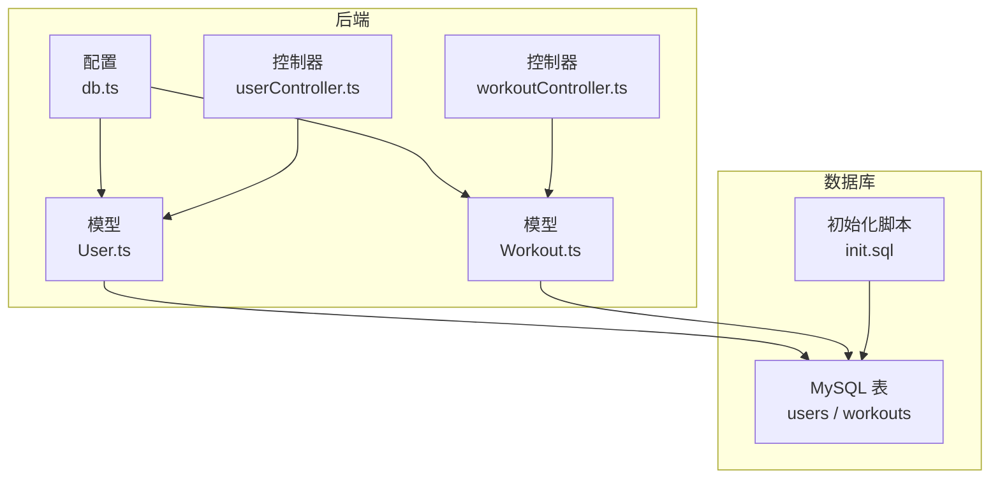
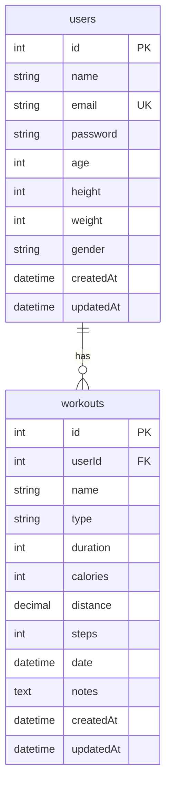
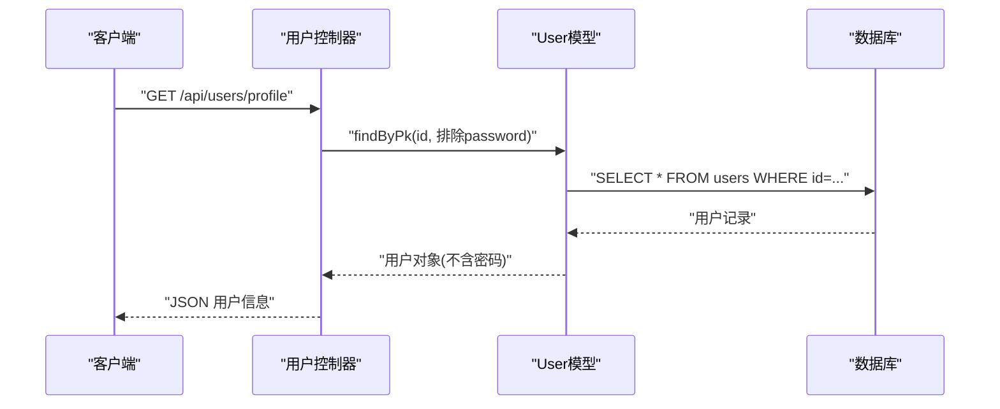
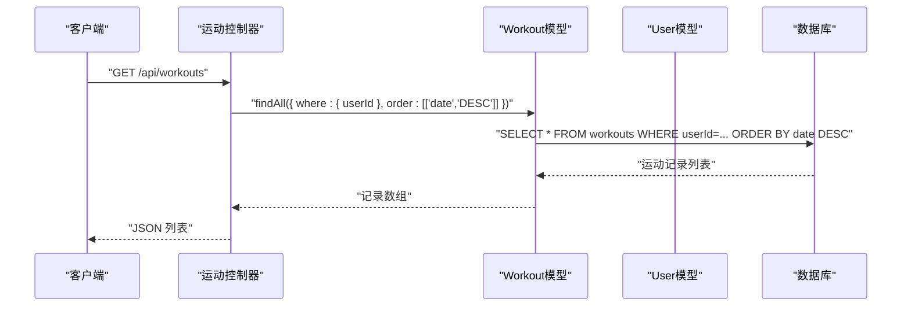
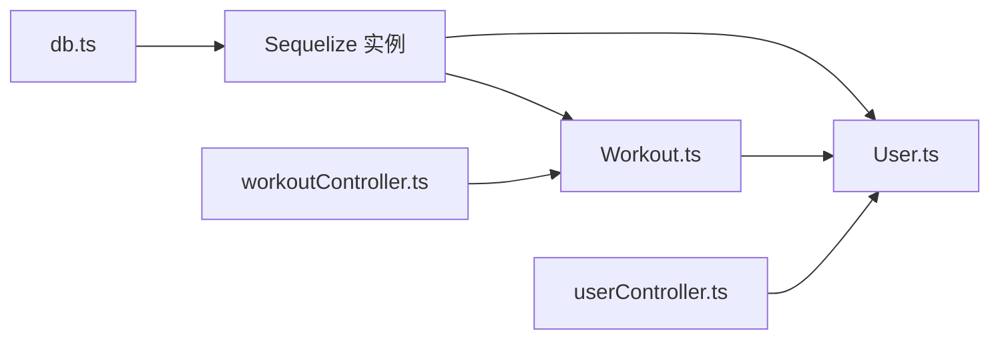

# ORM模型

<cite>
**本文引用的文件**
- [User.ts](file://backend/src/models/User.ts)
- [Workout.ts](file://backend/src/models/Workout.ts)
- [db.ts](file://backend/src/config/db.ts)
- [init.sql](file://mysql/init.sql)
- [数据库设计.md](file://docs/5. 数据库设计.md)
- [userController.ts](file://backend/src/controllers/userController.ts)
- [workoutController.ts](file://backend/src/controllers/workoutController.ts)
</cite>

## 目录
1. [简介](#简介)
2. [项目结构](#项目结构)
3. [核心组件](#核心组件)
4. [架构总览](#架构总览)
5. [详细组件分析](#详细组件分析)
6. [依赖分析](#依赖分析)
7. [性能考虑](#性能考虑)
8. [故障排查指南](#故障排查指南)
9. [结论](#结论)
10. [附录](#附录)

## 简介
本文件系统化梳理后端的ORM模型，聚焦于User与Workout两个Sequelize模型，阐述其字段定义、数据类型、主键/外键约束、索引与验证规则；解释User与Workout之间的一对多关系及Sequelize模型与MySQL数据库表的映射机制；结合init.sql中的表结构定义，给出数据库模式图示与实际数据示例，并总结数据访问模式与性能优化策略。

## 项目结构
- 后端采用TypeScript + Express + Sequelize + MySQL技术栈
- 数据库连接在配置文件中初始化，启动时同步模型（alter: true）
- User与Workout模型分别定义在models目录下
- 控制器层负责业务逻辑与数据访问，基于模型进行CRUD操作



图表来源
- [db.ts](file://backend/src/config/db.ts#L1-L41)
- [User.ts](file://backend/src/models/User.ts#L1-L119)
- [Workout.ts](file://backend/src/models/Workout.ts#L1-L122)
- [init.sql](file://mysql/init.sql#L1-L41)

章节来源
- [db.ts](file://backend/src/config/db.ts#L1-L41)
- [User.ts](file://backend/src/models/User.ts#L1-L119)
- [Workout.ts](file://backend/src/models/Workout.ts#L1-L122)
- [init.sql](file://mysql/init.sql#L1-L41)

## 核心组件
- User模型
  - 字段：id、name、email、password、age、height、weight、gender、createdAt、updatedAt
  - 主键：id（自增整型，无符号）
  - 约束：email唯一、非空；password非空；age/height/weight可空，带取值范围校验；gender为枚举
  - 验证：邮箱格式、密码长度、年龄/身高/体重范围
  - 钩子：beforeCreate/beforeUpdate对密码进行bcrypt加盐哈希
  - 映射：users表
- Workout模型
  - 字段：id、userId、name、type、duration、calories、distance、steps、date、notes、createdAt、updatedAt
  - 主键：id（自增整型，无符号）
  - 外键：userId引用users.id，ON DELETE/CASCADE ON UPDATE/CASCADE
  - 约束：name/type/duration/calories/date非空；distance/steps/notes可空；type为枚举
  - 验证：duration/calories/distance/steps最小值≥0；date默认值为当前时间
  - 映射：workouts表
- 关系
  - User.hasMany(Workout, { foreignKey: 'userId', as: 'workouts' })
  - Workout.belongsTo(User, { foreignKey: 'userId', as: 'user' })
  - 一对多：一个用户可有多条运动记录

章节来源
- [User.ts](file://backend/src/models/User.ts#L1-L119)
- [Workout.ts](file://backend/src/models/Workout.ts#L1-L122)

## 架构总览
下面的类图展示了User与Workout的模型定义、字段与关系映射。

```mermaid
classDiagram
class User {
+number id
+string name
+string email
+string password
+number age
+number height
+number weight
+string gender
+Date createdAt
+Date updatedAt
+matchPassword(enteredPassword) Promise~boolean~
}
class Workout {
+number id
+number userId
+string name
+string type
+number duration
+number calories
+number distance
+number steps
+Date date
+string notes
+Date createdAt
+Date updatedAt
}
User "1" --> "0..*" Workout : "hasMany<br/>as : 'workouts'"
Workout "0..*" --> "1" User : "belongsTo<br/>as : 'user'"
```

图表来源
- [User.ts](file://backend/src/models/User.ts#L1-L119)
- [Workout.ts](file://backend/src/models/Workout.ts#L1-L122)

## 详细组件分析

### User模型
- 字段与类型
  - id: 整型，自增，主键
  - name: 字符串，最大长度100，非空
  - email: 字符串，最大长度100，非空且唯一，邮箱格式校验
  - password: 字符串，最大长度255，非空，长度6-100
  - age/height/weight: 可空，分别有最小/最大范围校验
  - gender: 枚举('male','female','other')
  - createdAt/updatedAt: 时间戳，默认开启时间戳字段
- 约束与索引
  - 主键：id
  - 唯一索引：email（由唯一约束生成）
  - 其他索引：在初始化脚本中为users.email建立唯一索引
- 验证规则
  - 邮箱格式、密码长度、年龄/身高/体重范围
- 钩子
  - beforeCreate/beforeUpdate：对密码进行加盐哈希
- 映射到数据库
  - 表名：users
  - 字段类型与约束与init.sql一致

章节来源
- [User.ts](file://backend/src/models/User.ts#L1-L119)
- [init.sql](file://mysql/init.sql#L7-L19)
- [数据库设计.md](file://docs/5. 数据库设计.md#L1-L90)

### Workout模型
- 字段与类型
  - id: 整型，自增，主键
  - userId: 整型，非空，外键引用users.id
  - name: 字符串，最大长度100，非空
  - type: 枚举('running','cycling','swimming','walking','strength','yoga','other')，非空
  - duration: 小整型，非空，最小值0
  - calories: 小整型，非空，最小值0
  - distance: 十进制(5,2)，可空，最小值0
  - steps: 中整型，可空，最小值0
  - date: 日期时间，非空，默认当前时间
  - notes: 文本，可空
  - createdAt/updatedAt: 时间戳，默认开启时间戳字段
- 约束与索引
  - 主键：id
  - 外键：userId → users.id，级联删除与更新
  - 索引：在初始化脚本中为workouts(userId)与workouts(date)建立普通索引
- 验证规则
  - duration/calories/distance/steps最小值≥0
- 映射到数据库
  - 表名：workouts
  - 字段类型与约束与init.sql一致

章节来源
- [Workout.ts](file://backend/src/models/Workout.ts#L1-L122)
- [init.sql](file://mysql/init.sql#L21-L36)
- [数据库设计.md](file://docs/5. 数据库设计.md#L42-L90)

### 实体关系与映射
- 实体关系
  - User与Workout为一对多关系：一个用户可以有多条运动记录
  - 关系通过Workout的userId外键实现
- 数据库映射
  - User → users
  - Workout → workouts
  - 外键约束与索引在init.sql中定义，与模型定义保持一致

章节来源
- [Workout.ts](file://backend/src/models/Workout.ts#L111-L121)
- [init.sql](file://mysql/init.sql#L21-L36)
- [数据库设计.md](file://docs/5. 数据库设计.md#L91-L123)

### 数据库模式图示


图表来源
- [数据库设计.md](file://docs/5. 数据库设计.md#L91-L123)
- [init.sql](file://mysql/init.sql#L7-L36)

### 数据访问模式
- 用户相关
  - 获取当前用户资料：findByPk(id, { attributes: { exclude: ['password'] } })
  - 更新用户资料：findByPk(id)后save()
- 运动记录相关
  - 获取当前用户的所有运动记录：findAll({ where: { userId: req.user.id }, order: [['date','DESC']] })
  - 按ID获取运动记录：findByPk(id)
  - 创建运动记录：create({ userId, ... })
  - 更新/删除运动记录：先校验是否属于当前用户，再save()/destroy()



图表来源
- [userController.ts](file://backend/src/controllers/userController.ts#L1-L60)
- [User.ts](file://backend/src/models/User.ts#L1-L119)



图表来源
- [workoutController.ts](file://backend/src/controllers/workoutController.ts#L1-L132)
- [Workout.ts](file://backend/src/models/Workout.ts#L1-L122)

### 实际数据示例
- 用户示例
  - id: 1
  - name: "张三"
  - email: "zhangsan@example.com"
  - password: "$2a$..."（bcrypt哈希）
  - age: 28
  - height: 175
  - weight: 70
  - gender: "male"
  - createdAt/updatedAt: 2024-01-01 12:00:00
- 运动记录示例
  - id: 101
  - userId: 1
  - name: "晨跑"
  - type: "running"
  - duration: 45
  - calories: 320
  - distance: 5.20
  - steps: 6200
  - date: 2024-01-02 07:00:00
  - notes: "天气晴朗"
  - createdAt/updatedAt: 2024-01-02 07:00:00

章节来源
- [数据库设计.md](file://docs/5. 数据库设计.md#L1-L90)

## 依赖分析
- 组件耦合
  - Workout依赖User（外键userId），形成单向依赖
  - 控制器依赖模型，模型依赖数据库
- 外部依赖
  - Sequelize ORM
  - MySQL驱动
  - bcrypt（密码哈希）
- 初始化流程
  - db.ts创建Sequelize实例并连接数据库
  - 启动时执行sequelize.sync({ alter: true })同步模型与表结构



图表来源
- [db.ts](file://backend/src/config/db.ts#L1-L41)
- [User.ts](file://backend/src/models/User.ts#L1-L119)
- [Workout.ts](file://backend/src/models/Workout.ts#L1-L122)
- [userController.ts](file://backend/src/controllers/userController.ts#L1-L60)
- [workoutController.ts](file://backend/src/controllers/workoutController.ts#L1-L132)

章节来源
- [db.ts](file://backend/src/config/db.ts#L1-L41)
- [User.ts](file://backend/src/models/User.ts#L1-L119)
- [Workout.ts](file://backend/src/models/Workout.ts#L1-L122)
- [userController.ts](file://backend/src/controllers/userController.ts#L1-L60)
- [workoutController.ts](file://backend/src/controllers/workoutController.ts#L1-L132)

## 性能考虑
- 索引策略
  - users.email：唯一索引，加速登录与唯一性检查
  - workouts.userId：普通索引，加速按用户查询
  - workouts.date：普通索引，加速按日期范围查询
- 查询优化建议
  - 分页查询：对按用户分页查询使用limit/offset或游标分页
  - 聚合查询：按日期范围统计时利用date索引
  - 预加载关联：如需同时获取用户与运动记录，使用include减少N+1查询
- 写入优化
  - 批量插入：大量运动记录导入时使用批量写入
  - 去重：注册时利用email唯一索引避免重复
- 存储与类型
  - 使用UNSIGNED整型减少溢出风险
  - DECIMAL(5,2)存储距离，兼顾精度与存储空间

章节来源
- [init.sql](file://mysql/init.sql#L38-L41)
- [数据库设计.md](file://docs/5. 数据库设计.md#L79-L90)

## 故障排查指南
- 连接失败
  - 检查环境变量MYSQL_*配置与数据库可达性
  - 查看db.ts中的连接日志与错误输出
- 同步失败
  - alter: true允许变更现有表结构；若需要重建表，可改为force: true
- 密码问题
  - 确认beforeCreate/beforeUpdate钩子已触发，密码被正确哈希
- 外键约束
  - 删除用户会级联删除其运动记录（ON DELETE CASCADE）
- 权限与授权
  - 控制器中对资源归属进行校验，防止越权访问

章节来源
- [db.ts](file://backend/src/config/db.ts#L1-L41)
- [User.ts](file://backend/src/models/User.ts#L101-L117)
- [Workout.ts](file://backend/src/models/Workout.ts#L48-L57)
- [workoutController.ts](file://backend/src/controllers/workoutController.ts#L24-L46)

## 结论
本ORM模型清晰地将User与Workout映射至MySQL表结构，通过明确的字段类型、约束与验证规则保障数据一致性；借助外键与索引提升查询性能；通过钩子与控制器实现安全与权限控制。整体设计满足健身追踪场景的数据需求，并具备良好的扩展性与维护性。

## 附录
- 初始化脚本要点
  - 创建数据库与表
  - 定义主键、外键与索引
  - 设置默认值与时间戳
- 文档参考
  - 数据库设计文档提供了完整的表结构、索引与ER图

章节来源
- [init.sql](file://mysql/init.sql#L1-L41)
- [数据库设计.md](file://docs/5. 数据库设计.md#L1-L184)