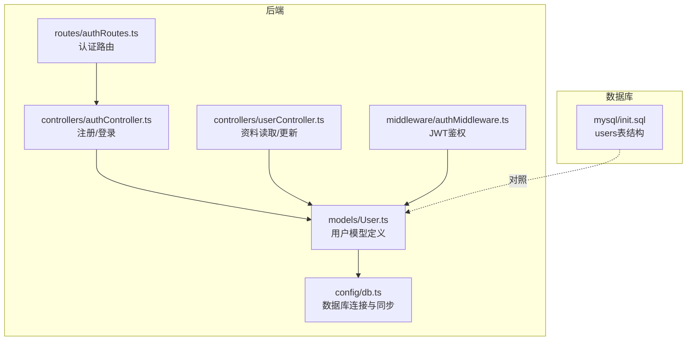
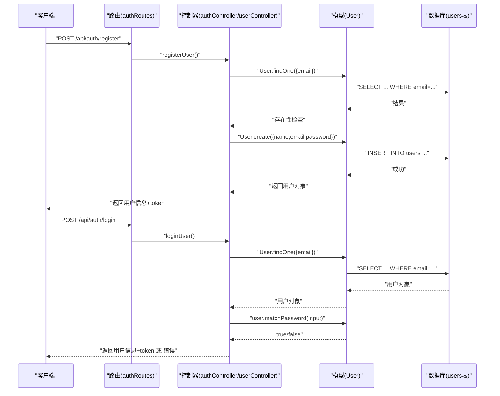
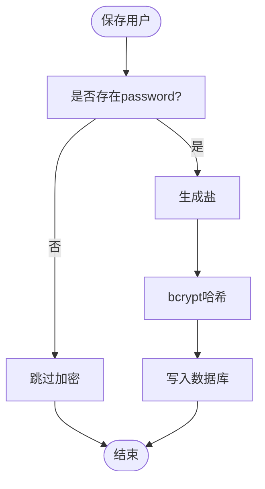
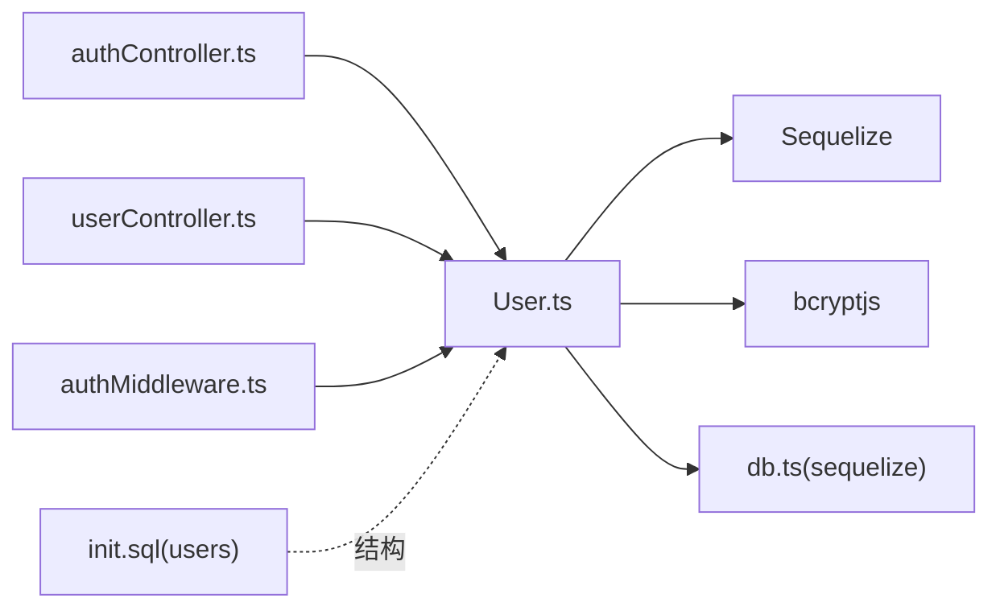

# 用户模型

<cite>
**本文引用的文件**
- [backend/src/models/User.ts](file://backend/src/models/User.ts)
- [mysql/init.sql](file://mysql/init.sql)
- [backend/src/config/db.ts](file://backend/src/config/db.ts)
- [backend/src/controllers/authController.ts](file://backend/src/controllers/authController.ts)
- [backend/src/controllers/userController.ts](file://backend/src/controllers/userController.ts)
- [backend/src/middleware/authMiddleware.ts](file://backend/src/middleware/authMiddleware.ts)
- [backend/src/routes/authRoutes.ts](file://backend/src/routes/authRoutes.ts)
- [docs/5. 数据库设计.md](file://docs/5. 数据库设计.md)
- [README.md](file://README.md)
</cite>

## 目录
1. [简介](#简介)
2. [项目结构](#项目结构)
3. [核心组件](#核心组件)
4. [架构总览](#架构总览)
5. [详细组件分析](#详细组件分析)
6. [依赖分析](#依赖分析)
7. [性能考虑](#性能考虑)
8. [故障排查指南](#故障排查指南)
9. [结论](#结论)
10. [附录](#附录)

## 简介
本文件系统性梳理后端用户模型（User）的Sequelize实现，覆盖字段定义、数据类型、约束与验证规则；重点说明邮箱唯一性约束、密码bcrypt加密机制（通过beforeCreate与beforeUpdate钩子）、年龄/身高/体重的数值范围校验；并结合init.sql中的表结构进行对照说明。同时给出实际数据示例与常见操作路径（如用户创建、密码验证），并解释时间戳自动生成机制与表名配置。

## 项目结构
用户模型位于后端TypeScript源码的models目录下，配合数据库连接配置、控制器与中间件共同完成认证与用户资料管理流程。

**图表来源**
- [backend/src/models/User.ts](file://backend/src/models/User.ts#L1-L119)
- [backend/src/config/db.ts](file://backend/src/config/db.ts#L1-L41)
- [backend/src/controllers/authController.ts](file://backend/src/controllers/authController.ts#L1-L71)
- [backend/src/controllers/userController.ts](file://backend/src/controllers/userController.ts#L1-L60)
- [backend/src/middleware/authMiddleware.ts](file://backend/src/middleware/authMiddleware.ts#L1-L36)
- [backend/src/routes/authRoutes.ts](file://backend/src/routes/authRoutes.ts#L1-L9)
- [mysql/init.sql](file://mysql/init.sql#L1-L41)

**章节来源**
- [backend/src/models/User.ts](file://backend/src/models/User.ts#L1-L119)
- [backend/src/config/db.ts](file://backend/src/config/db.ts#L1-L41)
- [mysql/init.sql](file://mysql/init.sql#L1-L41)

## 核心组件
- 用户模型（User）
  - 字段与类型：id、name、email、password、age、height、weight、gender、createdAt、updatedAt
  - 约束与验证：
    - 邮箱唯一性与邮箱格式校验
    - 密码长度校验
    - 年龄/身高/体重数值范围校验
  - 加密与钩子：beforeCreate与beforeUpdate钩子中使用bcrypt对密码进行加盐哈希
  - 时间戳：Sequelize自动维护createdAt与updatedAt
  - 表名：users
- 数据库表users
  - 字段与类型：id、name、email、password、age、height、weight、gender、createdAt、updatedAt
  - 约束：email唯一索引、各字段允许空值或非空约束
  - 索引：email唯一索引
- 认证与用户资料控制器
  - 注册：基于User.create创建用户并返回JWT
  - 登录：基于User.findOne查询用户并调用matchPassword进行密码比对
  - 资料读取/更新：通过JWT鉴权后读取/更新用户信息（密码不返回）

**章节来源**
- [backend/src/models/User.ts](file://backend/src/models/User.ts#L1-L119)
- [mysql/init.sql](file://mysql/init.sql#L1-L41)
- [backend/src/controllers/authController.ts](file://backend/src/controllers/authController.ts#L1-L71)
- [backend/src/controllers/userController.ts](file://backend/src/controllers/userController.ts#L1-L60)
- [backend/src/middleware/authMiddleware.ts](file://backend/src/middleware/authMiddleware.ts#L1-L36)

## 架构总览
用户模型在系统中的位置与交互如下：

**图表来源**
- [backend/src/routes/authRoutes.ts](file://backend/src/routes/authRoutes.ts#L1-L9)
- [backend/src/controllers/authController.ts](file://backend/src/controllers/authController.ts#L1-L71)
- [backend/src/models/User.ts](file://backend/src/models/User.ts#L1-L119)
- [mysql/init.sql](file://mysql/init.sql#L1-L41)

## 详细组件分析

### 字段定义与约束
- id
  - 类型：INTEGER.UNSIGNED
  - 主键：是
  - 自增：是
  - 说明：用户唯一标识
- name
  - 类型：STRING(100)
  - 约束：不允许为空
  - 说明：用户姓名
- email
  - 类型：STRING(100)
  - 约束：不允许为空、唯一、邮箱格式校验
  - 说明：用户登录凭据
- password
  - 类型：STRING(255)
  - 约束：不允许为空、长度6~100
  - 说明：bcrypt加密后的密码字符串
- age
  - 类型：TINYINT.UNSIGNED
  - 约束：允许为空、范围1~120
  - 说明：用户年龄
- height
  - 类型：SMALLINT.UNSIGNED
  - 约束：允许为空、范围50~300（单位cm）
  - 说明：用户身高
- weight
  - 类型：SMALLINT.UNSIGNED
  - 约束：允许为空、范围20~1000（单位kg）
  - 说明：用户体重
- gender
  - 类型：ENUM('male','female','other')
  - 约束：允许为空
  - 说明：用户性别
- createdAt/updatedAt
  - 类型：Date（由Sequelize自动维护）
  - 约束：只读（Sequelize timestamps）
  - 说明：记录创建与更新时间

以上字段定义与init.sql中的users表结构一一对应，包括唯一索引、默认时间戳行为与索引设计。

**章节来源**
- [backend/src/models/User.ts](file://backend/src/models/User.ts#L41-L117)
- [mysql/init.sql](file://mysql/init.sql#L7-L19)
- [docs/5. 数据库设计.md](file://docs/5. 数据库设计.md#L15-L41)

### 密码加密机制（bcrypt + 钩子）
- beforeCreate钩子
  - 当创建用户时，若存在password字段，则生成盐并进行哈希，再保存到数据库
- beforeUpdate钩子
  - 仅当password字段发生变更时才重新加盐哈希，避免不必要的计算
- 实际调用
  - 登录时通过实例方法matchPassword进行明文与存储密码的比对

**图表来源**
- [backend/src/models/User.ts](file://backend/src/models/User.ts#L101-L116)

**章节来源**
- [backend/src/models/User.ts](file://backend/src/models/User.ts#L35-L38)
- [backend/src/models/User.ts](file://backend/src/models/User.ts#L101-L116)
- [backend/src/controllers/authController.ts](file://backend/src/controllers/authController.ts#L51-L68)

### 数值范围验证
- 年龄（age）
  - 最小值：1
  - 最大值：120
- 身高（height）
  - 最小值：50 cm
  - 最大值：300 cm
- 体重（weight）
  - 最小值：20 kg
  - 最大值：1000 kg

这些验证规则在模型层通过Sequelize的validate配置生效，同时init.sql中以UNSIGNED类型限制了非负范围。

**章节来源**
- [backend/src/models/User.ts](file://backend/src/models/User.ts#L68-L91)
- [mysql/init.sql](file://mysql/init.sql#L13-L15)

### 时间戳与表名配置
- 表名：users（tableName配置）
- 时间戳：开启timestamps后，Sequelize自动维护createdAt与updatedAt
- 数据库默认行为：init.sql中为createdAt/updatedAt设置了默认值与自动更新策略

**章节来源**
- [backend/src/models/User.ts](file://backend/src/models/User.ts#L96-L100)
- [backend/src/config/db.ts](file://backend/src/config/db.ts#L31-L33)
- [mysql/init.sql](file://mysql/init.sql#L17-L18)

### 模型与users表映射对照
- 字段映射：User.ts中的每个字段均与init.sql中的users表列一一对应
- 约束映射：唯一索引（email）、非空约束、枚举类型、默认时间戳
- 索引映射：init.sql中对email建立唯一索引，提升查询与唯一性保证

**章节来源**
- [backend/src/models/User.ts](file://backend/src/models/User.ts#L49-L95)
- [mysql/init.sql](file://mysql/init.sql#L7-L19)
- [docs/5. 数据库设计.md](file://docs/5. 数据库设计.md#L83-L88)

### 实际数据示例与常见操作
- 用户创建
  - 路径参考：[注册控制器](file://backend/src/controllers/authController.ts#L15-L46)
  - 关键点：使用User.create创建用户；若email已存在则返回错误
- 密码验证
  - 路径参考：[登录控制器](file://backend/src/controllers/authController.ts#L51-L68)
  - 关键点：先User.findOne根据email查到用户，再调用user.matchPassword进行比对
- 读取与更新用户资料
  - 路径参考：[用户资料控制器](file://backend/src/controllers/userController.ts#L8-L60)
  - 关键点：保护路由中间件鉴权后，读取时排除password字段；更新时支持name、email、age、height、weight、gender字段

**章节来源**
- [backend/src/controllers/authController.ts](file://backend/src/controllers/authController.ts#L15-L46)
- [backend/src/controllers/authController.ts](file://backend/src/controllers/authController.ts#L51-L68)
- [backend/src/controllers/userController.ts](file://backend/src/controllers/userController.ts#L8-L60)
- [backend/src/middleware/authMiddleware.ts](file://backend/src/middleware/authMiddleware.ts#L9-L35)

## 依赖分析
- 模型依赖
  - User.ts依赖Sequelize（DataTypes、Model、hooks）、bcryptjs、数据库连接实例
- 控制器依赖
  - authController依赖User模型与JWT生成
  - userController依赖User模型与JWT中间件
- 中间件依赖
  - authMiddleware依赖User模型与JWT解析
- 数据库依赖
  - init.sql定义users表结构与索引
  - db.ts负责连接与同步（alter模式）

**图表来源**
- [backend/src/models/User.ts](file://backend/src/models/User.ts#L1-L119)
- [backend/src/config/db.ts](file://backend/src/config/db.ts#L1-L41)
- [backend/src/controllers/authController.ts](file://backend/src/controllers/authController.ts#L1-L71)
- [backend/src/controllers/userController.ts](file://backend/src/controllers/userController.ts#L1-L60)
- [backend/src/middleware/authMiddleware.ts](file://backend/src/middleware/authMiddleware.ts#L1-L36)
- [mysql/init.sql](file://mysql/init.sql#L7-L19)

**章节来源**
- [backend/src/models/User.ts](file://backend/src/models/User.ts#L1-L119)
- [backend/src/config/db.ts](file://backend/src/config/db.ts#L1-L41)
- [backend/src/controllers/authController.ts](file://backend/src/controllers/authController.ts#L1-L71)
- [backend/src/controllers/userController.ts](file://backend/src/controllers/userController.ts#L1-L60)
- [backend/src/middleware/authMiddleware.ts](file://backend/src/middleware/authMiddleware.ts#L1-L36)
- [mysql/init.sql](file://mysql/init.sql#L7-L19)

## 性能考虑
- 索引优化
  - users.email建立唯一索引，有利于登录与去重场景
- 查询优化
  - 控制器读取用户资料时排除password字段，减少传输与序列化开销
- 密码处理
  - 仅在密码变更时重新哈希，避免不必要的bcrypt计算
- 同步策略
  - db.ts采用alter模式同步模型，便于开发阶段迭代；生产环境建议谨慎选择同步策略

[本节为通用指导，无需具体文件来源]

## 故障排查指南
- 邮箱重复导致创建失败
  - 现象：注册时报错或返回“用户已存在”
  - 排查：确认email是否已在users表中存在唯一索引
  - 参考：[注册控制器](file://backend/src/controllers/authController.ts#L19-L24)
- 密码错误
  - 现象：登录返回“无效邮箱或密码”
  - 排查：确认传入明文与数据库中bcrypt哈希一致；检查beforeCreate/Update钩子是否正常执行
  - 参考：[登录控制器](file://backend/src/controllers/authController.ts#L58-L67)
- 字段范围错误
  - 现象：age/height/weight超出范围导致校验失败
  - 排查：核对模型validate配置与业务输入范围
  - 参考：[User模型验证规则](file://backend/src/models/User.ts#L68-L91)
- 时间戳异常
  - 现象：createdAt/updatedAt未更新或与期望不符
  - 排查：确认Sequelize timestamps启用与init.sql默认时间戳设置
  - 参考：[User模型时间戳配置](file://backend/src/models/User.ts#L96-L100)、[init.sql默认时间戳](file://mysql/init.sql#L17-L18)

**章节来源**
- [backend/src/controllers/authController.ts](file://backend/src/controllers/authController.ts#L19-L24)
- [backend/src/controllers/authController.ts](file://backend/src/controllers/authController.ts#L58-L67)
- [backend/src/models/User.ts](file://backend/src/models/User.ts#L68-L91)
- [backend/src/models/User.ts](file://backend/src/models/User.ts#L96-L100)
- [mysql/init.sql](file://mysql/init.sql#L17-L18)

## 结论
User模型通过严谨的字段定义、约束与验证规则，结合bcrypt加密与Sequelize钩子，实现了安全可靠的用户认证与资料管理能力。其与init.sql中的users表结构高度一致，配合JWT中间件与控制器，形成了从路由到数据库的完整闭环。开发与运维过程中应重点关注邮箱唯一性、密码哈希时机、字段范围校验与索引性能。

[本节为总结性内容，无需具体文件来源]

## 附录

### 字段与类型对照表
- id：INTEGER.UNSIGNED（主键、自增）
- name：STRING(100)（非空）
- email：STRING(100)（非空、唯一、邮箱格式）
- password：STRING(255)（非空、长度6~100）
- age：TINYINT.UNSIGNED（可空、范围1~120）
- height：SMALLINT.UNSIGNED（可空、范围50~300）
- weight：SMALLINT.UNSIGNED（可空、范围20~1000）
- gender：ENUM('male','female','other')（可空）
- createdAt/updatedAt：Date（Sequelize自动维护）

**章节来源**
- [backend/src/models/User.ts](file://backend/src/models/User.ts#L49-L95)
- [mysql/init.sql](file://mysql/init.sql#L7-L19)
- [docs/5. 数据库设计.md](file://docs/5. 数据库设计.md#L15-L41)

### 常见操作路径清单
- 用户注册
  - 路由：POST /api/auth/register
  - 控制器：[registerUser](file://backend/src/controllers/authController.ts#L15-L46)
  - 模型：User.create
- 用户登录
  - 路由：POST /api/auth/login
  - 控制器：[loginUser](file://backend/src/controllers/authController.ts#L51-L68)
  - 模型：User.findOne + user.matchPassword
- 读取用户资料
  - 路由：GET /api/users/profile
  - 控制器：[getUserProfile](file://backend/src/controllers/userController.ts#L8-L26)
  - 中间件：[protect](file://backend/src/middleware/authMiddleware.ts#L9-L35)
- 更新用户资料
  - 路由：PUT /api/users/profile
  - 控制器：[updateUserProfile](file://backend/src/controllers/userController.ts#L28-L60)

**章节来源**
- [backend/src/routes/authRoutes.ts](file://backend/src/routes/authRoutes.ts#L1-L9)
- [backend/src/controllers/authController.ts](file://backend/src/controllers/authController.ts#L15-L68)
- [backend/src/controllers/userController.ts](file://backend/src/controllers/userController.ts#L8-L60)
- [backend/src/middleware/authMiddleware.ts](file://backend/src/middleware/authMiddleware.ts#L9-L35)
- [README.md](file://README.md#L134-L142)