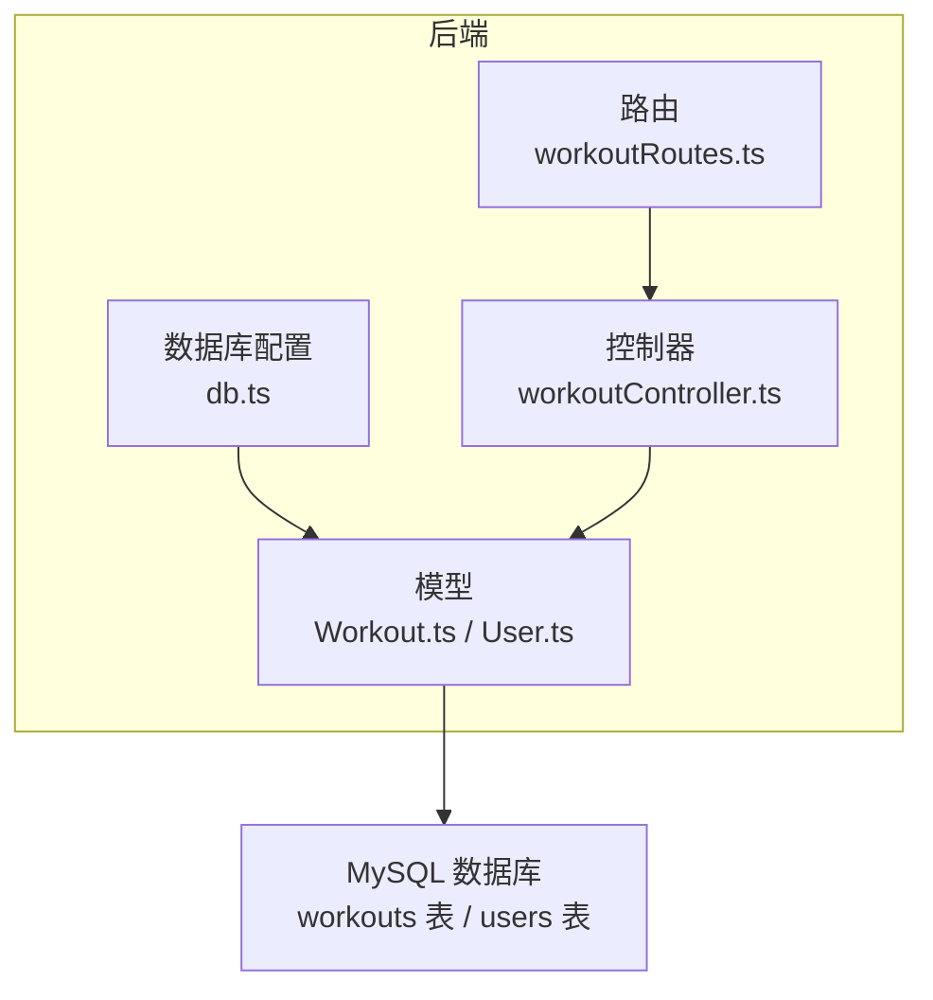
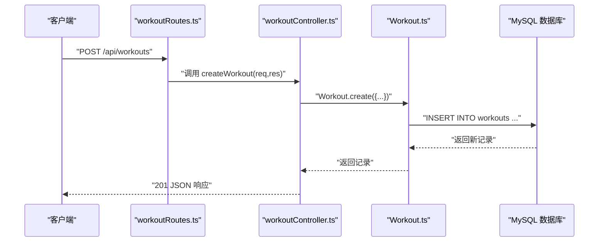
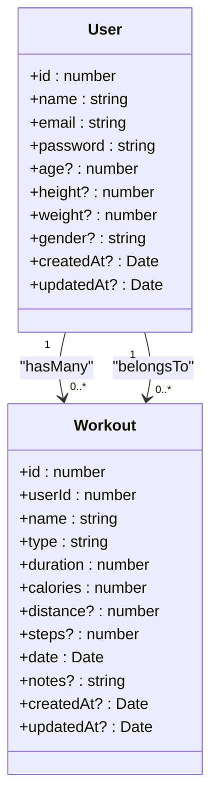
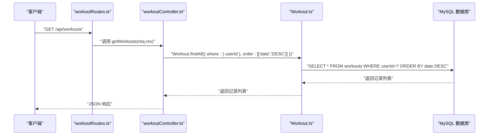
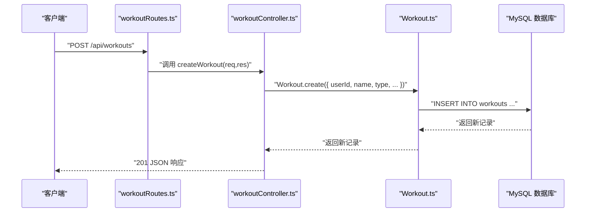
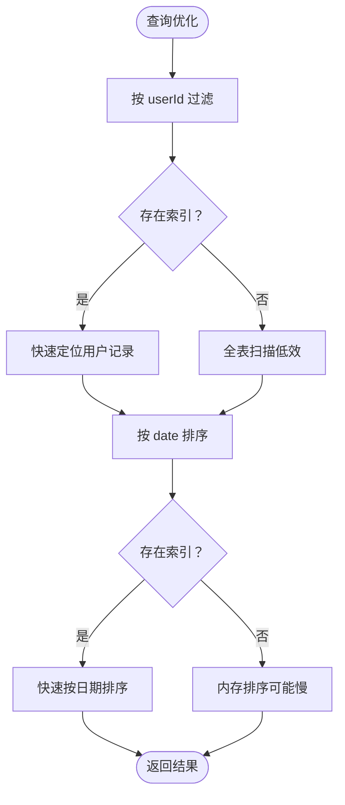
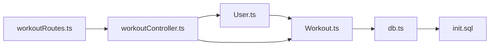

# 运动记录模型

<cite>
**本文引用的文件**
- [Workout.ts](file://backend/src/models/Workout.ts)
- [User.ts](file://backend/src/models/User.ts)
- [db.ts](file://backend/src/config/db.ts)
- [workoutController.ts](file://backend/src/controllers/workoutController.ts)
- [workoutRoutes.ts](file://backend/src/routes/workoutRoutes.ts)
- [init.sql](file://mysql/init.sql)
- [数据库设计.md](file://docs/5. 数据库设计.md)
</cite>

## 目录
1. [简介](#简介)
2. [项目结构](#项目结构)
3. [核心组件](#核心组件)
4. [架构总览](#架构总览)
5. [详细组件分析](#详细组件分析)
6. [依赖分析](#依赖分析)
7. [性能考虑](#性能考虑)
8. [故障排查指南](#故障排查指南)
9. [结论](#结论)
10. [附录](#附录)

## 简介
本文件系统化梳理后端“运动记录模型（Workout）”的 Sequelize 实现，覆盖字段定义、数据类型、约束与验证规则；重点说明外键约束（关联 User 模型、级联删除与更新）、运动类型枚举限制、时长与卡路里非负校验、距离与步数可选性；并结合 MySQL 初始化脚本与数据库设计文档，明确模型与数据库表的映射关系。同时给出与 User 的一对多关联关系说明，以及典型操作（创建、查询用户全部运动记录）的调用流程与路径参考。

## 项目结构
- 后端采用 TypeScript + Express + Sequelize + MySQL 架构
- 模型位于 backend/src/models，控制器位于 backend/src/controllers，路由位于 backend/src/routes
- 数据库初始化脚本位于 mysql/init.sql，数据库设计文档位于 docs/5. 数据库设计.md
- 数据库连接与同步逻辑位于 backend/src/config/db.ts

图表来源
- [db.ts](file://backend/src/config/db.ts#L1-L41)
- [Workout.ts](file://backend/src/models/Workout.ts#L1-L122)
- [User.ts](file://backend/src/models/User.ts#L1-L119)
- [workoutRoutes.ts](file://backend/src/routes/workoutRoutes.ts#L1-L22)
- [workoutController.ts](file://backend/src/controllers/workoutController.ts#L1-L132)
- [init.sql](file://mysql/init.sql#L1-L41)

章节来源
- [db.ts](file://backend/src/config/db.ts#L1-L41)
- [workoutRoutes.ts](file://backend/src/routes/workoutRoutes.ts#L1-L22)
- [workoutController.ts](file://backend/src/controllers/workoutController.ts#L1-L132)

## 核心组件
- 模型：Workout（运动记录）
- 关联：User.hasMany(Workout) 与 Workout.belongsTo(User)
- 路由：/api/workouts（GET/POST）、/api/workouts/:id（GET/PUT/DELETE）
- 控制器：提供查询、创建、更新、删除等业务逻辑
- 数据库：workouts 表与 users 表，包含外键约束与索引

章节来源
- [Workout.ts](file://backend/src/models/Workout.ts#L1-L122)
- [User.ts](file://backend/src/models/User.ts#L1-L119)
- [workoutRoutes.ts](file://backend/src/routes/workoutRoutes.ts#L1-L22)
- [workoutController.ts](file://backend/src/controllers/workoutController.ts#L1-L132)
- [init.sql](file://mysql/init.sql#L1-L41)
- [数据库设计.md](file://docs/5. 数据库设计.md#L42-L90)

## 架构总览
下图展示从客户端到数据库的典型调用链，以创建运动记录为例：

图表来源
- [workoutRoutes.ts](file://backend/src/routes/workoutRoutes.ts#L1-L22)
- [workoutController.ts](file://backend/src/controllers/workoutController.ts#L48-L71)
- [Workout.ts](file://backend/src/models/Workout.ts#L40-L109)

## 详细组件分析

### 字段定义与约束（对照 init.sql 与数据库设计文档）
- id
  - 类型：整型（无符号自增），主键
  - 映射：workouts.id
- userId
  - 类型：整型（无符号），非空
  - 外键：REFERENCES users(id)，ON DELETE/CASCADE，ON UPDATE/CASCADE
  - 映射：workouts.userId
- name
  - 类型：字符串（最大100），非空
  - 映射：workouts.name
- type
  - 类型：枚举（限定值：running, cycling, swimming, walking, strength, yoga, other），非空
  - 映射：workouts.type
- duration
  - 类型：小整型（无符号），非空，最小值≥0
  - 单位：分钟
  - 映射：workouts.duration
- calories
  - 类型：小整型（无符号），非空，最小值≥0
  - 映射：workouts.calories
- distance
  - 类型：十进制（5,2），可空，最小值≥0
  - 单位：公里
  - 映射：workouts.distance
- steps
  - 类型：中整型（无符号），可空，最小值≥0
  - 映射：workouts.steps
- date
  - 类型：日期时间，非空，默认值为当前时间
  - 映射：workouts.date
- notes
  - 类型：文本，可空
  - 映射：workouts.notes
- createdAt/updatedAt
  - 类型：日期时间，默认值 CURRENT_TIMESTAMP，更新时自动刷新
  - 映射：workouts.createdAt / updatedAt

字段来源与映射对照
- 字段定义与约束：参见 [Workout.ts](file://backend/src/models/Workout.ts#L40-L109)
- 数据库表结构与外键、索引：参见 [init.sql](file://mysql/init.sql#L21-L41) 与 [数据库设计.md](file://docs/5. 数据库设计.md#L42-L90)

章节来源
- [Workout.ts](file://backend/src/models/Workout.ts#L40-L109)
- [init.sql](file://mysql/init.sql#L21-L41)
- [数据库设计.md](file://docs/5. 数据库设计.md#L42-L90)

### 关联关系与外键约束
- 一对多：User.hasMany(Workout, { foreignKey: 'userId', as: 'workouts' })
- 反向：Workout.belongsTo(User, { foreignKey: 'userId', as: 'user' })
- 外键约束：ON DELETE/CASCADE，ON UPDATE/CASCADE
- 级联行为：当用户被删除或更新时，其运动记录会级联删除或跟随更新

图表来源
- [Workout.ts](file://backend/src/models/Workout.ts#L111-L121)
- [User.ts](file://backend/src/models/User.ts#L1-L119)

章节来源
- [Workout.ts](file://backend/src/models/Workout.ts#L111-L121)
- [User.ts](file://backend/src/models/User.ts#L1-L119)

### 典型操作与调用流程

#### 查询用户的所有运动记录
- 路由：GET /api/workouts
- 控制器：getWorkouts
- 关键点：
  - 仅返回当前登录用户（req.user.id）的记录
  - 按 date 降序排序

调用路径参考
- [workoutRoutes.ts](file://backend/src/routes/workoutRoutes.ts#L13-L15)
- [workoutController.ts](file://backend/src/controllers/workoutController.ts#L13-L19)
- [Workout.ts](file://backend/src/models/Workout.ts#L40-L109)

章节来源
- [workoutRoutes.ts](file://backend/src/routes/workoutRoutes.ts#L13-L15)
- [workoutController.ts](file://backend/src/controllers/workoutController.ts#L13-L19)
- [Workout.ts](file://backend/src/models/Workout.ts#L40-L109)

#### 创建用户运动记录
- 路由：POST /api/workouts
- 控制器：createWorkout
- 关键点：
  - 从请求体提取 name, type, duration, calories, distance, steps, date, notes
  - 自动写入 userId 来自 req.user.id
  - 返回新建记录（状态码 201）

调用路径参考
- [workoutRoutes.ts](file://backend/src/routes/workoutRoutes.ts#L13-L15)
- [workoutController.ts](file://backend/src/controllers/workoutController.ts#L52-L67)
- [Workout.ts](file://backend/src/models/Workout.ts#L40-L109)

章节来源
- [workoutRoutes.ts](file://backend/src/routes/workoutRoutes.ts#L13-L15)
- [workoutController.ts](file://backend/src/controllers/workoutController.ts#L52-L67)
- [Workout.ts](file://backend/src/models/Workout.ts#L40-L109)

### 数据验证与约束规则
- 非空字段：userId、name、type、duration、calories、date
- 枚举限制：type 限定在指定集合内
- 非负校验：duration、calories、distance、steps 的最小值为 0
- 可空字段：distance、steps、notes
- 默认值：date 默认为当前时间
- 外键约束：userId 引用 users.id，级联删除与更新

章节来源
- [Workout.ts](file://backend/src/models/Workout.ts#L48-L109)
- [init.sql](file://mysql/init.sql#L21-L41)
- [数据库设计.md](file://docs/5. 数据库设计.md#L42-L90)

### 索引与查询优化
- 用户表索引：email（唯一索引）
- 运动记录表索引：
  - userId（普通索引）：加速按用户筛选
  - date（普通索引）：加速按日期范围查询
  - type（普通索引）：加速按运动类型统计

图表来源
- [init.sql](file://mysql/init.sql#L38-L41)
- [数据库设计.md](file://docs/5. 数据库设计.md#L79-L90)

章节来源
- [init.sql](file://mysql/init.sql#L38-L41)
- [数据库设计.md](file://docs/5. 数据库设计.md#L79-L90)

## 依赖分析
- 模型依赖：Workout.ts 依赖 User.ts（关联声明）
- 控制器依赖：workoutController.ts 依赖 Workout.ts 与 User.ts（用于授权与关联查询）
- 路由依赖：workoutRoutes.ts 依赖 workoutController.ts
- 数据库依赖：db.ts 提供 Sequelize 实例并执行同步（alter: true）

图表来源
- [User.ts](file://backend/src/models/User.ts#L1-L119)
- [Workout.ts](file://backend/src/models/Workout.ts#L1-L122)
- [workoutController.ts](file://backend/src/controllers/workoutController.ts#L1-L132)
- [workoutRoutes.ts](file://backend/src/routes/workoutRoutes.ts#L1-L22)
- [db.ts](file://backend/src/config/db.ts#L1-L41)
- [init.sql](file://mysql/init.sql#L1-L41)

章节来源
- [User.ts](file://backend/src/models/User.ts#L1-L119)
- [Workout.ts](file://backend/src/models/Workout.ts#L1-L122)
- [workoutController.ts](file://backend/src/controllers/workoutController.ts#L1-L132)
- [workoutRoutes.ts](file://backend/src/routes/workoutRoutes.ts#L1-L22)
- [db.ts](file://backend/src/config/db.ts#L1-L41)
- [init.sql](file://mysql/init.sql#L1-L41)

## 性能考虑
- 使用索引：在 userId 与 date 上建立索引，有助于按用户分页与按日期范围查询
- 字段选择：优先使用无符号整型（如 SMALLINT、MEDIUMINT、INTEGER UNSIGNED）减少存储与比较开销
- 枚举字段：type 使用 ENUM，减少存储与提升查询效率
- 时间字段：date 使用 DATETIME 并设置默认值，避免重复计算
- 同步策略：db.ts 中使用 alter: true，便于开发阶段迭代，生产环境建议谨慎评估

章节来源
- [init.sql](file://mysql/init.sql#L38-L41)
- [Workout.ts](file://backend/src/models/Workout.ts#L40-L109)
- [db.ts](file://backend/src/config/db.ts#L25-L33)

## 故障排查指南
- 外键约束错误
  - 现象：插入或更新时提示违反外键约束
  - 排查：确认 users 表中是否存在对应的 id；检查 userId 是否正确传入
  - 参考：[Workout.ts](file://backend/src/models/Workout.ts#L48-L57)、[init.sql](file://mysql/init.sql#L35-L35)
- 枚举值不合法
  - 现象：type 不在允许集合内导致校验失败
  - 排查：核对 type 值是否为 running/cycling/swimming/walking/strength/yoga/other
  - 参考：[Workout.ts](file://backend/src/models/Workout.ts#L62-L65)
- 数值非法（负数）
  - 现象：duration、calories、distance、steps 小于 0 导致校验失败
  - 排查：确保传入非负数值
  - 参考：[Workout.ts](file://backend/src/models/Workout.ts#L66-L93)
- 查询不到数据
  - 现象：getWorkouts 返回空列表
  - 排查：确认当前登录用户是否正确；确认是否存在该用户的记录
  - 参考：[workoutController.ts](file://backend/src/controllers/workoutController.ts#L13-L19)
- 删除失败或未级联
  - 现象：删除用户后运动记录未删除
  - 排查：确认外键约束已生效（ON DELETE CASCADE）
  - 参考：[init.sql](file://mysql/init.sql#L35-L35)

章节来源
- [Workout.ts](file://backend/src/models/Workout.ts#L48-L65)
- [workoutController.ts](file://backend/src/controllers/workoutController.ts#L13-L19)
- [init.sql](file://mysql/init.sql#L35-L35)

## 结论
Workout 模型完整映射了 MySQL 的 workouts 表，具备严格的字段约束与验证规则，清晰地表达了一对多关联关系，并通过外键约束实现了级联删除与更新。配合数据库层面的索引设计，能够满足按用户与日期高效查询的需求。典型业务操作（创建、查询用户全部记录）在控制器与路由中已有明确实现，便于扩展与维护。

## 附录

### 字段对照表（模型属性 → 数据库列）
- id → id
- userId → userId
- name → name
- type → type
- duration → duration
- calories → calories
- distance → distance
- steps → steps
- date → date
- notes → notes
- createdAt → createdAt
- updatedAt → updatedAt

章节来源
- [Workout.ts](file://backend/src/models/Workout.ts#L40-L109)
- [init.sql](file://mysql/init.sql#L21-L41)
- [数据库设计.md](file://docs/5. 数据库设计.md#L42-L90)