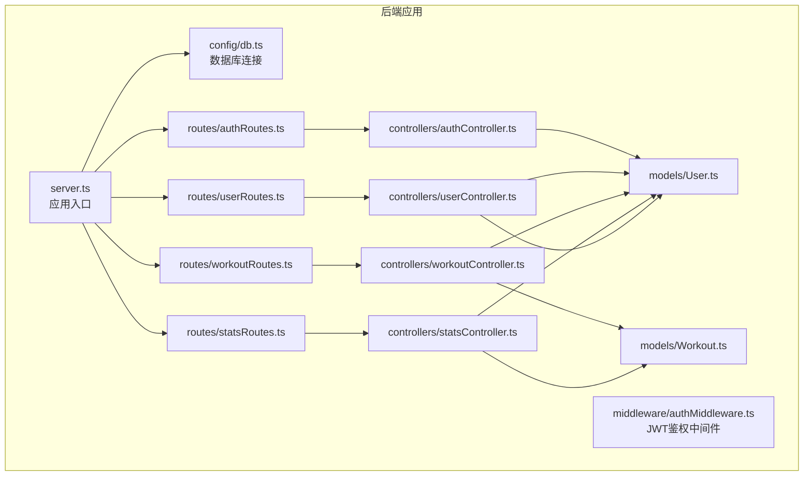
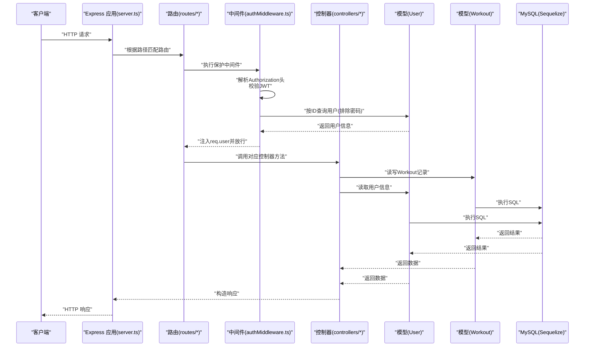
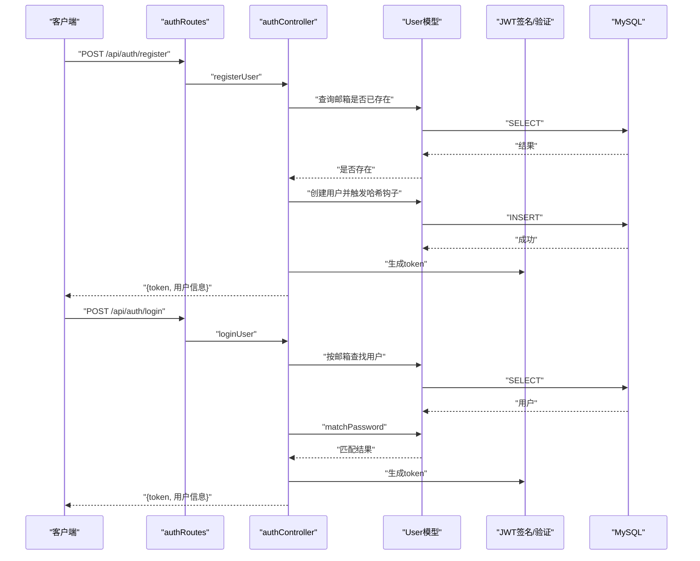
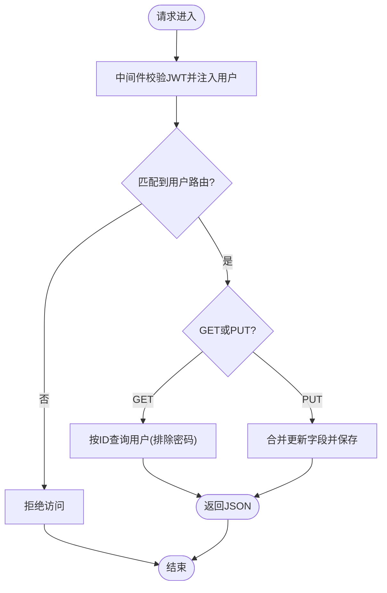
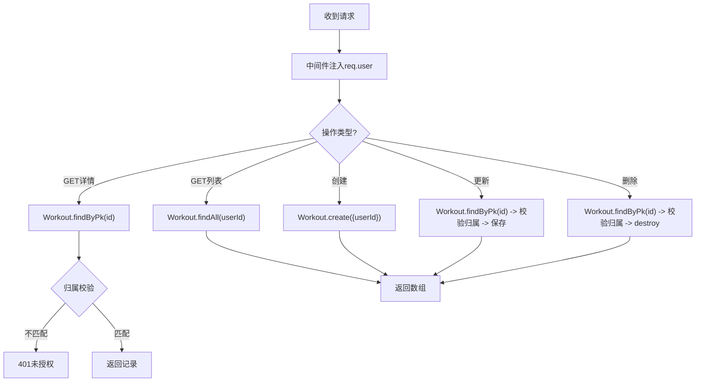
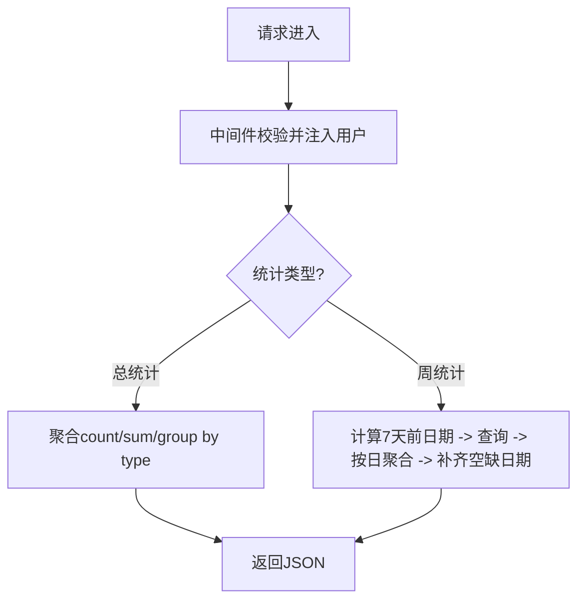
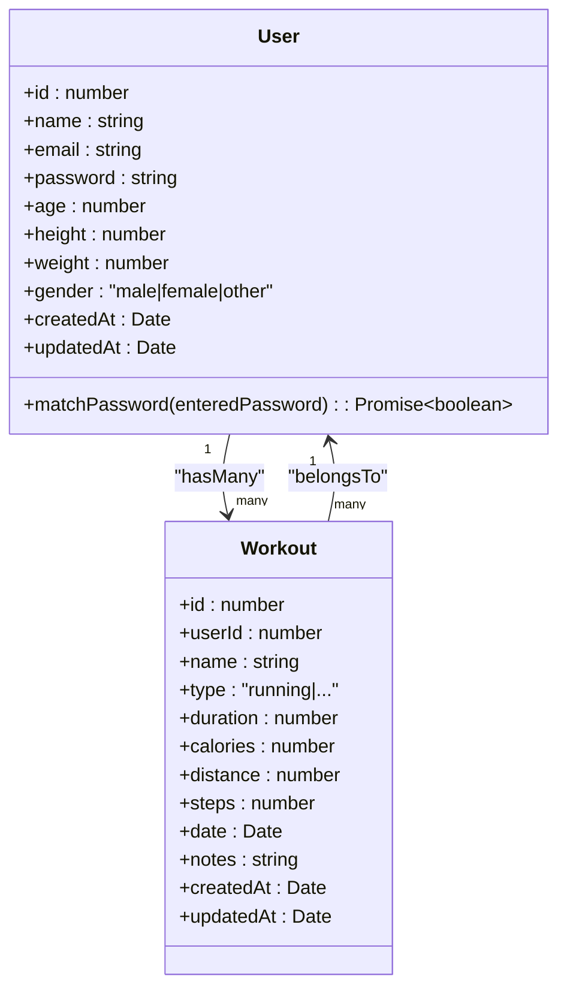
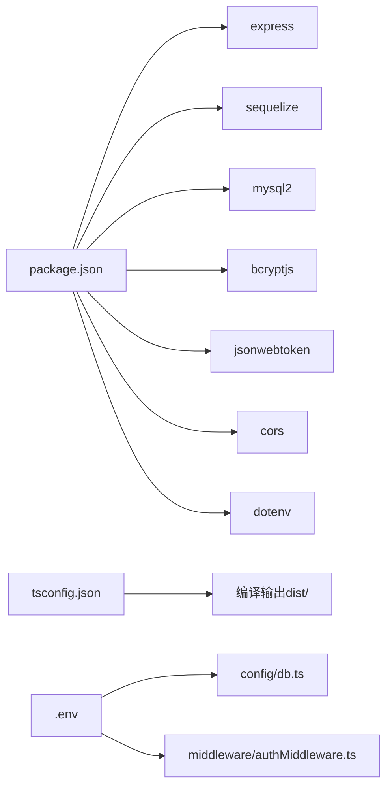

# 后端架构

<cite>
**本文引用的文件**
- [backend/src/server.ts](file://backend/src/server.ts)
- [backend/src/config/db.ts](file://backend/src/config/db.ts)
- [backend/src/controllers/authController.ts](file://backend/src/controllers/authController.ts)
- [backend/src/controllers/userController.ts](file://backend/src/controllers/userController.ts)
- [backend/src/controllers/workoutController.ts](file://backend/src/controllers/workoutController.ts)
- [backend/src/controllers/statsController.ts](file://backend/src/controllers/statsController.ts)
- [backend/src/middleware/authMiddleware.ts](file://backend/src/middleware/authMiddleware.ts)
- [backend/src/models/User.ts](file://backend/src/models/User.ts)
- [backend/src/models/Workout.ts](file://backend/src/models/Workout.ts)
- [backend/src/routes/authRoutes.ts](file://backend/src/routes/authRoutes.ts)
- [backend/src/routes/userRoutes.ts](file://backend/src/routes/userRoutes.ts)
- [backend/src/routes/workoutRoutes.ts](file://backend/src/routes/workoutRoutes.ts)
- [backend/src/routes/statsRoutes.ts](file://backend/src/routes/statsRoutes.ts)
- [backend/package.json](file://backend/package.json)
- [backend/tsconfig.json](file://backend/tsconfig.json)
- [backend/.env](file://backend/.env)
</cite>

## 目录
1. [简介](#简介)
2. [项目结构](#项目结构)
3. [核心组件](#核心组件)
4. [架构总览](#架构总览)
5. [详细组件分析](#详细组件分析)
6. [依赖关系分析](#依赖关系分析)
7. [性能考量](#性能考量)
8. [故障排查指南](#故障排查指南)
9. [结论](#结论)
10. [附录](#附录)

## 简介
本文件面向后端API架构，系统性阐述基于 Node.js + Express + TypeScript 的后端实现，涵盖 MVC 模式组织、RESTful API 设计原则、JWT 身份验证流程，以及 Sequelize ORM 与 MySQL 的集成方式。读者可据此快速理解模块职责、数据流与控制流，并掌握部署与扩展要点。

## 项目结构
后端采用按功能域分层的目录组织：
- config：数据库连接与环境变量加载
- controllers：业务控制器，处理请求与响应
- middleware：中间件（如鉴权）
- models：Sequelize 模型定义与关联
- routes：路由定义，绑定控制器方法
- server.ts：应用入口，注册中间件、路由与启动服务

图表来源
- [backend/src/server.ts](file://backend/src/server.ts#L1-L36)
- [backend/src/config/db.ts](file://backend/src/config/db.ts#L1-L41)
- [backend/src/middleware/authMiddleware.ts](file://backend/src/middleware/authMiddleware.ts#L1-L36)
- [backend/src/routes/authRoutes.ts](file://backend/src/routes/authRoutes.ts#L1-L9)
- [backend/src/routes/userRoutes.ts](file://backend/src/routes/userRoutes.ts#L1-L11)
- [backend/src/routes/workoutRoutes.ts](file://backend/src/routes/workoutRoutes.ts#L1-L22)
- [backend/src/routes/statsRoutes.ts](file://backend/src/routes/statsRoutes.ts#L1-L10)
- [backend/src/controllers/authController.ts](file://backend/src/controllers/authController.ts#L1-L71)
- [backend/src/controllers/userController.ts](file://backend/src/controllers/userController.ts#L1-L60)
- [backend/src/controllers/workoutController.ts](file://backend/src/controllers/workoutController.ts#L1-L132)
- [backend/src/controllers/statsController.ts](file://backend/src/controllers/statsController.ts#L1-L119)
- [backend/src/models/User.ts](file://backend/src/models/User.ts#L1-L119)
- [backend/src/models/Workout.ts](file://backend/src/models/Workout.ts#L1-L122)

章节来源
- [backend/src/server.ts](file://backend/src/server.ts#L1-L36)
- [backend/src/config/db.ts](file://backend/src/config/db.ts#L1-L41)

## 核心组件
- 应用入口与中间件
  - server.ts 加载环境变量、连接数据库、注册 CORS 与 JSON 中间件，并挂载各模块路由。
- 路由层
  - authRoutes、userRoutes、workoutRoutes、statsRoutes 定义 RESTful 资源路径与动作，统一使用保护中间件。
- 控制器层
  - authController：用户注册与登录，签发 JWT。
  - userController：获取与更新当前用户资料。
  - workoutController：查询、创建、更新、删除用户的运动记录；校验资源归属。
  - statsController：统计总时长/卡路里/距离、按类型分组统计、近七日聚合。
- 中间件层
  - authMiddleware：从 Authorization 头解析 Bearer Token，解码并注入用户信息到请求对象。
- 模型层（Sequelize）
  - User：字段含姓名、邮箱、密码及可选体征信息；提供密码比对与自动加盐哈希钩子。
  - Workout：字段含运动类型、时长、卡路里、距离等；与 User 建立一对多关联。
- 数据库连接
  - config/db.ts 使用 Sequelize 连接 MySQL，启用连接池与同步策略，捕获连接错误并退出进程。

章节来源
- [backend/src/server.ts](file://backend/src/server.ts#L1-L36)
- [backend/src/middleware/authMiddleware.ts](file://backend/src/middleware/authMiddleware.ts#L1-L36)
- [backend/src/controllers/authController.ts](file://backend/src/controllers/authController.ts#L1-L71)
- [backend/src/controllers/userController.ts](file://backend/src/controllers/userController.ts#L1-L60)
- [backend/src/controllers/workoutController.ts](file://backend/src/controllers/workoutController.ts#L1-L132)
- [backend/src/controllers/statsController.ts](file://backend/src/controllers/statsController.ts#L1-L119)
- [backend/src/models/User.ts](file://backend/src/models/User.ts#L1-L119)
- [backend/src/models/Workout.ts](file://backend/src/models/Workout.ts#L1-L122)
- [backend/src/config/db.ts](file://backend/src/config/db.ts#L1-L41)

## 架构总览
下图展示从客户端到数据库的完整调用链，包括 JWT 鉴权与资源归属校验。

图表来源
- [backend/src/server.ts](file://backend/src/server.ts#L1-L36)
- [backend/src/middleware/authMiddleware.ts](file://backend/src/middleware/authMiddleware.ts#L1-L36)
- [backend/src/routes/authRoutes.ts](file://backend/src/routes/authRoutes.ts#L1-L9)
- [backend/src/routes/userRoutes.ts](file://backend/src/routes/userRoutes.ts#L1-L11)
- [backend/src/routes/workoutRoutes.ts](file://backend/src/routes/workoutRoutes.ts#L1-L22)
- [backend/src/routes/statsRoutes.ts](file://backend/src/routes/statsRoutes.ts#L1-L10)
- [backend/src/controllers/authController.ts](file://backend/src/controllers/authController.ts#L1-L71)
- [backend/src/controllers/userController.ts](file://backend/src/controllers/userController.ts#L1-L60)
- [backend/src/controllers/workoutController.ts](file://backend/src/controllers/workoutController.ts#L1-L132)
- [backend/src/controllers/statsController.ts](file://backend/src/controllers/statsController.ts#L1-L119)
- [backend/src/models/User.ts](file://backend/src/models/User.ts#L1-L119)
- [backend/src/models/Workout.ts](file://backend/src/models/Workout.ts#L1-L122)
- [backend/src/config/db.ts](file://backend/src/config/db.ts#L1-L41)

## 详细组件分析

### 身份验证与JWT流程
- 登录/注册
  - 注册：检查邮箱唯一性，成功则创建用户并签发JWT。
  - 登录：按邮箱查找用户，校验密码，成功则签发JWT。
- 鉴权中间件
  - 从 Authorization 头提取 Bearer Token，验证签名并解析用户ID。
  - 查询用户并排除敏感字段，将用户信息注入 req.user，供后续控制器使用。
- 客户端使用
  - 成功登录后保存JWT，后续请求在 Authorization 头中携带 Bearer Token。

图表来源
- [backend/src/controllers/authController.ts](file://backend/src/controllers/authController.ts#L1-L71)
- [backend/src/middleware/authMiddleware.ts](file://backend/src/middleware/authMiddleware.ts#L1-L36)
- [backend/src/models/User.ts](file://backend/src/models/User.ts#L1-L119)
- [backend/src/routes/authRoutes.ts](file://backend/src/routes/authRoutes.ts#L1-L9)

章节来源
- [backend/src/controllers/authController.ts](file://backend/src/controllers/authController.ts#L1-L71)
- [backend/src/middleware/authMiddleware.ts](file://backend/src/middleware/authMiddleware.ts#L1-L36)
- [backend/src/models/User.ts](file://backend/src/models/User.ts#L1-L119)
- [backend/src/routes/authRoutes.ts](file://backend/src/routes/authRoutes.ts#L1-L9)

### 用户资料管理（RESTful）
- 路由
  - GET /api/users/profile：获取当前用户资料（排除密码）。
  - PUT /api/users/profile：更新用户资料（年龄、身高、体重、性别等）。
- 控制器
  - 通过 req.user.id 获取与更新用户，避免越权访问。
- 安全
  - 所有操作均受保护中间件保护，确保仅认证用户可访问。

图表来源
- [backend/src/routes/userRoutes.ts](file://backend/src/routes/userRoutes.ts#L1-L11)
- [backend/src/controllers/userController.ts](file://backend/src/controllers/userController.ts#L1-L60)
- [backend/src/middleware/authMiddleware.ts](file://backend/src/middleware/authMiddleware.ts#L1-L36)

章节来源
- [backend/src/routes/userRoutes.ts](file://backend/src/routes/userRoutes.ts#L1-L11)
- [backend/src/controllers/userController.ts](file://backend/src/controllers/userController.ts#L1-L60)
- [backend/src/middleware/authMiddleware.ts](file://backend/src/middleware/authMiddleware.ts#L1-L36)

### 运动记录管理（RESTful + 归属校验）
- 路由
  - GET /api/workouts：列出当前用户的所有运动记录，按日期降序。
  - GET /api/workouts/:id：按ID获取单条记录，校验归属。
  - POST /api/workouts：创建新记录，绑定当前用户。
  - PUT /api/workouts/:id：更新记录，校验归属。
  - DELETE /api/workouts/:id：删除记录，校验归属。
- 控制器
  - 通过 where: { userId: req.user.id } 限制查询范围。
  - 更新/删除前检查记录的 userId 是否等于当前用户ID。
- 统一错误处理
  - 未找到、未授权、服务器错误均有明确状态码与消息。

图表来源
- [backend/src/routes/workoutRoutes.ts](file://backend/src/routes/workoutRoutes.ts#L1-L22)
- [backend/src/controllers/workoutController.ts](file://backend/src/controllers/workoutController.ts#L1-L132)
- [backend/src/middleware/authMiddleware.ts](file://backend/src/middleware/authMiddleware.ts#L1-L36)
- [backend/src/models/Workout.ts](file://backend/src/models/Workout.ts#L1-L122)

章节来源
- [backend/src/routes/workoutRoutes.ts](file://backend/src/routes/workoutRoutes.ts#L1-L22)
- [backend/src/controllers/workoutController.ts](file://backend/src/controllers/workoutController.ts#L1-L132)
- [backend/src/middleware/authMiddleware.ts](file://backend/src/middleware/authMiddleware.ts#L1-L36)
- [backend/src/models/Workout.ts](file://backend/src/models/Workout.ts#L1-L122)

### 统计与报表（RESTful）
- 路由
  - GET /api/stats/workouts：总次数、总时长、总卡路里、总距离、按类型分组统计。
  - GET /api/stats/weekly：近七日每日统计（时长、卡路里、次数），填充缺失日期。
- 控制器
  - 使用 Sequelize 的聚合函数与分组统计。
  - 对日期进行格式化与补齐，保证前端图表连续性。

图表来源
- [backend/src/routes/statsRoutes.ts](file://backend/src/routes/statsRoutes.ts#L1-L10)
- [backend/src/controllers/statsController.ts](file://backend/src/controllers/statsController.ts#L1-L119)
- [backend/src/models/Workout.ts](file://backend/src/models/Workout.ts#L1-L122)

章节来源
- [backend/src/routes/statsRoutes.ts](file://backend/src/routes/statsRoutes.ts#L1-L10)
- [backend/src/controllers/statsController.ts](file://backend/src/controllers/statsController.ts#L1-L119)
- [backend/src/models/Workout.ts](file://backend/src/models/Workout.ts#L1-L122)

### 数据模型与关联
- User 模型
  - 字段：自增主键、姓名、唯一邮箱、密码、可选年龄/身高/体重/性别。
  - 钩子：beforeCreate/beforeUpdate 自动加盐哈希密码。
  - 方法：matchPassword 使用 bcrypt 比对输入密码。
- Workout 模型
  - 字段：自增主键、外键 userId、名称、枚举类型、时长/卡路里/距离/步数、日期、备注。
  - 关联：User.hasMany(Workout)，Workout.belongsTo(User)。
- 数据库同步
  - 启动时通过 sequelize.sync({ alter: true }) 同步模型，便于开发迭代。

图表来源
- [backend/src/models/User.ts](file://backend/src/models/User.ts#L1-L119)
- [backend/src/models/Workout.ts](file://backend/src/models/Workout.ts#L1-L122)

章节来源
- [backend/src/models/User.ts](file://backend/src/models/User.ts#L1-L119)
- [backend/src/models/Workout.ts](file://backend/src/models/Workout.ts#L1-L122)
- [backend/src/config/db.ts](file://backend/src/config/db.ts#L1-L41)

## 依赖关系分析
- 运行时依赖
  - express、cors、dotenv、mysql2、sequelize、bcryptjs、jsonwebtoken。
- 开发依赖
  - TypeScript 编译与类型声明，ts-node、nodemon 支持开发调试。
- 环境变量
  - JWT_SECRET、MySQL 主机/端口/用户/密码/库名。

图表来源
- [backend/package.json](file://backend/package.json#L1-L35)
- [backend/tsconfig.json](file://backend/tsconfig.json#L1-L19)
- [backend/.env](file://backend/.env#L1-L10)
- [backend/src/config/db.ts](file://backend/src/config/db.ts#L1-L41)
- [backend/src/middleware/authMiddleware.ts](file://backend/src/middleware/authMiddleware.ts#L1-L36)

章节来源
- [backend/package.json](file://backend/package.json#L1-L35)
- [backend/tsconfig.json](file://backend/tsconfig.json#L1-L19)
- [backend/.env](file://backend/.env#L1-L10)

## 性能考量
- 连接池
  - 数据库连接池配置在连接模块中设置，合理上限与空闲回收时间有助于并发稳定性。
- 查询优化
  - 控制器中尽量使用精确 where 条件（如按 userId 过滤）与排序（如按日期倒序）。
  - 统计类接口建议在数据库层面聚合（已使用 Sequelize 聚合函数），减少应用侧计算。
- 中间件开销
  - JWT 解析与用户查询为每次受保护请求的固定成本，建议缓存短期用户信息以降低重复查询。
- 日志与监控
  - 可开启 SQL 日志用于开发调试，生产环境建议关闭或降级到结构化日志。

## 故障排查指南
- 启动失败
  - 数据库连接异常：检查 .env 中 MySQL 配置与网络连通性；查看连接模块的错误日志。
  - 端口占用：修改 .env 或启动参数中的端口。
- 认证失败
  - 无令牌：确认请求头 Authorization 是否为 Bearer Token。
  - 令牌无效：确认 JWT_SECRET 一致且未过期。
  - 用户不存在：确认用户ID是否正确。
- 资源访问被拒
  - 未归属：确认请求的资源ID所属用户是否与令牌解码出的用户ID一致。
- 服务器错误
  - 控制器与中间件均捕获异常并返回 500，结合日志定位具体位置。

章节来源
- [backend/src/config/db.ts](file://backend/src/config/db.ts#L1-L41)
- [backend/src/middleware/authMiddleware.ts](file://backend/src/middleware/authMiddleware.ts#L1-L36)
- [backend/src/controllers/workoutController.ts](file://backend/src/controllers/workoutController.ts#L1-L132)
- [backend/src/controllers/userController.ts](file://backend/src/controllers/userController.ts#L1-L60)
- [backend/src/controllers/authController.ts](file://backend/src/controllers/authController.ts#L1-L71)

## 结论
该后端采用清晰的 MVC 分层与 RESTful 设计，结合 JWT 实现会话无状态化，通过 Sequelize 与 MySQL 稳定持久化数据。路由层统一接入保护中间件，控制器层聚焦业务逻辑与安全校验，模型层提供强约束与钩子保障数据一致性。整体架构易于维护与扩展，适合进一步引入缓存、队列与可观测性工具以提升性能与可靠性。

## 附录
- 环境变量参考
  - NODE_ENV、PORT、JWT_SECRET、MYSQL_HOST、MYSQL_PORT、MYSQL_USER、MYSQL_PASSWORD、MYSQL_DATABASE。
- 开发与构建
  - dev：使用 ts-node/nodemon 实时重启；build：TypeScript 编译至 dist；start：运行 dist/server.js。

章节来源
- [backend/.env](file://backend/.env#L1-L10)
- [backend/package.json](file://backend/package.json#L1-L35)
- [backend/tsconfig.json](file://backend/tsconfig.json#L1-L19)