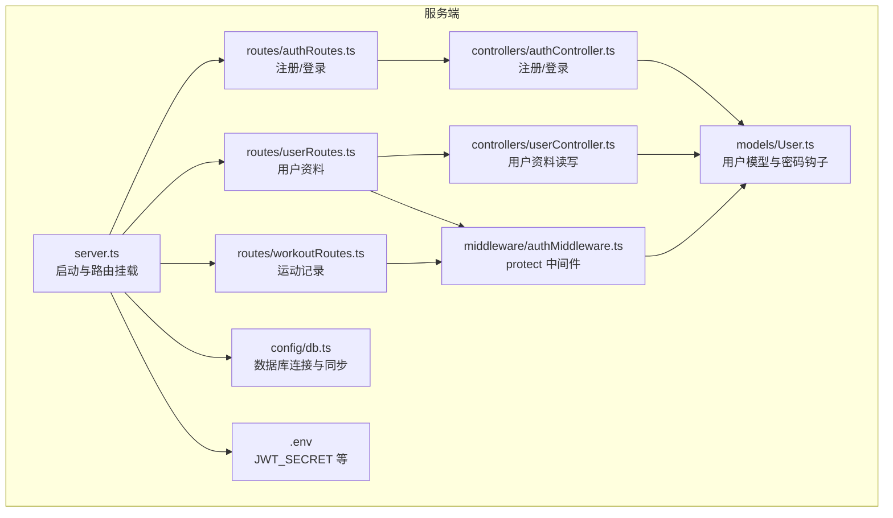
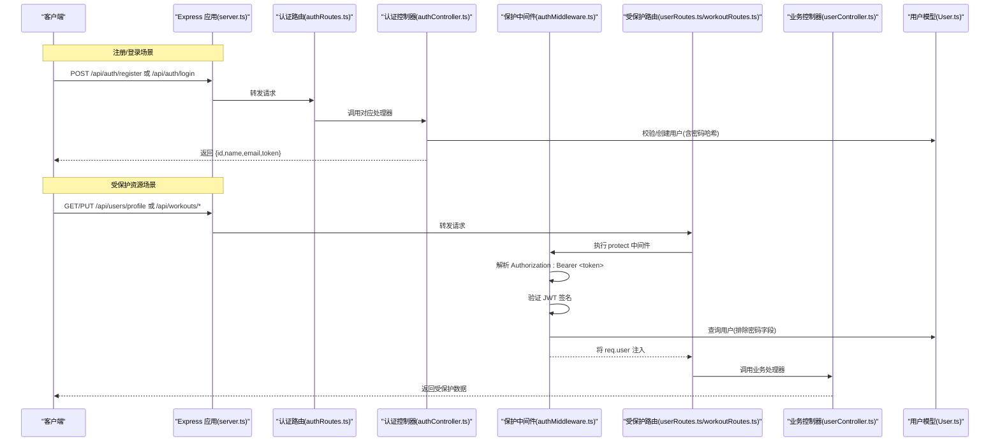
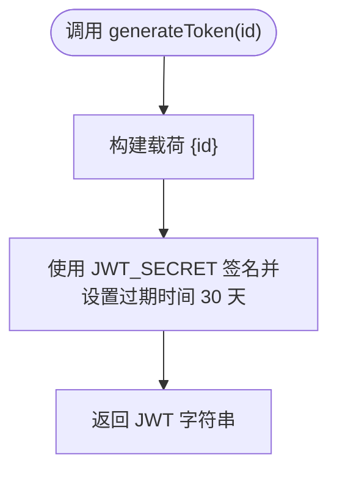
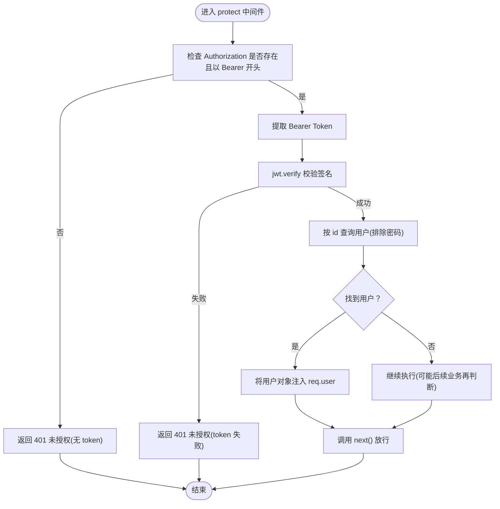
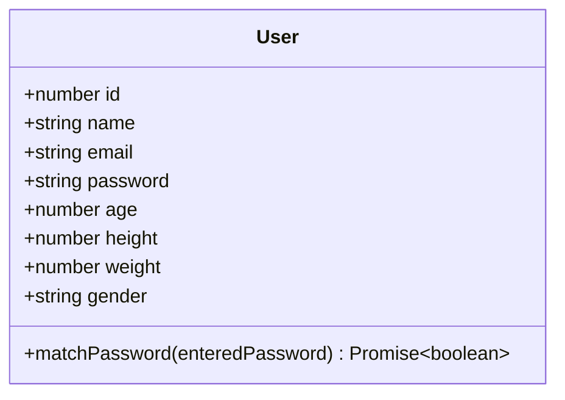
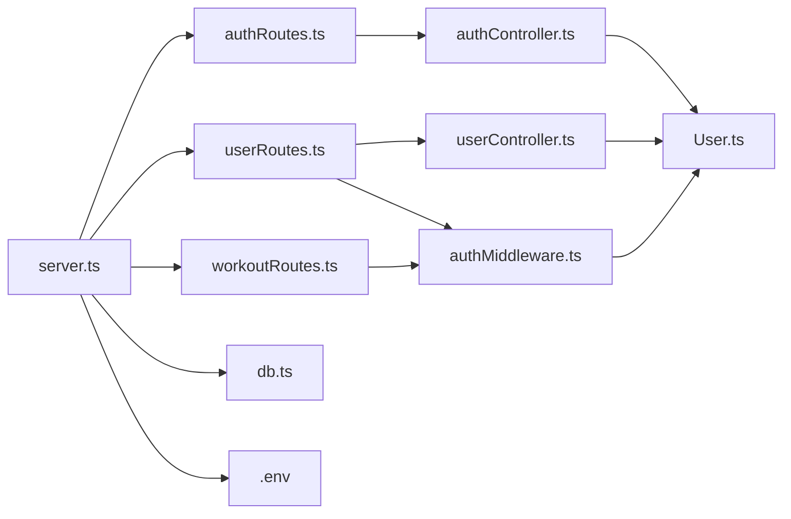

# 认证流程

<cite>
**本文引用的文件**
- [backend/src/controllers/authController.ts](file://backend/src/controllers/authController.ts)
- [backend/src/middleware/authMiddleware.ts](file://backend/src/middleware/authMiddleware.ts)
- [backend/src/models/User.ts](file://backend/src/models/User.ts)
- [backend/src/routes/authRoutes.ts](file://backend/src/routes/authRoutes.ts)
- [backend/src/routes/userRoutes.ts](file://backend/src/routes/userRoutes.ts)
- [backend/src/routes/workoutRoutes.ts](file://backend/src/routes/workoutRoutes.ts)
- [backend/src/server.ts](file://backend/src/server.ts)
- [backend/src/config/db.ts](file://backend/src/config/db.ts)
- [backend/.env](file://backend/.env)
- [docs/4. API接口文档.md](file://docs/4. API接口文档.md)
</cite>

## 目录
1. [简介](#简介)
2. [项目结构](#项目结构)
3. [核心组件](#核心组件)
4. [架构总览](#架构总览)
5. [详细组件分析](#详细组件分析)
6. [依赖关系分析](#依赖关系分析)
7. [性能与安全考量](#性能与安全考量)
8. [故障排查指南](#故障排查指南)
9. [结论](#结论)

## 简介
本文件围绕基于 JWT 的认证流程进行深入解析，覆盖用户注册、登录以及“保护中间件”对请求进行身份验证并把用户信息注入到请求对象中的完整实现。文档重点说明：
- generateToken 函数如何生成 JWT 令牌（包含密钥来源与过期策略）
- protect 中间件如何从请求头中提取 Bearer Token 并校验其有效性，随后将用户信息附加到请求对象
- 密码哈希处理（bcrypt）与模型钩子
- 令牌过期策略与安全最佳实践
- 在不同 API 端点中的应用方式与常见安全漏洞的防范

## 项目结构
后端采用 Express + TypeScript + Sequelize 构建，认证相关代码分布在以下模块：
- 控制器：处理注册与登录业务逻辑
- 中间件：统一鉴权保护
- 模型：用户实体及密码哈希钩子
- 路由：暴露认证与受保护资源端点
- 服务器入口：加载环境变量、连接数据库、挂载路由
- 配置：数据库连接与同步
- 环境变量：JWT 密钥与数据库凭据
- 文档：API 使用说明（含请求头 Authorization: Bearer）

图表来源
- [backend/src/server.ts](file://backend/src/server.ts#L1-L36)
- [backend/src/config/db.ts](file://backend/src/config/db.ts#L1-L41)
- [backend/src/routes/authRoutes.ts](file://backend/src/routes/authRoutes.ts#L1-L9)
- [backend/src/routes/userRoutes.ts](file://backend/src/routes/userRoutes.ts#L1-L11)
- [backend/src/routes/workoutRoutes.ts](file://backend/src/routes/workoutRoutes.ts#L1-L22)
- [backend/src/controllers/authController.ts](file://backend/src/controllers/authController.ts#L1-L71)
- [backend/src/controllers/userController.ts](file://backend/src/controllers/userController.ts#L1-L60)
- [backend/src/middleware/authMiddleware.ts](file://backend/src/middleware/authMiddleware.ts#L1-L36)
- [backend/src/models/User.ts](file://backend/src/models/User.ts#L1-L119)
- [backend/.env](file://backend/.env#L1-L10)

章节来源
- [backend/src/server.ts](file://backend/src/server.ts#L1-L36)
- [backend/src/config/db.ts](file://backend/src/config/db.ts#L1-L41)
- [backend/src/routes/authRoutes.ts](file://backend/src/routes/authRoutes.ts#L1-L9)
- [backend/src/routes/userRoutes.ts](file://backend/src/routes/userRoutes.ts#L1-L11)
- [backend/src/routes/workoutRoutes.ts](file://backend/src/routes/workoutRoutes.ts#L1-L22)
- [backend/.env](file://backend/.env#L1-L10)

## 核心组件
- 注册与登录控制器
  - 提供注册与登录两个端点，均返回包含用户信息与 JWT 令牌的响应
  - 注册成功或登录成功后，通过 generateToken 生成令牌
- 保护中间件
  - 从 Authorization 请求头提取 Bearer Token
  - 使用 JWT 密钥校验签名，解码出用户标识
  - 查询用户并把用户对象注入到 req.user，供后续处理器使用
- 用户模型与密码处理
  - 使用 bcrypt 对密码进行哈希存储
  - 提供 matchPassword 实例方法用于明文比对
- 路由与服务器
  - 将认证路由与受保护资源路由挂载至 /api/* 前缀
  - 通过 protect 中间件为多个端点提供统一鉴权

章节来源
- [backend/src/controllers/authController.ts](file://backend/src/controllers/authController.ts#L1-L71)
- [backend/src/middleware/authMiddleware.ts](file://backend/src/middleware/authMiddleware.ts#L1-L36)
- [backend/src/models/User.ts](file://backend/src/models/User.ts#L1-L119)
- [backend/src/routes/authRoutes.ts](file://backend/src/routes/authRoutes.ts#L1-L9)
- [backend/src/routes/userRoutes.ts](file://backend/src/routes/userRoutes.ts#L1-L11)
- [backend/src/routes/workoutRoutes.ts](file://backend/src/routes/workoutRoutes.ts#L1-L22)
- [backend/src/server.ts](file://backend/src/server.ts#L1-L36)

## 架构总览
下图展示了从客户端发起请求到服务端完成鉴权与业务处理的整体流程，包括注册、登录与受保护资源访问三个主场景。

图表来源
- [backend/src/server.ts](file://backend/src/server.ts#L1-L36)
- [backend/src/routes/authRoutes.ts](file://backend/src/routes/authRoutes.ts#L1-L9)
- [backend/src/controllers/authController.ts](file://backend/src/controllers/authController.ts#L1-L71)
- [backend/src/middleware/authMiddleware.ts](file://backend/src/middleware/authMiddleware.ts#L1-L36)
- [backend/src/routes/userRoutes.ts](file://backend/src/routes/userRoutes.ts#L1-L11)
- [backend/src/routes/workoutRoutes.ts](file://backend/src/routes/workoutRoutes.ts#L1-L22)
- [backend/src/controllers/userController.ts](file://backend/src/controllers/userController.ts#L1-L60)
- [backend/src/models/User.ts](file://backend/src/models/User.ts#L1-L119)

## 详细组件分析

### 生成 JWT 令牌：generateToken
- 作用：根据用户标识生成 JWT 令牌
- 密钥来源：从环境变量读取 JWT_SECRET；若未设置则使用回退密钥（开发用途）
- 过期策略：令牌有效期为 30 天
- 输出：字符串形式的 JWT

图表来源
- [backend/src/controllers/authController.ts](file://backend/src/controllers/authController.ts#L1-L10)
- [backend/.env](file://backend/.env#L1-L10)

章节来源
- [backend/src/controllers/authController.ts](file://backend/src/controllers/authController.ts#L1-L10)
- [backend/.env](file://backend/.env#L1-L10)

### 保护中间件：protect
- 请求头解析：仅当 Authorization 以 Bearer 开头时才尝试解析
- 令牌校验：使用 JWT_SECRET 验证签名，失败则返回未授权
- 用户查询：解码出用户标识后查询用户，排除密码字段
- 注入请求对象：将用户对象赋值给 req.user，供后续处理器使用
- 无令牌处理：若请求头缺失或格式不正确，直接返回未授权

图表来源
- [backend/src/middleware/authMiddleware.ts](file://backend/src/middleware/authMiddleware.ts#L1-L36)
- [backend/src/models/User.ts](file://backend/src/models/User.ts#L1-L119)

章节来源
- [backend/src/middleware/authMiddleware.ts](file://backend/src/middleware/authMiddleware.ts#L1-L36)
- [backend/src/models/User.ts](file://backend/src/models/User.ts#L1-L119)

### 密码哈希处理与模型钩子
- 存储前哈希：beforeCreate 与 beforeUpdate 钩子在保存用户前对密码进行加盐哈希
- 明文比对：matchPassword 实例方法使用 bcrypt.compare 进行明文与哈希的比对
- 安全性：避免明文存储密码，降低泄露风险

图表来源
- [backend/src/models/User.ts](file://backend/src/models/User.ts#L1-L119)

章节来源
- [backend/src/models/User.ts](file://backend/src/models/User.ts#L1-L119)

### 认证端点与受保护资源
- 认证端点
  - 注册：POST /api/auth/register
  - 登录：POST /api/auth/login
- 受保护资源
  - 用户资料：GET/PUT /api/users/profile
  - 运动记录：GET/POST/GET/PUT/DELETE /api/workouts[/id]
- 请求头规范
  - Authorization: Bearer <token>

章节来源
- [docs/4. API接口文档.md](file://docs/4. API接口文档.md#L1-L275)
- [backend/src/routes/authRoutes.ts](file://backend/src/routes/authRoutes.ts#L1-L9)
- [backend/src/routes/userRoutes.ts](file://backend/src/routes/userRoutes.ts#L1-L11)
- [backend/src/routes/workoutRoutes.ts](file://backend/src/routes/workoutRoutes.ts#L1-L22)

## 依赖关系分析
- 控制器依赖模型：注册/登录控制器在创建与校验用户时依赖 User 模型
- 中间件依赖模型：protect 中间件在验证令牌后查询用户
- 路由依赖控制器与中间件：认证路由直接调用控制器；受保护路由在处理器前先执行 protect
- 服务器依赖路由与配置：server.ts 加载 .env、连接数据库并挂载路由
- 环境变量依赖：JWT_SECRET 用于签发与校验 JWT

图表来源
- [backend/src/controllers/authController.ts](file://backend/src/controllers/authController.ts#L1-L71)
- [backend/src/controllers/userController.ts](file://backend/src/controllers/userController.ts#L1-L60)
- [backend/src/middleware/authMiddleware.ts](file://backend/src/middleware/authMiddleware.ts#L1-L36)
- [backend/src/models/User.ts](file://backend/src/models/User.ts#L1-L119)
- [backend/src/routes/authRoutes.ts](file://backend/src/routes/authRoutes.ts#L1-L9)
- [backend/src/routes/userRoutes.ts](file://backend/src/routes/userRoutes.ts#L1-L11)
- [backend/src/routes/workoutRoutes.ts](file://backend/src/routes/workoutRoutes.ts#L1-L22)
- [backend/src/server.ts](file://backend/src/server.ts#L1-L36)
- [backend/src/config/db.ts](file://backend/src/config/db.ts#L1-L41)
- [backend/.env](file://backend/.env#L1-L10)

章节来源
- [backend/src/server.ts](file://backend/src/server.ts#L1-L36)
- [backend/src/config/db.ts](file://backend/src/config/db.ts#L1-L41)
- [backend/src/controllers/authController.ts](file://backend/src/controllers/authController.ts#L1-L71)
- [backend/src/controllers/userController.ts](file://backend/src/controllers/userController.ts#L1-L60)
- [backend/src/middleware/authMiddleware.ts](file://backend/src/middleware/authMiddleware.ts#L1-L36)
- [backend/src/models/User.ts](file://backend/src/models/User.ts#L1-L119)
- [backend/src/routes/authRoutes.ts](file://backend/src/routes/authRoutes.ts#L1-L9)
- [backend/src/routes/userRoutes.ts](file://backend/src/routes/userRoutes.ts#L1-L11)
- [backend/src/routes/workoutRoutes.ts](file://backend/src/routes/workoutRoutes.ts#L1-L22)
- [backend/.env](file://backend/.env#L1-L10)

## 性能与安全考量
- 令牌过期策略
  - 当前策略：30 天；建议结合刷新令牌机制，缩短访问令牌有效期并使用短期令牌，配合刷新令牌轮换
- 密钥管理
  - JWT_SECRET 来自环境变量；生产环境务必确保密钥安全存储与轮换
- 密码安全
  - 使用 bcrypt 进行加盐哈希；避免明文存储；建议限制密码复杂度与历史密码重用
- 中间件健壮性
  - protect 中间件已处理缺失 token 与签名失败两种异常路径；可进一步增加 IP 白名单、速率限制等
- 数据传输安全
  - 建议强制 HTTPS，防止令牌在传输过程中被窃取
- 令牌撤销与黑名单
  - 当前未实现黑名单；如需即时撤销，可在数据库维护黑名单或引入短周期令牌+刷新令牌
- 错误信息最小化
  - 登录失败返回通用错误，避免泄露账户是否存在等敏感信息

[本节为通用指导，不直接分析具体文件]

## 故障排查指南
- 401 未授权（无 token）
  - 现象：请求头未携带 Authorization 或格式非 Bearer
  - 排查：确认请求头是否为 Authorization: Bearer <token>
  - 参考路径：[backend/src/middleware/authMiddleware.ts](file://backend/src/middleware/authMiddleware.ts#L1-L36)
- 401 未授权（token 失败）
  - 现象：令牌签名无效或过期
  - 排查：确认 JWT_SECRET 一致、令牌未过期、未被篡改
  - 参考路径：[backend/src/middleware/authMiddleware.ts](file://backend/src/middleware/authMiddleware.ts#L1-L36)
- 登录失败
  - 现象：邮箱或密码错误
  - 排查：确认用户存在、密码匹配（bcrypt 比对）
  - 参考路径：[backend/src/controllers/authController.ts](file://backend/src/controllers/authController.ts#L48-L71)
- 注册失败
  - 现象：用户已存在或提交数据无效
  - 排查：检查邮箱唯一性、必填字段与长度约束
  - 参考路径：[backend/src/controllers/authController.ts](file://backend/src/controllers/authController.ts#L12-L47)
- 密码未正确哈希
  - 现象：登录时报错或无法匹配
  - 排查：确认 beforeCreate/beforeUpdate 钩子生效、bcrypt 版本兼容
  - 参考路径：[backend/src/models/User.ts](file://backend/src/models/User.ts#L100-L117)

章节来源
- [backend/src/middleware/authMiddleware.ts](file://backend/src/middleware/authMiddleware.ts#L1-L36)
- [backend/src/controllers/authController.ts](file://backend/src/controllers/authController.ts#L12-L71)
- [backend/src/models/User.ts](file://backend/src/models/User.ts#L100-L117)

## 结论
该认证体系以 JWT 为核心，结合 bcrypt 密码哈希与统一的保护中间件，实现了从注册/登录到受保护资源访问的闭环。generateToken 提供了明确的令牌生成与过期策略，protect 中间件负责令牌解析与用户注入。建议在生产环境中进一步完善密钥轮换、令牌刷新、黑名单与传输加密等安全措施，以提升整体安全性与可运维性。