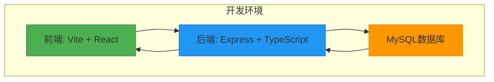
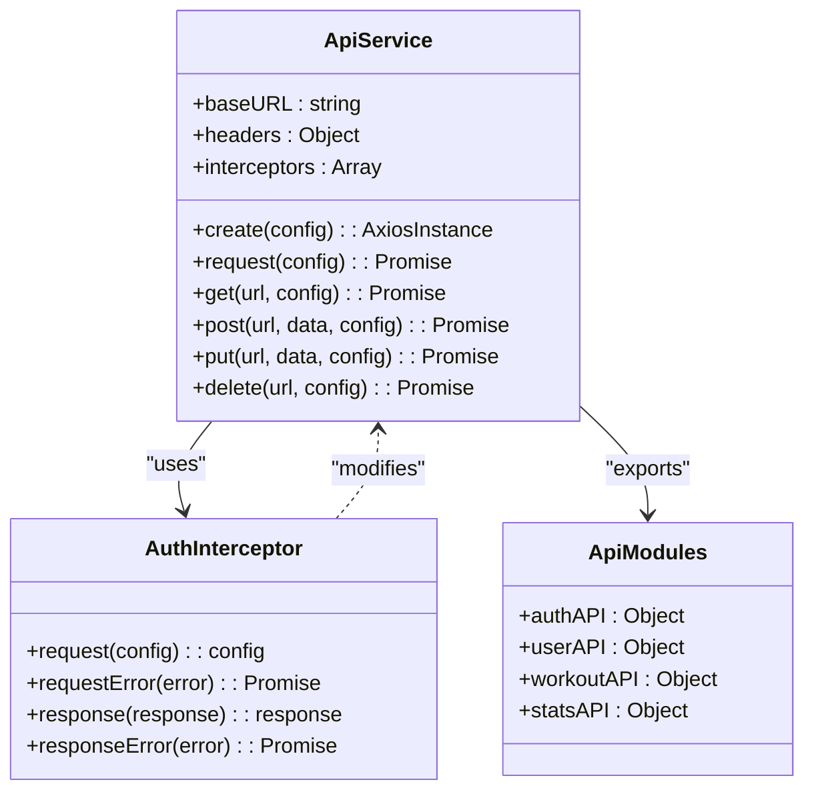
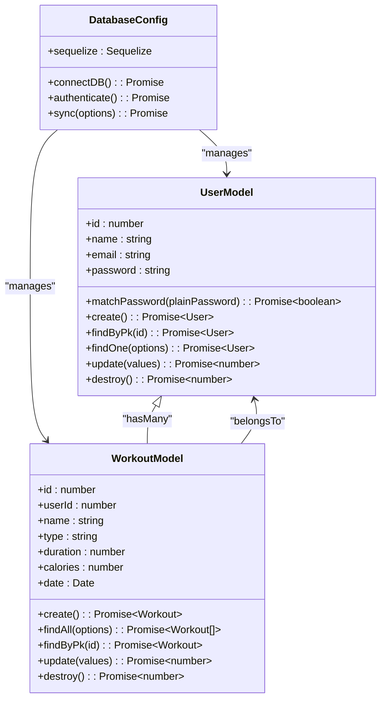
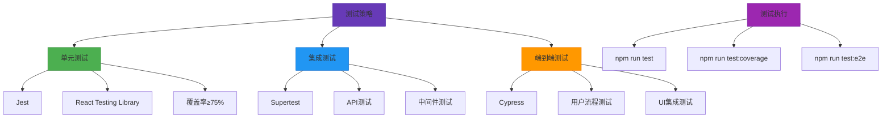
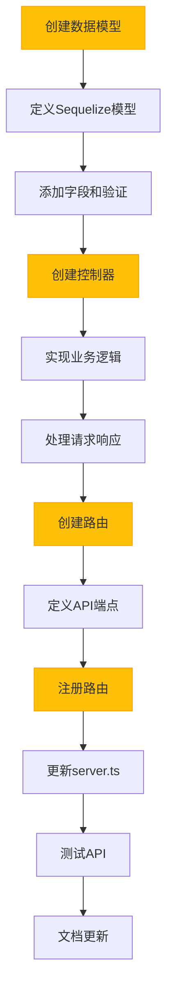
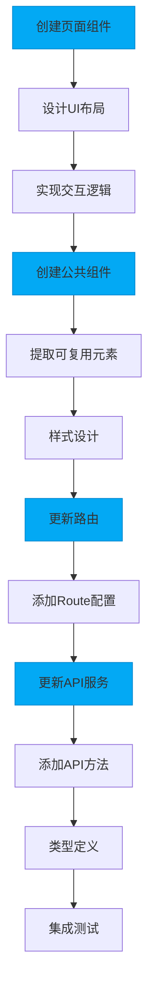
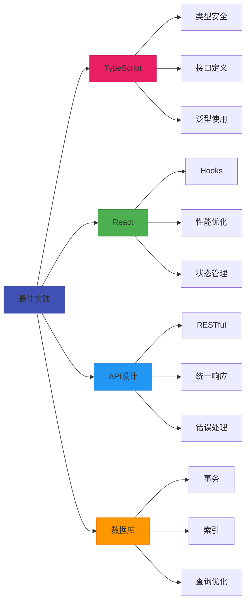
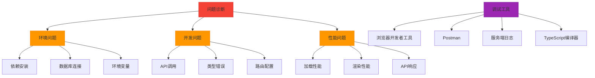

# 开发指南

<cite>
**本文档中引用的文件**  
- [README.md](file://README.md)
- [docs/6. 开发指南.md](file://docs/6. 开发指南.md)
- [docs/7. 测试说明.md](file://docs/7. 测试说明.md)
- [frontend/package.json](file://frontend/package.json)
- [backend/package.json](file://backend/package.json)
- [frontend/src/services/api.ts](file://frontend/src/services/api.ts)
- [backend/src/server.ts](file://backend/src/server.ts)
- [frontend/src/App.tsx](file://frontend/src/App.tsx)
- [backend/src/config/db.ts](file://backend/src/config/db.ts)
- [frontend/vite.config.ts](file://frontend/vite.config.ts)
- [backend/tsconfig.json](file://backend/tsconfig.json)
- [frontend/tsconfig.json](file://frontend/tsconfig.json)
- [backend/src/controllers/authController.ts](file://backend/src/controllers/authController.ts)
- [backend/src/routes/authRoutes.ts](file://backend/src/routes/authRoutes.ts)
- [backend/src/middleware/authMiddleware.ts](file://backend/src/middleware/authMiddleware.ts)
- [mysql/init.sql](file://mysql/init.sql)
</cite>

## 目录

1. [开发流程](#开发流程)
2. [环境搭建](#环境搭建)
3. [代码规范](#代码规范)
4. [测试策略](#测试策略)
5. [新功能开发流程](#新功能开发流程)
6. [最佳实践](#最佳实践)
7. [常见问题与调试](#常见问题与调试)

## 开发流程

本项目采用前后端分离的开发模式，使用TypeScript构建类型安全的应用。开发流程从环境配置开始，经过功能开发、测试验证，最终部署上线。整个流程强调代码质量、类型安全和自动化测试。

**Section sources**
- [README.md](file://README.md#L1-L282)
- [docs/6. 开发指南.md](file://docs/6. 开发指南.md#L1-L319)

## 环境搭建

### 前端开发环境配置

前端使用Vite作为构建工具，React + TypeScript作为开发框架。首先安装Node.js依赖：

```bash
cd frontend
npm install
```

启动开发服务器：
```bash
npm run dev
```

前端应用将在 `http://localhost:3000` 启动，Vite提供了快速的热重载功能。

### 后端开发环境配置

后端使用Express + TypeScript构建RESTful API。安装依赖并启动服务：

```bash
cd backend
npm install
npm run dev
```

后端API将在 `http://localhost:3001` 启动，使用nodemon实现热重载。

### 环境变量配置

在 `backend/.env` 文件中配置数据库连接和JWT密钥：

```env
NODE_ENV=development
PORT=3001
JWT_SECRET=your_jwt_secret_key
MYSQL_HOST=localhost
MYSQL_PORT=3306
MYSQL_USER=your_mysql_user
MYSQL_PASSWORD=your_mysql_password
MYSQL_DATABASE=fitnessTracker
```

### Docker化开发环境

项目提供Docker Compose配置，可一键启动完整开发环境：

```bash
# 启动开发环境
docker-compose -f deployments/docker-compose.dev.yml up -d

# 查看服务状态
docker-compose -f deployments/docker-compose.dev.yml ps
```



**Diagram sources**
- [frontend/package.json](file://frontend/package.json#L1-L32)
- [backend/package.json](file://backend/package.json#L1-L35)
- [vite.config.ts](file://frontend/vite.config.ts#L1-L13)
- [server.ts](file://backend/src/server.ts#L1-L36)

**Section sources**
- [README.md](file://README.md#L191-L208)
- [docs/6. 开发指南.md](file://docs/6. 开发指南.md#L67-L98)
- [backend/.env](file://backend/.env)

## 代码规范

### TypeScript类型定义

项目全面采用TypeScript进行类型检查，确保代码的类型安全。类型定义遵循以下原则：

- 为所有函数参数和返回值定义明确的类型
- 使用接口（interface）定义复杂对象结构
- 使用类型别名（type）定义联合类型和字面量类型
- 利用泛型提高代码复用性

### React组件开发规范

React组件开发遵循以下最佳实践：

- 使用函数组件和Hooks替代类组件
- 保持组件职责单一，避免过大组件
- 合理使用useState、useEffect、useContext等Hooks
- 使用React Router进行路由管理
- 通过props传递数据，保持组件可复用性

### API服务封装

前端API服务通过Axios进行封装，实现统一的请求处理：



**Diagram sources**
- [frontend/src/services/api.ts](file://frontend/src/services/api.ts#L1-L61)
- [frontend/src/App.tsx](file://frontend/src/App.tsx#L1-L48)

**Section sources**
- [docs/6. 开发指南.md](file://docs/6. 开发指南.md#L135-L149)
- [frontend/tsconfig.json](file://frontend/tsconfig.json#L1-L21)

### 数据库操作规范

后端使用Sequelize作为ORM框架操作MySQL数据库，遵循以下规范：

- 在 `models/` 目录下定义数据模型
- 使用Sequelize的Model类定义表结构和关系
- 通过实例方法和类方法封装业务逻辑
- 使用迁移（migration）管理数据库结构变更



**Diagram sources**
- [backend/src/config/db.ts](file://backend/src/config/db.ts#L1-L41)
- [backend/src/models/User.ts](file://backend/src/models/User.ts)
- [backend/src/models/Workout.ts](file://backend/src/models/Workout.ts)

**Section sources**
- [docs/6. 开发指南.md](file://docs/6. 开发指南.md#L156-L212)
- [mysql/init.sql](file://mysql/init.sql)

## 测试策略

项目采用分层测试策略，确保代码质量和功能正确性。

### 单元测试

- 前端使用Jest + React Testing Library测试组件
- 后端使用Jest测试模型和工具函数
- 测试覆盖率目标：前端≥75%，后端≥85%

### 集成测试

- 测试模块间的交互和数据流
- 使用Supertest测试API路由和控制器
- 验证中间件的正确应用

### 端到端测试

- 使用Cypress模拟用户操作流程
- 测试关键用户路径：注册、登录、数据记录
- 验证UI与后端的集成



**Diagram sources**
- [docs/7. 测试说明.md](file://docs/7. 测试说明.md#L1-L267)
- [backend/package.json](file://backend/package.json#L1-L35)
- [frontend/package.json](file://frontend/package.json#L1-L32)

**Section sources**
- [docs/7. 测试说明.md](file://docs/7. 测试说明.md#L1-L267)
- [tests/test-api.js](file://tests/test-api.js)

## 新功能开发流程

### 后端开发流程

1. **创建数据模型**
   - 在 `backend/src/models/` 目录下创建新的模型文件
   - 使用Sequelize定义表结构和验证规则

2. **创建控制器**
   - 在 `backend/src/controllers/` 目录下创建控制器
   - 实现业务逻辑和数据处理

3. **添加API路由**
   - 在 `backend/src/routes/` 目录下创建路由文件
   - 定义RESTful端点和请求处理

4. **注册路由**
   - 在 `backend/src/server.ts` 中导入并注册新路由



**Diagram sources**
- [backend/src/models/User.ts](file://backend/src/models/User.ts)
- [backend/src/controllers/authController.ts](file://backend/src/controllers/authController.ts)
- [backend/src/routes/authRoutes.ts](file://backend/src/routes/authRoutes.ts)
- [backend/src/server.ts](file://backend/src/server.ts#L1-L36)

**Section sources**
- [docs/6. 开发指南.md](file://docs/6. 开发指南.md#L100-L118)

### 前端开发流程

1. **创建页面组件**
   - 在 `frontend/src/pages/` 目录下创建新页面
   - 实现UI布局和交互逻辑

2. **创建公共组件**
   - 在 `frontend/src/components/` 目录下创建可复用组件
   - 保持组件职责单一

3. **更新路由配置**
   - 在 `frontend/src/App.tsx` 中添加新路由

4. **更新API服务**
   - 在 `frontend/src/services/api.ts` 中添加API方法



**Diagram sources**
- [frontend/src/pages/Login.tsx](file://frontend/src/pages/Login.tsx)
- [frontend/src/components/Navbar.tsx](file://frontend/src/components/Navbar.tsx)
- [frontend/src/App.tsx](file://frontend/src/App.tsx#L1-L48)
- [frontend/src/services/api.ts](file://frontend/src/services/api.ts#L1-L61)

**Section sources**
- [docs/6. 开发指南.md](file://docs/6. 开发指南.md#L119-L133)

## 最佳实践

### TypeScript最佳实践

- 使用接口定义API响应和请求体类型
- 为组件props定义明确的接口
- 利用泛型创建可复用的工具函数
- 使用联合类型处理多种状态

### React开发最佳实践

- 使用自定义Hooks提取公共逻辑
- 合理使用useMemo和useCallback优化性能
- 使用Context API管理全局状态
- 遵循响应式设计原则

### API设计最佳实践

- 遵循RESTful设计原则
- 使用一致的响应格式
- 实现统一的错误处理机制
- 添加适当的HTTP状态码

### 数据库操作最佳实践

- 使用事务处理复杂操作
- 合理使用索引优化查询性能
- 避免N+1查询问题
- 实现软删除而非硬删除



**Diagram sources**
- [frontend/tsconfig.json](file://frontend/tsconfig.json#L1-L21)
- [backend/tsconfig.json](file://backend/tsconfig.json#L1-L19)
- [backend/src/middleware/authMiddleware.ts](file://backend/src/middleware/authMiddleware.ts#L1-L36)

**Section sources**
- [docs/6. 开发指南.md](file://docs/6. 开发指南.md#L135-L155)

## 常见问题与调试

### 环境问题

**依赖安装失败**
- 清除npm缓存：`npm cache clean --force`
- 删除node_modules和package-lock.json后重新安装
- 检查网络代理设置

**数据库连接失败**
- 验证 `.env` 文件中的数据库配置
- 确认MySQL服务正在运行
- 检查数据库用户权限和防火墙设置

### 开发问题

**API调用失败**
- 确认后端服务正在运行
- 检查API端点URL是否正确
- 查看浏览器开发者工具中的网络请求

**类型错误**
- 检查TypeScript接口定义是否匹配
- 验证API响应数据结构
- 使用类型断言谨慎处理动态数据

### 调试技巧

- 使用浏览器开发者工具检查网络请求和响应
- 在关键位置添加console.log进行调试
- 使用Postman测试API端点
- 查看服务端日志定位错误



**Diagram sources**
- [docs/6. 开发指南.md](file://docs/6. 开发指南.md#L300-L319)
- [docs/7. 测试说明.md](file://docs/7. 测试说明.md#L235-L251)

**Section sources**
- [docs/6. 开发指南.md](file://docs/6. 开发指南.md#L300-L319)
- [README.md](file://README.md#L300-L319)