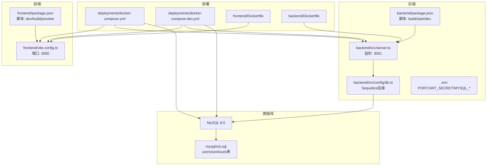
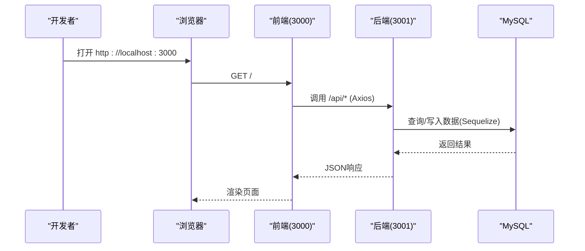
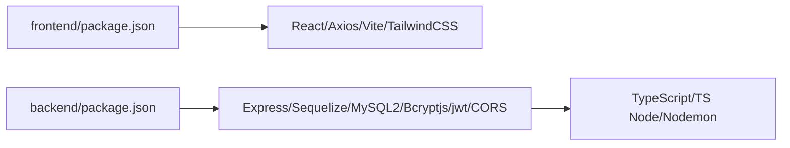

# 快速开始

<cite>
**本文引用的文件**
- [README.md](file://README.md)
- [docs/2. 快速开始.md](file://docs/2. 快速开始.md)
- [backend/.env](file://backend/.env)
- [backend/package.json](file://backend/package.json)
- [frontend/package.json](file://frontend/package.json)
- [backend/src/config/db.ts](file://backend/src/config/db.ts)
- [backend/src/server.ts](file://backend/src/server.ts)
- [frontend/vite.config.ts](file://frontend/vite.config.ts)
- [deployments/docker-compose.yml](file://deployments/docker-compose.yml)
- [deployments/docker-compose.dev.yml](file://deployments/docker-compose.dev.yml)
- [backend/Dockerfile](file://backend/Dockerfile)
- [frontend/Dockerfile](file://frontend/Dockerfile)
- [mysql/init.sql](file://mysql/init.sql)
</cite>

## 目录
1. [简介](#简介)
2. [项目结构](#项目结构)
3. [核心组件](#核心组件)
4. [架构总览](#架构总览)
5. [详细组件分析](#详细组件分析)
6. [依赖关系分析](#依赖关系分析)
7. [性能与并发特性](#性能与并发特性)
8. [故障排查指南](#故障排查指南)
9. [结论](#结论)
10. [附录](#附录)

## 简介
本节为“快速开始”指南，目标是在10分钟内完成环境准备、项目克隆、依赖安装与本地开发服务器启动，并掌握Docker与传统部署两种方式。你将学会：
- 如何准备Node.js与Docker环境
- 如何克隆仓库并安装前后端依赖
- 如何启动本地开发服务器（前端3000端口、后端3001端口）
- 如何通过Docker Compose一键部署（生产与开发模式）
- 如何配置环境变量与常见问题排查（端口冲突、数据库连接失败等）

## 项目结构
该工程采用前后端分离架构，包含：
- 前端：React + TypeScript + Vite，运行于3000端口
- 后端：Node.js + Express + TypeScript + Sequelize，运行于3001端口
- 数据库：MySQL 8.0，初始化脚本位于mysql/init.sql
- 部署：Docker Compose（生产与开发两套配置）

图示来源
- [frontend/package.json](file://frontend/package.json#L1-L32)
- [frontend/vite.config.ts](file://frontend/vite.config.ts#L1-L13)
- [backend/package.json](file://backend/package.json#L1-L35)
- [backend/src/server.ts](file://backend/src/server.ts#L1-L36)
- [backend/src/config/db.ts](file://backend/src/config/db.ts#L1-L41)
- [deployments/docker-compose.yml](file://deployments/docker-compose.yml#L1-L51)
- [deployments/docker-compose.dev.yml](file://deployments/docker-compose.dev.yml#L1-L56)
- [frontend/Dockerfile](file://frontend/Dockerfile#L1-L26)
- [backend/Dockerfile](file://backend/Dockerfile#L1-L23)
- [mysql/init.sql](file://mysql/init.sql#L1-L41)

章节来源
- [README.md](file://README.md#L192-L208)
- [docs/2. 快速开始.md](file://docs/2. 快速开始.md#L30-L47)

## 核心组件
- 前端开发服务器：Vite，默认监听3000端口；提供开发脚本与构建脚本。
- 后端开发服务器：Express，默认监听3001端口；通过dotenv加载环境变量，连接MySQL并通过Sequelize同步模型。
- 数据库：MySQL 8.0，初始化脚本创建users与workouts表并建立索引。
- 部署：Docker Compose提供生产与开发两套编排，分别映射3000/3001端口并挂载源码卷（开发模式）。

章节来源
- [frontend/package.json](file://frontend/package.json#L1-L32)
- [frontend/vite.config.ts](file://frontend/vite.config.ts#L1-L13)
- [backend/package.json](file://backend/package.json#L1-L35)
- [backend/src/server.ts](file://backend/src/server.ts#L1-L36)
- [backend/src/config/db.ts](file://backend/src/config/db.ts#L1-L41)
- [mysql/init.sql](file://mysql/init.sql#L1-L41)
- [deployments/docker-compose.yml](file://deployments/docker-compose.yml#L1-L51)
- [deployments/docker-compose.dev.yml](file://deployments/docker-compose.dev.yml#L1-L56)

## 架构总览
下图展示了本地开发与Docker部署两种场景下的请求流向与端口映射。

图示来源
- [frontend/vite.config.ts](file://frontend/vite.config.ts#L1-L13)
- [backend/src/server.ts](file://backend/src/server.ts#L1-L36)
- [backend/src/config/db.ts](file://backend/src/config/db.ts#L1-L41)

## 详细组件分析

### 环境准备与项目克隆
- 环境要求
  - Node.js >= 14.x（用于本地开发）
  - Docker 与 Docker Compose（推荐，便于一键部署）
  - MySQL 8.0（若不使用Docker，需自行安装并准备数据库）
- 克隆仓库
  - 使用Git克隆项目到本地，进入根目录执行后续步骤

章节来源
- [docs/2. 快速开始.md](file://docs/2. 快速开始.md#L5-L10)
- [README.md](file://README.md#L52-L61)

### 依赖安装
- 前端依赖安装
  - 进入frontend目录，执行依赖安装脚本
- 后端依赖安装
  - 进入backend目录，执行依赖安装脚本

章节来源
- [docs/2. 快速开始.md](file://docs/2. 快速开始.md#L18-L29)
- [frontend/package.json](file://frontend/package.json#L1-L32)
- [backend/package.json](file://backend/package.json#L1-L35)

### 本地开发服务器启动
- 启动前端开发服务器
  - 进入frontend目录，执行开发脚本，浏览器访问 http://localhost:3000
- 启动后端开发服务器
  - 进入backend目录，执行开发脚本，后端监听 http://localhost:3001
- 默认端口说明
  - 前端：3000
  - 后端：3001

章节来源
- [docs/2. 快速开始.md](file://docs/2. 快速开始.md#L32-L47)
- [frontend/vite.config.ts](file://frontend/vite.config.ts#L1-L13)
- [backend/src/server.ts](file://backend/src/server.ts#L1-L36)

### Docker化部署（生产与开发）
- 生产环境部署
  - 使用主docker-compose文件，构建并后台启动所有服务
  - 端口映射：3000（前端）、3001（后端）
- 开发环境部署
  - 使用开发compose文件，启用热更新与源码挂载
  - 端口映射：3000（前端）、3001（后端）
- 单独构建与运行
  - 可单独构建前端/后端镜像并运行MySQL容器，便于调试与自定义

章节来源
- [docs/2. 快速开始.md](file://docs/2. 快速开始.md#L64-L94)
- [README.md](file://README.md#L75-L105)
- [deployments/docker-compose.yml](file://deployments/docker-compose.yml#L1-L51)
- [deployments/docker-compose.dev.yml](file://deployments/docker-compose.dev.yml#L1-L56)
- [backend/Dockerfile](file://backend/Dockerfile#L1-L23)
- [frontend/Dockerfile](file://frontend/Dockerfile#L1-L26)

### 环境变量配置
- 后端环境变量
  - 包含运行环境、端口、JWT密钥以及MySQL连接参数
- 前端开发端口
  - Vite默认端口为3000，可通过配置文件调整

章节来源
- [backend/.env](file://backend/.env#L1-L10)
- [backend/src/server.ts](file://backend/src/server.ts#L1-L36)
- [frontend/vite.config.ts](file://frontend/vite.config.ts#L1-L13)

### 数据库初始化与连接
- 初始化脚本
  - 创建数据库与表（users、workouts），并建立常用索引
- 连接与同步
  - 后端通过Sequelize读取环境变量连接MySQL，并尝试同步模型

章节来源
- [mysql/init.sql](file://mysql/init.sql#L1-L41)
- [backend/src/config/db.ts](file://backend/src/config/db.ts#L1-L41)

### API接口验证
- 访问根路径
  - 浏览器访问后端根路径，确认服务正常
- 注册与登录
  - 使用curl或Postman调用认证接口，验证JWT流程

章节来源
- [docs/2. 快速开始.md](file://docs/2. 快速开始.md#L96-L118)
- [README.md](file://README.md#L133-L153)

## 依赖关系分析
- 前端依赖
  - React、React Router、Axios、Vite、TailwindCSS等
- 后端依赖
  - Express、Sequelize、MySQL2、Bcryptjs、jsonwebtoken、CORS等
- 开发依赖
  - TypeScript、ts-node、nodemon、@vitejs/plugin-react等

图示来源
- [frontend/package.json](file://frontend/package.json#L1-L32)
- [backend/package.json](file://backend/package.json#L1-L35)

章节来源
- [frontend/package.json](file://frontend/package.json#L1-L32)
- [backend/package.json](file://backend/package.json#L1-L35)

## 性能与并发特性
- 数据库连接池
  - Sequelize配置了最大连接数、最小空闲连接、获取超时等参数，有助于提升并发稳定性
- 开发模式优化
  - nodemon自动重启后端进程，提升开发效率
  - 前端热更新，减少手动刷新成本

章节来源
- [backend/src/config/db.ts](file://backend/src/config/db.ts#L1-L41)
- [backend/package.json](file://backend/package.json#L1-L35)

## 故障排查指南
- 端口被占用
  - 修改前端端口：调整Vite配置文件中的端口号
  - 修改后端端口：调整后端环境变量中的端口值
- 数据库连接失败
  - 确认MySQL服务已启动
  - 检查后端环境变量中的数据库主机、端口、用户名、密码与数据库名
  - 确保防火墙未阻断MySQL默认端口
- 依赖安装失败
  - 清理npm缓存并删除node_modules与lock文件后重装
  - 可考虑使用cnpm或yarn作为替代包管理器
- 前端页面空白或报错
  - 检查浏览器控制台错误
  - 确认后端API服务已启动
  - 检查前端环境变量与代理配置

章节来源
- [docs/2. 快速开始.md](file://docs/2. 快速开始.md#L118-L138)
- [backend/src/config/db.ts](file://backend/src/config/db.ts#L1-L41)
- [backend/src/server.ts](file://backend/src/server.ts#L1-L36)

## 结论
通过本指南，你可以：
- 在10分钟内完成环境准备与项目克隆
- 成功安装依赖并启动本地开发服务器（前端3000、后端3001）
- 使用Docker Compose一键部署生产与开发环境
- 正确配置环境变量并解决常见问题

## 附录
- 常用命令参考
  - 克隆与安装：参考“安装步骤”
  - 启动开发服务器：参考“本地开发”
  - Docker部署：参考“Docker化部署”
- 端口与服务映射
  - 前端：3000
  - 后端：3001
  - 数据库：3306（Docker映射）
- 环境变量模板位置
  - 后端：backend/.env

章节来源
- [docs/2. 快速开始.md](file://docs/2. 快速开始.md#L11-L29)
- [docs/2. 快速开始.md](file://docs/2. 快速开始.md#L30-L47)
- [docs/2. 快速开始.md](file://docs/2. 快速开始.md#L64-L94)
- [backend/.env](file://backend/.env#L1-L10)