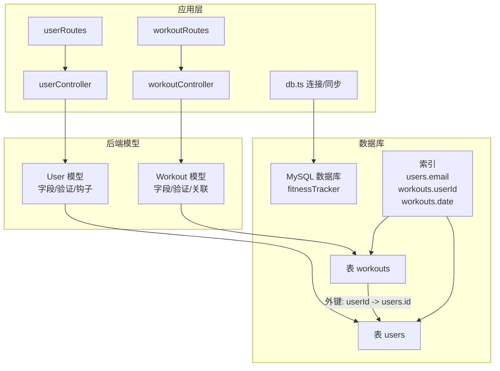
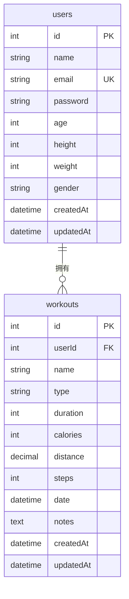
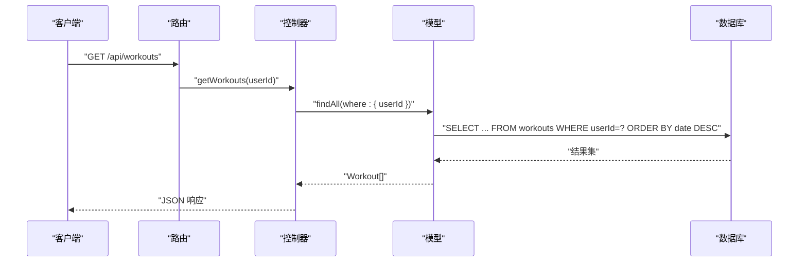
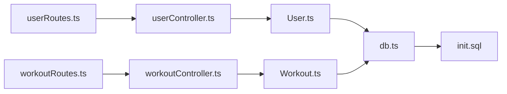

# 数据模型

<cite>
**本文引用的文件**
- [backend/src/models/User.ts](file://backend/src/models/User.ts)
- [backend/src/models/Workout.ts](file://backend/src/models/Workout.ts)
- [mysql/init.sql](file://mysql/init.sql)
- [docs/5. 数据库设计.md](file://docs/5. 数据库设计.md)
- [backend/src/config/db.ts](file://backend/src/config/db.ts)
- [backend/src/controllers/userController.ts](file://backend/src/controllers/userController.ts)
- [backend/src/controllers/workoutController.ts](file://backend/src/controllers/workoutController.ts)
- [backend/src/routes/userRoutes.ts](file://backend/src/routes/userRoutes.ts)
- [backend/src/routes/workoutRoutes.ts](file://backend/src/routes/workoutRoutes.ts)
</cite>

## 目录
1. [简介](#简介)
2. [项目结构](#项目结构)
3. [核心组件](#核心组件)
4. [架构总览](#架构总览)
5. [详细组件分析](#详细组件分析)
6. [依赖分析](#依赖分析)
7. [性能考虑](#性能考虑)
8. [故障排查指南](#故障排查指南)
9. [结论](#结论)
10. [附录](#附录)

## 简介
本文件系统化梳理健身追踪应用的数据库数据模型，重点阐述 User（用户）与 Workout（运动记录）两个实体的字段定义、数据类型、主键/外键关系、索引与约束设计，并结合实际代码与初始化脚本，给出数据库模式图、数据验证规则与业务规则说明，以及典型数据访问模式与性能优化建议。目标是帮助开发者与运维人员准确理解数据模型与实现细节，便于扩展与维护。

## 项目结构
数据库相关的核心位置集中在后端模型层与初始化脚本：
- 模型定义：User 与 Workout 的 Sequelize 模型定义位于 models 目录
- 初始化脚本：mysql/init.sql 负责创建数据库、表、索引与约束
- 文档说明：docs/5. 数据库设计.md 提供了完整的表结构、索引与 ER 图
- 连接与同步：backend/src/config/db.ts 中通过 Sequelize 进行连接与模型同步
- 控制器与路由：userController 与 workoutController 展示了典型的 CRUD 数据访问模式

图表来源
- [backend/src/models/User.ts](file://backend/src/models/User.ts#L1-L119)
- [backend/src/models/Workout.ts](file://backend/src/models/Workout.ts#L1-L122)
- [mysql/init.sql](file://mysql/init.sql#L1-L41)
- [backend/src/config/db.ts](file://backend/src/config/db.ts#L1-L41)
- [backend/src/controllers/userController.ts](file://backend/src/controllers/userController.ts#L1-L60)
- [backend/src/controllers/workoutController.ts](file://backend/src/controllers/workoutController.ts#L1-L132)
- [backend/src/routes/userRoutes.ts](file://backend/src/routes/userRoutes.ts#L1-L11)
- [backend/src/routes/workoutRoutes.ts](file://backend/src/routes/workoutRoutes.ts#L1-L22)

章节来源
- [backend/src/models/User.ts](file://backend/src/models/User.ts#L1-L119)
- [backend/src/models/Workout.ts](file://backend/src/models/Workout.ts#L1-L122)
- [mysql/init.sql](file://mysql/init.sql#L1-L41)
- [docs/5. 数据库设计.md](file://docs/5. 数据库设计.md#L1-L184)
- [backend/src/config/db.ts](file://backend/src/config/db.ts#L1-L41)
- [backend/src/controllers/userController.ts](file://backend/src/controllers/userController.ts#L1-L60)
- [backend/src/controllers/workoutController.ts](file://backend/src/controllers/workoutController.ts#L1-L132)
- [backend/src/routes/userRoutes.ts](file://backend/src/routes/userRoutes.ts#L1-L11)
- [backend/src/routes/workoutRoutes.ts](file://backend/src/routes/workoutRoutes.ts#L1-L22)

## 核心组件
本节聚焦 User 与 Workout 两个实体的字段、数据类型、约束与验证规则，以及它们之间的关系。

- User 实体
  - 主键：id（无符号整型，自增）
  - 字段与类型：name（字符串）、email（字符串，唯一）、password（字符串，bcrypt 加密）、age（无符号 tinyint）、height（无符号 smallint）、weight（无符号 smallint）、gender（枚举）
  - 约束与验证：非空、唯一（email）、枚举值限制、长度与数值范围校验
  - 时间戳：createdAt、updatedAt（Sequelize 自动维护）
  - 安全：提供密码比对方法；模型保存前自动加盐哈希

- Workout 实体
  - 主键：id（无符号整型，自增）
  - 外键：userId（无符号整型，引用 users.id）
  - 字段与类型：name（字符串）、type（枚举）、duration（无符号 smallint，单位分钟）、calories（无符号 smallint）、distance（decimal，单位公里）、steps（无符号 mediumint）、date（日期时间）、notes（文本）
  - 约束与验证：非空、数值下限校验、默认值（date）
  - 时间戳：createdAt、updatedAt（Sequelize 自动维护）
  - 关系：belongsTo User（一对一反向 hasMany）

章节来源
- [backend/src/models/User.ts](file://backend/src/models/User.ts#L1-L119)
- [backend/src/models/Workout.ts](file://backend/src/models/Workout.ts#L1-L122)
- [mysql/init.sql](file://mysql/init.sql#L1-L41)
- [docs/5. 数据库设计.md](file://docs/5. 数据库设计.md#L1-L184)

## 架构总览
下面以 ER 图展示 User 与 Workout 的关系，以及字段与约束概览。

图表来源
- [docs/5. 数据库设计.md](file://docs/5. 数据库设计.md#L91-L123)
- [mysql/init.sql](file://mysql/init.sql#L1-L41)
- [backend/src/models/User.ts](file://backend/src/models/User.ts#L1-L119)
- [backend/src/models/Workout.ts](file://backend/src/models/Workout.ts#L1-L122)

## 详细组件分析

### User 实体
- 字段与类型
  - id：无符号整型，自增主键
  - name：字符串，最大长度限制
  - email：字符串，唯一且必须为有效邮箱格式
  - password：字符串，bcrypt 加密存储
  - age/height/weight：可空数值，带上下限校验
  - gender：枚举值集合
  - createdAt/updatedAt：时间戳
- 约束与验证
  - 非空与唯一：email
  - 邮箱格式与密码长度校验
  - 年龄/身高/体重的合理范围
  - 枚举值限定
- 安全与生命周期
  - 模型保存前自动加盐哈希密码
  - 支持密码比对方法
- 典型用途
  - 登录认证、个人资料管理、运动记录归属

章节来源
- [backend/src/models/User.ts](file://backend/src/models/User.ts#L1-L119)

### Workout 实体
- 字段与类型
  - id：无符号整型，自增主键
  - userId：无符号整型，外键引用 users.id
  - name/type/duration/calories：必填字段
  - distance/steps：可空数值
  - date：必填，默认当前时间
  - notes：可空文本
  - createdAt/updatedAt：时间戳
- 约束与验证
  - 非空、数值下限校验、默认值
  - 外键约束：ON DELETE/CASCADE、ON UPDATE/CASCADE
- 关系
  - belongsTo User（一对一反向 hasMany）
- 典型用途
  - 记录每次运动详情，支持按用户维度聚合查询

章节来源
- [backend/src/models/Workout.ts](file://backend/src/models/Workout.ts#L1-L122)
- [mysql/init.sql](file://mysql/init.sql#L1-L41)

### 数据访问模式
- 用户资料访问
  - 路由：GET /api/users/profile
  - 控制器：从会话中读取用户ID，按主键查询并排除敏感字段返回
- 运动记录访问
  - 列表：GET /api/workouts（按用户ID过滤，按日期降序）
  - 单条：GET /api/workouts/:id（鉴权：仅允许本人）
  - 新增：POST /api/workouts（自动写入 userId）
  - 更新：PUT /api/workouts/:id（鉴权：仅允许本人）
  - 删除：DELETE /api/workouts/:id（鉴权：仅允许本人）

图表来源
- [backend/src/routes/workoutRoutes.ts](file://backend/src/routes/workoutRoutes.ts#L1-L22)
- [backend/src/controllers/workoutController.ts](file://backend/src/controllers/workoutController.ts#L1-L132)
- [backend/src/models/Workout.ts](file://backend/src/models/Workout.ts#L1-L122)

章节来源
- [backend/src/routes/userRoutes.ts](file://backend/src/routes/userRoutes.ts#L1-L11)
- [backend/src/routes/workoutRoutes.ts](file://backend/src/routes/workoutRoutes.ts#L1-L22)
- [backend/src/controllers/userController.ts](file://backend/src/controllers/userController.ts#L1-L60)
- [backend/src/controllers/workoutController.ts](file://backend/src/controllers/workoutController.ts#L1-L132)

### 数据验证规则与业务规则
- 数据验证规则
  - User：邮箱格式、密码长度、年龄/身高/体重范围、枚举值
  - Workout：运动时长/消耗卡路里/距离/步数下限、默认日期、外键引用
- 业务规则
  - 数据隔离：控制器在读取/更新/删除时均校验 userId 与当前登录用户一致
  - 密码安全：模型保存前自动加盐哈希，不存储明文密码
  - 级联删除：当用户被删除时，其运动记录将被级联删除
  - 默认值：运动记录的 date 字段默认当前时间

章节来源
- [backend/src/models/User.ts](file://backend/src/models/User.ts#L1-L119)
- [backend/src/models/Workout.ts](file://backend/src/models/Workout.ts#L1-L122)
- [backend/src/controllers/workoutController.ts](file://backend/src/controllers/workoutController.ts#L1-L132)

## 依赖分析
- 模型依赖
  - Workout 依赖 User（通过外键 userId 引用 users.id）
  - User 与 Workout 均依赖 Sequelize 连接实例
- 应用层依赖
  - 路由依赖控制器
  - 控制器依赖模型
- 数据库依赖
  - 初始化脚本定义表结构、索引与外键
  - 连接配置负责数据库连接与模型同步

图表来源
- [backend/src/routes/userRoutes.ts](file://backend/src/routes/userRoutes.ts#L1-L11)
- [backend/src/routes/workoutRoutes.ts](file://backend/src/routes/workoutRoutes.ts#L1-L22)
- [backend/src/controllers/userController.ts](file://backend/src/controllers/userController.ts#L1-L60)
- [backend/src/controllers/workoutController.ts](file://backend/src/controllers/workoutController.ts#L1-L132)
- [backend/src/models/User.ts](file://backend/src/models/User.ts#L1-L119)
- [backend/src/models/Workout.ts](file://backend/src/models/Workout.ts#L1-L122)
- [backend/src/config/db.ts](file://backend/src/config/db.ts#L1-L41)
- [mysql/init.sql](file://mysql/init.sql#L1-L41)

章节来源
- [backend/src/routes/userRoutes.ts](file://backend/src/routes/userRoutes.ts#L1-L11)
- [backend/src/routes/workoutRoutes.ts](file://backend/src/routes/workoutRoutes.ts#L1-L22)
- [backend/src/controllers/userController.ts](file://backend/src/controllers/userController.ts#L1-L60)
- [backend/src/controllers/workoutController.ts](file://backend/src/controllers/workoutController.ts#L1-L132)
- [backend/src/models/User.ts](file://backend/src/models/User.ts#L1-L119)
- [backend/src/models/Workout.ts](file://backend/src/models/Workout.ts#L1-L122)
- [backend/src/config/db.ts](file://backend/src/config/db.ts#L1-L41)
- [mysql/init.sql](file://mysql/init.sql#L1-L41)

## 性能考虑
- 索引策略
  - users.email：唯一索引，保障邮箱唯一性与快速查找
  - workouts.userId：普通索引，加速按用户维度查询
  - workouts.date：普通索引，支持按日期范围检索
  - 可选：为 type 添加索引以优化按运动类型统计
- 查询模式
  - 列表查询按用户ID过滤并按日期倒序，符合常见“最近优先”场景
  - 单条查询按主键，命中率高
- 连接与池化
  - 连接池参数已配置，建议根据并发量与数据库资源调优
- 写入安全
  - 密码哈希在模型保存前执行，避免明文落库
  - 外键约束保证数据一致性，防止孤儿记录

章节来源
- [mysql/init.sql](file://mysql/init.sql#L1-L41)
- [docs/5. 数据库设计.md](file://docs/5. 数据库设计.md#L79-L90)
- [backend/src/config/db.ts](file://backend/src/config/db.ts#L1-L41)
- [backend/src/controllers/workoutController.ts](file://backend/src/controllers/workoutController.ts#L1-L132)

## 故障排查指南
- 连接失败
  - 检查环境变量是否正确（数据库名、用户名、密码、主机、端口）
  - 查看连接日志与错误堆栈
- 同步失败
  - 确认数据库服务可用
  - 检查模型定义与数据库结构差异
- 数据异常
  - 验证输入数据是否满足模型校验规则（如邮箱格式、数值范围）
  - 确认外键引用是否存在
- 权限问题
  - 确保路由中间件正确设置当前用户ID
  - 控制器中对 userId 进行鉴权检查

章节来源
- [backend/src/config/db.ts](file://backend/src/config/db.ts#L1-L41)
- [backend/src/controllers/workoutController.ts](file://backend/src/controllers/workoutController.ts#L1-L132)
- [backend/src/models/User.ts](file://backend/src/models/User.ts#L1-L119)
- [backend/src/models/Workout.ts](file://backend/src/models/Workout.ts#L1-L122)

## 结论
本数据模型围绕 User 与 Workout 两个核心实体构建，采用清晰的主外键关系、严格的字段验证与安全的密码处理机制。配合合理的索引策略与基于 JWT 的鉴权控制，能够支撑用户资料管理与运动记录的完整生命周期。建议在生产环境中持续关注连接池配置、查询性能与数据备份策略，确保系统的稳定性与可维护性。

## 附录
- 初始化脚本位置：mysql/init.sql
- 数据库设计文档：docs/5. 数据库设计.md
- 模型定义：backend/src/models/User.ts、backend/src/models/Workout.ts
- 连接与同步：backend/src/config/db.ts
- 路由与控制器：backend/src/routes/*、backend/src/controllers/*