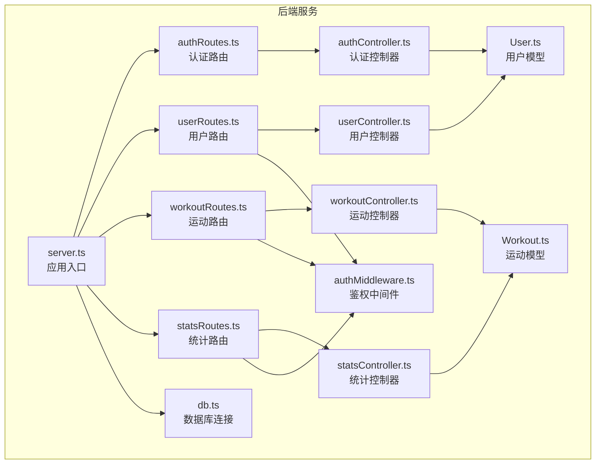
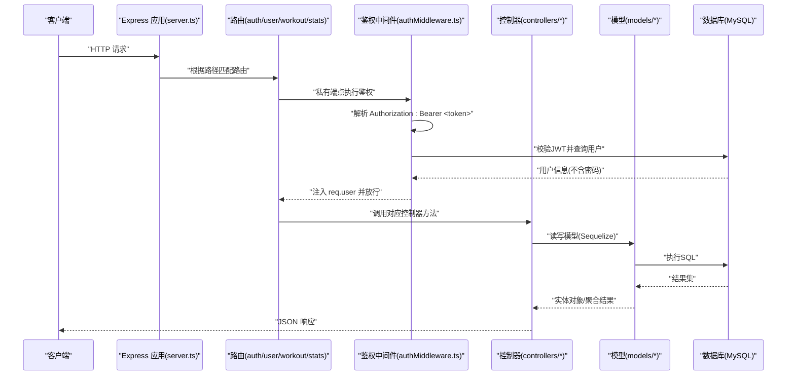
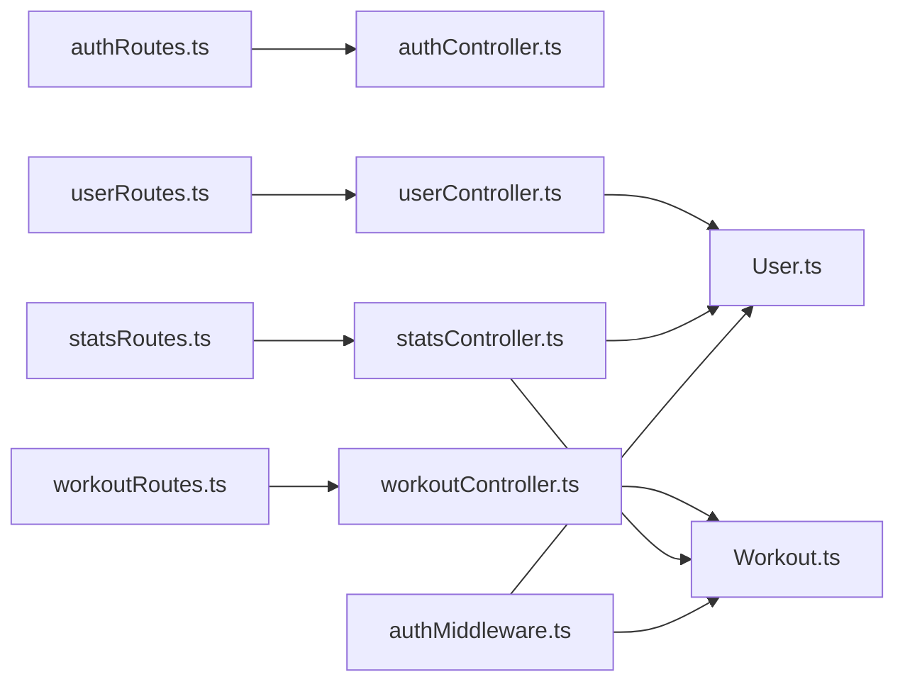

# API参考

<cite>
**本文引用的文件**
- [backend/src/server.ts](file://backend/src/server.ts)
- [backend/src/config/db.ts](file://backend/src/config/db.ts)
- [backend/src/middleware/authMiddleware.ts](file://backend/src/middleware/authMiddleware.ts)
- [backend/src/controllers/authController.ts](file://backend/src/controllers/authController.ts)
- [backend/src/controllers/userController.ts](file://backend/src/controllers/userController.ts)
- [backend/src/controllers/workoutController.ts](file://backend/src/controllers/workoutController.ts)
- [backend/src/controllers/statsController.ts](file://backend/src/controllers/statsController.ts)
- [backend/src/routes/authRoutes.ts](file://backend/src/routes/authRoutes.ts)
- [backend/src/routes/userRoutes.ts](file://backend/src/routes/userRoutes.ts)
- [backend/src/routes/workoutRoutes.ts](file://backend/src/routes/workoutRoutes.ts)
- [backend/src/routes/statsRoutes.ts](file://backend/src/routes/statsRoutes.ts)
- [backend/src/models/User.ts](file://backend/src/models/User.ts)
- [backend/src/models/Workout.ts](file://backend/src/models/Workout.ts)
- [docs/4. API接口文档.md](file://docs/4. API接口文档.md)
</cite>

## 目录
1. [简介](#简介)
2. [项目结构](#项目结构)
3. [核心组件](#核心组件)
4. [架构总览](#架构总览)
5. [详细组件分析](#详细组件分析)
6. [依赖关系分析](#依赖关系分析)
7. [性能与可扩展性](#性能与可扩展性)
8. [故障排查指南](#故障排查指南)
9. [结论](#结论)
10. [附录：端点规范与示例](#附录端点规范与示例)

## 简介
本文件为 Fitness Tracker 后端服务的完整 API 参考，覆盖认证、用户、运动记录与统计四大模块。文档基于后端源码与官方文档进行整理，明确各端点的 HTTP 方法、URL 路径、请求参数、响应格式、状态码、认证要求以及错误处理模式，并给出 JWT 令牌在 Authorization 头中的使用方式与典型请求/响应示例路径。

## 项目结构
后端采用 Express + TypeScript + Sequelize 的技术栈，按“路由 -> 控制器 -> 中间件 -> 模型”的层次化组织：
- server.ts：应用入口，加载环境变量、连接数据库、挂载路由。
- routes/*：定义 RESTful 路由与访问控制中间件。
- controllers/*：实现业务逻辑，处理请求与响应。
- middleware/authMiddleware.ts：鉴权中间件，解析并校验 JWT。
- models/*：Sequelize 模型定义及关联关系。
- config/db.ts：数据库连接与模型同步。

图表来源
- [backend/src/server.ts](file://backend/src/server.ts#L1-L36)
- [backend/src/routes/authRoutes.ts](file://backend/src/routes/authRoutes.ts#L1-L9)
- [backend/src/routes/userRoutes.ts](file://backend/src/routes/userRoutes.ts#L1-L11)
- [backend/src/routes/workoutRoutes.ts](file://backend/src/routes/workoutRoutes.ts#L1-L22)
- [backend/src/routes/statsRoutes.ts](file://backend/src/routes/statsRoutes.ts#L1-L10)
- [backend/src/middleware/authMiddleware.ts](file://backend/src/middleware/authMiddleware.ts#L1-L36)
- [backend/src/controllers/authController.ts](file://backend/src/controllers/authController.ts#L1-L71)
- [backend/src/controllers/userController.ts](file://backend/src/controllers/userController.ts#L1-L60)
- [backend/src/controllers/workoutController.ts](file://backend/src/controllers/workoutController.ts#L1-L132)
- [backend/src/controllers/statsController.ts](file://backend/src/controllers/statsController.ts#L1-L119)
- [backend/src/models/User.ts](file://backend/src/models/User.ts#L1-L119)
- [backend/src/models/Workout.ts](file://backend/src/models/Workout.ts#L1-L122)
- [backend/src/config/db.ts](file://backend/src/config/db.ts#L1-L41)

章节来源
- [backend/src/server.ts](file://backend/src/server.ts#L1-L36)
- [backend/src/config/db.ts](file://backend/src/config/db.ts#L1-L41)

## 核心组件
- 应用入口与路由挂载：server.ts 加载环境变量、连接数据库，启用 JSON 解析与 CORS，挂载 /api/auth、/api/users、/api/workouts、/api/stats 四个前缀路由。
- 鉴权中间件：authMiddleware.ts 从 Authorization 头解析 Bearer 令牌，校验 JWT 并注入用户信息到 req.user，未携带或无效令牌返回 401。
- 模型层：User.ts 定义用户字段与验证规则，Workout.ts 定义运动记录字段与验证规则，并建立用户与运动的一对多关系。
- 控制器层：各控制器实现具体业务逻辑，统一返回 JSON 响应，异常时返回 500；部分端点返回 4xx 错误码（如 400、401、404）。

章节来源
- [backend/src/server.ts](file://backend/src/server.ts#L1-L36)
- [backend/src/middleware/authMiddleware.ts](file://backend/src/middleware/authMiddleware.ts#L1-L36)
- [backend/src/models/User.ts](file://backend/src/models/User.ts#L1-L119)
- [backend/src/models/Workout.ts](file://backend/src/models/Workout.ts#L1-L122)

## 架构总览
下图展示请求从客户端到数据库的调用链路与鉴权流程。

图表来源
- [backend/src/server.ts](file://backend/src/server.ts#L1-L36)
- [backend/src/middleware/authMiddleware.ts](file://backend/src/middleware/authMiddleware.ts#L1-L36)
- [backend/src/controllers/authController.ts](file://backend/src/controllers/authController.ts#L1-L71)
- [backend/src/controllers/userController.ts](file://backend/src/controllers/userController.ts#L1-L60)
- [backend/src/controllers/workoutController.ts](file://backend/src/controllers/workoutController.ts#L1-L132)
- [backend/src/controllers/statsController.ts](file://backend/src/controllers/statsController.ts#L1-L119)
- [backend/src/models/User.ts](file://backend/src/models/User.ts#L1-L119)
- [backend/src/models/Workout.ts](file://backend/src/models/Workout.ts#L1-L122)

## 详细组件分析

### 认证接口
- 注册 /api/auth/register
  - 方法与路径：POST /api/auth/register
  - 认证要求：公开接口，无需 JWT
  - 请求体字段：name、email、password
  - 成功响应：包含 id、name、email、token
  - 状态码：201（成功创建），400（用户已存在或输入无效），500（服务器错误）
  - 错误处理：重复邮箱、输入非法、数据库异常
- 登录 /api/auth/login
  - 方法与路径：POST /api/auth/login
  - 认证要求：公开接口，无需 JWT
  - 请求体字段：email、password
  - 成功响应：包含 id、name、email、token
  - 状态码：200（成功），401（邮箱或密码错误），500（服务器错误）

章节来源
- [backend/src/controllers/authController.ts](file://backend/src/controllers/authController.ts#L1-L71)
- [backend/src/routes/authRoutes.ts](file://backend/src/routes/authRoutes.ts#L1-L9)

### 用户接口
- 获取资料 /api/users/profile
  - 方法与路径：GET /api/users/profile
  - 认证要求：私有接口，需要 Authorization: Bearer <token>
  - 请求头：Authorization: Bearer <token>
  - 成功响应：用户对象（不包含 password 字段）
  - 状态码：200（成功），404（用户不存在），401（未授权，无 token 或无效 token），500（服务器错误）
- 更新资料 /api/users/profile
  - 方法与路径：PUT /api/users/profile
  - 认证要求：私有接口，需要 Authorization: Bearer <token>
  - 请求头：Authorization: Bearer <token>
  - 请求体字段：name、age、height、weight、gender（可选）
  - 成功响应：更新后的用户对象
  - 状态码：200（成功），404（用户不存在），401（未授权），500（服务器错误）

章节来源
- [backend/src/controllers/userController.ts](file://backend/src/controllers/userController.ts#L1-L60)
- [backend/src/routes/userRoutes.ts](file://backend/src/routes/userRoutes.ts#L1-L11)
- [backend/src/middleware/authMiddleware.ts](file://backend/src/middleware/authMiddleware.ts#L1-L36)

### 运动记录接口
- 获取全部记录 /api/workouts
  - 方法与路径：GET /api/workouts
  - 认证要求：私有接口，需要 Authorization: Bearer <token>
  - 请求头：Authorization: Bearer <token>
  - 成功响应：当前用户的所有运动记录数组（按日期降序）
  - 状态码：200（成功），401（未授权），500（服务器错误）
- 创建记录 /api/workouts
  - 方法与路径：POST /api/workouts
  - 认证要求：私有接口，需要 Authorization: Bearer <token>
  - 请求头：Authorization: Bearer <token>
  - 请求体字段：name、type、duration、calories、distance、steps、date、notes
  - 成功响应：新创建的运动记录
  - 状态码：201（成功），401（未授权），500（服务器错误）
- 获取单条记录 /api/workouts/:id
  - 方法与路径：GET /api/workouts/:id
  - 认证要求：私有接口，需要 Authorization: Bearer <token>
  - 请求头：Authorization: Bearer <token>
  - 成功响应：指定运动记录
  - 状态码：200（成功），404（记录不存在），401（未授权），500（服务器错误）
- 更新记录 /api/workouts/:id
  - 方法与路径：PUT /api/workouts/:id
  - 认证要求：私有接口，需要 Authorization: Bearer <token>
  - 请求头：Authorization: Bearer <token>
  - 请求体字段：name、type、duration、calories、distance、steps、date、notes
  - 成功响应：更新后的运动记录
  - 状态码：200（成功），404（记录不存在），401（未授权），500（服务器错误）
- 删除记录 /api/workouts/:id
  - 方法与路径：DELETE /api/workouts/:id
  - 认证要求：私有接口，需要 Authorization: Bearer <token>
  - 请求头：Authorization: Bearer <token>
  - 成功响应：删除确认消息
  - 状态码：200（成功），404（记录不存在），401（未授权），500（服务器错误）

章节来源
- [backend/src/controllers/workoutController.ts](file://backend/src/controllers/workoutController.ts#L1-L132)
- [backend/src/routes/workoutRoutes.ts](file://backend/src/routes/workoutRoutes.ts#L1-L22)
- [backend/src/middleware/authMiddleware.ts](file://backend/src/middleware/authMiddleware.ts#L1-L36)

### 统计接口
- 运动统计 /api/stats/workouts
  - 方法与路径：GET /api/stats/workouts
  - 认证要求：私有接口，需要 Authorization: Bearer <token>
  - 请求头：Authorization: Bearer <token>
  - 成功响应：包含 totalWorkouts、totalDuration、totalCalories、totalDistance、workoutsByType
  - 状态码：200（成功），401（未授权），500（服务器错误）
- 周度统计 /api/stats/weekly
  - 方法与路径：GET /api/stats/weekly
  - 认证要求：私有接口，需要 Authorization: Bearer <token>
  - 请求头：Authorization: Bearer <token>
  - 成功响应：最近7天的每日统计数组（包含 date、duration、calories、workouts）
  - 状态码：200（成功），401（未授权），500（服务器错误）

章节来源
- [backend/src/controllers/statsController.ts](file://backend/src/controllers/statsController.ts#L1-L119)
- [backend/src/routes/statsRoutes.ts](file://backend/src/routes/statsRoutes.ts#L1-L10)
- [backend/src/middleware/authMiddleware.ts](file://backend/src/middleware/authMiddleware.ts#L1-L36)

## 依赖关系分析
- 路由到控制器：各路由文件导入对应控制器函数，并通过中间件保护私有端点。
- 控制器到模型：控制器使用 Sequelize 模型进行数据读写，User 与 Workout 之间通过外键 userId 建立一对多关系。
- 中间件到模型：鉴权中间件通过 JWT 解析用户 ID，查询用户并注入到请求对象。
- 服务器到数据库：server.ts 启动时连接数据库并同步模型。

图表来源
- [backend/src/routes/authRoutes.ts](file://backend/src/routes/authRoutes.ts#L1-L9)
- [backend/src/routes/userRoutes.ts](file://backend/src/routes/userRoutes.ts#L1-L11)
- [backend/src/routes/workoutRoutes.ts](file://backend/src/routes/workoutRoutes.ts#L1-L22)
- [backend/src/routes/statsRoutes.ts](file://backend/src/routes/statsRoutes.ts#L1-L10)
- [backend/src/controllers/authController.ts](file://backend/src/controllers/authController.ts#L1-L71)
- [backend/src/controllers/userController.ts](file://backend/src/controllers/userController.ts#L1-L60)
- [backend/src/controllers/workoutController.ts](file://backend/src/controllers/workoutController.ts#L1-L132)
- [backend/src/controllers/statsController.ts](file://backend/src/controllers/statsController.ts#L1-L119)
- [backend/src/middleware/authMiddleware.ts](file://backend/src/middleware/authMiddleware.ts#L1-L36)
- [backend/src/models/User.ts](file://backend/src/models/User.ts#L1-L119)
- [backend/src/models/Workout.ts](file://backend/src/models/Workout.ts#L1-L122)

## 性能与可扩展性
- 数据库连接池：默认池大小为 5，空闲超时 10 秒，适合中低并发场景。可根据部署规模调整。
- 查询优化：运动记录列表按日期降序排序，建议在 date 字段上建立索引以提升查询性能。
- 分页策略：当前实现未提供分页参数。若未来数据量增长，可在控制器中引入 limit/offset 或基于游标的分页方案。
- 缓存：可考虑对统计类接口增加缓存层，降低高频聚合查询压力。

章节来源
- [backend/src/config/db.ts](file://backend/src/config/db.ts#L1-L41)
- [backend/src/controllers/workoutController.ts](file://backend/src/controllers/workoutController.ts#L1-L132)
- [backend/src/controllers/statsController.ts](file://backend/src/controllers/statsController.ts#L1-L119)

## 故障排查指南
- 401 未授权
  - 症状：返回“未授权，无 token”或“未授权，token 失败”
  - 排查：确认请求头是否包含 Authorization: Bearer <token>，且令牌未过期
- 404 资源不存在
  - 症状：运动记录或用户不存在
  - 排查：确认资源 ID 是否正确，用户是否为当前登录用户
- 400 输入无效
  - 症状：注册时邮箱已存在或密码长度不足
  - 排查：检查请求体字段是否满足模型验证规则
- 500 服务器错误
  - 症状：数据库连接失败或内部异常
  - 排查：查看服务日志，确认数据库连通性与模型同步状态

章节来源
- [backend/src/middleware/authMiddleware.ts](file://backend/src/middleware/authMiddleware.ts#L1-L36)
- [backend/src/controllers/authController.ts](file://backend/src/controllers/authController.ts#L1-L71)
- [backend/src/controllers/userController.ts](file://backend/src/controllers/userController.ts#L1-L60)
- [backend/src/controllers/workoutController.ts](file://backend/src/controllers/workoutController.ts#L1-L132)
- [backend/src/controllers/statsController.ts](file://backend/src/controllers/statsController.ts#L1-L119)
- [backend/src/config/db.ts](file://backend/src/config/db.ts#L1-L41)

## 结论
本 API 参考系统性梳理了认证、用户、运动记录与统计四个模块的端点规范与实现细节，明确了 JWT 鉴权机制、数据验证规则与错误处理策略。建议在生产环境中补充分页、缓存与更细粒度的权限控制，并持续完善日志与监控体系。

## 附录：端点规范与示例

### 认证接口
- 注册 /api/auth/register
  - 方法：POST
  - 路径：/api/auth/register
  - 认证：公开
  - 请求体字段：name、email、password
  - 成功响应字段：id、name、email、token
  - 状态码：201、400、500
  - 示例请求/响应路径：[docs/4. API接口文档.md](file://docs/4. API接口文档.md#L1-L46)
- 登录 /api/auth/login
  - 方法：POST
  - 路径：/api/auth/login
  - 认证：公开
  - 请求体字段：email、password
  - 成功响应字段：id、name、email、token
  - 状态码：200、401、500
  - 示例请求/响应路径：[docs/4. API接口文档.md](file://docs/4. API接口文档.md#L29-L46)

### 用户接口
- 获取资料 /api/users/profile
  - 方法：GET
  - 路径：/api/users/profile
  - 认证：私有（Authorization: Bearer <token>）
  - 成功响应字段：id、name、email、age、height、weight、gender
  - 状态码：200、401、404、500
  - 示例请求/响应路径：[docs/4. API接口文档.md](file://docs/4. API接口文档.md#L48-L98)
- 更新资料 /api/users/profile
  - 方法：PUT
  - 路径：/api/users/profile
  - 认证：私有（Authorization: Bearer <token>）
  - 请求体字段：name、age、height、weight、gender
  - 成功响应字段：id、name、email、age、height、weight、gender
  - 状态码：200、401、404、500
  - 示例请求/响应路径：[docs/4. API接口文档.md](file://docs/4. API接口文档.md#L70-L98)

### 运动记录接口
- 获取全部记录 /api/workouts
  - 方法：GET
  - 路径：/api/workouts
  - 认证：私有（Authorization: Bearer <token>）
  - 成功响应：运动记录数组（按 date 降序）
  - 状态码：200、401、500
  - 示例请求/响应路径：[docs/4. API接口文档.md](file://docs/4. API接口文档.md#L100-L124)
- 创建记录 /api/workouts
  - 方法：POST
  - 路径：/api/workouts
  - 认证：私有（Authorization: Bearer <token>）
  - 请求体字段：name、type、duration、calories、distance、steps、date、notes
  - 成功响应字段：id、name、type、duration、calories、distance、steps、date、notes
  - 状态码：201、401、500
  - 示例请求/响应路径：[docs/4. API接口文档.md](file://docs/4. API接口文档.md#L126-L159)
- 获取单条记录 /api/workouts/:id
  - 方法：GET
  - 路径：/api/workouts/:id
  - 认证：私有（Authorization: Bearer <token>）
  - 成功响应字段：id、name、type、duration、calories、distance、steps、date、notes
  - 状态码：200、401、404、500
  - 示例请求/响应路径：[docs/4. API接口文档.md](file://docs/4. API接口文档.md#L161-L181)
- 更新记录 /api/workouts/:id
  - 方法：PUT
  - 路径：/api/workouts/:id
  - 认证：私有（Authorization: Bearer <token>）
  - 请求体字段：name、type、duration、calories、distance、steps、date、notes
  - 成功响应字段：id、name、type、duration、calories、distance、steps、date、notes
  - 状态码：200、401、404、500
  - 示例请求/响应路径：[docs/4. API接口文档.md](file://docs/4. API接口文档.md#L183-L216)
- 删除记录 /api/workouts/:id
  - 方法：DELETE
  - 路径：/api/workouts/:id
  - 认证：私有（Authorization: Bearer <token>）
  - 成功响应字段：message
  - 状态码：200、401、404、500
  - 示例请求/响应路径：[docs/4. API接口文档.md](file://docs/4. API接口文档.md#L218-L230)

### 统计接口
- 运动统计 /api/stats/workouts
  - 方法：GET
  - 路径：/api/stats/workouts
  - 认证：私有（Authorization: Bearer <token>）
  - 成功响应字段：totalWorkouts、totalDuration、totalCalories、totalDistance、workoutsByType
  - 状态码：200、401、500
  - 示例请求/响应路径：[docs/4. API接口文档.md](file://docs/4. API接口文档.md#L232-L249)
- 周度统计 /api/stats/weekly
  - 方法：GET
  - 路径：/api/stats/weekly
  - 认证：私有（Authorization: Bearer <token>）
  - 成功响应字段：数组元素包含 date、duration、calories、workouts
  - 状态码：200、401、500
  - 示例请求/响应路径：[docs/4. API接口文档.md](file://docs/4. API接口文档.md#L250-L275)

### JWT 令牌使用说明
- 在 Authorization 请求头中使用 Bearer 令牌：
  - Authorization: Bearer <token>
- 令牌生成与校验：
  - 生成：后端使用密钥签发 JWT，有效期 30 天
  - 校验：鉴权中间件解析并验证令牌，失败返回 401
- 典型流程：
  - 注册/登录成功后返回 token
  - 后续请求在请求头中携带 Authorization: Bearer <token>

章节来源
- [backend/src/controllers/authController.ts](file://backend/src/controllers/authController.ts#L1-L71)
- [backend/src/middleware/authMiddleware.ts](file://backend/src/middleware/authMiddleware.ts#L1-L36)
- [docs/4. API接口文档.md](file://docs/4. API接口文档.md#L1-L275)