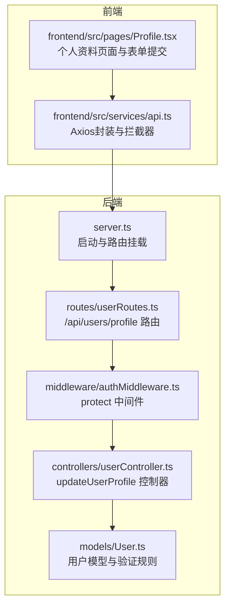
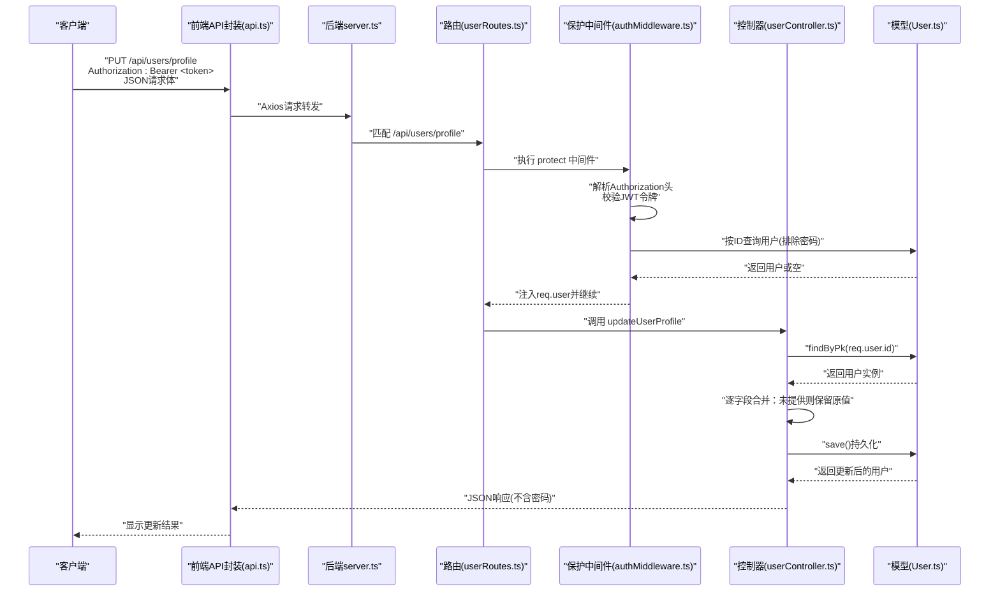
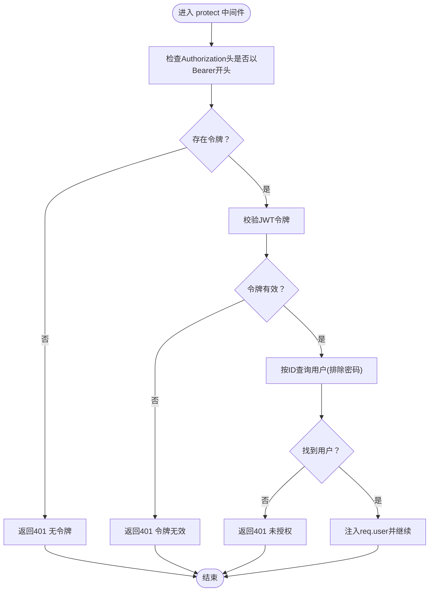
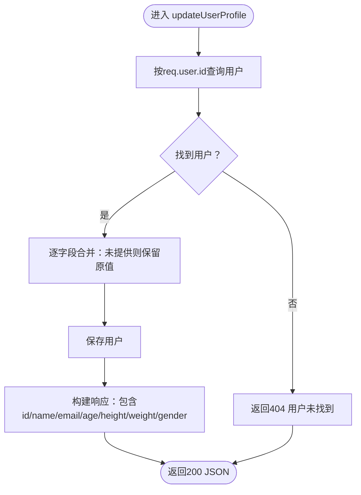
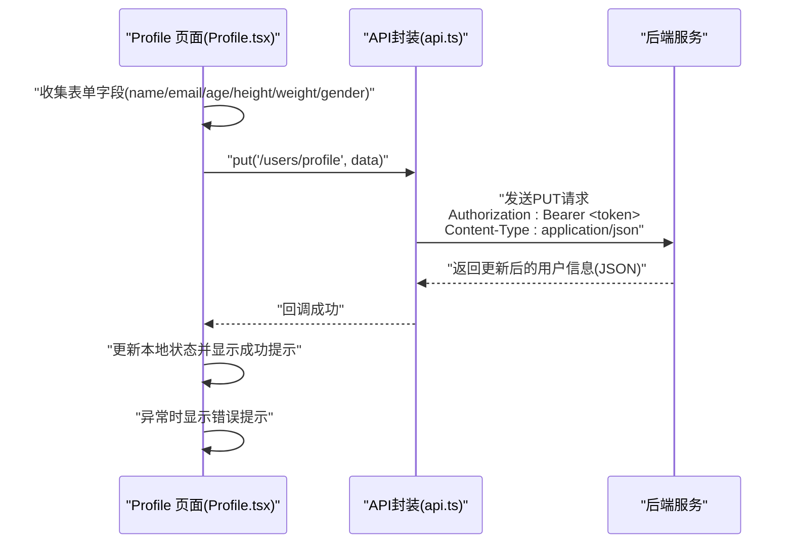
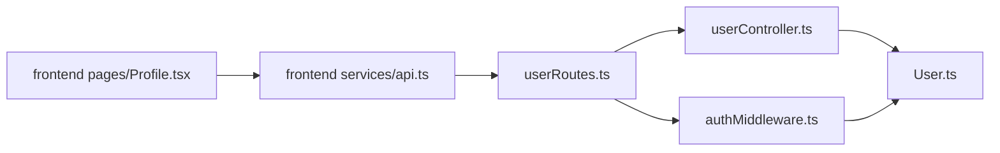

# 更新用户资料

<cite>
**本文引用的文件**
- [backend/src/controllers/userController.ts](file://backend/src/controllers/userController.ts)
- [backend/src/middleware/authMiddleware.ts](file://backend/src/middleware/authMiddleware.ts)
- [backend/src/routes/userRoutes.ts](file://backend/src/routes/userRoutes.ts)
- [backend/src/models/User.ts](file://backend/src/models/User.ts)
- [backend/src/server.ts](file://backend/src/server.ts)
- [frontend/src/services/api.ts](file://frontend/src/services/api.ts)
- [frontend/src/pages/Profile.tsx](file://frontend/src/pages/Profile.tsx)
- [docs/4. API接口文档.md](file://docs/4. API接口文档.md)
</cite>

## 目录
1. [简介](#简介)
2. [项目结构](#项目结构)
3. [核心组件](#核心组件)
4. [架构总览](#架构总览)
5. [详细组件分析](#详细组件分析)
6. [依赖关系分析](#依赖关系分析)
7. [性能考虑](#性能考虑)
8. [故障排查指南](#故障排查指南)
9. [结论](#结论)
10. [附录](#附录)

## 简介
本文件为“更新用户资料”API的完整技术文档，面向后端开发者与前端集成人员。目标是围绕PUT /api/users/profile端点，系统性说明：
- 请求需携带Bearer JWT令牌进行身份验证，由保护中间件完成校验并将用户信息注入到请求对象上
- 控制器updateUserProfile的业务逻辑：基于req.user.id定位用户，允许更新name、email、age、height、weight、gender字段，未提供的字段保持原值
- 请求体与成功响应的数据结构示例
- 404用户未找到与500服务器错误的处理方式
- 前端提交表单的实现要点，包括Content-Type设置与错误处理策略

## 项目结构
后端采用Express + Sequelize架构，路由层定义REST端点，中间件负责鉴权，控制器处理业务逻辑，模型定义数据结构与约束。

图表来源
- [backend/src/server.ts](file://backend/src/server.ts#L1-L36)
- [backend/src/routes/userRoutes.ts](file://backend/src/routes/userRoutes.ts#L1-L11)
- [backend/src/middleware/authMiddleware.ts](file://backend/src/middleware/authMiddleware.ts#L1-L36)
- [backend/src/controllers/userController.ts](file://backend/src/controllers/userController.ts#L1-L60)
- [backend/src/models/User.ts](file://backend/src/models/User.ts#L1-L119)
- [frontend/src/services/api.ts](file://frontend/src/services/api.ts#L1-L61)
- [frontend/src/pages/Profile.tsx](file://frontend/src/pages/Profile.tsx#L1-L128)

章节来源
- [backend/src/server.ts](file://backend/src/server.ts#L1-L36)
- [backend/src/routes/userRoutes.ts](file://backend/src/routes/userRoutes.ts#L1-L11)
- [frontend/src/services/api.ts](file://frontend/src/services/api.ts#L1-L61)

## 核心组件
- 路由层：在userRoutes中为/profile端点绑定保护中间件与控制器，支持GET与PUT两种方法；更新用户资料使用PUT方法
- 中间件层：protect中间件从Authorization头解析Bearer令牌，验证JWT并查询数据库获取用户，将用户信息注入req.user，随后调用next进入控制器
- 控制器层：updateUserProfile根据req.user.id查找用户，逐字段判断是否提供新值，未提供则保留原值，最后保存并返回更新后的用户信息（不包含密码）
- 模型层：User模型定义字段与验证规则，如email格式、age/height/weight范围等；beforeUpdate钩子对密码变更进行哈希处理

章节来源
- [backend/src/routes/userRoutes.ts](file://backend/src/routes/userRoutes.ts#L1-L11)
- [backend/src/middleware/authMiddleware.ts](file://backend/src/middleware/authMiddleware.ts#L1-L36)
- [backend/src/controllers/userController.ts](file://backend/src/controllers/userController.ts#L1-L60)
- [backend/src/models/User.ts](file://backend/src/models/User.ts#L1-L119)

## 架构总览
下面的序列图展示了从客户端发起PUT /api/users/profile请求，到最终返回更新后用户信息的完整流程。

图表来源
- [backend/src/server.ts](file://backend/src/server.ts#L1-L36)
- [backend/src/routes/userRoutes.ts](file://backend/src/routes/userRoutes.ts#L1-L11)
- [backend/src/middleware/authMiddleware.ts](file://backend/src/middleware/authMiddleware.ts#L1-L36)
- [backend/src/controllers/userController.ts](file://backend/src/controllers/userController.ts#L1-L60)
- [backend/src/models/User.ts](file://backend/src/models/User.ts#L1-L119)
- [frontend/src/services/api.ts](file://frontend/src/services/api.ts#L1-L61)

## 详细组件分析

### 端点定义与访问控制
- 端点：PUT /api/users/profile
- 访问控制：私有接口，必须携带Bearer JWT令牌
- 路由绑定：在userRoutes中通过put(protect, updateUserProfile)绑定

章节来源
- [backend/src/routes/userRoutes.ts](file://backend/src/routes/userRoutes.ts#L1-L11)
- [docs/4. API接口文档.md](file://docs/4. API接口文档.md#L70-L98)

### 保护中间件protect的工作流
- 从Authorization头提取Bearer令牌
- 使用JWT密钥验证令牌有效性
- 查询数据库获取用户信息（排除密码），并将用户对象注入req.user
- 若无令牌或验证失败，返回401未授权错误
- 成功后调用next进入后续处理器

图表来源
- [backend/src/middleware/authMiddleware.ts](file://backend/src/middleware/authMiddleware.ts#L1-L36)

章节来源
- [backend/src/middleware/authMiddleware.ts](file://backend/src/middleware/authMiddleware.ts#L1-L36)

### 控制器updateUserProfile的业务逻辑
- 依据req.user.id查询用户
- 对name、email、age、height、weight、gender逐项判断：若请求体提供新值则更新，否则保留原值
- 调用save()持久化，返回更新后的用户信息（不包含密码）

图表来源
- [backend/src/controllers/userController.ts](file://backend/src/controllers/userController.ts#L1-L60)

章节来源
- [backend/src/controllers/userController.ts](file://backend/src/controllers/userController.ts#L1-L60)

### 错误处理策略
- 404用户未找到：当数据库中不存在对应ID的用户时返回
- 500服务器错误：捕获异常统一返回服务器内部错误
- 401未授权：保护中间件在令牌缺失或无效时返回

章节来源
- [backend/src/controllers/userController.ts](file://backend/src/controllers/userController.ts#L1-L60)
- [backend/src/middleware/authMiddleware.ts](file://backend/src/middleware/authMiddleware.ts#L1-L36)

### 前端提交表单与错误处理
- Axios封装：在请求拦截器中自动添加Authorization: Bearer <token>，并设置Content-Type为application/json
- 表单提交：Profile页面收集name、email、age、height、weight、gender字段，将未填写的数值字段转换为undefined，避免覆盖已有值
- 错误处理：捕获异常并提示用户，成功后显示更新成功的反馈

图表来源
- [frontend/src/pages/Profile.tsx](file://frontend/src/pages/Profile.tsx#L1-L128)
- [frontend/src/services/api.ts](file://frontend/src/services/api.ts#L1-L61)

章节来源
- [frontend/src/pages/Profile.tsx](file://frontend/src/pages/Profile.tsx#L1-L128)
- [frontend/src/services/api.ts](file://frontend/src/services/api.ts#L1-L61)

## 依赖关系分析
- 路由依赖中间件与控制器
- 控制器依赖模型进行数据读写
- 中间件依赖JWT库与模型进行令牌校验与用户查询
- 前端依赖Axios与本地存储的token进行认证

图表来源
- [backend/src/routes/userRoutes.ts](file://backend/src/routes/userRoutes.ts#L1-L11)
- [backend/src/middleware/authMiddleware.ts](file://backend/src/middleware/authMiddleware.ts#L1-L36)
- [backend/src/controllers/userController.ts](file://backend/src/controllers/userController.ts#L1-L60)
- [backend/src/models/User.ts](file://backend/src/models/User.ts#L1-L119)
- [frontend/src/services/api.ts](file://frontend/src/services/api.ts#L1-L61)
- [frontend/src/pages/Profile.tsx](file://frontend/src/pages/Profile.tsx#L1-L128)

章节来源
- [backend/src/server.ts](file://backend/src/server.ts#L1-L36)
- [backend/src/routes/userRoutes.ts](file://backend/src/routes/userRoutes.ts#L1-L11)
- [frontend/src/services/api.ts](file://frontend/src/services/api.ts#L1-L61)

## 性能考虑
- 数据库查询：每次更新仅执行一次用户查询与一次save操作，复杂度低
- 中间件开销：JWT解码与数据库查询为O(1)，整体开销较小
- 建议：在高并发场景下可考虑缓存用户基本信息，减少数据库压力；但需注意缓存与数据库的一致性

[本节为通用建议，无需引用具体文件]

## 故障排查指南
- 401未授权
  - 检查Authorization头是否正确设置为Bearer <token>
  - 确认token未过期且密钥一致
  - 确认本地存储的token存在且有效
- 404用户未找到
  - 检查req.user.id是否与数据库中的用户ID一致
  - 确认用户已被创建且未被删除
- 500服务器错误
  - 查看后端日志，定位异常堆栈
  - 检查数据库连接与模型save过程
- 前端错误处理
  - 在Profile页面中捕获异常并显示友好提示
  - 确保表单字段为空时不传入undefined以外的无效值

章节来源
- [backend/src/middleware/authMiddleware.ts](file://backend/src/middleware/authMiddleware.ts#L1-L36)
- [backend/src/controllers/userController.ts](file://backend/src/controllers/userController.ts#L1-L60)
- [frontend/src/pages/Profile.tsx](file://frontend/src/pages/Profile.tsx#L1-L128)

## 结论
PUT /api/users/profile端点通过保护中间件确保安全访问，控制器实现按需更新用户资料的业务逻辑，前后端协作清晰明确。遵循本文档的请求规范、错误处理与前端实现要点，可稳定地完成用户资料更新功能。

[本节为总结，无需引用具体文件]

## 附录

### 接口规范摘要
- 方法与路径：PUT /api/users/profile
- 认证：Bearer JWT令牌（Authorization: Bearer <token>）
- 请求体字段（可选）：name、email、age、height、weight、gender
- 成功响应：包含id、name、email、age、height、weight、gender
- 错误码：
  - 401：未授权（无令牌或令牌无效）
  - 404：用户未找到
  - 500：服务器内部错误

章节来源
- [docs/4. API接口文档.md](file://docs/4. API接口文档.md#L70-L98)
- [backend/src/controllers/userController.ts](file://backend/src/controllers/userController.ts#L1-L60)
- [backend/src/middleware/authMiddleware.ts](file://backend/src/middleware/authMiddleware.ts#L1-L36)