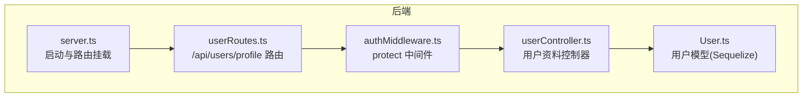
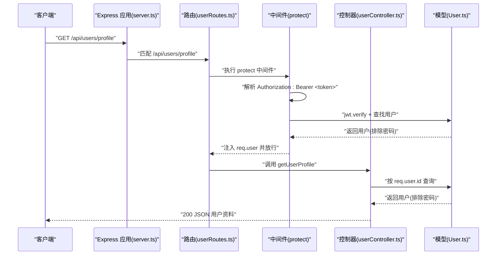
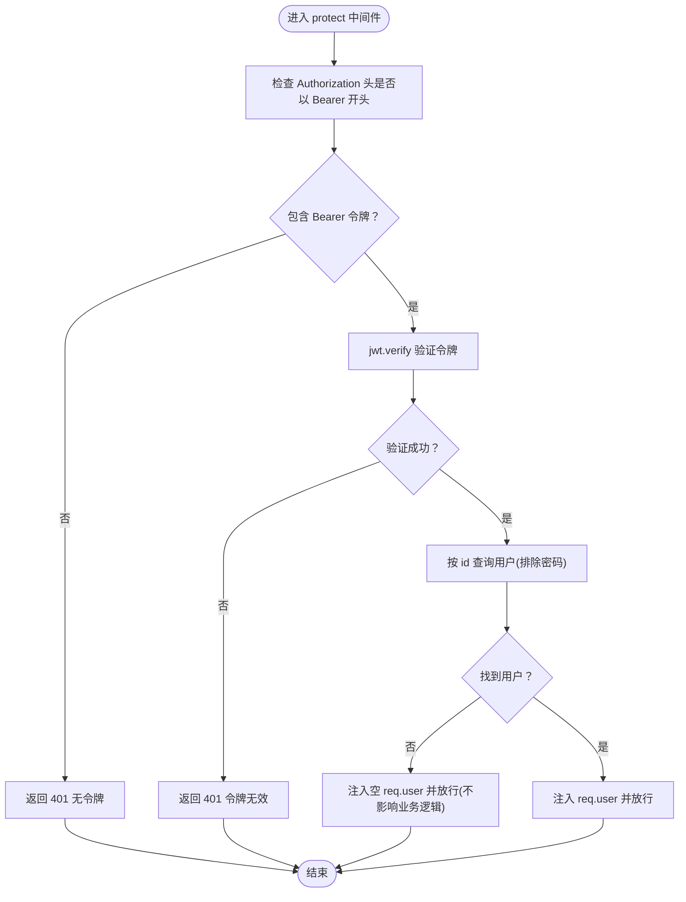
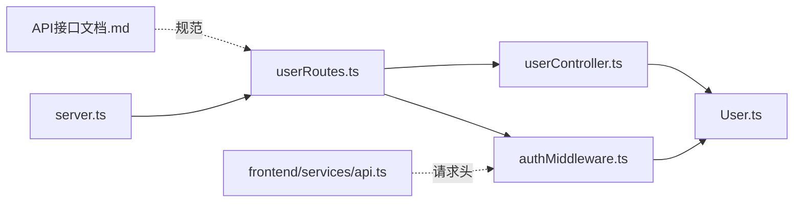

# 用户API

<cite>
**本文引用的文件**
- [backend/src/server.ts](file://backend/src/server.ts)
- [backend/src/routes/userRoutes.ts](file://backend/src/routes/userRoutes.ts)
- [backend/src/middleware/authMiddleware.ts](file://backend/src/middleware/authMiddleware.ts)
- [backend/src/controllers/userController.ts](file://backend/src/controllers/userController.ts)
- [backend/src/models/User.ts](file://backend/src/models/User.ts)
- [docs/4. API接口文档.md](file://docs/4. API接口文档.md)
- [frontend/src/services/api.ts](file://frontend/src/services/api.ts)
</cite>

## 目录
1. [简介](#简介)
2. [项目结构](#项目结构)
3. [核心组件](#核心组件)
4. [架构总览](#架构总览)
5. [详细组件分析](#详细组件分析)
6. [依赖关系分析](#依赖关系分析)
7. [性能与安全考虑](#性能与安全考虑)
8. [故障排查指南](#故障排查指南)
9. [结论](#结论)
10. [附录：请求/响应示例](#附录请求响应示例)

## 简介
本文件聚焦于用户资料管理的两个受保护端点：
- GET /api/users/profile：获取当前登录用户的资料
- PUT /api/users/profile：更新当前登录用户的资料

文档详细说明：
- 请求头 Authorization 字段携带 Bearer JWT 令牌的认证机制
- protect 中间件的验证流程
- GET 返回的用户基本信息字段
- PUT 可更新字段及后端模型中的验证规则
- 成功获取资料与更新密码的场景示例
- 401 未授权访问的触发条件与刷新令牌策略建议

## 项目结构
后端采用 Express + Sequelize 架构，路由通过 userRoutes.ts 暴露到 /api/users，并由 protect 中间件保护。用户控制器处理 GET/PUT 请求，用户模型定义数据结构与校验钩子。

图表来源
- [backend/src/server.ts](file://backend/src/server.ts#L1-L36)
- [backend/src/routes/userRoutes.ts](file://backend/src/routes/userRoutes.ts#L1-L11)
- [backend/src/middleware/authMiddleware.ts](file://backend/src/middleware/authMiddleware.ts#L1-L36)
- [backend/src/controllers/userController.ts](file://backend/src/controllers/userController.ts#L1-L60)
- [backend/src/models/User.ts](file://backend/src/models/User.ts#L1-L119)

章节来源
- [backend/src/server.ts](file://backend/src/server.ts#L1-L36)
- [backend/src/routes/userRoutes.ts](file://backend/src/routes/userRoutes.ts#L1-L11)

## 核心组件
- 路由层：在 userRoutes.ts 中为 /api/users/profile 定义 GET/PUT，并串联 protect 中间件
- 中间件：protect 从 Authorization 头解析 Bearer 令牌，验证后将用户信息注入 req.user
- 控制器：getUserProfile 返回用户资料（排除密码），updateUserProfile 支持更新 name、email、age、height、weight、gender
- 模型：User.ts 定义字段与校验规则（如邮箱格式、密码长度范围、数值边界等）

章节来源
- [backend/src/routes/userRoutes.ts](file://backend/src/routes/userRoutes.ts#L1-L11)
- [backend/src/middleware/authMiddleware.ts](file://backend/src/middleware/authMiddleware.ts#L1-L36)
- [backend/src/controllers/userController.ts](file://backend/src/controllers/userController.ts#L1-L60)
- [backend/src/models/User.ts](file://backend/src/models/User.ts#L1-L119)

## 架构总览
以下序列图展示了 GET /api/users/profile 的完整调用链。

图表来源
- [backend/src/server.ts](file://backend/src/server.ts#L1-L36)
- [backend/src/routes/userRoutes.ts](file://backend/src/routes/userRoutes.ts#L1-L11)
- [backend/src/middleware/authMiddleware.ts](file://backend/src/middleware/authMiddleware.ts#L1-L36)
- [backend/src/controllers/userController.ts](file://backend/src/controllers/userController.ts#L1-L60)
- [backend/src/models/User.ts](file://backend/src/models/User.ts#L1-L119)

## 详细组件分析

### 认证机制与 protect 中间件
- Authorization 头格式要求：Bearer <JWT 令牌>
- 中间件流程：
  1) 从 Authorization 头提取 Bearer 令牌
  2) 使用环境变量中的密钥对令牌进行验证
  3) 解码后根据 id 查询用户，排除密码字段
  4) 将用户对象注入 req.user，继续后续处理器
  5) 任何异常或缺少令牌均返回 401

图表来源
- [backend/src/middleware/authMiddleware.ts](file://backend/src/middleware/authMiddleware.ts#L1-L36)
- [backend/src/models/User.ts](file://backend/src/models/User.ts#L1-L119)

章节来源
- [backend/src/middleware/authMiddleware.ts](file://backend/src/middleware/authMiddleware.ts#L1-L36)

### GET /api/users/profile
- 路由绑定：userRoutes.ts 将 GET /api/users/profile 绑定到 protect 和 getUserProfile
- 行为：根据 req.user.id 查询用户，排除密码字段后返回
- 返回字段（来自模型定义）：id、name、email、age、height、weight、gender、createdAt、updatedAt
- 注意：文档中“createdAt”字段在控制器返回中未显式列出，但模型具备该字段；实际返回以控制器返回为准

章节来源
- [backend/src/routes/userRoutes.ts](file://backend/src/routes/userRoutes.ts#L1-L11)
- [backend/src/controllers/userController.ts](file://backend/src/controllers/userController.ts#L1-L60)
- [backend/src/models/User.ts](file://backend/src/models/User.ts#L1-L119)
- [docs/4. API接口文档.md](file://docs/4. API接口文档.md#L48-L98)

### PUT /api/users/profile
- 路由绑定：userRoutes.ts 将 PUT /api/users/profile 绑定到 protect 和 updateUserProfile
- 行为：根据 req.user.id 加载用户，允许更新 name、email、age、height、weight、gender；保存后返回更新后的用户信息
- 可更新字段：name、email、age、height、weight、gender
- 模型验证规则（节选）：
  - email：必须是合法邮箱格式
  - password：长度范围 6-100
  - age/height/weight：数值范围与非负约束
  - gender：枚举值 male/female/other
- 密码更新：模型在保存前会自动对密码进行哈希处理（仅当 password 字段被修改时）

章节来源
- [backend/src/routes/userRoutes.ts](file://backend/src/routes/userRoutes.ts#L1-L11)
- [backend/src/controllers/userController.ts](file://backend/src/controllers/userController.ts#L1-L60)
- [backend/src/models/User.ts](file://backend/src/models/User.ts#L1-L119)

### 前端集成与请求头
- 前端通过 axios 拦截器统一注入 Authorization: Bearer <token>，token 来自本地存储
- GET：userAPI.getProfile()
- PUT：userAPI.updateProfile({ name, email, age, height, weight, gender })

章节来源
- [frontend/src/services/api.ts](file://frontend/src/services/api.ts#L1-L61)

## 依赖关系分析
- server.ts 挂载路由模块，确保 /api/users 路由生效
- userRoutes.ts 依赖 protect 中间件与控制器
- protect 中间件依赖 jwt 验证与 User 模型
- 控制器依赖 User 模型进行查询与保存
- 文档与前端代码共同定义了请求头与请求体规范

图表来源
- [backend/src/server.ts](file://backend/src/server.ts#L1-L36)
- [backend/src/routes/userRoutes.ts](file://backend/src/routes/userRoutes.ts#L1-L11)
- [backend/src/middleware/authMiddleware.ts](file://backend/src/middleware/authMiddleware.ts#L1-L36)
- [backend/src/controllers/userController.ts](file://backend/src/controllers/userController.ts#L1-L60)
- [backend/src/models/User.ts](file://backend/src/models/User.ts#L1-L119)
- [docs/4. API接口文档.md](file://docs/4. API接口文档.md#L48-L98)
- [frontend/src/services/api.ts](file://frontend/src/services/api.ts#L1-L61)

章节来源
- [backend/src/server.ts](file://backend/src/server.ts#L1-L36)
- [backend/src/routes/userRoutes.ts](file://backend/src/routes/userRoutes.ts#L1-L11)
- [backend/src/middleware/authMiddleware.ts](file://backend/src/middleware/authMiddleware.ts#L1-L36)
- [backend/src/controllers/userController.ts](file://backend/src/controllers/userController.ts#L1-L60)
- [backend/src/models/User.ts](file://backend/src/models/User.ts#L1-L119)
- [docs/4. API接口文档.md](file://docs/4. API接口文档.md#L48-L98)
- [frontend/src/services/api.ts](file://frontend/src/services/api.ts#L1-L61)

## 性能与安全考虑
- 性能
  - protect 中间件每次请求都会进行 JWT 验证与数据库查询，建议在网关或应用层引入缓存策略（如基于用户 id 的轻量缓存）
  - 控制器查询时排除 password 字段，避免敏感信息泄露
- 安全
  - JWT 密钥应妥善保管，避免硬编码
  - 建议设置合理的过期时间与刷新策略
  - 对外暴露的字段应最小化，避免泄露内部实现细节

[本节为通用指导，不直接分析具体文件]

## 故障排查指南
- 401 未授权
  - 缺少 Authorization 头或不以 Bearer 开头：返回 401 无令牌
  - Bearer 令牌无效或已过期：返回 401 令牌失败
  - 令牌有效但用户不存在：req.user 为空，后续业务仍可能返回 404（取决于控制器逻辑）
- 常见问题定位
  - 确认 Authorization 头格式为 Bearer <token>
  - 确认 JWT_SECRET 环境变量正确
  - 确认用户 id 与令牌一致且用户存在
- 刷新令牌策略（建议）
  - 当出现 401 时，引导客户端使用 refresh token 或重新登录获取新 token
  - 在网关层实现 token 刷新与回源校验，减少重复验证开销

章节来源
- [backend/src/middleware/authMiddleware.ts](file://backend/src/middleware/authMiddleware.ts#L1-L36)

## 结论
- GET /api/users/profile 与 PUT /api/users/profile 均由 protect 中间件保护
- GET 返回用户资料（排除密码），PUT 允许更新 name、email、age、height、weight、gender
- 模型提供严格的字段校验，确保数据一致性
- 建议完善刷新令牌策略与错误提示，提升用户体验与安全性

[本节为总结性内容，不直接分析具体文件]

## 附录：请求/响应示例

- 请求头
  - Authorization: Bearer <你的JWT令牌>

- GET /api/users/profile
  - 成功响应字段（来自模型定义）：id、name、email、age、height、weight、gender、createdAt、updatedAt
  - 示例响应（字段示意）：
    - {
      "id": 1,
      "name": "张三",
      "email": "zhangsan@example.com",
      "age": 25,
      "height": 175,
      "weight": 70,
      "gender": "male",
      "createdAt": "2024-01-01T00:00:00Z",
      "updatedAt": "2024-01-01T00:00:00Z"
    }

- PUT /api/users/profile
  - 请求体（可选字段）：name、email、age、height、weight、gender
  - 成功响应：返回更新后的用户信息（同上字段集合）
  - 示例请求体：
    - {
      "name": "李四",
      "age": 26,
      "height": 176,
      "weight": 71,
      "gender": "female"
    }

- 401 未授权
  - 触发条件：
    - 未提供 Authorization 头
    - Authorization 头不是 Bearer 格式
    - Bearer 令牌无效或过期
  - 响应示例：
    - {
      "message": "Not authorized, token failed"
    }

- 刷新令牌策略（建议）
  - 当收到 401 时，客户端应尝试使用 refresh token 获取新 token
  - 若 refresh token 失效，则引导用户重新登录

章节来源
- [docs/4. API接口文档.md](file://docs/4. API接口文档.md#L48-L98)
- [backend/src/controllers/userController.ts](file://backend/src/controllers/userController.ts#L1-L60)
- [backend/src/middleware/authMiddleware.ts](file://backend/src/middleware/authMiddleware.ts#L1-L36)
- [frontend/src/services/api.ts](file://frontend/src/services/api.ts#L1-L61)