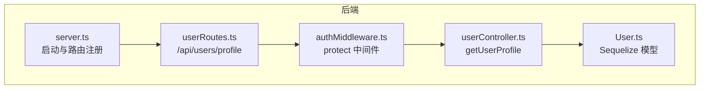
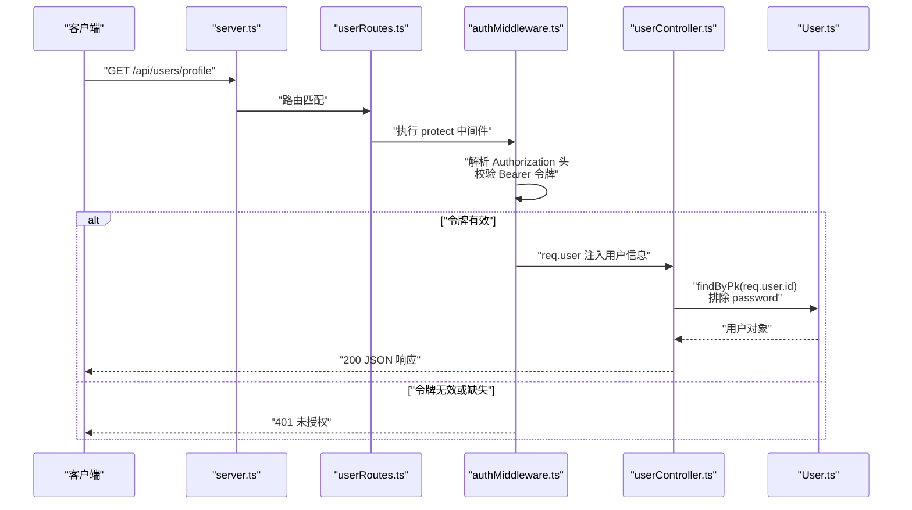
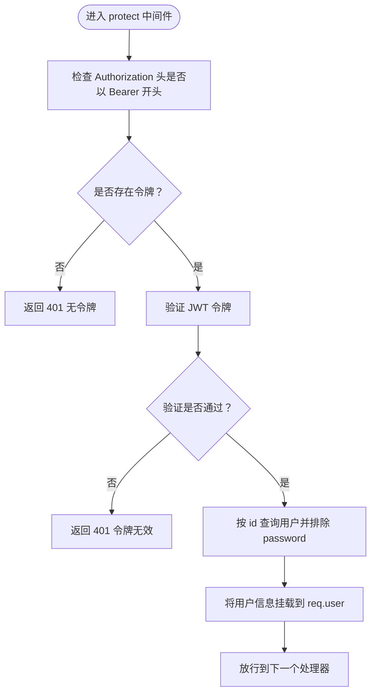
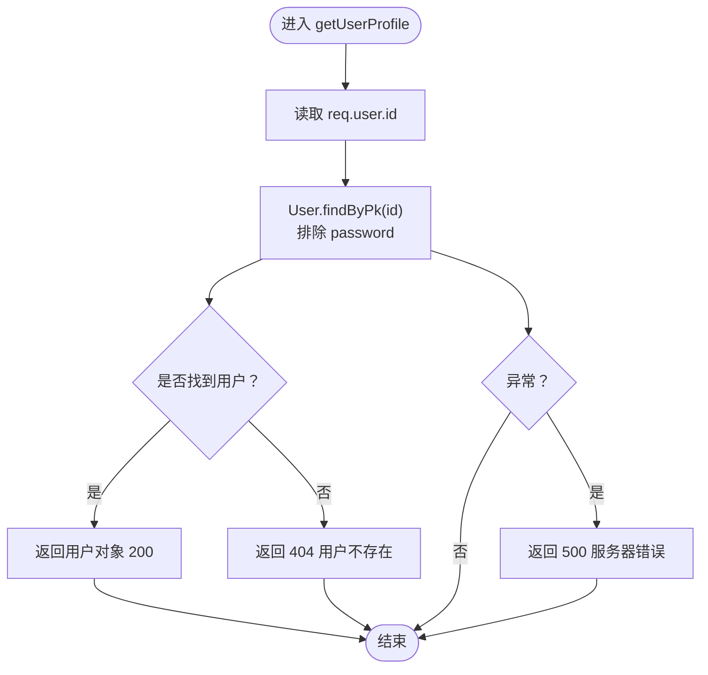
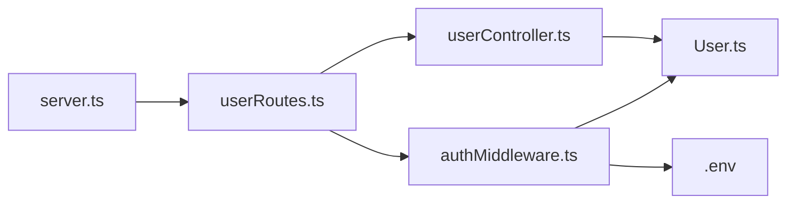

# 获取用户资料

<cite>
**本文引用的文件**
- [backend/src/controllers/userController.ts](file://backend/src/controllers/userController.ts)
- [backend/src/middleware/authMiddleware.ts](file://backend/src/middleware/authMiddleware.ts)
- [backend/src/routes/userRoutes.ts](file://backend/src/routes/userRoutes.ts)
- [backend/src/models/User.ts](file://backend/src/models/User.ts)
- [backend/src/server.ts](file://backend/src/server.ts)
- [backend/.env](file://backend/.env)
- [frontend/src/services/api.ts](file://frontend/src/services/api.ts)
- [docs/4. API接口文档.md](file://docs/4. API接口文档.md)
- [tests/test-api.js](file://tests/test-api.js)
</cite>

## 目录
1. [简介](#简介)
2. [项目结构](#项目结构)
3. [核心组件](#核心组件)
4. [架构总览](#架构总览)
5. [详细组件分析](#详细组件分析)
6. [依赖关系分析](#依赖关系分析)
7. [性能考量](#性能考量)
8. [故障排查指南](#故障排查指南)
9. [结论](#结论)
10. [附录](#附录)

## 简介
本文件聚焦于 GET /api/users/profile 接口，说明其受 JWT 认证保护，必须在请求头中携带 Bearer 令牌；该令牌由认证中间件进行校验并通过后注入到请求对象，控制器据此查询数据库并返回用户资料（排除密码字段）。文档还包含成功响应示例、404 与 500 异常处理说明、401 未授权触发机制，以及前端 Axios 调用示例路径。

## 项目结构
该接口位于后端 Express 应用中，采用分层设计：
- 路由层：定义 /api/users/profile 的 GET 方法并绑定保护中间件与控制器
- 中间件层：认证中间件负责解析 Authorization 头中的 Bearer 令牌，验证后将用户信息挂载到请求对象
- 控制器层：根据已认证的用户 ID 查询数据库，排除敏感字段后返回用户资料
- 模型层：User 模型定义用户数据结构及字段约束
- 服务启动：统一注册路由并监听端口

图表来源
- [backend/src/server.ts](file://backend/src/server.ts#L1-L36)
- [backend/src/routes/userRoutes.ts](file://backend/src/routes/userRoutes.ts#L1-L11)
- [backend/src/middleware/authMiddleware.ts](file://backend/src/middleware/authMiddleware.ts#L1-L36)
- [backend/src/controllers/userController.ts](file://backend/src/controllers/userController.ts#L1-L60)
- [backend/src/models/User.ts](file://backend/src/models/User.ts#L1-L119)

章节来源
- [backend/src/server.ts](file://backend/src/server.ts#L1-L36)
- [backend/src/routes/userRoutes.ts](file://backend/src/routes/userRoutes.ts#L1-L11)

## 核心组件
- 路由：在 userRoutes 中为 /profile 定义 GET 方法，并串联 protect 中间件与 getUserProfile 控制器
- 中间件：protect 从 Authorization 头解析 Bearer 令牌，使用 JWT_SECRET 验证，成功则将用户信息注入 req.user 并放行；失败或无令牌时返回 401
- 控制器：getUserProfile 读取 req.user.id，查询 User 表并排除 password 字段，存在则返回用户对象，否则返回 404；异常捕获返回 500
- 模型：User 定义 id、name、email、password、age、height、weight、gender 等字段，以及密码哈希钩子

章节来源
- [backend/src/routes/userRoutes.ts](file://backend/src/routes/userRoutes.ts#L1-L11)
- [backend/src/middleware/authMiddleware.ts](file://backend/src/middleware/authMiddleware.ts#L1-L36)
- [backend/src/controllers/userController.ts](file://backend/src/controllers/userController.ts#L1-L60)
- [backend/src/models/User.ts](file://backend/src/models/User.ts#L1-L119)

## 架构总览
下图展示从客户端到数据库的完整调用链，包括认证中间件对请求的拦截与放行。

图表来源
- [backend/src/server.ts](file://backend/src/server.ts#L1-L36)
- [backend/src/routes/userRoutes.ts](file://backend/src/routes/userRoutes.ts#L1-L11)
- [backend/src/middleware/authMiddleware.ts](file://backend/src/middleware/authMiddleware.ts#L1-L36)
- [backend/src/controllers/userController.ts](file://backend/src/controllers/userController.ts#L1-L60)
- [backend/src/models/User.ts](file://backend/src/models/User.ts#L1-L119)

## 详细组件分析

### GET /api/users/profile 接口规范
- 请求方法：GET
- 路径：/api/users/profile
- 认证：私有接口，需在请求头携带 Authorization: Bearer <token>
- 成功响应：返回用户基本信息（id、name、email、age、height、weight、gender）
- 异常处理：
  - 404：用户不存在
  - 500：服务器内部错误
  - 401：未授权（令牌无效或缺失）

章节来源
- [docs/4. API接口文档.md](file://docs/4. API接口文档.md#L48-L98)
- [backend/src/controllers/userController.ts](file://backend/src/controllers/userController.ts#L1-L60)
- [backend/src/middleware/authMiddleware.ts](file://backend/src/middleware/authMiddleware.ts#L1-L36)

### 认证中间件 protect 工作流
- 解析 Authorization 头，提取 Bearer 令牌
- 使用 JWT_SECRET 验证令牌有效性
- 若有效，从数据库按 id 查询用户并排除 password 字段，将用户对象赋给 req.user
- 放行后续处理器；若无效或缺失，返回 401

图表来源
- [backend/src/middleware/authMiddleware.ts](file://backend/src/middleware/authMiddleware.ts#L1-L36)
- [backend/src/models/User.ts](file://backend/src/models/User.ts#L1-L119)
- [backend/.env](file://backend/.env#L1-L10)

章节来源
- [backend/src/middleware/authMiddleware.ts](file://backend/src/middleware/authMiddleware.ts#L1-L36)
- [backend/.env](file://backend/.env#L1-L10)

### 控制器 getUserProfile 实现逻辑
- 从 req.user.id 获取当前用户标识
- 通过 User.findByPk 查询用户，排除 password 字段
- 存在则返回用户对象；不存在返回 404；异常捕获返回 500

图表来源
- [backend/src/controllers/userController.ts](file://backend/src/controllers/userController.ts#L1-L60)
- [backend/src/models/User.ts](file://backend/src/models/User.ts#L1-L119)

章节来源
- [backend/src/controllers/userController.ts](file://backend/src/controllers/userController.ts#L1-L60)

### 路由与控制器绑定
- userRoutes 将 GET /api/users/profile 绑定到 protect 中间件与 getUserProfile 控制器
- 服务器启动时注册 /api/users 路由前缀

章节来源
- [backend/src/routes/userRoutes.ts](file://backend/src/routes/userRoutes.ts#L1-L11)
- [backend/src/server.ts](file://backend/src/server.ts#L1-L36)

### 前端 Axios 调用示例
- 前端通过 axios 拦截器自动在请求头添加 Authorization: Bearer <token>
- 获取用户资料的调用路径：userAPI.getProfile()

章节来源
- [frontend/src/services/api.ts](file://frontend/src/services/api.ts#L1-L61)

## 依赖关系分析
- 路由依赖中间件与控制器
- 控制器依赖模型进行数据访问
- 中间件依赖模型与环境变量中的 JWT_SECRET
- 服务器统一注册各模块路由

图表来源
- [backend/src/server.ts](file://backend/src/server.ts#L1-L36)
- [backend/src/routes/userRoutes.ts](file://backend/src/routes/userRoutes.ts#L1-L11)
- [backend/src/middleware/authMiddleware.ts](file://backend/src/middleware/authMiddleware.ts#L1-L36)
- [backend/src/controllers/userController.ts](file://backend/src/controllers/userController.ts#L1-L60)
- [backend/src/models/User.ts](file://backend/src/models/User.ts#L1-L119)
- [backend/.env](file://backend/.env#L1-L10)

章节来源
- [backend/src/server.ts](file://backend/src/server.ts#L1-L36)
- [backend/src/routes/userRoutes.ts](file://backend/src/routes/userRoutes.ts#L1-L11)
- [backend/src/middleware/authMiddleware.ts](file://backend/src/middleware/authMiddleware.ts#L1-L36)
- [backend/src/controllers/userController.ts](file://backend/src/controllers/userController.ts#L1-L60)
- [backend/src/models/User.ts](file://backend/src/models/User.ts#L1-L119)
- [backend/.env](file://backend/.env#L1-L10)

## 性能考量
- 查询优化：User.findByPk 仅排除 password 字段，避免不必要的字段传输
- 中间件开销：JWT 验证与数据库查询均为轻量操作，建议在高并发场景下确保数据库连接池与索引合理配置
- 前端缓存：可考虑在前端对用户资料做短期缓存，减少重复请求

## 故障排查指南
- 401 未授权
  - 可能原因：缺少 Authorization 头、令牌格式不正确、令牌过期或被篡改
  - 排查步骤：确认请求头是否包含 Authorization: Bearer <token>；检查本地存储 token 是否存在；核对 JWT_SECRET 与签发方一致
- 404 用户不存在
  - 可能原因：令牌对应用户已被删除或 id 不匹配
  - 排查步骤：确认用户是否仍存在于数据库；检查令牌签发用户 id 是否正确
- 500 服务器错误
  - 可能原因：数据库连接异常、查询异常、服务器内部错误
  - 排查步骤：查看服务器日志；检查数据库连通性；确认模型与表结构一致

章节来源
- [backend/src/middleware/authMiddleware.ts](file://backend/src/middleware/authMiddleware.ts#L1-L36)
- [backend/src/controllers/userController.ts](file://backend/src/controllers/userController.ts#L1-L60)
- [backend/src/models/User.ts](file://backend/src/models/User.ts#L1-L119)

## 结论
GET /api/users/profile 是一个典型的私有接口，通过 protect 中间件完成 JWT 认证与用户信息注入，控制器基于已认证用户 ID 查询并返回非敏感用户资料。接口具备清晰的错误处理策略与良好的前后端协作方式，适合在多端复用。

## 附录

### 成功响应示例
- 返回字段：id、name、email、age、height、weight、gender
- 状态码：200

章节来源
- [docs/4. API接口文档.md](file://docs/4. API接口文档.md#L48-L98)

### 异常响应示例
- 404 用户不存在：返回消息提示用户不存在
- 500 服务器错误：返回消息提示服务器错误
- 401 未授权：返回消息提示未授权或令牌失败

章节来源
- [backend/src/controllers/userController.ts](file://backend/src/controllers/userController.ts#L1-L60)
- [backend/src/middleware/authMiddleware.ts](file://backend/src/middleware/authMiddleware.ts#L1-L36)

### Axios 调用示例路径
- 前端封装的用户资料获取方法：userAPI.getProfile()
- 自动添加 Authorization: Bearer <token> 的拦截器

章节来源
- [frontend/src/services/api.ts](file://frontend/src/services/api.ts#L1-L61)

### 测试脚本中的认证流程参考
- 登录接口返回 token 后，后续请求在请求头中携带 Authorization: Bearer <token>
- 获取用户资料与更新资料均需此流程

章节来源
- [tests/test-api.js](file://tests/test-api.js#L1-L149)