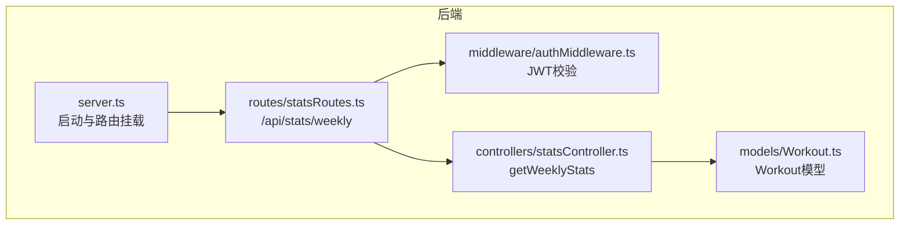
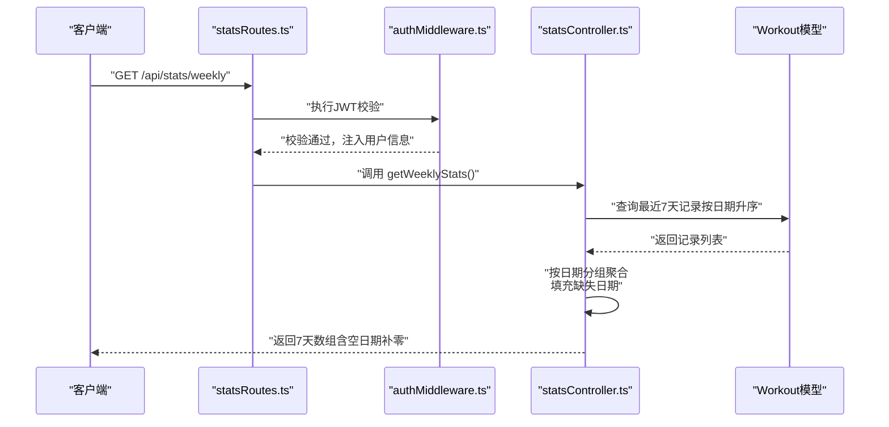
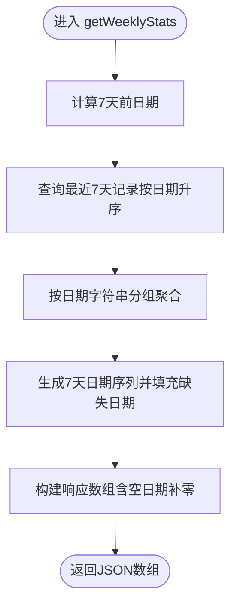
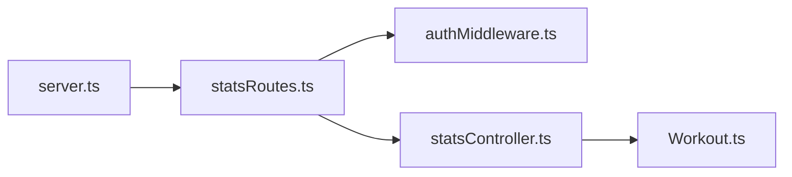

# 周度趋势API

<cite>
**本文引用的文件**
- [backend/src/controllers/statsController.ts](file://backend/src/controllers/statsController.ts)
- [backend/src/routes/statsRoutes.ts](file://backend/src/routes/statsRoutes.ts)
- [backend/src/middleware/authMiddleware.ts](file://backend/src/middleware/authMiddleware.ts)
- [backend/src/models/Workout.ts](file://backend/src/models/Workout.ts)
- [backend/src/server.ts](file://backend/src/server.ts)
- [docs/4. API接口文档.md](file://docs/4. API接口文档.md)
- [frontend/src/services/api.ts](file://frontend/src/services/api.ts)
- [frontend/src/pages/Dashboard.tsx](file://frontend/src/pages/Dashboard.tsx)
</cite>

## 目录
1. [简介](#简介)
2. [项目结构](#项目结构)
3. [核心组件](#核心组件)
4. [架构概览](#架构概览)
5. [详细组件分析](#详细组件分析)
6. [依赖关系分析](#依赖关系分析)
7. [性能考量](#性能考量)
8. [故障排查指南](#故障排查指南)
9. [结论](#结论)
10. [附录](#附录)

## 简介
本文件为 GET /api/stats/weekly 端点的详细API文档，重点说明：
- 该端点受JWT保护，仅允许认证用户访问
- 返回结构：包含过去7天每天的运动数据对象，每个对象包含 date（日期字符串）、duration（当日总时长）、calories（当日总卡路里）和 workouts（当日运动次数）
- 后端实现逻辑：使用 Sequelize 的 Op.gte 操作符查询最近7天的运动记录，随后在内存中按日期分组聚合，并填充缺失日期以保证图表数据连续性
- 前端使用示例与大数据量下的性能优化建议（数据库层面的预聚合）

## 项目结构
后端采用Express + Sequelize，路由通过 statsRoutes.ts 聚合到 /api/stats；认证中间件 protect 对路由进行保护；控制器负责业务逻辑；模型定义了Workout实体。

**图表来源**
- [backend/src/server.ts](file://backend/src/server.ts#L1-L36)
- [backend/src/routes/statsRoutes.ts](file://backend/src/routes/statsRoutes.ts#L1-L10)
- [backend/src/middleware/authMiddleware.ts](file://backend/src/middleware/authMiddleware.ts#L1-L36)
- [backend/src/controllers/statsController.ts](file://backend/src/controllers/statsController.ts#L58-L119)
- [backend/src/models/Workout.ts](file://backend/src/models/Workout.ts#L1-L122)

**章节来源**
- [backend/src/server.ts](file://backend/src/server.ts#L1-L36)
- [backend/src/routes/statsRoutes.ts](file://backend/src/routes/statsRoutes.ts#L1-L10)

## 核心组件
- 路由层：在 statsRoutes.ts 中定义 GET /api/stats/weekly 并绑定保护中间件
- 中间件：authMiddleware.ts 使用 JWT 验证请求头中的 Bearer Token，并将用户信息注入到请求对象
- 控制器：statsController.ts 的 getWeeklyStats 实现查询、聚合与缺失日期填充
- 模型：Workout.ts 定义了运动记录字段（包括 date、duration、calories 等），用于查询与聚合

**章节来源**
- [backend/src/routes/statsRoutes.ts](file://backend/src/routes/statsRoutes.ts#L1-L10)
- [backend/src/middleware/authMiddleware.ts](file://backend/src/middleware/authMiddleware.ts#L1-L36)
- [backend/src/controllers/statsController.ts](file://backend/src/controllers/statsController.ts#L58-L119)
- [backend/src/models/Workout.ts](file://backend/src/models/Workout.ts#L1-L122)

## 架构概览
下图展示了从客户端到数据库的完整调用链，以及JWT认证流程。

**图表来源**
- [backend/src/routes/statsRoutes.ts](file://backend/src/routes/statsRoutes.ts#L1-L10)
- [backend/src/middleware/authMiddleware.ts](file://backend/src/middleware/authMiddleware.ts#L1-L36)
- [backend/src/controllers/statsController.ts](file://backend/src/controllers/statsController.ts#L58-L119)
- [backend/src/models/Workout.ts](file://backend/src/models/Workout.ts#L1-L122)

## 详细组件分析

### 接口定义与访问控制
- URL：GET /api/stats/weekly
- 请求头：Authorization: Bearer <token>
- 访问控制：通过 protect 中间件进行JWT校验，未携带或无效token将返回401
- 成功响应：JSON数组，包含过去7天每日的统计对象

**章节来源**
- [backend/src/routes/statsRoutes.ts](file://backend/src/routes/statsRoutes.ts#L1-L10)
- [backend/src/middleware/authMiddleware.ts](file://backend/src/middleware/authMiddleware.ts#L1-L36)
- [docs/4. API接口文档.md](file://docs/4. API接口文档.md#L250-L275)

### 响应数据结构说明
- 数组长度：固定7个元素，对应当前日期往前推7天（包含当天）
- 每日对象字段：
  - date：字符串，格式为“YYYY-MM-DD”
  - duration：当日总时长（分钟）
  - calories：当日总卡路里
  - workouts：当日运动次数
- 缺失日期处理：若某日无运动记录，则对应字段均为0，确保图表连续性

**章节来源**
- [backend/src/controllers/statsController.ts](file://backend/src/controllers/statsController.ts#L58-L119)
- [docs/4. API接口文档.md](file://docs/4. API接口文档.md#L250-L275)

### 后端实现逻辑
- 查询范围：计算7天前的日期，使用 Op.gte 条件筛选最近7天的记录，并按日期升序排序
- 内存聚合：遍历结果，按“日期字符串”分组累加 duration、calories 和 workouts
- 缺失日期填充：循环生成过去7天的日期序列，逐日检查是否存在聚合结果，不存在则补0
- 返回顺序：从最旧到最新（日期递增），便于前端绘制连续折线图

**图表来源**
- [backend/src/controllers/statsController.ts](file://backend/src/controllers/statsController.ts#L58-L119)

**章节来源**
- [backend/src/controllers/statsController.ts](file://backend/src/controllers/statsController.ts#L58-L119)

### 数据模型与字段
- Workout模型包含以下关键字段：userId、date、duration（分钟）、calories、type等
- 该端点使用 date、duration、calories 字段进行查询与聚合

**章节来源**
- [backend/src/models/Workout.ts](file://backend/src/models/Workout.ts#L1-L122)

### 前端集成与使用示例
- 前端通过 axios 实例统一添加 Bearer Token，调用 statsAPI.getWeeklyStats 获取数据
- Dashboard 页面示例中，同时并发获取运动统计与周度趋势，将 weeklyStats 渲染为折线图
- 建议：将返回的7天数组直接映射为折线图的 x/y 轴数据，x轴为date，y轴为duration或calories

**章节来源**
- [frontend/src/services/api.ts](file://frontend/src/services/api.ts#L1-L61)
- [frontend/src/pages/Dashboard.tsx](file://frontend/src/pages/Dashboard.tsx#L1-L51)

## 依赖关系分析
- statsRoutes.ts 依赖 authMiddleware.ts 与 statsController.ts
- statsController.ts 依赖 Workout 模型与 Sequelize 的 Op 操作符
- server.ts 将 /api/stats 路由挂载至 Express 应用

**图表来源**
- [backend/src/server.ts](file://backend/src/server.ts#L1-L36)
- [backend/src/routes/statsRoutes.ts](file://backend/src/routes/statsRoutes.ts#L1-L10)
- [backend/src/middleware/authMiddleware.ts](file://backend/src/middleware/authMiddleware.ts#L1-L36)
- [backend/src/controllers/statsController.ts](file://backend/src/controllers/statsController.ts#L58-L119)
- [backend/src/models/Workout.ts](file://backend/src/models/Workout.ts#L1-L122)

**章节来源**
- [backend/src/server.ts](file://backend/src/server.ts#L1-L36)
- [backend/src/routes/statsRoutes.ts](file://backend/src/routes/statsRoutes.ts#L1-L10)

## 性能考量
- 当前实现为内存聚合：对最近7天的记录进行全表扫描与内存分组，适合中小规模数据
- 大数据量优化建议（数据库层面预聚合）：
  - 在数据库中维护每日聚合视图或物化视图，定期更新（例如每小时或每天）
  - 查询时直接读取聚合视图，避免每次运行时聚合
  - 若无法引入视图，可在Workout表上建立复合索引（userId, date），提升查询效率
  - 分页与缓存：对高频访问的周度趋势可增加Redis缓存，设置合理过期时间
  - 异步任务：将聚合任务放入后台队列，定时生成7天聚合数据，减少请求时延

[本节为通用性能建议，不直接分析具体文件]

## 故障排查指南
- 401 未授权：确认请求头是否包含正确的 Bearer Token，且Token未过期
- 500 服务器错误：检查数据库连接、Workout模型字段与查询条件是否正确
- 响应为空或不连续：确认数据库中是否存在最近7天的记录；若无记录，后端会返回7个全零对象，属于预期行为
- 日期格式异常：确保前端解析与显示使用标准日期格式（YYYY-MM-DD）

**章节来源**
- [backend/src/middleware/authMiddleware.ts](file://backend/src/middleware/authMiddleware.ts#L1-L36)
- [backend/src/controllers/statsController.ts](file://backend/src/controllers/statsController.ts#L58-L119)

## 结论
GET /api/stats/weekly 提供了稳定的周度趋势数据，具备良好的图表连续性与易用性。通过JWT保护确保数据安全，内存聚合逻辑清晰可靠。对于大规模数据场景，建议采用数据库层面的预聚合策略以进一步提升性能与用户体验。

[本节为总结性内容，不直接分析具体文件]

## 附录

### API规范摘要
- 方法：GET
- 路径：/api/stats/weekly
- 认证：是（Bearer Token）
- 响应：数组，长度为7，元素包含 date、duration、calories、workouts

**章节来源**
- [docs/4. API接口文档.md](file://docs/4. API接口文档.md#L250-L275)