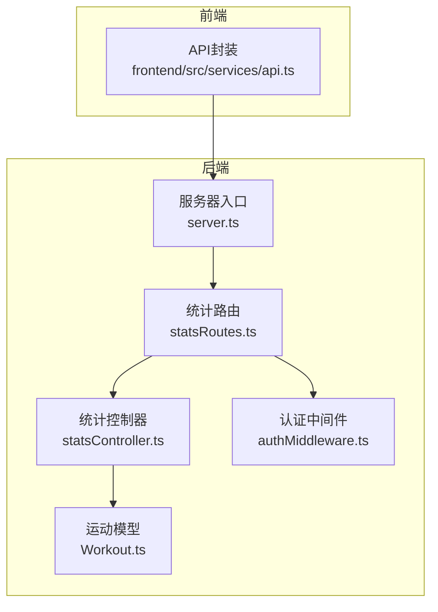
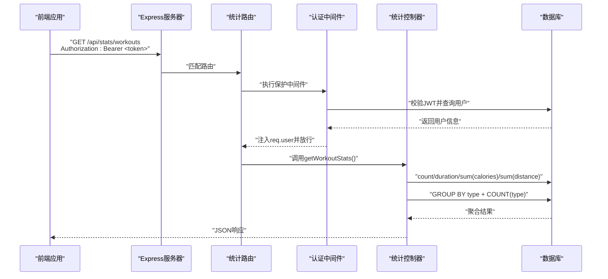
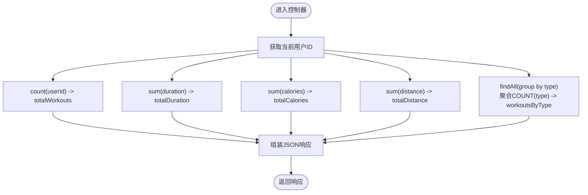
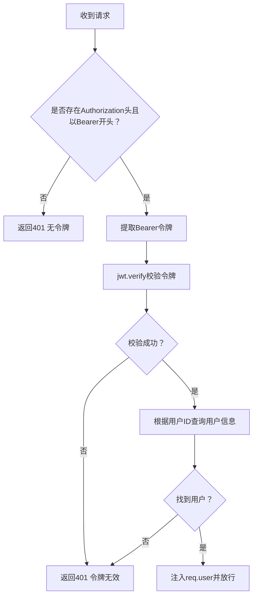
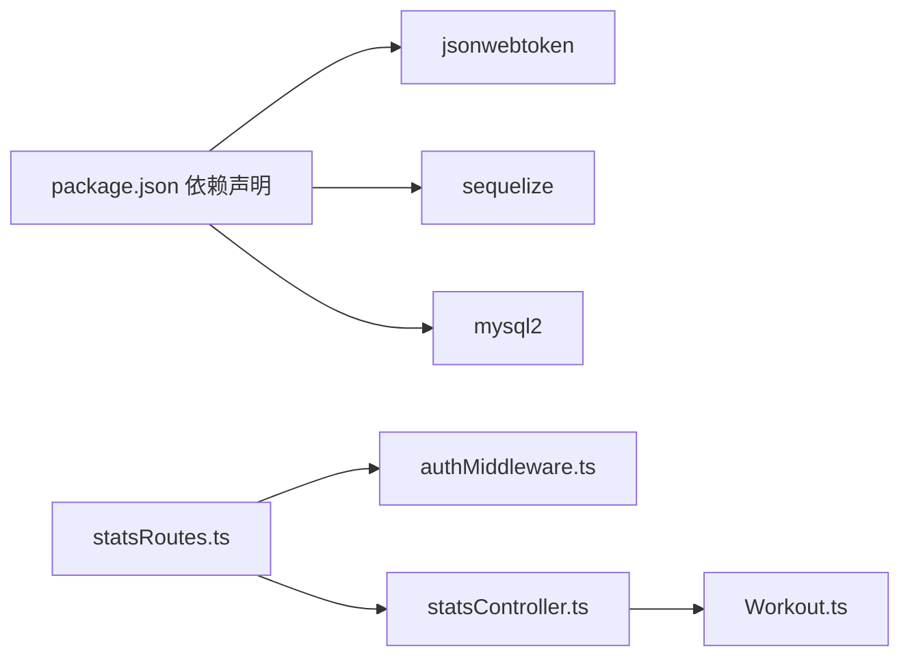

# 总体统计API

<cite>
**本文引用的文件**
- [backend/src/controllers/statsController.ts](file://backend/src/controllers/statsController.ts)
- [backend/src/routes/statsRoutes.ts](file://backend/src/routes/statsRoutes.ts)
- [backend/src/middleware/authMiddleware.ts](file://backend/src/middleware/authMiddleware.ts)
- [backend/src/models/Workout.ts](file://backend/src/models/Workout.ts)
- [backend/src/server.ts](file://backend/src/server.ts)
- [backend/package.json](file://backend/package.json)
- [docs/4. API接口文档.md](file://docs/4. API接口文档.md)
- [frontend/src/services/api.ts](file://frontend/src/services/api.ts)
</cite>

## 目录
1. [简介](#简介)
2. [项目结构](#项目结构)
3. [核心组件](#核心组件)
4. [架构总览](#架构总览)
5. [详细组件分析](#详细组件分析)
6. [依赖关系分析](#依赖关系分析)
7. [性能考虑](#性能考虑)
8. [故障排查指南](#故障排查指南)
9. [结论](#结论)
10. [附录](#附录)

## 简介
本文件为 GET /api/stats/workouts 端点的详细API文档，重点说明：
- 身份验证与访问控制：需要携带有效的JWT Bearer令牌，由保护中间件完成校验。
- 返回的JSON结构：包含总运动次数、总时长（分钟）、总消耗卡路里、总距离（公里）以及按运动类型分组的统计。
- 后端数据聚合逻辑：基于Sequelize的count()与sum()聚合函数，以及GROUP BY查询。
- 高并发优化建议：在不修改现有代码的前提下，可在应用层引入Redis缓存统计结果（例如设置10分钟过期），以降低数据库压力。

## 项目结构
该端点属于后端统计模块，涉及路由、控制器、中间件与模型四个层面，同时通过Express服务器挂载到统一的API路径上。

图表来源
- [backend/src/server.ts](file://backend/src/server.ts#L1-L36)
- [backend/src/routes/statsRoutes.ts](file://backend/src/routes/statsRoutes.ts#L1-L10)
- [backend/src/controllers/statsController.ts](file://backend/src/controllers/statsController.ts#L1-L119)
- [backend/src/middleware/authMiddleware.ts](file://backend/src/middleware/authMiddleware.ts#L1-L36)
- [backend/src/models/Workout.ts](file://backend/src/models/Workout.ts#L1-L122)
- [frontend/src/services/api.ts](file://frontend/src/services/api.ts#L1-L61)

章节来源
- [backend/src/server.ts](file://backend/src/server.ts#L1-L36)
- [backend/src/routes/statsRoutes.ts](file://backend/src/routes/statsRoutes.ts#L1-L10)

## 核心组件
- 路由层：定义 /api/stats/workouts 的GET请求，绑定保护中间件与控制器方法。
- 控制器层：执行统计聚合查询，组装并返回JSON响应。
- 中间件层：JWT Bearer令牌校验，注入用户信息到请求对象。
- 模型层：Workout模型提供聚合查询能力（count、sum、group by）。
- 前端集成：通过拦截器自动附加Authorization头，调用 /api/stats/workouts。

章节来源
- [backend/src/routes/statsRoutes.ts](file://backend/src/routes/statsRoutes.ts#L1-L10)
- [backend/src/controllers/statsController.ts](file://backend/src/controllers/statsController.ts#L1-L119)
- [backend/src/middleware/authMiddleware.ts](file://backend/src/middleware/authMiddleware.ts#L1-L36)
- [backend/src/models/Workout.ts](file://backend/src/models/Workout.ts#L1-L122)
- [frontend/src/services/api.ts](file://frontend/src/services/api.ts#L1-L61)

## 架构总览
以下序列图展示了从客户端到数据库的完整调用链，包括JWT校验与统计聚合流程。

图表来源
- [backend/src/server.ts](file://backend/src/server.ts#L1-L36)
- [backend/src/routes/statsRoutes.ts](file://backend/src/routes/statsRoutes.ts#L1-L10)
- [backend/src/middleware/authMiddleware.ts](file://backend/src/middleware/authMiddleware.ts#L1-L36)
- [backend/src/controllers/statsController.ts](file://backend/src/controllers/statsController.ts#L1-L119)
- [backend/src/models/Workout.ts](file://backend/src/models/Workout.ts#L1-L122)
- [frontend/src/services/api.ts](file://frontend/src/services/api.ts#L1-L61)

## 详细组件分析

### 接口定义与访问控制
- 请求方法与路径：GET /api/stats/workouts
- 认证方式：Bearer JWT令牌，必须通过保护中间件校验
- 访问权限：私有接口，仅限已登录用户
- 请求头示例：
  - Authorization: Bearer <你的JWT令牌>

章节来源
- [docs/4. API接口文档.md](file://docs/4. API接口文档.md#L232-L249)
- [backend/src/routes/statsRoutes.ts](file://backend/src/routes/statsRoutes.ts#L1-L10)
- [backend/src/middleware/authMiddleware.ts](file://backend/src/middleware/authMiddleware.ts#L1-L36)
- [frontend/src/services/api.ts](file://frontend/src/services/api.ts#L55-L61)

### 返回的JSON结构
- 字段说明
  - totalWorkouts: number —— 当前用户的总运动次数
  - totalDuration: number —— 当前用户的总运动时长（单位：分钟）
  - totalCalories: number —— 当前用户的总消耗卡路里
  - totalDistance: number —— 当前用户的总距离（单位：公里）
  - workoutsByType: Array —— 按运动类型分组的统计数组，元素包含：
    - type: string —— 运动类型
    - count: number —— 该类型的运动次数

- 响应示例（字段与含义见上）
  - 示例结构参考：[响应示例](file://docs/4. API接口文档.md#L241-L248)

章节来源
- [backend/src/controllers/statsController.ts](file://backend/src/controllers/statsController.ts#L1-L119)
- [docs/4. API接口文档.md](file://docs/4. API接口文档.md#L232-L249)

### 数据聚合逻辑（Sequelize）
控制器通过以下步骤完成聚合：
- 使用Workout.count()统计当前用户的运动总次数
- 使用Workout.sum('duration')、Workout.sum('calories')、Workout.sum('distance')分别计算总时长、总消耗卡路里与总距离
- 使用Workout.findAll()配合GROUP BY type与COUNT(type)得到各运动类型的数量分布

图表来源
- [backend/src/controllers/statsController.ts](file://backend/src/controllers/statsController.ts#L1-L119)
- [backend/src/models/Workout.ts](file://backend/src/models/Workout.ts#L1-L122)

章节来源
- [backend/src/controllers/statsController.ts](file://backend/src/controllers/statsController.ts#L1-L119)
- [backend/src/models/Workout.ts](file://backend/src/models/Workout.ts#L1-L122)

### 认证中间件与JWT校验
- 中间件逻辑
  - 从Authorization头解析Bearer令牌
  - 使用JWT密钥验证令牌有效性
  - 通过用户ID查询用户信息并注入到req.user
  - 若无令牌或校验失败，返回401未授权错误

图表来源
- [backend/src/middleware/authMiddleware.ts](file://backend/src/middleware/authMiddleware.ts#L1-L36)

章节来源
- [backend/src/middleware/authMiddleware.ts](file://backend/src/middleware/authMiddleware.ts#L1-L36)

### 路由与服务器挂载
- 路由定义：在statsRoutes中将GET /api/stats/workouts绑定到protect中间件与getWorkoutStats控制器
- 服务器挂载：在server.ts中将 /api/stats 路由挂载到应用

章节来源
- [backend/src/routes/statsRoutes.ts](file://backend/src/routes/statsRoutes.ts#L1-L10)
- [backend/src/server.ts](file://backend/src/server.ts#L1-L36)

## 依赖关系分析
- 外部依赖
  - jsonwebtoken：用于JWT令牌的签名与验证
  - sequelize：ORM与聚合查询支持
  - mysql2：MySQL驱动
- 内部依赖
  - statsRoutes依赖authMiddleware与statsController
  - statsController依赖Workout模型与User模型（用于中间件校验）

图表来源
- [backend/package.json](file://backend/package.json#L1-L35)
- [backend/src/routes/statsRoutes.ts](file://backend/src/routes/statsRoutes.ts#L1-L10)
- [backend/src/controllers/statsController.ts](file://backend/src/controllers/statsController.ts#L1-L119)
- [backend/src/middleware/authMiddleware.ts](file://backend/src/middleware/authMiddleware.ts#L1-L36)
- [backend/src/models/Workout.ts](file://backend/src/models/Workout.ts#L1-L122)

章节来源
- [backend/package.json](file://backend/package.json#L1-L35)

## 性能考虑
- 当前实现
  - 控制器直接对数据库执行多次聚合查询，逻辑清晰但可能在高并发场景下增加数据库负载。
- 可选优化（应用层缓存）
  - 在不修改现有控制器逻辑的前提下，可在应用层引入Redis缓存：
    - 缓存键命名建议：stats:user:{userId}:workouts
    - 过期时间：10分钟
    - 命中则直接返回缓存；未命中再执行数据库查询并写入缓存
  - 该优化策略无需改动JWT校验、路由或模型代码，仅需在控制器中增加缓存读写逻辑即可。
- 其他建议
  - 对高频访问的统计接口，可考虑在网关层或反向代理层做简单缓存（如Nginx缓存）。
  - 如业务允许，可将统计结果异步生成并落库，前端轮询或推送更新。

[本节为通用性能建议，不直接分析具体文件，故无章节来源]

## 故障排查指南
- 401 未授权
  - 症状：返回“未授权，无令牌”或“未授权，令牌失败”
  - 排查要点：
    - 确认请求头是否包含Authorization: Bearer <token>
    - 确认令牌未过期且签名正确
    - 确认用户ID对应的用户存在
- 500 服务器错误
  - 症状：返回“服务器错误”
  - 排查要点：
    - 检查数据库连接状态
    - 检查Workout模型字段与表结构一致性
    - 查看后端日志定位异常堆栈
- 响应字段缺失或为空
  - 症状：totalWorkouts等字段为0或缺少某些字段
  - 排查要点：
    - 确认当前用户是否存在运动记录
    - 确认distance字段允许为空时的默认行为

章节来源
- [backend/src/middleware/authMiddleware.ts](file://backend/src/middleware/authMiddleware.ts#L1-L36)
- [backend/src/controllers/statsController.ts](file://backend/src/controllers/statsController.ts#L1-L119)

## 结论
GET /api/stats/workouts端点通过JWT保护中间件确保访问安全，控制器使用Sequelize聚合函数完成高效的数据统计。返回的JSON结构清晰直观，便于前端展示。在高并发场景下，建议在应用层引入Redis缓存（如10分钟过期）以减轻数据库压力，且无需修改现有JWT、路由与模型代码。

[本节为总结性内容，不直接分析具体文件，故无章节来源]

## 附录

### API调用流程（代码级）
- 前端通过拦截器自动附加Authorization头，调用 /api/stats/workouts
- Express服务器挂载stats路由
- 路由绑定protect中间件与getWorkoutStats
- 控制器执行count/sum/group by聚合查询
- 返回JSON响应

章节来源
- [frontend/src/services/api.ts](file://frontend/src/services/api.ts#L55-L61)
- [backend/src/server.ts](file://backend/src/server.ts#L1-L36)
- [backend/src/routes/statsRoutes.ts](file://backend/src/routes/statsRoutes.ts#L1-L10)
- [backend/src/controllers/statsController.ts](file://backend/src/controllers/statsController.ts#L1-L119)