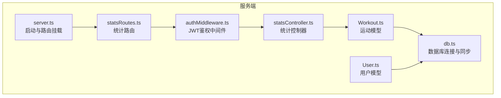
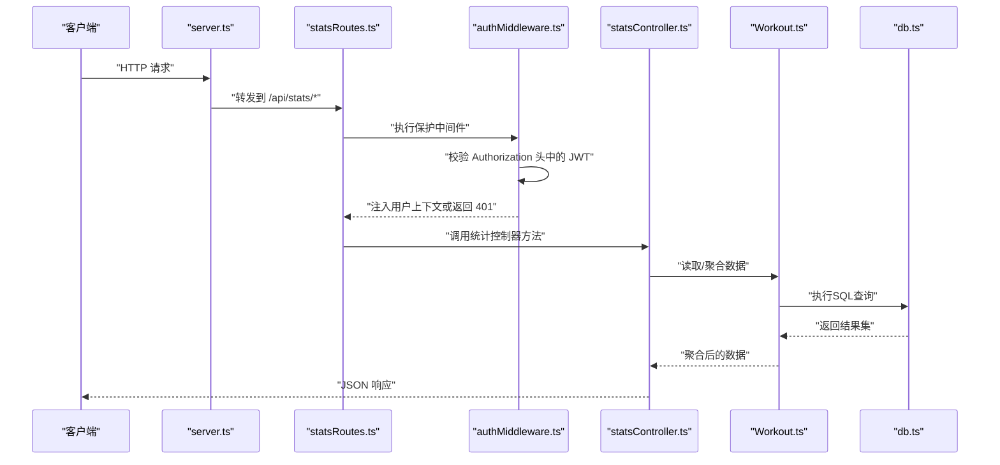
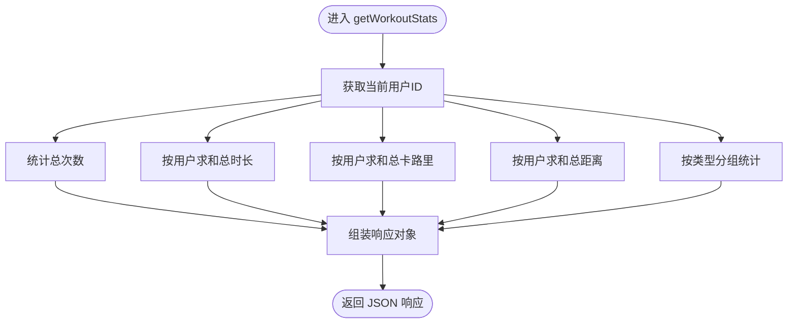
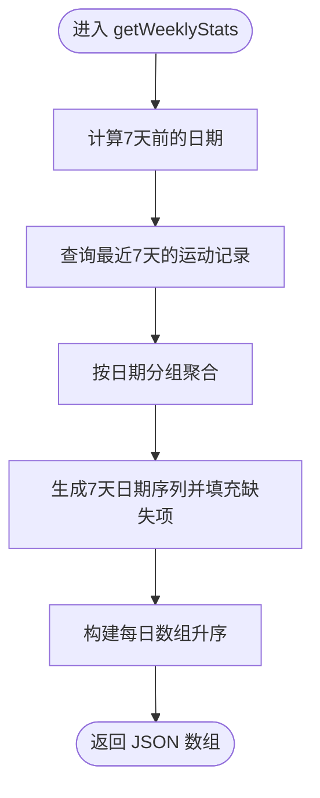
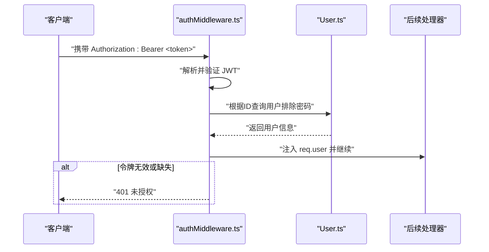
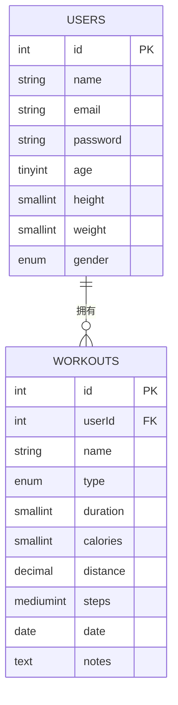
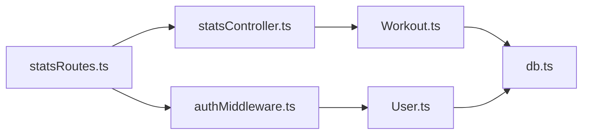

# 统计API

<cite>
**本文引用的文件**
- [backend/src/server.ts](file://backend/src/server.ts)
- [backend/src/routes/statsRoutes.ts](file://backend/src/routes/statsRoutes.ts)
- [backend/src/controllers/statsController.ts](file://backend/src/controllers/statsController.ts)
- [backend/src/middleware/authMiddleware.ts](file://backend/src/middleware/authMiddleware.ts)
- [backend/src/models/Workout.ts](file://backend/src/models/Workout.ts)
- [backend/src/models/User.ts](file://backend/src/models/User.ts)
- [backend/src/config/db.ts](file://backend/src/config/db.ts)
- [docs/4. API接口文档.md](file://docs/4. API接口文档.md)
</cite>

## 目录
1. [简介](#简介)
2. [项目结构](#项目结构)
3. [核心组件](#核心组件)
4. [架构总览](#架构总览)
5. [详细组件分析](#详细组件分析)
6. [依赖关系分析](#依赖关系分析)
7. [性能与优化](#性能与优化)
8. [故障排查指南](#故障排查指南)
9. [结论](#结论)
10. [附录](#附录)

## 简介
本文件面向“统计API”的使用与实现，重点覆盖以下两个端点：
- GET /api/stats/workouts：总体统计（总次数、总时长、总卡路里、总距离、按类型分组统计）
- GET /api/stats/weekly：周度趋势（过去7天每日运动数据，包含日期与对应指标）

访问控制要求：上述两个端点均需在请求头中携带有效的JWT Bearer令牌，由后端中间件完成校验与用户上下文注入。

## 项目结构
后端采用Express + Sequelize架构，路由集中于各模块路由文件，控制器负责业务处理，中间件统一处理鉴权，模型定义数据库表结构及关联。

图示来源
- [backend/src/server.ts](file://backend/src/server.ts#L1-L36)
- [backend/src/routes/statsRoutes.ts](file://backend/src/routes/statsRoutes.ts#L1-L10)
- [backend/src/controllers/statsController.ts](file://backend/src/controllers/statsController.ts#L1-L119)
- [backend/src/middleware/authMiddleware.ts](file://backend/src/middleware/authMiddleware.ts#L1-L36)
- [backend/src/config/db.ts](file://backend/src/config/db.ts#L1-L41)
- [backend/src/models/User.ts](file://backend/src/models/User.ts#L1-L119)
- [backend/src/models/Workout.ts](file://backend/src/models/Workout.ts#L1-L122)

章节来源
- [backend/src/server.ts](file://backend/src/server.ts#L1-L36)
- [backend/src/routes/statsRoutes.ts](file://backend/src/routes/statsRoutes.ts#L1-L10)

## 核心组件
- 路由层：在服务启动时挂载统计路由，并为每个端点绑定保护中间件。
- 中间件层：校验Authorization头中的JWT令牌，解析用户信息并注入到请求对象，失败则返回未授权。
- 控制器层：实现总体统计与周度统计的聚合逻辑，返回标准化JSON响应。
- 模型层：Workout模型定义字段与约束，User模型定义用户属性；二者通过外键建立一对多关系。

章节来源
- [backend/src/routes/statsRoutes.ts](file://backend/src/routes/statsRoutes.ts#L1-L10)
- [backend/src/middleware/authMiddleware.ts](file://backend/src/middleware/authMiddleware.ts#L1-L36)
- [backend/src/controllers/statsController.ts](file://backend/src/controllers/statsController.ts#L1-L119)
- [backend/src/models/Workout.ts](file://backend/src/models/Workout.ts#L1-L122)
- [backend/src/models/User.ts](file://backend/src/models/User.ts#L1-L119)

## 架构总览
下图展示了从客户端到数据库的完整调用链路，以及JWT鉴权在其中的位置。

图示来源
- [backend/src/server.ts](file://backend/src/server.ts#L1-L36)
- [backend/src/routes/statsRoutes.ts](file://backend/src/routes/statsRoutes.ts#L1-L10)
- [backend/src/middleware/authMiddleware.ts](file://backend/src/middleware/authMiddleware.ts#L1-L36)
- [backend/src/controllers/statsController.ts](file://backend/src/controllers/statsController.ts#L1-L119)
- [backend/src/models/Workout.ts](file://backend/src/models/Workout.ts#L1-L122)
- [backend/src/config/db.ts](file://backend/src/config/db.ts#L1-L41)

## 详细组件分析

### 总体统计：GET /api/stats/workouts
- 功能概述：返回当前用户的历史运动聚合指标，包括总次数、总时长、总卡路里、总距离，以及按运动类型分组的统计。
- 访问控制：需要在请求头添加Authorization: Bearer <token>。
- 返回结构要点：
  - totalWorkouts：运动总次数
  - totalDuration：总时长（分钟）
  - totalCalories：总消耗卡路里
  - totalDistance：总距离（公里）
  - workoutsByType：按type分组的统计，包含type与count
- 实现要点：
  - 使用模型计数与求和函数分别计算总次数、总时长、总卡路里、总距离。
  - 使用分组查询统计各运动类型的出现次数。
  - 异常时返回500与通用错误消息。

图示来源
- [backend/src/controllers/statsController.ts](file://backend/src/controllers/statsController.ts#L10-L56)
- [backend/src/models/Workout.ts](file://backend/src/models/Workout.ts#L1-L122)

章节来源
- [backend/src/controllers/statsController.ts](file://backend/src/controllers/statsController.ts#L10-L56)
- [docs/4. API接口文档.md](file://docs/4. API接口文档.md#L232-L248)

### 周度趋势：GET /api/stats/weekly
- 功能概述：返回过去7天的每日运动数据，包含日期与当日的运动次数、总时长、总卡路里。若某日无记录，则对应指标为0。
- 访问控制：同样需要在请求头添加Authorization: Bearer <token>。
- 返回结构要点：
  - 数组元素为每日记录，每条记录包含date、workouts、duration、calories。
  - 数组按日期升序排列，覆盖最近7天（含当天）。
- 实现要点：
  - 计算7天前的日期并查询该时间点之后的记录。
  - 将结果按日期字符串分组，累加时长与卡路里，计数运动次数。
  - 生成连续7天的日期序列，填充缺失日期的指标为0。
  - 最终按日期升序返回数组。

图示来源
- [backend/src/controllers/statsController.ts](file://backend/src/controllers/statsController.ts#L58-L119)

章节来源
- [backend/src/controllers/statsController.ts](file://backend/src/controllers/statsController.ts#L58-L119)
- [docs/4. API接口文档.md](file://docs/4. API接口文档.md#L250-L275)

### 访问控制与JWT中间件
- 中间件职责：从Authorization头提取Bearer令牌，验证签名并解析用户ID，随后从数据库加载用户信息（排除敏感字段），注入到req.user。
- 失败场景：无令牌或令牌无效时返回401与明确提示。
- 作用范围：统计路由通过protect中间件保护，确保仅认证用户可访问。

图示来源
- [backend/src/middleware/authMiddleware.ts](file://backend/src/middleware/authMiddleware.ts#L1-L36)
- [backend/src/models/User.ts](file://backend/src/models/User.ts#L1-L119)

章节来源
- [backend/src/middleware/authMiddleware.ts](file://backend/src/middleware/authMiddleware.ts#L1-L36)

### 数据模型与关联
- Workout模型字段：包含用户ID、运动名称、类型、时长（分钟）、卡路里、距离（公里）、步数、日期、备注等。
- User与Workout：一对一多关系，Workout.userId指向User.id。
- 关联定义：User.hasMany(Workout)，Workout.belongsTo(User)。

图示来源
- [backend/src/models/User.ts](file://backend/src/models/User.ts#L1-L119)
- [backend/src/models/Workout.ts](file://backend/src/models/Workout.ts#L1-L122)

章节来源
- [backend/src/models/User.ts](file://backend/src/models/User.ts#L1-L119)
- [backend/src/models/Workout.ts](file://backend/src/models/Workout.ts#L1-L122)

## 依赖关系分析
- 路由依赖：statsRoutes依赖authMiddleware与statsController。
- 控制器依赖：statsController依赖Workout模型与Sequelize操作（count、sum、findAll、group等）。
- 中间件依赖：authMiddleware依赖jsonwebtoken与User模型。
- 数据库：db.ts提供Sequelize实例，User与Workout模型通过Sequelize初始化并建立关联。

图示来源
- [backend/src/routes/statsRoutes.ts](file://backend/src/routes/statsRoutes.ts#L1-L10)
- [backend/src/middleware/authMiddleware.ts](file://backend/src/middleware/authMiddleware.ts#L1-L36)
- [backend/src/controllers/statsController.ts](file://backend/src/controllers/statsController.ts#L1-L119)
- [backend/src/models/Workout.ts](file://backend/src/models/Workout.ts#L1-L122)
- [backend/src/models/User.ts](file://backend/src/models/User.ts#L1-L119)
- [backend/src/config/db.ts](file://backend/src/config/db.ts#L1-L41)

章节来源
- [backend/src/server.ts](file://backend/src/server.ts#L1-L36)
- [backend/src/routes/statsRoutes.ts](file://backend/src/routes/statsRoutes.ts#L1-L10)
- [backend/src/middleware/authMiddleware.ts](file://backend/src/middleware/authMiddleware.ts#L1-L36)
- [backend/src/controllers/statsController.ts](file://backend/src/controllers/statsController.ts#L1-L119)
- [backend/src/models/Workout.ts](file://backend/src/models/Workout.ts#L1-L122)
- [backend/src/models/User.ts](file://backend/src/models/User.ts#L1-L119)
- [backend/src/config/db.ts](file://backend/src/config/db.ts#L1-L41)

## 性能与优化
- 查询层面
  - 总体统计：使用count、sum等聚合函数一次性完成，避免全量扫描，复杂度低。
  - 周度统计：先筛选7天范围再聚合，减少数据量；按日期分组聚合后填充空缺日期，保证前端图表连续性。
- 缓存策略建议
  - 对于高频读取且不频繁变化的数据，可在应用层引入短期缓存（如内存缓存或Redis），设置合理TTL，降低数据库压力。
  - 对于周度趋势，可按用户ID+日期范围作为缓存键，命中则直接返回，未命中再执行查询并写入缓存。
- 数据库索引
  - 在Workout.userId与Workout.date上建立复合索引，可显著提升按用户与日期范围查询的性能。
- 分页与批量
  - 若未来数据规模增长，可考虑分页或批量导出机制，避免单次查询过大。
- 日志与监控
  - 可开启数据库日志（在开发环境）观察SQL执行计划，定位慢查询；生产环境结合监控工具观察QPS与延迟。

[本节为通用性能建议，不直接分析具体文件，故无章节来源]

## 故障排查指南
- 401 未授权
  - 现象：返回“未授权，token失败”或“未授权，无token”。
  - 排查：确认请求头是否包含Authorization: Bearer <token>；检查JWT签名与过期时间；核对JWT_SECRET配置。
- 500 服务器错误
  - 现象：总体统计或周度统计返回通用错误消息。
  - 排查：查看服务端日志定位异常；检查数据库连接状态与权限；确认Workout模型字段与查询条件正确。
- 数据不一致
  - 现象：周度统计缺失某些日期或指标为0。
  - 排查：确认查询日期范围是否正确；检查数据库中是否存在该日期的记录；确认日期字段与时区设置。

章节来源
- [backend/src/middleware/authMiddleware.ts](file://backend/src/middleware/authMiddleware.ts#L1-L36)
- [backend/src/controllers/statsController.ts](file://backend/src/controllers/statsController.ts#L1-L119)
- [backend/src/config/db.ts](file://backend/src/config/db.ts#L1-L41)

## 结论
本统计API通过简洁的JWT保护与高效的Sequelize聚合查询，提供了用户运动历史的总体概览与周度趋势。总体统计适合快速看板展示，周度统计便于绘制趋势图表。建议在生产环境中配合缓存与索引优化，持续监控查询性能与稳定性。

[本节为总结性内容，不直接分析具体文件，故无章节来源]

## 附录

### 接口规范与示例
- 认证方式
  - 请求头：Authorization: Bearer <token>
- 总体统计
  - 方法与路径：GET /api/stats/workouts
  - 响应字段：totalWorkouts、totalDuration、totalCalories、totalDistance、workoutsByType[]
  - 示例结构参考：[docs/4. API接口文档.md](file://docs/4. API接口文档.md#L232-L248)
- 周度统计
  - 方法与路径：GET /api/stats/weekly
  - 响应字段：数组元素包含date、workouts、duration、calories
  - 示例结构参考：[docs/4. API接口文档.md](file://docs/4. API接口文档.md#L250-L275)

章节来源
- [docs/4. API接口文档.md](file://docs/4. API接口文档.md#L232-L275)

### SQL聚合逻辑说明（基于Sequelize）
- 总体统计
  - 计数：Workout.count({ where: { userId } })
  - 求和：Workout.sum('duration'|'calories'|'distance', { where: { userId } })
  - 分组：Workout.findAll({ attributes: ['type', fn('COUNT', col('type'))], group: ['type'], where })
- 周度统计
  - 查询：Workout.findAll({ where: { userId, date: { [Op.gte]: oneWeekAgo } }, order: [['date', 'ASC']] })
  - 聚合：按日期字符串分组，累加duration、calories，计数workouts
  - 填充：生成7天日期序列，缺失日期指标置0

章节来源
- [backend/src/controllers/statsController.ts](file://backend/src/controllers/statsController.ts#L10-L119)
- [backend/src/models/Workout.ts](file://backend/src/models/Workout.ts#L1-L122)