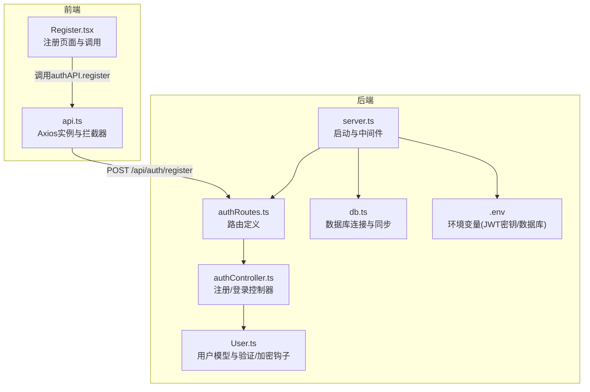
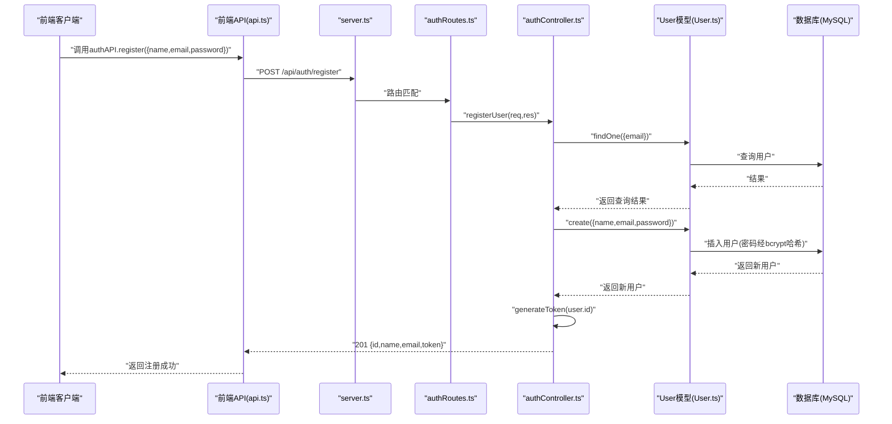
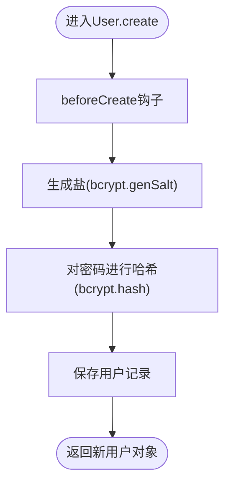
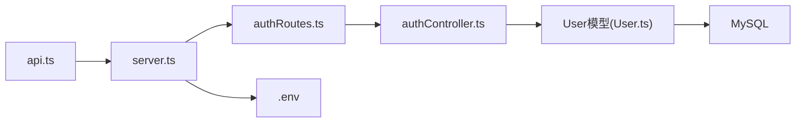

# 用户注册API

<cite>
**本文引用的文件**
- [backend/src/controllers/authController.ts](file://backend/src/controllers/authController.ts)
- [backend/src/models/User.ts](file://backend/src/models/User.ts)
- [backend/src/routes/authRoutes.ts](file://backend/src/routes/authRoutes.ts)
- [backend/src/server.ts](file://backend/src/server.ts)
- [backend/src/config/db.ts](file://backend/src/config/db.ts)
- [backend/.env](file://backend/.env)
- [docs/4. API接口文档.md](file://docs/4. API接口文档.md)
- [frontend/src/services/api.ts](file://frontend/src/services/api.ts)
- [frontend/src/pages/Register.tsx](file://frontend/src/pages/Register.tsx)
- [tests/test-api.js](file://tests/test-api.js)
</cite>

## 目录
1. [简介](#简介)
2. [项目结构](#项目结构)
3. [核心组件](#核心组件)
4. [架构概览](#架构概览)
5. [详细组件分析](#详细组件分析)
6. [依赖关系分析](#依赖关系分析)
7. [性能与安全考虑](#性能与安全考虑)
8. [故障排查指南](#故障排查指南)
9. [结论](#结论)
10. [附录](#附录)

## 简介
本文件面向前端与后端开发者，聚焦于用户注册API的POST /api/auth/register端点。内容涵盖：
- 请求体字段格式与验证规则（邮箱格式、密码最小长度等）
- 成功响应（HTTP 201）返回的用户信息与JWT令牌结构
- 错误状态码说明（400、409可选扩展、500）
- curl与Axios示例
- User模型的create调用链与bcrypt密码加密机制
- 错误处理流程与安全性建议（HTTPS、敏感信息保护）

## 项目结构
后端采用Express + Sequelize + MySQL架构，路由位于routes目录，控制器位于controllers目录，模型位于models目录，数据库连接与同步逻辑位于config目录。前端通过Axios封装统一的API调用，并在请求头中携带JWT令牌。

图表来源
- [backend/src/server.ts](file://backend/src/server.ts#L1-L36)
- [backend/src/routes/authRoutes.ts](file://backend/src/routes/authRoutes.ts#L1-L9)
- [backend/src/controllers/authController.ts](file://backend/src/controllers/authController.ts#L1-L71)
- [backend/src/models/User.ts](file://backend/src/models/User.ts#L1-L119)
- [backend/src/config/db.ts](file://backend/src/config/db.ts#L1-L41)
- [backend/.env](file://backend/.env#L1-L10)
- [frontend/src/services/api.ts](file://frontend/src/services/api.ts#L1-L61)
- [frontend/src/pages/Register.tsx](file://frontend/src/pages/Register.tsx#L1-L74)

章节来源
- [backend/src/server.ts](file://backend/src/server.ts#L1-L36)
- [backend/src/routes/authRoutes.ts](file://backend/src/routes/authRoutes.ts#L1-L9)
- [backend/src/controllers/authController.ts](file://backend/src/controllers/authController.ts#L1-L71)
- [backend/src/models/User.ts](file://backend/src/models/User.ts#L1-L119)
- [backend/src/config/db.ts](file://backend/src/config/db.ts#L1-L41)
- [backend/.env](file://backend/.env#L1-L10)
- [frontend/src/services/api.ts](file://frontend/src/services/api.ts#L1-L61)
- [frontend/src/pages/Register.tsx](file://frontend/src/pages/Register.tsx#L1-L74)

## 核心组件
- 路由层：在authRoutes中定义POST /api/auth/register，映射到控制器的registerUser方法。
- 控制器层：registerUser负责接收请求体、检查用户是否存在、创建用户、生成JWT并返回201响应。
- 模型层：User模型定义字段与验证规则；beforeCreate与beforeUpdate钩子使用bcrypt对密码进行加盐哈希。
- 服务器层：server.ts配置CORS、JSON解析、路由挂载与数据库连接。
- 配置层：.env提供JWT_SECRET与数据库连接信息；db.ts负责连接与模型同步。

章节来源
- [backend/src/routes/authRoutes.ts](file://backend/src/routes/authRoutes.ts#L1-L9)
- [backend/src/controllers/authController.ts](file://backend/src/controllers/authController.ts#L1-L71)
- [backend/src/models/User.ts](file://backend/src/models/User.ts#L1-L119)
- [backend/src/server.ts](file://backend/src/server.ts#L1-L36)
- [backend/.env](file://backend/.env#L1-L10)
- [backend/src/config/db.ts](file://backend/src/config/db.ts#L1-L41)

## 架构概览
POST /api/auth/register的端到端调用序列如下：

图表来源
- [frontend/src/services/api.ts](file://frontend/src/services/api.ts#L1-L61)
- [backend/src/server.ts](file://backend/src/server.ts#L1-L36)
- [backend/src/routes/authRoutes.ts](file://backend/src/routes/authRoutes.ts#L1-L9)
- [backend/src/controllers/authController.ts](file://backend/src/controllers/authController.ts#L1-L71)
- [backend/src/models/User.ts](file://backend/src/models/User.ts#L1-L119)

## 详细组件分析

### 接口定义与请求体规范
- URL: POST /api/auth/register
- 内容类型: application/json
- 请求体字段
  - name: 字符串，必填
  - email: 字符串，必填，需符合邮箱格式
  - password: 字符串，必填，长度范围为6到100个字符
- 响应
  - 201 Created: 返回用户标识、用户名、邮箱与JWT令牌
  - 400 Bad Request: 用户已存在或数据无效
  - 500 Internal Server Error: 服务器内部错误

章节来源
- [docs/4. API接口文档.md](file://docs/4. API接口文档.md#L7-L26)
- [backend/src/controllers/authController.ts](file://backend/src/controllers/authController.ts#L12-L46)
- [backend/src/models/User.ts](file://backend/src/models/User.ts#L53-L67)

### 请求体验证规则与模型约束
- 邮箱格式校验：模型层使用Sequelize内置验证isEmail
- 密码长度校验：模型层使用len:[6,100]
- 唯一性约束：email字段声明唯一索引
- 前端补充校验：前端注册页在提交前校验两次密码一致性

章节来源
- [backend/src/models/User.ts](file://backend/src/models/User.ts#L53-L67)
- [frontend/src/pages/Register.tsx](file://frontend/src/pages/Register.tsx#L21-L33)

### 成功响应结构与JWT令牌
- 成功响应（201）包含：
  - id: 用户标识
  - name: 用户名
  - email: 邮箱
  - token: JWT令牌（有效期30天）
- JWT密钥来自环境变量JWT_SECRET

章节来源
- [backend/src/controllers/authController.ts](file://backend/src/controllers/authController.ts#L33-L40)
- [backend/.env](file://backend/.env#L1-L10)

### 错误状态码与含义
- 400 Bad Request
  - 用户已存在：控制器在创建前先查询邮箱是否已存在
  - 数据无效：创建失败或请求体缺失关键字段
- 409 Conflict（可选扩展）
  - 当前实现未显式返回409；如需扩展，可在邮箱唯一约束冲突时返回409
- 500 Internal Server Error
  - 数据库异常、JWT签名异常或未知异常

章节来源
- [backend/src/controllers/authController.ts](file://backend/src/controllers/authController.ts#L19-L46)
- [backend/src/config/db.ts](file://backend/src/config/db.ts#L25-L38)

### curl示例
- 使用curl向注册端点发送JSON请求（请替换为实际值）
  - curl -X POST http://localhost:3001/api/auth/register -H "Content-Type: application/json" -d '{"name":"张三","email":"zhangsan@example.com","password":"yourSecurePassword"}'

章节来源
- [tests/test-api.js](file://tests/test-api.js#L16-L28)
- [docs/4. API接口文档.md](file://docs/4. API接口文档.md#L7-L26)

### JavaScript Axios代码片段
- 前端通过api.ts封装的authAPI.register发起请求
  - 参考路径：[frontend/src/services/api.ts](file://frontend/src/services/api.ts#L26-L31)
  - 前端注册页面调用示例：[frontend/src/pages/Register.tsx](file://frontend/src/pages/Register.tsx#L33-L41)

章节来源
- [frontend/src/services/api.ts](file://frontend/src/services/api.ts#L1-L61)
- [frontend/src/pages/Register.tsx](file://frontend/src/pages/Register.tsx#L21-L41)

### User模型的create调用与bcrypt加密机制
- 调用链
  - 控制器调用User.create
  - 模型钩子beforeCreate触发bcrypt加盐与哈希
  - 数据写入数据库
- 加密细节
  - 使用bcrypt.genSalt(10)生成盐
  - 使用bcrypt.hash(明文密码, 盐)生成哈希
  - 更新后的password字段存储为哈希值

图表来源
- [backend/src/controllers/authController.ts](file://backend/src/controllers/authController.ts#L26-L31)
- [backend/src/models/User.ts](file://backend/src/models/User.ts#L103-L115)

章节来源
- [backend/src/controllers/authController.ts](file://backend/src/controllers/authController.ts#L26-L31)
- [backend/src/models/User.ts](file://backend/src/models/User.ts#L103-L115)

## 依赖关系分析
- 组件耦合
  - server.ts集中挂载路由与中间件，authRoutes.ts仅负责路由映射，职责清晰
  - authController.ts依赖User模型与JWT库，但不直接操作数据库
  - User模型依赖Sequelize与bcryptjs，且通过hooks实现横切关注点（密码加密）
- 外部依赖
  - JWT签名密钥来自环境变量
  - 数据库连接信息来自环境变量
  - 前端Axios实例统一管理基础URL与请求头

图表来源
- [backend/src/server.ts](file://backend/src/server.ts#L1-L36)
- [backend/src/routes/authRoutes.ts](file://backend/src/routes/authRoutes.ts#L1-L9)
- [backend/src/controllers/authController.ts](file://backend/src/controllers/authController.ts#L1-L71)
- [backend/src/models/User.ts](file://backend/src/models/User.ts#L1-L119)
- [backend/.env](file://backend/.env#L1-L10)
- [frontend/src/services/api.ts](file://frontend/src/services/api.ts#L1-L61)

章节来源
- [backend/src/server.ts](file://backend/src/server.ts#L1-L36)
- [backend/src/routes/authRoutes.ts](file://backend/src/routes/authRoutes.ts#L1-L9)
- [backend/src/controllers/authController.ts](file://backend/src/controllers/authController.ts#L1-L71)
- [backend/src/models/User.ts](file://backend/src/models/User.ts#L1-L119)
- [backend/.env](file://backend/.env#L1-L10)
- [frontend/src/services/api.ts](file://frontend/src/services/api.ts#L1-L61)

## 性能与安全考虑
- 性能
  - 密码哈希使用固定成本（genSalt(10)），属于CPU密集型操作，建议在高并发场景下评估服务器资源与队列策略
  - 数据库唯一索引避免重复邮箱导致的额外查询开销
- 安全
  - 敏感信息传输必须通过HTTPS，防止明文泄露
  - JWT密钥应妥善保管，避免硬编码在源码中
  - 建议启用CORS白名单与安全头（如HSTS、X-Content-Type-Options等）
  - 前端本地存储令牌时建议使用HttpOnly Cookie或更安全的存储方案（视部署环境而定）

[本节为通用指导，无需列出具体文件来源]

## 故障排查指南
- 400 用户已存在
  - 现象：邮箱已被注册
  - 排查：确认邮箱唯一性；检查控制器中的邮箱查询逻辑
  - 参考：[backend/src/controllers/authController.ts](file://backend/src/controllers/authController.ts#L19-L24)
- 400 数据无效
  - 现象：请求体缺失或字段不符合模型验证
  - 排查：核对name/email/password是否满足模型验证；检查前端表单校验
  - 参考：[backend/src/models/User.ts](file://backend/src/models/User.ts#L53-L67)
- 500 服务器内部错误
  - 现象：数据库连接失败、JWT签名失败或未捕获异常
  - 排查：检查数据库连接与同步日志；核对JWT_SECRET；查看服务器日志
  - 参考：[backend/src/config/db.ts](file://backend/src/config/db.ts#L25-L38)，[backend/.env](file://backend/.env#L1-L10)，[backend/src/controllers/authController.ts](file://backend/src/controllers/authController.ts#L43-L46)
- 前端无法访问
  - 现象：跨域或CORS问题
  - 排查：确认server.ts已启用CORS；检查前端baseURL与端口
  - 参考：[backend/src/server.ts](file://backend/src/server.ts#L16-L22)，[frontend/src/services/api.ts](file://frontend/src/services/api.ts#L1-L20)

章节来源
- [backend/src/controllers/authController.ts](file://backend/src/controllers/authController.ts#L19-L46)
- [backend/src/models/User.ts](file://backend/src/models/User.ts#L53-L67)
- [backend/src/config/db.ts](file://backend/src/config/db.ts#L25-L38)
- [backend/.env](file://backend/.env#L1-L10)
- [frontend/src/services/api.ts](file://frontend/src/services/api.ts#L1-L20)

## 结论
POST /api/auth/register端点通过清晰的路由、控制器与模型协作，实现了邮箱唯一性校验、密码长度与格式验证、以及基于bcrypt的密码哈希与JWT签发。结合前端Axios封装与环境变量配置，整体具备良好的可维护性与安全性基础。建议在生产环境中进一步完善错误码扩展（如409）、强化安全头与HTTPS策略，并对高并发场景下的哈希成本进行性能评估。

[本节为总结，无需列出具体文件来源]

## 附录

### API定义与示例
- 接口
  - 方法: POST
  - 路径: /api/auth/register
  - 请求体字段: name, email, password
  - 成功响应: 201 {id, name, email, token}
- 示例
  - curl参考：[tests/test-api.js](file://tests/test-api.js#L16-L28)
  - Axios调用参考：[frontend/src/services/api.ts](file://frontend/src/services/api.ts#L26-L31)

章节来源
- [docs/4. API接口文档.md](file://docs/4. API接口文档.md#L7-L26)
- [tests/test-api.js](file://tests/test-api.js#L16-L28)
- [frontend/src/services/api.ts](file://frontend/src/services/api.ts#L26-L31)