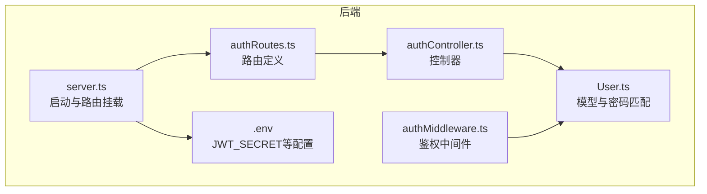
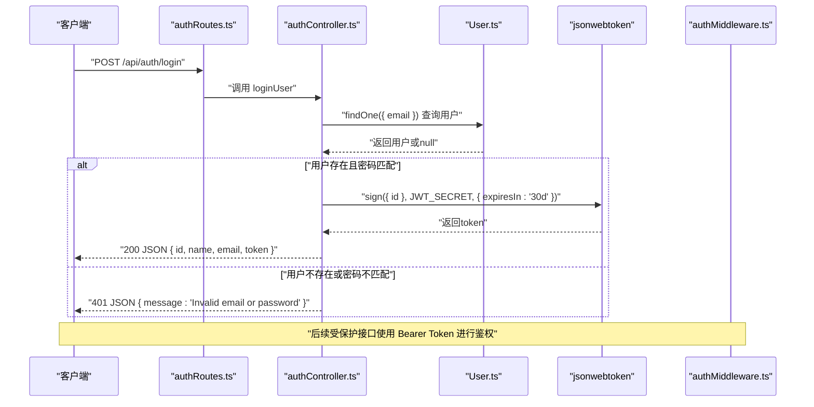
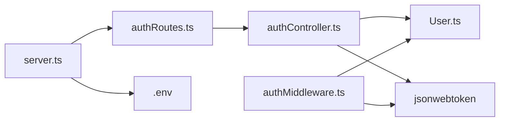

# 用户登录API

<cite>
**本文引用的文件**
- [backend/src/controllers/authController.ts](file://backend/src/controllers/authController.ts)
- [backend/src/models/User.ts](file://backend/src/models/User.ts)
- [backend/src/routes/authRoutes.ts](file://backend/src/routes/authRoutes.ts)
- [backend/src/server.ts](file://backend/src/server.ts)
- [backend/src/middleware/authMiddleware.ts](file://backend/src/middleware/authMiddleware.ts)
- [backend/.env](file://backend/.env)
- [docs/4. API接口文档.md](file://docs/4. API接口文档.md)
- [frontend/src/services/api.ts](file://frontend/src/services/api.ts)
- [frontend/src/pages/Login.tsx](file://frontend/src/pages/Login.tsx)
- [tests/test-api.js](file://tests/test-api.js)
</cite>

## 目录
1. [简介](#简介)
2. [项目结构](#项目结构)
3. [核心组件](#核心组件)
4. [架构总览](#架构总览)
5. [详细组件分析](#详细组件分析)
6. [依赖关系分析](#依赖关系分析)
7. [性能考虑](#性能考虑)
8. [故障排查指南](#故障排查指南)
9. [结论](#结论)
10. [附录](#附录)

## 简介
本文件面向“用户登录API”的POST /api/auth/login端点，提供从请求到响应、从验证到令牌签发的完整说明。重点涵盖：
- 请求体字段与验证逻辑：仅需email与password；通过Sequelize查询用户存在性，并调用User模型的matchPassword进行密码比对。
- 成功认证后的响应：返回用户基本信息与有效期为30天的JWT令牌。
- 状态码定义：200成功、401认证失败（邮箱或密码错误）、500服务器错误。
- 调用示例：提供curl与Axios两种方式。
- 安全要点：generateToken使用jsonwebtoken库签发令牌，JWT_SECRET环境变量的重要性。

## 项目结构
后端采用Express + TypeScript + Sequelize + jsonwebtoken的典型分层架构：
- 路由层：定义/api/auth/login等路由
- 控制器层：处理业务逻辑（登录、注册）
- 模型层：User模型及密码加盐哈希、匹配逻辑
- 中间件层：鉴权中间件，校验JWT并注入用户信息
- 服务启动：加载环境变量、连接数据库、挂载路由

图表来源
- [backend/src/server.ts](file://backend/src/server.ts#L1-L36)
- [backend/src/routes/authRoutes.ts](file://backend/src/routes/authRoutes.ts#L1-L9)
- [backend/src/controllers/authController.ts](file://backend/src/controllers/authController.ts#L1-L71)
- [backend/src/models/User.ts](file://backend/src/models/User.ts#L1-L119)
- [backend/src/middleware/authMiddleware.ts](file://backend/src/middleware/authMiddleware.ts#L1-L36)
- [backend/.env](file://backend/.env#L1-L10)

章节来源
- [backend/src/server.ts](file://backend/src/server.ts#L1-L36)
- [backend/src/routes/authRoutes.ts](file://backend/src/routes/authRoutes.ts#L1-L9)

## 核心组件
- 路由：在/authRoutes.ts中将POST /api/auth/login映射到loginUser控制器。
- 控制器：loginUser负责解析请求体、查询用户、调用matchPassword比对密码、成功时生成JWT并返回用户信息。
- 模型：User模型提供matchPassword使用bcrypt比较输入密码与数据库中已加密的密码。
- 中间件：protect中间件用于校验JWT，验证通过后将用户信息注入请求对象。
- 环境：JWT_SECRET来自.env文件，用于签名与验证JWT。

章节来源
- [backend/src/routes/authRoutes.ts](file://backend/src/routes/authRoutes.ts#L1-L9)
- [backend/src/controllers/authController.ts](file://backend/src/controllers/authController.ts#L48-L71)
- [backend/src/models/User.ts](file://backend/src/models/User.ts#L35-L38)
- [backend/src/middleware/authMiddleware.ts](file://backend/src/middleware/authMiddleware.ts#L9-L36)
- [backend/.env](file://backend/.env#L1-L10)

## 架构总览
登录流程的端到端序列如下：

图表来源
- [backend/src/routes/authRoutes.ts](file://backend/src/routes/authRoutes.ts#L1-L9)
- [backend/src/controllers/authController.ts](file://backend/src/controllers/authController.ts#L48-L71)
- [backend/src/models/User.ts](file://backend/src/models/User.ts#L35-L38)
- [backend/src/middleware/authMiddleware.ts](file://backend/src/middleware/authMiddleware.ts#L9-L36)
- [backend/.env](file://backend/.env#L1-L10)

## 详细组件分析

### 登录端点：POST /api/auth/login
- 请求方法与路径：POST /api/auth/login
- 请求体字段：
  - email：字符串，必须
  - password：字符串，必须
- 验证逻辑：
  - 使用Sequelize查询email对应的用户是否存在。
  - 若存在，则调用User实例方法matchPassword进行密码比对。
  - 匹配成功则生成JWT，否则返回401。
- 成功响应：
  - 返回用户基本信息（id、name、email）与token。
  - token有效期为30天。
- 错误响应：
  - 401：Invalid email or password
  - 500：Server error

章节来源
- [docs/4. API接口文档.md](file://docs/4. API接口文档.md#L28-L46)
- [backend/src/controllers/authController.ts](file://backend/src/controllers/authController.ts#L48-L71)
- [backend/src/models/User.ts](file://backend/src/models/User.ts#L35-L38)

### 令牌签发：generateToken
- 实现位置：控制器内部的generateToken函数。
- 签发细节：
  - 使用jsonwebtoken.sign，载荷为{id}，密钥来自process.env.JWT_SECRET，过期时间为30天。
- 重要性：
  - JWT_SECRET是签发与验证JWT的密钥，必须安全存储且不可泄露。
  - 若未设置该环境变量，代码会回退到固定密钥，存在严重安全风险。

章节来源
- [backend/src/controllers/authController.ts](file://backend/src/controllers/authController.ts#L5-L10)
- [backend/.env](file://backend/.env#L1-L10)

### 密码匹配：User.matchPassword
- 实现位置：User模型的实例方法。
- 行为：使用bcrypt.compare比较输入密码与数据库中已加密的密码。
- 安全性：密码在写入数据库前已通过beforeCreate/beforeUpdate钩子加盐哈希，读取时仅做解密比对。

章节来源
- [backend/src/models/User.ts](file://backend/src/models/User.ts#L35-L38)
- [backend/src/models/User.ts](file://backend/src/models/User.ts#L102-L115)

### 受保护路由与鉴权中间件
- 用途：在受保护接口中校验Authorization: Bearer <token>。
- 校验流程：
  - 从请求头提取Bearer token。
  - 使用jsonwebtoken.verify配合JWT_SECRET验证签名。
  - 通过后根据id查询User并排除password字段，将用户信息注入req.user。
- 失败处理：无token或token无效时返回401。

章节来源
- [backend/src/middleware/authMiddleware.ts](file://backend/src/middleware/authMiddleware.ts#L9-L36)

### 前端集成
- Axios封装：在frontend/src/services/api.ts中统一创建axios实例，并自动在请求头添加Authorization: Bearer token。
- 登录页面：frontend/src/pages/Login.tsx中调用authAPI.login发送登录请求，成功后将token存入localStorage并跳转至仪表盘。

章节来源
- [frontend/src/services/api.ts](file://frontend/src/services/api.ts#L1-L61)
- [frontend/src/pages/Login.tsx](file://frontend/src/pages/Login.tsx#L1-L109)

### API文档对照
- 文档中明确登录端点的请求体为email与password，响应包含id、name、email与token。
- 与实际实现一致。

章节来源
- [docs/4. API接口文档.md](file://docs/4. API接口文档.md#L28-L46)

## 依赖关系分析
- 控制器依赖模型：loginUser依赖User.findOne与User实例的matchPassword。
- 控制器依赖jsonwebtoken：用于签发token。
- 中间件依赖jsonwebtoken与User模型：用于验证token并注入用户。
- 服务器依赖dotenv：加载JWT_SECRET等环境变量。
- 路由依赖控制器：将HTTP请求映射到具体处理函数。

图表来源
- [backend/src/routes/authRoutes.ts](file://backend/src/routes/authRoutes.ts#L1-L9)
- [backend/src/controllers/authController.ts](file://backend/src/controllers/authController.ts#L1-L71)
- [backend/src/models/User.ts](file://backend/src/models/User.ts#L1-L119)
- [backend/src/middleware/authMiddleware.ts](file://backend/src/middleware/authMiddleware.ts#L1-L36)
- [backend/src/server.ts](file://backend/src/server.ts#L1-L36)
- [backend/.env](file://backend/.env#L1-L10)

章节来源
- [backend/src/server.ts](file://backend/src/server.ts#L1-L36)
- [backend/src/controllers/authController.ts](file://backend/src/controllers/authController.ts#L1-L71)
- [backend/src/models/User.ts](file://backend/src/models/User.ts#L1-L119)
- [backend/src/middleware/authMiddleware.ts](file://backend/src/middleware/authMiddleware.ts#L1-L36)

## 性能考虑
- 密码比对：bcrypt.compare为CPU密集型操作，建议避免在高并发场景下重复触发不必要的登录尝试。
- 数据库查询：email字段应建立索引以提升findOne查询效率。
- JWT体积：载荷仅包含id，体积小、解析快，适合频繁访问的受保护接口。
- 缓存策略：可对热点用户信息进行短期缓存，减少数据库压力。

## 故障排查指南
- 401 Invalid email or password
  - 排查步骤：
    - 确认email是否正确拼写且存在于数据库。
    - 确认password与注册时使用的相同（大小写、空格等）。
    - 确认JWT_SECRET已在.env中正确配置且与签发时一致。
    - 检查是否使用了正确的Authorization: Bearer token访问受保护接口。
- 500 Server error
  - 排查步骤：
    - 查看服务器日志定位异常堆栈。
    - 确认数据库连接正常、表结构完整。
    - 检查bcrypt加盐哈希过程是否异常（如磁盘空间不足导致无法生成salt）。
- curl/Axios调用示例参考
  - curl示例：向POST /api/auth/login发送email与password。
  - Axios示例：frontend/src/services/api.ts中的authAPI.login封装了请求体与基础URL。

章节来源
- [backend/src/controllers/authController.ts](file://backend/src/controllers/authController.ts#L48-L71)
- [backend/.env](file://backend/.env#L1-L10)
- [frontend/src/services/api.ts](file://frontend/src/services/api.ts#L1-L61)
- [tests/test-api.js](file://tests/test-api.js#L30-L47)

## 结论
POST /api/auth/login端点通过简洁的请求体与严格的验证流程，实现了安全可靠的用户认证。其关键点在于：
- 仅需email与password两个字段；
- 使用Sequelize查询用户并调用User.matchPassword进行密码比对；
- 成功后返回包含用户信息与30天有效期JWT的JSON；
- 明确的状态码便于客户端与服务端协同处理；
- JWT_SECRET的安全配置是系统安全的基石。

## 附录

### 请求与响应规范
- 请求方法：POST
- 路径：/api/auth/login
- 请求体字段：
  - email：字符串，必填
  - password：字符串，必填
- 成功响应字段：
  - id：数字
  - name：字符串
  - email：字符串
  - token：字符串（JWT，有效期30天）

章节来源
- [docs/4. API接口文档.md](file://docs/4. API接口文档.md#L28-L46)
- [backend/src/controllers/authController.ts](file://backend/src/controllers/authController.ts#L48-L71)

### 状态码说明
- 200：登录成功，返回用户信息与token
- 401：认证失败（邮箱或密码错误）
- 500：服务器错误

章节来源
- [backend/src/controllers/authController.ts](file://backend/src/controllers/authController.ts#L48-L71)

### 调用示例
- curl
  - 示例命令：向POST /api/auth/login发送email与password，接收JSON响应。
- Axios（前端）
  - 使用frontend/src/services/api.ts中的authAPI.login方法，自动携带Authorization头（若已登录）。

章节来源
- [tests/test-api.js](file://tests/test-api.js#L30-L47)
- [frontend/src/services/api.ts](file://frontend/src/services/api.ts#L1-L61)

### 安全要点
- JWT_SECRET必须在生产环境严格保密，避免硬编码或泄露。
- 建议定期轮换JWT_SECRET并确保所有服务实例同步更新。
- 对登录接口增加限流策略，降低暴力破解风险。

章节来源
- [backend/.env](file://backend/.env#L1-L10)
- [backend/src/controllers/authController.ts](file://backend/src/controllers/authController.ts#L5-L10)