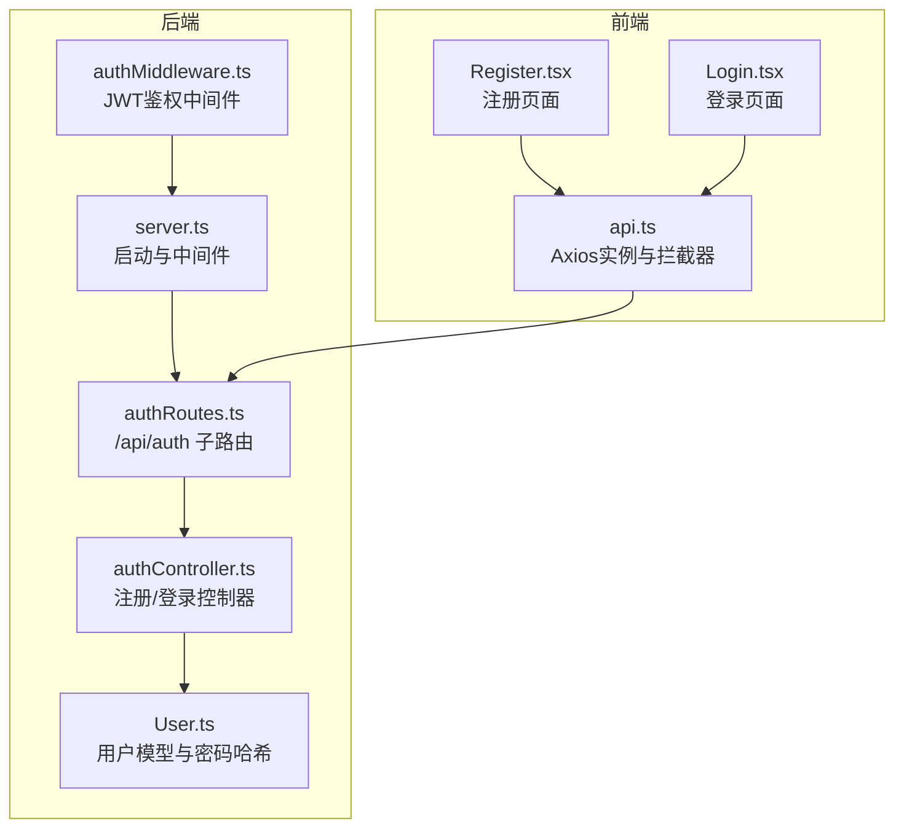
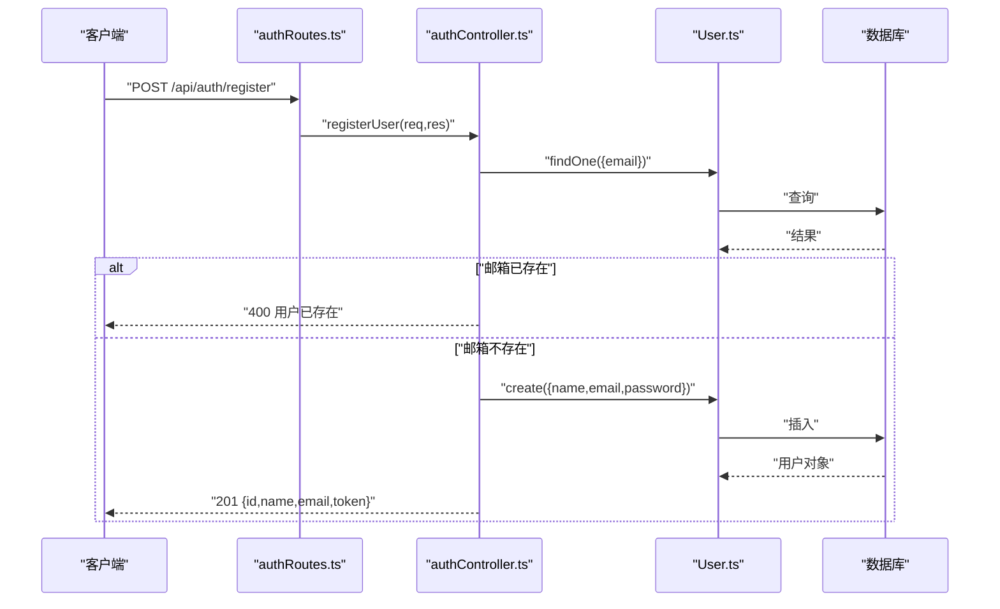
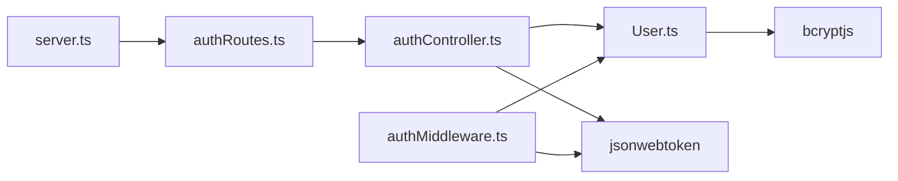

# 认证API

<cite>
**本文引用的文件**
- [backend/src/controllers/authController.ts](file://backend/src/controllers/authController.ts)
- [backend/src/routes/authRoutes.ts](file://backend/src/routes/authRoutes.ts)
- [backend/src/models/User.ts](file://backend/src/models/User.ts)
- [backend/src/middleware/authMiddleware.ts](file://backend/src/middleware/authMiddleware.ts)
- [backend/src/server.ts](file://backend/src/server.ts)
- [backend/.env](file://backend/.env)
- [docs/4. API接口文档.md](file://docs/4. API接口文档.md)
- [frontend/src/services/api.ts](file://frontend/src/services/api.ts)
- [frontend/src/pages/Register.tsx](file://frontend/src/pages/Register.tsx)
- [frontend/src/pages/Login.tsx](file://frontend/src/pages/Login.tsx)
- [tests/test-api.js](file://tests/test-api.js)
</cite>

## 目录
1. [简介](#简介)
2. [项目结构](#项目结构)
3. [核心组件](#核心组件)
4. [架构总览](#架构总览)
5. [详细组件分析](#详细组件分析)
6. [依赖关系分析](#依赖关系分析)
7. [性能与安全考虑](#性能与安全考虑)
8. [故障排查指南](#故障排查指南)
9. [结论](#结论)
10. [附录](#附录)

## 简介
本文件为认证API的完整技术文档，覆盖注册与登录两个核心端点：
- 注册：POST /api/auth/register
- 登录：POST /api/auth/login

内容包括请求与响应格式、HTTP状态码、输入验证规则、密码加密与JWT令牌策略、常见错误处理以及curl与Axios调用示例。

## 项目结构
后端采用Express + Sequelize + JWT的分层架构：
- 路由层：定义 /api/auth 的子路由
- 控制器层：实现注册与登录业务逻辑
- 模型层：用户模型及Sequelize钩子完成密码哈希
- 中间件层：保护受保护路由的JWT校验
- 入口：服务器启动与路由挂载

图表来源
- [backend/src/server.ts](file://backend/src/server.ts#L1-L36)
- [backend/src/routes/authRoutes.ts](file://backend/src/routes/authRoutes.ts#L1-L9)
- [backend/src/controllers/authController.ts](file://backend/src/controllers/authController.ts#L1-L71)
- [backend/src/models/User.ts](file://backend/src/models/User.ts#L1-L119)
- [backend/src/middleware/authMiddleware.ts](file://backend/src/middleware/authMiddleware.ts#L1-L36)
- [frontend/src/services/api.ts](file://frontend/src/services/api.ts#L1-L61)
- [frontend/src/pages/Register.tsx](file://frontend/src/pages/Register.tsx#L1-L49)
- [frontend/src/pages/Login.tsx](file://frontend/src/pages/Login.tsx#L1-L44)

章节来源
- [backend/src/server.ts](file://backend/src/server.ts#L1-L36)
- [backend/src/routes/authRoutes.ts](file://backend/src/routes/authRoutes.ts#L1-L9)

## 核心组件
- 注册控制器：接收name、email、password，检查邮箱唯一性，创建用户并返回用户信息与JWT令牌
- 登录控制器：根据邮箱查找用户，校验密码，成功则返回用户信息与JWT令牌；失败返回401
- 用户模型：Sequelize定义字段与校验，beforeCreate/beforeUpdate钩子使用bcrypt进行密码哈希
- JWT中间件：从Authorization头解析Bearer Token，校验并注入用户信息
- 服务器入口：加载环境变量、连接数据库、挂载路由

章节来源
- [backend/src/controllers/authController.ts](file://backend/src/controllers/authController.ts#L1-L71)
- [backend/src/models/User.ts](file://backend/src/models/User.ts#L1-L119)
- [backend/src/middleware/authMiddleware.ts](file://backend/src/middleware/authMiddleware.ts#L1-L36)
- [backend/src/server.ts](file://backend/src/server.ts#L1-L36)

## 架构总览
认证流程涉及客户端、路由、控制器、模型与数据库的协作。

图表来源
- [backend/src/routes/authRoutes.ts](file://backend/src/routes/authRoutes.ts#L1-L9)
- [backend/src/controllers/authController.ts](file://backend/src/controllers/authController.ts#L1-L71)
- [backend/src/models/User.ts](file://backend/src/models/User.ts#L1-L119)

## 详细组件分析

### 注册端点：POST /api/auth/register
- 请求URL：/api/auth/register
- 请求体字段：
  - name：字符串，必填
  - email：字符串，必填，邮箱格式校验
  - password：字符串，必填，长度6-100
- 响应体字段：
  - id：数字
  - name：字符串
  - email：字符串
  - token：JWT字符串
- HTTP状态码：
  - 201 成功创建
  - 400 输入无效或邮箱已存在
  - 500 服务器内部错误
- 输入验证规则：
  - 邮箱格式：通过Sequelize校验器isEmail
  - 密码长度：6-100字符
  - 邮箱唯一性：数据库唯一约束
- 错误处理：
  - 已存在：返回400并提示用户已存在
  - 无效数据：返回400并提示无效用户数据
  - 异常：返回500并提示服务器错误
- 密码加密：
  - 使用bcrypt在beforeCreate/beforeUpdate钩子中对密码进行哈希
- JWT策略：
  - 使用jsonwebtoken签发，载荷含用户id，过期时间30天

章节来源
- [backend/src/controllers/authController.ts](file://backend/src/controllers/authController.ts#L12-L46)
- [backend/src/models/User.ts](file://backend/src/models/User.ts#L53-L67)
- [backend/src/models/User.ts](file://backend/src/models/User.ts#L101-L116)
- [backend/.env](file://backend/.env#L1-L10)

### 登录端点：POST /api/auth/login
- 请求URL：/api/auth/login
- 请求体字段：
  - email：字符串，必填，邮箱格式校验
  - password：字符串，必填，长度6-100
- 响应体字段：
  - id：数字
  - name：字符串
  - email：字符串
  - token：JWT字符串
- HTTP状态码：
  - 200 成功
  - 401 邮箱或密码错误
  - 500 服务器内部错误
- 验证与流程：
  - 根据邮箱查询用户
  - 使用bcrypt.compare校验密码
  - 成功则签发JWT并返回用户信息
  - 失败返回401并提示无效邮箱或密码
- JWT策略：
  - 使用jsonwebtoken签发，载荷含用户id，过期时间30天

章节来源
- [backend/src/controllers/authController.ts](file://backend/src/controllers/authController.ts#L48-L71)
- [backend/src/models/User.ts](file://backend/src/models/User.ts#L35-L38)
- [backend/src/models/User.ts](file://backend/src/models/User.ts#L53-L67)
- [backend/.env](file://backend/.env#L1-L10)

### JWT中间件与受保护路由
- 功能：从Authorization头解析Bearer Token，校验并注入用户信息到请求对象
- 行为：
  - 若无token：返回401未授权
  - token无效：返回401未授权
  - token有效：注入用户信息（排除密码），继续后续处理
- 用途：保护其他需要认证的接口（如用户资料、运动记录等）

章节来源
- [backend/src/middleware/authMiddleware.ts](file://backend/src/middleware/authMiddleware.ts#L1-L36)

### 前端集成与调用示例

#### curl示例
- 注册
  - curl -X POST http://localhost:3001/api/auth/register -H "Content-Type: application/json" -d '{"name":"张三","email":"zhangsan@example.com","password":"yourStrongPassword123"}'
- 登录
  - curl -X POST http://localhost:3001/api/auth/login -H "Content-Type: application/json" -d '{"email":"zhangsan@example.com","password":"yourStrongPassword123"}'

#### JavaScript/Axios示例
- 注册
  - 使用api.ts中的authAPI.register方法，传入{name,email,password}，成功后从响应中提取token并存入localStorage
- 登录
  - 使用api.ts中的authAPI.login方法，传入{email,password}，成功后从响应中提取token并存入localStorage
- 受保护请求
  - api.ts已配置请求拦截器自动在Authorization头添加Bearer token

章节来源
- [frontend/src/services/api.ts](file://frontend/src/services/api.ts#L1-L61)
- [frontend/src/pages/Register.tsx](file://frontend/src/pages/Register.tsx#L1-L49)
- [frontend/src/pages/Login.tsx](file://frontend/src/pages/Login.tsx#L1-L44)
- [tests/test-api.js](file://tests/test-api.js#L16-L47)

## 依赖关系分析

图表来源
- [backend/src/server.ts](file://backend/src/server.ts#L1-L36)
- [backend/src/routes/authRoutes.ts](file://backend/src/routes/authRoutes.ts#L1-L9)
- [backend/src/controllers/authController.ts](file://backend/src/controllers/authController.ts#L1-L10)
- [backend/src/models/User.ts](file://backend/src/models/User.ts#L1-L119)
- [backend/src/middleware/authMiddleware.ts](file://backend/src/middleware/authMiddleware.ts#L1-L36)

章节来源
- [backend/src/server.ts](file://backend/src/server.ts#L1-L36)
- [backend/src/controllers/authController.ts](file://backend/src/controllers/authController.ts#L1-L10)
- [backend/src/models/User.ts](file://backend/src/models/User.ts#L1-L119)
- [backend/src/middleware/authMiddleware.ts](file://backend/src/middleware/authMiddleware.ts#L1-L36)

## 性能与安全考虑
- 密码哈希成本：bcrypt默认使用10的盐，兼顾安全性与性能
- JWT有效期：30天，建议结合刷新令牌策略与安全头（如HttpOnly、Secure、SameSite）在生产环境进一步加固
- 输入验证：前端可做基础校验，后端使用Sequelize校验器与控制器逻辑共同保障
- 错误信息：避免泄露敏感信息，统一返回通用错误消息

[本节为通用指导，无需列出具体文件来源]

## 故障排查指南
- 注册返回400“用户已存在”
  - 检查邮箱是否已被注册；数据库唯一约束触发
- 注册返回400“无效用户数据”
  - 检查请求体字段是否完整且符合长度要求
- 登录返回401“无效邮箱或密码”
  - 检查邮箱是否存在、密码是否匹配
- 服务器错误500
  - 查看后端日志，确认数据库连接、JWT密钥、bcrypt依赖是否正常
- 前端无法访问受保护接口
  - 确认localStorage中token存在且未过期；检查Authorization头是否正确设置

章节来源
- [backend/src/controllers/authController.ts](file://backend/src/controllers/authController.ts#L12-L71)
- [backend/src/middleware/authMiddleware.ts](file://backend/src/middleware/authMiddleware.ts#L1-L36)
- [frontend/src/services/api.ts](file://frontend/src/services/api.ts#L1-L61)

## 结论
本认证API提供了简洁可靠的注册与登录能力，结合Sequelize校验、bcrypt哈希与jsonwebtoken签发，满足基本安全需求。建议在生产环境中补充刷新令牌、安全头与更严格的速率限制与审计日志。

[本节为总结性内容，无需列出具体文件来源]

## 附录

### 接口规范摘要
- 注册
  - URL：POST /api/auth/register
  - 请求体：name, email, password
  - 响应：id, name, email, token
  - 状态码：201/400/500
- 登录
  - URL：POST /api/auth/login
  - 请求体：email, password
  - 响应：id, name, email, token
  - 状态码：200/401/500

章节来源
- [docs/4. API接口文档.md](file://docs/4. API接口文档.md#L1-L46)

### 数据模型要点（与认证相关）
- 字段：id, name, email, password
- 校验：email格式、password长度范围
- 钩子：注册/更新前对password进行bcrypt哈希

章节来源
- [backend/src/models/User.ts](file://backend/src/models/User.ts#L53-L67)
- [backend/src/models/User.ts](file://backend/src/models/User.ts#L101-L116)