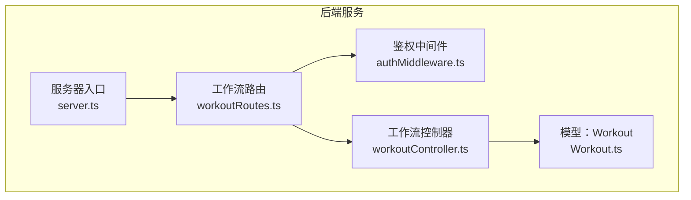
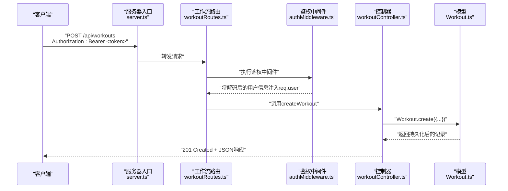
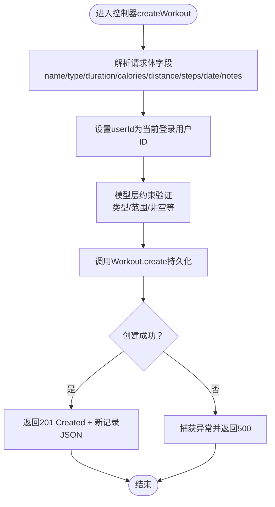
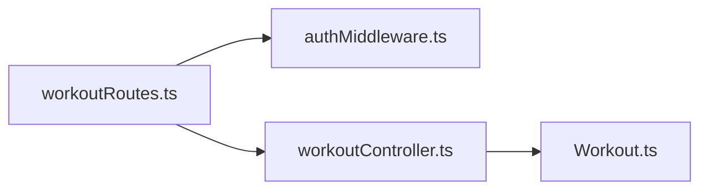

# 创建运动记录

<cite>
**本文引用的文件**
- [backend/src/controllers/workoutController.ts](file://backend/src/controllers/workoutController.ts)
- [backend/src/routes/workoutRoutes.ts](file://backend/src/routes/workoutRoutes.ts)
- [backend/src/middleware/authMiddleware.ts](file://backend/src/middleware/authMiddleware.ts)
- [backend/src/models/Workout.ts](file://backend/src/models/Workout.ts)
- [backend/src/server.ts](file://backend/src/server.ts)
- [docs/4. API接口文档.md](file://docs/4. API接口文档.md)
</cite>

## 目录
1. [简介](#简介)
2. [项目结构](#项目结构)
3. [核心组件](#核心组件)
4. [架构总览](#架构总览)
5. [详细组件分析](#详细组件分析)
6. [依赖关系分析](#依赖关系分析)
7. [性能考虑](#性能考虑)
8. [故障排查指南](#故障排查指南)
9. [结论](#结论)

## 简介
本文件面向后端与前端开发者，系统性说明“创建运动记录”的API：POST /api/workouts。内容涵盖：
- 请求体字段定义与数据类型
- 可选字段说明与默认行为
- userId由JWT自动填充，无需客户端提供
- 字段映射与数据库持久化流程
- 201创建成功响应格式
- 500错误的异常处理机制
- 结合控制器逻辑的调用序列图与流程图

## 项目结构
该API属于后端服务的一部分，采用Express + Sequelize架构：
- 路由层：在工作流路由中暴露POST /api/workouts
- 中间件：使用鉴权中间件保护私有接口
- 控制器：实现业务逻辑，负责参数解析、权限校验与数据库写入
- 模型：Workout模型定义字段约束与关联关系
- 入口：服务器启动时挂载路由并连接数据库

图表来源
- [backend/src/server.ts](file://backend/src/server.ts#L1-L36)
- [backend/src/routes/workoutRoutes.ts](file://backend/src/routes/workoutRoutes.ts#L1-L22)
- [backend/src/middleware/authMiddleware.ts](file://backend/src/middleware/authMiddleware.ts#L1-L36)
- [backend/src/controllers/workoutController.ts](file://backend/src/controllers/workoutController.ts#L48-L71)
- [backend/src/models/Workout.ts](file://backend/src/models/Workout.ts#L1-L122)

章节来源
- [backend/src/server.ts](file://backend/src/server.ts#L1-L36)
- [backend/src/routes/workoutRoutes.ts](file://backend/src/routes/workoutRoutes.ts#L1-L22)

## 核心组件
- 接口路径：POST /api/workouts
- 认证方式：Bearer Token（Authorization 头）
- 权限要求：已登录用户（受保护接口）
- 响应状态：
  - 201：创建成功
  - 401：未授权（Token缺失或无效）
  - 404：更新/删除场景下的资源不存在（此处为创建接口，主要关注201/500）
  - 500：服务器内部错误

章节来源
- [backend/src/routes/workoutRoutes.ts](file://backend/src/routes/workoutRoutes.ts#L13-L15)
- [backend/src/middleware/authMiddleware.ts](file://backend/src/middleware/authMiddleware.ts#L9-L36)
- [docs/4. API接口文档.md](file://docs/4. API接口文档.md#L126-L160)

## 架构总览
POST /api/workouts 的端到端调用链如下：

图表来源
- [backend/src/server.ts](file://backend/src/server.ts#L24-L27)
- [backend/src/routes/workoutRoutes.ts](file://backend/src/routes/workoutRoutes.ts#L13-L15)
- [backend/src/middleware/authMiddleware.ts](file://backend/src/middleware/authMiddleware.ts#L9-L36)
- [backend/src/controllers/workoutController.ts](file://backend/src/controllers/workoutController.ts#L48-L71)
- [backend/src/models/Workout.ts](file://backend/src/models/Workout.ts#L1-L122)

## 详细组件分析

### 请求体字段定义与数据类型
- name：字符串，必填
- type：枚举，必填；取值范围为 running、cycling、swimming、walking、strength、yoga、other
- duration：整数（分钟），必填；最小值0
- calories：整数（卡路里），必填；最小值0
- distance：数值（公里），可选；最小值0
- steps：整数（步数），可选；最小值0
- date：日期时间，必填；默认值为当前时间
- notes：文本，可选

说明：
- 所有字段均来自请求体JSON对象
- userId由JWT自动填充，无需客户端提供
- 若客户端未提供某些可选字段（如distance、steps、notes），数据库层会按模型定义的可空性进行存储

章节来源
- [backend/src/models/Workout.ts](file://backend/src/models/Workout.ts#L6-L38)
- [backend/src/models/Workout.ts](file://backend/src/models/Workout.ts#L62-L102)
- [docs/4. API接口文档.md](file://docs/4. API接口文档.md#L126-L160)

### 字段映射与数据库持久化流程
控制器在创建运动记录时，从请求体解析字段，并显式将userId设置为当前登录用户ID，然后通过模型进行持久化。字段映射与验证遵循模型定义。

图表来源
- [backend/src/controllers/workoutController.ts](file://backend/src/controllers/workoutController.ts#L52-L67)
- [backend/src/models/Workout.ts](file://backend/src/models/Workout.ts#L62-L102)

章节来源
- [backend/src/controllers/workoutController.ts](file://backend/src/controllers/workoutController.ts#L52-L67)
- [backend/src/models/Workout.ts](file://backend/src/models/Workout.ts#L62-L102)

### 201创建成功响应格式
- 状态码：201 Created
- 响应体：完整的新建运动记录对象，包含所有字段（含可选字段）

章节来源
- [backend/src/controllers/workoutController.ts](file://backend/src/controllers/workoutController.ts#L67-L67)
- [docs/4. API接口文档.md](file://docs/4. API接口文档.md#L146-L159)

### 500错误的异常处理
- 当数据库写入或模型操作抛出异常时，控制器统一捕获并返回500状态码及通用错误消息
- 建议客户端在收到500时重试或检查网络与数据库连通性

章节来源
- [backend/src/controllers/workoutController.ts](file://backend/src/controllers/workoutController.ts#L68-L70)

### 创建跑步记录的请求示例
- URL：POST /api/workouts
- 请求头：Authorization: Bearer <token>
- 请求体（JSON）示例要点：
  - name：例如 "晨跑"
  - type：例如 "running"
  - duration：例如 45
  - calories：例如 320
  - distance：例如 5.2（可选）
  - steps：例如 8000（可选）
  - date：例如 "2025-04-05T07:00:00Z"
  - notes：例如 "天气晴朗，空气清新"（可选）
- 注意：无需提供userId

章节来源
- [docs/4. API接口文档.md](file://docs/4. API接口文档.md#L126-L160)

## 依赖关系分析
- 路由依赖中间件：workoutRoutes在POST /api/workouts上绑定protect中间件
- 控制器依赖模型：createWorkout调用Workout.create进行持久化
- 中间件依赖用户模型：从JWT解析用户ID并注入到请求上下文

图表来源
- [backend/src/routes/workoutRoutes.ts](file://backend/src/routes/workoutRoutes.ts#L13-L15)
- [backend/src/middleware/authMiddleware.ts](file://backend/src/middleware/authMiddleware.ts#L9-L36)
- [backend/src/controllers/workoutController.ts](file://backend/src/controllers/workoutController.ts#L48-L71)
- [backend/src/models/Workout.ts](file://backend/src/models/Workout.ts#L1-L122)

章节来源
- [backend/src/routes/workoutRoutes.ts](file://backend/src/routes/workoutRoutes.ts#L13-L15)
- [backend/src/middleware/authMiddleware.ts](file://backend/src/middleware/authMiddleware.ts#L9-L36)
- [backend/src/controllers/workoutController.ts](file://backend/src/controllers/workoutController.ts#L48-L71)
- [backend/src/models/Workout.ts](file://backend/src/models/Workout.ts#L1-L122)

## 性能考虑
- 字段数量与数据库索引：若未来对type、date等字段频繁查询，建议评估索引策略
- 批量写入：当前为单条记录创建，如需批量创建，可考虑事务封装与批量插入优化
- 日志与监控：建议在控制器层增加结构化日志，便于追踪创建耗时与异常

## 故障排查指南
- 401 未授权
  - 检查Authorization头是否正确携带Bearer Token
  - 确认Token未过期且签名有效
- 500 服务器错误
  - 检查数据库连接与表结构同步状态
  - 查看服务器日志中的异常堆栈
  - 确认请求体字段类型与范围符合模型约束

章节来源
- [backend/src/middleware/authMiddleware.ts](file://backend/src/middleware/authMiddleware.ts#L9-L36)
- [backend/src/controllers/workoutController.ts](file://backend/src/controllers/workoutController.ts#L68-L70)
- [backend/src/config/db.ts](file://backend/src/config/db.ts#L25-L38)

## 结论
POST /api/workouts 提供了简洁明确的创建运动记录能力。其关键特性包括：
- 明确的请求体字段与类型约束
- 自动填充userId，简化客户端逻辑
- 严格的模型层验证与统一的异常处理
- 清晰的201响应格式，便于前端集成