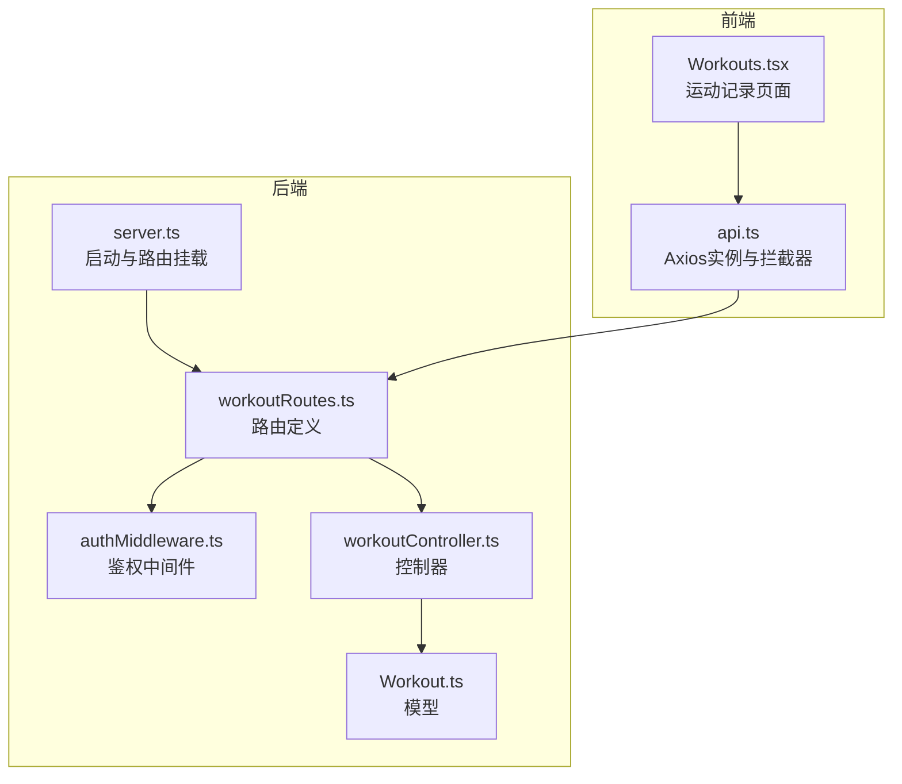
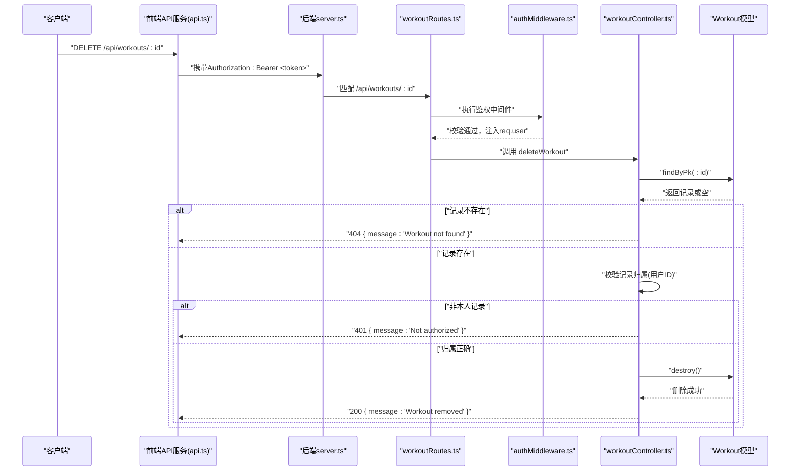
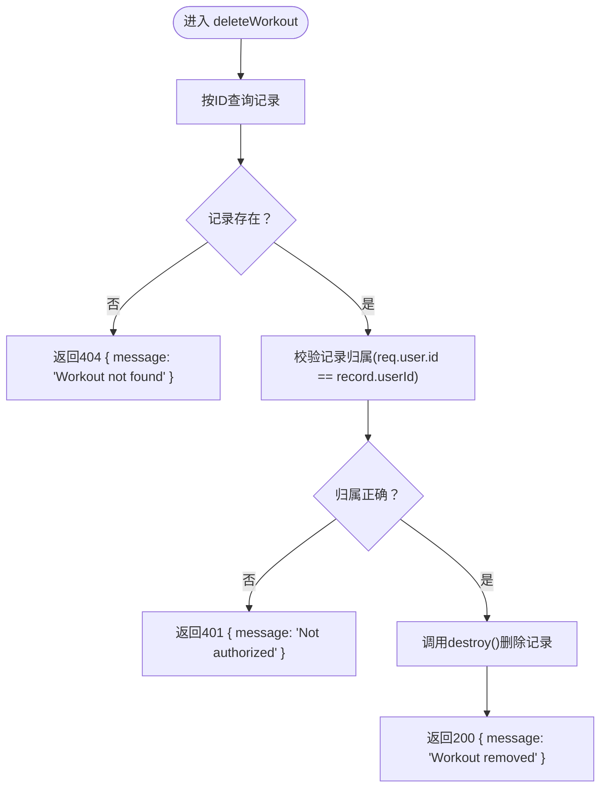
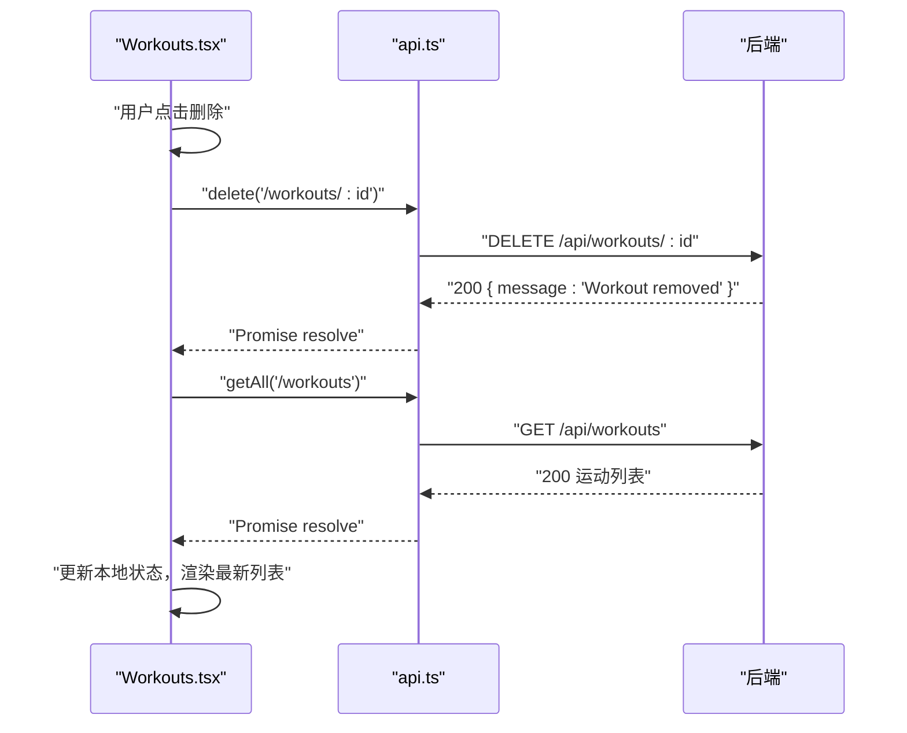
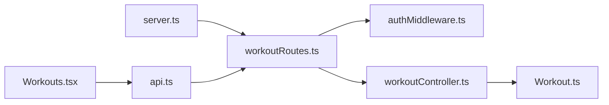

# 删除运动记录

<cite>
**本文引用的文件列表**
- [backend/src/controllers/workoutController.ts](file://backend/src/controllers/workoutController.ts)
- [backend/src/routes/workoutRoutes.ts](file://backend/src/routes/workoutRoutes.ts)
- [backend/src/middleware/authMiddleware.ts](file://backend/src/middleware/authMiddleware.ts)
- [backend/src/models/Workout.ts](file://backend/src/models/Workout.ts)
- [backend/src/server.ts](file://backend/src/server.ts)
- [docs/4. API接口文档.md](file://docs/4. API接口文档.md)
- [frontend/src/services/api.ts](file://frontend/src/services/api.ts)
- [frontend/src/pages/Workouts.tsx](file://frontend/src/pages/Workouts.tsx)
</cite>

## 目录
1. [简介](#简介)
2. [项目结构](#项目结构)
3. [核心组件](#核心组件)
4. [架构总览](#架构总览)
5. [详细组件分析](#详细组件分析)
6. [依赖关系分析](#依赖关系分析)
7. [性能与幂等性考量](#性能与幂等性考量)
8. [故障排查指南](#故障排查指南)
9. [结论](#结论)
10. [附录](#附录)

## 简介
本文件面向后端开发者与前端集成人员，系统化说明删除运动记录的API设计与实现要点，重点覆盖：
- DELETE /api/workouts/:id 端点的幂等性设计
- 成功删除返回 { message: 'Workout removed' } 的响应格式
- 404 未找到与 401 未授权的错误处理策略
- 基于 deleteWorkout 控制器的安全流程：先验证记录存在性，再检查用户归属，最后调用 destroy() 方法从数据库移除记录
- 客户端删除后的UI状态同步建议

## 项目结构
后端采用分层架构：路由层负责HTTP请求映射，中间件负责鉴权，控制器负责业务逻辑，模型负责数据访问；前端通过统一的API服务封装Axios实例并自动注入认证头。

图表来源
- [backend/src/server.ts](file://backend/src/server.ts#L1-L36)
- [backend/src/routes/workoutRoutes.ts](file://backend/src/routes/workoutRoutes.ts#L1-L22)
- [backend/src/middleware/authMiddleware.ts](file://backend/src/middleware/authMiddleware.ts#L1-L36)
- [backend/src/controllers/workoutController.ts](file://backend/src/controllers/workoutController.ts#L109-L132)
- [backend/src/models/Workout.ts](file://backend/src/models/Workout.ts#L1-L122)
- [frontend/src/services/api.ts](file://frontend/src/services/api.ts#L1-L61)
- [frontend/src/pages/Workouts.tsx](file://frontend/src/pages/Workouts.tsx#L120-L140)

章节来源
- [backend/src/server.ts](file://backend/src/server.ts#L1-L36)
- [backend/src/routes/workoutRoutes.ts](file://backend/src/routes/workoutRoutes.ts#L1-L22)
- [frontend/src/services/api.ts](file://frontend/src/services/api.ts#L1-L61)

## 核心组件
- 路由层：在 workoutRoutes 中为 DELETE /api/workouts/:id 映射到 deleteWorkout 控制器，并通过 protect 中间件保护。
- 鉴权中间件：authMiddleware 从请求头 Authorization 提取并校验 JWT，将用户信息注入 req.user。
- 控制器：deleteWorkout 先查询记录是否存在，再校验记录归属，最后调用 destroy() 删除并返回标准消息。
- 模型：Workout 定义了字段、校验规则与与 User 的关联关系，支持级联删除策略。
- 文档：API接口文档对 DELETE /api/workouts/:id 的请求头、响应格式进行了说明。

章节来源
- [backend/src/routes/workoutRoutes.ts](file://backend/src/routes/workoutRoutes.ts#L13-L20)
- [backend/src/middleware/authMiddleware.ts](file://backend/src/middleware/authMiddleware.ts#L9-L36)
- [backend/src/controllers/workoutController.ts](file://backend/src/controllers/workoutController.ts#L109-L132)
- [backend/src/models/Workout.ts](file://backend/src/models/Workout.ts#L1-L122)
- [docs/4. API接口文档.md](file://docs/4. API接口文档.md#L218-L231)

## 架构总览
下图展示删除运动记录的端到端调用链路，包括鉴权、路由、控制器与数据库交互。

图表来源
- [backend/src/server.ts](file://backend/src/server.ts#L23-L27)
- [backend/src/routes/workoutRoutes.ts](file://backend/src/routes/workoutRoutes.ts#L17-L20)
- [backend/src/middleware/authMiddleware.ts](file://backend/src/middleware/authMiddleware.ts#L9-L36)
- [backend/src/controllers/workoutController.ts](file://backend/src/controllers/workoutController.ts#L109-L132)
- [backend/src/models/Workout.ts](file://backend/src/models/Workout.ts#L1-L122)
- [frontend/src/services/api.ts](file://frontend/src/services/api.ts#L46-L53)

## 详细组件分析

### DELETE /api/workouts/:id 端点
- 请求路径：DELETE /api/workouts/:id
- 请求头：Authorization: Bearer <token>
- 成功响应：200 { message: 'Workout removed' }
- 404 错误：记录不存在
- 401 错误：非记录归属用户

该端点由路由层映射至 deleteWorkout 控制器，受鉴权中间件保护，确保仅已登录且拥有权限的用户可删除其运动记录。

章节来源
- [docs/4. API接口文档.md](file://docs/4. API接口文档.md#L218-L231)
- [backend/src/routes/workoutRoutes.ts](file://backend/src/routes/workoutRoutes.ts#L17-L20)
- [backend/src/middleware/authMiddleware.ts](file://backend/src/middleware/authMiddleware.ts#L9-L36)

### deleteWorkout 控制器安全流程
控制器实现遵循“先存在性校验，再归属校验，最后销毁”的安全三段式流程，确保删除操作的正确性与安全性。

图表来源
- [backend/src/controllers/workoutController.ts](file://backend/src/controllers/workoutController.ts#L109-L132)

章节来源
- [backend/src/controllers/workoutController.ts](file://backend/src/controllers/workoutController.ts#L109-L132)

### 响应格式与错误处理
- 成功删除：返回 { message: 'Workout removed' }，状态码 200
- 未找到：返回 { message: 'Workout not found' }，状态码 404
- 未授权：返回 { message: 'Not authorized' }，状态码 401
- 其他异常：返回 { message: 'Server error' }，状态码 500

章节来源
- [backend/src/controllers/workoutController.ts](file://backend/src/controllers/workoutController.ts#L109-L132)
- [docs/4. API接口文档.md](file://docs/4. API接口文档.md#L218-L231)

### 前端调用与UI状态同步
- 前端通过 api.ts 的 Axios 实例统一发送请求，并自动附加 Authorization 头
- Workouts 页面提供删除按钮，调用 api.ts 的 delete 接口
- 删除成功后，前端重新拉取运动列表以保持UI与后端一致

图表来源
- [frontend/src/pages/Workouts.tsx](file://frontend/src/pages/Workouts.tsx#L120-L140)
- [frontend/src/services/api.ts](file://frontend/src/services/api.ts#L46-L53)

章节来源
- [frontend/src/pages/Workouts.tsx](file://frontend/src/pages/Workouts.tsx#L120-L140)
- [frontend/src/services/api.ts](file://frontend/src/services/api.ts#L46-L53)

## 依赖关系分析
- 路由依赖中间件：workoutRoutes 在 DELETE 路由上使用 protect 中间件
- 控制器依赖模型：deleteWorkout 使用 Workout 模型进行查询与销毁
- 前端依赖后端：api.ts 将 DELETE 请求转发至 /api/workouts/:id
- 服务器挂载：server.ts 将 /api/workouts 路由挂载到应用

图表来源
- [backend/src/server.ts](file://backend/src/server.ts#L23-L27)
- [backend/src/routes/workoutRoutes.ts](file://backend/src/routes/workoutRoutes.ts#L13-L20)
- [backend/src/middleware/authMiddleware.ts](file://backend/src/middleware/authMiddleware.ts#L9-L36)
- [backend/src/controllers/workoutController.ts](file://backend/src/controllers/workoutController.ts#L109-L132)
- [backend/src/models/Workout.ts](file://backend/src/models/Workout.ts#L1-L122)
- [frontend/src/services/api.ts](file://frontend/src/services/api.ts#L1-L61)
- [frontend/src/pages/Workouts.tsx](file://frontend/src/pages/Workouts.tsx#L120-L140)

章节来源
- [backend/src/server.ts](file://backend/src/server.ts#L23-L27)
- [backend/src/routes/workoutRoutes.ts](file://backend/src/routes/workoutRoutes.ts#L13-L20)
- [frontend/src/services/api.ts](file://frontend/src/services/api.ts#L1-L61)

## 性能与幂等性考量
- 幂等性设计
  - DELETE /api/workouts/:id 是幂等的：重复调用同一ID的删除请求不会产生副作用，若记录已被删除，后续请求仍会返回 200 { message: 'Workout removed' } 或 404（取决于具体实现）。当前控制器在记录不存在时返回 404，归属不匹配时返回 401，这符合幂等语义：多次相同请求的结果一致。
  - 由于控制器先查询再销毁，即使重复调用，只要记录存在且归属正确，第二次调用可能因记录已不存在而触发 404，这是幂等性的合理表现。
- 性能建议
  - 查询与销毁均为单条记录操作，复杂度 O(1)，性能开销极低
  - 若未来记录量增长，可在控制器中增加缓存命中判断，减少重复查询
  - 前端批量删除时建议串行或分批调用，避免瞬时高并发

章节来源
- [backend/src/controllers/workoutController.ts](file://backend/src/controllers/workoutController.ts#L109-L132)

## 故障排查指南
- 401 未授权
  - 检查请求头是否包含正确的 Authorization: Bearer <token>
  - 确认 token 未过期且签名有效
  - 确认当前登录用户与记录归属一致
- 404 未找到
  - 确认 :id 是否正确
  - 确认记录是否已被他人删除
- 500 服务器错误
  - 查看后端日志定位异常
  - 检查数据库连接与模型定义
- 前端UI不同步
  - 删除成功后主动刷新列表
  - 对于并发场景，建议在删除前禁用按钮，删除后统一刷新

章节来源
- [backend/src/middleware/authMiddleware.ts](file://backend/src/middleware/authMiddleware.ts#L9-L36)
- [backend/src/controllers/workoutController.ts](file://backend/src/controllers/workoutController.ts#L109-L132)
- [frontend/src/pages/Workouts.tsx](file://frontend/src/pages/Workouts.tsx#L120-L140)

## 结论
DELETE /api/workouts/:id 端点通过鉴权中间件与控制器的三段式安全流程，实现了对用户运动记录的可靠删除。其幂等性设计保证了重复调用的一致性，配合前端的UI状态同步机制，能够为用户提供稳定一致的操作体验。建议在生产环境中持续关注鉴权与错误处理的健壮性，并在前端做好删除后的状态刷新与并发控制。

## 附录
- API接口文档中关于删除运动记录的说明可参考：[docs/4. API接口文档.md](file://docs/4. API接口文档.md#L218-L231)
- 前端API服务与页面调用示例可参考：
  - [frontend/src/services/api.ts](file://frontend/src/services/api.ts#L46-L53)
  - [frontend/src/pages/Workouts.tsx](file://frontend/src/pages/Workouts.tsx#L120-L140)