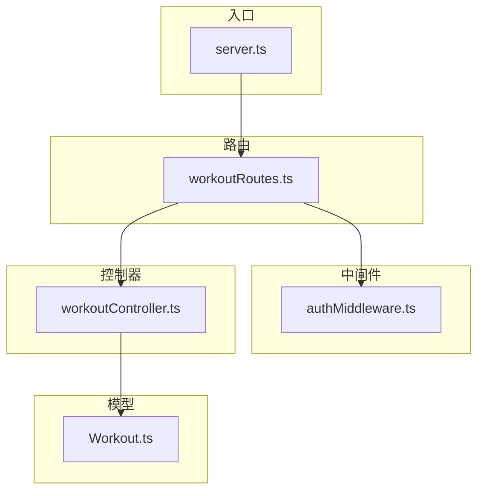
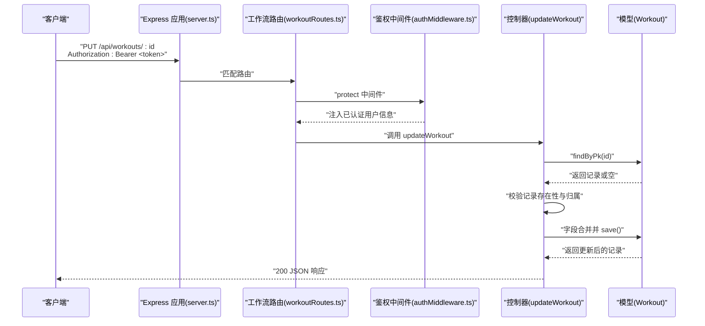
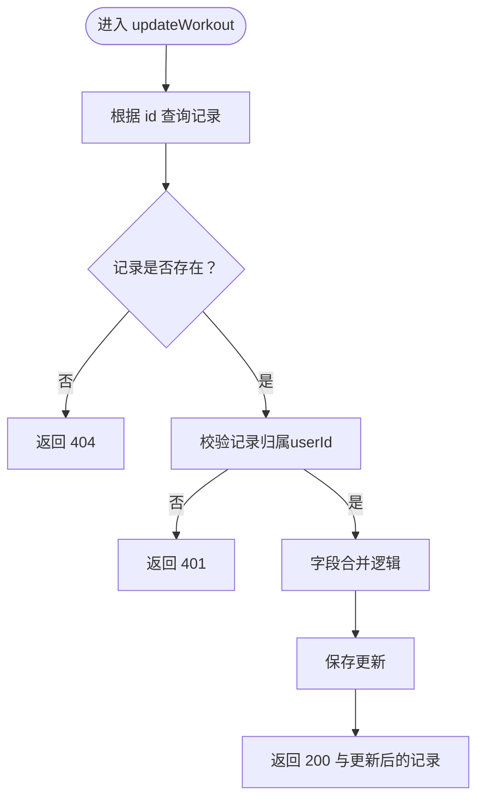
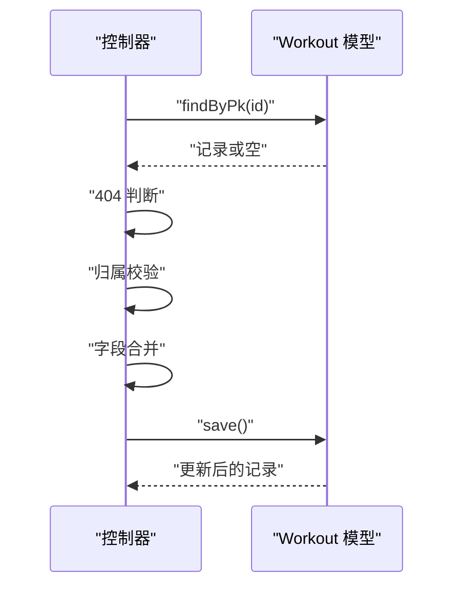
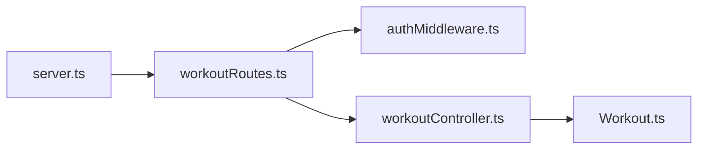

# 更新运动记录

<cite>
**本文引用的文件**
- [backend/src/controllers/workoutController.ts](file://backend/src/controllers/workoutController.ts)
- [backend/src/routes/workoutRoutes.ts](file://backend/src/routes/workoutRoutes.ts)
- [backend/src/middleware/authMiddleware.ts](file://backend/src/middleware/authMiddleware.ts)
- [backend/src/models/Workout.ts](file://backend/src/models/Workout.ts)
- [backend/src/server.ts](file://backend/src/server.ts)
- [docs/4. API接口文档.md](file://docs/4. API接口文档.md)
</cite>

## 目录
1. [简介](#简介)
2. [项目结构](#项目结构)
3. [核心组件](#核心组件)
4. [架构总览](#架构总览)
5. [详细组件分析](#详细组件分析)
6. [依赖关系分析](#依赖关系分析)
7. [性能考量](#性能考量)
8. [故障排查指南](#故障排查指南)
9. [结论](#结论)
10. [附录](#附录)

## 简介
本文件面向需要调用“更新运动记录”接口的开发者与测试人员，系统化说明 PUT /api/workouts/:id 的行为、请求与响应规范、部分更新策略、字段合并规则（含 distance 可设为 null 的处理）、以及 404 与 401 场景的响应。同时，结合后端实现，解释 workoutController.ts 中 updateWorkout 函数如何通过“先查后验再保存”的流程，确保用户只能修改自己的记录。

## 项目结构
后端采用 Express + Sequelize 架构，按职责分层组织：
- 路由层：定义 /api/workouts 的 REST 接口，绑定到控制器方法
- 控制器层：实现业务逻辑（查询、授权校验、更新）
- 模型层：Workout 模型定义字段与校验规则
- 中间件：鉴权中间件保护私有接口
- 入口：server.ts 注册路由并启动服务

图表来源
- [backend/src/server.ts](file://backend/src/server.ts#L1-L36)
- [backend/src/routes/workoutRoutes.ts](file://backend/src/routes/workoutRoutes.ts#L1-L22)
- [backend/src/middleware/authMiddleware.ts](file://backend/src/middleware/authMiddleware.ts#L1-L36)
- [backend/src/controllers/workoutController.ts](file://backend/src/controllers/workoutController.ts#L73-L107)
- [backend/src/models/Workout.ts](file://backend/src/models/Workout.ts#L1-L122)

章节来源
- [backend/src/server.ts](file://backend/src/server.ts#L1-L36)
- [backend/src/routes/workoutRoutes.ts](file://backend/src/routes/workoutRoutes.ts#L1-L22)

## 核心组件
- 接口路径与方法：PUT /api/workouts/:id
- 访问控制：私有接口，需携带 Bearer Token
- 请求体字段：name、type、duration、calories、distance、steps、date、notes
- 响应：返回完整的更新后的运动记录对象；若失败返回错误信息

章节来源
- [docs/4. API接口文档.md](file://docs/4. API接口文档.md#L183-L216)
- [backend/src/routes/workoutRoutes.ts](file://backend/src/routes/workoutRoutes.ts#L17-L20)
- [backend/src/middleware/authMiddleware.ts](file://backend/src/middleware/authMiddleware.ts#L9-L36)
- [backend/src/models/Workout.ts](file://backend/src/models/Workout.ts#L6-L23)

## 架构总览
从客户端到数据库的调用链如下：

图表来源
- [backend/src/server.ts](file://backend/src/server.ts#L24-L27)
- [backend/src/routes/workoutRoutes.ts](file://backend/src/routes/workoutRoutes.ts#L17-L20)
- [backend/src/middleware/authMiddleware.ts](file://backend/src/middleware/authMiddleware.ts#L9-L36)
- [backend/src/controllers/workoutController.ts](file://backend/src/controllers/workoutController.ts#L73-L107)
- [backend/src/models/Workout.ts](file://backend/src/models/Workout.ts#L1-L122)

## 详细组件分析

### 接口语义与行为
- 路径与方法：PUT /api/workouts/:id
- 权限：私有接口，必须在请求头携带 Authorization: Bearer <token>
- 成功响应：返回完整运动记录对象
- 失败响应：
  - 404：记录不存在
  - 401：未授权（非记录所属用户）

章节来源
- [docs/4. API接口文档.md](file://docs/4. API接口文档.md#L183-L216)
- [backend/src/controllers/workoutController.ts](file://backend/src/controllers/workoutController.ts#L73-L107)

### 请求与响应规范
- 请求头
  - Authorization: Bearer <token>
- 请求体字段
  - name、type、duration、calories、distance、steps、date、notes
- 响应体
  - 返回包含上述字段的运动记录对象

章节来源
- [docs/4. API接口文档.md](file://docs/4. API接口文档.md#L183-L216)
- [backend/src/models/Workout.ts](file://backend/src/models/Workout.ts#L6-L23)

### 部分更新策略与字段合并逻辑
- 部分更新：仅传递需要修改的字段即可，未传字段保持不变
- 字段合并规则
  - 数值类字段（duration、calories）：若请求体传入则替换，否则保留原值
  - 文本类字段（name、type、notes、date）：若请求体传入则替换，否则保留原值
  - 可空数值字段（distance、steps）：若请求体传入 null 或 0，则按请求值写入；若未传入，则保留原值
  - 关键点：对 distance 使用“是否显式传入 undefined”作为判断依据，避免将 null 视作“不更新”

图表来源
- [backend/src/controllers/workoutController.ts](file://backend/src/controllers/workoutController.ts#L73-L107)

章节来源
- [backend/src/controllers/workoutController.ts](file://backend/src/controllers/workoutController.ts#L73-L107)

### 字段合并细节（以 distance 为例）
- 若请求体包含 distance 字段：
  - distance 为 null：写入 null
  - distance 为 0：写入 0
  - distance 为数字：写入该数字
- 若请求体未包含 distance 字段：保留原值
- 其他数值字段（duration、calories）遵循“传入则替换，未传入则保留”的通用规则

章节来源
- [backend/src/controllers/workoutController.ts](file://backend/src/controllers/workoutController.ts#L93-L100)
- [backend/src/models/Workout.ts](file://backend/src/models/Workout.ts#L80-L86)

### 安全更新流程（先查后验再保存）
- 查：根据 id 查询记录，不存在则直接返回 404
- 验：校验记录归属，非本人则返回 401
- 合并：对允许更新的字段进行合并
- 保存：调用 save() 写回数据库，返回最新记录

图表来源
- [backend/src/controllers/workoutController.ts](file://backend/src/controllers/workoutController.ts#L73-L107)

章节来源
- [backend/src/controllers/workoutController.ts](file://backend/src/controllers/workoutController.ts#L73-L107)

### 响应场景说明
- 404 记录不存在：当 id 对应记录不存在时，返回 404
- 401 权限校验失败：当请求用户不是记录所属用户时，返回 401
- 401 无 token：鉴权中间件未检测到有效 Bearer Token 时返回 401

章节来源
- [backend/src/controllers/workoutController.ts](file://backend/src/controllers/workoutController.ts#L82-L91)
- [backend/src/middleware/authMiddleware.ts](file://backend/src/middleware/authMiddleware.ts#L33-L36)

### 请求示例（持续时间与时长）
- 示例一：仅更新持续时间
  - 方法与路径：PUT /api/workouts/:id
  - 请求头：Authorization: Bearer <token>
  - 请求体：包含 duration 字段（单位：分钟）
  - 预期结果：仅 duration 字段被更新，其他字段保持不变
- 示例二：仅更新卡路里
  - 方法与路径：PUT /api/workouts/:id
  - 请求头：Authorization: Bearer <token>
  - 请求体：包含 calories 字段（单位：大卡）
  - 预期结果：仅 calories 字段被更新，其他字段保持不变

章节来源
- [docs/4. API接口文档.md](file://docs/4. API接口文档.md#L183-L216)
- [backend/src/controllers/workoutController.ts](file://backend/src/controllers/workoutController.ts#L93-L100)

## 依赖关系分析
- 路由依赖中间件：workoutRoutes.ts 在 PUT /:id 上使用 protect 中间件
- 控制器依赖模型：updateWorkout 使用 Workout.findByPk 与 save
- 中间件依赖用户模型：protect 解析 JWT 并加载用户信息
- 服务器注册路由：server.ts 将 /api/workouts 路由挂载到应用

图表来源
- [backend/src/server.ts](file://backend/src/server.ts#L24-L27)
- [backend/src/routes/workoutRoutes.ts](file://backend/src/routes/workoutRoutes.ts#L17-L20)
- [backend/src/middleware/authMiddleware.ts](file://backend/src/middleware/authMiddleware.ts#L9-L36)
- [backend/src/controllers/workoutController.ts](file://backend/src/controllers/workoutController.ts#L73-L107)
- [backend/src/models/Workout.ts](file://backend/src/models/Workout.ts#L1-L122)

章节来源
- [backend/src/server.ts](file://backend/src/server.ts#L24-L27)
- [backend/src/routes/workoutRoutes.ts](file://backend/src/routes/workoutRoutes.ts#L17-L20)
- [backend/src/middleware/authMiddleware.ts](file://backend/src/middleware/authMiddleware.ts#L9-L36)
- [backend/src/controllers/workoutController.ts](file://backend/src/controllers/workoutController.ts#L73-L107)
- [backend/src/models/Workout.ts](file://backend/src/models/Workout.ts#L1-L122)

## 性能考量
- 单次查询与单次写入：updateWorkout 采用“先查后验再保存”，避免不必要的批量操作，性能开销低
- 字段合并在内存中完成，复杂度 O(k)，k 为可更新字段数量
- 建议前端仅发送需要变更的字段，减少网络传输与数据库写放大

## 故障排查指南
- 401 未授权
  - 检查 Authorization 头是否正确设置为 Bearer <token>
  - 确认 token 未过期且签名有效
  - 确认请求的记录确实属于当前用户
- 404 记录不存在
  - 检查 :id 是否正确
  - 确认记录未被删除或跨用户访问
- 500 服务器错误
  - 检查后端日志与数据库连接状态
  - 确认请求体字段类型与范围符合模型校验

章节来源
- [backend/src/middleware/authMiddleware.ts](file://backend/src/middleware/authMiddleware.ts#L28-L36)
- [backend/src/controllers/workoutController.ts](file://backend/src/controllers/workoutController.ts#L82-L106)

## 结论
PUT /api/workouts/:id 提供了细粒度的部分更新能力，通过“先查后验再保存”的安全流程，确保用户仅能修改自身记录。字段合并逻辑清晰，支持将 distance 设为 null 或 0，同时避免未传字段被误清空。配合鉴权中间件与模型校验，整体具备良好的安全性与可维护性。

## 附录
- 接口定义参考：[docs/4. API接口文档.md](file://docs/4. API接口文档.md#L183-L216)
- 实现参考：
  - [backend/src/controllers/workoutController.ts](file://backend/src/controllers/workoutController.ts#L73-L107)
  - [backend/src/routes/workoutRoutes.ts](file://backend/src/routes/workoutRoutes.ts#L17-L20)
  - [backend/src/middleware/authMiddleware.ts](file://backend/src/middleware/authMiddleware.ts#L9-L36)
  - [backend/src/models/Workout.ts](file://backend/src/models/Workout.ts#L6-L23)