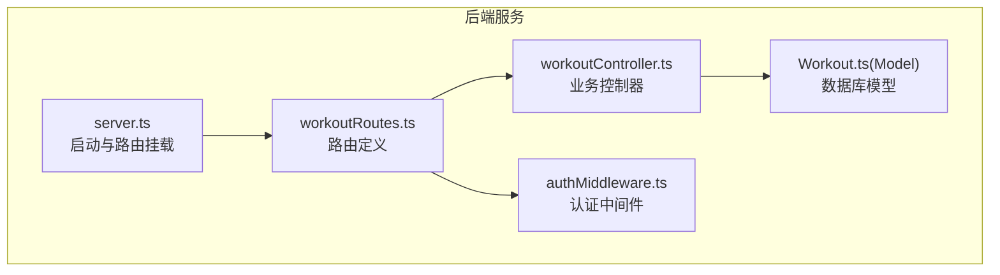
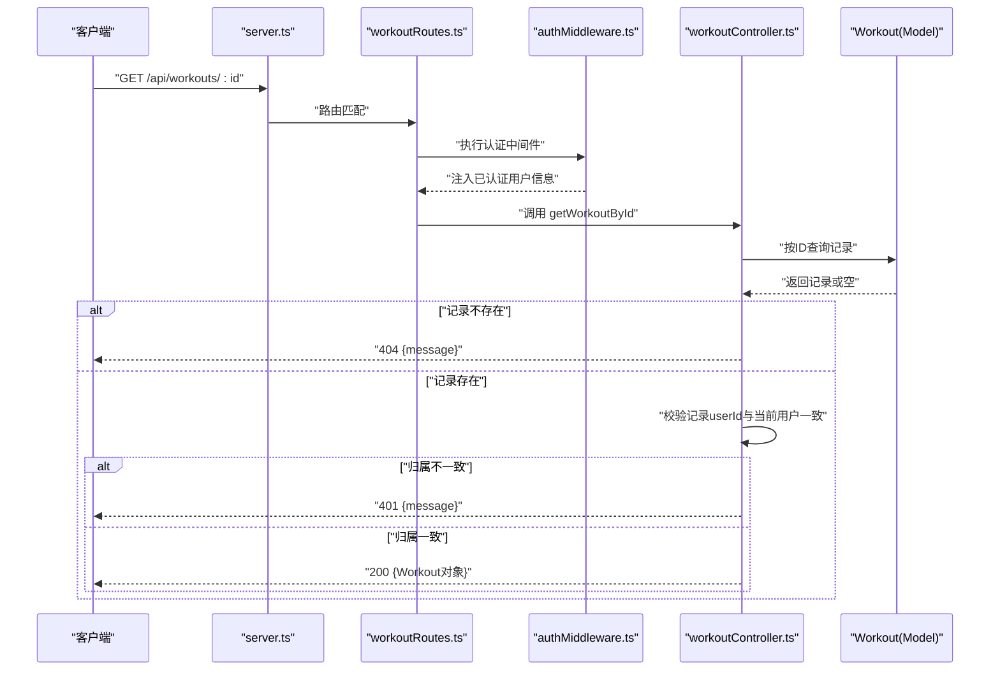
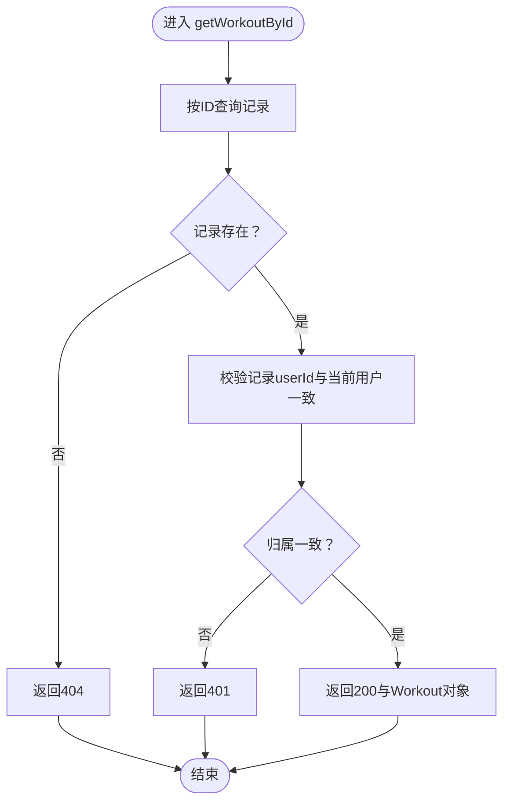
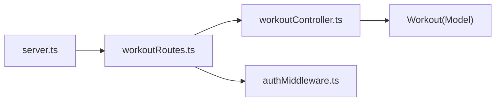

# 获取单条运动记录

<cite>
**本文引用的文件**
- [backend/src/controllers/workoutController.ts](file://backend/src/controllers/workoutController.ts)
- [backend/src/routes/workoutRoutes.ts](file://backend/src/routes/workoutRoutes.ts)
- [backend/src/middleware/authMiddleware.ts](file://backend/src/middleware/authMiddleware.ts)
- [backend/src/models/Workout.ts](file://backend/src/models/Workout.ts)
- [backend/src/server.ts](file://backend/src/server.ts)
- [docs/4. API接口文档.md](file://docs/4. API接口文档.md)
</cite>

## 目录
1. [简介](#简介)
2. [项目结构](#项目结构)
3. [核心组件](#核心组件)
4. [架构概览](#架构概览)
5. [详细组件分析](#详细组件分析)
6. [依赖关系分析](#依赖关系分析)
7. [性能考虑](#性能考虑)
8. [故障排查指南](#故障排查指南)
9. [结论](#结论)

## 简介
本章节面向后端开发者与API使用者，系统化说明“获取指定ID运动记录”的API行为，重点覆盖：
- 路径参数:id的格式要求与约束
- 成功响应与错误响应（404未找到记录、401未授权访问）的差异化处理
- 响应体中Workout对象的完整字段结构
- 基于控制器实现的双重验证逻辑：先查找记录，再校验userId归属
- 请求流程与错误场景的响应示例

## 项目结构
该API位于后端服务的路由与控制器层，通过认证中间件保护私有接口，数据库模型定义了Workout实体及其字段约束。

图表来源
- [backend/src/server.ts](file://backend/src/server.ts#L1-L36)
- [backend/src/routes/workoutRoutes.ts](file://backend/src/routes/workoutRoutes.ts#L1-L22)
- [backend/src/controllers/workoutController.ts](file://backend/src/controllers/workoutController.ts#L1-L132)
- [backend/src/middleware/authMiddleware.ts](file://backend/src/middleware/authMiddleware.ts#L1-L36)
- [backend/src/models/Workout.ts](file://backend/src/models/Workout.ts#L1-L122)

章节来源
- [backend/src/server.ts](file://backend/src/server.ts#L1-L36)
- [backend/src/routes/workoutRoutes.ts](file://backend/src/routes/workoutRoutes.ts#L1-L22)

## 核心组件
- 路由层：在workoutRoutes中为GET /api/workouts/:id绑定受保护的getWorkoutById控制器方法。
- 控制器层：getWorkoutById执行双重验证逻辑，先按ID查询记录，再校验记录所属用户是否与当前已认证用户一致。
- 认证中间件：protect从Authorization头解析并校验JWT，将用户信息注入到请求对象，供控制器使用。
- 模型层：Workout定义了运动记录的字段、类型与约束，包含外键userId关联用户。

章节来源
- [backend/src/routes/workoutRoutes.ts](file://backend/src/routes/workoutRoutes.ts#L1-L22)
- [backend/src/controllers/workoutController.ts](file://backend/src/controllers/workoutController.ts#L24-L46)
- [backend/src/middleware/authMiddleware.ts](file://backend/src/middleware/authMiddleware.ts#L1-L36)
- [backend/src/models/Workout.ts](file://backend/src/models/Workout.ts#L1-L122)

## 架构概览
下图展示从客户端到数据库的调用链路与关键决策点。

图表来源
- [backend/src/server.ts](file://backend/src/server.ts#L1-L36)
- [backend/src/routes/workoutRoutes.ts](file://backend/src/routes/workoutRoutes.ts#L1-L22)
- [backend/src/middleware/authMiddleware.ts](file://backend/src/middleware/authMiddleware.ts#L1-L36)
- [backend/src/controllers/workoutController.ts](file://backend/src/controllers/workoutController.ts#L24-L46)
- [backend/src/models/Workout.ts](file://backend/src/models/Workout.ts#L1-L122)

## 详细组件分析

### 接口定义与行为
- 方法与路径
  - 方法：GET
  - 路径：/api/workouts/:id
  - 访问控制：私有接口，需携带有效的Bearer Token
- 路由绑定
  - 在workoutRoutes中，GET /api/workouts/:id由protect中间件保护，并调用getWorkoutById控制器方法。
- 双重验证逻辑
  - 先按ID查询记录；若不存在，返回404。
  - 若记录存在，进一步校验记录的userId与当前已认证用户id是否一致；若不一致，返回401。
  - 若通过验证，返回完整的Workout对象。

章节来源
- [backend/src/routes/workoutRoutes.ts](file://backend/src/routes/workoutRoutes.ts#L1-L22)
- [backend/src/controllers/workoutController.ts](file://backend/src/controllers/workoutController.ts#L24-L46)
- [backend/src/middleware/authMiddleware.ts](file://backend/src/middleware/authMiddleware.ts#L1-L36)

### 路径参数:id的格式要求
- 参数类型：整数（UNSIGNED INTEGER）
- 约束：必须为数据库中存在的记录ID；否则触发404
- 说明：控制器通过主键查询，因此仅支持有效存在的ID值

章节来源
- [backend/src/controllers/workoutController.ts](file://backend/src/controllers/workoutController.ts#L24-L46)
- [backend/src/models/Workout.ts](file://backend/src/models/Workout.ts#L1-L122)

### 错误响应与差异化机制
- 404 未找到记录
  - 触发条件：按ID查询无结果
  - 响应体：包含统一消息字段
- 401 未授权访问（用户越权）
  - 触发条件：记录存在但记录的userId与当前已认证用户id不一致
  - 响应体：包含统一消息字段
- 401 未认证（缺少或无效Token）
  - 触发条件：请求未携带Bearer Token或Token无效
  - 响应体：包含统一消息字段

章节来源
- [backend/src/controllers/workoutController.ts](file://backend/src/controllers/workoutController.ts#L24-L46)
- [backend/src/middleware/authMiddleware.ts](file://backend/src/middleware/authMiddleware.ts#L1-L36)

### 响应体：Workout对象字段结构
- 字段与类型
  - id: 整数（自增主键）
  - userId: 整数（外键，关联用户）
  - name: 字符串（运动名称）
  - type: 枚举（运动类型）
  - duration: 整数（分钟）
  - calories: 整数（卡路里）
  - distance: 数值（公里，可选）
  - steps: 整数（步数，可选）
  - date: 日期（可选）
  - notes: 文本（备注，可选）
  - createdAt/updatedAt: 时间戳（自动维护）

- 字段约束
  - duration、calories、distance、steps等均带有最小值约束
  - type为枚举类型，取值限定
  - userId为非空且外键约束

章节来源
- [backend/src/models/Workout.ts](file://backend/src/models/Workout.ts#L1-L122)

### 成功与错误场景的响应示例
- 成功场景（200 OK）
  - 返回：完整的Workout对象
  - 示例字段参考：id、name、type、duration、calories、distance、steps、date、notes
- 404 未找到记录（404 Not Found）
  - 返回：包含统一消息字段的对象
- 401 未授权访问（401 Unauthorized）
  - 返回：包含统一消息字段的对象
- 401 未认证（401 Unauthorized）
  - 返回：包含统一消息字段的对象

章节来源
- [docs/4. API接口文档.md](file://docs/4. API接口文档.md#L161-L181)
- [backend/src/controllers/workoutController.ts](file://backend/src/controllers/workoutController.ts#L24-L46)
- [backend/src/middleware/authMiddleware.ts](file://backend/src/middleware/authMiddleware.ts#L1-L36)

### 双重验证逻辑流程图

图表来源
- [backend/src/controllers/workoutController.ts](file://backend/src/controllers/workoutController.ts#L24-L46)

## 依赖关系分析
- 路由依赖
  - workoutRoutes依赖workoutController中的getWorkoutById方法
  - 路由层通过protect中间件确保接口私有性
- 控制器依赖
  - getWorkoutById依赖Workout模型进行数据查询与校验
- 中间件依赖
  - authMiddleware依赖User模型与JWT进行身份验证
- 服务器依赖
  - server.ts挂载workoutRoutes并暴露API

图表来源
- [backend/src/server.ts](file://backend/src/server.ts#L1-L36)
- [backend/src/routes/workoutRoutes.ts](file://backend/src/routes/workoutRoutes.ts#L1-L22)
- [backend/src/controllers/workoutController.ts](file://backend/src/controllers/workoutController.ts#L1-L132)
- [backend/src/middleware/authMiddleware.ts](file://backend/src/middleware/authMiddleware.ts#L1-L36)
- [backend/src/models/Workout.ts](file://backend/src/models/Workout.ts#L1-L122)

章节来源
- [backend/src/server.ts](file://backend/src/server.ts#L1-L36)
- [backend/src/routes/workoutRoutes.ts](file://backend/src/routes/workoutRoutes.ts#L1-L22)
- [backend/src/controllers/workoutController.ts](file://backend/src/controllers/workoutController.ts#L1-L132)
- [backend/src/middleware/authMiddleware.ts](file://backend/src/middleware/authMiddleware.ts#L1-L36)
- [backend/src/models/Workout.ts](file://backend/src/models/Workout.ts#L1-L122)

## 性能考虑
- 查询优化
  - 使用主键查询，命中索引，复杂度为O(log N)级别
- 并发与锁
  - 读取操作通常无写入冲突，无需额外锁策略
- 安全与鉴权
  - 双重验证避免越权访问，减少不必要的数据泄露风险
- 日志与监控
  - 建议对401与404场景增加日志统计，便于安全审计与异常追踪

## 故障排查指南
- 401 未认证（缺少或无效Token）
  - 现象：返回401并提示未授权或token失败
  - 排查：确认请求头Authorization是否为Bearer Token；检查Token是否过期或签名错误
- 401 未授权访问（用户越权）
  - 现象：返回401并提示未授权
  - 排查：确认当前用户与目标记录的userId是否一致；检查Token对应的用户是否正确
- 404 未找到记录
  - 现象：返回404并提示记录不存在
  - 排查：确认传入的:id是否为有效存在的记录ID；检查数据库中是否存在对应记录
- 服务器内部错误（500）
  - 现象：返回500并提示服务器错误
  - 排查：检查数据库连接、模型查询与中间件执行是否异常

章节来源
- [backend/src/middleware/authMiddleware.ts](file://backend/src/middleware/authMiddleware.ts#L1-L36)
- [backend/src/controllers/workoutController.ts](file://backend/src/controllers/workoutController.ts#L24-L46)

## 结论
GET /api/workouts/:id接口通过“先查询后校验”的双重验证机制，确保数据安全与隐私。路径参数:id为整数型主键，需指向数据库中真实存在的记录。接口遵循统一的错误响应规范，便于前端与集成方进行一致化的错误处理与用户体验设计。建议在生产环境中结合日志与监控，持续观察401与404的分布情况，及时发现潜在的安全问题或数据异常。