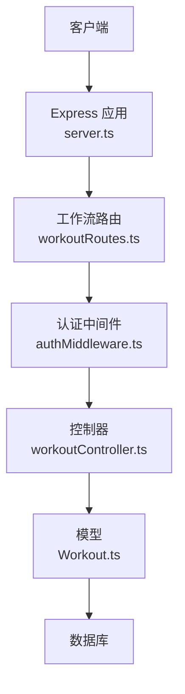
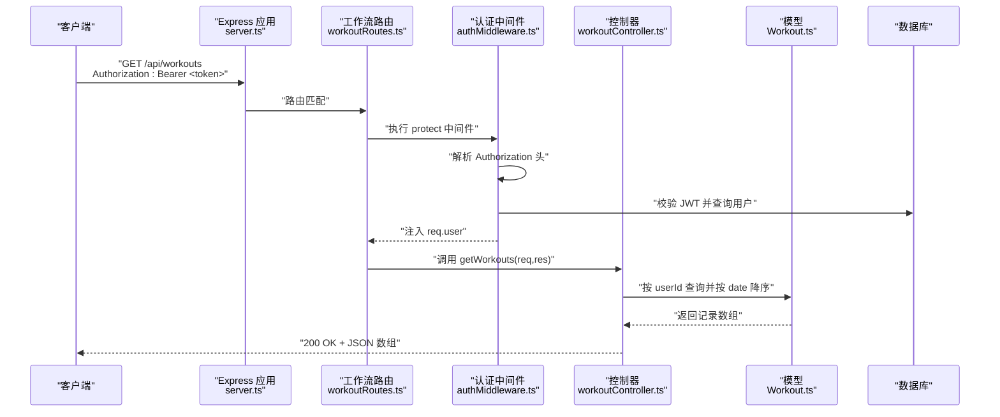
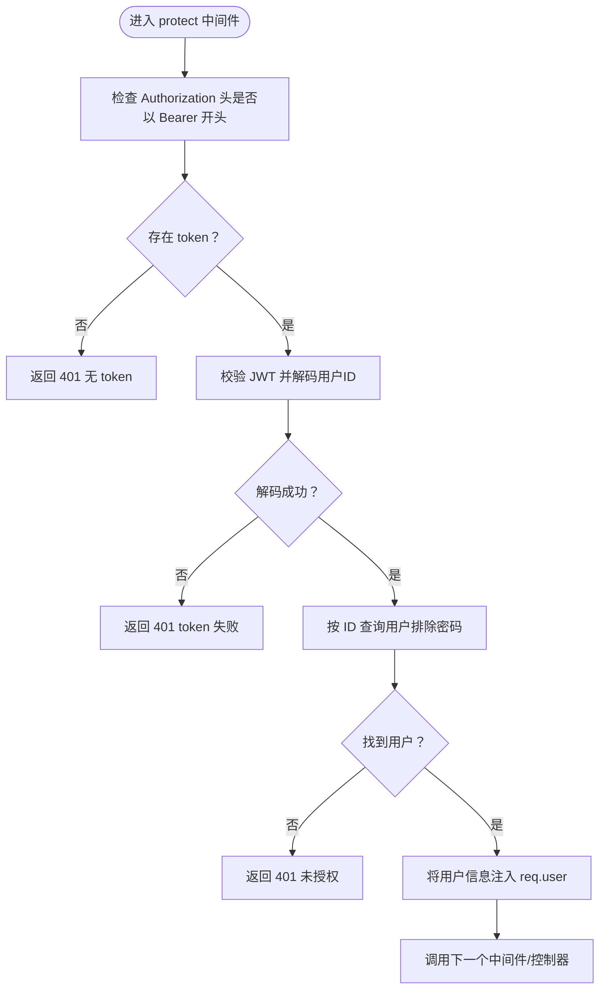
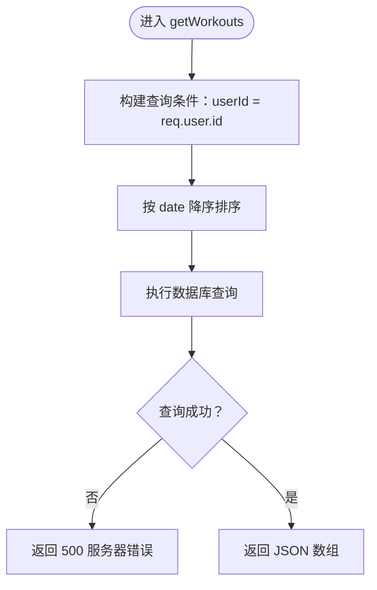
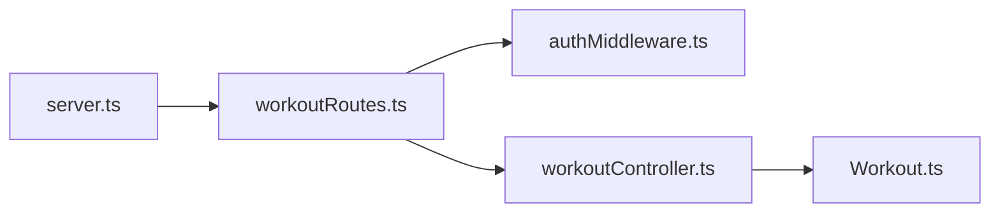

# 获取运动记录列表

<cite>
**本文引用的文件**
- [backend/src/controllers/workoutController.ts](file://backend/src/controllers/workoutController.ts)
- [backend/src/middleware/authMiddleware.ts](file://backend/src/middleware/authMiddleware.ts)
- [backend/src/models/Workout.ts](file://backend/src/models/Workout.ts)
- [backend/src/routes/workoutRoutes.ts](file://backend/src/routes/workoutRoutes.ts)
- [backend/src/server.ts](file://backend/src/server.ts)
- [docs/4. API接口文档.md](file://docs/4. API接口文档.md)
- [tests/test-api.js](file://tests/test-api.js)
</cite>

## 目录
1. [简介](#简介)
2. [项目结构](#项目结构)
3. [核心组件](#核心组件)
4. [架构总览](#架构总览)
5. [详细组件分析](#详细组件分析)
6. [依赖关系分析](#依赖关系分析)
7. [性能与可扩展性](#性能与可扩展性)
8. [故障排查指南](#故障排查指南)
9. [结论](#结论)
10. [附录](#附录)

## 简介
本文件面向前端与集成方，系统化说明“获取当前用户所有运动记录”的API：GET /api/workouts 的使用方法。内容涵盖：
- JWT 认证要求与请求头格式
- 响应格式为数组结构
- 排序规则：按日期降序
- 空列表的处理方式
- 成功响应的 JSON 示例与错误状态码说明
- 结合后端实现（workoutController.ts 中的 getWorkouts 函数）与认证中间件（authMiddleware.ts 中的 protect 中间件）的安全逻辑说明

## 项目结构
该功能位于后端服务中，采用 Express + Sequelize 架构，路由层将请求转发到控制器，控制器调用模型进行数据库查询，认证中间件在路由层拦截并校验 JWT。

图表来源
- [backend/src/server.ts](file://backend/src/server.ts#L1-L36)
- [backend/src/routes/workoutRoutes.ts](file://backend/src/routes/workoutRoutes.ts#L1-L22)
- [backend/src/middleware/authMiddleware.ts](file://backend/src/middleware/authMiddleware.ts#L1-L36)
- [backend/src/controllers/workoutController.ts](file://backend/src/controllers/workoutController.ts#L1-L50)
- [backend/src/models/Workout.ts](file://backend/src/models/Workout.ts#L1-L122)

章节来源
- [backend/src/server.ts](file://backend/src/server.ts#L1-L36)
- [backend/src/routes/workoutRoutes.ts](file://backend/src/routes/workoutRoutes.ts#L1-L22)

## 核心组件
- 路由层：定义 GET /api/workouts 并绑定保护中间件与控制器方法
- 认证中间件：从请求头解析 Bearer Token，校验并注入用户信息到 req.user
- 控制器：根据 req.user.id 查询当前用户的所有运动记录，并按日期降序返回
- 模型：Workout 表结构与关联关系，确保查询字段与类型一致

章节来源
- [backend/src/routes/workoutRoutes.ts](file://backend/src/routes/workoutRoutes.ts#L1-L22)
- [backend/src/middleware/authMiddleware.ts](file://backend/src/middleware/authMiddleware.ts#L1-L36)
- [backend/src/controllers/workoutController.ts](file://backend/src/controllers/workoutController.ts#L1-L50)
- [backend/src/models/Workout.ts](file://backend/src/models/Workout.ts#L1-L122)

## 架构总览
下图展示从客户端到数据库的完整调用链路，以及认证与授权的关键节点。

图表来源
- [backend/src/server.ts](file://backend/src/server.ts#L1-L36)
- [backend/src/routes/workoutRoutes.ts](file://backend/src/routes/workoutRoutes.ts#L1-L22)
- [backend/src/middleware/authMiddleware.ts](file://backend/src/middleware/authMiddleware.ts#L1-L36)
- [backend/src/controllers/workoutController.ts](file://backend/src/controllers/workoutController.ts#L1-L50)
- [backend/src/models/Workout.ts](file://backend/src/models/Workout.ts#L1-L122)

## 详细组件分析

### 端点定义与访问控制
- 方法与路径：GET /api/workouts
- 访问级别：私有（需认证）
- 路由绑定：workoutRoutes.ts 将 GET /api/workouts 绑定到 protect 中间件与 getWorkouts 控制器

章节来源
- [backend/src/routes/workoutRoutes.ts](file://backend/src/routes/workoutRoutes.ts#L1-L22)

### 认证中间件（protect）流程
- 请求头要求：Authorization: Bearer <JWT_TOKEN>
- 校验流程：
  - 解析 Authorization 头，提取 Bearer Token
  - 使用密钥校验 JWT，得到用户标识
  - 从数据库加载用户（排除敏感字段），注入到 req.user
  - 若无 token 或校验失败，返回 401
- 安全要点：仅当通过校验时，才允许继续执行后续控制器逻辑

图表来源
- [backend/src/middleware/authMiddleware.ts](file://backend/src/middleware/authMiddleware.ts#L1-L36)

章节来源
- [backend/src/middleware/authMiddleware.ts](file://backend/src/middleware/authMiddleware.ts#L1-L36)

### 控制器实现（getWorkouts）
- 查询逻辑：按 req.user.id 过滤记录
- 排序规则：按 date 字段降序
- 响应：直接返回查询结果（数组）
- 错误处理：捕获异常统一返回 500

图表来源
- [backend/src/controllers/workoutController.ts](file://backend/src/controllers/workoutController.ts#L1-L50)

章节来源
- [backend/src/controllers/workoutController.ts](file://backend/src/controllers/workoutController.ts#L1-L50)

### 数据模型与关联
- Workout 模型包含字段：id、userId、name、type、duration、calories、distance、steps、date、notes 等
- 关联：User 与 Workout 为一对多关系（User.hasMany(Workout)）

章节来源
- [backend/src/models/Workout.ts](file://backend/src/models/Workout.ts#L1-L122)

### API 使用说明
- 请求方法：GET
- URL：/api/workouts
- 认证：必须携带 Authorization: Bearer <token>
- 响应体：JSON 数组，元素为运动记录对象
- 排序：按 date 字段降序排列
- 空列表：若当前用户无任何记录，返回空数组 []
- 错误状态码：
  - 401：未认证或 token 无效
  - 500：服务器内部错误

章节来源
- [docs/4. API接口文档.md](file://docs/4. API接口文档.md#L100-L125)
- [backend/src/controllers/workoutController.ts](file://backend/src/controllers/workoutController.ts#L1-L50)
- [backend/src/middleware/authMiddleware.ts](file://backend/src/middleware/authMiddleware.ts#L1-L36)

### 成功响应示例
- 返回数组，每个元素为一个运动记录对象，包含字段：id、name、type、duration、calories、distance、steps、date、notes
- 数组按 date 降序排列
- 当前用户无记录时，返回 []

章节来源
- [docs/4. API接口文档.md](file://docs/4. API接口文档.md#L100-L125)

### 错误状态码说明
- 401 未授权：缺少 Authorization 头、token 无效或无法解析
- 500 服务器错误：数据库查询或内部异常

章节来源
- [backend/src/middleware/authMiddleware.ts](file://backend/src/middleware/authMiddleware.ts#L1-L36)
- [backend/src/controllers/workoutController.ts](file://backend/src/controllers/workoutController.ts#L1-L50)

### 安全逻辑与数据隔离
- getWorkouts 通过 req.user.id 作为查询条件，确保只返回当前已认证用户的数据
- protect 中间件在路由层完成认证，避免控制器重复校验
- 该安全策略贯穿所有 /api/workouts 下的受保护操作

章节来源
- [backend/src/controllers/workoutController.ts](file://backend/src/controllers/workoutController.ts#L1-L50)
- [backend/src/middleware/authMiddleware.ts](file://backend/src/middleware/authMiddleware.ts#L1-L36)

## 依赖关系分析
- 路由依赖中间件：workoutRoutes.ts 依赖 authMiddleware.ts 的 protect
- 控制器依赖模型：workoutController.ts 依赖 Workout 模型
- 服务器装配：server.ts 注册 /api/workouts 路由

图表来源
- [backend/src/server.ts](file://backend/src/server.ts#L1-L36)
- [backend/src/routes/workoutRoutes.ts](file://backend/src/routes/workoutRoutes.ts#L1-L22)
- [backend/src/middleware/authMiddleware.ts](file://backend/src/middleware/authMiddleware.ts#L1-L36)
- [backend/src/controllers/workoutController.ts](file://backend/src/controllers/workoutController.ts#L1-L50)
- [backend/src/models/Workout.ts](file://backend/src/models/Workout.ts#L1-L122)

章节来源
- [backend/src/server.ts](file://backend/src/server.ts#L1-L36)
- [backend/src/routes/workoutRoutes.ts](file://backend/src/routes/workoutRoutes.ts#L1-L22)

## 性能与可扩展性
- 查询复杂度：单表过滤 + 排序，索引建议在 userId 与 date 上建立复合索引以优化大列表场景
- 分页：当前实现未分页，建议在高并发或大数据量场景引入分页参数（如 limit/offset 或基于时间游标）
- 缓存：可考虑对近期常用查询结果做轻量缓存（注意数据一致性）

[本节为通用建议，不直接分析具体文件]

## 故障排查指南
- 401 未授权
  - 检查 Authorization 头是否正确设置为 Bearer <token>
  - 确认 token 未过期且密钥配置正确
- 500 服务器错误
  - 查看服务端日志定位数据库异常
  - 检查数据库连接与权限
- 空数组
  - 确认当前用户确有记录
  - 检查日期字段是否正确传入

章节来源
- [backend/src/middleware/authMiddleware.ts](file://backend/src/middleware/authMiddleware.ts#L1-L36)
- [backend/src/controllers/workoutController.ts](file://backend/src/controllers/workoutController.ts#L1-L50)

## 结论
GET /api/workouts 提供了安全、稳定的运动记录列表查询能力。通过路由层的认证中间件与控制器的用户隔离查询，确保了数据安全与一致性。响应为数组结构并按日期降序排列，便于前端展示与消费。建议在生产环境中配合分页与索引优化以提升性能。

[本节为总结性内容，不直接分析具体文件]

## 附录

### API 规范摘要
- 方法：GET
- 路径：/api/workouts
- 认证：Bearer Token
- 响应：JSON 数组（按 date 降序）
- 错误：401、500

章节来源
- [docs/4. API接口文档.md](file://docs/4. API接口文档.md#L100-L125)

### 端到端调用参考（测试脚本）
- 参考测试脚本中对 GET /api/workouts 的调用方式，包含 Authorization 头与 Bearer Token 的使用

章节来源
- [tests/test-api.js](file://tests/test-api.js#L117-L134)