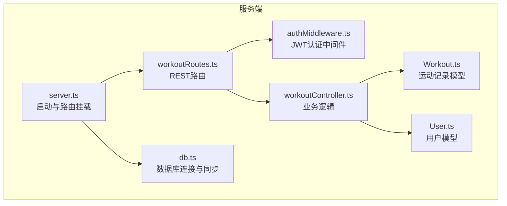
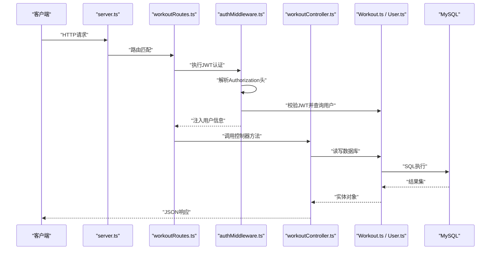
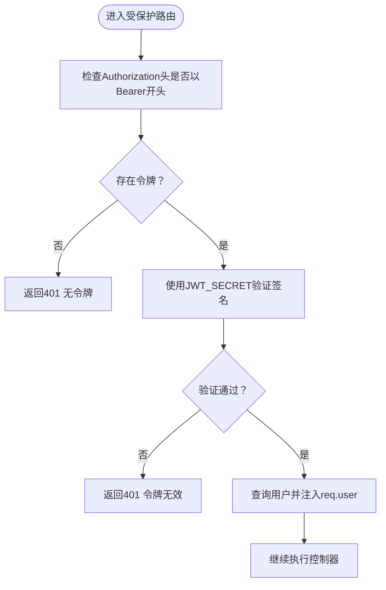
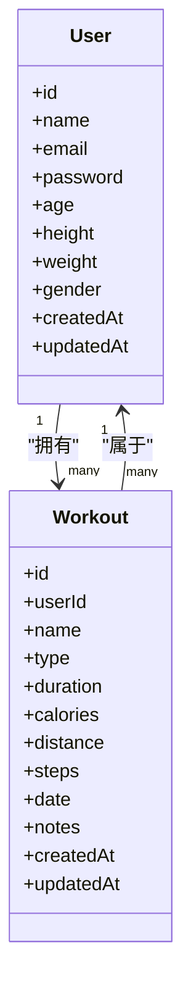
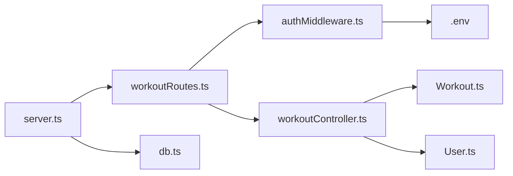

# 运动记录API

<cite>
**本文引用的文件**
- [backend/src/server.ts](file://backend/src/server.ts)
- [backend/src/routes/workoutRoutes.ts](file://backend/src/routes/workoutRoutes.ts)
- [backend/src/controllers/workoutController.ts](file://backend/src/controllers/workoutController.ts)
- [backend/src/middleware/authMiddleware.ts](file://backend/src/middleware/authMiddleware.ts)
- [backend/src/models/Workout.ts](file://backend/src/models/Workout.ts)
- [backend/src/models/User.ts](file://backend/src/models/User.ts)
- [backend/src/config/db.ts](file://backend/src/config/db.ts)
- [backend/.env](file://backend/.env)
- [docs/4. API接口文档.md](file://docs/4. API接口文档.md)
- [tests/test-api.js](file://tests/test-api.js)
</cite>

## 目录
1. [简介](#简介)
2. [项目结构](#项目结构)
3. [核心组件](#核心组件)
4. [架构总览](#架构总览)
5. [详细组件分析](#详细组件分析)
6. [依赖关系分析](#依赖关系分析)
7. [性能与扩展性考虑](#性能与扩展性考虑)
8. [故障排查指南](#故障排查指南)
9. [结论](#结论)
10. [附录：接口规范与示例](#附录接口规范与示例)

## 简介
本文件为“运动记录管理API”的权威技术文档，覆盖以下五个端点：
- GET /api/workouts（列表）
- POST /api/workouts（创建）
- GET /api/workouts/:id（详情）
- PUT /api/workouts/:id（更新）
- DELETE /api/workouts/:id（删除）

所有端点均为私有接口，需要通过JWT进行认证。文档将详细说明：
- JWT认证流程与保护机制
- Workout对象的数据结构与字段约束
- 请求体格式、必填字段与可选字段
- 分页与过滤策略（当前实现未提供分页参数，但支持按用户隔离）
- 错误场景说明（404资源不存在、401未授权、401无令牌、500服务器错误）
- 创建跑步记录与获取单条记录的示例调用路径

## 项目结构
后端采用Express + Sequelize架构，路由层负责HTTP请求映射，控制器层处理业务逻辑，中间件层负责JWT认证，模型层定义数据结构与约束，数据库连接在启动时初始化。

图表来源
- [backend/src/server.ts](file://backend/src/server.ts#L1-L36)
- [backend/src/routes/workoutRoutes.ts](file://backend/src/routes/workoutRoutes.ts#L1-L22)
- [backend/src/controllers/workoutController.ts](file://backend/src/controllers/workoutController.ts#L1-L132)
- [backend/src/middleware/authMiddleware.ts](file://backend/src/middleware/authMiddleware.ts#L1-L36)
- [backend/src/models/Workout.ts](file://backend/src/models/Workout.ts#L1-L122)
- [backend/src/models/User.ts](file://backend/src/models/User.ts#L1-L119)
- [backend/src/config/db.ts](file://backend/src/config/db.ts#L1-L41)

章节来源
- [backend/src/server.ts](file://backend/src/server.ts#L1-L36)
- [backend/src/config/db.ts](file://backend/src/config/db.ts#L1-L41)

## 核心组件
- 路由层：在workoutRoutes中定义REST端点，并统一使用protect中间件进行JWT校验。
- 控制器层：实现列表、创建、详情、更新、删除的具体逻辑，包含用户隔离与权限校验。
- 中间件层：authMiddleware从Authorization头解析Bearer Token，验证后将用户信息注入到请求上下文。
- 模型层：Workout模型定义字段类型、枚举值、非空约束与外键关联；User模型定义用户属性与密码哈希钩子。
- 数据库连接：server.ts启动时加载环境变量并连接数据库，随后同步模型。

章节来源
- [backend/src/routes/workoutRoutes.ts](file://backend/src/routes/workoutRoutes.ts#L1-L22)
- [backend/src/controllers/workoutController.ts](file://backend/src/controllers/workoutController.ts#L1-L132)
- [backend/src/middleware/authMiddleware.ts](file://backend/src/middleware/authMiddleware.ts#L1-L36)
- [backend/src/models/Workout.ts](file://backend/src/models/Workout.ts#L1-L122)
- [backend/src/models/User.ts](file://backend/src/models/User.ts#L1-L119)
- [backend/src/server.ts](file://backend/src/server.ts#L1-L36)
- [backend/src/config/db.ts](file://backend/src/config/db.ts#L1-L41)

## 架构总览
下图展示从客户端到数据库的完整调用链路，包括JWT认证与业务处理。

图表来源
- [backend/src/server.ts](file://backend/src/server.ts#L1-L36)
- [backend/src/routes/workoutRoutes.ts](file://backend/src/routes/workoutRoutes.ts#L1-L22)
- [backend/src/middleware/authMiddleware.ts](file://backend/src/middleware/authMiddleware.ts#L1-L36)
- [backend/src/controllers/workoutController.ts](file://backend/src/controllers/workoutController.ts#L1-L132)
- [backend/src/models/Workout.ts](file://backend/src/models/Workout.ts#L1-L122)
- [backend/src/models/User.ts](file://backend/src/models/User.ts#L1-L119)

## 详细组件分析

### JWT认证与保护机制
- 认证方式：Bearer Token。客户端在每个受保护请求的Authorization头中携带形如“Bearer <token>”的令牌。
- 中间件逻辑：从Authorization头提取令牌，使用环境变量中的JWT_SECRET进行签名验证；成功后将用户信息（排除密码）注入到req.user，失败则返回401。
- 作用范围：workoutRoutes.ts中所有端点均通过protect中间件保护。

图表来源
- [backend/src/middleware/authMiddleware.ts](file://backend/src/middleware/authMiddleware.ts#L1-L36)
- [backend/.env](file://backend/.env#L1-L10)

章节来源
- [backend/src/middleware/authMiddleware.ts](file://backend/src/middleware/authMiddleware.ts#L1-L36)
- [backend/.env](file://backend/.env#L1-L10)

### Workout对象结构与字段约束
Workout模型定义如下字段与约束（部分字段为可选）：
- id：自增主键
- userId：外键关联用户表，不允许为空
- name：字符串，长度限制，不允许为空
- type：枚举类型，取值限定为若干运动类型之一
- duration：分钟数，非负整数，不允许为空
- calories：卡路里消耗，非负整数，不允许为空
- distance：距离（公里），可选
- steps：步数，可选
- date：运动日期时间，默认当前时间
- notes：备注，可选
- createdAt/updatedAt：自动维护的时间戳

图表来源
- [backend/src/models/Workout.ts](file://backend/src/models/Workout.ts#L1-L122)
- [backend/src/models/User.ts](file://backend/src/models/User.ts#L1-L119)

章节来源
- [backend/src/models/Workout.ts](file://backend/src/models/Workout.ts#L1-L122)
- [backend/src/models/User.ts](file://backend/src/models/User.ts#L1-L119)

### GET /api/workouts（列表）
- 功能：返回当前登录用户的所有运动记录，按日期降序排列。
- 认证：Bearer Token
- 响应：数组，元素为Workout对象（不包含敏感字段）
- 当前实现特点：未提供分页参数（如limit、offset），建议客户端自行分页或后续版本增加分页参数

章节来源
- [backend/src/controllers/workoutController.ts](file://backend/src/controllers/workoutController.ts#L1-L22)
- [docs/4. API接口文档.md](file://docs/4. API接口文档.md#L100-L124)

### POST /api/workouts（创建）
- 功能：为当前登录用户创建一条新的运动记录
- 认证：Bearer Token
- 请求体字段：
  - name：字符串，必填
  - type：枚举，必填
  - duration：分钟数，必填
  - calories：卡路里消耗，必填
  - distance：距离（公里），可选
  - steps：步数，可选
  - date：运动日期时间，可选（默认当前时间）
  - notes：备注，可选
- 响应：创建成功的Workout对象
- 注意：请求体字段与模型字段一一对应，未提供的可选字段将保持默认值

章节来源
- [backend/src/controllers/workoutController.ts](file://backend/src/controllers/workoutController.ts#L48-L71)
- [backend/src/models/Workout.ts](file://backend/src/models/Workout.ts#L1-L122)
- [docs/4. API接口文档.md](file://docs/4. API接口文档.md#L126-L159)

### GET /api/workouts/:id（详情）
- 功能：根据ID获取某条运动记录
- 认证：Bearer Token
- 权限校验：仅当记录的userId等于当前登录用户id时才允许访问，否则返回401
- 响应：单个Workout对象
- 错误：若记录不存在，返回404

章节来源
- [backend/src/controllers/workoutController.ts](file://backend/src/controllers/workoutController.ts#L24-L46)
- [docs/4. API接口文档.md](file://docs/4. API接口文档.md#L161-L181)

### PUT /api/workouts/:id（更新）
- 功能：更新指定ID的运动记录
- 认证：Bearer Token
- 权限校验：仅当记录的userId等于当前登录用户id时才允许更新，否则返回401
- 请求体字段：与创建相同，但支持部分字段更新（未提供的字段保持原值）
- 响应：更新后的Workout对象
- 错误：若记录不存在，返回404

章节来源
- [backend/src/controllers/workoutController.ts](file://backend/src/controllers/workoutController.ts#L73-L107)
- [docs/4. API接口文档.md](file://docs/4. API接口文档.md#L183-L216)

### DELETE /api/workouts/:id（删除）
- 功能：删除指定ID的运动记录
- 认证：Bearer Token
- 权限校验：仅当记录的userId等于当前登录用户id时才允许删除，否则返回401
- 响应：删除成功消息
- 错误：若记录不存在，返回404

章节来源
- [backend/src/controllers/workoutController.ts](file://backend/src/controllers/workoutController.ts#L109-L132)
- [docs/4. API接口文档.md](file://docs/4. API接口文档.md#L218-L230)

## 依赖关系分析
- 路由依赖中间件：workoutRoutes.ts在每个端点上都依赖authMiddleware.ts进行JWT校验。
- 控制器依赖模型：workoutController.ts依赖Workout与User模型进行数据读写与权限校验。
- 服务器启动依赖数据库：server.ts在启动时连接数据库并同步模型。
- 环境变量依赖：JWT_SECRET用于签名校验；数据库连接参数来自.env。

图表来源
- [backend/src/routes/workoutRoutes.ts](file://backend/src/routes/workoutRoutes.ts#L1-L22)
- [backend/src/middleware/authMiddleware.ts](file://backend/src/middleware/authMiddleware.ts#L1-L36)
- [backend/src/controllers/workoutController.ts](file://backend/src/controllers/workoutController.ts#L1-L132)
- [backend/src/models/Workout.ts](file://backend/src/models/Workout.ts#L1-L122)
- [backend/src/models/User.ts](file://backend/src/models/User.ts#L1-L119)
- [backend/src/server.ts](file://backend/src/server.ts#L1-L36)
- [backend/src/config/db.ts](file://backend/src/config/db.ts#L1-L41)
- [backend/.env](file://backend/.env#L1-L10)

章节来源
- [backend/src/server.ts](file://backend/src/server.ts#L1-L36)
- [backend/src/config/db.ts](file://backend/src/config/db.ts#L1-L41)
- [backend/.env](file://backend/.env#L1-L10)

## 性能与扩展性考虑
- 列表排序：当前按date降序返回，适合按时间浏览；若数据量大，建议引入分页参数（如limit、offset）与索引优化。
- 权限校验：每次详情/更新/删除均进行用户隔离校验，确保数据安全；建议在控制器层统一封装该逻辑，避免重复代码。
- 数据库同步：启动时会尝试同步模型，开发阶段较为便利；生产环境建议谨慎使用alter或force策略，避免破坏现有数据。
- JWT密钥：JWT_SECRET应妥善保管，建议使用强随机密钥并在部署环境中加密存储。

[本节为通用建议，无需列出章节来源]

## 故障排查指南
- 401 未授权（无令牌或令牌无效）
  - 确认请求头中包含Authorization: Bearer <token>，且令牌未过期
  - 确认JWT_SECRET与签发方一致
- 401 未授权（资源不属于当前用户）
  - 确认当前登录用户与记录的userId一致
- 404 资源不存在
  - 确认传入的记录ID有效
- 500 服务器错误
  - 查看服务端日志，确认数据库连接正常与模型定义正确

章节来源
- [backend/src/middleware/authMiddleware.ts](file://backend/src/middleware/authMiddleware.ts#L1-L36)
- [backend/src/controllers/workoutController.ts](file://backend/src/controllers/workoutController.ts#L1-L132)

## 结论
本API围绕JWT认证与用户隔离实现了完整的运动记录生命周期管理。当前实现简洁可靠，具备良好的扩展空间（如添加分页、过滤、统计等）。建议在后续迭代中补充分页参数与更细粒度的权限控制，并完善错误码与响应体的一致性。

[本节为总结性内容，无需列出章节来源]

## 附录：接口规范与示例

### 接口清单与认证要求
- GET /api/workouts
  - 认证：Bearer Token
  - 响应：Workout对象数组
- POST /api/workouts
  - 认证：Bearer Token
  - 请求体：name、type、duration、calories（必填）；distance、steps、date、notes（可选）
  - 响应：创建成功的Workout对象
- GET /api/workouts/:id
  - 认证：Bearer Token
  - 权限：仅记录所属用户可访问
  - 响应：单个Workout对象
- PUT /api/workouts/:id
  - 认证：Bearer Token
  - 权限：仅记录所属用户可更新
  - 请求体：同创建（支持部分字段更新）
  - 响应：更新后的Workout对象
- DELETE /api/workouts/:id
  - 认证：Bearer Token
  - 权限：仅记录所属用户可删除
  - 响应：删除成功消息

章节来源
- [docs/4. API接口文档.md](file://docs/4. API接口文档.md#L100-L231)
- [backend/src/controllers/workoutController.ts](file://backend/src/controllers/workoutController.ts#L1-L132)

### 示例调用路径
- 创建跑步记录（示例路径）
  - 使用已登录用户的Bearer Token调用POST /api/workouts
  - 请求体包含name、type（例如"running"）、duration、calories、distance等字段
  - 参考测试脚本中的创建示例路径
- 获取单条记录（示例路径）
  - 使用Bearer Token调用GET /api/workouts/:id
  - 若返回404表示记录不存在；若返回401表示未授权访问

章节来源
- [tests/test-api.js](file://tests/test-api.js#L88-L149)
- [docs/4. API接口文档.md](file://docs/4. API接口文档.md#L126-L181)