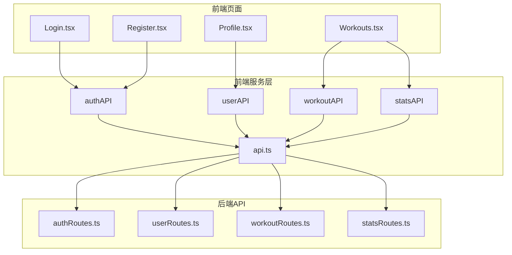
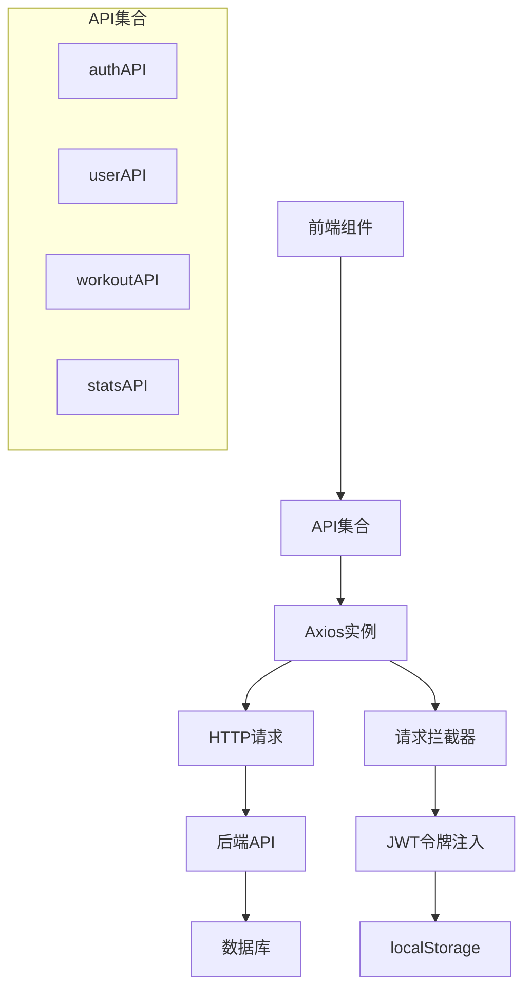
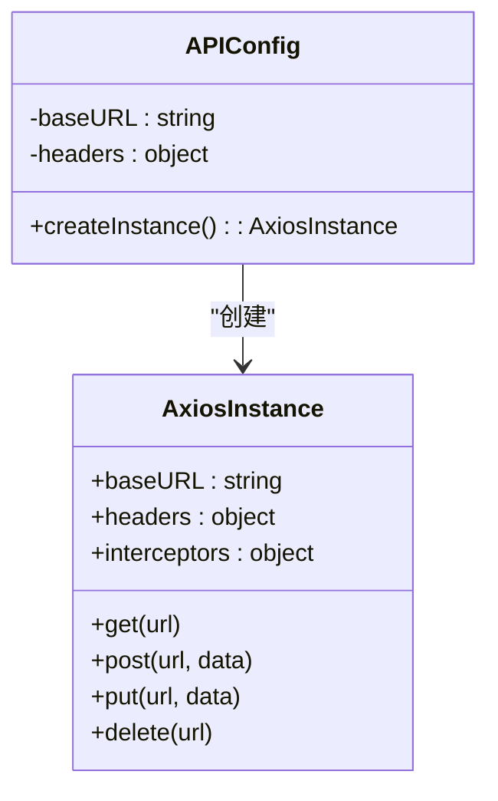
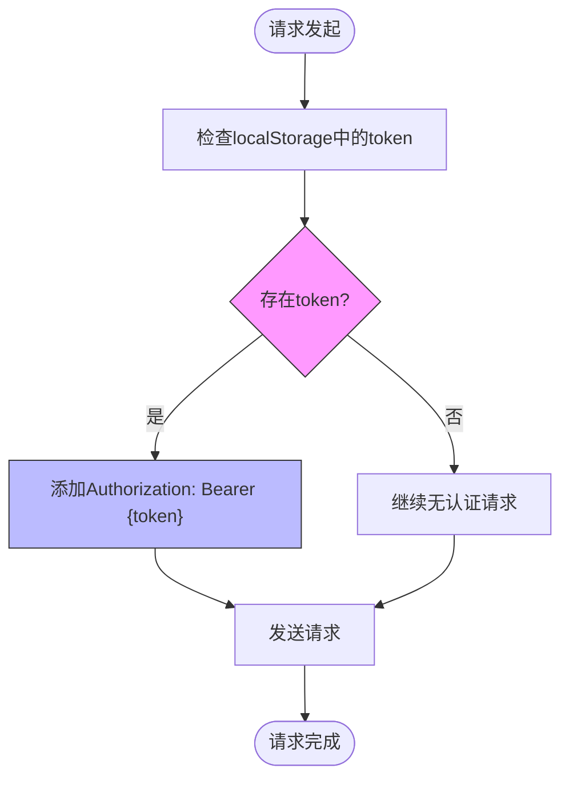
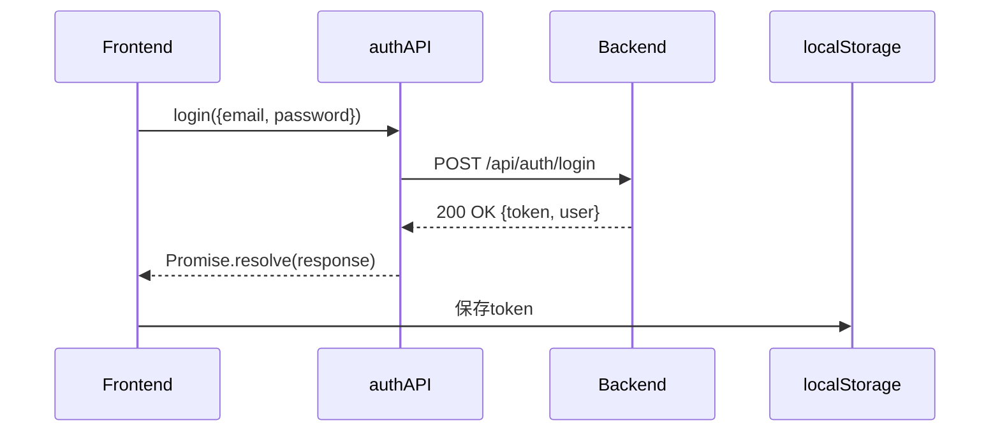
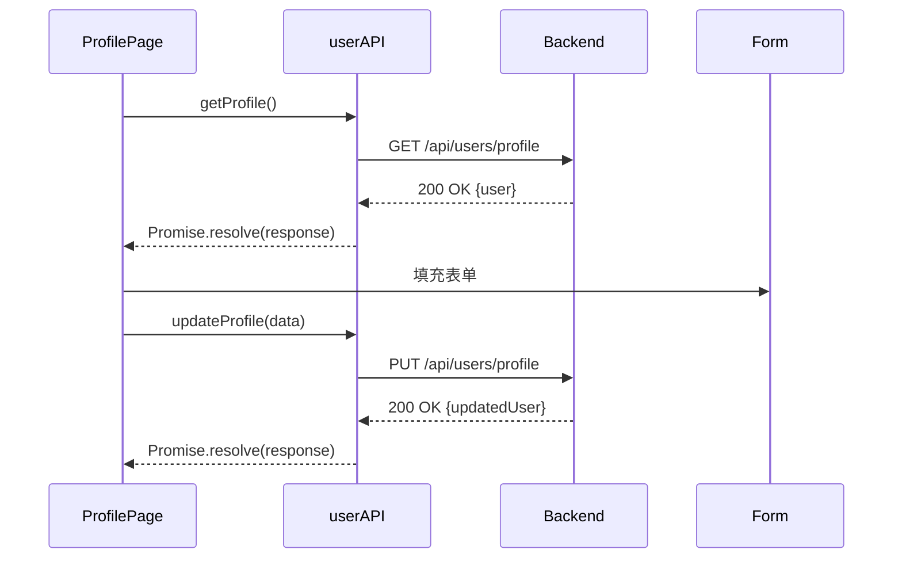
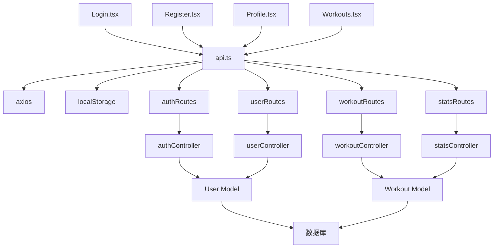

# API客户端封装

<cite>
**本文档引用文件**  
- [api.ts](file://frontend/src/services/api.ts)
- [Login.tsx](file://frontend/src/pages/Login.tsx)
- [Register.tsx](file://frontend/src/pages/Register.tsx)
- [Profile.tsx](file://frontend/src/pages/Profile.tsx)
- [Workouts.tsx](file://frontend/src/pages/Workouts.tsx)
- [authRoutes.ts](file://backend/src/routes/authRoutes.ts)
- [userRoutes.ts](file://backend/src/routes/userRoutes.ts)
- [workoutRoutes.ts](file://backend/src/routes/workoutRoutes.ts)
- [statsRoutes.ts](file://backend/src/routes/statsRoutes.ts)
- [authController.ts](file://backend/src/controllers/authController.ts)
- [userController.ts](file://backend/src/controllers/userController.ts)
- [workoutController.ts](file://backend/src/controllers/workoutController.ts)
- [statsController.ts](file://backend/src/controllers/statsController.ts)
</cite>

## 目录
1. [简介](#简介)
2. [项目结构](#项目结构)
3. [核心组件](#核心组件)
4. [架构概述](#架构概述)
5. [详细组件分析](#详细组件分析)
6. [依赖分析](#依赖分析)
7. [性能考虑](#性能考虑)
8. [故障排除指南](#故障排除指南)
9. [结论](#结论)

## 简介
本技术文档全面解析健身追踪应用中的API客户端封装设计。文档重点阐述基于Axios的`api.ts`服务模块实现，涵盖基础实例配置、请求拦截器机制、认证流程、各API集合的接口定义及使用示例。通过TypeScript类型系统确保类型安全，并提供完整的错误处理和高级配置指南，为开发者提供清晰的API使用规范。

## 项目结构
前端API客户端封装位于`frontend/src/services/api.ts`文件中，作为整个应用与后端通信的统一入口。该模块通过Axios创建配置化的HTTP客户端实例，并导出四个功能明确的API集合（authAPI、userAPI、workoutAPI、statsAPI），分别对应用户认证、用户管理、运动记录和统计分析功能。



**图示来源**
- [api.ts](file://frontend/src/services/api.ts)
- [Login.tsx](file://frontend/src/pages/Login.tsx)
- [Register.tsx](file://frontend/src/pages/Register.tsx)
- [Profile.tsx](file://frontend/src/pages/Profile.tsx)
- [Workouts.tsx](file://frontend/src/pages/Workouts.tsx)

**本节来源**
- [api.ts](file://frontend/src/services/api.ts)
- [frontend/src/pages](file://frontend/src/pages)

## 核心组件
`api.ts`模块的核心是通过`axios.create`创建的配置化实例，该实例预设了基础URL和请求头，并通过请求拦截器自动注入JWT认证令牌。四个API集合（authAPI、userAPI、workoutAPI、statsAPI）封装了具体的业务接口，提供类型安全的Promise返回值，简化了前端组件的调用逻辑。

**本节来源**
- [api.ts](file://frontend/src/services/api.ts)

## 架构概述
API客户端采用分层架构设计，底层是Axios HTTP客户端，中间层是配置化的API实例，顶层是按功能划分的API集合。这种设计实现了关注点分离，提高了代码的可维护性和可测试性。请求拦截器负责统一处理认证，各API集合提供语义化的接口方法，前端页面组件通过导入相应的API集合即可发起网络请求。



**图示来源**
- [api.ts](file://frontend/src/services/api.ts)
- [authController.ts](file://backend/src/controllers/authController.ts)

## 详细组件分析

### API基础配置分析
`api.ts`文件通过`axios.create`方法创建了一个预配置的Axios实例，该实例设置了基础URL指向`http://localhost:3001/api`，并默认使用JSON格式的请求头。这一设计使得所有后续的API调用都无需重复指定基础路径和内容类型。



**图示来源**
- [api.ts](file://frontend/src/services/api.ts#L4-L9)

**本节来源**
- [api.ts](file://frontend/src/services/api.ts#L1-L23)

### 请求拦截器分析
请求拦截器是API安全性的关键组件，它在每个请求发送前自动从`localStorage`中读取JWT令牌，并将其添加到请求头的`Authorization`字段中，格式为`Bearer {token}`。这一机制确保了所有需要认证的API调用都能自动携带有效的身份凭证。



**图示来源**
- [api.ts](file://frontend/src/services/api.ts#L11-L23)

**本节来源**
- [api.ts](file://frontend/src/services/api.ts#L11-L23)
- [authMiddleware.ts](file://backend/src/middleware/authMiddleware.ts)

### authAPI分析
`authAPI`集合封装了用户注册和登录两个公共接口。这两个方法接受类型化的参数对象，并返回Promise，解析后的数据包含用户信息和JWT令牌。成功登录后，前端需将令牌保存至`localStorage`以供后续请求使用。

#### 接口方法
| 方法 | 参数类型 | 返回Promise结构 | 用途 |
|------|---------|----------------|------|
| register | `{ name: string; email: string; password: string }` | `{ token: string; _id: string; name: string; email: string }` | 用户注册 |
| login | `{ email: string; password: string }` | `{ token: string; _id: string; name: string; email: string }` | 用户登录 |



**图示来源**
- [api.ts](file://frontend/src/services/api.ts#L26-L31)
- [authController.ts](file://backend/src/controllers/authController.ts)

**本节来源**
- [api.ts](file://frontend/src/services/api.ts#L26-L31)
- [Login.tsx](file://frontend/src/pages/Login.tsx#L25-L37)
- [Register.tsx](file://frontend/src/pages/Register.tsx#L34-L46)

### userAPI分析
`userAPI`集合提供了用户个人资料的获取和更新功能，这两个接口需要用户认证。`getProfile`方法用于获取当前登录用户的信息，`updateProfile`方法允许用户更新其个人资料，参数使用`Partial`类型，表示所有字段都是可选的。

#### 接口方法
| 方法 | 参数类型 | 返回Promise结构 | 用途 |
|------|---------|----------------|------|
| getProfile | 无 | `{ _id: string; name: string; email: string; age?: number; height?: number; weight?: number; gender?: string; createdAt: string }` | 获取用户资料 |
| updateProfile | `Partial<UserProfile>` | 同getProfile返回结构 | 更新用户资料 |



**图示来源**
- [api.ts](file://frontend/src/services/api.ts#L34-L44)
- [userController.ts](file://backend/src/controllers/userController.ts)

**本节来源**
- [api.ts](file://frontend/src/services/api.ts#L34-L44)
- [Profile.tsx](file://frontend/src/pages/Profile.tsx)

### workoutAPI分析
`workoutAPI`集合提供了对运动记录的完整CRUD操作，包括获取所有记录、根据ID获取单条记录、创建、更新和删除运动记录。这些接口构成了应用的核心功能，支持用户全面管理其健身活动。

#### 接口方法
| 方法 | 参数类型 | 返回Promise结构 | 用途 |
|------|---------|----------------|------|
| getAll | 无 | `Workout[]` | 获取所有运动记录 |
| getById | `id: string` | `Workout` | 根据ID获取单条记录 |
| create | `any` | `Workout` | 创建新运动记录 |
| update | `(id: string, data: any)` | `Workout` | 更新运动记录 |
| delete | `id: string` | `{ message: string }` | 删除运动记录 |

```mermaid
flowchart TD
A[Workouts页面] --> B[workoutAPI]
B --> C[getAll]
B --> D[getById]
B --> E[create]
B --> F[update]
B --> G[delete]
C --> H[GET /api/workouts]
D --> I[GET /api/workouts/{id}]
E --> J[POST /api/workouts]
F --> K[PUT /api/workouts/{id}]
G --> L[DELETE /api/workouts/{id}]
```

**图示来源**
- [api.ts](file://frontend/src/services/api.ts#L46-L53)
- [workoutController.ts](file://backend/src/controllers/workoutController.ts)

**本节来源**
- [api.ts](file://frontend/src/services/api.ts#L46-L53)
- [Workouts.tsx](file://frontend/src/pages/Workouts.tsx)

### statsAPI分析
`statsAPI`集合提供了两个统计接口，用于获取用户的运动数据概览和周度统计。这些接口帮助用户了解其健身活动的趋势和成就，增强了应用的数据可视化能力。

#### 接口方法
| 方法 | 参数类型 | 返回Promise结构 | 用途 |
|------|---------|----------------|------|
| getWorkoutStats | 无 | `{ totalWorkouts: number; totalDuration: number; totalCalories: number; totalDistance: number; workoutsByType: Array<{ type: string; count: number }> }` | 获取运动统计 |
| getWeeklyStats | 无 | `Array<{ date: string; duration: number; calories: number; workouts: number }>` | 获取周度统计 |

```mermaid
classDiagram
class StatsResponse {
+totalWorkouts : number
+totalDuration : number
+totalCalories : number
+totalDistance : number
+workoutsByType : Array
}
class WeeklyStats {
+date : string
+duration : number
+calories : number
+workouts : number
}
StatsAPI {
+getWorkoutStats() : Promise~StatsResponse~
+getWeeklyStats() : Promise~WeeklyStats[]~
}
StatsAPI --> StatsResponse
StatsAPI --> WeeklyStats
```

**图示来源**
- [api.ts](file://frontend/src/services/api.ts#L55-L59)
- [statsController.ts](file://backend/src/controllers/statsController.ts)

**本节来源**
- [api.ts](file://frontend/src/services/api.ts#L55-L59)
- [Workouts.tsx](file://frontend/src/pages/Workouts.tsx)

## 依赖分析
API客户端模块依赖于Axios库进行HTTP通信，并与前端各页面组件紧密耦合。后端通过Express路由和控制器处理请求，使用Sequelize ORM与数据库交互。整个系统的依赖关系清晰，前端通过API客户端与后端解耦，仅依赖于定义良好的API契约。



**图示来源**
- [package.json](file://frontend/package.json)
- [api.ts](file://frontend/src/services/api.ts)
- [routes](file://backend/src/routes)
- [controllers](file://backend/src/controllers)

**本节来源**
- [package.json](file://frontend/package.json)
- [package.json](file://backend/package.json)
- [backend/src](file://backend/src)

## 性能考虑
API客户端设计考虑了性能优化，通过统一的Axios实例复用连接，减少资源开销。请求拦截器的轻量级实现确保了认证逻辑不会成为性能瓶颈。对于频繁调用的统计接口，建议后端实现缓存机制以提高响应速度。前端应合理使用加载状态提示，提升用户体验。

## 故障排除指南
当API调用失败时，应首先检查网络连接和后端服务状态。常见的401错误表示认证失败，需确认JWT令牌是否有效且正确注入。404错误可能表示API端点变更或ID无效。前端应通过`.catch()`块捕获错误，并根据`error.response?.data?.message`提供用户友好的错误提示。

**本节来源**
- [Login.tsx](file://frontend/src/pages/Login.tsx#L33-L37)
- [Register.tsx](file://frontend/src/pages/Register.tsx#L43-L46)
- [Profile.tsx](file://frontend/src/pages/Profile.tsx#L47-L51)
- [Workouts.tsx](file://frontend/src/pages/Workouts.tsx#L42-L45)

## 结论
`api.ts`模块提供了一个健壮、类型安全且易于使用的API客户端封装。通过Axios实例配置、请求拦截器和功能化的API集合，该设计极大地简化了前端与后端的交互。TypeScript类型定义确保了编译时的类型安全，减少了运行时错误。该封装模式可作为类似项目的参考实现，具有良好的可维护性和扩展性。