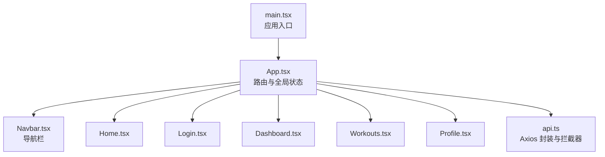
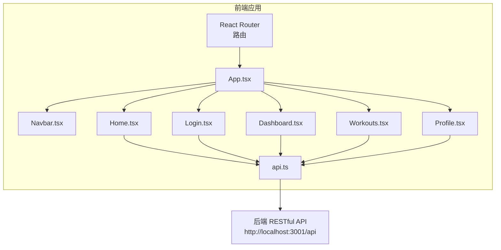
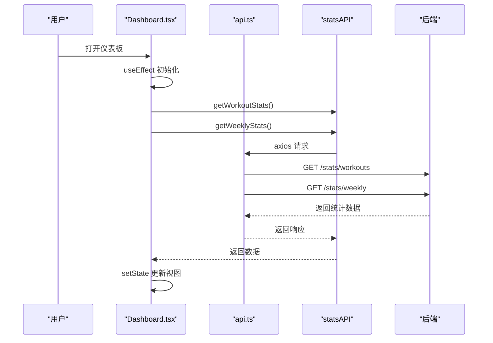
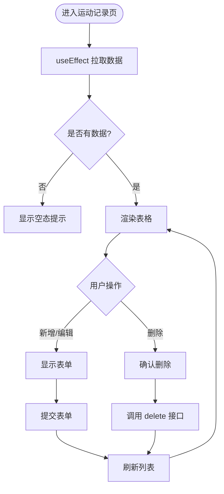
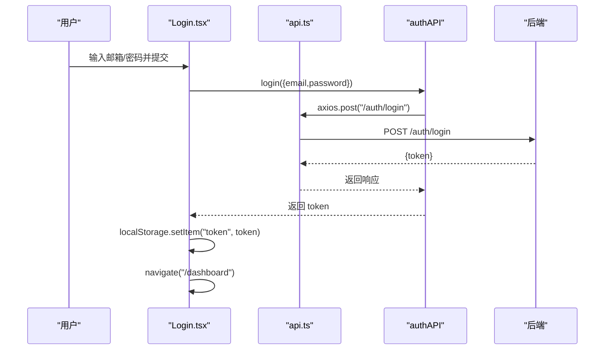
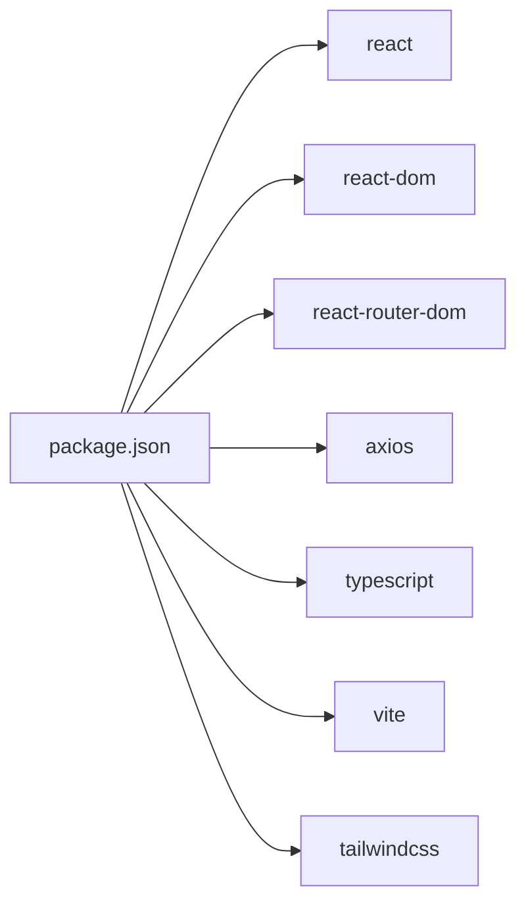

# 前端架构

<cite>
**本文引用的文件**
- [frontend/src/App.tsx](file://frontend/src/App.tsx)
- [frontend/src/main.tsx](file://frontend/src/main.tsx)
- [frontend/src/services/api.ts](file://frontend/src/services/api.ts)
- [frontend/src/components/Navbar.tsx](file://frontend/src/components/Navbar.tsx)
- [frontend/src/pages/Dashboard.tsx](file://frontend/src/pages/Dashboard.tsx)
- [frontend/src/pages/Home.tsx](file://frontend/src/pages/Home.tsx)
- [frontend/src/pages/Login.tsx](file://frontend/src/pages/Login.tsx)
- [frontend/src/pages/Profile.tsx](file://frontend/src/pages/Profile.tsx)
- [frontend/src/pages/Workouts.tsx](file://frontend/src/pages/Workouts.tsx)
- [frontend/package.json](file://frontend/package.json)
- [frontend/vite.config.ts](file://frontend/vite.config.ts)
- [frontend/tsconfig.json](file://frontend/tsconfig.json)
- [frontend/src/index.css](file://frontend/src/index.css)
- [README.md](file://README.md)
</cite>

## 目录
1. [简介](#简介)
2. [项目结构](#项目结构)
3. [核心组件](#核心组件)
4. [架构总览](#架构总览)
5. [组件详解](#组件详解)
6. [依赖关系分析](#依赖关系分析)
7. [性能考量](#性能考量)
8. [故障排查指南](#故障排查指南)
9. [结论](#结论)
10. [附录](#附录)

## 简介
本文件面向前端架构，围绕基于 React + TypeScript 的前端系统进行深入解析，重点覆盖：
- 组件树结构与路由配置
- 全局状态管理与认证流程
- 导航栏组件的导航与权限控制
- 页面组件（仪表板、运动记录、个人资料等）的布局与交互
- 通过 API 服务与后端 RESTful API 通信的封装、错误处理与认证令牌管理
- 组件层次图与数据流图，说明 props 传递、事件回调与 useEffect 副作用的应用模式

## 项目结构
前端采用模块化组织方式，按功能分层：
- 入口与渲染：main.tsx 负责挂载根组件 App
- 应用根组件：App.tsx 负责路由与全局认证状态
- 页面组件：pages 下按功能划分（Dashboard、Workouts、Profile 等）
- 公共组件：components 下放置可复用 UI（如 Navbar）
- 服务层：services 下封装 HTTP 请求与拦截器（api.ts）

图表来源
- [frontend/src/main.tsx](file://frontend/src/main.tsx#L1-L10)
- [frontend/src/App.tsx](file://frontend/src/App.tsx#L1-L48)
- [frontend/src/components/Navbar.tsx](file://frontend/src/components/Navbar.tsx#L1-L91)
- [frontend/src/pages/Home.tsx](file://frontend/src/pages/Home.tsx#L1-L110)
- [frontend/src/pages/Login.tsx](file://frontend/src/pages/Login.tsx#L1-L109)
- [frontend/src/pages/Dashboard.tsx](file://frontend/src/pages/Dashboard.tsx#L1-L174)
- [frontend/src/pages/Workouts.tsx](file://frontend/src/pages/Workouts.tsx#L1-L384)
- [frontend/src/pages/Profile.tsx](file://frontend/src/pages/Profile.tsx#L1-L245)
- [frontend/src/services/api.ts](file://frontend/src/services/api.ts#L1-L61)

章节来源
- [frontend/src/main.tsx](file://frontend/src/main.tsx#L1-L10)
- [frontend/src/App.tsx](file://frontend/src/App.tsx#L1-L48)
- [frontend/package.json](file://frontend/package.json#L1-L32)
- [frontend/vite.config.ts](file://frontend/vite.config.ts#L1-L13)
- [frontend/tsconfig.json](file://frontend/tsconfig.json#L1-L21)
- [frontend/src/index.css](file://frontend/src/index.css#L1-L16)
- [README.md](file://README.md#L1-L282)

## 核心组件
- 应用根组件 App.tsx
  - 负责：
    - 初始化认证状态（从本地存储读取 token）
    - 提供路由配置（首页、登录、注册、仪表板、运动记录、运动计划、个人资料）
    - 传递 isAuthenticated 与 onLogout 给 Navbar
  - 关键点：使用 React Hooks 管理认证状态；通过 localStorage 存储 token；路由使用 React Router v6

- 导航栏 Navbar.tsx
  - 负责：
    - 根据 isAuthenticated 显示不同菜单项
    - 提供退出登录按钮并调用父组件传入的 onLogout
    - 使用 Link 实现页面跳转

- API 服务 api.ts
  - 负责：
    - 创建 axios 实例并设置基础 URL
    - 注入请求拦截器自动附加 Authorization 头（Bearer token）
    - 暴露 authAPI、userAPI、workoutAPI、statsAPI 等命名空间方法
    - 统一封装后端 RESTful API

章节来源
- [frontend/src/App.tsx](file://frontend/src/App.tsx#L1-L48)
- [frontend/src/components/Navbar.tsx](file://frontend/src/components/Navbar.tsx#L1-L91)
- [frontend/src/services/api.ts](file://frontend/src/services/api.ts#L1-L61)

## 架构总览
前端采用“页面组件 + 服务层 + 公共组件”的分层架构：
- 页面组件负责业务视图与交互，通过服务层访问后端 API
- 服务层统一处理请求拦截、认证令牌注入与错误处理
- 公共组件（如 Navbar）提供跨页面的导航与状态反馈

图表来源
- [frontend/src/App.tsx](file://frontend/src/App.tsx#L1-L48)
- [frontend/src/components/Navbar.tsx](file://frontend/src/components/Navbar.tsx#L1-L91)
- [frontend/src/pages/Home.tsx](file://frontend/src/pages/Home.tsx#L1-L110)
- [frontend/src/pages/Login.tsx](file://frontend/src/pages/Login.tsx#L1-L109)
- [frontend/src/pages/Dashboard.tsx](file://frontend/src/pages/Dashboard.tsx#L1-L174)
- [frontend/src/pages/Workouts.tsx](file://frontend/src/pages/Workouts.tsx#L1-L384)
- [frontend/src/pages/Profile.tsx](file://frontend/src/pages/Profile.tsx#L1-L245)
- [frontend/src/services/api.ts](file://frontend/src/services/api.ts#L1-L61)

## 组件详解

### App.tsx：路由与全局状态
- 路由定义
  - 根路径 "/"：Home
  - 认证相关 "/login"、"/register"
  - 业务页面 "/dashboard"、"/workouts"、"/workout-plans"、"/profile"
- 全局状态
  - 通过 useState 管理 isAuthenticated
  - 通过 useEffect 从 localStorage 初始化认证状态
  - 提供 handleLogout 移除 token 并重置状态
- 与 Navbar 通信
  - 通过 props 传递 isAuthenticated 与 onLogout

章节来源
- [frontend/src/App.tsx](file://frontend/src/App.tsx#L1-L48)

### Navbar.tsx：导航与权限控制
- Props
  - isAuthenticated: boolean
  - onLogout: () => void
- 行为
  - 未登录显示登录/注册入口
  - 已登录显示仪表板、运动计划、运动记录、个人资料入口与退出登录按钮
  - 退出登录触发父组件回调，实现登出流程

章节来源
- [frontend/src/components/Navbar.tsx](file://frontend/src/components/Navbar.tsx#L1-L91)

### Dashboard.tsx：数据聚合与可视化
- 数据获取
  - 使用 statsAPI 并行获取运动统计与周度统计
  - 使用 loading/error 状态管理加载与错误提示
- 视图
  - 概览卡片（总次数、总时长、总卡路里、总距离）
  - 周度活动柱状图
  - 运动类型分布条形图
- 副作用
  - useEffect 在挂载时发起数据请求

图表来源
- [frontend/src/pages/Dashboard.tsx](file://frontend/src/pages/Dashboard.tsx#L1-L174)
- [frontend/src/services/api.ts](file://frontend/src/services/api.ts#L1-L61)

章节来源
- [frontend/src/pages/Dashboard.tsx](file://frontend/src/pages/Dashboard.tsx#L1-L174)

### Workouts.tsx：CRUD 与表格展示
- 数据获取
  - useEffect 挂载时调用 workoutAPI.getAll() 获取列表
- 表单与 CRUD
  - 新增/编辑：收集表单字段，根据是否处于编辑模式调用 create 或 update
  - 删除：确认后调用 delete 并刷新列表
- 视图
  - 切换表单显隐
  - 展示表格与操作列（编辑/删除）
- 副作用
  - useEffect 拉取数据
  - 表单提交后重置并刷新

图表来源
- [frontend/src/pages/Workouts.tsx](file://frontend/src/pages/Workouts.tsx#L1-L384)
- [frontend/src/services/api.ts](file://frontend/src/services/api.ts#L1-L61)

章节来源
- [frontend/src/pages/Workouts.tsx](file://frontend/src/pages/Workouts.tsx#L1-L384)

### Profile.tsx：资料读取与更新
- 数据获取
  - useEffect 挂载时调用 userAPI.getProfile() 读取资料并填充表单
- 表单更新
  - 收集表单字段，调用 userAPI.updateProfile() 更新
  - 成功后更新本地状态并显示成功提示
- 副作用
  - useEffect 拉取资料
  - 提交后刷新状态

章节来源
- [frontend/src/pages/Profile.tsx](file://frontend/src/pages/Profile.tsx#L1-L245)
- [frontend/src/services/api.ts](file://frontend/src/services/api.ts#L1-L61)

### Login.tsx：认证流程与令牌管理
- 行为
  - 表单收集邮箱与密码
  - 调用 authAPI.login() 获取 token
  - 将 token 写入 localStorage
  - 导航到 /dashboard
- 错误处理
  - 捕获异常并显示错误消息

图表来源
- [frontend/src/pages/Login.tsx](file://frontend/src/pages/Login.tsx#L1-L109)
- [frontend/src/services/api.ts](file://frontend/src/services/api.ts#L1-L61)

章节来源
- [frontend/src/pages/Login.tsx](file://frontend/src/pages/Login.tsx#L1-L109)

### Home.tsx：引导页与入口
- 行为
  - 展示产品特性与价值主张
  - 提供注册入口链接
- 与路由配合
  - 作为根路径页面，引导未登录用户前往注册/登录

章节来源
- [frontend/src/pages/Home.tsx](file://frontend/src/pages/Home.tsx#L1-L110)

## 依赖关系分析
- 依赖生态
  - React + React DOM：UI 渲染与虚拟 DOM
  - React Router：声明式路由与导航
  - Axios：HTTP 客户端与拦截器
  - TailwindCSS：原子化样式与响应式布局
  - Vite：构建与开发服务器
  - TypeScript：类型安全与开发体验

图表来源
- [frontend/package.json](file://frontend/package.json#L1-L32)

章节来源
- [frontend/package.json](file://frontend/package.json#L1-L32)
- [frontend/vite.config.ts](file://frontend/vite.config.ts#L1-L13)
- [frontend/tsconfig.json](file://frontend/tsconfig.json#L1-L21)
- [frontend/src/index.css](file://frontend/src/index.css#L1-L16)

## 性能考量
- 并行请求
  - Dashboard 使用 Promise.all 并行拉取统计数据，减少等待时间
- 本地存储
  - 使用 localStorage 缓存 token，避免每次刷新重新登录
- 组件粒度
  - 页面组件职责单一，便于维护与优化
- 样式与构建
  - TailwindCSS 与 Vite 配合，提升开发效率与打包性能

章节来源
- [frontend/src/pages/Dashboard.tsx](file://frontend/src/pages/Dashboard.tsx#L1-L174)
- [frontend/src/App.tsx](file://frontend/src/App.tsx#L1-L48)

## 故障排查指南
- 认证失败
  - 检查后端返回的 token 是否正确写入 localStorage
  - 确认请求拦截器是否正确附加 Authorization 头
- 请求超时或跨域
  - 确认后端 API 地址与端口（默认 http://localhost:3001/api）
  - 检查 CORS 设置与代理配置
- 页面空白或路由不生效
  - 确认 React Router 版本与路由声明是否匹配
  - 检查 App.tsx 中 Routes/Route 的路径与元素映射
- 样式异常
  - 确认 TailwindCSS 已正确引入与构建

章节来源
- [frontend/src/services/api.ts](file://frontend/src/services/api.ts#L1-L61)
- [frontend/src/App.tsx](file://frontend/src/App.tsx#L1-L48)
- [README.md](file://README.md#L190-L210)

## 结论
该前端架构以 React + TypeScript 为基础，采用清晰的分层与模块化组织，结合 React Router 实现路由管理，通过 Axios 拦截器统一处理认证与请求封装。页面组件围绕业务场景展开，配合服务层实现对后端 RESTful API 的稳定访问。整体结构简洁、职责明确，具备良好的扩展性与可维护性。

## 附录
- 技术栈与工具链
  - React + TypeScript + TailwindCSS + React Router + Axios + Vite
- 开发与构建
  - 开发服务器端口：3000（前端），3001（后端）
  - 构建输出目录：dist（前端）

章节来源
- [README.md](file://README.md#L1-L282)
- [frontend/vite.config.ts](file://frontend/vite.config.ts#L1-L13)