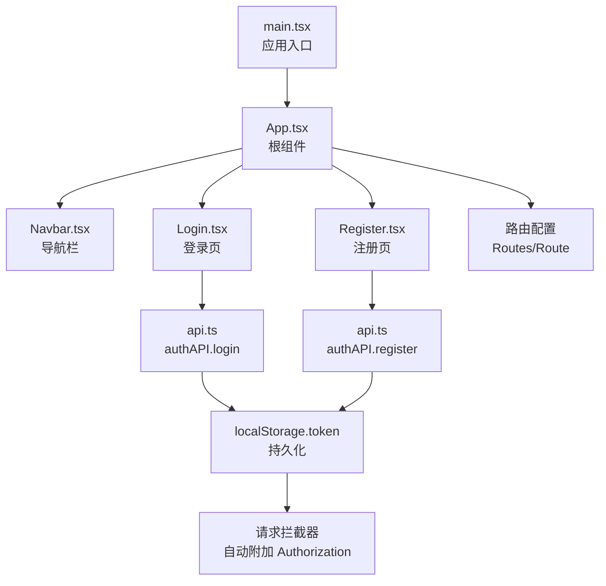
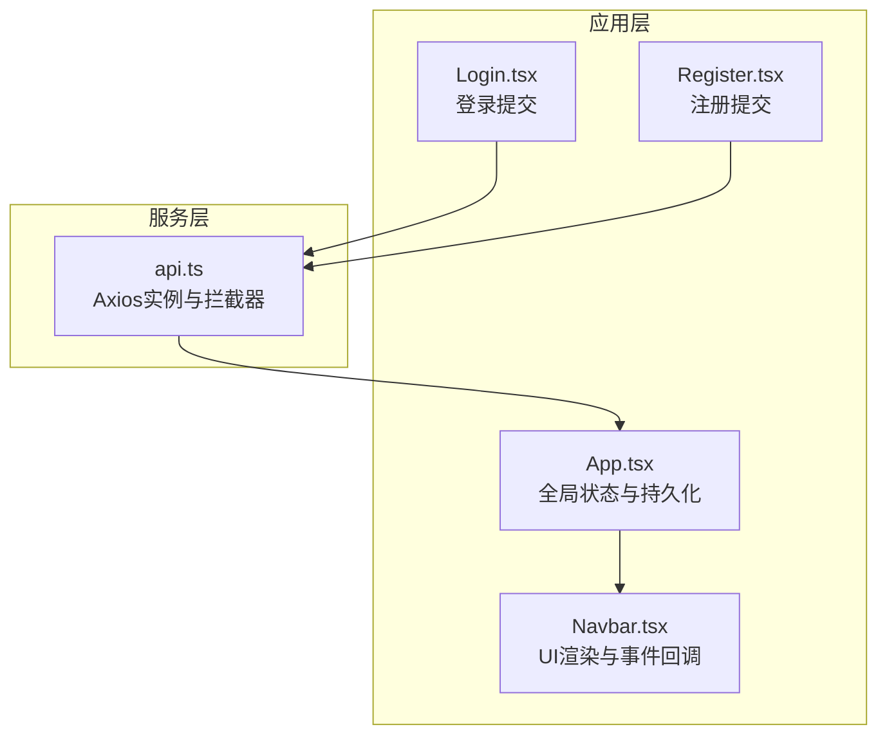
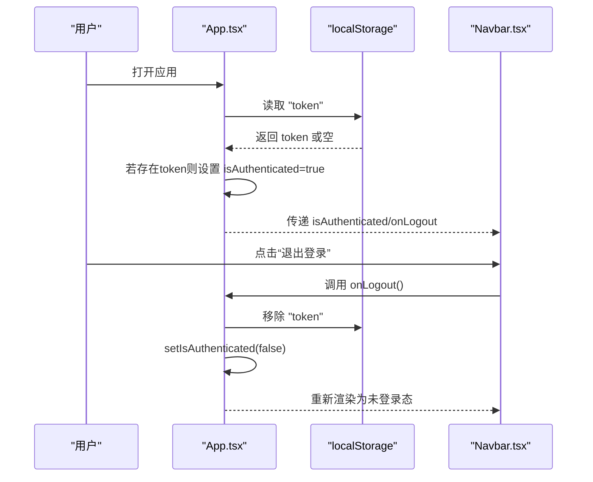
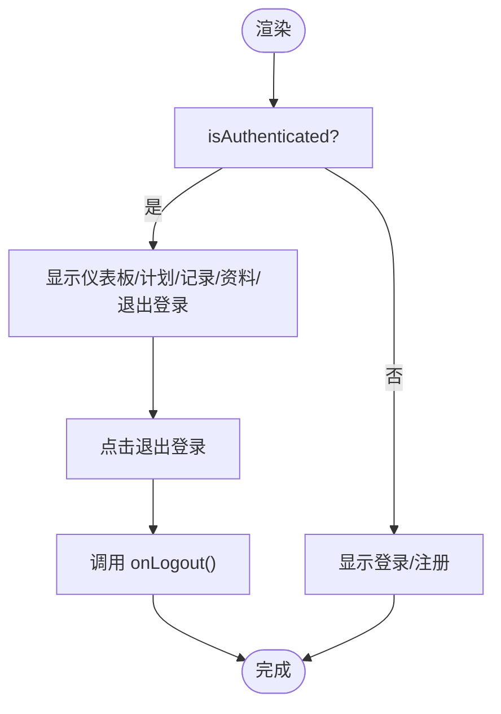
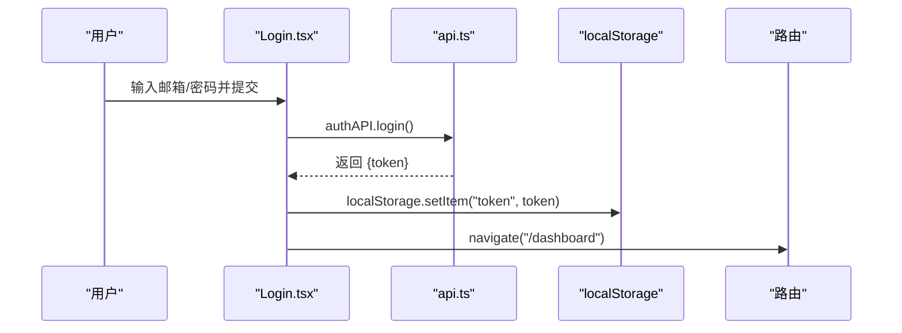
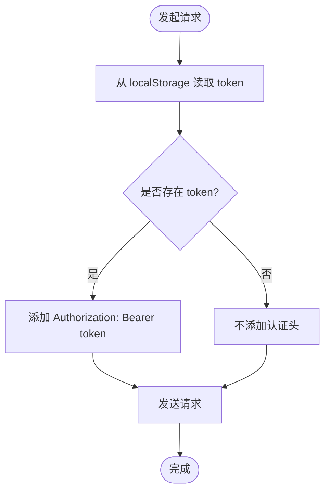
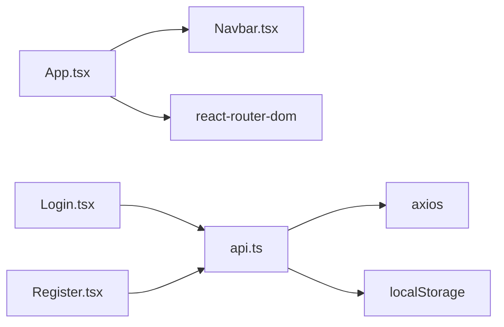

# 状态管理机制

<cite>
**本文引用的文件**
- [frontend/src/App.tsx](file://frontend/src/App.tsx)
- [frontend/src/components/Navbar.tsx](file://frontend/src/components/Navbar.tsx)
- [frontend/src/pages/Login.tsx](file://frontend/src/pages/Login.tsx)
- [frontend/src/pages/Register.tsx](file://frontend/src/pages/Register.tsx)
- [frontend/src/services/api.ts](file://frontend/src/services/api.ts)
- [frontend/src/main.tsx](file://frontend/src/main.tsx)
</cite>

## 目录
1. [简介](#简介)
2. [项目结构](#项目结构)
3. [核心组件](#核心组件)
4. [架构总览](#架构总览)
5. [详细组件分析](#详细组件分析)
6. [依赖关系分析](#依赖关系分析)
7. [性能考量](#性能考量)
8. [故障排查指南](#故障排查指南)
9. [结论](#结论)

## 简介
本文件聚焦于前端应用的状态管理实现方案，重点剖析 App.tsx 中基于 React 原生 Hook 的轻量级全局认证状态管理机制。内容涵盖：
- isAuthenticated 状态的初始化与持久化策略（localStorage）
- 组件挂载时的认证状态检查逻辑
- 登出流程中本地令牌与全局状态的同步清理
- 全局状态通过 props 向下传递至 Navbar 的实现方式
- 设计权衡：原生 Hook 与 Redux 等第三方状态管理库的适用场景
- 用户登录/登出时的状态流转图
- 常见状态不同步问题的调试方法与最佳实践

## 项目结构
前端采用函数组件与原生 Hook 的单页应用架构，路由由 react-router-dom 提供，Axios 封装统一处理请求拦截与鉴权头注入。认证状态集中在根组件 App 中管理，并通过 props 下传给导航组件 Navbar。

**图表来源**
- [frontend/src/main.tsx](file://frontend/src/main.tsx#L1-L10)
- [frontend/src/App.tsx](file://frontend/src/App.tsx#L1-L48)
- [frontend/src/components/Navbar.tsx](file://frontend/src/components/Navbar.tsx#L1-L91)
- [frontend/src/pages/Login.tsx](file://frontend/src/pages/Login.tsx#L1-L109)
- [frontend/src/pages/Register.tsx](file://frontend/src/pages/Register.tsx#L1-L149)
- [frontend/src/services/api.ts](file://frontend/src/services/api.ts#L1-L61)

**章节来源**
- [frontend/src/main.tsx](file://frontend/src/main.tsx#L1-L10)
- [frontend/src/App.tsx](file://frontend/src/App.tsx#L1-L48)

## 核心组件
- App.tsx：定义全局认证状态 isAuthenticated，使用 useEffect 在组件挂载时从 localStorage 读取 token 并初始化状态；提供 handleLogout 清除本地 token 并重置全局状态；通过 props 将认证状态与登出回调传递给 Navbar。
- Navbar.tsx：根据 isAuthenticated 决定显示登录/注册或登出后的导航菜单项；点击登出按钮触发父组件传入的 onLogout 回调。
- Login.tsx 与 Register.tsx：在成功登录/注册后将服务端返回的 token 写入 localStorage，并跳转到仪表盘。
- api.ts：Axios 实例配置请求拦截器，在请求头自动附加 Bearer token，确保后续受保护接口调用具备认证信息。

**章节来源**
- [frontend/src/App.tsx](file://frontend/src/App.tsx#L12-L46)
- [frontend/src/components/Navbar.tsx](file://frontend/src/components/Navbar.tsx#L9-L91)
- [frontend/src/pages/Login.tsx](file://frontend/src/pages/Login.tsx#L19-L38)
- [frontend/src/pages/Register.tsx](file://frontend/src/pages/Register.tsx#L21-L47)
- [frontend/src/services/api.ts](file://frontend/src/services/api.ts#L12-L23)

## 架构总览
下图展示了认证状态在应用中的传播路径与交互关系：根组件负责状态与持久化，子组件通过 props 使用状态，服务层通过拦截器自动携带令牌。

**图表来源**
- [frontend/src/App.tsx](file://frontend/src/App.tsx#L12-L46)
- [frontend/src/components/Navbar.tsx](file://frontend/src/components/Navbar.tsx#L9-L91)
- [frontend/src/pages/Login.tsx](file://frontend/src/pages/Login.tsx#L19-L38)
- [frontend/src/pages/Register.tsx](file://frontend/src/pages/Register.tsx#L21-L47)
- [frontend/src/services/api.ts](file://frontend/src/services/api.ts#L12-L23)

## 详细组件分析

### App.tsx：全局认证状态管理
- 状态定义与初始化
  - 使用 useState 定义 isAuthenticated 初始值为 false。
  - 使用 useEffect 在组件首次挂载时从 localStorage 读取 token，若存在则设置 isAuthenticated 为 true，从而实现刷新后状态保持。
- 登出流程
  - handleLogout 同步移除 localStorage 中的 token，并将 isAuthenticated 设置为 false，使导航栏切换为未登录态。
- Props 传递
  - 将 isAuthenticated 与 handleLogout 作为 props 传递给 Navbar，实现自上而下的状态共享与事件回调。

**图表来源**
- [frontend/src/App.tsx](file://frontend/src/App.tsx#L13-L26)
- [frontend/src/components/Navbar.tsx](file://frontend/src/components/Navbar.tsx#L9-L91)

**章节来源**
- [frontend/src/App.tsx](file://frontend/src/App.tsx#L12-L46)

### Navbar.tsx：基于全局状态的 UI 渲染
- 接收两个 props：
  - isAuthenticated：布尔值，决定显示登录/注册或登出后的导航菜单。
  - onLogout：函数，用于触发登出流程。
- 登出按钮绑定 onClick 事件，调用 onLogout，完成从 UI 到状态的联动。

**图表来源**
- [frontend/src/components/Navbar.tsx](file://frontend/src/components/Navbar.tsx#L9-L91)

**章节来源**
- [frontend/src/components/Navbar.tsx](file://frontend/src/components/Navbar.tsx#L9-L91)

### 登录与注册流程：token 持久化与路由跳转
- 登录流程
  - 用户提交表单后，调用 authAPI.login 获取 token。
  - 将 token 写入 localStorage。
  - 使用 useNavigate 跳转到仪表盘。
- 注册流程
  - 表单校验通过后，调用 authAPI.register 获取 token。
  - 将 token 写入 localStorage。
  - 使用 useNavigate 跳转到仪表盘。

**图表来源**
- [frontend/src/pages/Login.tsx](file://frontend/src/pages/Login.tsx#L19-L38)
- [frontend/src/services/api.ts](file://frontend/src/services/api.ts#L26-L31)

**章节来源**
- [frontend/src/pages/Login.tsx](file://frontend/src/pages/Login.tsx#L19-L38)
- [frontend/src/pages/Register.tsx](file://frontend/src/pages/Register.tsx#L21-L47)
- [frontend/src/services/api.ts](file://frontend/src/services/api.ts#L26-L31)

### 请求拦截器：自动携带认证令牌
- 在请求拦截器中读取 localStorage 中的 token，并将其放入 Authorization 头部，格式为 Bearer {token}。
- 该机制确保所有受保护接口在每次请求时自动附带认证信息，无需在各业务组件中重复处理。

**图表来源**
- [frontend/src/services/api.ts](file://frontend/src/services/api.ts#L12-L23)

**章节来源**
- [frontend/src/services/api.ts](file://frontend/src/services/api.ts#L12-L23)

## 依赖关系分析
- 组件耦合
  - App.tsx 与 Navbar.tsx 之间通过 props 传递状态与回调，耦合度低，职责清晰。
  - 登录/注册页与服务层通过 authAPI 解耦，便于扩展与测试。
- 外部依赖
  - react-router-dom：提供路由与导航能力。
  - axios：封装 HTTP 请求与拦截器。
  - localStorage：浏览器提供的键值存储，用于 token 的持久化。

**图表来源**
- [frontend/src/App.tsx](file://frontend/src/App.tsx#L1-L48)
- [frontend/src/components/Navbar.tsx](file://frontend/src/components/Navbar.tsx#L1-L91)
- [frontend/src/pages/Login.tsx](file://frontend/src/pages/Login.tsx#L1-L109)
- [frontend/src/pages/Register.tsx](file://frontend/src/pages/Register.tsx#L1-L149)
- [frontend/src/services/api.ts](file://frontend/src/services/api.ts#L1-L61)

**章节来源**
- [frontend/src/App.tsx](file://frontend/src/App.tsx#L1-L48)
- [frontend/src/services/api.ts](file://frontend/src/services/api.ts#L1-L61)

## 性能考量
- 初始化检查成本低：useEffect 仅在挂载时执行一次，读取 localStorage 的开销可忽略。
- 登出同步清理：handleLogout 同步移除 token 并更新状态，避免异步竞态导致的短暂状态不一致。
- 请求拦截器：统一注入 Authorization 头，减少重复逻辑，提升可维护性。
- 适用场景建议
  - 原生 Hook 适合小型到中型应用，状态体量不大且分布集中。
  - 当应用状态复杂、跨层级共享频繁、需要时间旅行调试或集中式日志时，可考虑引入 Redux 或 Zustand 等第三方库。

[本节为通用指导，不直接分析具体文件]

## 故障排查指南
- 症状：刷新页面后仍显示已登录
  - 检查点：确认 useEffect 是否正确读取 localStorage 并设置 isAuthenticated。
  - 参考路径：[frontend/src/App.tsx](file://frontend/src/App.tsx#L15-L21)
- 症状：点击退出登录后仍显示登录态
  - 检查点：确认 handleLogout 是否移除了 token 并设置了 isAuthenticated=false。
  - 参考路径：[frontend/src/App.tsx](file://frontend/src/App.tsx#L23-L26)
- 症状：登录/注册成功但导航未切换
  - 检查点：确认 Navbar 接收并使用 isAuthenticated 与 onLogout。
  - 参考路径：[frontend/src/components/Navbar.tsx](file://frontend/src/components/Navbar.tsx#L9-L91)
- 症状：受保护接口 401
  - 检查点：确认请求拦截器是否正确附加 Authorization 头。
  - 参考路径：[frontend/src/services/api.ts](file://frontend/src/services/api.ts#L12-L23)
- 症状：多标签页状态不同步
  - 检查点：监听 storage 事件在 App 层做全局同步（可在 useEffect 中增加监听）。
  - 参考路径：[frontend/src/App.tsx](file://frontend/src/App.tsx#L15-L21)

**章节来源**
- [frontend/src/App.tsx](file://frontend/src/App.tsx#L15-L26)
- [frontend/src/components/Navbar.tsx](file://frontend/src/components/Navbar.tsx#L9-L91)
- [frontend/src/services/api.ts](file://frontend/src/services/api.ts#L12-L23)

## 结论
本项目采用 React 原生 Hook 在根组件集中管理认证状态，结合 localStorage 实现轻量级持久化与请求拦截器自动注入认证头，形成简洁高效的前端状态管理模式。对于当前规模的应用，该方案具备良好的可读性与可维护性；当业务复杂度上升时，可评估引入第三方状态管理库以获得更完善的工具链与可观测性。