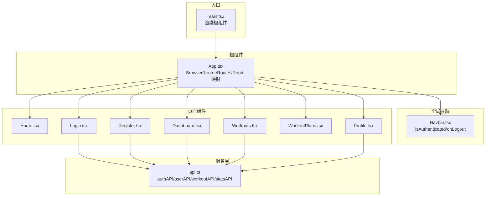
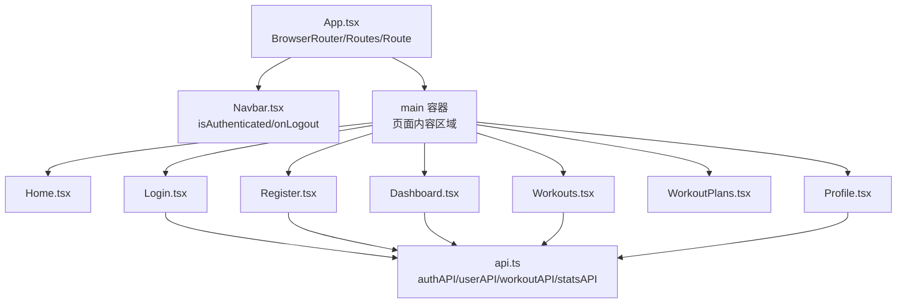
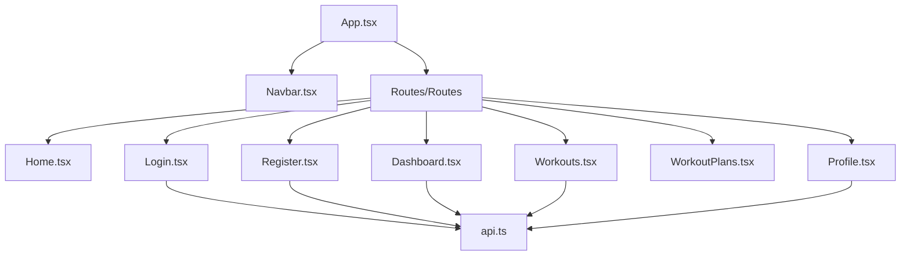
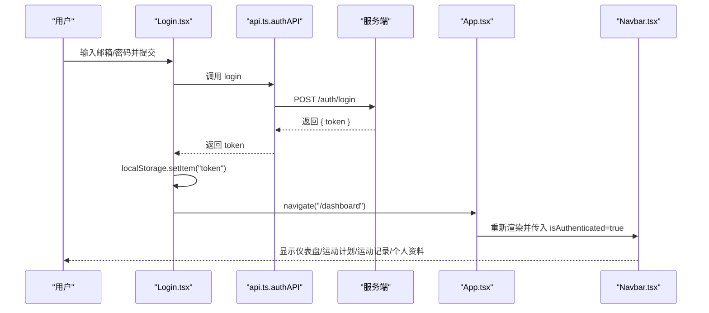
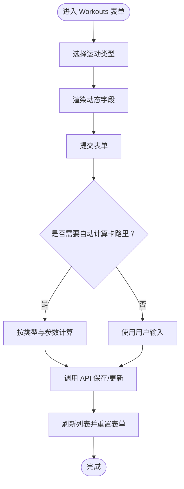
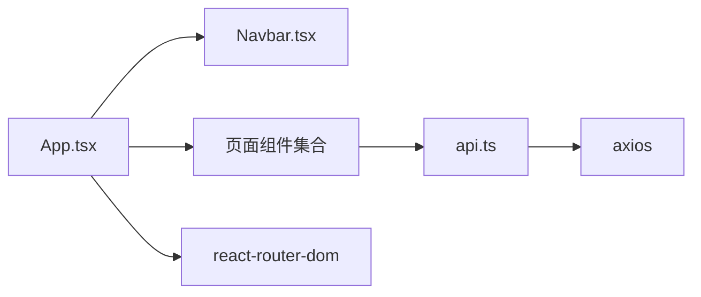

# 组件树结构

<cite>
**本文引用的文件**
- [App.tsx](file://frontend/src/App.tsx)
- [main.tsx](file://frontend/src/main.tsx)
- [Navbar.tsx](file://frontend/src/components/Navbar.tsx)
- [Home.tsx](file://frontend/src/pages/Home.tsx)
- [Login.tsx](file://frontend/src/pages/Login.tsx)
- [Register.tsx](file://frontend/src/pages/Register.tsx)
- [Dashboard.tsx](file://frontend/src/pages/Dashboard.tsx)
- [Workouts.tsx](file://frontend/src/pages/Workouts.tsx)
- [WorkoutPlans.tsx](file://frontend/src/pages/WorkoutPlans.tsx)
- [Profile.tsx](file://frontend/src/pages/Profile.tsx)
- [api.ts](file://frontend/src/services/api.ts)
- [index.html](file://frontend/index.html)
</cite>

## 目录
1. [简介](#简介)
2. [项目结构](#项目结构)
3. [核心组件](#核心组件)
4. [架构总览](#架构总览)
5. [组件详细分析](#组件详细分析)
6. [依赖关系分析](#依赖关系分析)
7. [性能考量](#性能考量)
8. [故障排查指南](#故障排查指南)
9. [结论](#结论)

## 简介
本文件系统性梳理前端组件树结构，自根组件 App.tsx 出发，解析基于 React Router 的路由配置与页面组件映射关系；深入分析全局导航组件 Navbar 的 props 传递机制（isAuthenticated、onLogout）；逐项说明首页 Home、登录 Login、注册 Register、仪表盘 Dashboard、运动记录 Workouts、运动计划 WorkoutPlans、个人资料 Profile 的布局与职责；结合 JSX 结构与路由对应关系，给出组件树形图与交互流程图；面向初学者解释 JSX 与页面路由的对应关系，面向高级开发者提供组件拆分优化建议与可复用性分析。

## 项目结构
前端采用 Vite + React + TailwindCSS 构建，组件按功能模块划分：
- 根入口：main.tsx 渲染 App
- 根组件：App.tsx 定义路由与全局状态，承载导航与页面容器
- 导航组件：components/Navbar.tsx 提供全局导航栏
- 页面组件：pages/Home、Login、Register、Dashboard、Workouts、WorkoutPlans、Profile
- 服务层：services/api.ts 封装 axios 实例与 API 接口

**图表来源**
- [main.tsx](file://frontend/src/main.tsx#L1-L10)
- [App.tsx](file://frontend/src/App.tsx#L1-L48)
- [Navbar.tsx](file://frontend/src/components/Navbar.tsx#L1-L91)
- [Home.tsx](file://frontend/src/pages/Home.tsx#L1-L110)
- [Login.tsx](file://frontend/src/pages/Login.tsx#L1-L109)
- [Register.tsx](file://frontend/src/pages/Register.tsx#L1-L149)
- [Dashboard.tsx](file://frontend/src/pages/Dashboard.tsx#L1-L174)
- [Workouts.tsx](file://frontend/src/pages/Workouts.tsx#L1-L589)
- [WorkoutPlans.tsx](file://frontend/src/pages/WorkoutPlans.tsx#L1-L345)
- [Profile.tsx](file://frontend/src/pages/Profile.tsx#L1-L245)
- [api.ts](file://frontend/src/services/api.ts#L1-L61)

**章节来源**
- [main.tsx](file://frontend/src/main.tsx#L1-L10)
- [index.html](file://frontend/index.html#L1-L13)

## 核心组件
- 根组件 App.tsx
  - 使用 React Router 的 BrowserRouter、Routes、Route 定义路由映射
  - 内部维护 isAuthenticated 状态，初始化检查本地存储 token
  - 提供 handleLogout 移除 token 并置空认证状态
  - 在导航组件 Navbar 传入 isAuthenticated 与 onLogout
  - Routes 中包含首页、登录、注册、仪表盘、运动记录、运动计划、个人资料等路由

- 全局导航 Navbar.tsx
  - 接收 props：isAuthenticated（布尔）、onLogout（函数）
  - 根据 isAuthenticated 渲染不同菜单项：已登录显示仪表盘、运动计划、运动记录、个人资料与退出按钮；未登录显示登录与注册入口
  - 使用 react-router-dom 的 Link 进行页面跳转

- 服务层 api.ts
  - 创建 axios 实例，设置基础 URL 与请求头
  - 请求拦截器自动注入 Authorization: Bearer token
  - 暴露 authAPI、userAPI、workoutAPI、statsAPI 用于各页面调用

**章节来源**
- [App.tsx](file://frontend/src/App.tsx#L1-L48)
- [Navbar.tsx](file://frontend/src/components/Navbar.tsx#L1-L91)
- [api.ts](file://frontend/src/services/api.ts#L1-L61)

## 架构总览
下图展示组件树形结构与渲染路径，体现从根到页面的层级关系与交互行为。

**图表来源**
- [App.tsx](file://frontend/src/App.tsx#L1-L48)
- [Navbar.tsx](file://frontend/src/components/Navbar.tsx#L1-L91)
- [Home.tsx](file://frontend/src/pages/Home.tsx#L1-L110)
- [Login.tsx](file://frontend/src/pages/Login.tsx#L1-L109)
- [Register.tsx](file://frontend/src/pages/Register.tsx#L1-L149)
- [Dashboard.tsx](file://frontend/src/pages/Dashboard.tsx#L1-L174)
- [Workouts.tsx](file://frontend/src/pages/Workouts.tsx#L1-L589)
- [WorkoutPlans.tsx](file://frontend/src/pages/WorkoutPlans.tsx#L1-L345)
- [Profile.tsx](file://frontend/src/pages/Profile.tsx#L1-L245)
- [api.ts](file://frontend/src/services/api.ts#L1-L61)

## 组件详细分析

### 根组件 App.tsx
- 路由配置
  - "/" -> Home
  - "/login" -> Login
  - "/register" -> Register
  - "/dashboard" -> Dashboard
  - "/workouts" -> Workouts
  - "/workout-plans" -> WorkoutPlans
  - "/profile" -> Profile
- 全局状态
  - 通过 useEffect 初始化时读取 localStorage 中的 token，设置 isAuthenticated
  - handleLogout 移除 token 并清空认证状态
- 导航集成
  - 向 Navbar 传递 isAuthenticated 与 onLogout

**章节来源**
- [App.tsx](file://frontend/src/App.tsx#L1-L48)

### 导航组件 Navbar.tsx
- Props
  - isAuthenticated: boolean
  - onLogout: () => void
- 渲染逻辑
  - 已登录：显示仪表盘、运动计划、运动记录、个人资料链接与退出按钮
  - 未登录：显示登录与注册链接
- 交互行为
  - 点击退出按钮触发 onLogout，实现登出流程

**章节来源**
- [Navbar.tsx](file://frontend/src/components/Navbar.tsx#L1-L91)

### 页面组件：Home.tsx
- 布局结构
  - 英雄区：标题、副标题、CTA 按钮
  - 特性卡片：运动记录、数据统计、目标设定
  - 为什么选择：优势列表
  - CTA 区域：二次引导注册
- 交互行为
  - 使用 Link 切换到注册页
- 渲染条件
  - 无状态，纯展示组件

**章节来源**
- [Home.tsx](file://frontend/src/pages/Home.tsx#L1-L110)

### 页面组件：Login.tsx
- 布局结构
  - 登录表单：邮箱、密码输入框
  - 错误提示区域
  - 注册跳转链接
- 交互行为
  - 表单提交后调用 authAPI.login，成功写入 token 并跳转至 /dashboard
  - 失败时显示错误消息
- 渲染条件
  - loading 控制按钮禁用与文案
  - error 控制错误提示显示

**章节来源**
- [Login.tsx](file://frontend/src/pages/Login.tsx#L1-L109)
- [api.ts](file://frontend/src/services/api.ts#L25-L31)

### 页面组件：Register.tsx
- 布局结构
  - 注册表单：姓名、邮箱、密码、确认密码
  - 错误提示区域
  - 登录跳转链接
- 交互行为
  - 校验两次密码一致性
  - 成功后调用 authAPI.register，写入 token 并跳转至 /dashboard
- 渲染条件
  - loading 控制按钮禁用与文案
  - error 控制错误提示显示

**章节来源**
- [Register.tsx](file://frontend/src/pages/Register.tsx#L1-L149)
- [api.ts](file://frontend/src/services/api.ts#L25-L31)

### 页面组件：Dashboard.tsx
- 布局结构
  - 摘要卡片：总运动次数、总时长、总消耗卡路里、总距离
  - 图表区域：本周活动柱状图、运动类型分布
- 数据获取
  - 并行请求 statsAPI.getWorkoutStats 与 statsAPI.getWeeklyStats
- 渲染条件
  - loading 显示加载态
  - error 显示错误提示
  - 数据为空时显示占位

**章节来源**
- [Dashboard.tsx](file://frontend/src/pages/Dashboard.tsx#L1-L174)
- [api.ts](file://frontend/src/services/api.ts#L55-L60)

### 页面组件：Workouts.tsx
- 布局结构
  - 添加/编辑表单：名称、类型、时长、动态字段（按类型变化）、卡路里、日期、备注
  - 运动记录列表：表格展示，支持编辑与删除
- 交互行为
  - 动态字段根据运动类型渲染
  - 自动计算卡路里（calculateCalories），编辑时可手动修改
  - 新增/更新/删除通过 workoutAPI 调用
- 渲染条件
  - loading 显示加载态
  - error 显示错误提示
  - 列表为空时显示占位

**章节来源**
- [Workouts.tsx](file://frontend/src/pages/Workouts.tsx#L1-L589)
- [api.ts](file://frontend/src/services/api.ts#L47-L53)

### 页面组件：WorkoutPlans.tsx
- 布局结构
  - 创建/编辑表单：名称、类型、目标描述、时间范围、频率、时长
  - 计划列表：网格卡片展示，支持编辑与删除
- 交互行为
  - 表单提交时生成或更新计划
  - 删除前确认
- 渲染条件
  - 列表为空时显示占位

**章节来源**
- [WorkoutPlans.tsx](file://frontend/src/pages/WorkoutPlans.tsx#L1-L345)

### 页面组件：Profile.tsx
- 布局结构
  - 个人资料表单：姓名、邮箱、年龄、身高、体重、性别
  - 账户信息区块：注册时间、账户ID
- 交互行为
  - 首次加载调用 userAPI.getProfile 获取数据
  - 提交后调用 userAPI.updateProfile 更新资料
- 渲染条件
  - loading 显示加载态
  - error 显示错误提示
  - success 显示成功提示

**章节来源**
- [Profile.tsx](file://frontend/src/pages/Profile.tsx#L1-L245)
- [api.ts](file://frontend/src/services/api.ts#L33-L44)

### 组件树形图（代码级）

**图表来源**
- [App.tsx](file://frontend/src/App.tsx#L1-L48)
- [Navbar.tsx](file://frontend/src/components/Navbar.tsx#L1-L91)
- [Home.tsx](file://frontend/src/pages/Home.tsx#L1-L110)
- [Login.tsx](file://frontend/src/pages/Login.tsx#L1-L109)
- [Register.tsx](file://frontend/src/pages/Register.tsx#L1-L149)
- [Dashboard.tsx](file://frontend/src/pages/Dashboard.tsx#L1-L174)
- [Workouts.tsx](file://frontend/src/pages/Workouts.tsx#L1-L589)
- [WorkoutPlans.tsx](file://frontend/src/pages/WorkoutPlans.tsx#L1-L345)
- [Profile.tsx](file://frontend/src/pages/Profile.tsx#L1-L245)
- [api.ts](file://frontend/src/services/api.ts#L1-L61)

### 路由与页面映射序列图（登录流程）

**图表来源**
- [Login.tsx](file://frontend/src/pages/Login.tsx#L1-L109)
- [api.ts](file://frontend/src/services/api.ts#L25-L31)
- [App.tsx](file://frontend/src/App.tsx#L1-L48)
- [Navbar.tsx](file://frontend/src/components/Navbar.tsx#L1-L91)

### 复杂逻辑流程图（运动记录表单）

**图表来源**
- [Workouts.tsx](file://frontend/src/pages/Workouts.tsx#L1-L589)

## 依赖关系分析
- 组件耦合
  - App.tsx 作为根容器，耦合 Navbar 与所有页面组件
  - Navbar 仅依赖 props（isAuthenticated、onLogout），低耦合
  - 页面组件通过 api.ts 调用后端接口，形成统一依赖点
- 外部依赖
  - react-router-dom：BrowserRouter、Routes、Route、Link、useNavigate
  - axios：api.ts 封装请求与拦截器
- 潜在循环依赖
  - 当前结构无循环依赖，页面组件均通过 api.ts 间接依赖后端

**图表来源**
- [App.tsx](file://frontend/src/App.tsx#L1-L48)
- [Navbar.tsx](file://frontend/src/components/Navbar.tsx#L1-L91)
- [api.ts](file://frontend/src/services/api.ts#L1-L61)

**章节来源**
- [App.tsx](file://frontend/src/App.tsx#L1-L48)
- [api.ts](file://frontend/src/services/api.ts#L1-L61)

## 性能考量
- 路由懒加载
  - 建议对大型页面组件启用路由级懒加载，减少首屏体积
- 列表渲染
  - Workouts 与 WorkoutPlans 使用表格/网格渲染，建议对大数据集启用虚拟滚动
- 请求合并
  - Dashboard 已使用 Promise.all 并行请求，保持良好体验
- 缓存策略
  - 对频繁访问的数据（如统计）可引入缓存与失效策略
- 事件处理
  - 表单输入与计算逻辑避免在渲染阶段进行重型计算，必要时使用 useMemo/useCallback

## 故障排查指南
- 登录/注册失败
  - 检查 api.ts 中 baseURL 与请求头配置
  - 确认服务端返回的 token 是否正确写入 localStorage
- 仪表盘空白
  - 检查 statsAPI 接口是否可用，确认请求拦截器已注入 Authorization
- 运动记录无法保存
  - 确认 workoutAPI 接口路径与参数格式
  - 查看控制台网络错误与后端响应
- 个人资料更新失败
  - 检查 userAPI.updateProfile 参数与必填字段
- 导航不随登录状态切换
  - 确认 App.tsx 中 handleLogout 是否移除了 token
  - 确保 Navbar.isAuthenticated 来源于 App.tsx 的状态

**章节来源**
- [api.ts](file://frontend/src/services/api.ts#L1-L61)
- [Login.tsx](file://frontend/src/pages/Login.tsx#L1-L109)
- [Register.tsx](file://frontend/src/pages/Register.tsx#L1-L149)
- [Dashboard.tsx](file://frontend/src/pages/Dashboard.tsx#L1-L174)
- [Workouts.tsx](file://frontend/src/pages/Workouts.tsx#L1-L589)
- [Profile.tsx](file://frontend/src/pages/Profile.tsx#L1-L245)
- [App.tsx](file://frontend/src/App.tsx#L1-L48)
- [Navbar.tsx](file://frontend/src/components/Navbar.tsx#L1-L91)

## 结论
该前端应用以 App.tsx 为核心，通过 React Router 实现清晰的页面映射；Navbar 以 props 驱动导航状态，实现登录/登出切换；各页面组件职责明确，数据通过统一的 api.ts 层访问后端。建议后续引入路由懒加载、虚拟滚动与缓存策略以提升性能；同时可将通用 UI 抽象为可复用组件，进一步增强可维护性与可扩展性。