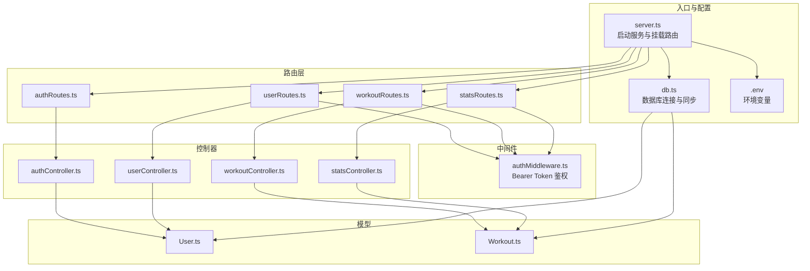
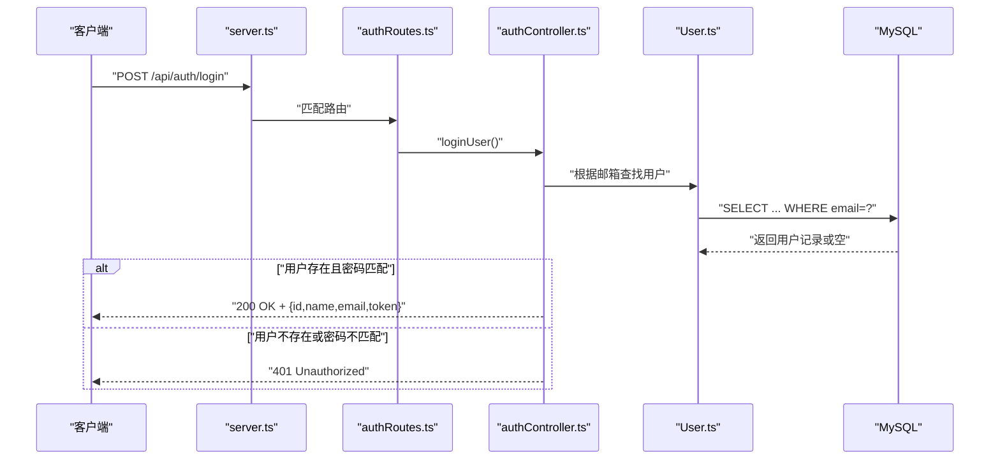
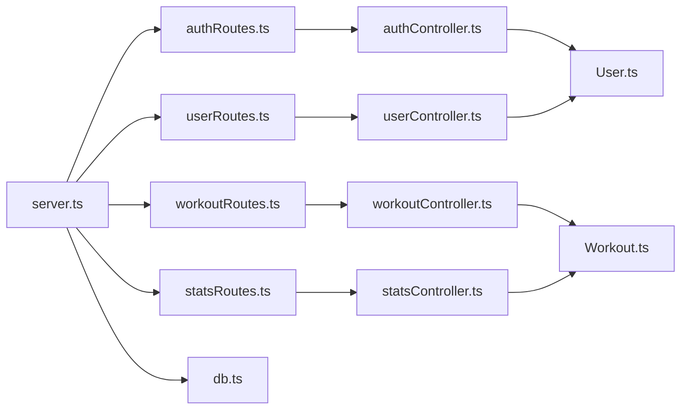
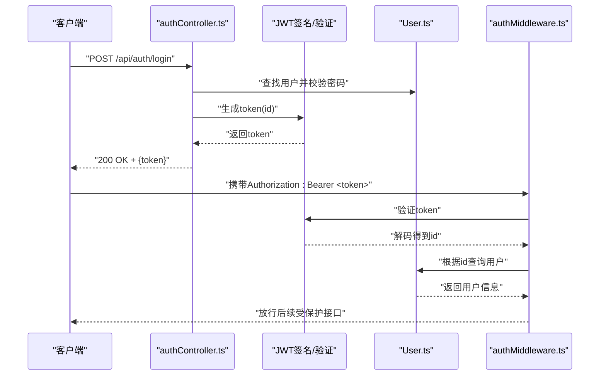
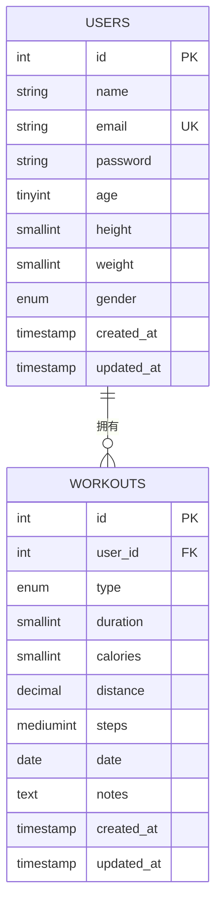

# API端点

<cite>
**本文引用的文件**
- [backend/src/server.ts](file://backend/src/server.ts)
- [backend/src/middleware/authMiddleware.ts](file://backend/src/middleware/authMiddleware.ts)
- [backend/src/controllers/authController.ts](file://backend/src/controllers/authController.ts)
- [backend/src/controllers/userController.ts](file://backend/src/controllers/userController.ts)
- [backend/src/controllers/workoutController.ts](file://backend/src/controllers/workoutController.ts)
- [backend/src/controllers/statsController.ts](file://backend/src/controllers/statsController.ts)
- [backend/src/routes/authRoutes.ts](file://backend/src/routes/authRoutes.ts)
- [backend/src/routes/userRoutes.ts](file://backend/src/routes/userRoutes.ts)
- [backend/src/routes/workoutRoutes.ts](file://backend/src/routes/workoutRoutes.ts)
- [backend/src/routes/statsRoutes.ts](file://backend/src/routes/statsRoutes.ts)
- [backend/src/models/User.ts](file://backend/src/models/User.ts)
- [backend/src/models/Workout.ts](file://backend/src/models/Workout.ts)
- [backend/src/config/db.ts](file://backend/src/config/db.ts)
- [backend/.env](file://backend/.env)
- [docs/4. API接口文档.md](file://docs/4. API接口文档.md)
</cite>

## 目录
1. [简介](#简介)
2. [项目结构](#项目结构)
3. [核心组件](#核心组件)
4. [架构总览](#架构总览)
5. [详细组件分析](#详细组件分析)
6. [依赖分析](#依赖分析)
7. [性能考虑](#性能考虑)
8. [故障排除指南](#故障排除指南)
9. [结论](#结论)
10. [附录](#附录)

## 简介
本文件面向开发者与集成方，系统化梳理 fitness-tracker 后端暴露的 RESTful API 端点，覆盖认证、用户、运动记录与统计四大模块。文档包含：
- 每个端点的 HTTP 方法、URL 路径、请求头、请求体结构、响应格式与状态码
- 路由与控制器的映射关系
- 认证流程与权限控制（Bearer Token）
- 错误处理模式与常见响应（如 401 未授权、404 未找到）
- API 版本控制策略（当前为无版本前缀）与未来扩展建议
- 实际调用示例与最佳实践

## 项目结构
后端采用 Express + TypeScript + Sequelize 架构，按功能分层组织：
- 路由层：定义各模块的 URL 映射
- 控制器层：处理业务逻辑与数据访问
- 中间件层：鉴权中间件
- 模型层：数据库实体与校验规则
- 配置层：数据库连接与环境变量

图表来源
- [backend/src/server.ts](file://backend/src/server.ts#L1-L36)
- [backend/src/routes/authRoutes.ts](file://backend/src/routes/authRoutes.ts#L1-L9)
- [backend/src/routes/userRoutes.ts](file://backend/src/routes/userRoutes.ts#L1-L11)
- [backend/src/routes/workoutRoutes.ts](file://backend/src/routes/workoutRoutes.ts#L1-L22)
- [backend/src/routes/statsRoutes.ts](file://backend/src/routes/statsRoutes.ts#L1-L10)
- [backend/src/middleware/authMiddleware.ts](file://backend/src/middleware/authMiddleware.ts#L1-L36)
- [backend/src/controllers/authController.ts](file://backend/src/controllers/authController.ts#L1-L71)
- [backend/src/controllers/userController.ts](file://backend/src/controllers/userController.ts#L1-L60)
- [backend/src/controllers/workoutController.ts](file://backend/src/controllers/workoutController.ts#L1-L132)
- [backend/src/controllers/statsController.ts](file://backend/src/controllers/statsController.ts#L1-L119)
- [backend/src/models/User.ts](file://backend/src/models/User.ts#L1-L119)
- [backend/src/models/Workout.ts](file://backend/src/models/Workout.ts#L1-L122)
- [backend/src/config/db.ts](file://backend/src/config/db.ts#L1-L41)
- [backend/.env](file://backend/.env#L1-L10)

章节来源
- [backend/src/server.ts](file://backend/src/server.ts#L1-L36)
- [backend/src/config/db.ts](file://backend/src/config/db.ts#L1-L41)

## 核心组件
- 服务器入口：加载环境变量、连接数据库、启用 CORS 与 JSON 解析、挂载路由
- 鉴权中间件：从 Authorization 头解析 Bearer Token，验证并注入用户信息
- 控制器：实现认证、用户资料、运动记录 CRUD、统计查询等业务逻辑
- 路由：将 URL 映射到对应控制器方法，并在需要时应用保护中间件
- 模型：User 与 Workout 的字段定义、校验与关联关系

章节来源
- [backend/src/server.ts](file://backend/src/server.ts#L1-L36)
- [backend/src/middleware/authMiddleware.ts](file://backend/src/middleware/authMiddleware.ts#L1-L36)
- [backend/src/controllers/authController.ts](file://backend/src/controllers/authController.ts#L1-L71)
- [backend/src/controllers/userController.ts](file://backend/src/controllers/userController.ts#L1-L60)
- [backend/src/controllers/workoutController.ts](file://backend/src/controllers/workoutController.ts#L1-L132)
- [backend/src/controllers/statsController.ts](file://backend/src/controllers/statsController.ts#L1-L119)
- [backend/src/models/User.ts](file://backend/src/models/User.ts#L1-L119)
- [backend/src/models/Workout.ts](file://backend/src/models/Workout.ts#L1-L122)

## 架构总览
下图展示从客户端到数据库的典型调用链，以认证登录为例：

图表来源
- [backend/src/server.ts](file://backend/src/server.ts#L1-L36)
- [backend/src/routes/authRoutes.ts](file://backend/src/routes/authRoutes.ts#L1-L9)
- [backend/src/controllers/authController.ts](file://backend/src/controllers/authController.ts#L48-L71)
- [backend/src/models/User.ts](file://backend/src/models/User.ts#L1-L119)

## 详细组件分析

### 认证接口
- 注册
  - 方法与路径：POST /api/auth/register
  - 请求头：Content-Type: application/json
  - 请求体：
    - name: 字符串，必填
    - email: 字符串，必填，唯一
    - password: 字符串，长度 6-100
  - 响应：
    - 成功：201 Created，返回 id、name、email、token
    - 已存在：400 Bad Request，消息提示
    - 其他错误：500 Internal Server Error
  - 认证要求：公开接口，无需 Bearer Token
  - 关键实现参考：[注册逻辑](file://backend/src/controllers/authController.ts#L12-L46)

- 登录
  - 方法与路径：POST /api/auth/login
  - 请求头：Content-Type: application/json
  - 请求体：
    - email: 字符串，必填
    - password: 字符串，必填
  - 响应：
    - 成功：200 OK，返回 id、name、email、token
    - 失败：401 Unauthorized，消息提示
    - 其他错误：500 Internal Server Error
  - 认证要求：公开接口，无需 Bearer Token
  - 关键实现参考：[登录逻辑](file://backend/src/controllers/authController.ts#L48-L71)

章节来源
- [backend/src/controllers/authController.ts](file://backend/src/controllers/authController.ts#L1-L71)
- [backend/src/models/User.ts](file://backend/src/models/User.ts#L1-L119)
- [docs/4. API接口文档.md](file://docs/4. API接口文档.md#L1-L47)

### 用户接口
- 获取用户资料
  - 方法与路径：GET /api/users/profile
  - 请求头：Authorization: Bearer <token>
  - 响应：
    - 成功：200 OK，返回用户对象（不含密码）
    - 未找到：404 Not Found
    - 其他错误：500 Internal Server Error
  - 认证要求：私有接口，需有效 Token
  - 关键实现参考：[获取资料](file://backend/src/controllers/userController.ts#L8-L26)

- 更新用户资料
  - 方法与路径：PUT /api/users/profile
  - 请求头：Authorization: Bearer <token>
  - 请求体：可选字段 name、age、height、weight、gender
  - 响应：
    - 成功：200 OK，返回更新后的用户对象
    - 未找到：404 Not Found
    - 其他错误：500 Internal Server Error
  - 认证要求：私有接口，需有效 Token
  - 关键实现参考：[更新资料](file://backend/src/controllers/userController.ts#L28-L60)

章节来源
- [backend/src/controllers/userController.ts](file://backend/src/controllers/userController.ts#L1-L60)
- [backend/src/middleware/authMiddleware.ts](file://backend/src/middleware/authMiddleware.ts#L1-L36)
- [docs/4. API接口文档.md](file://docs/4. API接口文档.md#L48-L98)

### 运动记录接口
- 获取所有运动记录
  - 方法与路径：GET /api/workouts
  - 请求头：Authorization: Bearer <token>
  - 响应：数组，元素为运动记录对象
  - 认证要求：私有接口，需有效 Token
  - 关键实现参考：[获取列表](file://backend/src/controllers/workoutController.ts#L9-L22)

- 创建运动记录
  - 方法与路径：POST /api/workouts
  - 请求头：Authorization: Bearer <token>
  - 请求体：
    - name: 字符串，必填
    - type: 枚举值，必填
    - duration: 数字（分钟），必填
    - calories: 数字，必填
    - distance: 数字（公里），可选
    - steps: 数字，可选
    - date: 日期字符串，必填
    - notes: 文本，可选
  - 响应：
    - 成功：201 Created，返回新建记录
    - 其他错误：500 Internal Server Error
  - 认证要求：私有接口，需有效 Token
  - 关键实现参考：[创建记录](file://backend/src/controllers/workoutController.ts#L48-L71)

- 根据ID获取运动记录
  - 方法与路径：GET /api/workouts/:id
  - 请求头：Authorization: Bearer <token>
  - 响应：
    - 成功：200 OK，返回单条记录
    - 未找到：404 Not Found
    - 非授权：401 Unauthorized（记录不属于当前用户）
    - 其他错误：500 Internal Server Error
  - 认证要求：私有接口，需有效 Token
  - 关键实现参考：[按ID获取](file://backend/src/controllers/workoutController.ts#L24-L46)

- 更新运动记录
  - 方法与路径：PUT /api/workouts/:id
  - 请求头：Authorization: Bearer <token>
  - 请求体：同创建，支持部分字段更新
  - 响应：
    - 成功：200 OK，返回更新后的记录
    - 未找到：404 Not Found
    - 非授权：401 Unauthorized（记录不属于当前用户）
    - 其他错误：500 Internal Server Error
  - 认证要求：私有接口，需有效 Token
  - 关键实现参考：[更新记录](file://backend/src/controllers/workoutController.ts#L73-L107)

- 删除运动记录
  - 方法与路径：DELETE /api/workouts/:id
  - 请求头：Authorization: Bearer <token>
  - 响应：
    - 成功：200 OK，返回删除确认消息
    - 未找到：404 Not Found
    - 非授权：401 Unauthorized（记录不属于当前用户）
    - 其他错误：500 Internal Server Error
  - 认证要求：私有接口，需有效 Token
  - 关键实现参考：[删除记录](file://backend/src/controllers/workoutController.ts#L110-L132)

章节来源
- [backend/src/controllers/workoutController.ts](file://backend/src/controllers/workoutController.ts#L1-L132)
- [backend/src/middleware/authMiddleware.ts](file://backend/src/middleware/authMiddleware.ts#L1-L36)
- [backend/src/models/Workout.ts](file://backend/src/models/Workout.ts#L1-L122)
- [docs/4. API接口文档.md](file://docs/4. API接口文档.md#L100-L231)

### 统计接口
- 获取运动统计数据
  - 方法与路径：GET /api/stats/workouts
  - 请求头：Authorization: Bearer <token>
  - 响应：
    - totalWorkouts: 总次数
    - totalDuration: 总时长（分钟）
    - totalCalories: 总消耗卡路里
    - totalDistance: 总距离（公里）
    - workoutsByType: 分类统计（type -> count）
  - 认证要求：私有接口，需有效 Token
  - 关键实现参考：[统计汇总](file://backend/src/controllers/statsController.ts#L10-L56)

- 获取周度统计数据
  - 方法与路径：GET /api/stats/weekly
  - 请求头：Authorization: Bearer <token>
  - 响应：数组，元素为每日统计（date、workouts、duration、calories）
  - 认证要求：私有接口，需有效 Token
  - 关键实现参考：[周度统计](file://backend/src/controllers/statsController.ts#L58-L119)

章节来源
- [backend/src/controllers/statsController.ts](file://backend/src/controllers/statsController.ts#L1-L119)
- [backend/src/middleware/authMiddleware.ts](file://backend/src/middleware/authMiddleware.ts#L1-L36)
- [docs/4. API接口文档.md](file://docs/4. API接口文档.md#L232-L275)

## 依赖分析
- 路由到控制器映射
  - /api/auth → authRoutes → authController
  - /api/users → userRoutes → userController（受 authMiddleware 保护）
  - /api/workouts → workoutRoutes → workoutController（受 authMiddleware 保护）
  - /api/stats → statsRoutes → statsController（受 authMiddleware 保护）

- 控制器到模型映射
  - authController 使用 User 模型进行注册与登录
  - userController 使用 User 模型进行资料读取与更新
  - workoutController 使用 Workout 模型进行 CRUD
  - statsController 使用 Workout 模型进行聚合统计

- 数据库与模型
  - User 模型包含基础字段与密码哈希钩子
  - Workout 模型包含枚举类型、数值校验与外键关联
  - 服务器启动时连接数据库并同步模型

图表来源
- [backend/src/server.ts](file://backend/src/server.ts#L1-L36)
- [backend/src/routes/authRoutes.ts](file://backend/src/routes/authRoutes.ts#L1-L9)
- [backend/src/routes/userRoutes.ts](file://backend/src/routes/userRoutes.ts#L1-L11)
- [backend/src/routes/workoutRoutes.ts](file://backend/src/routes/workoutRoutes.ts#L1-L22)
- [backend/src/routes/statsRoutes.ts](file://backend/src/routes/statsRoutes.ts#L1-L10)
- [backend/src/controllers/authController.ts](file://backend/src/controllers/authController.ts#L1-L71)
- [backend/src/controllers/userController.ts](file://backend/src/controllers/userController.ts#L1-L60)
- [backend/src/controllers/workoutController.ts](file://backend/src/controllers/workoutController.ts#L1-L132)
- [backend/src/controllers/statsController.ts](file://backend/src/controllers/statsController.ts#L1-L119)
- [backend/src/models/User.ts](file://backend/src/models/User.ts#L1-L119)
- [backend/src/models/Workout.ts](file://backend/src/models/Workout.ts#L1-L122)
- [backend/src/config/db.ts](file://backend/src/config/db.ts#L1-L41)

## 性能考虑
- 数据库连接池：通过 Sequelize 初始化连接池，合理设置最大连接数与空闲回收时间，避免高并发下的连接争用
- 查询优化：
  - 在统计接口中使用聚合函数（COUNT/SUM）减少网络往返
  - 对高频查询建立索引（如 users.email、workouts.userId/date）
- 缓存策略：对静态统计结果可引入缓存（如 Redis）降低重复计算成本
- 日志与监控：开启 SQL 日志仅限调试环境；生产环境关闭日志或降级为采样日志

[本节为通用指导，不直接分析具体文件]

## 故障排除指南
- 401 未授权
  - 可能原因：缺少 Authorization 头、Token 不合法或过期
  - 定位参考：[鉴权中间件](file://backend/src/middleware/authMiddleware.ts#L9-L36)
  - 处理建议：重新登录获取新 Token 或检查前端是否正确携带 Bearer Token

- 404 未找到
  - 可能原因：用户或运动记录不存在
  - 定位参考：[用户接口](file://backend/src/controllers/userController.ts#L18-L26)、[运动接口](file://backend/src/controllers/workoutController.ts#L31-L45)
  - 处理建议：确认资源 ID 是否正确，以及当前用户是否拥有该资源

- 403 非授权（非本项目直接返回）
  - 当前实现中，若资源归属不符返回 401；如需区分 403，可在控制器中显式判断并返回

- 500 内部错误
  - 可能原因：数据库异常、模型校验失败、业务逻辑异常
  - 定位参考：各控制器 try/catch 分支
  - 处理建议：查看服务器日志，确认数据库连接与模型同步状态

章节来源
- [backend/src/middleware/authMiddleware.ts](file://backend/src/middleware/authMiddleware.ts#L1-L36)
- [backend/src/controllers/userController.ts](file://backend/src/controllers/userController.ts#L1-L60)
- [backend/src/controllers/workoutController.ts](file://backend/src/controllers/workoutController.ts#L1-L132)
- [backend/src/controllers/statsController.ts](file://backend/src/controllers/statsController.ts#L1-L119)

## 结论
本项目后端 API 采用清晰的分层架构与明确的鉴权策略，覆盖认证、用户资料、运动记录管理与统计分析等核心场景。通过 Bearer Token 实现会话无状态化，配合 Sequelize 的模型与校验，保障数据一致性与安全性。建议后续在以下方面持续演进：
- 引入 API 版本控制（如 /api/v1/...），确保向后兼容
- 增加输入校验中间件与统一错误响应格式
- 引入速率限制与安全防护（CORS、CSRF、XSS）
- 补充单元测试与集成测试，完善文档与示例

[本节为总结性内容，不直接分析具体文件]

## 附录

### 路由与控制器映射关系
- /api/auth
  - POST /api/auth/register → authController.registerUser
  - POST /api/auth/login → authController.loginUser
- /api/users
  - GET /api/users/profile → userController.getUserProfile
  - PUT /api/users/profile → userController.updateUserProfile
- /api/workouts
  - GET /api/workouts → workoutController.getWorkouts
  - POST /api/workouts → workoutController.createWorkout
  - GET /api/workouts/:id → workoutController.getWorkoutById
  - PUT /api/workouts/:id → workoutController.updateWorkout
  - DELETE /api/workouts/:id → workoutController.deleteWorkout
- /api/stats
  - GET /api/stats/workouts → statsController.getWorkoutStats
  - GET /api/stats/weekly → statsController.getWeeklyStats

章节来源
- [backend/src/routes/authRoutes.ts](file://backend/src/routes/authRoutes.ts#L1-L9)
- [backend/src/routes/userRoutes.ts](file://backend/src/routes/userRoutes.ts#L1-L11)
- [backend/src/routes/workoutRoutes.ts](file://backend/src/routes/workoutRoutes.ts#L1-L22)
- [backend/src/routes/statsRoutes.ts](file://backend/src/routes/statsRoutes.ts#L1-L10)
- [backend/src/controllers/authController.ts](file://backend/src/controllers/authController.ts#L1-L71)
- [backend/src/controllers/userController.ts](file://backend/src/controllers/userController.ts#L1-L60)
- [backend/src/controllers/workoutController.ts](file://backend/src/controllers/workoutController.ts#L1-L132)
- [backend/src/controllers/statsController.ts](file://backend/src/controllers/statsController.ts#L1-L119)

### 认证流程与 Token 使用
- 登录成功后返回 JWT Token，客户端在后续请求头中携带 Authorization: Bearer <token>
- 鉴权中间件从 Authorization 头解析 Token 并验证，将用户信息注入 req.user
- 受保护的路由在执行业务逻辑前先经过鉴权中间件

图表来源
- [backend/src/controllers/authController.ts](file://backend/src/controllers/authController.ts#L1-L71)
- [backend/src/middleware/authMiddleware.ts](file://backend/src/middleware/authMiddleware.ts#L1-L36)
- [backend/src/models/User.ts](file://backend/src/models/User.ts#L1-L119)

### API 版本控制策略与扩展建议
- 当前策略：无版本前缀，路径直接以 /api/ 开头
- 扩展建议：
  - 引入 /api/v1/ 前缀，逐步迁移现有端点
  - 保持向后兼容：v1 端点长期维护，新增功能在 v2
  - 引入 OpenAPI/Swagger 文档，自动生成 SDK 与测试用例
  - 增加速率限制与请求大小限制，提升系统稳定性

[本节为通用指导，不直接分析具体文件]

### 数据模型概览

图表来源
- [backend/src/models/User.ts](file://backend/src/models/User.ts#L1-L119)
- [backend/src/models/Workout.ts](file://backend/src/models/Workout.ts#L1-L122)