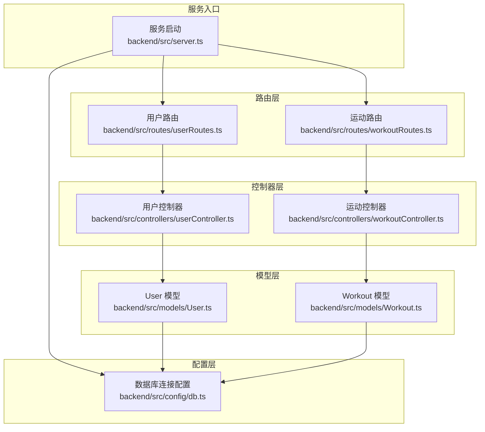
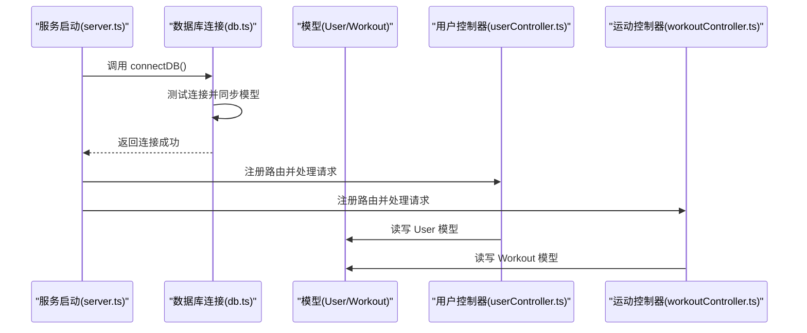
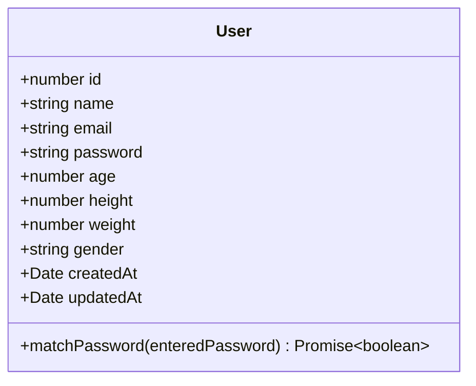
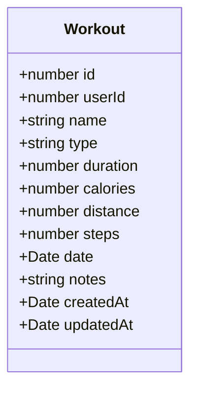
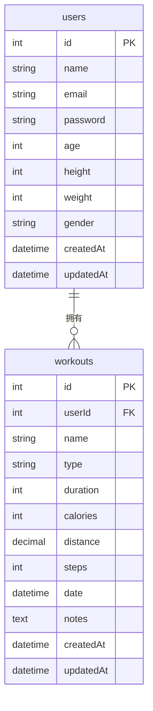
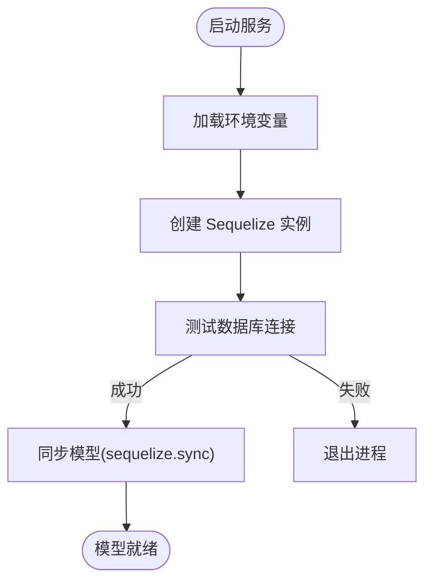
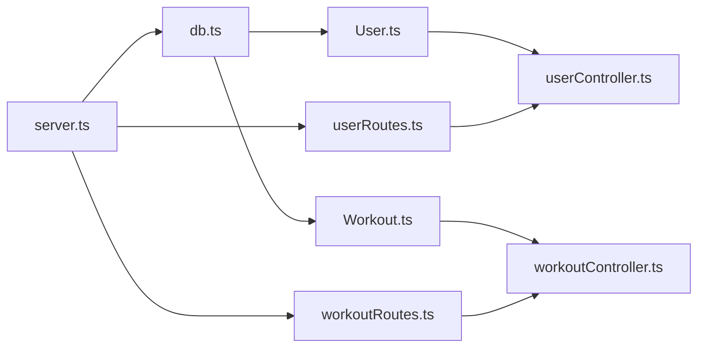

# ORM模型

<cite>
**本文引用的文件**
- [backend/src/models/User.ts](file://backend/src/models/User.ts)
- [backend/src/models/Workout.ts](file://backend/src/models/Workout.ts)
- [backend/src/config/db.ts](file://backend/src/config/db.ts)
- [backend/src/server.ts](file://backend/src/server.ts)
- [backend/src/controllers/userController.ts](file://backend/src/controllers/userController.ts)
- [backend/src/controllers/workoutController.ts](file://backend/src/controllers/workoutController.ts)
- [backend/src/routes/userRoutes.ts](file://backend/src/routes/userRoutes.ts)
- [backend/src/routes/workoutRoutes.ts](file://backend/src/routes/workoutRoutes.ts)
- [docs/5. 数据库设计.md](file://docs/5. 数据库设计.md)
</cite>

## 目录
1. [简介](#简介)
2. [项目结构](#项目结构)
3. [核心组件](#核心组件)
4. [架构总览](#架构总览)
5. [详细组件分析](#详细组件分析)
6. [依赖分析](#依赖分析)
7. [性能考虑](#性能考虑)
8. [故障排查指南](#故障排查指南)
9. [结论](#结论)
10. [附录](#附录)

## 简介
本文件聚焦于基于 Sequelize 的数据模型文档，系统性说明 User 与 Workout 两大核心模型的字段定义、数据类型、约束条件、表名配置、模型间一对多关联关系，以及与数据库连接配置 db.ts 的集成方式。同时，结合控制器与路由展示常见数据访问模式（findByPk、create、update、destroy 等），并给出查询优化建议、ER 图与索引设计说明，帮助开发者快速理解与高效使用该 ORM 层。

## 项目结构
后端采用分层组织：配置层负责数据库连接与同步；模型层定义实体与关系；控制器层处理业务逻辑；路由层暴露 REST 接口；服务启动入口负责初始化连接与启动服务。

图表来源
- [backend/src/server.ts](file://backend/src/server.ts#L1-L36)
- [backend/src/config/db.ts](file://backend/src/config/db.ts#L1-L41)
- [backend/src/models/User.ts](file://backend/src/models/User.ts#L1-L119)
- [backend/src/models/Workout.ts](file://backend/src/models/Workout.ts#L1-L122)
- [backend/src/controllers/userController.ts](file://backend/src/controllers/userController.ts#L1-L60)
- [backend/src/controllers/workoutController.ts](file://backend/src/controllers/workoutController.ts#L1-L132)
- [backend/src/routes/userRoutes.ts](file://backend/src/routes/userRoutes.ts#L1-L11)
- [backend/src/routes/workoutRoutes.ts](file://backend/src/routes/workoutRoutes.ts#L1-L22)

章节来源
- [backend/src/server.ts](file://backend/src/server.ts#L1-L36)
- [backend/src/config/db.ts](file://backend/src/config/db.ts#L1-L41)

## 核心组件
本节从字段定义、数据类型、约束、表名、验证规则、钩子函数、关联关系等方面，全面解析 User 与 Workout 模型。

- User 模型
  - 字段与类型
    - id: 整型，自增主键
    - name: 字符串，长度上限 100，必填
    - email: 字符串，长度上限 100，必填且唯一，需符合邮箱格式
    - password: 字符串，长度 6–100，必填
    - age: 数值，无符号 tinyint，范围 1–120
    - height: 数值，无符号 smallint，单位 cm，范围 50–300
    - weight: 数值，无符号 smallint，单位 kg，范围 20–1000
    - gender: 枚举，取值 'male' | 'female' | 'other'
    - createdAt/updatedAt: 时间戳，自动维护
  - 表名与时间戳
    - 表名: users
    - 启用时间戳
  - 验证规则
    - 邮箱格式校验
    - 密码长度校验
    - 年龄/身高/体重数值范围校验
  - 钩子函数
    - 创建前与更新前对密码进行加盐哈希
  - 实例方法
    - 提供密码比对方法，便于登录验证

- Workout 模型
  - 字段与类型
    - id: 整型，自增主键
    - userId: 整型，必填，外键引用 users.id
    - name: 字符串，长度上限 100，必填
    - type: 枚举，取值 'running' | 'cycling' | 'swimming' | 'walking' | 'strength' | 'yoga' | 'other'，必填
    - duration: 数值，无符号 smallint，单位 分钟，最小 0
    - calories: 数值，无符号 smallint，单位 卡路里，最小 0
    - distance: 小数，decimal(5,2)，单位 km，最小 0
    - steps: 数值，无符号 mediumint，最小 0
    - date: 日期时间，必填，默认当前时间
    - notes: 文本，可选
    - createdAt/updatedAt: 时间戳，自动维护
  - 表名与时间戳
    - 表名: workouts
    - 启用时间戳
  - 验证规则
    - 所有数值字段均设置最小值校验
  - 关联关系
    - User.hasMany(Workout, { foreignKey: 'userId', as: 'workouts' })
    - Workout.belongsTo(User, { foreignKey: 'userId', as: 'user' })

章节来源
- [backend/src/models/User.ts](file://backend/src/models/User.ts#L1-L119)
- [backend/src/models/Workout.ts](file://backend/src/models/Workout.ts#L1-L122)
- [docs/5. 数据库设计.md](file://docs/5. 数据库设计.md#L1-L184)

## 架构总览
下图展示了服务启动、数据库连接、模型初始化与控制器调用的整体流程。

图表来源
- [backend/src/server.ts](file://backend/src/server.ts#L1-L36)
- [backend/src/config/db.ts](file://backend/src/config/db.ts#L1-L41)
- [backend/src/controllers/userController.ts](file://backend/src/controllers/userController.ts#L1-L60)
- [backend/src/controllers/workoutController.ts](file://backend/src/controllers/workoutController.ts#L1-L132)

## 详细组件分析

### User 模型类图

图表来源
- [backend/src/models/User.ts](file://backend/src/models/User.ts#L1-L119)

章节来源
- [backend/src/models/User.ts](file://backend/src/models/User.ts#L1-L119)

### Workout 模型类图

图表来源
- [backend/src/models/Workout.ts](file://backend/src/models/Workout.ts#L1-L122)

章节来源
- [backend/src/models/Workout.ts](file://backend/src/models/Workout.ts#L1-L122)

### User 与 Workout 关联关系图

图表来源
- [docs/5. 数据库设计.md](file://docs/5. 数据库设计.md#L91-L122)
- [backend/src/models/Workout.ts](file://backend/src/models/Workout.ts#L111-L121)
- [backend/src/models/User.ts](file://backend/src/models/User.ts#L1-L119)

章节来源
- [docs/5. 数据库设计.md](file://docs/5. 数据库设计.md#L91-L122)
- [backend/src/models/Workout.ts](file://backend/src/models/Workout.ts#L111-L121)
- [backend/src/models/User.ts](file://backend/src/models/User.ts#L1-L119)

### 数据库连接与模型同步流程

图表来源
- [backend/src/config/db.ts](file://backend/src/config/db.ts#L1-L41)
- [backend/src/server.ts](file://backend/src/server.ts#L1-L36)

章节来源
- [backend/src/config/db.ts](file://backend/src/config/db.ts#L1-L41)
- [backend/src/server.ts](file://backend/src/server.ts#L1-L36)

### 数据访问模式与使用场景
- findByPk
  - 场景：按主键查询单条记录（如获取用户资料）
  - 性能：主键索引命中，查询效率高
  - 示例路径：[getUserProfile](file://backend/src/controllers/userController.ts#L1-L60)
- create
  - 场景：创建新记录（如新增运动记录）
  - 性能：批量插入建议使用事务或批量 API（如后续扩展）
  - 示例路径：[createWorkout](file://backend/src/controllers/workoutController.ts#L48-L71)
- update/save
  - 场景：更新现有记录（如修改用户资料）
  - 性能：仅更新变更字段；注意避免不必要的字段更新导致的全量更新
  - 示例路径：[updateUserProfile](file://backend/src/controllers/userController.ts#L28-L60)
- destroy
  - 场景：删除记录（如删除运动记录）
  - 性能：删除前先校验归属，避免误删
  - 示例路径：[deleteWorkout](file://backend/src/controllers/workoutController.ts#L110-L132)

章节来源
- [backend/src/controllers/userController.ts](file://backend/src/controllers/userController.ts#L1-L60)
- [backend/src/controllers/workoutController.ts](file://backend/src/controllers/workoutController.ts#L1-L132)

### 查询优化策略
- 索引设计
  - users.email：唯一索引，保证邮箱唯一性并加速查找
  - workouts.userId/date/type：普通索引，分别支持按用户、日期范围、类型查询
- 查询建议
  - 使用 where 条件精确过滤
  - 使用 order/limit 控制排序与返回数量
  - 使用 include 关联查询（如后续需要）时，注意只选择必要字段以减少网络传输
- 安全与一致性
  - 使用 Sequelize ORM 防止 SQL 注入
  - 通过中间件确保仅访问自身数据

章节来源
- [docs/5. 数据库设计.md](file://docs/5. 数据库设计.md#L79-L90)

## 依赖分析
- 组件耦合
  - 模型依赖数据库连接实例（sequelize）
  - 控制器依赖对应模型进行数据读写
  - 路由依赖控制器处理业务
  - 服务启动依赖数据库连接初始化
- 关系可视化

图表来源
- [backend/src/config/db.ts](file://backend/src/config/db.ts#L1-L41)
- [backend/src/models/User.ts](file://backend/src/models/User.ts#L1-L119)
- [backend/src/models/Workout.ts](file://backend/src/models/Workout.ts#L1-L122)
- [backend/src/controllers/userController.ts](file://backend/src/controllers/userController.ts#L1-L60)
- [backend/src/controllers/workoutController.ts](file://backend/src/controllers/workoutController.ts#L1-L132)
- [backend/src/routes/userRoutes.ts](file://backend/src/routes/userRoutes.ts#L1-L11)
- [backend/src/routes/workoutRoutes.ts](file://backend/src/routes/workoutRoutes.ts#L1-L22)
- [backend/src/server.ts](file://backend/src/server.ts#L1-L36)

章节来源
- [backend/src/config/db.ts](file://backend/src/config/db.ts#L1-L41)
- [backend/src/models/User.ts](file://backend/src/models/User.ts#L1-L119)
- [backend/src/models/Workout.ts](file://backend/src/models/Workout.ts#L1-L122)
- [backend/src/controllers/userController.ts](file://backend/src/controllers/userController.ts#L1-L60)
- [backend/src/controllers/workoutController.ts](file://backend/src/controllers/workoutController.ts#L1-L132)
- [backend/src/routes/userRoutes.ts](file://backend/src/routes/userRoutes.ts#L1-L11)
- [backend/src/routes/workoutRoutes.ts](file://backend/src/routes/workoutRoutes.ts#L1-L22)
- [backend/src/server.ts](file://backend/src/server.ts#L1-L36)

## 性能考虑
- 连接池配置
  - 最大连接数、最小空闲连接、获取超时、空闲回收时间已配置，有助于稳定并发访问
- 查询优化
  - 利用索引字段进行过滤与排序
  - 控制返回字段大小，避免不必要的字段传输
- 安全与一致性
  - 密码在入库前进行加盐哈希，降低泄露风险
  - 通过中间件限制访问范围，避免越权访问

章节来源
- [backend/src/config/db.ts](file://backend/src/config/db.ts#L1-L41)
- [backend/src/models/User.ts](file://backend/src/models/User.ts#L101-L117)

## 故障排查指南
- 数据库连接失败
  - 现象：启动时报错无法连接数据库
  - 排查：检查环境变量是否正确、数据库服务是否运行、网络连通性
  - 参考路径：[connectDB](file://backend/src/config/db.ts#L25-L38)
- 模型同步异常
  - 现象：启动后模型未同步或结构不一致
  - 排查：确认 sequelize.sync 配置、数据库权限、表结构差异
  - 参考路径：[connectDB 中的同步逻辑](file://backend/src/config/db.ts#L31-L33)
- 密码相关问题
  - 现象：登录失败或密码无法匹配
  - 排查：确认密码是否正确加盐哈希、前端提交是否正确
  - 参考路径：[User 钩子与密码比较](file://backend/src/models/User.ts#L101-L117)
- 数据越权访问
  - 现象：能读取/修改他人数据
  - 排查：确认路由中间件是否生效、控制器中是否校验 userId
  - 参考路径：[运动控制器的归属校验](file://backend/src/controllers/workoutController.ts#L36-L40)

章节来源
- [backend/src/config/db.ts](file://backend/src/config/db.ts#L25-L38)
- [backend/src/models/User.ts](file://backend/src/models/User.ts#L101-L117)
- [backend/src/controllers/workoutController.ts](file://backend/src/controllers/workoutController.ts#L36-L40)

## 结论
本项目通过清晰的分层与严谨的模型设计，实现了用户与运动记录的完整数据模型。User 与 Workout 的字段、约束、验证与钩子函数共同保障了数据完整性与安全性；配合数据库索引与连接池配置，满足日常查询与并发需求。控制器与路由层提供了标准的数据访问模式，便于扩展与维护。

## 附录
- 模型初始化参考路径
  - User 初始化与钩子：[User 模型初始化](file://backend/src/models/User.ts#L42-L117)
  - Workout 初始化与关联：[Workout 模型初始化与关联](file://backend/src/models/Workout.ts#L41-L121)
- 数据库 ER 图与索引设计
  - ER 图与索引说明：[数据库设计文档](file://docs/5. 数据库设计.md#L91-L122)
  - 索引设计细节：[索引设计](file://docs/5. 数据库设计.md#L79-L90)