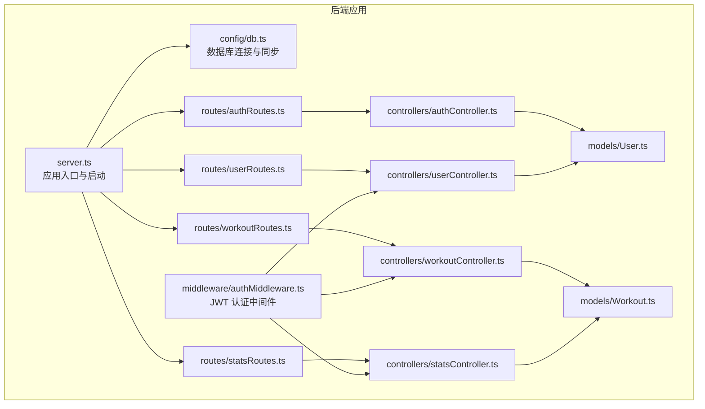
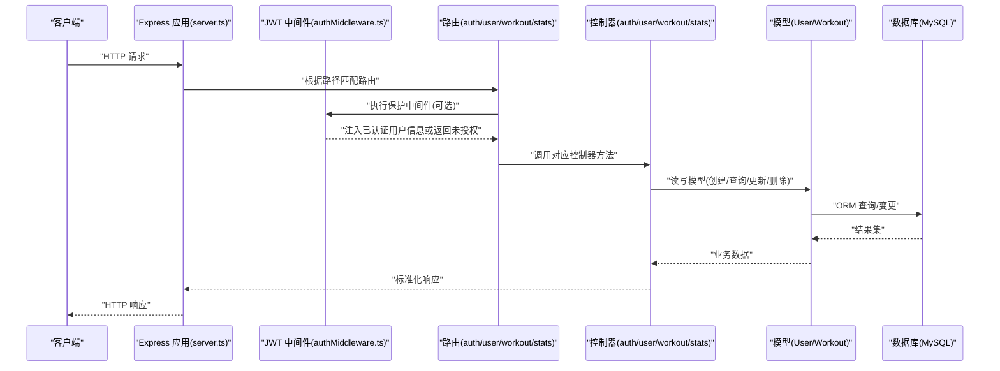
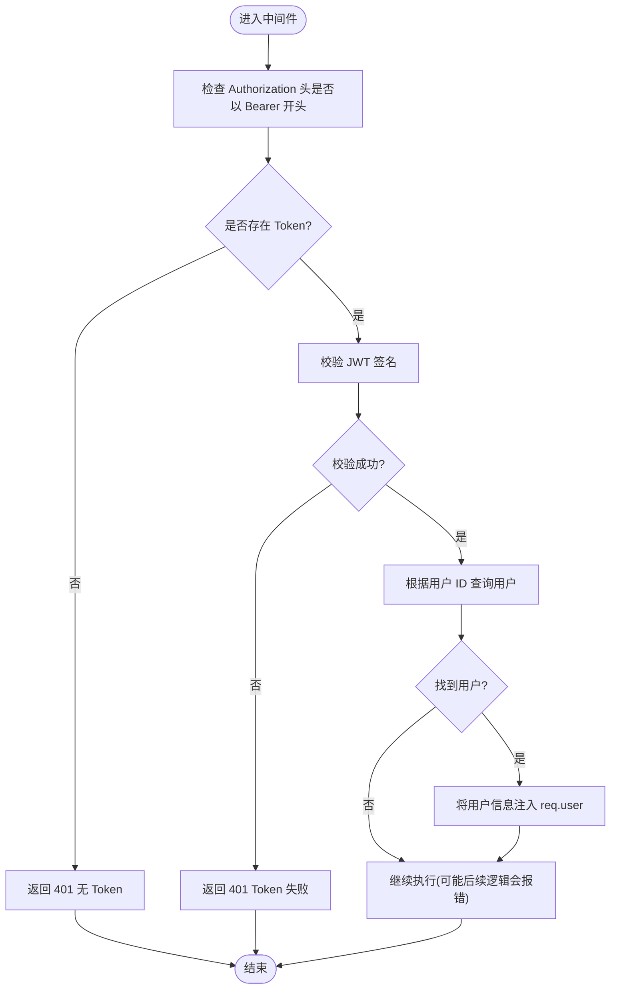
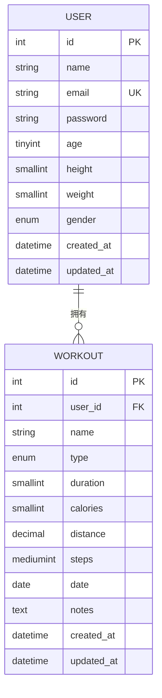
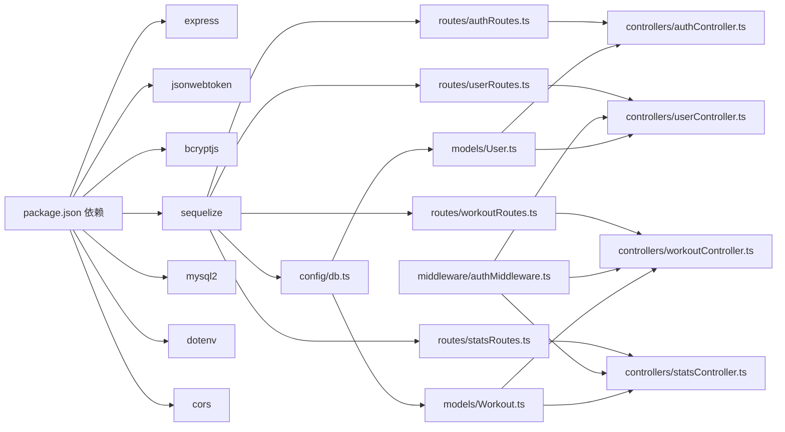

# 后端架构

<cite>
**本文引用的文件**
- [backend/src/server.ts](file://backend/src/server.ts)
- [backend/src/config/db.ts](file://backend/src/config/db.ts)
- [backend/src/middleware/authMiddleware.ts](file://backend/src/middleware/authMiddleware.ts)
- [backend/src/controllers/authController.ts](file://backend/src/controllers/authController.ts)
- [backend/src/controllers/userController.ts](file://backend/src/controllers/userController.ts)
- [backend/src/controllers/workoutController.ts](file://backend/src/controllers/workoutController.ts)
- [backend/src/controllers/statsController.ts](file://backend/src/controllers/statsController.ts)
- [backend/src/models/User.ts](file://backend/src/models/User.ts)
- [backend/src/models/Workout.ts](file://backend/src/models/Workout.ts)
- [backend/src/routes/authRoutes.ts](file://backend/src/routes/authRoutes.ts)
- [backend/src/routes/userRoutes.ts](file://backend/src/routes/userRoutes.ts)
- [backend/src/routes/workoutRoutes.ts](file://backend/src/routes/workoutRoutes.ts)
- [backend/src/routes/statsRoutes.ts](file://backend/src/routes/statsRoutes.ts)
- [backend/package.json](file://backend/package.json)
</cite>

## 目录
1. [引言](#引言)
2. [项目结构](#项目结构)
3. [核心组件](#核心组件)
4. [架构总览](#架构总览)
5. [详细组件分析](#详细组件分析)
6. [依赖关系分析](#依赖关系分析)
7. [性能考虑](#性能考虑)
8. [故障排查指南](#故障排查指南)
9. [结论](#结论)
10. [附录](#附录)

## 引言
本文件面向“后端架构”的技术文档目标，系统性梳理基于 Express + TypeScript 的后端 MVC 架构设计与实现。重点覆盖以下方面：
- 应用初始化、中间件配置与路由挂载机制（server.ts）
- 控制器（controllers）、模型（models）、路由（routes）与中间件（middleware）之间的交互模式
- JWT 身份验证中间件的工作流程、用户认证机制与请求拦截逻辑
- API 请求处理流程图：从路由分发到控制器业务逻辑再到数据库操作的完整调用链

该架构采用模块化组织，遵循 MVC 分层与职责分离原则，使用 TypeScript 提升类型安全，配合 Sequelize 实现 ORM 模型定义与数据库连接管理。

## 项目结构
后端采用典型的 MVC 分层与模块化目录组织：
- config：数据库连接与环境变量加载
- middleware：通用中间件（如 JWT 认证）
- models：数据模型（Sequelize 定义）
- controllers：业务控制器（处理请求、调用模型、返回响应）
- routes：路由定义（绑定路径与控制器方法）
- server.ts：应用入口，负责初始化、中间件与路由挂载

图表来源
- [backend/src/server.ts](file://backend/src/server.ts#L1-L36)
- [backend/src/config/db.ts](file://backend/src/config/db.ts#L1-L41)
- [backend/src/middleware/authMiddleware.ts](file://backend/src/middleware/authMiddleware.ts#L1-L36)
- [backend/src/controllers/authController.ts](file://backend/src/controllers/authController.ts#L1-L71)
- [backend/src/controllers/userController.ts](file://backend/src/controllers/userController.ts#L1-L60)
- [backend/src/controllers/workoutController.ts](file://backend/src/controllers/workoutController.ts#L1-L132)
- [backend/src/controllers/statsController.ts](file://backend/src/controllers/statsController.ts)
- [backend/src/models/User.ts](file://backend/src/models/User.ts#L1-L119)
- [backend/src/models/Workout.ts](file://backend/src/models/Workout.ts#L1-L122)
- [backend/src/routes/authRoutes.ts](file://backend/src/routes/authRoutes.ts#L1-L9)
- [backend/src/routes/userRoutes.ts](file://backend/src/routes/userRoutes.ts#L1-L11)
- [backend/src/routes/workoutRoutes.ts](file://backend/src/routes/workoutRoutes.ts#L1-L22)
- [backend/src/routes/statsRoutes.ts](file://backend/src/routes/statsRoutes.ts#L1-L10)

章节来源
- [backend/src/server.ts](file://backend/src/server.ts#L1-L36)
- [backend/src/config/db.ts](file://backend/src/config/db.ts#L1-L41)
- [backend/package.json](file://backend/package.json#L1-L35)

## 核心组件
- 应用入口与启动：在 server.ts 中加载环境变量、建立数据库连接、注册中间件、挂载路由并启动服务。
- 中间件：JWT 认证中间件负责从请求头解析 Bearer Token，校验签名，解码用户标识，查询用户并注入到请求对象，未携带或无效令牌时统一返回未授权。
- 路由层：按功能拆分为 auth、user、workout、stats 四个路由模块，每个模块导出路由实例并在 server.ts 统一挂载。
- 控制器层：处理具体业务逻辑，读取请求体/参数，调用模型进行数据库操作，返回标准化响应。
- 模型层：通过 Sequelize 定义 User 与 Workout 数据模型，包含字段约束、钩子（密码加密）与关联关系（一对多）。

章节来源
- [backend/src/server.ts](file://backend/src/server.ts#L1-L36)
- [backend/src/middleware/authMiddleware.ts](file://backend/src/middleware/authMiddleware.ts#L1-L36)
- [backend/src/controllers/authController.ts](file://backend/src/controllers/authController.ts#L1-L71)
- [backend/src/controllers/userController.ts](file://backend/src/controllers/userController.ts#L1-L60)
- [backend/src/controllers/workoutController.ts](file://backend/src/controllers/workoutController.ts#L1-L132)
- [backend/src/models/User.ts](file://backend/src/models/User.ts#L1-L119)
- [backend/src/models/Workout.ts](file://backend/src/models/Workout.ts#L1-L122)

## 架构总览
下图展示了从客户端请求到数据库访问的完整调用链，体现 MVC 分层与中间件拦截的关键节点。

图表来源
- [backend/src/server.ts](file://backend/src/server.ts#L1-L36)
- [backend/src/middleware/authMiddleware.ts](file://backend/src/middleware/authMiddleware.ts#L1-L36)
- [backend/src/routes/authRoutes.ts](file://backend/src/routes/authRoutes.ts#L1-L9)
- [backend/src/routes/userRoutes.ts](file://backend/src/routes/userRoutes.ts#L1-L11)
- [backend/src/routes/workoutRoutes.ts](file://backend/src/routes/workoutRoutes.ts#L1-L22)
- [backend/src/routes/statsRoutes.ts](file://backend/src/routes/statsRoutes.ts#L1-L10)
- [backend/src/controllers/authController.ts](file://backend/src/controllers/authController.ts#L1-L71)
- [backend/src/controllers/userController.ts](file://backend/src/controllers/userController.ts#L1-L60)
- [backend/src/controllers/workoutController.ts](file://backend/src/controllers/workoutController.ts#L1-L132)
- [backend/src/models/User.ts](file://backend/src/models/User.ts#L1-L119)
- [backend/src/models/Workout.ts](file://backend/src/models/Workout.ts#L1-L122)

## 详细组件分析

### 应用初始化与控制流（server.ts）
- 环境变量加载：通过 dotenv 将 .env 中的配置注入运行时。
- 数据库连接：调用 connectDB 初始化 Sequelize 并进行连接测试；随后同步所有模型。
- 中间件注册：启用 CORS 与 JSON 解析，为后续路由处理提供基础能力。
- 路由挂载：将各模块路由以统一前缀挂载至应用，形成清晰的 API 命名空间。
- 服务器启动：监听端口并输出运行日志。

章节来源
- [backend/src/server.ts](file://backend/src/server.ts#L1-L36)
- [backend/src/config/db.ts](file://backend/src/config/db.ts#L1-L41)

### JWT 身份验证中间件（authMiddleware.ts）
- 请求头解析：从 Authorization 头中提取 Bearer Token。
- 签名校验：使用 JWT_SECRET 对 Token 进行 verify，失败则返回未授权。
- 用户查找：根据解码后的用户标识查询用户，排除敏感字段后注入到 req.user。
- 授权放行：若存在有效 Token，继续执行后续处理器；否则返回未授权错误。

图表来源
- [backend/src/middleware/authMiddleware.ts](file://backend/src/middleware/authMiddleware.ts#L1-L36)
- [backend/src/models/User.ts](file://backend/src/models/User.ts#L1-L119)

章节来源
- [backend/src/middleware/authMiddleware.ts](file://backend/src/middleware/authMiddleware.ts#L1-L36)

### 认证控制器（authController.ts）
- 注册流程：校验邮箱唯一性，创建用户记录（密码经哈希），成功后签发 JWT 返回。
- 登录流程：按邮箱查询用户，比对密码，成功后签发 JWT 返回。
- 错误处理：重复邮箱、无效凭据、服务器异常等场景均返回标准化状态码与消息。

章节来源
- [backend/src/controllers/authController.ts](file://backend/src/controllers/authController.ts#L1-L71)
- [backend/src/models/User.ts](file://backend/src/models/User.ts#L1-L119)

### 用户控制器（userController.ts）
- 获取/更新个人资料：依赖中间件注入的 req.user.id 作为当前用户标识，查询与更新用户信息（排除密码字段）。

章节来源
- [backend/src/controllers/userController.ts](file://backend/src/controllers/userController.ts#L1-L60)
- [backend/src/middleware/authMiddleware.ts](file://backend/src/middleware/authMiddleware.ts#L1-L36)
- [backend/src/models/User.ts](file://backend/src/models/User.ts#L1-L119)

### 运动记录控制器（workoutController.ts）
- 列表/详情/新增/更新/删除：均需通过中间件保护，仅允许当前用户访问其运动记录；更新/删除前校验归属关系。
- 关联查询：按用户 ID 过滤记录并按日期降序排列。

章节来源
- [backend/src/controllers/workoutController.ts](file://backend/src/controllers/workoutController.ts#L1-L132)
- [backend/src/middleware/authMiddleware.ts](file://backend/src/middleware/authMiddleware.ts#L1-L36)
- [backend/src/models/Workout.ts](file://backend/src/models/Workout.ts#L1-L122)

### 统计控制器（statsController.ts）
- 提供运动统计与周统计接口，受中间件保护，仅限登录用户访问。

章节来源
- [backend/src/controllers/statsController.ts](file://backend/src/controllers/statsController.ts)
- [backend/src/middleware/authMiddleware.ts](file://backend/src/middleware/authMiddleware.ts#L1-L36)

### 数据模型（models/User.ts 与 models/Workout.ts）
- User 模型：包含基础属性与字段校验，使用 beforeCreate/beforeUpdate 钩子对密码进行加盐哈希。
- Workout 模型：定义运动记录字段与枚举类型，设置外键关联与级联删除策略。
- 关系：User 与 Workout 为一对多关系，通过 belongsTo/hasMany 建立。

图表来源
- [backend/src/models/User.ts](file://backend/src/models/User.ts#L1-L119)
- [backend/src/models/Workout.ts](file://backend/src/models/Workout.ts#L1-L122)

章节来源
- [backend/src/models/User.ts](file://backend/src/models/User.ts#L1-L119)
- [backend/src/models/Workout.ts](file://backend/src/models/Workout.ts#L1-L122)

### 路由模块（routes/*）
- 认证路由：注册与登录接口，直接绑定控制器方法。
- 用户路由：个人资料的 GET/PUT，均受保护中间件保护。
- 运动路由：列表、详情、新增、更新、删除，均受保护中间件保护。
- 统计路由：运动统计与周统计接口，受保护中间件保护。

章节来源
- [backend/src/routes/authRoutes.ts](file://backend/src/routes/authRoutes.ts#L1-L9)
- [backend/src/routes/userRoutes.ts](file://backend/src/routes/userRoutes.ts#L1-L11)
- [backend/src/routes/workoutRoutes.ts](file://backend/src/routes/workoutRoutes.ts#L1-L22)
- [backend/src/routes/statsRoutes.ts](file://backend/src/routes/statsRoutes.ts#L1-L10)

## 依赖关系分析
- 运行时依赖：Express、CORS、dotenv、jsonwebtoken、bcryptjs、mysql2、sequelize。
- 开发时依赖：TypeScript 类型声明与开发工具（ts-node、nodemon）。
- 模块耦合：
  - server.ts 作为入口，耦合 config、routes 与 express。
  - routes 依赖 controllers。
  - controllers 依赖 models。
  - models 依赖 config/db.ts 与 sequelize。
  - middleware 依赖 models 与 jwt。

图表来源
- [backend/package.json](file://backend/package.json#L1-L35)
- [backend/src/server.ts](file://backend/src/server.ts#L1-L36)
- [backend/src/config/db.ts](file://backend/src/config/db.ts#L1-L41)
- [backend/src/middleware/authMiddleware.ts](file://backend/src/middleware/authMiddleware.ts#L1-L36)
- [backend/src/controllers/authController.ts](file://backend/src/controllers/authController.ts#L1-L71)
- [backend/src/controllers/userController.ts](file://backend/src/controllers/userController.ts#L1-L60)
- [backend/src/controllers/workoutController.ts](file://backend/src/controllers/workoutController.ts#L1-L132)
- [backend/src/controllers/statsController.ts](file://backend/src/controllers/statsController.ts)
- [backend/src/models/User.ts](file://backend/src/models/User.ts#L1-L119)
- [backend/src/models/Workout.ts](file://backend/src/models/Workout.ts#L1-L122)
- [backend/src/routes/authRoutes.ts](file://backend/src/routes/authRoutes.ts#L1-L9)
- [backend/src/routes/userRoutes.ts](file://backend/src/routes/userRoutes.ts#L1-L11)
- [backend/src/routes/workoutRoutes.ts](file://backend/src/routes/workoutRoutes.ts#L1-L22)
- [backend/src/routes/statsRoutes.ts](file://backend/src/routes/statsRoutes.ts#L1-L10)

章节来源
- [backend/package.json](file://backend/package.json#L1-L35)

## 性能考虑
- 数据库连接池：通过 Sequelize 的 pool 参数限制最大连接数与空闲回收时间，避免资源耗尽。
- 日志级别：默认关闭 SQL 日志，生产环境可根据需要开启以定位慢查询。
- 中间件顺序：CORS 与 JSON 解析置于路由之前，确保所有请求均可正确解析与跨域。
- 模型同步策略：使用 alter 同步模型，避免频繁重建表导致的数据丢失风险；生产环境建议谨慎使用。
- 密码哈希成本：在 User 模型钩子中使用固定强度的盐值，平衡安全性与性能。

章节来源
- [backend/src/config/db.ts](file://backend/src/config/db.ts#L1-L41)
- [backend/src/models/User.ts](file://backend/src/models/User.ts#L1-L119)

## 故障排查指南
- 数据库连接失败
  - 现象：启动时报数据库连接错误并退出。
  - 排查：确认 .env 中数据库连接参数、网络可达性与权限；查看连接测试与同步日志。
  - 参考
    - [backend/src/config/db.ts](file://backend/src/config/db.ts#L1-L41)
- 未携带或无效 Token
  - 现象：受保护接口返回 401。
  - 排查：确认请求头 Authorization 是否为 Bearer Token；核对 JWT_SECRET；检查 Token 是否过期。
  - 参考
    - [backend/src/middleware/authMiddleware.ts](file://backend/src/middleware/authMiddleware.ts#L1-L36)
- 用户不存在或密码错误
  - 现象：注册返回用户已存在；登录返回无效凭据。
  - 排查：确认邮箱唯一性；检查密码比对逻辑与哈希存储。
  - 参考
    - [backend/src/controllers/authController.ts](file://backend/src/controllers/authController.ts#L1-L71)
    - [backend/src/models/User.ts](file://backend/src/models/User.ts#L1-L119)
- 运动记录越权访问
  - 现象：更新/删除返回未授权。
  - 排查：确认请求是否携带有效 Token；检查记录归属字段与中间件拦截逻辑。
  - 参考
    - [backend/src/controllers/workoutController.ts](file://backend/src/controllers/workoutController.ts#L1-L132)
    - [backend/src/middleware/authMiddleware.ts](file://backend/src/middleware/authMiddleware.ts#L1-L36)

## 结论
该后端架构以 Express + TypeScript 为基础，采用清晰的 MVC 分层与模块化组织，结合 JWT 中间件实现统一的身份验证与授权拦截。通过 Sequelize 管理数据模型与数据库连接，实现了良好的扩展性与可维护性。建议在生产环境中进一步完善：
- 使用更严格的模型同步策略与迁移方案
- 增强日志与监控埋点
- 引入统一的错误处理与响应格式
- 对热点接口增加缓存与限流策略

## 附录
- 启动与构建
  - 开发模式：使用 ts-node 与 nodemon 监听热重载
  - 生产模式：先编译 TypeScript 再运行 Node.js
- 环境变量
  - 数据库连接参数与 JWT_SECRET 需在 .env 中正确配置

章节来源
- [backend/package.json](file://backend/package.json#L1-L35)
- [backend/src/server.ts](file://backend/src/server.ts#L1-L36)
- [backend/src/config/db.ts](file://backend/src/config/db.ts#L1-L41)