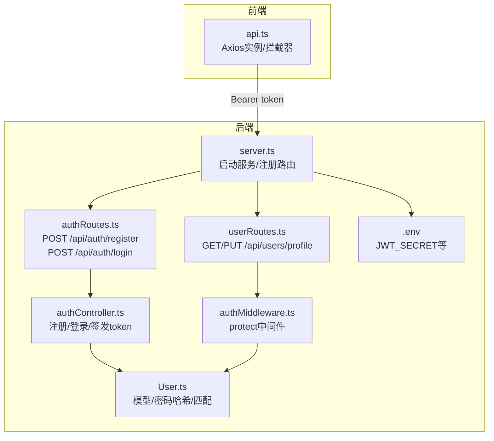
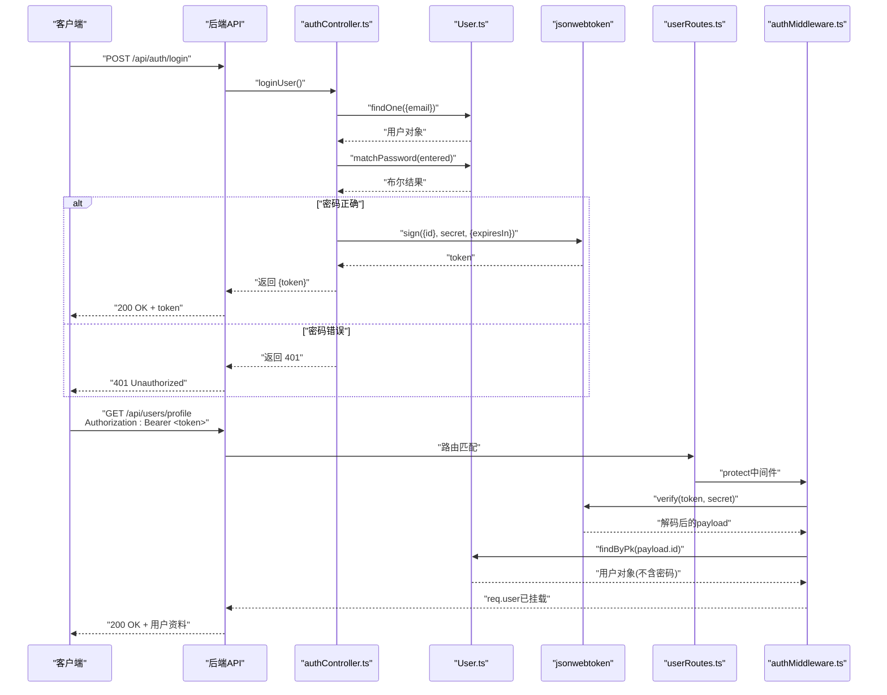
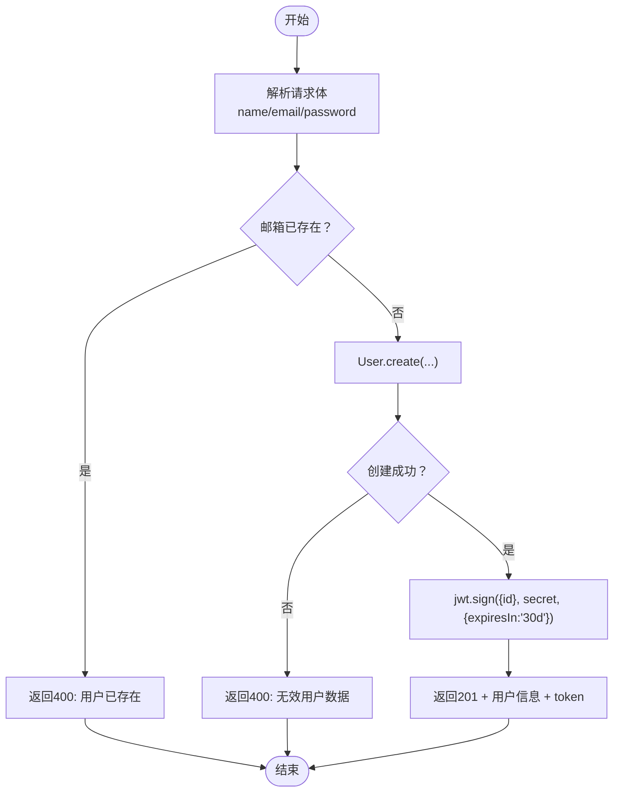
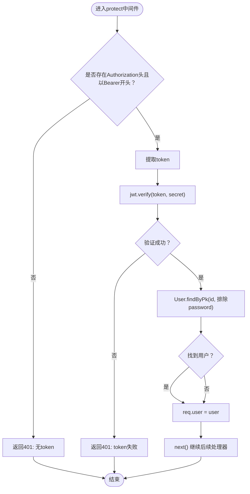
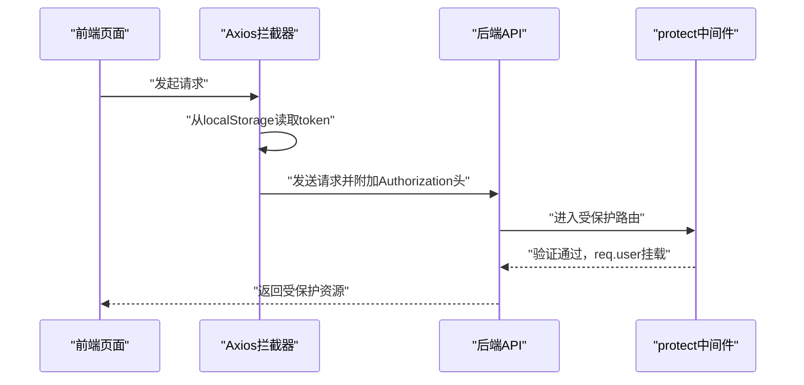
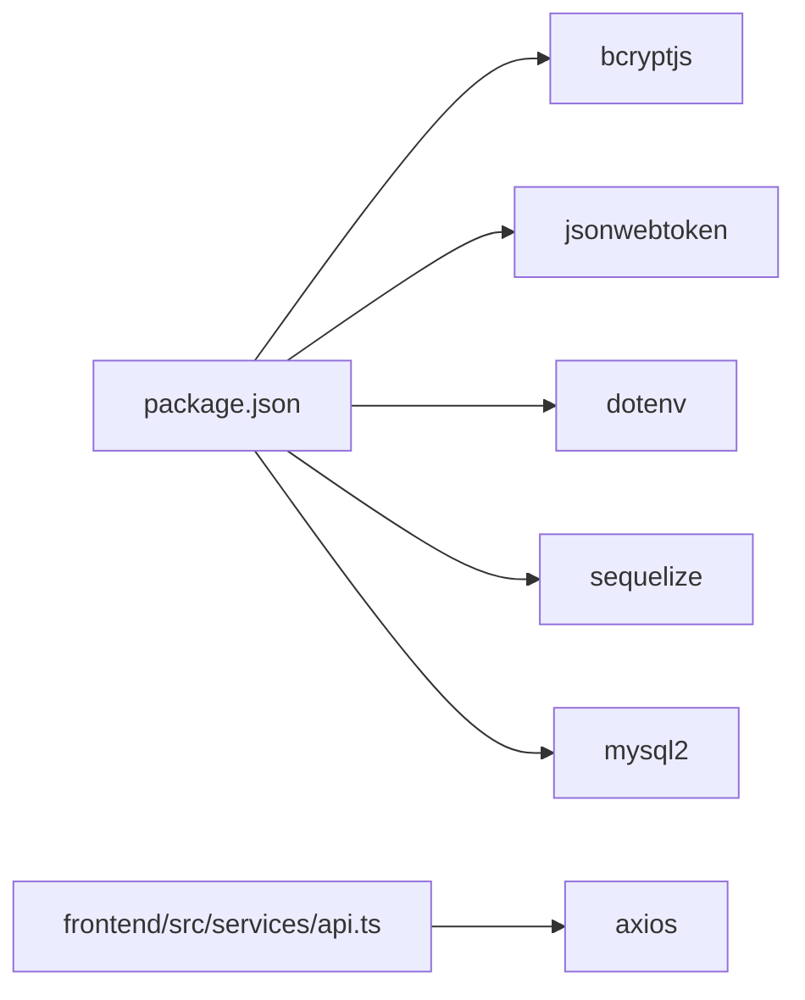

# 认证流程

<cite>
**本文引用的文件**
- [backend/src/controllers/authController.ts](file://backend/src/controllers/authController.ts)
- [backend/src/middleware/authMiddleware.ts](file://backend/src/middleware/authMiddleware.ts)
- [backend/src/models/User.ts](file://backend/src/models/User.ts)
- [backend/src/routes/authRoutes.ts](file://backend/src/routes/authRoutes.ts)
- [backend/src/routes/userRoutes.ts](file://backend/src/routes/userRoutes.ts)
- [backend/src/server.ts](file://backend/src/server.ts)
- [backend/.env](file://backend/.env)
- [backend/package.json](file://backend/package.json)
- [frontend/src/services/api.ts](file://frontend/src/services/api.ts)
- [tests/test-api.js](file://tests/test-api.js)
- [docs/4. API接口文档.md](file://docs/4. API接口文档.md)
</cite>

## 目录
1. [简介](#简介)
2. [项目结构](#项目结构)
3. [核心组件](#核心组件)
4. [架构总览](#架构总览)
5. [详细组件分析](#详细组件分析)
6. [依赖关系分析](#依赖关系分析)
7. [性能考量](#性能考量)
8. [故障排查指南](#故障排查指南)
9. [结论](#结论)
10. [附录](#附录)

## 简介
本文件系统性地文档化了本项目的JWT身份验证实现机制，覆盖以下关键点：
- 用户注册与登录流程：密码使用bcryptjs加密存储，登录成功后由jsonwebtoken签发JWT令牌并返回给客户端。
- 中间件保护：authMiddleware.ts中的protect中间件从请求头Authorization中提取Bearer Token，验证JWT签名，查询用户并挂载到请求对象，用于后续受保护路由。
- 环境变量与密钥管理：JWT_SECRET来自环境变量，强调密钥安全的重要性。
- 多种认证失败场景：无效token、过期token、无token的错误处理逻辑。
- 完整调用链：从登录请求到受保护路由访问的序列图。
- 前端Axios集成：如何在请求中携带token。
- 扩展建议：会话管理与token刷新机制的可行性探讨。

## 项目结构
后端采用Express + TypeScript + Sequelize + jsonwebtoken + bcryptjs的组合，认证相关的核心文件分布如下：
- 控制器：authController.ts（注册/登录）、userController.ts（用户资料）
- 中间件：authMiddleware.ts（JWT保护）
- 模型：User.ts（用户实体、密码哈希钩子、密码校验方法）
- 路由：authRoutes.ts、userRoutes.ts
- 服务器入口：server.ts（加载.env、连接数据库、注册路由）
- 环境变量：.env（包含JWT_SECRET）
- 前端：Axios拦截器自动添加Authorization头

图表来源
- [backend/src/server.ts](file://backend/src/server.ts#L1-L36)
- [backend/src/routes/authRoutes.ts](file://backend/src/routes/authRoutes.ts#L1-L9)
- [backend/src/routes/userRoutes.ts](file://backend/src/routes/userRoutes.ts#L1-L11)
- [backend/src/controllers/authController.ts](file://backend/src/controllers/authController.ts#L1-L71)
- [backend/src/middleware/authMiddleware.ts](file://backend/src/middleware/authMiddleware.ts#L1-L36)
- [backend/src/models/User.ts](file://backend/src/models/User.ts#L1-L119)
- [backend/.env](file://backend/.env#L1-L10)
- [frontend/src/services/api.ts](file://frontend/src/services/api.ts#L1-L61)

章节来源
- [backend/src/server.ts](file://backend/src/server.ts#L1-L36)
- [backend/src/routes/authRoutes.ts](file://backend/src/routes/authRoutes.ts#L1-L9)
- [backend/src/routes/userRoutes.ts](file://backend/src/routes/userRoutes.ts#L1-L11)
- [backend/src/controllers/authController.ts](file://backend/src/controllers/authController.ts#L1-L71)
- [backend/src/middleware/authMiddleware.ts](file://backend/src/middleware/authMiddleware.ts#L1-L36)
- [backend/src/models/User.ts](file://backend/src/models/User.ts#L1-L119)
- [backend/.env](file://backend/.env#L1-L10)
- [frontend/src/services/api.ts](file://frontend/src/services/api.ts#L1-L61)

## 核心组件
- 注册控制器：接收用户名、邮箱、密码；检查邮箱是否已存在；创建用户并返回token。
- 登录控制器：根据邮箱查找用户；使用bcrypt比较密码；成功则签发token。
- 密码加密：Sequelize钩子在beforeCreate/beforeUpdate阶段对密码进行bcrypt哈希。
- JWT签发：使用jsonwebtoken，密钥来自环境变量，有效期30天。
- 保护中间件：从Authorization头提取Bearer Token；验证签名；按ID查询用户并挂载到req.user。
- 前端Axios：拦截器自动为每个请求添加Authorization头。

章节来源
- [backend/src/controllers/authController.ts](file://backend/src/controllers/authController.ts#L1-L71)
- [backend/src/models/User.ts](file://backend/src/models/User.ts#L1-L119)
- [backend/src/middleware/authMiddleware.ts](file://backend/src/middleware/authMiddleware.ts#L1-L36)
- [frontend/src/services/api.ts](file://frontend/src/services/api.ts#L1-L61)

## 架构总览
下图展示了从客户端发起登录请求到访问受保护路由的完整调用链，以及中间件如何在请求生命周期中进行JWT验证。

图表来源
- [backend/src/controllers/authController.ts](file://backend/src/controllers/authController.ts#L1-L71)
- [backend/src/models/User.ts](file://backend/src/models/User.ts#L1-L119)
- [backend/src/middleware/authMiddleware.ts](file://backend/src/middleware/authMiddleware.ts#L1-L36)
- [backend/src/routes/userRoutes.ts](file://backend/src/routes/userRoutes.ts#L1-L11)

## 详细组件分析

### 注册与登录流程（含密码加密）
- 注册
  - 输入校验：邮箱唯一性检查。
  - 创建用户：User.create(...)，Sequelize钩子会在保存前对密码进行bcrypt哈希。
  - 返回：用户信息 + token。
- 登录
  - 查找用户：按邮箱查询。
  - 密码校验：使用User实例的matchPassword方法（bcrypt.compare）。
  - 成功：签发token并返回；失败：返回401。

图表来源
- [backend/src/controllers/authController.ts](file://backend/src/controllers/authController.ts#L1-L71)
- [backend/src/models/User.ts](file://backend/src/models/User.ts#L1-L119)

章节来源
- [backend/src/controllers/authController.ts](file://backend/src/controllers/authController.ts#L1-L71)
- [backend/src/models/User.ts](file://backend/src/models/User.ts#L1-L119)

### JWT保护中间件（protect）
- 请求头解析：从Authorization头提取Bearer Token。
- 签名验证：使用jsonwebtoken.verify，密钥来自环境变量。
- 用户查询：按解码出的用户ID查询用户，排除password字段。
- 挂载请求对象：将用户信息挂载到req.user，供后续处理器使用。
- 错误处理：未提供token或token无效时返回401。

图表来源
- [backend/src/middleware/authMiddleware.ts](file://backend/src/middleware/authMiddleware.ts#L1-L36)
- [backend/src/models/User.ts](file://backend/src/models/User.ts#L1-L119)

章节来源
- [backend/src/middleware/authMiddleware.ts](file://backend/src/middleware/authMiddleware.ts#L1-L36)
- [backend/src/models/User.ts](file://backend/src/models/User.ts#L1-L119)

### 前端Axios集成与Token携带
- Axios实例：设置baseURL为后端API地址。
- 请求拦截器：从localStorage读取token，若存在则在请求头添加Authorization: Bearer <token>。
- 受保护路由：如GET /api/users/profile、PUT /api/users/profile等均需携带token。

图表来源
- [frontend/src/services/api.ts](file://frontend/src/services/api.ts#L1-L61)
- [backend/src/middleware/authMiddleware.ts](file://backend/src/middleware/authMiddleware.ts#L1-L36)

章节来源
- [frontend/src/services/api.ts](file://frontend/src/services/api.ts#L1-L61)
- [tests/test-api.js](file://tests/test-api.js#L88-L149)

### 环境变量与密钥安全管理
- JWT_SECRET：来自.env文件，用于签发与验证JWT。
- 安全建议：
  - 生产环境必须使用强随机密钥，避免硬编码在源码中。
  - 将密钥存放在安全的环境变量管理器或密钥管理服务中。
  - 限制密钥泄露范围，定期轮换密钥。
  - 对敏感日志输出进行脱敏处理。

章节来源
- [backend/.env](file://backend/.env#L1-L10)
- [backend/src/controllers/authController.ts](file://backend/src/controllers/authController.ts#L1-L10)
- [backend/src/middleware/authMiddleware.ts](file://backend/src/middleware/authMiddleware.ts#L1-L20)

### 认证失败场景与错误处理
- 无token：中间件检测不到Authorization头或不以Bearer开头，返回401。
- 无效token：jwt.verify抛错，返回401。
- 过期token：jsonwebtoken.verify在过期时抛错，返回401。
- 密码错误：登录时matchPassword返回false，返回401。
- 服务器错误：捕获异常统一返回500。

章节来源
- [backend/src/middleware/authMiddleware.ts](file://backend/src/middleware/authMiddleware.ts#L1-L36)
- [backend/src/controllers/authController.ts](file://backend/src/controllers/authController.ts#L1-L71)

## 依赖关系分析
- 后端依赖
  - bcryptjs：密码哈希与比对。
  - jsonwebtoken：JWT签发与验证。
  - dotenv：加载环境变量。
  - sequelize/mysql2：ORM与数据库驱动。
- 前端依赖
  - axios：HTTP客户端，配合拦截器自动携带token。

图表来源
- [backend/package.json](file://backend/package.json#L1-L35)
- [frontend/src/services/api.ts](file://frontend/src/services/api.ts#L1-L61)

章节来源
- [backend/package.json](file://backend/package.json#L1-L35)

## 性能考量
- 密码哈希成本：bcrypt默认使用固定成本（genSalt 10），在高并发场景下可评估成本参数与硬件能力平衡。
- JWT验证：verify为同步操作，但仅在受保护路由触发，开销较小。
- 数据库查询：protect中间件按ID查询用户，建议在users表的主键上保持索引。
- 前端缓存：token存储于localStorage，注意跨站脚本攻击风险；可考虑HttpOnly Cookie（需后端支持）。

## 故障排查指南
- 401 无token
  - 检查前端是否正确设置Authorization头。
  - 确认请求头格式为“Bearer <token>”。
- 401 token失败
  - 确认JWT_SECRET一致且未被修改。
  - 检查token是否过期（默认30天）。
  - 确认签发方与验证方使用同一密钥。
- 401 密码错误
  - 确认输入密码与数据库中哈希值匹配。
  - 检查User模型的matchPassword实现。
- 500 服务器错误
  - 捕获异常并查看后端日志。
  - 检查数据库连接与模型定义。

章节来源
- [backend/src/middleware/authMiddleware.ts](file://backend/src/middleware/authMiddleware.ts#L1-L36)
- [backend/src/controllers/authController.ts](file://backend/src/controllers/authController.ts#L1-L71)
- [tests/test-api.js](file://tests/test-api.js#L88-L149)

## 结论
本项目实现了标准的JWT认证流程：bcryptjs负责密码安全存储，jsonwebtoken负责令牌签发与验证，Express中间件protect贯穿受保护路由。通过.env集中管理JWT_SECRET，提升了密钥管理的安全性。当前实现未包含token刷新机制，可在后续版本中引入刷新令牌策略以增强用户体验与安全性。

## 附录

### API接口与请求头约定
- 受保护接口通常要求在请求头中携带Authorization: Bearer <token>。
- 示例见API文档与测试脚本。

章节来源
- [docs/4. API接口文档.md](file://docs/4. API接口文档.md#L161-L275)
- [tests/test-api.js](file://tests/test-api.js#L88-L149)

### 前端Axios示例要点
- 在请求拦截器中从localStorage读取token并附加到Authorization头。
- 所有需要认证的请求均自动携带该头。

章节来源
- [frontend/src/services/api.ts](file://frontend/src/services/api.ts#L1-L61)

### 扩展建议：会话管理与token刷新
- 刷新令牌（Refresh Token）：签发短期Access Token与长期Refresh Token，Access Token过期后用Refresh Token换取新的Access Token。
- 存储策略：将Refresh Token存储在HttpOnly Cookie中，降低XSS风险。
- 黑名单机制：维护已吊销的Access/Refresh Token集合，防止重放攻击。
- 自动续期：在前端监听401错误并尝试刷新token，失败则引导重新登录。

[本节为概念性建议，不对应具体代码文件]