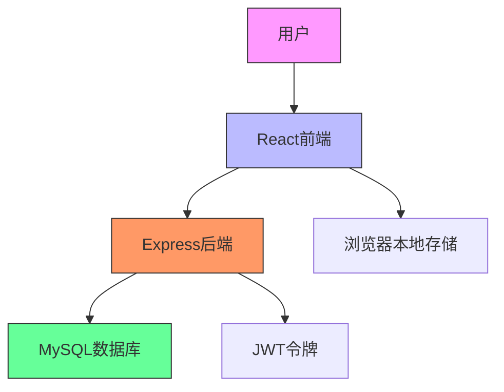
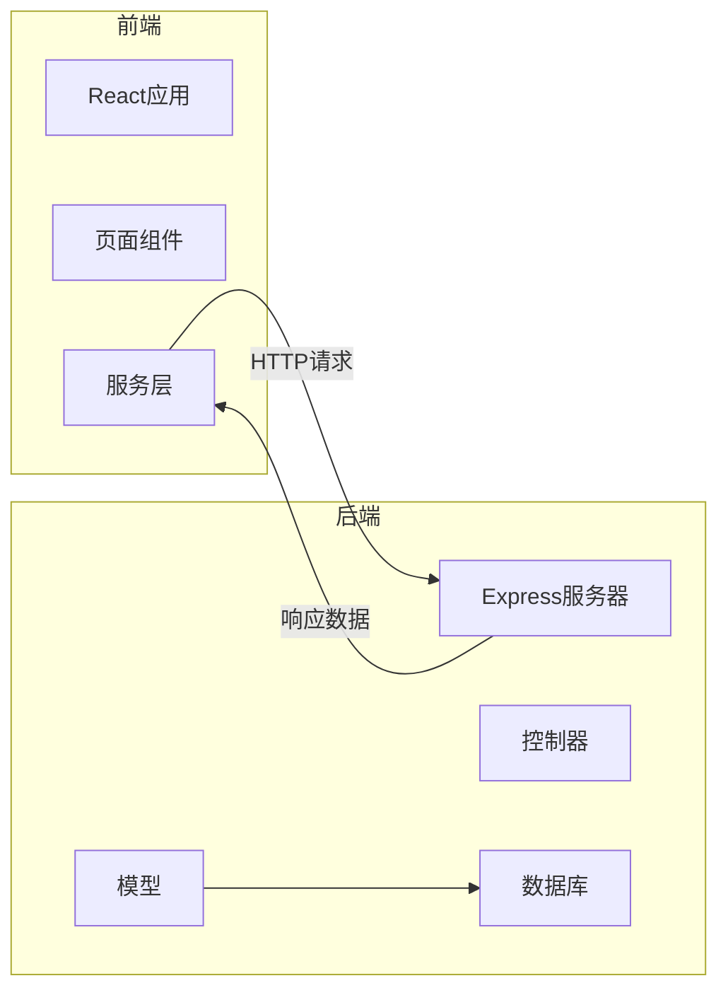
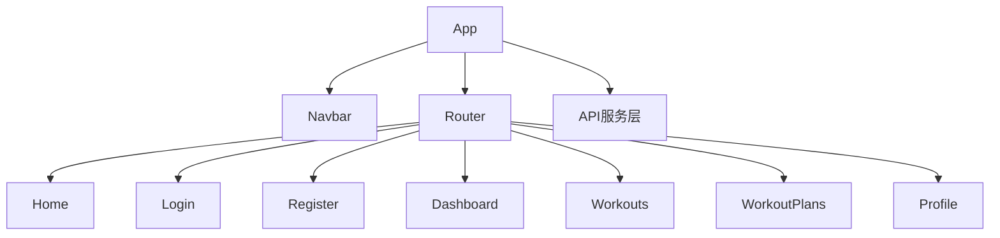
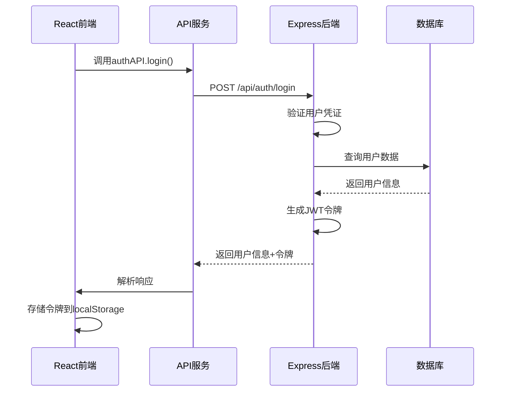
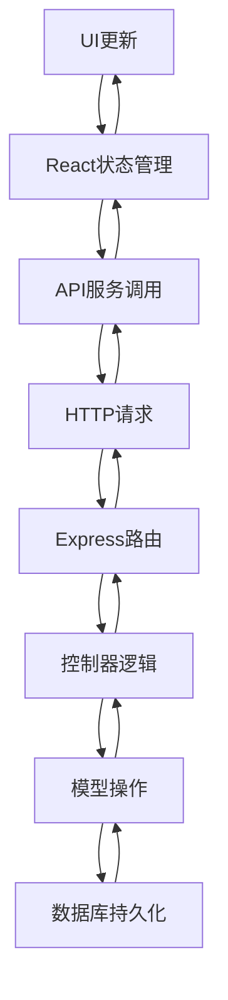
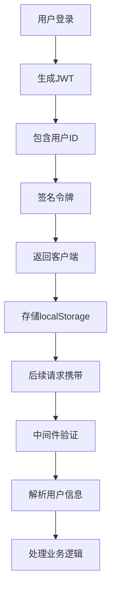
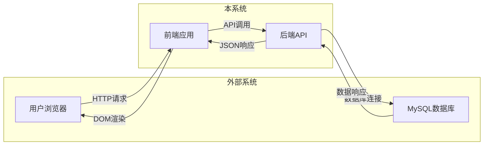

# 架构设计

<cite>
**本文档中引用的文件**  
- [App.tsx](file://frontend/src/App.tsx)
- [api.ts](file://frontend/src/services/api.ts)
- [server.ts](file://backend/src/server.ts)
- [authController.ts](file://backend/src/controllers/authController.ts)
- [userController.ts](file://backend/src/controllers/userController.ts)
- [workoutController.ts](file://backend/src/controllers/workoutController.ts)
- [statsController.ts](file://backend/src/controllers/statsController.ts)
- [authRoutes.ts](file://backend/src/routes/authRoutes.ts)
- [userRoutes.ts](file://backend/src/routes/userRoutes.ts)
- [workoutRoutes.ts](file://backend/src/routes/workoutRoutes.ts)
- [statsRoutes.ts](file://backend/src/routes/statsRoutes.ts)
- [authMiddleware.ts](file://backend/src/middleware/authMiddleware.ts)
- [User.ts](file://backend/src/models/User.ts)
- [Workout.ts](file://backend/src/models/Workout.ts)
- [db.ts](file://backend/src/config/db.ts)
</cite>

## 目录
1. [系统上下文](#系统上下文)  
2. [前后端分离架构](#前后端分离架构)  
3. [前端组件层次结构](#前端组件层次结构)  
4. [后端MVC架构](#后端mvc架构)  
5. [RESTful API通信机制](#restful-api通信机制)  
6. [数据流路径分析](#数据流路径分析)  
7. [技术决策与权衡](#技术决策与权衡)  
8. [系统边界与集成点](#系统边界与集成点)

## 系统上下文

本系统为健身追踪平台，采用前后端分离架构，前端基于React构建用户界面，后端使用Express提供RESTful API服务，通过JWT实现身份验证，数据持久化采用MySQL数据库。



**图示来源**  
- [README.md](file://README.md#L1-L282)

## 前后端分离架构

系统采用标准的前后端分离架构模式，前端负责UI渲染与用户交互，后端专注于业务逻辑处理与数据管理，两者通过RESTful API进行通信。



**图示来源**  
- [App.tsx](file://frontend/src/App.tsx#L1-L48)
- [server.ts](file://backend/src/server.ts#L1-L36)

## 前端组件层次结构

前端采用React组件化设计，以App组件为根节点，通过React Router实现路由管理，各页面组件独立封装业务功能。



**组件来源**  
- [App.tsx](file://frontend/src/App.tsx#L1-L48)
- [Login.tsx](file://frontend/src/pages/Login.tsx#L1-L109)
- [Register.tsx](file://frontend/src/pages/Register.tsx#L1-L149)
- [Dashboard.tsx](file://frontend/src/pages/Dashboard.tsx#L1-L174)
- [Workouts.tsx](file://frontend/src/pages/Workouts.tsx#L1-L383)

## 后端MVC架构

后端采用MVC（Model-View-Controller）设计模式，其中View层由API响应替代，实现关注点分离。

```mermaid
classDiagram
class Server {
+app : Express
+PORT : number
+listen()
}
class Routes {
+authRoutes
+userRoutes
+workoutRoutes
+statsRoutes
}
class Controllers {
+authController
+userController
+workoutController
+statsController
}
class Models {
+User
+Workout
}
class Middleware {
+authMiddleware
+protect()
}
Server --> Routes : "使用"
Routes --> Controllers : "路由到"
Controllers --> Models : "操作"
Controllers --> Middleware : "应用"
Models --> "MySQL数据库"
```

**架构来源**  
- [server.ts](file://backend/src/server.ts#L1-L36)
- [routes/](file://backend/src/routes/)
- [controllers/](file://backend/src/controllers/)
- [models/](file://backend/src/models/)
- [middleware/](file://backend/src/middleware/)

## RESTful API通信机制

前后端通过RESTful API进行通信，前端通过Axios客户端发送HTTP请求，后端返回JSON格式响应。



**通信来源**  
- [api.ts](file://frontend/src/services/api.ts#L1-L61)
- [authController.ts](file://backend/src/controllers/authController.ts#L1-L71)
- [authRoutes.ts](file://backend/src/routes/authRoutes.ts#L1-L9)

## 数据流路径分析

系统数据流遵循清晰的单向数据流动原则，从用户交互开始，经过前端处理，通过API传输，后端业务逻辑处理，最终持久化到数据库。



**数据流来源**  
- [Login.tsx](file://frontend/src/pages/Login.tsx#L1-L109)
- [api.ts](file://frontend/src/services/api.ts#L1-L61)
- [authController.ts](file://backend/src/controllers/authController.ts#L1-L71)
- [User.ts](file://backend/src/models/User.ts#L1-L119)

## 技术决策与权衡

### Sequelize ORM选择原因
1. **TypeScript支持**：提供完整的TypeScript类型定义，与项目技术栈匹配
2. **Active Record模式**：简化数据库操作，提高开发效率
3. **迁移支持**：内置迁移功能，便于数据库版本管理
4. **关系映射**：优雅处理表间关系，如用户与运动记录的一对多关系

### JWT身份验证设计
1. **无状态性**：服务器无需存储会话信息，便于水平扩展
2. **跨域支持**：适合前后端分离架构，不受同源策略限制
3. **自包含性**：令牌包含用户ID等必要信息，减少数据库查询
4. **安全性**：使用HS256算法签名，防止篡改



**技术决策来源**  
- [authMiddleware.ts](file://backend/src/middleware/authMiddleware.ts#L1-L36)
- [authController.ts](file://backend/src/controllers/authController.ts#L1-L71)
- [User.ts](file://backend/src/models/User.ts#L1-L119)
- [Workout.ts](file://backend/src/models/Workout.ts#L1-L122)

## 系统边界与集成点

系统具有清晰的边界定义，外部依赖主要为数据库和客户端环境。



**系统边界来源**  
- [server.ts](file://backend/src/server.ts#L1-L36)
- [db.ts](file://backend/src/config/db.ts)
- [api.ts](file://frontend/src/services/api.ts#L1-L61)
- [App.tsx](file://frontend/src/App.tsx#L1-L48)