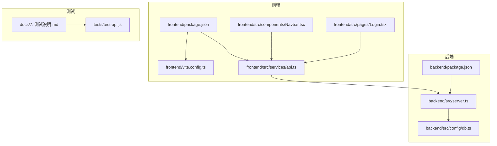
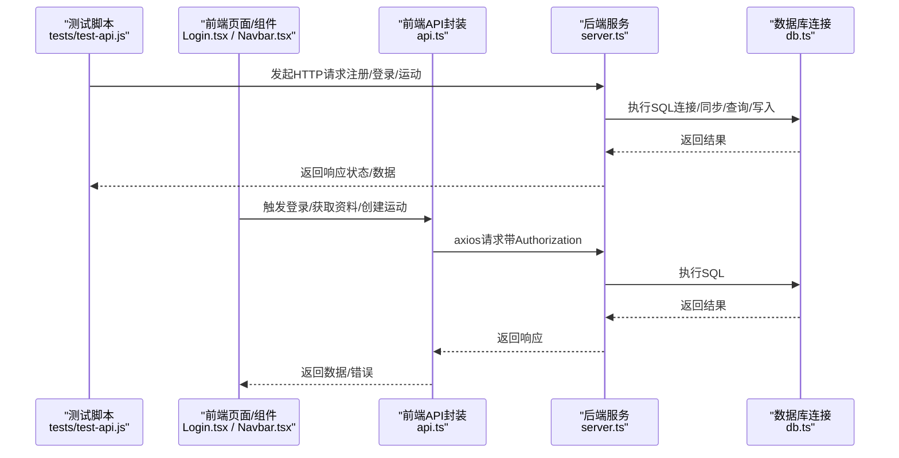
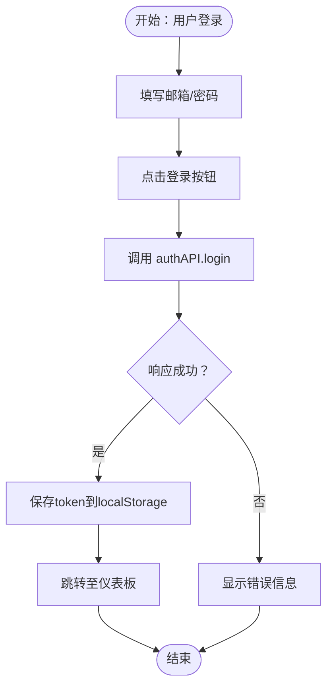
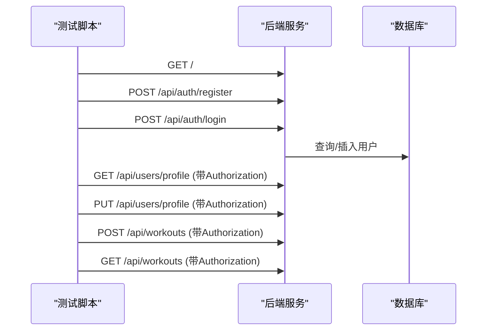
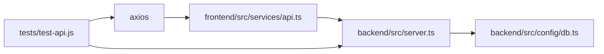

# 测试说明

<cite>
**本文引用的文件**
- [测试说明.md](file://docs/7. 测试说明.md)
- [test-api.js](file://tests/test-api.js)
- [package.json（测试）](file://tests/package.json)
- [package.json（前端）](file://frontend/package.json)
- [package.json（后端）](file://backend/package.json)
- [vite.config.ts](file://frontend/vite.config.ts)
- [server.ts](file://backend/src/server.ts)
- [db.ts](file://backend/src/config/db.ts)
- [api.ts](file://frontend/src/services/api.ts)
- [Navbar.tsx](file://frontend/src/components/Navbar.tsx)
- [Login.tsx](file://frontend/src/pages/Login.tsx)
</cite>

## 目录
1. [简介](#简介)
2. [项目结构与测试位置](#项目结构与测试位置)
3. [核心测试能力](#核心测试能力)
4. [架构总览](#架构总览)
5. [详细组件与用例分析](#详细组件与用例分析)
6. [依赖关系分析](#依赖关系分析)
7. [性能与覆盖率目标](#性能与覆盖率目标)
8. [持续集成与自动化建议](#持续集成与自动化建议)
9. [故障排查指南](#故障排查指南)
10. [结论](#结论)

## 简介
本节系统化阐述 Fitness Tracker 的测试策略与落地方法，覆盖单元测试、集成测试、API 测试与端到端测试四层。文档明确测试工具链、测试文件组织方式、执行命令、覆盖率目标，并给出前端组件测试、后端 API 测试与数据库测试的示例路径，同时提供持续集成与自动化改进建议。

## 项目结构与测试位置
- 文档与策略：位于 docs/7. 测试说明.md，定义测试层级、工具链、文件组织、执行命令、覆盖率目标与常见问题。
- 后端 API 测试脚本：位于 tests/test-api.js，使用 axios 直接调用后端接口，演示从注册、登录到运动记录等完整流程。
- 前端与后端包配置：frontend/package.json、backend/package.json 定义开发与构建脚本；vite.config.ts 提供前端本地开发服务器端口等配置。
- 后端服务入口：backend/src/server.ts 负责加载环境变量、连接数据库、挂载路由并启动服务。
- 数据库连接：backend/src/config/db.ts 使用 Sequelize 连接 MySQL，并在启动时同步模型。
- 前端 API 封装：frontend/src/services/api.ts 统一封装 axios 实例与拦截器，统一请求头与鉴权逻辑。

**图示来源**
- [vite.config.ts](file://frontend/vite.config.ts#L1-L13)
- [api.ts](file://frontend/src/services/api.ts#L1-L61)
- [server.ts](file://backend/src/server.ts#L1-L36)
- [db.ts](file://backend/src/config/db.ts#L1-L41)
- [测试说明.md](file://docs/7. 测试说明.md#L1-L267)
- [test-api.js](file://tests/test-api.js#L1-L149)

**章节来源**
- [测试说明.md](file://docs/7. 测试说明.md#L1-L267)
- [test-api.js](file://tests/test-api.js#L1-L149)
- [package.json（前端）](file://frontend/package.json#L1-L32)
- [package.json（后端）](file://backend/package.json#L1-L35)
- [vite.config.ts](file://frontend/vite.config.ts#L1-L13)
- [server.ts](file://backend/src/server.ts#L1-L36)
- [db.ts](file://backend/src/config/db.ts#L1-L41)
- [api.ts](file://frontend/src/services/api.ts#L1-L61)

## 核心测试能力
- 分层测试策略：单元测试、集成测试、API 测试、端到端测试。
- 工具链：
  - 前端：Jest、React Testing Library、Cypress、@testing-library/jest-dom。
  - 后端：Jest、Supertest、sqlite3-memory（用于测试数据库）。
- 环境配置：独立测试数据库、JWT 密钥、端口与连接参数。
- 文件组织：前端按 src/components、pages、services 下的 .test.tsx 组织；后端按 src/controllers、models、routes 下的 .test.ts 组织；另有 tests/test-api.js 作为后端 API 的脚本化测试。
- 执行命令：前端 npm run test/test:coverage/test:e2e；后端 npm run test/test:coverage。
- 覆盖率目标：前端组件≥75%、集成≥60%、E2E≥40%；后端 API≥85%、数据库≥90%。

**章节来源**
- [测试说明.md](file://docs/7. 测试说明.md#L1-L267)

## 架构总览
下图展示了从前端组件到后端服务与数据库的测试路径，以及测试脚本如何驱动后端 API 测试。

**图示来源**
- [test-api.js](file://tests/test-api.js#L1-L149)
- [api.ts](file://frontend/src/services/api.ts#L1-L61)
- [server.ts](file://backend/src/server.ts#L1-L36)
- [db.ts](file://backend/src/config/db.ts#L1-L41)
- [Login.tsx](file://frontend/src/pages/Login.tsx#L1-L109)
- [Navbar.tsx](file://frontend/src/components/Navbar.tsx#L1-L91)

## 详细组件与用例分析

### 前端组件测试（单元测试）
- 测试目标：验证组件渲染、交互行为与可访问性。
- 示例思路（以导航组件为例）：
  - 渲染不同路由链接（如首页、仪表板、运动记录、个人资料）。
  - 认证状态下显示登出按钮，未认证时显示登录/注册入口。
  - 点击事件触发回调（如 onLogout）。
- 断言要点：文本存在性、元素可见性、点击事件触发、样式类名包含。
- 执行方式：在前端工程内运行 npm run test 或 npm run test:coverage。

**章节来源**
- [测试说明.md](file://docs/7. 测试说明.md#L1-L267)
- [Navbar.tsx](file://frontend/src/components/Navbar.tsx#L1-L91)
- [package.json（前端）](file://frontend/package.json#L1-L32)

### 前端页面与服务测试（集成/端到端）
- 页面测试（集成）：以 Login 页面为例，模拟表单输入、提交、鉴权成功后跳转与错误提示。
- 服务测试（集成）：对 api.ts 中的 authAPI、userAPI、workoutAPI、statsAPI 进行断言，验证请求体、响应结构与鉴权头。
- 端到端测试（E2E）：使用 Cypress 编写用户登录流程，断言 URL 变化、页面文案与页面跳转。

**图示来源**
- [Login.tsx](file://frontend/src/pages/Login.tsx#L1-L109)
- [api.ts](file://frontend/src/services/api.ts#L1-L61)

**章节来源**
- [测试说明.md](file://docs/7. 测试说明.md#L1-L267)
- [Login.tsx](file://frontend/src/pages/Login.tsx#L1-L109)
- [api.ts](file://frontend/src/services/api.ts#L1-L61)

### 后端 API 测试（集成/端到端）
- 测试脚本：tests/test-api.js 展示了从根接口、注册、登录、获取/更新用户资料、创建/获取运动记录的完整流程。
- 关键点：
  - 使用 axios 直接请求 http://localhost:3001/api。
  - 登录成功后保存 token，在后续请求中通过 Authorization 头携带。
  - 顺序执行：先注册/登录，再进行受保护资源的读写。
- 执行方式：在 tests 目录下运行 npm run test。

**图示来源**
- [test-api.js](file://tests/test-api.js#L1-L149)
- [server.ts](file://backend/src/server.ts#L1-L36)
- [db.ts](file://backend/src/config/db.ts#L1-L41)

**章节来源**
- [测试说明.md](file://docs/7. 测试说明.md#L1-L267)
- [test-api.js](file://tests/test-api.js#L1-L149)
- [package.json（测试）](file://tests/package.json#L1-L15)

### 数据库测试（集成）
- 环境与配置：独立测试数据库、JWT 密钥、端口与连接参数；每次测试前重置数据库状态；使用工厂模式生成测试数据。
- 典型场景：用户模型创建、运动模型创建与关联查询、权限校验与错误处理。
- 执行方式：在后端工程内运行 npm run test 或 npm run test:coverage。

**章节来源**
- [测试说明.md](file://docs/7. 测试说明.md#L1-L267)
- [db.ts](file://backend/src/config/db.ts#L1-L41)
- [package.json（后端）](file://backend/package.json#L1-L35)

## 依赖关系分析
- 前端依赖 axios 与路由库，api.ts 封装 baseURL 与鉴权拦截器，Login.tsx 通过 authAPI 触发登录。
- 后端依赖 express、cors、dotenv、mysql2、sequelize；server.ts 加载环境变量、连接数据库、挂载路由；db.ts 负责连接与模型同步。
- 测试脚本直接依赖 axios，无需额外框架即可完成 API 场景串联。

**图示来源**
- [api.ts](file://frontend/src/services/api.ts#L1-L61)
- [server.ts](file://backend/src/server.ts#L1-L36)
- [db.ts](file://backend/src/config/db.ts#L1-L41)
- [test-api.js](file://tests/test-api.js#L1-L149)

**章节来源**
- [api.ts](file://frontend/src/services/api.ts#L1-L61)
- [server.ts](file://backend/src/server.ts#L1-L36)
- [db.ts](file://backend/src/config/db.ts#L1-L41)
- [test-api.js](file://tests/test-api.js#L1-L149)

## 性能与覆盖率目标
- 前端覆盖率目标：组件≥75%、集成≥60%、E2E≥40%。
- 后端覆盖率目标：API≥85%、数据库≥90%。
- 关键路径覆盖：用户注册/登录、运动记录 CRUD、统计与图表、权限与错误处理。

**章节来源**
- [测试说明.md](file://docs/7. 测试说明.md#L1-L267)

## 持续集成与自动化建议
- CI/CD 集成：在每次提交自动运行测试，阻断失败合并，生成测试报告并通知。
- 测试报告：输出详细执行报告与覆盖率统计，并集成到项目管理工具。
- 建议增强：补充边缘与错误路径测试、提高现有测试质量、并行执行测试、减少测试间依赖、集成更多测试工具、自动化报告生成、改善测试调试体验。

**章节来源**
- [测试说明.md](file://docs/7. 测试说明.md#L1-L267)

## 故障排查指南
- 测试环境配置问题：检查 NODE_ENV、PORT、JWT_SECRET、MySQL 主机/用户/密码/数据库是否正确；确认数据库服务可用。
- 异步测试超时：适当增加超时时间、优化测试性能、检查未完成的异步操作。
- 测试数据污染：确保每个测试独立清理数据、使用事务回滚或重置数据库、验证测试前后数据状态。

**章节来源**
- [测试说明.md](file://docs/7. 测试说明.md#L1-L267)

## 结论
本测试体系以分层策略为核心，结合前端 Jest/RTL/Cypress、后端 Jest/Supertest/sqlite3-memory，配合独立测试数据库与脚本化 API 测试，形成从组件到端到端的完整测试闭环。建议在现有基础上进一步提升覆盖率、优化性能与工具链，并完善 CI/CD 报告与自动化流程。