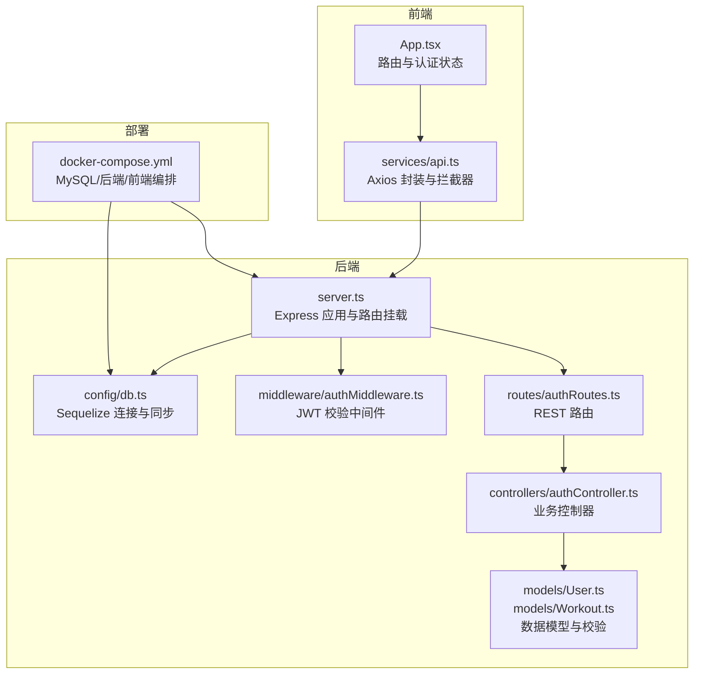
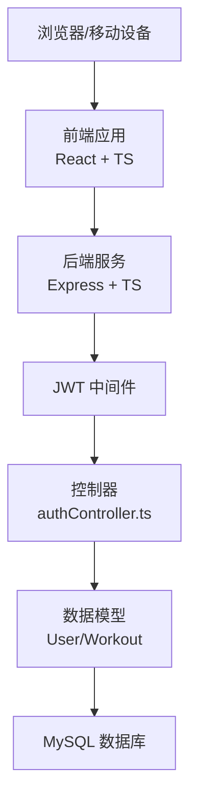
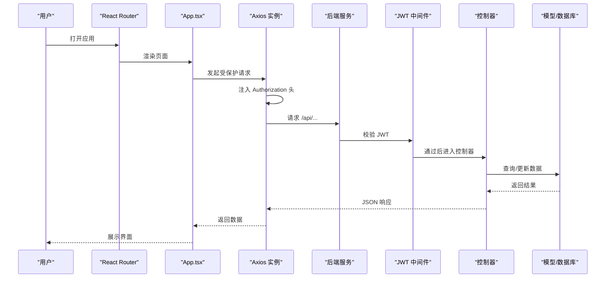
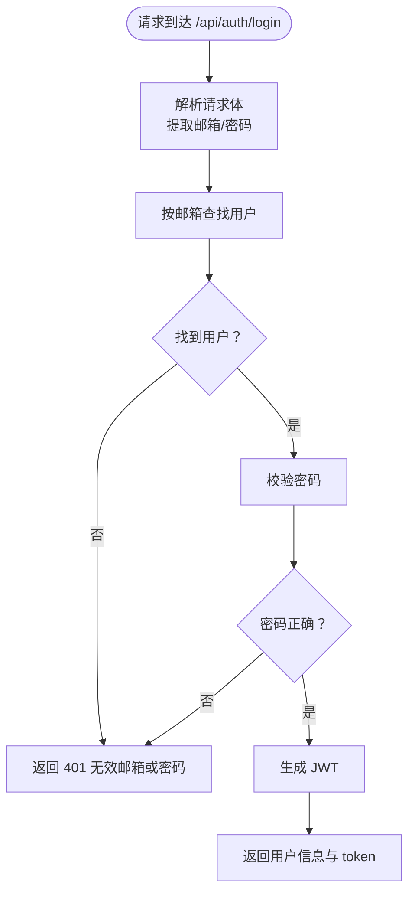
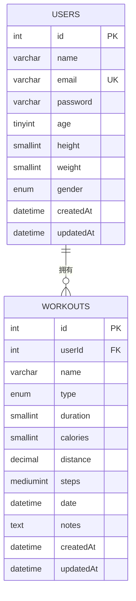
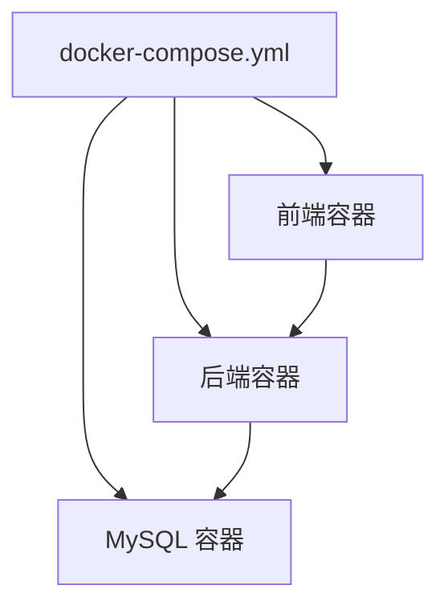
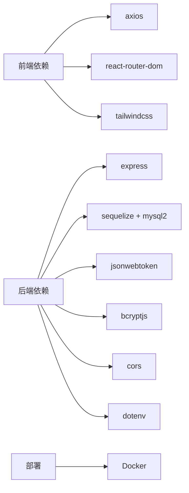

# 系统概述

<cite>
**本文引用的文件**
- [README.md](file://README.md)
- [backend/src/server.ts](file://backend/src/server.ts)
- [backend/src/config/db.ts](file://backend/src/config/db.ts)
- [backend/src/middleware/authMiddleware.ts](file://backend/src/middleware/authMiddleware.ts)
- [backend/src/models/User.ts](file://backend/src/models/User.ts)
- [backend/src/models/Workout.ts](file://backend/src/models/Workout.ts)
- [backend/src/routes/authRoutes.ts](file://backend/src/routes/authRoutes.ts)
- [backend/src/controllers/authController.ts](file://backend/src/controllers/authController.ts)
- [frontend/src/App.tsx](file://frontend/src/App.tsx)
- [frontend/src/services/api.ts](file://frontend/src/services/api.ts)
- [deployments/docker-compose.yml](file://deployments/docker-compose.yml)
- [docs/1. 项目介绍.md](file://docs/1. 项目介绍.md)
</cite>

## 目录
1. [引言](#引言)
2. [项目结构](#项目结构)
3. [核心组件](#核心组件)
4. [架构总览](#架构总览)
5. [详细组件分析](#详细组件分析)
6. [依赖关系分析](#依赖关系分析)
7. [性能考虑](#性能考虑)
8. [故障排查指南](#故障排查指南)
9. [结论](#结论)

## 引言
Fitness Tracker 是一个前后端分离的健身追踪与管理平台，旨在帮助用户完成从“注册登录”到“个人资料管理”、“运动数据记录”，再到“统计可视化”的完整闭环。系统采用现代化技术栈：前端使用 React + TypeScript + TailwindCSS + React Router + Axios；后端采用 Node.js + Express + TypeScript + MySQL + Sequelize + JWT + Bcryptjs；并通过 Docker 实现一键部署与服务编排。本文将从系统边界、核心功能、技术选型与集成方式等方面，为初学者提供概念性概述，同时为有经验的开发者提供代码级参考与架构图示。

## 项目结构
项目采用典型的前后端分离目录组织：
- 前端：位于 frontend/，包含页面组件、公共组件、API 服务封装与构建配置。
- 后端：位于 backend/，包含入口文件、配置、路由、控制器、中间件、数据模型与数据库连接。
- 部署：位于 deployments/，提供 Docker Compose 编排文件，一键拉起 MySQL、后端与前端服务。
- 文档：位于 docs/，包含项目介绍、快速开始、部署指南、API 文档、数据库设计等。

**图表来源**
- [frontend/src/App.tsx](file://frontend/src/App.tsx#L1-L48)
- [frontend/src/services/api.ts](file://frontend/src/services/api.ts#L1-L61)
- [backend/src/server.ts](file://backend/src/server.ts#L1-L36)
- [backend/src/config/db.ts](file://backend/src/config/db.ts#L1-L41)
- [backend/src/middleware/authMiddleware.ts](file://backend/src/middleware/authMiddleware.ts#L1-L36)
- [backend/src/models/User.ts](file://backend/src/models/User.ts#L1-L119)
- [backend/src/models/Workout.ts](file://backend/src/models/Workout.ts#L1-L122)
- [backend/src/routes/authRoutes.ts](file://backend/src/routes/authRoutes.ts#L1-L9)
- [backend/src/controllers/authController.ts](file://backend/src/controllers/authController.ts#L1-L71)
- [deployments/docker-compose.yml](file://deployments/docker-compose.yml#L1-L51)

**章节来源**
- [README.md](file://README.md#L1-L120)
- [docs/1. 项目介绍.md](file://docs/1. 项目介绍.md#L1-L81)

## 核心组件
- 前端应用（React + TypeScript）
  - 路由与导航：基于 React Router 的多页面布局，包含首页、登录、注册、仪表盘、运动记录、运动计划、个人资料等页面。
  - 认证状态：通过本地存储的 token 判断登录态，并在退出时清除 token。
  - API 通信：统一的 Axios 实例，自动注入 Authorization 头，便于后续扩展拦截器。
- 后端服务（Node.js + Express + TypeScript）
  - 应用入口：加载环境变量、连接数据库、启用 CORS 与 JSON 中间件、挂载各模块路由。
  - 数据库：使用 Sequelize 连接 MySQL，自动同步模型，提供安全的连接池配置。
  - 身份验证：JWT 生成与校验，配合中间件保护受保护路由。
  - 数据模型：User 与 Workout 模型定义字段、约束与关联关系，内置密码哈希钩子。
- 部署编排（Docker）
  - 通过 docker-compose.yml 同时启动 MySQL、后端与前端容器，设置环境变量与卷映射，确保服务间依赖顺序与持久化。

**章节来源**
- [frontend/src/App.tsx](file://frontend/src/App.tsx#L1-L48)
- [frontend/src/services/api.ts](file://frontend/src/services/api.ts#L1-L61)
- [backend/src/server.ts](file://backend/src/server.ts#L1-L36)
- [backend/src/config/db.ts](file://backend/src/config/db.ts#L1-L41)
- [backend/src/middleware/authMiddleware.ts](file://backend/src/middleware/authMiddleware.ts#L1-L36)
- [backend/src/models/User.ts](file://backend/src/models/User.ts#L1-L119)
- [backend/src/models/Workout.ts](file://backend/src/models/Workout.ts#L1-L122)
- [deployments/docker-compose.yml](file://deployments/docker-compose.yml#L1-L51)

## 架构总览
系统采用“前端 SPA + 后端 REST API + MySQL + Docker 编排”的分层架构。前端负责 UI 与交互，后端提供无状态 API，数据库持久化用户与运动数据。JWT 用于前后端无 Cookie 的认证，Axios 拦截器统一注入 token，确保受保护资源的安全访问。

**图表来源**
- [frontend/src/App.tsx](file://frontend/src/App.tsx#L1-L48)
- [frontend/src/services/api.ts](file://frontend/src/services/api.ts#L1-L61)
- [backend/src/server.ts](file://backend/src/server.ts#L1-L36)
- [backend/src/middleware/authMiddleware.ts](file://backend/src/middleware/authMiddleware.ts#L1-L36)
- [backend/src/controllers/authController.ts](file://backend/src/controllers/authController.ts#L1-L71)
- [backend/src/models/User.ts](file://backend/src/models/User.ts#L1-L119)
- [backend/src/models/Workout.ts](file://backend/src/models/Workout.ts#L1-L122)

## 详细组件分析

### 前端组件与交互流程
- 路由与认证状态
  - App.tsx 中通过 React Router 管理页面切换，并在启动时读取本地 token 判断登录态。
  - 提供注销回调，移除 token 并重置认证状态。
- API 服务
  - services/api.ts 创建 Axios 实例，统一设置基础 URL 与请求头，并在请求拦截器中自动附加 Authorization: Bearer token。
  - 暴露认证、用户、运动记录与统计相关的 API 方法，便于页面组件调用。

**图表来源**
- [frontend/src/App.tsx](file://frontend/src/App.tsx#L1-L48)
- [frontend/src/services/api.ts](file://frontend/src/services/api.ts#L1-L61)
- [backend/src/server.ts](file://backend/src/server.ts#L1-L36)
- [backend/src/middleware/authMiddleware.ts](file://backend/src/middleware/authMiddleware.ts#L1-L36)
- [backend/src/controllers/authController.ts](file://backend/src/controllers/authController.ts#L1-L71)
- [backend/src/models/User.ts](file://backend/src/models/User.ts#L1-L119)

**章节来源**
- [frontend/src/App.tsx](file://frontend/src/App.tsx#L1-L48)
- [frontend/src/services/api.ts](file://frontend/src/services/api.ts#L1-L61)

### 后端组件与数据流
- 应用入口与路由
  - server.ts 加载环境变量、连接数据库、启用 CORS 与 JSON 中间件，并将认证、用户、运动记录、统计等路由挂载到 /api/* 前缀下。
- 身份验证中间件
  - authMiddleware.ts 从 Authorization 头解析 Bearer token，使用 JWT_SECRET 校验签名，解析用户 ID 并从 User 模型查询用户信息（排除密码），将用户对象注入请求上下文以供后续控制器使用。
- 控制器与模型
  - authController.ts 实现注册与登录逻辑：注册前检查邮箱唯一性，创建用户并返回 JWT；登录时比对密码，成功后返回 JWT。
  - models/User.ts 定义用户字段、验证规则与密码哈希钩子；models/Workout.ts 定义运动记录字段、验证规则与与 User 的一对多关联。

**图表来源**
- [backend/src/controllers/authController.ts](file://backend/src/controllers/authController.ts#L1-L71)
- [backend/src/middleware/authMiddleware.ts](file://backend/src/middleware/authMiddleware.ts#L1-L36)
- [backend/src/models/User.ts](file://backend/src/models/User.ts#L1-L119)

**章节来源**
- [backend/src/server.ts](file://backend/src/server.ts#L1-L36)
- [backend/src/middleware/authMiddleware.ts](file://backend/src/middleware/authMiddleware.ts#L1-L36)
- [backend/src/controllers/authController.ts](file://backend/src/controllers/authController.ts#L1-L71)
- [backend/src/models/User.ts](file://backend/src/models/User.ts#L1-L119)
- [backend/src/models/Workout.ts](file://backend/src/models/Workout.ts#L1-L122)

### 数据模型与关系
- User 模型
  - 字段：id、name、email（唯一）、password、age、height、weight、gender、createdAt、updatedAt。
  - 验证：邮箱格式、密码长度、年龄/身高/体重范围。
  - 钩子：beforeCreate 与 beforeUpdate 对密码进行加盐哈希。
- Workout 模型
  - 字段：id、userId（外键）、name、type（枚举）、duration、calories、distance、steps、date、notes、createdAt、updatedAt。
  - 关联：User.hasMany(Workout)，Workout.belongsTo(User)。
- 数据库连接与同步
  - config/db.ts 使用 Sequelize 连接 MySQL，开启连接池，捕获连接错误并终止进程；同步所有模型，保证表结构与模型一致。

**图表来源**
- [backend/src/models/User.ts](file://backend/src/models/User.ts#L1-L119)
- [backend/src/models/Workout.ts](file://backend/src/models/Workout.ts#L1-L122)
- [backend/src/config/db.ts](file://backend/src/config/db.ts#L1-L41)

**章节来源**
- [backend/src/models/User.ts](file://backend/src/models/User.ts#L1-L119)
- [backend/src/models/Workout.ts](file://backend/src/models/Workout.ts#L1-L122)
- [backend/src/config/db.ts](file://backend/src/config/db.ts#L1-L41)

### 部署与运行
- Docker 编排
  - docker-compose.yml 启动三个服务：mysql、backend、frontend，分别映射端口并挂载数据库卷，设置 JWT_SECRET 与数据库连接参数，确保依赖顺序（backend 依赖 mysql，frontend 依赖 backend）。
- 开发与生产
  - README.md 提供了开发与生产构建/运行说明，前端默认运行在 3000，后端默认运行在 3001；Docker Compose 可一键部署生产环境。

**图表来源**
- [deployments/docker-compose.yml](file://deployments/docker-compose.yml#L1-L51)
- [README.md](file://README.md#L180-L210)

**章节来源**
- [deployments/docker-compose.yml](file://deployments/docker-compose.yml#L1-L51)
- [README.md](file://README.md#L180-L210)

## 依赖关系分析
- 前端依赖
  - axios：HTTP 客户端，统一请求与响应处理。
  - react-router-dom：路由管理，支持页面切换与导航。
  - tailwindcss：原子化 CSS 框架，便于快速构建响应式界面。
- 后端依赖
  - express：Web 框架，提供路由与中间件能力。
  - sequelize + mysql2：ORM 与驱动，简化数据库操作。
  - jsonwebtoken + bcryptjs：JWT 令牌与密码哈希。
  - cors + dotenv：跨域与环境变量管理。
- 部署依赖
  - Docker：容器化与编排，确保环境一致性与可移植性。

**图表来源**
- [frontend/package.json](file://frontend/package.json#L1-L32)
- [backend/package.json](file://backend/package.json#L1-L35)

**章节来源**
- [frontend/package.json](file://frontend/package.json#L1-L32)
- [backend/package.json](file://backend/package.json#L1-L35)

## 性能考虑
- 数据库连接池：Sequelize 默认启用连接池，合理配置最大连接数与空闲超时，避免高并发下的连接争用。
- 前端缓存策略：可在 API 层引入缓存（如 Redis）与条件请求（ETag/If-Modified-Since），减少重复请求。
- 前端渲染优化：对大型列表使用虚拟滚动、懒加载与分页，降低首屏压力。
- 静态资源：构建产物启用压缩与 CDN，缩短加载时间。
- 日志与监控：在生产环境开启关键路径日志与指标采集，便于定位性能瓶颈。

## 故障排查指南
- 后端无法连接数据库
  - 检查 .env 或 Docker 环境变量中的主机、端口、用户名、密码与数据库名是否正确。
  - 查看数据库容器健康状态与日志，确认端口映射与卷挂载。
- JWT 认证失败
  - 确认前端是否正确在请求头中携带 Authorization: Bearer token。
  - 检查后端 JWT_SECRET 是否与前端一致，且未被修改。
- 路由 401 未授权
  - 确认请求头中存在有效的 Bearer token，且 token 未过期。
  - 检查 authMiddleware 是否正确解析与校验 token。
- 前端无法访问后端 API
  - 确认后端服务已启动并监听指定端口，前端 Axios 基础 URL 与后端端口一致。
  - 检查 CORS 配置与防火墙设置。

**章节来源**
- [backend/src/config/db.ts](file://backend/src/config/db.ts#L1-L41)
- [backend/src/middleware/authMiddleware.ts](file://backend/src/middleware/authMiddleware.ts#L1-L36)
- [frontend/src/services/api.ts](file://frontend/src/services/api.ts#L1-L61)
- [deployments/docker-compose.yml](file://deployments/docker-compose.yml#L1-L51)

## 结论
Fitness Tracker 通过前后端分离架构实现了从用户认证到运动数据管理与统计可视化的完整功能闭环。前端以 React + TypeScript 构建响应式界面，后端以 Node.js + Express + TypeScript 提供 REST API，数据库采用 MySQL + Sequelize，JWT 保障无 Cookie 认证，Docker 实现一键部署。该架构具备良好的可维护性与扩展性，适合进一步引入图表库、权限细化、缓存与监控等能力，以满足更复杂的业务场景。