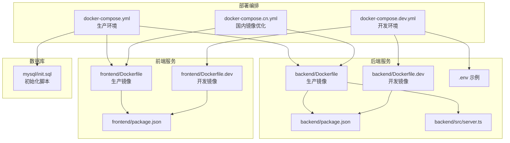
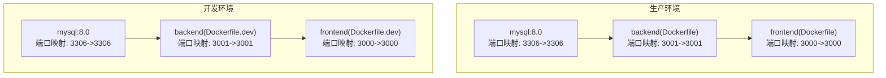

# 部署指南

<cite>
**本文引用的文件**
- [docker-compose.yml](file://deployments/docker-compose.yml)
- [docker-compose.dev.yml](file://deployments/docker-compose.dev.yml)
- [docker-compose.cn.yml](file://deployments/docker-compose.cn.yml)
- [Dockerfile（后端）](file://backend/Dockerfile)
- [Dockerfile.dev（后端）](file://backend/Dockerfile.dev)
- [Dockerfile（前端）](file://frontend/Dockerfile)
- [Dockerfile.dev（前端）](file://frontend/Dockerfile.dev)
- [后端环境变量示例](file://backend/.env)
- [初始化SQL脚本](file://mysql/init.sql)
- [后端入口文件](file://backend/src/server.ts)
- [后端包配置](file://backend/package.json)
- [前端包配置](file://frontend/package.json)
- [部署文档](file://docs/3. 部署指南.md)
</cite>

## 目录
1. [简介](#简介)
2. [项目结构](#项目结构)
3. [核心组件](#核心组件)
4. [架构总览](#架构总览)
5. [详细组件分析](#详细组件分析)
6. [依赖关系分析](#依赖关系分析)
7. [性能考虑](#性能考虑)
8. [故障排除指南](#故障排除指南)
9. [结论](#结论)
10. [附录](#附录)

## 简介
本节聚焦于部署架构，系统性说明生产环境与开发环境的Docker化部署流程，包括 docker-compose 配置、镜像构建与容器编排；同时覆盖传统部署方式的步骤与注意事项，涵盖环境变量配置、网络设置与数据持久化策略，并提供故障排除与性能优化建议。目标是帮助运维与开发团队快速、稳定地完成从本地到生产的部署迁移。

## 项目结构
该仓库采用前后端分离与数据库独立的服务化架构，通过 docker-compose 统一编排 MySQL、后端 API 与前端静态资源服务。生产与开发环境分别提供独立的 compose 配置，便于按需切换。

图表来源
- [docker-compose.yml](file://deployments/docker-compose.yml#L1-L51)
- [docker-compose.dev.yml](file://deployments/docker-compose.dev.yml#L1-L56)
- [docker-compose.cn.yml](file://deployments/docker-compose.cn.yml#L1-L52)
- [Dockerfile（后端）](file://backend/Dockerfile#L1-L23)
- [Dockerfile.dev（后端）](file://backend/Dockerfile.dev#L1-L20)
- [Dockerfile（前端）](file://frontend/Dockerfile#L1-L26)
- [Dockerfile.dev（前端）](file://frontend/Dockerfile.dev#L1-L20)
- [后端环境变量示例](file://backend/.env#L1-L10)
- [后端入口文件](file://backend/src/server.ts#L1-L36)
- [后端包配置](file://backend/package.json#L1-L35)
- [前端包配置](file://frontend/package.json#L1-L32)
- [初始化SQL脚本](file://mysql/init.sql#L1-L41)

章节来源
- [docker-compose.yml](file://deployments/docker-compose.yml#L1-L51)
- [docker-compose.dev.yml](file://deployments/docker-compose.dev.yml#L1-L56)
- [docker-compose.cn.yml](file://deployments/docker-compose.cn.yml#L1-L52)
- [Dockerfile（后端）](file://backend/Dockerfile#L1-L23)
- [Dockerfile（前端）](file://frontend/Dockerfile#L1-L26)
- [Dockerfile.dev（后端）](file://backend/Dockerfile.dev#L1-L20)
- [Dockerfile.dev（前端）](file://frontend/Dockerfile.dev#L1-L20)
- [后端环境变量示例](file://backend/.env#L1-L10)
- [后端入口文件](file://backend/src/server.ts#L1-L36)
- [后端包配置](file://backend/package.json#L1-L35)
- [前端包配置](file://frontend/package.json#L1-L32)
- [初始化SQL脚本](file://mysql/init.sql#L1-L41)

## 核心组件
- MySQL 数据库服务：通过镜像启动，使用命名卷进行数据持久化，并在首次启动时执行初始化脚本。
- 后端 API 服务：基于 Node.js 的 Express 应用，使用环境变量连接数据库，监听固定端口。
- 前端静态资源服务：基于静态文件服务提供生产构建产物，便于与后端 API 协同部署。

章节来源
- [docker-compose.yml](file://deployments/docker-compose.yml#L1-L51)
- [docker-compose.dev.yml](file://deployments/docker-compose.dev.yml#L1-L56)
- [docker-compose.cn.yml](file://deployments/docker-compose.cn.yml#L1-L52)
- [Dockerfile（后端）](file://backend/Dockerfile#L1-L23)
- [Dockerfile（前端）](file://frontend/Dockerfile#L1-L26)
- [初始化SQL脚本](file://mysql/init.sql#L1-L41)

## 架构总览
下图展示了生产与开发环境的容器编排关系、服务依赖与网络交互。后端依赖 MySQL，前端依赖后端 API；三者均位于同一 Docker 网络，可通过服务名相互访问。

图表来源
- [docker-compose.yml](file://deployments/docker-compose.yml#L1-L51)
- [docker-compose.dev.yml](file://deployments/docker-compose.dev.yml#L1-L56)

## 详细组件分析

### 生产环境部署流程
- 前提条件：安装 Docker Engine 与 Docker Compose。
- 部署步骤：
  - 克隆项目至服务器，进入根目录。
  - 使用 compose 文件启动全部服务，后台运行。
  - 查看服务状态与实时日志，确认各容器健康。
  - 如需停止，使用 down 命令清理。
- 环境变量与网络：
  - MySQL 初始化凭据与数据库名在 compose 中定义。
  - 后端通过环境变量连接数据库，服务间通过服务名通信。
- 数据持久化：
  - 使用命名卷保存 MySQL 数据，确保容器重建不丢失数据。

章节来源
- [docker-compose.yml](file://deployments/docker-compose.yml#L1-L51)
- [部署文档](file://docs/3. 部署指南.md#L18-L36)

### 开发环境部署流程
- 使用独立的 compose 文件启动开发服务，启用热重载与源码挂载。
- 后端与前端分别挂载源码目录，开发时可直接修改代码并即时生效。
- 环境变量与端口映射与生产一致，便于本地联调。

章节来源
- [docker-compose.dev.yml](file://deployments/docker-compose.dev.yml#L1-L56)
- [部署文档](file://docs/3. 部署指南.md#L38-L56)

### 国内镜像优化部署（可选）
- 在国内网络环境下，可使用专用 compose 文件，为 MySQL 设置字符集与认证插件参数，提升兼容性与稳定性。

章节来源
- [docker-compose.cn.yml](file://deployments/docker-compose.cn.yml#L1-L52)

### 镜像构建与容器编排
- 后端镜像构建：
  - 生产镜像：仅安装生产依赖，构建后端产物，暴露端口并以 Node 启动。
  - 开发镜像：安装全部依赖，暴露端口并以开发脚本启动。
- 前端镜像构建：
  - 生产镜像：仅安装生产依赖，构建静态资源，使用静态服务提供文件。
  - 开发镜像：安装全部依赖，暴露端口并以开发脚本启动。
- 容器编排：
  - MySQL、后端、前端分别定义，设置重启策略、端口映射、环境变量与依赖顺序。
  - 使用命名卷进行数据持久化，避免数据丢失。

章节来源
- [Dockerfile（后端）](file://backend/Dockerfile#L1-L23)
- [Dockerfile.dev（后端）](file://backend/Dockerfile.dev#L1-L20)
- [Dockerfile（前端）](file://frontend/Dockerfile#L1-L26)
- [Dockerfile.dev（前端）](file://frontend/Dockerfile.dev#L1-L20)
- [docker-compose.yml](file://deployments/docker-compose.yml#L1-L51)
- [docker-compose.dev.yml](file://deployments/docker-compose.dev.yml#L1-L56)
- [docker-compose.cn.yml](file://deployments/docker-compose.cn.yml#L1-L52)

### 传统部署方式（非容器）
- 数据库准备：创建数据库与用户，授权并刷新权限。
- 后端部署：安装依赖、构建 TypeScript、启动 Node 服务。
- 前端部署：安装依赖、构建生产版本，使用 Web 服务器提供静态文件。
- 环境变量：在后端 .env 中配置数据库连接与服务端口等参数。
- 注意事项：确保 Node 版本与 MySQL 版本满足要求；网络可达性与防火墙策略；生产环境建议配合反向代理与 HTTPS。

章节来源
- [部署文档](file://docs/3. 部署指南.md#L75-L141)
- [后端环境变量示例](file://backend/.env#L1-L10)

### 网络与服务发现
- 所有服务位于同一 Docker 网络，可通过服务名相互访问：
  - 前端访问后端 API：使用后端服务名与端口。
  - 后端访问 MySQL：使用 MySQL 服务名与端口。
- 端口映射：compose 中定义了宿主机与容器的端口映射，便于外部访问。

章节来源
- [部署文档](file://docs/3. 部署指南.md#L143-L148)
- [docker-compose.yml](file://deployments/docker-compose.yml#L1-L51)
- [docker-compose.dev.yml](file://deployments/docker-compose.dev.yml#L1-L56)

### 数据持久化策略
- MySQL 数据通过命名卷持久化，容器重建或删除不会丢失数据。
- 开发环境与生产环境分别使用不同的卷名，避免冲突。

章节来源
- [docker-compose.yml](file://deployments/docker-compose.yml#L1-L51)
- [docker-compose.dev.yml](file://deployments/docker-compose.dev.yml#L1-L56)
- [docker-compose.cn.yml](file://deployments/docker-compose.cn.yml#L1-L52)

### 后端启动与路由
- 后端入口加载环境变量，连接数据库，注册路由并启动服务。
- 路由前缀包含认证、用户、训练与统计模块，根路径返回服务信息。

章节来源
- [后端入口文件](file://backend/src/server.ts#L1-L36)
- [后端包配置](file://backend/package.json#L1-L35)

## 依赖关系分析
- 组件耦合：
  - 后端对 MySQL 存在直接依赖，通过环境变量配置连接信息。
  - 前端对后端 API 存在运行时依赖，需确保后端先于前端启动。
- 外部依赖：
  - MySQL 镜像、Node 运行时、静态文件服务工具。
- 可能的循环依赖：
  - 当前编排未形成循环依赖，服务启动顺序通过 depends_on 控制。

图表来源
- [docker-compose.yml](file://deployments/docker-compose.yml#L1-L51)
- [docker-compose.dev.yml](file://deployments/docker-compose.dev.yml#L1-L56)

章节来源
- [docker-compose.yml](file://deployments/docker-compose.yml#L1-L51)
- [docker-compose.dev.yml](file://deployments/docker-compose.dev.yml#L1-L56)

## 性能考虑
- 生产环境优化：
  - 使用多阶段构建减小镜像体积，降低拉取与启动时间。
  - 配置资源限制，避免资源争抢影响稳定性。
  - 使用反向代理（如 Nginx）提供静态文件服务，减轻前端服务压力。
- 开发环境优化：
  - 使用 .dockerignore 排除不必要的文件，减少构建上下文。
  - 合理配置卷挂载，避免频繁写入导致性能下降。
  - 利用缓存机制与增量构建，缩短开发迭代周期。
- 数据库优化：
  - 初始化脚本中建立索引，提升查询性能。
  - 在生产环境中调整 MySQL 参数以适配高并发场景（如连接池、缓冲区等）。

章节来源
- [部署文档](file://docs/3. 部署指南.md#L202-L213)
- [初始化SQL脚本](file://mysql/init.sql#L1-L41)

## 故障排除指南
- 常见问题与处理：
  - 端口冲突：修改 compose 中的端口映射，避免与宿主机占用冲突。
  - 构建失败：检查 Dockerfile 路径与脚本名称是否匹配，确认依赖安装成功。
  - 服务无法启动：查看对应服务日志，核对环境变量与依赖服务状态。
- 日志查看：
  - 查看所有服务日志、特定服务日志、实时日志与最近日志条目。
- 数据备份与恢复：
  - 使用 mysqldump 备份数据库，复制到宿主机；恢复时将备份文件拷回容器并导入数据库。

章节来源
- [部署文档](file://docs/3. 部署指南.md#L155-L186)
- [部署文档](file://docs/3. 部署指南.md#L231-L249)

## 结论
通过 docker-compose 的标准化编排，本项目实现了前后端与数据库的一键部署与管理。生产与开发环境的差异化配置满足不同阶段的需求，结合环境变量、网络与持久化策略，能够稳定支撑应用上线与日常维护。建议在生产环境中进一步完善资源限制、反向代理与安全加固，并持续优化构建与部署流程。

## 附录
- 环境变量参考（后端）：
  - NODE_ENV、PORT、JWT_SECRET、MYSQL_HOST、MYSQL_PORT、MYSQL_USER、MYSQL_PASSWORD、MYSQL_DATABASE。
- 端口映射参考：
  - 前端：3000 -> 3000
  - 后端：3001 -> 3001
  - MySQL：3306 -> 3306
- 数据库初始化：
  - 使用初始化脚本创建数据库、表与索引，确保首次启动可用。

章节来源
- [部署文档](file://docs/3. 部署指南.md#L58-L74)
- [docker-compose.yml](file://deployments/docker-compose.yml#L1-L51)
- [docker-compose.dev.yml](file://deployments/docker-compose.dev.yml#L1-L56)
- [初始化SQL脚本](file://mysql/init.sql#L1-L41)