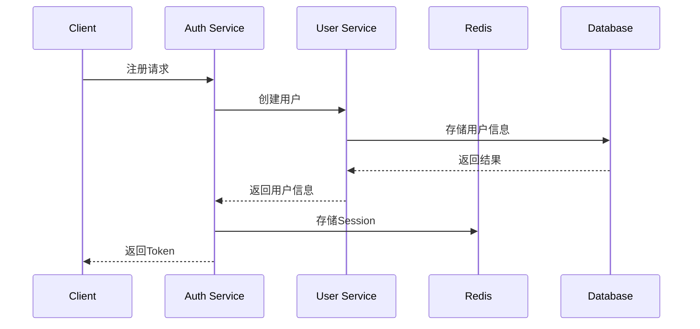
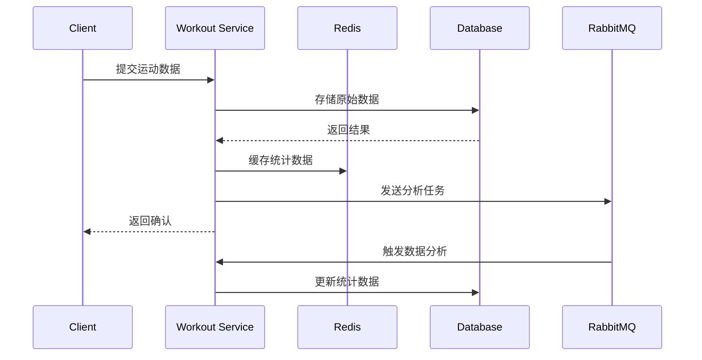

# 生产级健身健康追踪系统架构设计

## 1. 系统整体架构

```
┌─────────────────────────────────────────────────────────────────────┐
│                            Client Layer                             │
├─────────────────────────────────────────────────────────────────────┤
│  Web Browser (PWA) │ Mobile App │ Third-party Integrations          │
├─────────────────────────────────────────────────────────────────────┤
│                         API Gateway Layer                           │
├─────────────────────────────────────────────────────────────────────┤
│  Authentication Service  │  User Management Service  │  Workout Service  │
│  Profile Service         │  Nutrition Service        │  Social Service   │
│  Notification Service    │  Analytics Service        │  Device Sync Service │
├─────────────────────────────────────────────────────────────────────┤
│                   Microservices Orchestration                      │
│                   (Kubernetes/K8s or Docker Swarm)                 │
├─────────────────────────────────────────────────────────────────────┤
│        Message Queue         │         Cache          │   Storage    │
│    (RabbitMQ/Kafka)          │      (Redis)           │  (MinIO/S3)  │
├─────────────────────────────────────────────────────────────────────┤
│                          Data Layer                                 │
│         MySQL (Primary)      │     MySQL (Replica)     │   Elasticsearch  │
└─────────────────────────────────────────────────────────────────────┘
```

## 2. 模块划分

### 2.1 前端模块
- **用户认证模块**：登录、注册、OAuth2集成
- **个人中心模块**：个人资料、健康档案、设置
- **运动记录模块**：运动数据录入、查看、统计
- **膳食记录模块**：饮食记录、营养分析
- **社交互动模块**：动态分享、排行榜、好友系统
- **智能计划模块**：训练计划、推荐算法
- **数据可视化模块**：图表展示、趋势分析
- **通知中心模块**：消息推送、邮件通知

### 2.2 后端服务模块
- **认证服务（Authentication Service）**
  - 用户注册/登录
  - OAuth2集成（微信、Apple、Google）
  - JWT Token管理
  - Session管理

- **用户管理服务（User Management Service）**
  - 用户资料管理
  - 多租户支持
  - 角色权限管理
  - 用户设备同步

- **健康档案服务（Profile Service）**
  - 健康指标管理（BMI、体脂率等）
  - 健康历史数据
  - 健康趋势分析

- **运动服务（Workout Service）**
  - 运动记录管理
  - 运动计划制定
  - 运动数据分析
  - 实时数据处理

- **营养服务（Nutrition Service）**
  - 食物数据库
  - 膳食记录
  - 营养分析计算
  - 健康饮食评分

- **社交服务（Social Service）**
  - 朋友圈动态
  - 排行榜
  - 成就系统
  - 好友关系管理

- **通知服务（Notification Service）**
  - 邮件通知
  - 短信通知
  - APP推送
  - 通知模板管理

- **分析服务（Analytics Service）**
  - 数据统计
  - 趋势分析
  - 预测模型
  - 报表生成

- **设备同步服务（Device Sync Service）**
  - 第三方设备数据同步
  - 数据格式转换
  - 同步状态管理

### 2.3 中间件和基础设施
- **消息队列**：处理异步任务（通知发送、数据同步等）
- **缓存系统**：提升系统性能（用户会话、热点数据）
- **文件存储**：存储用户上传的文件（头像、运动轨迹等）
- **搜索引擎**：支持复杂的搜索需求（食物搜索等）
- **监控系统**：系统性能监控、错误追踪

## 3. 技术选型

### 3.1 前端技术栈
- **核心框架**：React 18 + TypeScript
- **状态管理**：Redux Toolkit
- **数据获取**：React Query + Axios
- **UI组件库**：shadcn/ui + TailwindCSS
- **图表库**：Recharts
- **路由管理**：React Router v6
- **构建工具**：Vite
- **PWA支持**：Workbox

### 3.2 后端技术栈
- **核心框架**：Node.js 18 + Express + TypeScript
- **架构模式**：Clean Architecture（整洁架构）
- **ORM框架**：Sequelize
- **数据库**：MySQL 8.0
- **缓存**：Redis
- **消息队列**：RabbitMQ
- **认证授权**：JWT + OAuth2
- **API文档**：Swagger + OpenAPI
- **日志系统**：Winston
- **测试框架**：Jest + Supertest
- **任务调度**：node-cron + Bull

### 3.3 DevOps技术栈
- **容器化**：Docker
- **编排工具**：Docker Compose
- **反向代理**：Nginx
- **CI/CD**：GitHub Actions
- **监控**：Prometheus + Grafana
- **日志收集**：ELK Stack (Elasticsearch, Logstash, Kibana)

## 4. 系统特性设计

### 4.1 多租户架构
- 基于tenant_id实现数据隔离
- 支持不同健身教练/工作室独立使用
- 租户配置管理

### 4.2 权限控制系统
- 基于RBAC（基于角色的访问控制）
- 三种用户角色：
  - 普通用户：基础功能使用
  - 教练：用户管理、训练计划制定
  - 管理员：系统配置、数据审计

### 4.3 数据安全
- 敏感数据加密存储
- HTTPS通信
- SQL注入防护
- XSS攻击防护
- CSRF防护

### 4.4 性能优化
- 数据库读写分离
- Redis缓存热点数据
- CDN加速静态资源
- 数据库索引优化
- 数据库分区策略

### 4.5 高可用性
- 服务集群部署
- 负载均衡
- 数据库主从复制
- 自动故障转移

## 5. 部署架构

### 5.1 开发环境
- 单机部署
- Docker Compose编排
- 本地数据库

### 5.2 测试环境
- 与生产环境相似的配置
- 自动化测试集成
- 性能压测环境

### 5.3 生产环境
- Kubernetes集群部署
- 多节点负载均衡
- 数据库主从架构
- Redis集群
- RabbitMQ集群
- Nginx反向代理

## 6. 数据流向

### 6.1 用户注册登录流程


### 6.2 运动数据记录流程


## 7. 扩展性考虑

### 7.1 微服务拆分
- 每个业务领域独立为一个服务
- 服务间通过API或消息队列通信
- 独立部署和扩展

### 7.2 数据库扩展
- 垂直分库：不同业务数据存储在不同数据库
- 水平分表：大数据量表按时间或用户ID分表
- 读写分离：主库写入，从库读取

### 7.3 缓存策略
- 多级缓存：浏览器缓存 -> CDN -> 应用缓存 -> 数据库缓存
- 缓存预热：热点数据提前加载到缓存
- 缓存更新：数据变更时同步更新缓存

## 8. 监控和运维

### 8.1 系统监控
- 应用性能监控（APM）
- 数据库性能监控
- 服务器资源监控
- 网络流量监控

### 8.2 日志管理
- 统一日志格式
- 日志分级管理
- 日志收集和分析
- 错误追踪和报警

### 8.3 自动化运维
- 自动化部署
- 自动化扩缩容
- 自动化故障恢复
- 自动化备份